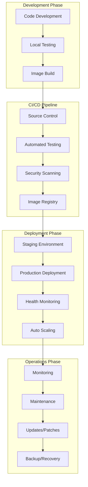
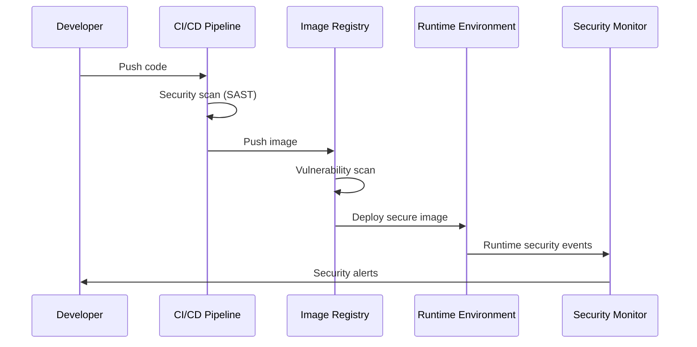

# Session 7: 프로덕션 운영 모범 사례

## 📍 교과과정에서의 위치
이 세션은 **Week 2 > Day 2 > Session 7**로, 디버깅 및 문제 해결 기법 이해를 바탕으로 프로덕션 환경에서의 컨테이너 운영 모범 사례와 자동화 전략을 심화 분석합니다.

## 학습 목표 (5분)
- **프로덕션 환경** 컨테이너 **라이프사이클 관리** 전략
- **보안 운영 절차** 및 **컴플라이언스** 관리 방법론
- **자동화 및 CI/CD** 통합을 통한 **운영 효율성** 극대화

## 1. 이론: 컨테이너 라이프사이클 관리 (20분)

### 프로덕션 라이프사이클 아키텍처



### 배포 전략 및 패턴

```
프로덕션 배포 전략:

블루-그린 배포:
├── 두 개의 동일한 프로덕션 환경 운영
├── 새 버전을 그린 환경에 배포
├── 트래픽을 블루에서 그린으로 전환
├── 문제 발생 시 즉시 롤백 가능
├── 다운타임 최소화 (거의 제로)
├── 리소스 비용 2배 필요
├── 데이터베이스 마이그레이션 복잡성
└── 상태 비저장 애플리케이션에 적합

카나리 배포:
├── 새 버전을 소수 사용자에게 점진적 배포
├── 트래픽의 일정 비율만 새 버전으로 라우팅
├── 메트릭 모니터링을 통한 점진적 확대
├── 문제 발생 시 영향 범위 최소화
├── A/B 테스트와 결합 가능
├── 세밀한 트래픽 제어 필요
├── 복잡한 모니터링 및 알림 체계
└── 사용자 경험 기반 검증

롤링 업데이트:
├── 기존 인스턴스를 하나씩 순차적 교체
├── 서비스 중단 없이 점진적 업데이트
├── 리소스 효율적 (추가 인스턴스 최소)
├── 업데이트 진행 상황 실시간 모니터링
├── 문제 발생 시 자동 롤백
├── 헬스 체크 기반 업데이트 제어
├── 데이터베이스 호환성 고려 필요
└── Kubernetes 기본 배포 전략

이뮤터블 인프라:
├── 인프라 구성 요소를 불변으로 관리
├── 변경 시 새로운 인스턴스로 교체
├── 설정 드리프트 방지
├── 일관된 환경 보장
├── 버전 관리 및 추적 용이
├── 빠른 롤백 및 복구
├── Infrastructure as Code 필수
└── 컨테이너와 자연스럽게 결합
```

### 환경별 관리 전략

```
환경 분리 및 관리:

개발 환경 (Development):
├── 개발자 개별 환경 또는 공유 환경
├── 빠른 피드백을 위한 자동 배포
├── 디버깅 도구 및 개발 편의 기능
├── 리소스 제한 완화
├── 실험적 기능 테스트
├── 로컬 개발 환경과 동기화
└── 데이터 마스킹 및 테스트 데이터

스테이징 환경 (Staging):
├── 프로덕션과 동일한 구성
├── 통합 테스트 및 성능 테스트
├── 사용자 승인 테스트 (UAT)
├── 보안 테스트 및 취약점 스캔
├── 배포 프로세스 검증
├── 모니터링 및 알림 테스트
└── 데이터 마이그레이션 검증

프로덕션 환경 (Production):
├── 고가용성 및 확장성 보장
├── 강화된 보안 및 모니터링
├── 자동화된 백업 및 복구
├── 성능 최적화 및 튜닝
├── 컴플라이언스 및 감사 로그
├── 장애 대응 및 에스컬레이션
└── 비즈니스 연속성 계획

환경 간 일관성:
├── Infrastructure as Code 활용
├── 컨테이너 이미지 동일성 보장
├── 환경별 설정 외부화
├── 자동화된 환경 프로비저닝
├── 환경별 테스트 자동화
└── 설정 드리프트 모니터링
```

## 2. 이론: 보안 운영 및 컴플라이언스 (15분)

### 보안 운영 체계



### 보안 모범 사례

```
컨테이너 보안 운영:

이미지 보안 관리:
├── 신뢰할 수 있는 베이스 이미지 사용
├── 정기적인 이미지 업데이트 및 패치
├── 이미지 취약점 스캔 자동화
├── 이미지 서명 및 검증 (Docker Content Trust)
├── 프라이빗 레지스트리 사용
├── 이미지 레이어 최소화
├── 시크릿 정보 이미지 포함 금지
└── 멀티 스테이지 빌드로 공격 표면 축소

런타임 보안 강화:
├── 비특권 사용자로 컨테이너 실행
├── 읽기 전용 루트 파일시스템
├── 불필요한 Linux Capabilities 제거
├── Seccomp 프로필 적용
├── AppArmor/SELinux 정책 활용
├── 네트워크 정책 및 세그멘테이션
├── 리소스 제한 및 격리 강화
└── 런타임 보안 모니터링

접근 제어 및 인증:
├── RBAC (Role-Based Access Control)
├── 최소 권한 원칙 적용
├── 다단계 인증 (MFA) 구현
├── API 키 및 토큰 관리
├── 서비스 간 인증 (mTLS)
├── 감사 로그 및 추적
├── 정기적인 권한 검토
└── 자동화된 접근 권한 관리

데이터 보호:
├── 전송 중 데이터 암호화 (TLS)
├── 저장 데이터 암호화
├── 시크릿 관리 시스템 활용
├── 개인정보 마스킹 및 익명화
├── 데이터 백업 암호화
├── 키 관리 및 로테이션
└── 데이터 분류 및 라벨링
```

### 컴플라이언스 관리

```
규정 준수 체계:

주요 컴플라이언스 표준:
├── SOC 2 (Service Organization Control 2)
├── ISO 27001 (정보보안 관리시스템)
├── PCI DSS (Payment Card Industry Data Security Standard)
├── HIPAA (Health Insurance Portability and Accountability Act)
├── GDPR (General Data Protection Regulation)
├── SOX (Sarbanes-Oxley Act)
├── FedRAMP (Federal Risk and Authorization Management Program)
└── 국가별 개인정보보호법

컴플라이언스 자동화:
├── 정책 as Code 구현
├── 자동화된 컴플라이언스 검사
├── 지속적인 모니터링 및 보고
├── 위반 사항 자동 탐지 및 알림
├── 감사 로그 자동 수집
├── 컴플라이언스 대시보드
├── 정기적인 컴플라이언스 평가
└── 자동화된 증거 수집

거버넌스 체계:
├── 보안 정책 및 절차 문서화
├── 역할 및 책임 명확화
├── 정기적인 보안 교육 및 훈련
├── 인시던트 대응 계획
├── 비즈니스 연속성 계획
├── 공급업체 보안 평가
├── 제3자 보안 감사
└── 지속적인 개선 프로세스
```

## 3. 이론: 자동화 및 운영 효율성 (10분)

### CI/CD 파이프라인 통합

```
자동화 파이프라인 구성:

소스 코드 관리:
├── Git 기반 버전 관리
├── 브랜치 전략 (GitFlow, GitHub Flow)
├── 코드 리뷰 및 승인 프로세스
├── 자동화된 코드 품질 검사
├── 의존성 관리 및 업데이트
├── 라이선스 컴플라이언스 검사
└── 보안 취약점 스캔 (SAST)

빌드 및 테스트 자동화:
├── 자동화된 빌드 프로세스
├── 단위 테스트 및 통합 테스트
├── 성능 테스트 및 부하 테스트
├── 보안 테스트 (DAST, IAST)
├── 이미지 취약점 스캔
├── 컨테이너 이미지 최적화
└── 테스트 결과 리포팅

배포 자동화:
├── 환경별 자동 배포
├── 배포 승인 워크플로우
├── 카나리 배포 자동화
├── 롤백 자동화
├── 헬스 체크 및 검증
├── 배포 알림 및 추적
└── 배포 메트릭 수집

운영 자동화:
├── 인프라 프로비저닝 자동화
├── 설정 관리 자동화
├── 모니터링 및 알림 자동화
├── 백업 및 복구 자동화
├── 스케일링 자동화
├── 패치 관리 자동화
└── 인시던트 대응 자동화
```

### 운영 효율성 최적화

```
운영 최적화 전략:

리소스 최적화:
├── 자동 스케일링 정책 최적화
├── 리소스 사용률 모니터링
├── 비용 최적화 및 예산 관리
├── 용량 계획 및 예측
├── 멀티 클라우드 전략
├── 스팟 인스턴스 활용
└── 리소스 태깅 및 추적

성능 최적화:
├── 애플리케이션 성능 모니터링 (APM)
├── 데이터베이스 성능 튜닝
├── 캐싱 전략 최적화
├── CDN 및 엣지 컴퓨팅 활용
├── 네트워크 최적화
├── 스토리지 성능 튜닝
└── 코드 레벨 최적화

운영 프로세스 개선:
├── 표준화된 운영 절차 (SOP)
├── 자동화된 문서 생성
├── 지식 베이스 구축
├── 온콜 로테이션 관리
├── 인시던트 포스트모템
├── 지속적인 개선 (Kaizen)
└── 팀 간 협업 도구 통합
```

## 4. 개념 예시: 프로덕션 운영 구성 (12분)

### CI/CD 파이프라인 예시

```yaml
# GitHub Actions 워크플로우 (개념 예시)
name: Production Deployment

on:
  push:
    branches: [main]
  pull_request:
    branches: [main]

jobs:
  test:
    runs-on: ubuntu-latest
    steps:
    - uses: actions/checkout@v3
    
    - name: Run tests
      run: |
        docker build -t myapp:test .
        docker run --rm myapp:test npm test
    
    - name: Security scan
      run: |
        docker run --rm -v /var/run/docker.sock:/var/run/docker.sock \
          aquasec/trivy image myapp:test

  build:
    needs: test
    runs-on: ubuntu-latest
    if: github.ref == 'refs/heads/main'
    
    steps:
    - uses: actions/checkout@v3
    
    - name: Build and push
      run: |
        docker build -t myregistry/myapp:${{ github.sha }} .
        docker push myregistry/myapp:${{ github.sha }}
    
    - name: Sign image
      run: |
        cosign sign myregistry/myapp:${{ github.sha }}

  deploy:
    needs: build
    runs-on: ubuntu-latest
    environment: production
    
    steps:
    - name: Deploy to production
      run: |
        kubectl set image deployment/myapp \
          myapp=myregistry/myapp:${{ github.sha }}
        kubectl rollout status deployment/myapp
```

### 모니터링 및 알림 설정 예시

```yaml
# Prometheus 알림 규칙 (개념 예시)
groups:
- name: production.rules
  rules:
  - alert: HighErrorRate
    expr: rate(http_requests_total{status=~"5.."}[5m]) > 0.1
    for: 5m
    labels:
      severity: critical
      team: backend
    annotations:
      summary: "High error rate detected"
      description: "Error rate is {{ $value }}% for {{ $labels.service }}"
      runbook: "https://wiki.company.com/runbooks/high-error-rate"

  - alert: HighMemoryUsage
    expr: container_memory_usage_bytes / container_spec_memory_limit_bytes > 0.9
    for: 10m
    labels:
      severity: warning
      team: platform
    annotations:
      summary: "Container memory usage is high"
      description: "Memory usage is {{ $value }}% for {{ $labels.container }}"

  - alert: PodCrashLooping
    expr: rate(kube_pod_container_status_restarts_total[15m]) > 0
    for: 5m
    labels:
      severity: critical
      team: platform
    annotations:
      summary: "Pod is crash looping"
      description: "Pod {{ $labels.pod }} is restarting frequently"
```

### 보안 정책 구성 예시

```yaml
# Pod Security Policy (개념 예시)
apiVersion: policy/v1beta1
kind: PodSecurityPolicy
metadata:
  name: production-psp
spec:
  privileged: false
  allowPrivilegeEscalation: false
  requiredDropCapabilities:
    - ALL
  volumes:
    - 'configMap'
    - 'emptyDir'
    - 'projected'
    - 'secret'
    - 'downwardAPI'
    - 'persistentVolumeClaim'
  runAsUser:
    rule: 'MustRunAsNonRoot'
  seLinux:
    rule: 'RunAsAny'
  fsGroup:
    rule: 'RunAsAny'
  readOnlyRootFilesystem: true
```

### 백업 및 복구 자동화 예시

```bash
#!/bin/bash
# 자동화된 백업 스크립트 (개념 예시)

# 환경 변수 설정
BACKUP_DATE=$(date +%Y%m%d_%H%M%S)
BACKUP_DIR="/backups"
RETENTION_DAYS=30

# 데이터베이스 백업
kubectl exec deployment/postgres -- pg_dump -U postgres mydb > \
  ${BACKUP_DIR}/db_backup_${BACKUP_DATE}.sql

# 볼륨 백업
kubectl get pv -o json | jq -r '.items[].spec.hostPath.path' | \
while read volume; do
  tar -czf ${BACKUP_DIR}/volume_backup_${BACKUP_DATE}.tar.gz $volume
done

# 설정 백업
kubectl get configmaps,secrets -o yaml > \
  ${BACKUP_DIR}/config_backup_${BACKUP_DATE}.yaml

# 클라우드 스토리지 업로드
aws s3 cp ${BACKUP_DIR}/ s3://my-backup-bucket/$(date +%Y/%m/%d)/ --recursive

# 오래된 백업 정리
find ${BACKUP_DIR} -name "*backup*" -mtime +${RETENTION_DAYS} -delete

# 백업 검증
if [ $? -eq 0 ]; then
  echo "Backup completed successfully at $(date)"
  # 성공 알림 전송
  curl -X POST -H 'Content-type: application/json' \
    --data '{"text":"Backup completed successfully"}' \
    $SLACK_WEBHOOK_URL
else
  echo "Backup failed at $(date)"
  # 실패 알림 전송
  curl -X POST -H 'Content-type: application/json' \
    --data '{"text":"Backup failed - immediate attention required"}' \
    $SLACK_WEBHOOK_URL
fi
```

## 5. 토론 및 정리 (8분)

### 핵심 개념 정리
- **프로덕션 라이프사이클** 관리와 배포 전략
- **보안 운영** 체계와 컴플라이언스 자동화
- **CI/CD 통합**을 통한 운영 효율성 극대화
- **모니터링 기반** 자동화된 운영 관리

### 토론 주제
"대규모 프로덕션 환경에서 안정성, 보안, 효율성을 동시에 보장하는 최적의 운영 전략은 무엇인가?"

## 💡 핵심 키워드
- **라이프사이클 관리**: 배포 전략, 환경 분리, 이뮤터블 인프라
- **보안 운영**: 이미지 보안, 런타임 보안, 컴플라이언스
- **자동화**: CI/CD, 인프라 자동화, 운영 자동화
- **운영 효율성**: 리소스 최적화, 성능 최적화, 프로세스 개선

## 📚 참고 자료
- [Docker 프로덕션 가이드](https://docs.docker.com/config/containers/start-containers-automatically/)
- [Kubernetes 보안 모범 사례](https://kubernetes.io/docs/concepts/security/)
- [CI/CD 파이프라인 설계](https://www.redhat.com/en/topics/devops/what-cicd-pipeline)
