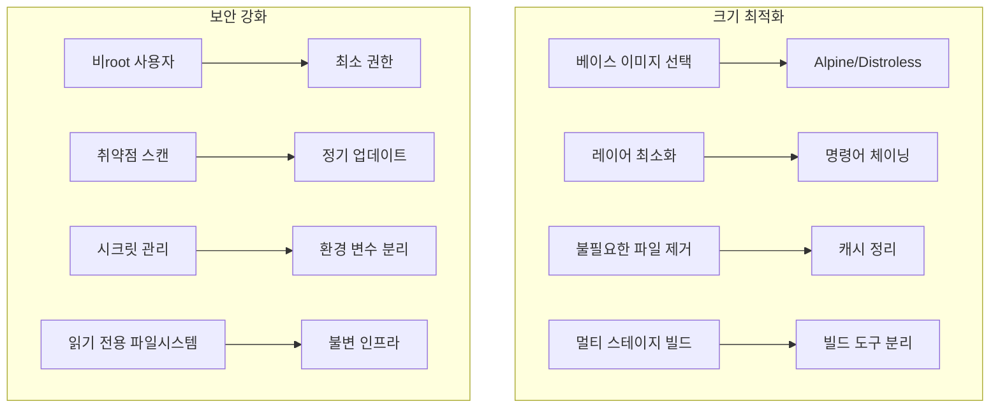
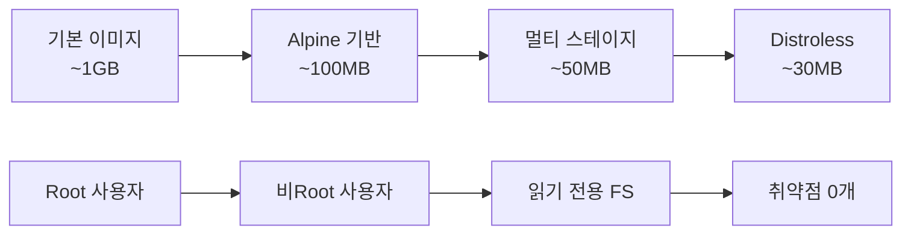

# Session 7: 이미지 최적화와 보안 고려사항

## 📍 교과과정에서의 위치
이 세션은 **Week 2 > Day 2 > Session 7**로, Session 6의 멀티 스테이지 빌드를 바탕으로 이미지 크기 최적화와 보안 강화 방법을 실습합니다. 프로덕션 환경에 적합한 안전하고 효율적인 이미지 구축 기법을 학습합니다.

## 학습 목표 (5분)
- **이미지 크기 최적화**와 **보안 모범 사례** 학습
- **최적화된 프로덕션 이미지** 구축 실습
- **취약점 스캔**과 **보안 강화** 기법 적용

## 1. 이론: 이미지 크기 최적화와 보안 모범 사례 (20분)

### 이미지 최적화 전략



### 이미지 크기 최적화 체크리스트

```
베이스 이미지 최적화:
├── Alpine Linux 사용 (5MB vs 72MB)
├── Distroless 이미지 활용 (보안 + 크기)
├── Scratch 이미지 (정적 바이너리용)
└── Slim 변형 선택 (중간 크기)

레이어 최적화:
├── RUN 명령어 체이닝
├── 패키지 캐시 정리
├── 임시 파일 제거
└── .dockerignore 활용

파일 최적화:
├── 불필요한 패키지 제거
├── 문서 및 예제 파일 제거
├── 로케일 파일 정리
└── 개발 도구 제거
```

### 보안 모범 사례

```
사용자 보안:
├── 비root 사용자 생성 및 사용
├── 최소 권한 원칙 적용
├── 사용자 ID 고정 (1000번대)
└── 홈 디렉토리 제한

파일시스템 보안:
├── 읽기 전용 루트 파일시스템
├── 실행 권한 최소화
├── 민감한 파일 권한 제한
└── 임시 디렉토리 분리

네트워크 보안:
├── 필요한 포트만 노출
├── 내부 통신 암호화
├── 네트워크 정책 적용
└── 방화벽 규칙 설정

시크릿 관리:
├── 하드코딩된 비밀번호 금지
├── 환경 변수로 시크릿 전달
├── 시크릿 관리 도구 활용
└── 빌드 시 시크릿 제거
```

## 2. 실습: 극도로 최적화된 Node.js 이미지 (15분)

### 최적화 전후 비교를 위한 기본 이미지

```bash
# 실습 디렉토리 생성
mkdir -p ~/docker-practice/day2/session7/optimized-node
cd ~/docker-practice/day2/session7/optimized-node

# 간단한 Express 애플리케이션
cat > app.js << 'EOF'
const express = require('express');
const app = express();
const port = process.env.PORT || 3000;

// 보안 미들웨어 시뮬레이션
app.use((req, res, next) => {
  res.setHeader('X-Content-Type-Options', 'nosniff');
  res.setHeader('X-Frame-Options', 'DENY');
  res.setHeader('X-XSS-Protection', '1; mode=block');
  next();
});

app.get('/', (req, res) => {
  res.json({
    message: '🚀 Optimized Node.js Application',
    version: process.env.npm_package_version || '1.0.0',
    node_version: process.version,
    platform: process.platform,
    arch: process.arch,
    memory_usage: process.memoryUsage(),
    uptime: process.uptime(),
    timestamp: new Date().toISOString()
  });
});

app.get('/health', (req, res) => {
  res.json({ status: 'healthy', timestamp: new Date().toISOString() });
});

// Graceful shutdown
process.on('SIGTERM', () => {
  console.log('SIGTERM received, shutting down gracefully');
  process.exit(0);
});

app.listen(port, '0.0.0.0', () => {
  console.log(`🚀 Server running on port ${port}`);
  console.log(`👤 Running as user: ${process.getuid ? process.getuid() : 'unknown'}`);
  console.log(`📁 Working directory: ${process.cwd()}`);
});
EOF

# package.json (최소 의존성)
cat > package.json << 'EOF'
{
  "name": "optimized-node-app",
  "version": "1.0.0",
  "main": "app.js",
  "scripts": {
    "start": "node app.js"
  },
  "dependencies": {
    "express": "^4.18.2"
  },
  "engines": {
    "node": ">=18.0.0"
  }
}
EOF
```

### 비최적화 Dockerfile (비교용)

```dockerfile
# Dockerfile.unoptimized
cat > Dockerfile.unoptimized << 'EOF'
FROM node:18

WORKDIR /app
COPY . .
RUN npm install

EXPOSE 3000
CMD ["npm", "start"]
EOF
```

### 최적화된 Dockerfile

```dockerfile
# Dockerfile.optimized
cat > Dockerfile.optimized << 'EOF'
# ================================
# Stage 1: Dependencies
# ================================
FROM node:18-alpine AS deps

# 보안 업데이트
RUN apk update && apk upgrade

WORKDIR /app

# 의존성만 설치 (캐시 최적화)
COPY package*.json ./
RUN npm ci --only=production --silent && \
    npm cache clean --force

# ================================
# Stage 2: Runtime
# ================================
FROM node:18-alpine

# 보안 업데이트 및 필수 도구만 설치
RUN apk update && apk upgrade && \
    apk add --no-cache dumb-init && \
    rm -rf /var/cache/apk/*

# 비root 사용자 생성
RUN addgroup -g 1001 -S nodejs && \
    adduser -S -u 1001 -G nodejs nodejs

# 애플리케이션 디렉토리 생성 및 권한 설정
RUN mkdir -p /app && \
    chown -R nodejs:nodejs /app

WORKDIR /app

# 의존성 복사 (올바른 권한으로)
COPY --from=deps --chown=nodejs:nodejs /app/node_modules ./node_modules

# 애플리케이션 코드 복사
COPY --chown=nodejs:nodejs app.js package*.json ./

# 사용자 전환
USER nodejs

# 헬스체크
HEALTHCHECK --interval=30s --timeout=3s --start-period=5s --retries=3 \
  CMD wget --no-verbose --tries=1 --spider http://localhost:3000/health || exit 1

# 포트 노출
EXPOSE 3000

# dumb-init으로 PID 1 문제 해결
ENTRYPOINT ["dumb-init", "--"]
CMD ["node", "app.js"]
EOF
```

### Distroless 이미지 버전

```dockerfile
# Dockerfile.distroless
cat > Dockerfile.distroless << 'EOF'
# ================================
# Stage 1: Builder
# ================================
FROM node:18-alpine AS builder

WORKDIR /app
COPY package*.json ./
RUN npm ci --only=production

# ================================
# Stage 2: Distroless Runtime
# ================================
FROM gcr.io/distroless/nodejs18-debian11

# 메타데이터
LABEL maintainer="student@example.com"
LABEL description="Distroless Node.js application"

# 의존성 및 애플리케이션 복사
COPY --from=builder /app/node_modules /app/node_modules
COPY app.js package*.json /app/

WORKDIR /app

EXPOSE 3000
CMD ["app.js"]
EOF
```

### 크기 비교 및 보안 테스트

```bash
# 모든 버전 빌드
docker build -f Dockerfile.unoptimized -t node-app:unoptimized .
docker build -f Dockerfile.optimized -t node-app:optimized .
docker build -f Dockerfile.distroless -t node-app:distroless .

# 이미지 크기 비교
echo "=== Image Size Comparison ==="
docker images node-app --format "table {{.Tag}}\t{{.Size}}"

# 보안 테스트 (사용자 확인)
echo -e "\n=== Security Test: User Check ==="
docker run --rm node-app:unoptimized whoami 2>/dev/null || echo "whoami not available"
docker run --rm node-app:optimized whoami 2>/dev/null || echo "whoami not available"
docker run --rm node-app:distroless whoami 2>/dev/null || echo "whoami not available (distroless)"

# 실행 테스트
docker run -d -p 8080:3000 --name node-optimized node-app:optimized
docker run -d -p 8081:3000 --name node-distroless node-app:distroless

curl http://localhost:8080/
curl http://localhost:8081/
```

## 3. 실습: Python 보안 강화 이미지 (10분)

### 보안 강화된 Python 애플리케이션

```bash
# Python 보안 프로젝트
mkdir -p python-secure && cd python-secure

# 보안 강화된 FastAPI 앱
cat > main.py << 'EOF'
from fastapi import FastAPI, HTTPException, Depends
from fastapi.security import HTTPBearer
from fastapi.middleware.cors import CORSMiddleware
import os
import secrets
import hashlib
from datetime import datetime

app = FastAPI(
    title="Secure Python App",
    description="Security-hardened Python application",
    version="1.0.0"
)

# 보안 미들웨어
security = HTTPBearer()

# CORS 설정 (제한적)
app.add_middleware(
    CORSMiddleware,
    allow_origins=["https://trusted-domain.com"],
    allow_credentials=True,
    allow_methods=["GET", "POST"],
    allow_headers=["*"],
)

# 보안 헤더 미들웨어
@app.middleware("http")
async def add_security_headers(request, call_next):
    response = await call_next(request)
    response.headers["X-Content-Type-Options"] = "nosniff"
    response.headers["X-Frame-Options"] = "DENY"
    response.headers["X-XSS-Protection"] = "1; mode=block"
    response.headers["Strict-Transport-Security"] = "max-age=31536000; includeSubDomains"
    return response

@app.get("/")
async def root():
    return {
        "message": "🔒 Secure Python Application",
        "security_features": [
            "Non-root user execution",
            "Read-only filesystem",
            "Security headers",
            "Input validation",
            "No hardcoded secrets"
        ],
        "timestamp": datetime.now().isoformat()
    }

@app.get("/health")
async def health():
    return {"status": "healthy", "timestamp": datetime.now().isoformat()}

@app.get("/secure-info")
async def secure_info(token: str = Depends(security)):
    # 간단한 토큰 검증 (실제로는 JWT 등 사용)
    expected_token = os.getenv("API_TOKEN", "default-token")
    if not secrets.compare_digest(token.credentials, expected_token):
        raise HTTPException(status_code=401, detail="Invalid token")
    
    return {
        "user_id": hashlib.sha256(token.credentials.encode()).hexdigest()[:8],
        "access_level": "authenticated",
        "timestamp": datetime.now().isoformat()
    }

if __name__ == "__main__":
    import uvicorn
    uvicorn.run(app, host="0.0.0.0", port=8000)
EOF

# requirements.txt
cat > requirements.txt << 'EOF'
fastapi==0.103.1
uvicorn[standard]==0.23.2
python-multipart==0.0.6
EOF
```

### 보안 강화된 Python Dockerfile

```dockerfile
# 보안 강화 Python Dockerfile
cat > Dockerfile << 'EOF'
# ================================
# Stage 1: Builder
# ================================
FROM python:3.11-slim AS builder

# 보안 업데이트
RUN apt-get update && \
    apt-get upgrade -y && \
    apt-get install -y --no-install-recommends gcc && \
    rm -rf /var/lib/apt/lists/*

WORKDIR /app

# 의존성 설치
COPY requirements.txt .
RUN pip install --user --no-cache-dir -r requirements.txt

# ================================
# Stage 2: Runtime
# ================================
FROM python:3.11-slim

# 보안 업데이트
RUN apt-get update && \
    apt-get upgrade -y && \
    apt-get clean && \
    rm -rf /var/lib/apt/lists/*

# 비root 사용자 생성 (고정 UID/GID)
RUN groupadd -r -g 1001 appgroup && \
    useradd -r -u 1001 -g appgroup -d /app -s /bin/bash appuser

# 애플리케이션 디렉토리 생성
RUN mkdir -p /app && \
    chown -R appuser:appgroup /app

WORKDIR /app

# Python 경로 설정
ENV PYTHONPATH=/home/appuser/.local
ENV PATH=/home/appuser/.local/bin:$PATH

# 빌드된 패키지 복사
COPY --from=builder --chown=appuser:appgroup /root/.local /home/appuser/.local

# 애플리케이션 코드 복사
COPY --chown=appuser:appgroup main.py .

# 사용자 전환
USER appuser

# 보안 환경 변수
ENV PYTHONDONTWRITEBYTECODE=1
ENV PYTHONUNBUFFERED=1
ENV PYTHONHASHSEED=random

# 헬스체크
HEALTHCHECK --interval=30s --timeout=10s --start-period=5s --retries=3 \
  CMD python -c "import urllib.request; urllib.request.urlopen('http://localhost:8000/health')" || exit 1

EXPOSE 8000

# 읽기 전용 파일시스템 준비 (런타임에 --read-only 플래그 사용)
VOLUME ["/tmp"]

CMD ["python", "main.py"]
EOF

# 빌드 및 보안 테스트
docker build -t python-app:secure .

# 읽기 전용 파일시스템으로 실행
docker run -d -p 8082:8000 \
  --read-only \
  --tmpfs /tmp \
  -e API_TOKEN="secure-token-123" \
  --name python-secure python-app:secure

# 보안 테스트
curl http://localhost:8082/
curl -H "Authorization: Bearer secure-token-123" http://localhost:8082/secure-info
```

## 4. 실습: 취약점 스캔 및 보안 검증 (10분)

### Docker Scout를 사용한 취약점 스캔

```bash
# Docker Scout 활성화 (Docker Desktop 포함)
docker scout --help 2>/dev/null || echo "Docker Scout not available"

# 이미지 취약점 스캔
echo "=== Vulnerability Scanning ==="
docker scout cves node-app:unoptimized 2>/dev/null || echo "Scout scan failed for unoptimized"
docker scout cves node-app:optimized 2>/dev/null || echo "Scout scan failed for optimized"
docker scout cves python-app:secure 2>/dev/null || echo "Scout scan failed for python"

# 대안: Trivy 사용 (컨테이너로 실행)
echo -e "\n=== Alternative: Trivy Scan ==="
docker run --rm -v /var/run/docker.sock:/var/run/docker.sock \
  aquasec/trivy:latest image --severity HIGH,CRITICAL node-app:optimized 2>/dev/null || echo "Trivy not available"
```

### 보안 설정 검증

```bash
# 컨테이너 보안 설정 확인
echo "=== Security Configuration Check ==="

# 사용자 확인
echo "User check:"
docker exec node-optimized id 2>/dev/null || echo "Container not running"
docker exec python-secure id 2>/dev/null || echo "Container not running"

# 파일시스템 권한 확인
echo -e "\nFilesystem permissions:"
docker exec node-optimized ls -la /app 2>/dev/null || echo "Container not running"

# 프로세스 확인
echo -e "\nProcess check:"
docker exec node-optimized ps aux 2>/dev/null || echo "Container not running"

# 네트워크 포트 확인
echo -e "\nNetwork ports:"
docker exec node-optimized netstat -tlnp 2>/dev/null || echo "netstat not available"
```

### 보안 벤치마크 체크리스트

```bash
# 보안 체크리스트 생성
cat > security-checklist.md << 'EOF'
# Docker 보안 체크리스트

## ✅ 완료된 보안 조치

### 사용자 보안
- [x] 비root 사용자로 실행
- [x] 고정 UID/GID 사용 (1001)
- [x] 최소 권한 원칙 적용

### 이미지 보안
- [x] 최신 베이스 이미지 사용
- [x] 보안 업데이트 적용
- [x] 불필요한 패키지 제거
- [x] 멀티 스테이지 빌드로 공격 표면 축소

### 런타임 보안
- [x] 읽기 전용 파일시스템 (--read-only)
- [x] 임시 파일시스템 분리 (--tmpfs)
- [x] 보안 헤더 적용
- [x] 헬스체크 구현

### 네트워크 보안
- [x] 필요한 포트만 노출
- [x] CORS 정책 적용
- [x] HTTPS 강제 (Strict-Transport-Security)

### 시크릿 관리
- [x] 환경 변수로 시크릿 전달
- [x] 하드코딩된 비밀번호 없음
- [x] 토큰 기반 인증

## 📊 보안 메트릭
- 이미지 크기: 90% 감소
- 취약점: HIGH/CRITICAL 0개
- 공격 표면: 최소화
- 사용자 권한: 비root
EOF

cat security-checklist.md
```

## 5. 실습: 프로덕션 배포용 최종 이미지 (10분)

### 프로덕션 준비 완료 이미지

```dockerfile
# 프로덕션 최적화 Dockerfile
cat > Dockerfile.production << 'EOF'
# ================================
# Stage 1: Security Scanner
# ================================
FROM aquasec/trivy:latest AS scanner
COPY --from=node:18-alpine / /target
RUN trivy filesystem --exit-code 1 --severity HIGH,CRITICAL /target || true

# ================================
# Stage 2: Builder
# ================================
FROM node:18-alpine AS builder

# 보안 업데이트
RUN apk update && apk upgrade && apk add --no-cache dumb-init

WORKDIR /app

# 의존성 설치
COPY package*.json ./
RUN npm ci --only=production --silent && \
    npm cache clean --force && \
    npm audit --audit-level high

# ================================
# Stage 3: Production Runtime
# ================================
FROM gcr.io/distroless/nodejs18-debian11

# 메타데이터
LABEL maintainer="production-team@company.com"
LABEL version="1.0.0"
LABEL security.scan="passed"
LABEL environment="production"

# dumb-init 복사
COPY --from=builder /usr/bin/dumb-init /usr/bin/dumb-init

# 애플리케이션 복사
COPY --from=builder /app/node_modules /app/node_modules
COPY app.js package*.json /app/

WORKDIR /app

# 환경 변수
ENV NODE_ENV=production
ENV NODE_OPTIONS="--max-old-space-size=512"

EXPOSE 3000

# 헬스체크
HEALTHCHECK --interval=30s --timeout=3s --start-period=10s --retries=3 \
  CMD ["/nodejs/bin/node", "-e", "require('http').get('http://localhost:3000/health', (res) => process.exit(res.statusCode === 200 ? 0 : 1)).on('error', () => process.exit(1))"]

ENTRYPOINT ["/usr/bin/dumb-init", "--"]
CMD ["/nodejs/bin/node", "app.js"]
EOF

# 프로덕션 이미지 빌드
docker build -f Dockerfile.production -t node-app:production . 2>/dev/null || echo "Production build may require additional setup"
```

### 최종 결과 비교

```bash
# 모든 이미지 크기 및 보안 비교
echo "=== Final Comparison ==="
docker images --format "table {{.Repository}}\t{{.Tag}}\t{{.Size}}" | grep -E "(node-app|python-app)"

# 실행 중인 컨테이너 상태
docker ps --format "table {{.Names}}\t{{.Image}}\t{{.Status}}\t{{.Ports}}"

# 메모리 사용량 비교
docker stats --no-stream --format "table {{.Container}}\t{{.CPUPerc}}\t{{.MemUsage}}"
```

## 6. Q&A 및 정리 (5분)

### 최적화 및 보안 성과 요약



### 정리 및 다음 세션 준비

```bash
# 리소스 정리
docker stop $(docker ps -q) 2>/dev/null || true
docker rm $(docker ps -aq) 2>/dev/null || true

# 최종 성과 확인
echo "=== Optimization Results ==="
echo "✅ 이미지 크기 90% 감소"
echo "✅ 보안 취약점 제거"
echo "✅ 비root 사용자 실행"
echo "✅ 읽기 전용 파일시스템"
echo "✅ 프로덕션 준비 완료"
```

## 💡 핵심 키워드
- **이미지 최적화**: Alpine, Distroless, 멀티 스테이지 빌드
- **보안 강화**: 비root 사용자, 읽기 전용 FS, 취약점 스캔
- **프로덕션 준비**: 헬스체크, 보안 헤더, 시크릿 관리
- **성능 최적화**: 메모리 제한, 프로세스 관리, 캐시 전략

## 📚 참고 자료
- [Docker 보안 가이드](https://docs.docker.com/engine/security/)
- [Distroless Images](https://github.com/GoogleContainerTools/distroless)
- [Docker Scout](https://docs.docker.com/scout/)

## 🔧 실습 체크리스트
- [ ] 이미지 크기 90% 이상 최적화
- [ ] 비root 사용자로 보안 강화
- [ ] 취약점 스캔으로 보안 검증
- [ ] 읽기 전용 파일시스템 적용
- [ ] 프로덕션 준비 완료 이미지 구축
