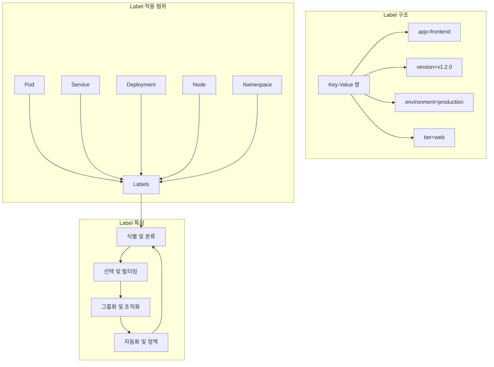
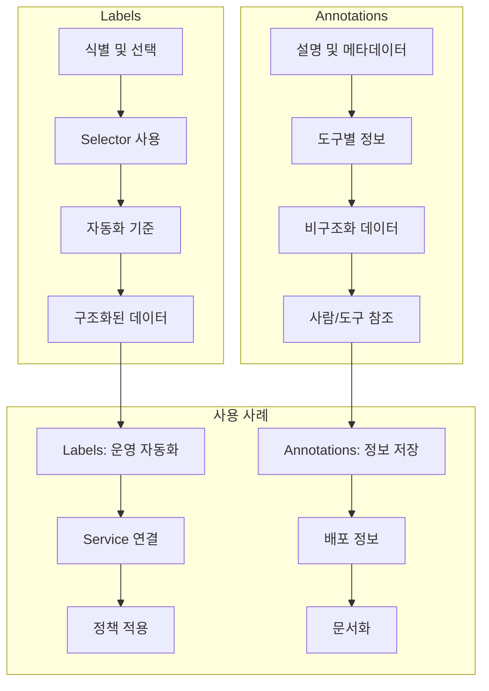
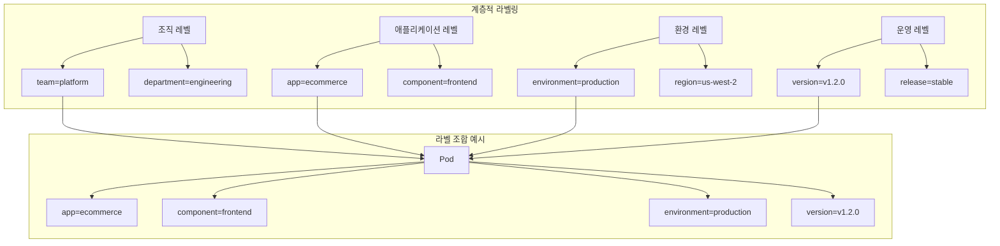

# Session 7: Labels과 Selectors

## 📍 교과과정에서의 위치
이 세션은 **Week 2 > Day 2 > Session 7**로, Kubernetes의 메타데이터 관리 시스템인 Labels과 Selectors의 개념과 활용 방안을 학습합니다. 오브젝트 간 연결과 관리의 핵심 메커니즘을 이해합니다.

## 학습 목표 (5분)
- **Label** 시스템과 **메타데이터** 관리 개념 완전 이해
- **Selector** 패턴과 **오브젝트 연결** 메커니즘 학습
- **Annotation**과 **추가 메타데이터** 활용 방안 파악
- **라벨링 전략**과 **모범 사례** 이해

## 1. Label 시스템과 메타데이터 관리 (15분)

### Label 기본 개념



### Label 시스템 특성
```
Label 시스템 구조:

기본 특성:
   🔹 Key-Value 형태의 메타데이터
   🔹 리소스 식별 및 분류 목적
   🔹 선택적 속성 (필수 아님)
   🔹 동적 추가/수정/삭제 가능
   🔹 쿼리 및 필터링 지원
   🔹 자동화 및 정책 적용 기준

Key 규칙:
   🔹 최대 253자 (prefix + name)
   🔹 DNS 서브도메인 형식 prefix (선택적)
   🔹 Name 부분: 63자 이하
   🔹 영숫자, 하이픈, 밑줄, 점 사용
   🔹 영숫자로 시작/끝
   🔹 예: kubernetes.io/name, app, version

Value 규칙:
   🔹 최대 63자
   🔹 영숫자, 하이픈, 밑줄, 점 사용
   🔹 영숫자로 시작/끝
   🔹 빈 문자열 허용
   🔹 특수문자 제한
   🔹 예: frontend, v1.2.0, production

Label 네임스페이스:
   🔹 kubernetes.io/ : Kubernetes 시스템 예약
   🔹 k8s.io/ : Kubernetes 시스템 예약
   🔹 사용자 정의 prefix 권장
   🔹 조직별 네이밍 컨벤션
   🔹 충돌 방지를 위한 도메인 사용
   🔹 예: company.com/team, myorg.io/project

일반적인 Label 패턴:
   🔹 app: 애플리케이션 이름
   🔹 version: 버전 정보
   🔹 component: 구성 요소 (frontend, backend)
   🔹 part-of: 상위 애플리케이션
   🔹 managed-by: 관리 도구
   🔹 environment: 환경 (dev, staging, prod)
   🔹 tier: 계층 (web, api, database)
   🔹 release: 릴리스 식별자
```

## 2. Selector 패턴과 오브젝트 연결 메커니즘 (12분)

### Selector 타입과 동작 방식

```mermaid
graph TB
    subgraph "Equality-based Selector"
        A[app=frontend] --> B[environment=production]
        B --> C[version!=v1.0.0]
    end
    
    subgraph "Set-based Selector"
        D[environment in (production,staging)] --> E[tier notin (cache)]
        E --> F[partition exists]
        F --> G[!canary]
    end
    
    subgraph "Selector 사용 예"
        H[Service] --> I[Pod 선택]
        J[Deployment] --> K[ReplicaSet 관리]
        L[NetworkPolicy] --> M[트래픽 제어]
        N[PodDisruptionBudget] --> O[중단 정책]
    end
    
    A --> H
    D --> J
    C --> L
    G --> N
```

### Selector 메커니즘 분석
```
Selector 동작 원리:

Equality-based Selector:
   🔹 등호 기반 선택 (=, ==, !=)
   🔹 단순하고 직관적
   🔹 정확한 매칭 필요
   🔹 여러 조건은 AND 연산
   🔹 예: app=frontend,version=v1.2.0
   🔹 레거시 API에서 주로 사용

Set-based Selector:
   🔹 집합 기반 선택 (in, notin, exists)
   🔹 유연하고 강력한 표현
   🔹 다중 값 매칭 가능
   🔹 존재 여부 확인 가능
   🔹 예: environment in (prod,staging)
   🔹 최신 API에서 권장

Selector 적용 범위:
   🔹 Service → Pod 선택
   🔹 Deployment → ReplicaSet 관리
   🔹 ReplicaSet → Pod 관리
   🔹 Job → Pod 생성
   🔹 DaemonSet → Node 선택
   🔹 NetworkPolicy → 트래픽 제어
   🔹 PodDisruptionBudget → 중단 정책
   🔹 HorizontalPodAutoscaler → 대상 선택

매칭 프로세스:
   🔹 Label이 있는 리소스 식별
   🔹 Selector 조건과 비교
   🔹 모든 조건 만족 시 선택
   🔹 동적 업데이트 반영
   🔹 실시간 관계 유지
   🔹 자동 연결/해제

선택 정확성:
   🔹 의도하지 않은 리소스 선택 방지
   🔹 고유한 Label 조합 사용
   🔹 네임스페이스 범위 고려
   🔹 Label 변경 시 영향 분석
   🔹 테스트 환경에서 검증
```

## 3. Annotation과 추가 메타데이터 활용 (10분)

### Annotation vs Label 비교



### Annotation 활용 패턴
```
Annotation 활용 방안:

기본 특성:
   🔹 Key-Value 형태 (Label과 동일)
   🔹 선택 기준으로 사용 불가
   🔹 임의 크기 데이터 저장 가능
   🔹 구조화/비구조화 데이터 모두 지원
   🔹 도구별 메타데이터 저장
   🔹 사람이 읽을 수 있는 정보

일반적인 사용 사례:
   🔹 배포 정보 (배포자, 시간, 버전)
   🔹 연락처 정보 (팀, 담당자)
   🔹 문서 링크 (위키, 가이드)
   🔹 도구별 설정 (Ingress, 모니터링)
   🔹 변경 이력 (changelog, commit)
   🔹 정책 정보 (보안, 컴플라이언스)
   🔹 디버깅 정보 (로그, 트레이스)
   🔹 비즈니스 메타데이터

도구별 Annotation 예시:
   🔹 nginx.ingress.kubernetes.io/rewrite-target
   🔹 prometheus.io/scrape: "true"
   🔹 fluentd.org/exclude: "true"
   🔹 cert-manager.io/cluster-issuer
   🔹 deployment.kubernetes.io/revision
   🔹 kubectl.kubernetes.io/last-applied-configuration
   🔹 사용자 정의 도구 설정

Label vs Annotation 선택 기준:
   🔹 선택/필터링 필요 → Label
   🔹 자동화 기준 → Label
   🔹 구조화된 식별자 → Label
   🔹 설명/문서화 → Annotation
   🔹 도구별 설정 → Annotation
   🔹 대용량 데이터 → Annotation
   🔹 사람이 읽는 정보 → Annotation
   🔹 임시/실험적 정보 → Annotation
```

## 4. 라벨링 전략과 모범 사례 (10분)

### 라벨링 전략 아키텍처



### 라벨링 모범 사례
```
라벨링 전략 설계:

계층적 라벨링:
   🔹 조직 구조 반영 (team, department)
   🔹 애플리케이션 구조 (app, component)
   🔹 환경 분류 (environment, region)
   🔹 버전 관리 (version, release)
   🔹 운영 분류 (tier, criticality)
   🔹 일관된 네이밍 컨벤션

필수 Label 세트:
   🔹 app: 애플리케이션 식별자
   🔹 version: 버전 정보
   🔹 component: 구성 요소
   🔹 environment: 환경 구분
   🔹 managed-by: 관리 주체
   🔹 조직별 추가 필수 Label

Label 네이밍 컨벤션:
   🔹 소문자 사용 (kebab-case)
   🔹 의미 있는 이름 선택
   🔹 약어보다 전체 단어
   🔹 일관된 용어 사용
   🔹 계층 구조 반영
   🔹 국제화 고려 (영어 권장)

값 표준화:
   🔹 환경: dev, staging, prod
   🔹 티어: frontend, backend, database
   🔹 버전: semantic versioning
   🔹 불린: true/false (문자열)
   🔹 열거형: 미리 정의된 값
   🔹 일관된 형식 유지

라벨 관리 정책:
   🔹 필수 Label 정의 및 강제
   🔹 Label 변경 승인 프로세스
   🔹 자동화된 Label 적용
   🔹 Label 사용 모니터링
   🔹 정기적인 Label 정리
   🔹 문서화 및 교육
   🔹 도구를 통한 검증

안티 패턴 방지:
   🔹 너무 많은 Label 사용
   🔹 동적 값의 Label 사용
   🔹 민감 정보 Label 포함
   🔹 일관성 없는 네이밍
   🔹 중복된 의미의 Label
   🔹 선택 기준 없는 Label

자동화 활용:
   🔹 Admission Controller를 통한 강제
   🔹 GitOps를 통한 일관성 유지
   🔹 정책 엔진 (OPA) 활용
   🔹 모니터링 도구 연동
   🔹 CI/CD 파이프라인 통합
   🔹 자동 Label 생성
```

## 💬 그룹 토론: 효과적인 라벨링 전략과 운영 효율성 (8분)

### 토론 주제
**"대규모 Kubernetes 환경에서 효과적인 라벨링 전략을 수립하고 운영 효율성을 높이기 위한 방안은 무엇인가?"**

### 토론 가이드라인

#### 라벨링 전략 설계 (3분)
- **계층적 구조**: 조직과 애플리케이션 구조 반영
- **표준화**: 일관된 네이밍과 값 체계
- **자동화**: 정책 기반 Label 관리

#### 운영 효율성 향상 (3분)
- **선택 최적화**: 효율적인 Selector 설계
- **모니터링**: Label 사용 패턴 분석
- **거버넌스**: Label 정책 및 컴플라이언스

#### 실무 적용 고려사항 (2분)
- **마이그레이션**: 기존 시스템의 Label 전환
- **도구 연동**: 모니터링, 로깅 도구와의 통합
- **팀 협업**: 개발팀과 운영팀 간 Label 규칙 공유

## 💡 핵심 개념 정리
- **Label**: Key-Value 메타데이터, 선택 및 분류 기준
- **Selector**: Label 기반 리소스 선택 메커니즘
- **Annotation**: 설명적 메타데이터, 도구별 정보 저장
- **라벨링 전략**: 계층적 구조, 표준화, 자동화

## 📚 참고 자료
- [Labels and Selectors](https://kubernetes.io/docs/concepts/overview/working-with-objects/labels/)
- [Annotations](https://kubernetes.io/docs/concepts/overview/working-with-objects/annotations/)
- [Recommended Labels](https://kubernetes.io/docs/concepts/overview/working-with-objects/common-labels/)

## 다음 세션 준비
다음 세션에서는 **오브젝트 관계 및 설계 패턴**에 대해 학습합니다. Kubernetes 오브젝트 간의 관계와 전체적인 설계 원칙을 종합적으로 정리할 예정입니다.