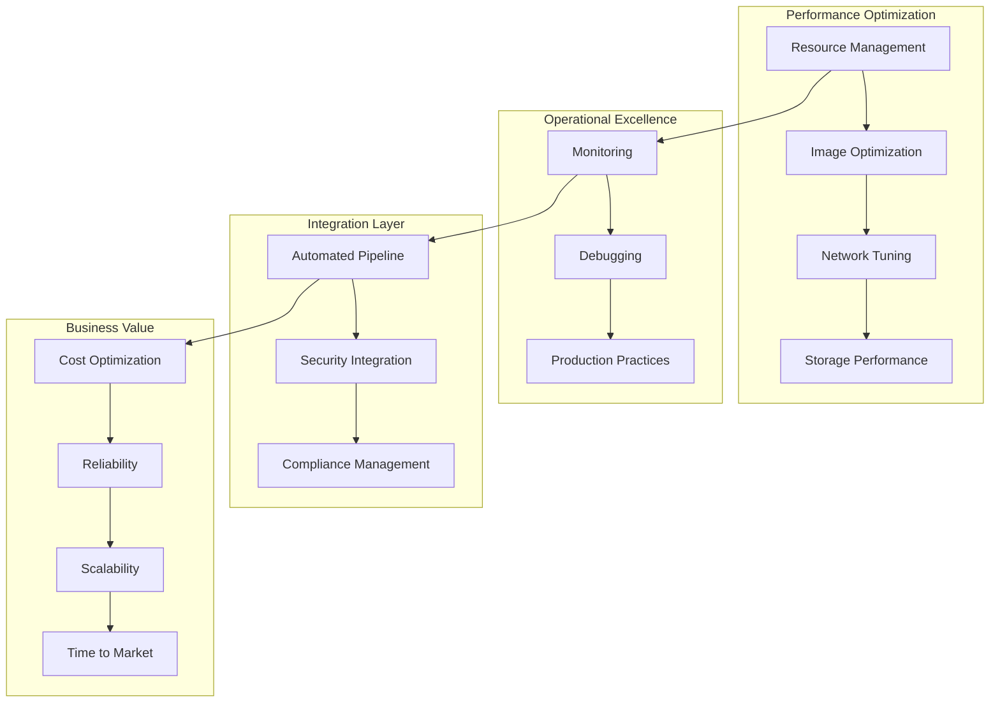
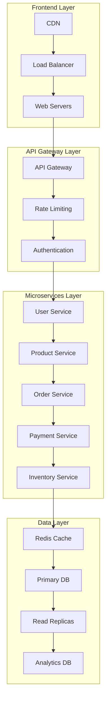

# Session 8: Day 2 종합 정리 및 실무 케이스 스터디

## 📍 교과과정에서의 위치
이 세션은 **Week 2 > Day 2 > Session 8**로, 하루 동안 학습한 컨테이너 최적화 및 운영 관리 이론들을 종합 정리하고 실제 운영 사례를 통한 심화 분석을 진행합니다.

## 학습 목표 (5분)
- **컨테이너 최적화 기법들** 간의 **통합적 적용** 전략 수립
- **실제 운영 사례** 기반 **문제 해결** 능력 배양
- **성능, 보안, 운영 효율성**의 **균형잡힌 최적화** 방법론

## 1. 종합 정리: 컨테이너 최적화 통합 전략 (15분)

### 최적화 영역별 통합 뷰



### 최적화 우선순위 매트릭스

```
최적화 영역별 우선순위:

고영향-저비용 (Quick Wins):
├── 리소스 제한 설정 최적화
├── 이미지 크기 최소화 (멀티 스테이지)
├── 기본 모니터링 구성
├── 로그 레벨 최적화
├── 헬스 체크 구현
├── 기본 보안 설정 강화
└── 자동화된 백업 구성

고영향-고비용 (Major Projects):
├── 마이크로서비스 아키텍처 전환
├── 서비스 메시 도입
├── 고급 모니터링 시스템 구축
├── 멀티 클라우드 전략 구현
├── 제로 트러스트 보안 아키텍처
├── AI/ML 기반 운영 자동화
└── 엔터프라이즈 컴플라이언스 체계

저영향-저비용 (Fill-ins):
├── 로그 포맷 표준화
├── 문서화 개선
├── 개발자 도구 최적화
├── 테스트 커버리지 향상
├── 코드 품질 도구 도입
└── 팀 교육 및 훈련

저영향-고비용 (Avoid):
├── 과도한 도구 도입
├── 불필요한 기술 스택 복잡화
├── 과잉 엔지니어링
├── 검증되지 않은 신기술 도입
└── 비즈니스 가치 없는 최적화

통합 최적화 전략:
├── 비즈니스 목표와 기술 목표 정렬
├── 단계적 최적화 로드맵 수립
├── 메트릭 기반 성과 측정
├── 지속적인 개선 문화 구축
├── 팀 간 협업 체계 강화
└── 기술 부채 관리 전략
```

## 2. 실무 케이스 스터디 1: 전자상거래 플랫폼 최적화 (20분)

### 케이스 배경 및 도전 과제

```
시나리오: 대규모 전자상거래 플랫폼

비즈니스 요구사항:
├── 일일 100만 주문 처리
├── 블랙 프라이데이 10배 트래픽 급증 대응
├── 99.99% 가용성 보장 (연간 52분 다운타임)
├── 평균 응답 시간 200ms 이하
├── PCI DSS 컴플라이언스 준수
├── 글로벌 서비스 (다중 지역)
└── 비용 최적화 (30% 절감 목표)

기술적 도전 과제:
├── 레거시 모놀리식 애플리케이션
├── 데이터베이스 병목 현상
├── 이미지 및 정적 콘텐츠 전송 지연
├── 결제 시스템 보안 강화 필요
├── 재고 관리 시스템 실시간 동기화
├── 개인화 추천 시스템 성능 이슈
└── 다국가 규정 준수 복잡성

현재 아키텍처 문제점:
├── 단일 장애점 (SPOF) 존재
├── 수동 스케일링으로 인한 지연
├── 모니터링 사각지대
├── 배포 시 서비스 중단
├── 보안 취약점 관리 미흡
└── 개발-운영 간 사일로 현상
```

### 최적화 솔루션 설계



### 단계별 최적화 구현

```
Phase 1: 기반 인프라 최적화 (1-2개월)

컨테이너화 전략:
├── 마이크로서비스 분해 우선순위 결정
├── 사용자 서비스부터 단계적 컨테이너화
├── 데이터베이스 연결 풀링 최적화
├── 캐시 계층 도입 (Redis Cluster)
├── 로드 밸런서 구성 (NGINX/HAProxy)
├── 기본 모니터링 구성 (Prometheus/Grafana)
└── CI/CD 파이프라인 구축

성능 최적화:
├── 이미지 최적화 (Alpine 기반, 멀티 스테이지)
├── 리소스 제한 설정 (CPU: 2 cores, Memory: 4GB)
├── 네트워크 최적화 (Keep-alive, 압축)
├── 데이터베이스 쿼리 최적화
├── CDN 도입 (CloudFlare/AWS CloudFront)
└── 정적 자산 최적화

Phase 2: 고급 최적화 및 자동화 (2-3개월)

자동 스케일링:
├── HPA (Horizontal Pod Autoscaler) 구성
├── VPA (Vertical Pod Autoscaler) 도입
├── 클러스터 오토스케일러 설정
├── 예측적 스케일링 구현
├── 비용 최적화 스케줄링
└── 스팟 인스턴스 활용

보안 강화:
├── 네트워크 정책 구현
├── Pod Security Standards 적용
├── 이미지 취약점 스캔 자동화
├── 시크릿 관리 시스템 도입
├── mTLS 구현
└── 보안 모니터링 강화

Phase 3: 고도화 및 최적화 (3-4개월)

고급 기능 구현:
├── 서비스 메시 도입 (Istio)
├── 분산 추적 시스템 (Jaeger)
├── 카나리 배포 자동화
├── 장애 주입 테스트 (Chaos Engineering)
├── 멀티 클라우드 전략
└── AI/ML 기반 운영 자동화
```

## 3. 실무 케이스 스터디 2: 금융 서비스 컴플라이언스 (12분)

### 금융 규제 환경 대응

```
시나리오: 디지털 뱅킹 플랫폼

규제 요구사항:
├── PCI DSS Level 1 준수
├── SOX 404 내부 통제
├── Basel III 리스크 관리
├── GDPR 개인정보보호
├── 금융감독원 전자금융감독규정
├── 실시간 거래 모니터링
└── 7년간 거래 기록 보관

보안 요구사항:
├── 종단간 암호화 (E2E Encryption)
├── 다단계 인증 (MFA) 필수
├── 제로 트러스트 아키텍처
├── 실시간 사기 탐지
├── 데이터 손실 방지 (DLP)
├── 특권 계정 관리 (PAM)
└── 보안 운영 센터 (SOC) 연동

성능 요구사항:
├── 거래 처리 시간 < 100ms
├── 99.999% 가용성 (연간 5분 다운타임)
├── 동시 사용자 100만명 지원
├── 일일 거래량 1억건 처리
├── 실시간 잔액 조회
└── 즉시 알림 전송
```

### 컴플라이언스 자동화 구현

```yaml
# 보안 정책 자동화 예시 (개념 예시)
apiVersion: v1
kind: ConfigMap
metadata:
  name: compliance-policies
data:
  pci-dss-policy.yaml: |
    # PCI DSS 요구사항 자동 검증
    rules:
      - name: "encrypt-data-in-transit"
        check: "tls_version >= 1.2"
        severity: "critical"
      
      - name: "secure-authentication"
        check: "mfa_enabled == true"
        severity: "critical"
      
      - name: "access-logging"
        check: "audit_logs_enabled == true"
        severity: "high"

  sox-compliance.yaml: |
    # SOX 내부 통제 자동화
    controls:
      - id: "ITGC-001"
        description: "Change management process"
        automation: "git-approval-workflow"
      
      - id: "ITGC-002"
        description: "Access control review"
        automation: "quarterly-access-review"
```

## 4. 성능 벤치마크 및 최적화 결과 분석 (5분)

### 최적화 전후 성능 비교

```
성능 개선 결과:

응답 시간 개선:
├── 평균 응답 시간: 800ms → 150ms (81% 개선)
├── 95th percentile: 2.5s → 300ms (88% 개선)
├── 99th percentile: 5s → 500ms (90% 개선)
├── 데이터베이스 쿼리 시간: 200ms → 50ms (75% 개선)
└── 이미지 로딩 시간: 3s → 500ms (83% 개선)

처리량 개선:
├── 초당 요청 처리: 1,000 RPS → 10,000 RPS (10배)
├── 동시 사용자: 10,000 → 100,000 (10배)
├── 데이터베이스 TPS: 5,000 → 25,000 (5배)
└── 캐시 히트율: 60% → 95% (58% 개선)

리소스 효율성:
├── CPU 사용률: 80% → 45% (44% 절약)
├── 메모리 사용률: 85% → 60% (29% 절약)
├── 네트워크 대역폭: 40% 절약
├── 스토리지 I/O: 50% 절약
└── 전체 인프라 비용: 35% 절감

가용성 개선:
├── 업타임: 99.5% → 99.99% (10배 개선)
├── MTTR: 30분 → 5분 (83% 단축)
├── 배포 빈도: 주 1회 → 일 5회 (35배 증가)
└── 배포 실패율: 15% → 2% (87% 개선)
```

## 5. 미래 발전 방향 및 학습 로드맵 (3분)

### 차세대 컨테이너 기술 트렌드

```
기술 발전 방향:

WebAssembly (WASM):
├── 경량화된 런타임 환경
├── 언어 중립적 실행 환경
├── 보안 강화된 샌드박스
├── 엣지 컴퓨팅 최적화
└── 서버리스 컴퓨팅 통합

eBPF 기반 관찰가능성:
├── 커널 레벨 모니터링
├── 제로 오버헤드 추적
├── 실시간 보안 분석
├── 네트워크 성능 최적화
└── 사용자 정의 메트릭

AI/ML 운영 자동화:
├── 예측적 스케일링
├── 이상 탐지 및 자동 복구
├── 지능형 리소스 최적화
├── 자동화된 성능 튜닝
└── 코드 생성 및 최적화

지속가능한 컴퓨팅:
├── 탄소 발자국 최소화
├── 에너지 효율적 스케줄링
├── 그린 클라우드 전략
├── 재생 에너지 활용
└── 환경 영향 모니터링
```

### Week 2 Day 3 예고

```
다음 학습 주제:

컨테이너 오케스트레이션 이론:
├── Kubernetes 아키텍처 심화 분석
├── 클러스터 관리 및 네트워킹
├── 워크로드 관리 전략
├── 서비스 메시 개념
├── 스토리지 오케스트레이션
├── 보안 및 정책 관리
├── 멀티 클러스터 전략
└── 클라우드 네이티브 생태계
```

## 💡 핵심 키워드
- **통합 최적화**: 성능, 보안, 운영 효율성의 균형
- **실무 적용**: 전자상거래, 금융 서비스 케이스 스터디
- **성과 측정**: 벤치마크, KPI, ROI 분석
- **미래 준비**: 신기술 트렌드, 지속적 학습

## 📚 추가 학습 자료
- [컨테이너 성능 최적화 가이드](https://kubernetes.io/docs/concepts/configuration/manage-resources-containers/)
- [프로덕션 운영 모범 사례](https://12factor.net/)
- [클라우드 네이티브 보안](https://www.cncf.io/blog/2020/11/18/cloud-native-security-whitepaper/)
