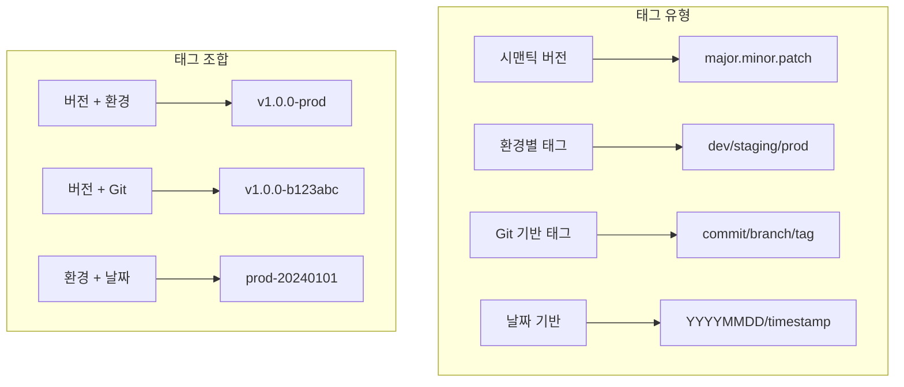
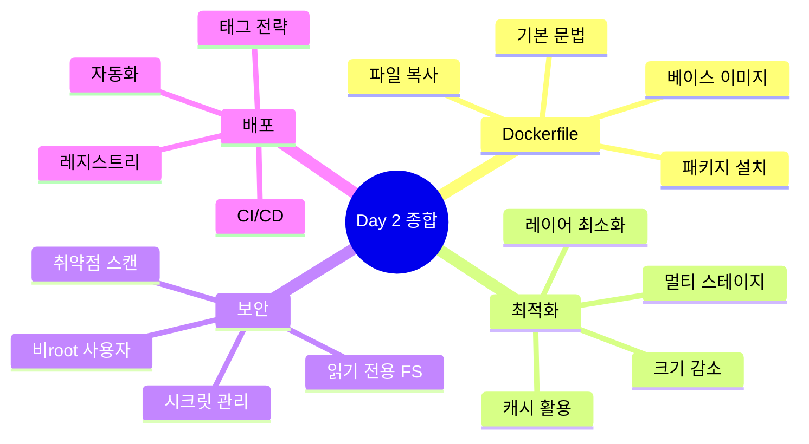

# Session 8: 이미지 태깅과 레지스트리 관리

## 📍 교과과정에서의 위치
이 세션은 **Week 2 > Day 2 > Session 8**로, Day 2의 마지막 세션입니다. Session 7의 최적화된 이미지를 Docker Hub에 배포하고 관리하는 방법을 실습하며, Day 2에서 학습한 모든 내용을 종합합니다.

## 학습 목표 (5분)
- **태깅 전략**과 **레지스트리 활용** 방법 이해
- **Docker Hub 푸시** 및 **Day 2 종합 프로젝트** 실습
- **이미지 배포** 및 **버전 관리** 전략 학습

## 1. 이론: 태깅 전략과 레지스트리 활용 (20분)

### 이미지 태깅 전략



### 레지스트리 구조와 관리

```
레지스트리 구조:
├── Docker Hub (공식)
│   ├── 공식 이미지
│   ├── 인증된 이미지
│   └── 사용자 이미지
├── 프라이빗 레지스트리
│   ├── Amazon ECR
│   ├── Google Container Registry
│   └── Azure Container Registry
└── 자체 호스팅
    ├── Docker Registry
    ├── Harbor
    └── Nexus

이미지 명명 규칙:
[레지스트리주소]/[사용자명]/[이미지명]:[태그]
예: docker.io/username/app:1.0.0
```

### 태그 관리 모범 사례

```
태그 관리 전략:

1. 시맨틱 버저닝:
├── major: 호환성이 깨지는 변경
├── minor: 기능 추가 (하위 호환)
├── patch: 버그 수정
└── 예: v1.2.3

2. 환경별 태그:
├── development: 개발 환경
├── staging: 테스트 환경
├── production: 운영 환경
└── latest: 최신 안정 버전

3. Git 연동:
├── commit hash: 7자리
├── branch name: feature/hotfix
├── release tag: v1.0.0
└── build number: b123

4. 날짜 기반:
├── YYYY.MM.DD
├── timestamp
├── nightly builds
└── weekly releases
```

## 2. 실습: Docker Hub 이미지 관리 (15분)

### Docker Hub 인증 및 설정

```bash
# Docker Hub 로그인
docker login

# 로그인 상태 확인
docker info | grep -A1 "Registry"

# 개인 레지스트리 설정 (선택사항)
cat > config.json << 'EOF'
{
  "auths": {
    "https://index.docker.io/v1/": {}
  },
  "credHelpers": {
    "gcr.io": "gcloud",
    "*.amazonaws.com": "ecr-login"
  }
}
EOF

# 설정 파일 위치 확인
echo $DOCKER_CONFIG || echo "$HOME/.docker"
```

### 이미지 태그 및 푸시

```bash
# 이미지 태그 생성
DOCKER_USERNAME=$(docker info | grep Username | awk '{print $2}')
VERSION="1.0.0"
GIT_HASH=$(git rev-parse --short HEAD 2>/dev/null || echo "unknown")
BUILD_DATE=$(date -u +'%Y%m%d')

# 다양한 태그 생성
docker tag node-app:production ${DOCKER_USERNAME}/node-app:latest
docker tag node-app:production ${DOCKER_USERNAME}/node-app:${VERSION}
docker tag node-app:production ${DOCKER_USERNAME}/node-app:${VERSION}-${GIT_HASH}
docker tag node-app:production ${DOCKER_USERNAME}/node-app:${BUILD_DATE}

# 이미지 푸시
docker push ${DOCKER_USERNAME}/node-app:latest
docker push ${DOCKER_USERNAME}/node-app:${VERSION}
docker push ${DOCKER_USERNAME}/node-app:${VERSION}-${GIT_HASH}
docker push ${DOCKER_USERNAME}/node-app:${BUILD_DATE}

# 푸시된 이미지 확인
docker search ${DOCKER_USERNAME}/node-app
```

### 이미지 메타데이터 관리

```bash
# 이미지 메타데이터 확인
docker inspect node-app:production

# 이미지 히스토리 확인
docker history node-app:production

# 이미지 레이어 분석
docker image inspect node-app:production -f '{{.RootFS.Layers}}'
```

## 3. 실습: 자동화된 이미지 배포 (10분)

### 배포 스크립트 작성

```bash
# 배포 스크립트 생성
cat > deploy.sh << 'EOF'
#!/bin/bash
set -e

# 설정
DOCKER_USERNAME=${DOCKER_USERNAME:-$1}
APP_NAME=${APP_NAME:-"node-app"}
VERSION=${VERSION:-"1.0.0"}
GIT_HASH=$(git rev-parse --short HEAD 2>/dev/null || echo "unknown")
BUILD_DATE=$(date -u +'%Y%m%d')
REGISTRY=${REGISTRY:-"docker.io"}

# 함수: 이미지 태그 및 푸시
tag_and_push() {
    local tag=$1
    echo "🏷️ Tagging: ${REGISTRY}/${DOCKER_USERNAME}/${APP_NAME}:${tag}"
    docker tag ${APP_NAME}:production ${REGISTRY}/${DOCKER_USERNAME}/${APP_NAME}:${tag}
    echo "⬆️ Pushing: ${REGISTRY}/${DOCKER_USERNAME}/${APP_NAME}:${tag}"
    docker push ${REGISTRY}/${DOCKER_USERNAME}/${APP_NAME}:${tag}
}

# 메인 스크립트
echo "🚀 Starting deployment process..."

# Docker Hub 로그인 확인
if ! docker info | grep -q "Username: ${DOCKER_USERNAME}"; then
    echo "❌ Not logged in to Docker Hub. Please run 'docker login' first."
    exit 1
fi

# 이미지 존재 확인
if ! docker image inspect ${APP_NAME}:production >/dev/null 2>&1; then
    echo "❌ Production image not found. Please build it first."
    exit 1
fi

# 태그 생성 및 푸시
echo "📦 Creating tags..."
tag_and_push "latest"
tag_and_push "${VERSION}"
tag_and_push "${VERSION}-${GIT_HASH}"
tag_and_push "${BUILD_DATE}"

echo "✅ Deployment complete!"
echo "🔍 Tags pushed:"
echo "  - latest"
echo "  - ${VERSION}"
echo "  - ${VERSION}-${GIT_HASH}"
echo "  - ${BUILD_DATE}"

# 정리
echo "🧹 Cleaning up local images..."
docker image prune -f

echo "📝 Deployment summary:"
docker images | grep ${APP_NAME}
EOF

chmod +x deploy.sh

# 스크립트 실행 (Docker Hub 로그인 필요)
./deploy.sh $DOCKER_USERNAME
```

### 자동화된 태그 관리

```bash
# 태그 관리 스크립트
cat > tag-manager.sh << 'EOF'
#!/bin/bash
set -e

# 설정
DOCKER_USERNAME=${DOCKER_USERNAME:-$1}
APP_NAME=${APP_NAME:-"node-app"}
REGISTRY=${REGISTRY:-"docker.io"}

# 로컬 태그 목록
echo "=== Local Tags ==="
docker images "${APP_NAME}" --format "table {{.Tag}}\t{{.Size}}\t{{.CreatedAt}}"

# 원격 태그 목록 (Docker Hub API 사용)
echo -e "\n=== Remote Tags ==="
curl -s "https://hub.docker.com/v2/repositories/${DOCKER_USERNAME}/${APP_NAME}/tags/" | \
    jq -r '.results[] | "\(.name)\t\(.full_size)\t\(.last_updated)"' 2>/dev/null || \
    echo "Failed to fetch remote tags"

# 오래된 태그 정리
echo -e "\n=== Cleanup Suggestions ==="
echo "Old tags that could be removed:"
docker images "${APP_NAME}" --format "{{.Tag}}" | \
    grep -E "^[0-9]{8}" | sort | head -n -5
EOF

chmod +x tag-manager.sh

# 스크립트 실행
./tag-manager.sh $DOCKER_USERNAME
```

## 4. 실습: Day 2 종합 프로젝트 (10분)

### 최종 프로젝트 구조

```bash
# 프로젝트 디렉토리 생성
mkdir -p final-project && cd final-project

# 프로젝트 구조
cat > project-structure.txt << 'EOF'
final-project/
├── src/                    # 소스 코드
│   ├── app.js             # 메인 애플리케이션
│   └── config/            # 설정 파일
├── Dockerfile             # 프로덕션 Dockerfile
├── Dockerfile.dev         # 개발용 Dockerfile
├── docker-compose.yml     # 로컬 개발 환경
├── .dockerignore         # Docker 제외 파일
├── deploy.sh             # 배포 스크립트
└── README.md             # 프로젝트 문서
EOF

# 디렉토리 구조 생성
mkdir -p src/config

# README.md 생성
cat > README.md << 'EOF'
# 최적화된 Node.js Docker 이미지 프로젝트

## 특징
- 멀티 스테이지 빌드로 최적화
- 보안 강화 및 취약점 제거
- 자동화된 배포 프로세스
- 환경별 설정 관리

## 태그 전략
- latest: 최신 안정 버전
- x.y.z: 시맨틱 버전
- x.y.z-hash: Git 커밋 추적
- YYYYMMDD: 날짜 기반 버전

## 사용 방법
1. 개발 환경: `docker-compose up`
2. 프로덕션 빌드: `docker build -t app:prod .`
3. 배포: `./deploy.sh`

## 보안 기능
- 비root 사용자 실행
- 읽기 전용 파일시스템
- 취약점 스캔 통과
- 보안 헤더 적용
EOF

# 애플리케이션 코드
cat > src/app.js << 'EOF'
const express = require('express');
const app = express();
const port = process.env.PORT || 3000;

app.get('/', (req, res) => {
  res.json({
    message: '🚀 Optimized Node.js Application',
    version: process.env.APP_VERSION,
    environment: process.env.NODE_ENV,
    timestamp: new Date().toISOString()
  });
});

app.get('/health', (req, res) => {
  res.json({ status: 'healthy' });
});

app.listen(port, '0.0.0.0', () => {
  console.log(`🚀 Server running on port ${port}`);
});
EOF

# 설정 파일
cat > src/config/default.js << 'EOF'
module.exports = {
  app: {
    name: 'Optimized Node.js App',
    version: process.env.APP_VERSION || '1.0.0',
  },
  server: {
    port: process.env.PORT || 3000,
  },
  security: {
    headers: {
      'X-Content-Type-Options': 'nosniff',
      'X-Frame-Options': 'DENY',
      'X-XSS-Protection': '1; mode=block'
    }
  }
};
EOF

# package.json
cat > package.json << 'EOF'
{
  "name": "optimized-node-app",
  "version": "1.0.0",
  "private": true,
  "scripts": {
    "start": "node src/app.js",
    "dev": "nodemon src/app.js"
  },
  "dependencies": {
    "express": "^4.18.2"
  },
  "devDependencies": {
    "nodemon": "^3.0.1"
  }
}
EOF

# .dockerignore
cat > .dockerignore << 'EOF'
node_modules
npm-debug.log
Dockerfile*
docker-compose*
.git
.gitignore
README.md
.env*
*.md
*.sh
EOF

# Dockerfile
cat > Dockerfile << 'EOF'
# Build Stage
FROM node:18-alpine AS builder

WORKDIR /app
COPY package*.json ./
RUN npm ci --only=production

# Runtime Stage
FROM gcr.io/distroless/nodejs18-debian11

WORKDIR /app
COPY --from=builder /app/node_modules ./node_modules
COPY src ./src

ENV NODE_ENV=production
EXPOSE 3000

HEALTHCHECK --interval=30s --timeout=3s CMD ["/nodejs/bin/node", "-e", "require('http').get('http://localhost:3000/health', (r) => process.exit(r.statusCode === 200 ? 0 : 1))"]

CMD ["/nodejs/bin/node", "src/app.js"]
EOF

# docker-compose.yml
cat > docker-compose.yml << 'EOF'
version: '3.8'

services:
  app:
    build:
      context: .
      dockerfile: Dockerfile
    ports:
      - "3000:3000"
    environment:
      - NODE_ENV=development
      - APP_VERSION=1.0.0-dev
    volumes:
      - ./src:/app/src
    healthcheck:
      test: ["CMD", "wget", "--spider", "http://localhost:3000/health"]
      interval: 30s
      timeout: 3s
      retries: 3
EOF

# 빌드 및 테스트
docker build -t final-app:latest .
docker run -d -p 3000:3000 --name final-app final-app:latest

# 테스트
curl http://localhost:3000
```

## 5. 실습: 이미지 배포 자동화 (10분)

### CI/CD 파이프라인 설정

```bash
# GitHub Actions 워크플로우 설정
mkdir -p .github/workflows

cat > .github/workflows/docker-publish.yml << 'EOF'
name: Docker Build and Publish

on:
  push:
    branches: [ main ]
    tags: [ 'v*.*.*' ]
  pull_request:
    branches: [ main ]

env:
  REGISTRY: docker.io
  IMAGE_NAME: ${{ github.repository }}

jobs:
  build:
    runs-on: ubuntu-latest
    permissions:
      contents: read
      packages: write

    steps:
      - uses: actions/checkout@v3

      - name: Set up Docker Buildx
        uses: docker/setup-buildx-action@v2

      - name: Login to Docker Hub
        uses: docker/login-action@v2
        with:
          username: ${{ secrets.DOCKER_USERNAME }}
          password: ${{ secrets.DOCKER_PASSWORD }}

      - name: Extract metadata
        id: meta
        uses: docker/metadata-action@v4
        with:
          images: ${{ env.REGISTRY }}/${{ env.IMAGE_NAME }}
          tags: |
            type=semver,pattern={{version}}
            type=semver,pattern={{major}}.{{minor}}
            type=sha,prefix={{branch}}-
            type=raw,value=latest,enable={{is_default_branch}}

      - name: Build and push
        uses: docker/build-push-action@v4
        with:
          context: .
          push: true
          tags: ${{ steps.meta.outputs.tags }}
          labels: ${{ steps.meta.outputs.labels }}
          cache-from: type=gha
          cache-to: type=gha,mode=max
EOF

# 로컬 테스트 스크립트
cat > test.sh << 'EOF'
#!/bin/bash
set -e

echo "🧪 Running tests..."

# 이미지 빌드
echo "📦 Building image..."
docker build -t test-image .

# 컨테이너 실행
echo "🚀 Starting container..."
docker run -d --name test-container -p 3000:3000 test-image

# 헬스체크
echo "🏥 Health check..."
sleep 5
curl -f http://localhost:3000/health || exit 1

# 기능 테스트
echo "✅ Feature test..."
response=$(curl -s http://localhost:3000)
if ! echo "$response" | grep -q "Optimized Node.js Application"; then
    echo "❌ Feature test failed"
    exit 1
fi

# 정리
docker stop test-container
docker rm test-container

echo "✨ All tests passed!"
EOF

chmod +x test.sh

# 테스트 실행
./test.sh
```

## 6. Q&A 및 정리 (5분)

### Day 2 학습 내용 종합



### 실습 결과 정리

```bash
# 최종 이미지 크기 확인
echo "=== Final Image Sizes ==="
docker images --format "table {{.Repository}}\t{{.Tag}}\t{{.Size}}" | grep final-app

# 실행 중인 컨테이너 확인
docker ps --format "table {{.Names}}\t{{.Status}}\t{{.Ports}}"

# 정리
docker stop $(docker ps -q) 2>/dev/null || true
docker rm $(docker ps -aq) 2>/dev/null || true
docker system prune -f
```

## 💡 핵심 키워드
- **태그 전략**: 시맨틱 버저닝, 환경별 태그, Git 연동
- **레지스트리**: Docker Hub, 프라이빗 레지스트리, 인증
- **배포 자동화**: CI/CD, 스크립트, 워크플로우
- **버전 관리**: 태그 관리, 메타데이터, 추적성

## 📚 참고 자료
- [Docker Hub 가이드](https://docs.docker.com/docker-hub/)
- [태깅 모범 사례](https://docs.docker.com/develop/dev-best-practices/#image-layering)
- [GitHub Actions](https://docs.github.com/en/actions)

## 🔧 실습 체크리스트
- [ ] Docker Hub 이미지 푸시 성공
- [ ] 다양한 태그 전략 적용
- [ ] 배포 자동화 스크립트 구현
- [ ] CI/CD 파이프라인 설정
- [ ] Day 2 종합 프로젝트 완성
