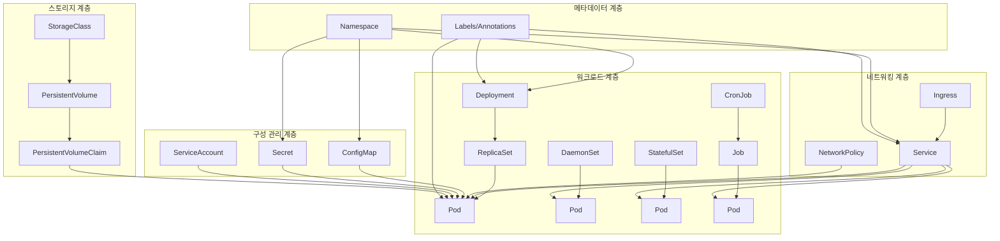
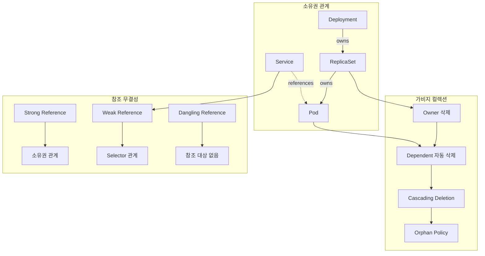
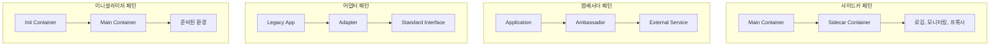
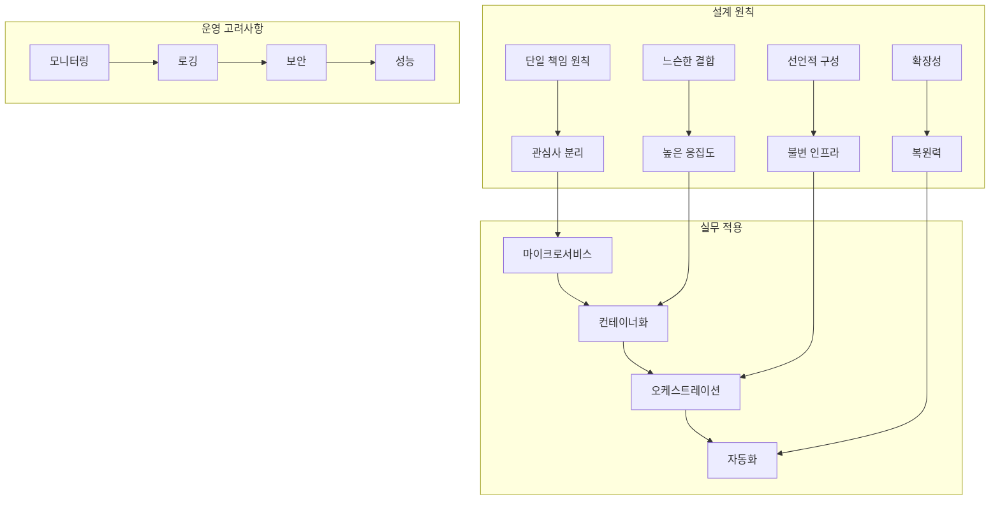

# Session 8: 오브젝트 관계 및 설계 패턴

## 📍 교과과정에서의 위치
이 세션은 **Week 2 > Day 2 > Session 8**로, Day 2의 마지막 세션입니다. 지금까지 학습한 Kubernetes 핵심 오브젝트들의 관계를 종합적으로 분석하고, 실무에서 사용되는 설계 패턴과 모범 사례를 정리합니다.

## 학습 목표 (5분)
- **Kubernetes 오브젝트** 간 **관계**와 **의존성** 종합 이해
- **소유권**과 **참조** 관계 메커니즘 학습
- **설계 패턴**과 **모범 사례** 파악
- **전체 아키텍처** 관점에서의 **오브젝트 설계** 원칙 이해

## 1. Kubernetes 오브젝트 간 관계 종합 분석 (15분)

### 오브젝트 관계 전체 구조



### 오브젝트 관계 분석
```
Kubernetes 오브젝트 관계 구조:

계층적 관계 (Hierarchical):
   🔹 Deployment → ReplicaSet → Pod
   🔹 StatefulSet → Pod (순서 보장)
   🔹 DaemonSet → Pod (노드별 배치)
   🔹 Job → Pod (일회성 작업)
   🔹 CronJob → Job → Pod (스케줄 작업)
   🔹 상위 오브젝트가 하위 오브젝트 생명주기 관리

참조 관계 (Reference):
   🔹 Service → Pod (Selector 기반)
   🔹 Ingress → Service (백엔드 참조)
   🔹 PVC → PV (바인딩 관계)
   🔹 Pod → ConfigMap/Secret (볼륨/환경변수)
   🔹 Pod → ServiceAccount (인증)
   🔹 느슨한 결합, 동적 연결

포함 관계 (Containment):
   🔹 Namespace → 대부분의 리소스
   🔹 Pod → Container (실행 단위)
   🔹 Container → Volume Mount
   🔹 Service → Endpoint (자동 생성)
   🔹 논리적/물리적 포함

의존 관계 (Dependency):
   🔹 Pod → Node (스케줄링)
   🔹 Pod → StorageClass → PV
   🔹 Ingress → IngressClass
   🔹 NetworkPolicy → Pod (트래픽 제어)
   🔹 실행을 위한 필수 의존성

메타데이터 관계:
   🔹 Labels → Selector (연결 기준)
   🔹 Annotations → 추가 정보
   🔹 OwnerReference → 소유권 관계
   🔹 Finalizers → 삭제 순서 제어
   🔹 관리 및 운영을 위한 메타정보
```

## 2. 소유권과 참조 관계 이해 (12분)

### OwnerReference 메커니즘



### 소유권 관리 메커니즘
```
소유권과 참조 관리:

OwnerReference 구조:
   🔹 apiVersion: 소유자 API 버전
   🔹 kind: 소유자 리소스 타입
   🔹 name: 소유자 이름
   🔹 uid: 소유자 고유 식별자
   🔹 controller: 컨트롤러 여부 (true/false)
   🔹 blockOwnerDeletion: 삭제 차단 여부
   🔹 소유권 체인 형성

가비지 컬렉션 정책:
   🔹 Foreground: 의존 객체 먼저 삭제
   🔹 Background: 소유자 먼저 삭제 후 의존 객체
   🔹 Orphan: 의존 객체를 고아로 남김
   🔹 기본값: Background 삭제
   🔹 kubectl --cascade 옵션으로 제어
   🔹 삭제 순서와 타이밍 제어

참조 관계 타입:
   🔹 Strong Reference (소유권):
      • 생명주기 연결
      • 자동 삭제 보장
      • 순환 참조 방지
      • 예: Deployment → ReplicaSet
   🔹 Weak Reference (선택자):
      • 동적 연결/해제
      • 독립적 생명주기
      • 유연한 관계
      • 예: Service → Pod
   🔹 Cross Reference (교차 참조):
   🔹 네임스페이스 간 참조
   🔹 클러스터 리소스 참조
   🔹 외부 리소스 참조
   🔹 예: Ingress → Service

참조 무결성 보장:
   🔹 존재하지 않는 리소스 참조 방지
   🔹 순환 참조 탐지 및 방지
   🔹 댕글링 참조 정리
   🔹 참조 유효성 검증
   🔹 일관성 있는 상태 유지
```

## 3. 설계 패턴과 모범 사례 정리 (10분)

### 주요 설계 패턴



### 설계 패턴 상세 분석
```
Kubernetes 설계 패턴:

Pod 레벨 패턴:
   🔹 사이드카 패턴 (Sidecar):
      • 주 컨테이너 보조 기능
      • 로깅, 모니터링, 프록시
      • 관심사 분리
      • 재사용 가능한 구성 요소
   🔹 앰배서더 패턴 (Ambassador):
      • 외부 서비스 연결 추상화
      • 프록시 및 로드 밸런싱
      • 연결 관리 단순화
      • 환경별 설정 분리
   🔹 어댑터 패턴 (Adapter):
      • 레거시 애플리케이션 통합
      • 인터페이스 표준화
      • 데이터 형식 변환
      • 호환성 보장
   🔹 이니셜라이저 패턴 (Init Container):
   🔹 초기화 작업 분리
   🔹 의존성 준비
   🔹 설정 및 데이터 준비
   🔹 순차적 실행 보장

워크로드 패턴:
   🔹 배치 작업 패턴:
      • Job: 일회성 작업
      • CronJob: 스케줄 작업
      • 병렬 처리 지원
      • 완료 보장
   🔹 데몬 패턴:
      • DaemonSet: 노드별 배치
      • 시스템 서비스
      • 로깅, 모니터링 에이전트
      • 인프라 구성 요소
   🔹 상태 관리 패턴:
      • StatefulSet: 순서 보장
      • 영구 스토리지
      • 안정적인 네트워크 ID
      • 데이터베이스, 큐 시스템
   🔹 무상태 패턴:
   🔹 Deployment: 확장성
   🔹 롤링 업데이트
   🔹 자동 복구
   🔹 웹 애플리케이션

서비스 패턴:
   🔹 로드 밸런서 패턴:
      • Service 추상화
      • 트래픽 분산
      • 헬스 체크
      • 서비스 디스커버리
   🔹 게이트웨이 패턴:
      • Ingress 컨트롤러
      • 라우팅 규칙
      • TLS 종료
      • 외부 접근 제어
   🔹 서비스 메시 패턴:
   🔹 마이크로서비스 통신
   🔹 트래픽 관리
   🔹 보안 정책
   🔹 관찰 가능성

구성 관리 패턴:
   🔹 외부화 패턴:
      • ConfigMap/Secret 분리
      • 환경별 설정
      • 동적 설정 업데이트
      • 보안 정보 관리
   🔹 템플릿 패턴:
      • Helm 차트
      • Kustomize 오버레이
      • 재사용 가능한 구성
      • 환경별 커스터마이징
   🔹 정책 패턴:
   🔹 RBAC 권한 관리
   🔹 NetworkPolicy 트래픽 제어
   🔹 PodSecurityPolicy 보안
   🔹 ResourceQuota 리소스 제한
```

## 4. 전체 아키텍처 관점에서의 오브젝트 설계 원칙 (10분)

### 설계 원칙 아키텍처



### 설계 원칙 상세
```
Kubernetes 오브젝트 설계 원칙:

SOLID 원칙 적용:
   🔹 단일 책임 원칙 (SRP):
      • 각 오브젝트는 하나의 책임
      • Pod: 애플리케이션 실행
      • Service: 네트워크 추상화
      • ConfigMap: 구성 관리
   🔹 개방-폐쇄 원칙 (OCP):
      • 확장에는 열려있고 수정에는 닫힘
      • 플러그인 아키텍처
      • CRD를 통한 확장
      • 컨트롤러 패턴
   🔹 리스코프 치환 원칙 (LSP):
      • 인터페이스 호환성
      • API 버전 호환성
      • 하위 호환성 보장
      • 점진적 업그레이드
   🔹 인터페이스 분리 원칙 (ISP):
      • 필요한 인터페이스만 의존
      • 최소 권한 원칙
      • RBAC 세분화
      • 네임스페이스 격리
   🔹 의존성 역전 원칙 (DIP):
   🔹 추상화에 의존
   🔹 Service 추상화
   🔹 인터페이스 기반 설계
   🔹 구현체 교체 가능

클라우드 네이티브 원칙:
   🔹 12-Factor App:
      • 코드베이스 단일화
      • 의존성 명시적 선언
      • 설정 외부화
      • 백엔드 서비스 리소스화
      • 빌드/릴리스/실행 분리
      • 무상태 프로세스
      • 포트 바인딩
      • 동시성 확장
      • 폐기 가능성
      • 개발/프로덕션 동등성
      • 로그 스트림
      • 관리 프로세스
   🔹 마이크로서비스 원칙:
      • 비즈니스 기능 중심 분해
      • 분산 거버넌스
      • 분산 데이터 관리
      • 인프라 자동화
      • 장애 설계
      • 진화적 설계
   🔹 컨테이너 원칙:
   🔹 불변 인프라
   🔹 경량화
   🔹 이식성
   🔹 확장성
   🔹 관찰 가능성

운영 고려사항:
   🔹 관찰 가능성 (Observability):
      • 메트릭 수집
      • 로그 집계
      • 분산 추적
      • 상태 모니터링
   🔹 복원력 (Resilience):
      • 자동 복구
      • 장애 격리
      • 서킷 브레이커
      • 백프레셔 처리
   🔹 보안 (Security):
      • 최소 권한 원칙
      • 네트워크 분할
      • 암호화
      • 감사 로깅
   🔹 성능 (Performance):
   🔹 리소스 최적화
   🔹 캐싱 전략
   🔹 로드 밸런싱
   🔹 오토스케일링
```

## 💬 그룹 토론: Kubernetes 오브젝트 설계의 핵심 원칙 (8분)

### 토론 주제
**"실무에서 Kubernetes 오브젝트를 설계할 때 가장 중요하게 고려해야 할 원칙과 패턴은 무엇이며, 어떻게 적용할 것인가?"**

### 토론 가이드라인

#### 설계 원칙 우선순위 (3분)
- 단일 책임: 각 오브젝트의 명확한 역할 정의
- 느슨한 결합: 오브젝트 간 독립성 보장
- 확장성: 미래 성장을 고려한 설계

#### 실무 적용 전략 (3분)
- 패턴 선택: 요구사항에 맞는 패턴 적용
- 관계 설계: 오브젝트 간 효율적인 관계 구성
- 운영 고려: 모니터링, 보안, 성능 최적화

#### 설계 검증 방법 (2분)
- 테스트: 설계 검증을 위한 테스트 전략
- 리뷰: 아키텍처 리뷰 프로세스
- 개선: 지속적인 설계 개선 방안

## 💡 핵심 개념 정리
- 오브젝트 관계: 계층적, 참조, 포함, 의존 관계
- 소유권: OwnerReference와 가비지 컬렉션
- 설계 패턴: 사이드카, 앰배서더, 어댑터, 이니셜라이저
- 설계 원칙: SOLID 원칙, 클라우드 네이티브 원칙

## 📚 참고 자료
- [Kubernetes Objects](https://kubernetes.io/docs/concepts/overview/working-with-objects/kubernetes-objects/)
- [Owner References](https://kubernetes.io/docs/concepts/overview/working-with-objects/owners-dependents/)
- [Design Patterns](https://kubernetes.io/blog/2015/06/the-distributed-system-toolkit-patterns/)

## Day 2 학습 완료
오늘 학습한 **Kubernetes 핵심 오브젝트**들의 개념과 관계를 완전히 이해했습니다. 내일은 **Kubernetes 네트워킹 이론**에 대해 학습하여 클러스터 네트워킹과 서비스 통신 메커니즘을 심화 학습할 예정입니다.

## 다음 날 준비
내일 **Day 3**에서는 Kubernetes 네트워킹의 핵심 개념들을 학습합니다:
- 클러스터 네트워킹 모델
- CNI (Container Network Interface)
- Service 타입별 네트워킹
- Ingress와 로드 밸런싱