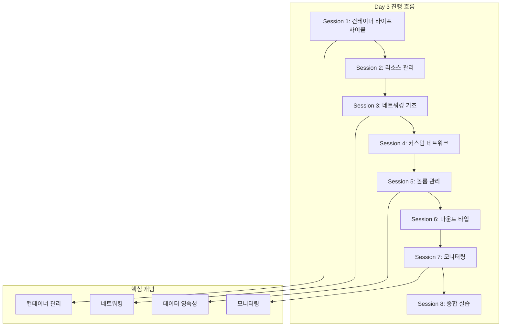

# Week 2 - Day 3: Docker 컨테이너 관리 및 네트워킹

## 📍 교과과정에서의 위치
**Week 2 > Day 3**는 Docker 컨테이너의 실행과 관리에 중점을 둡니다. Day 1-2에서 학습한 Docker 기초와 이미지 빌드 지식을 바탕으로, 실제 운영 환경에서 필요한 컨테이너 관리 기술을 실습합니다.

## 🎯 학습 목표
- **컨테이너 라이프사이클** 완전 이해 및 관리
- **Docker 네트워킹** 구조와 실무 활용
- **볼륨과 데이터 관리** 전략 수립
- **컨테이너 모니터링** 및 **로그 관리** 실습

## 📚 Day 3 세션 구성

### Session 1: 컨테이너 라이프사이클 관리
- **이론 (20분)**: 컨테이너 상태와 생명주기
- **실습 (25분)**: 컨테이너 시작, 중지, 재시작 실습
- **Q&A (5분)**: 라이프사이클 관리 질의응답

### Session 2: 컨테이너 리소스 관리
- **이론 (20분)**: CPU, 메모리, 디스크 리소스 제한
- **실습 (25분)**: 리소스 제한 설정 및 모니터링
- **Q&A (5분)**: 리소스 최적화 방안

### Session 3: Docker 네트워킹 기초
- **이론 (20분)**: Docker 네트워크 드라이버와 구조
- **실습 (25분)**: 기본 네트워크 생성 및 관리
- **Q&A (5분)**: 네트워킹 문제 해결

### Session 4: 커스텀 네트워크 구성
- **이론 (20분)**: Bridge, Host, Overlay 네트워크
- **실습 (25분)**: 멀티 컨테이너 네트워크 구성
- **Q&A (5분)**: 네트워크 보안 고려사항

### Session 5: 볼륨과 데이터 관리
- **이론 (20분)**: 볼륨 타입과 데이터 영속성
- **실습 (25분)**: 볼륨 생성 및 마운트 실습
- **Q&A (5분)**: 데이터 백업 전략

### Session 6: 바인드 마운트와 tmpfs
- **이론 (20분)**: 마운트 타입별 특징과 용도
- **실습 (25분)**: 개발 환경 볼륨 설정
- **Q&A (5분)**: 성능 최적화 방안

### Session 7: 컨테이너 모니터링과 로깅
- **이론 (20분)**: 로그 드라이버와 모니터링 도구
- **실습 (25분)**: 로그 수집 및 분석 실습
- **Q&A (5분)**: 운영 환경 모니터링

### Session 8: Day 3 종합 실습
- **이론 (15분)**: 컨테이너 오케스트레이션 개념
- **실습 (30분)**: 멀티 컨테이너 애플리케이션 구성
- **Q&A (5분)**: Day 3 내용 정리 및 질의응답

## 🔄 이론-실습 비율
```
각 세션: ████████████ 40% 이론 + ████████████████████ 60% 실습
```

## 🛠 실습 환경
- **Docker Desktop** 또는 **Docker Engine**
- **네트워크 도구**: netstat, ss, iptables
- **모니터링 도구**: htop, docker stats
- **로그 분석**: jq, grep, tail

## 📊 Day 3 학습 로드맵



## 🎯 Day 3 완료 후 성취 목표
- [ ] 컨테이너 전체 라이프사이클 관리 능력
- [ ] Docker 네트워크 구성 및 문제 해결
- [ ] 데이터 영속성 보장 방법 이해
- [ ] 컨테이너 모니터링 및 로그 관리
- [ ] 멀티 컨테이너 환경 구성 경험

## 📚 참고 자료
- [Docker 네트워킹 가이드](https://docs.docker.com/network/)
- [Docker 볼륨 관리](https://docs.docker.com/storage/volumes/)
- [컨테이너 모니터링](https://docs.docker.com/config/containers/logging/)

## 🔗 연계 학습
- **Day 2 연결**: 빌드한 이미지를 실제 운영 환경에서 실행
- **Day 4 준비**: Docker Compose를 위한 네트워킹과 볼륨 기초
- **Week 3 연결**: Kubernetes 네트워킹과 스토리지 개념 준비

---
*Day 3에서는 Docker 컨테이너를 실제 운영 환경에서 안정적으로 관리하는 핵심 기술을 습득합니다.*
