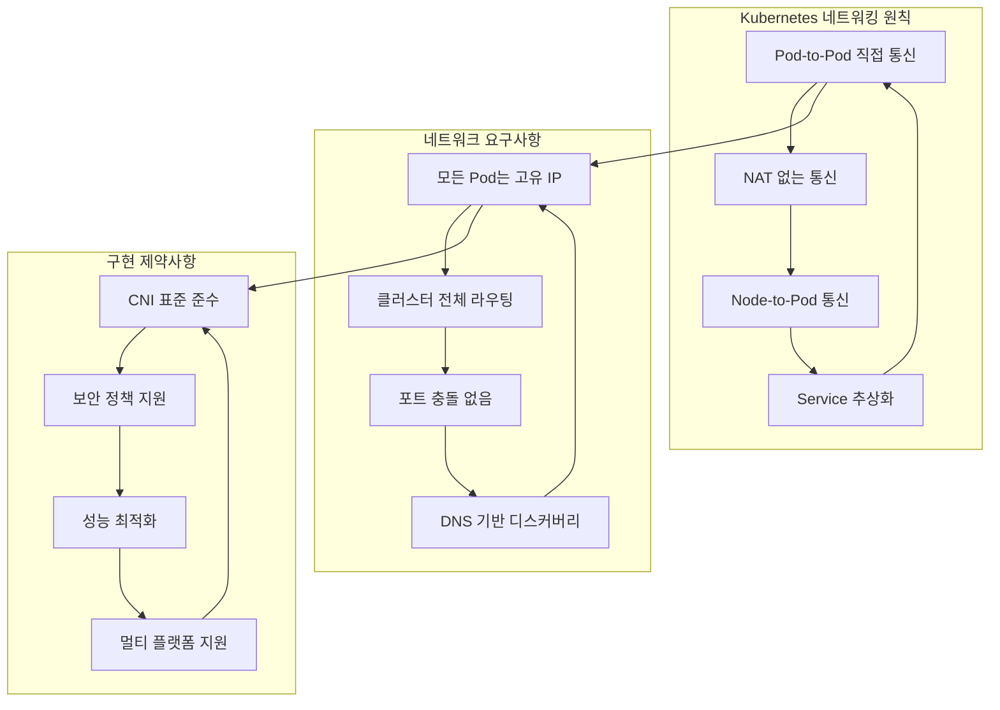
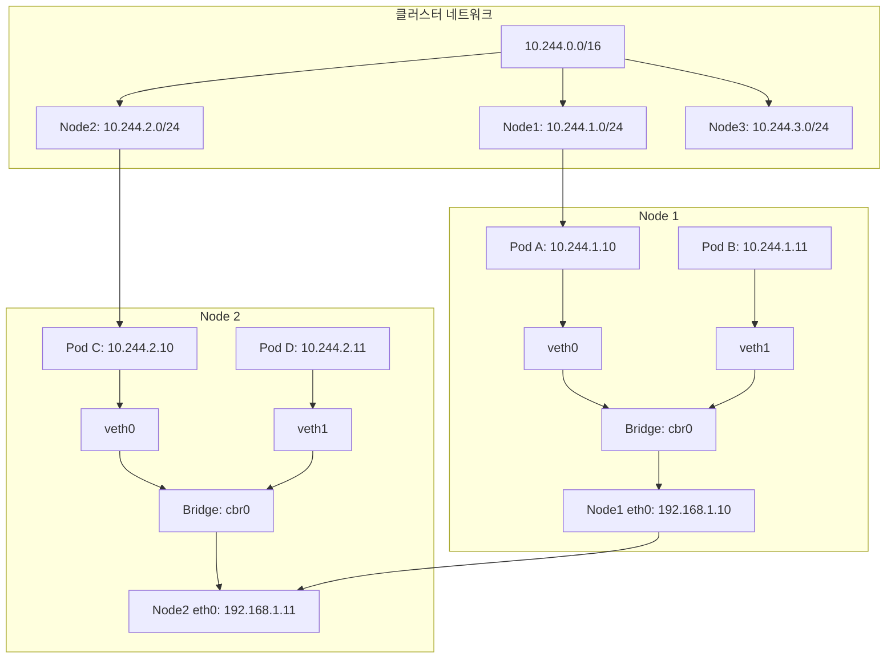
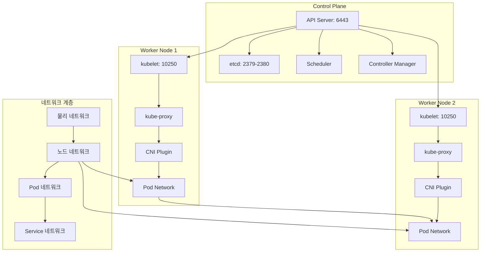
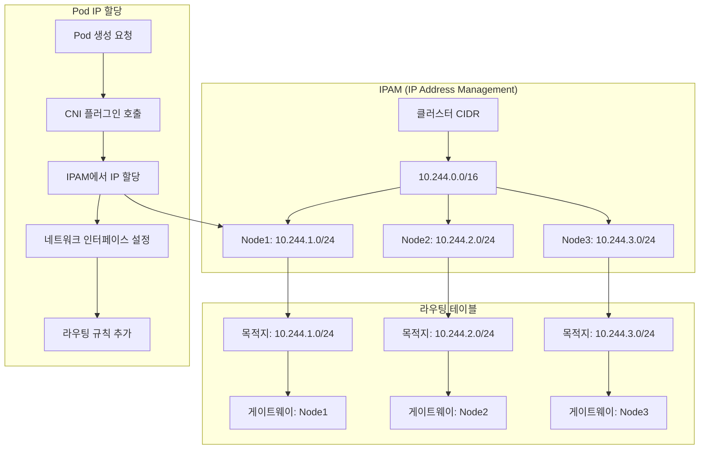

# Session 1: 클러스터 네트워킹 모델

## 📍 교과과정에서의 위치
이 세션은 **Week 2 > Day 3 > Session 1**로, Kubernetes 네트워킹의 기본 원칙과 클러스터 네트워킹 모델을 학습합니다. Day 2에서 학습한 오브젝트들이 어떻게 네트워크를 통해 통신하는지 이해합니다.

## 학습 목표 (5분)
- **Kubernetes 네트워킹** 기본 원칙과 **요구사항** 완전 이해
- **Flat 네트워크** 모델과 **Pod-to-Pod** 통신 메커니즘 학습
- **Node 네트워킹**과 **클러스터 네트워크** 구조 파악
- **IP 주소 할당**과 **라우팅** 메커니즘 이해

## 1. Kubernetes 네트워킹 기본 원칙과 요구사항 (15분)

### Kubernetes 네트워킹 4대 원칙



### 네트워킹 원칙 상세 분석
```
Kubernetes 네트워킹 핵심 원칙:

1. Pod-to-Pod 직접 통신:
   🔹 모든 Pod는 다른 Pod와 직접 통신 가능
   🔹 NAT(Network Address Translation) 없이 통신
   🔹 Pod IP는 클러스터 전체에서 유일
   🔹 컨테이너 간 localhost 통신 (같은 Pod 내)
   🔹 네트워크 네임스페이스 공유 (Pod 내)
   🔹 실제 IP 주소로 통신 (가상화 없음)

2. Node-to-Pod 통신:
   🔹 노드에서 모든 Pod에 직접 접근 가능
   🔹 Pod에서 노드로 직접 통신 가능
   🔹 호스트 네트워크와 Pod 네트워크 연결
   🔹 kubelet과 Pod 간 통신
   🔹 노드 에이전트와 Pod 통신
   🔹 디버깅 및 관리 목적 접근

3. Service 추상화:
   🔹 Pod IP 변경에 대한 안정적 엔드포인트
   🔹 로드 밸런싱 및 서비스 디스커버리
   🔹 클러스터 내부 DNS 이름 제공
   🔹 외부 접근을 위한 추상화 계층
   🔹 포트 매핑 및 프로토콜 지원
   🔹 헬스 체크 및 트래픽 라우팅

4. 보안 및 격리:
   🔹 네트워크 정책을 통한 트래픽 제어
   🔹 네임스페이스 기반 논리적 분리
   🔹 암호화 통신 지원 (TLS)
   🔹 인증 및 권한 부여 통합
   🔹 감사 로깅 및 모니터링
   🔹 제로 트러스트 네트워킹 지원

네트워킹 요구사항:
   🔹 확장성: 수천 개 노드와 Pod 지원
   🔹 성능: 최소한의 오버헤드
   🔹 안정성: 네트워크 장애 복구
   🔹 보안: 트래픽 암호화 및 격리
   🔹 호환성: 다양한 환경 지원
   🔹 관리성: 설정 및 운영 단순화
   🔹 표준화: CNI 표준 준수
```

## 2. Flat 네트워크 모델과 Pod-to-Pod 통신 (12분)

### Flat 네트워크 아키텍처



### Pod-to-Pod 통신 메커니즘
```
Flat 네트워크 모델:

네트워크 구조:
   🔹 클러스터 CIDR: 전체 Pod IP 범위 (예: 10.244.0.0/16)
   🔹 노드별 서브넷: 각 노드에 할당된 IP 범위
   🔹 Pod IP 할당: 노드 서브넷에서 순차 할당
   🔹 브리지 네트워크: 노드 내 Pod 연결
   🔹 라우팅 테이블: 노드 간 Pod 통신 경로
   🔹 오버레이 네트워크: 물리 네트워크 위 가상 네트워크

Pod-to-Pod 통신 과정:
   🔹 같은 노드 내 통신:
      • Pod A → veth → Bridge → veth → Pod B
      • L2 스위칭을 통한 직접 통신
      • 최소 지연시간
      • 높은 대역폭
   🔹 다른 노드 간 통신:
      • Pod A → veth → Bridge → Node eth0
      • Node1 eth0 → 물리 네트워크 → Node2 eth0
      • Node2 eth0 → Bridge → veth → Pod C
      • 라우팅 테이블 기반 경로 결정
      • 오버레이 네트워크 캡슐화 (필요시)

IP 주소 관리:
   🔹 IPAM (IP Address Management):
      • 클러스터 전체 IP 풀 관리
      • 노드별 서브넷 할당
      • Pod IP 할당 및 해제
      • IP 충돌 방지
      • 가용 IP 추적
   🔹 주소 할당 방식:
      • 정적 할당: 미리 정의된 범위
      • 동적 할당: 요청 시 할당
      • 노드별 풀: 각 노드의 IP 풀
      • 재사용: 삭제된 Pod IP 재활용

네트워크 인터페이스:
   🔹 Container 인터페이스:
      • eth0: Pod 내 기본 인터페이스
      • lo: 루프백 인터페이스
      • 추가 인터페이스 (멀티 네트워크)
   🔹 Host 인터페이스:
      • veth pair: 컨테이너-호스트 연결
      • Bridge: 노드 내 네트워크 스위치
      • 물리 인터페이스: 외부 네트워크 연결
      • 터널 인터페이스: 오버레이 네트워크
```

## 3. Node 네트워킹과 클러스터 네트워크 구조 (10분)

### 클러스터 네트워크 토폴로지



### 네트워크 계층 구조
```
클러스터 네트워크 계층:

1. 물리 네트워크 계층:
   🔹 데이터센터 네트워크 인프라
   🔹 스위치, 라우터, 방화벽
   🔹 VLAN, VPC 등 네트워크 분할
   🔹 인터넷 게이트웨이 연결
   🔹 로드 밸런서 및 CDN
   🔹 네트워크 보안 장비

2. 노드 네트워크 계층:
   🔹 노드 간 통신 네트워크
   🔹 관리 트래픽 (kubelet, API 서버)
   🔹 노드 IP 주소 할당
   🔹 호스트 네트워킹 설정
   🔹 방화벽 규칙 및 보안 그룹
   🔹 모니터링 및 로깅 트래픽

3. Pod 네트워크 계층:
   🔹 컨테이너 간 통신 네트워크
   🔹 CNI 플러그인 구현
   🔹 오버레이 또는 언더레이 네트워크
   🔹 Pod IP 주소 관리
   🔹 네트워크 정책 적용
   🔹 서비스 메시 통합

4. Service 네트워크 계층:
   🔹 가상 IP (ClusterIP) 관리
   🔹 kube-proxy 로드 밸런싱
   🔹 DNS 기반 서비스 디스커버리
   🔹 Ingress 컨트롤러 라우팅
   🔹 외부 로드 밸런서 통합
   🔹 트래픽 정책 및 QoS

네트워크 구성 요소:
   🔹 CNI (Container Network Interface):
      • 네트워크 플러그인 표준
      • Pod 네트워크 설정 자동화
      • IP 할당 및 라우팅 설정
      • 네트워크 정책 구현
   🔹 kube-proxy:
      • Service 추상화 구현
      • 로드 밸런싱 규칙 관리
      • iptables/IPVS 규칙 설정
      • 트래픽 포워딩
   🔹 CoreDNS:
      • 클러스터 DNS 서비스
      • Service 이름 해결
      • Pod DNS 정책 적용
      • 외부 DNS 통합
   🔹 Ingress Controller:
   🔹 HTTP/HTTPS 라우팅
   🔹 TLS 종료 및 인증서 관리
   🔹 로드 밸런싱 및 헬스 체크
   🔹 외부 트래픽 진입점
```

## 4. IP 주소 할당과 라우팅 메커니즘 (10분)

### IP 주소 할당 아키텍처



### 라우팅 메커니즘 상세
```
IP 주소 관리 및 라우팅:

IPAM (IP Address Management):
   🔹 클러스터 CIDR 설정:
      • 전체 Pod IP 범위 정의
      • 노드별 서브넷 분할
      • Service CIDR 별도 관리
      • 중복 방지 및 충돌 해결
   🔹 동적 IP 할당:
      • Pod 생성 시 자동 할당
      • 사용 가능한 IP 풀 관리
      • IP 임대 및 갱신
      • 삭제 시 IP 반환
   🔹 IP 풀 관리:
      • 노드별 IP 블록 할당
      • 가용 IP 모니터링
      • 확장 시 추가 블록 할당
      • 단편화 방지 및 최적화

라우팅 구현 방식:
   🔹 호스트 라우팅 (Host Routing):
      • 각 노드에 라우팅 테이블 설정
      • 목적지별 다음 홉 지정
      • 직접 라우팅 (L3 네트워크)
      • 높은 성능, 낮은 오버헤드
      • 물리 네트워크 의존성
   🔹 오버레이 네트워크 (Overlay):
      • 가상 네트워크 터널 생성
      • VXLAN, GRE 등 캡슐화
      • 물리 네트워크 독립성
      • 유연한 네트워크 토폴로지
      • 추가 오버헤드 발생
   🔹 BGP 라우팅:
      • Border Gateway Protocol 사용
      • 동적 라우팅 정보 교환
      • 대규모 클러스터 지원
      • 네트워크 장애 자동 복구
      • 복잡한 설정 및 관리

패킷 포워딩 과정:
   🔹 송신 Pod에서 패킷 생성
   🔹 목적지 IP 기반 라우팅 테이블 조회
   🔹 다음 홉 노드로 패킷 전송
   🔹 중간 노드에서 패킷 포워딩
   🔹 목적지 노드에서 패킷 수신
   🔹 목적지 Pod로 패킷 전달
   🔹 응답 패킷 역방향 전송

네트워크 최적화:
   🔹 라우팅 테이블 최적화
   🔹 패킷 처리 오프로드
   🔹 네트워크 대역폭 관리
   🔹 QoS (Quality of Service) 적용
   🔹 트래픽 엔지니어링
   🔹 성능 모니터링 및 튜닝
```

## 💬 그룹 토론: Flat 네트워크 모델의 장단점과 실무 적용 (8분)

### 토론 주제
**"Kubernetes의 Flat 네트워크 모델이 가져다주는 장점과 단점은 무엇이며, 실무 환경에서 어떤 고려사항이 있는가?"**

### 토론 가이드라인

#### Flat 네트워크 장점 분석 (3분)
- 단순성: 복잡한 NAT 없이 직접 통신
- 성능: 최소한의 네트워크 오버헤드
- 투명성: 실제 IP 주소로 통신

#### 단점 및 도전과제 (3분)
- IP 주소 소모: 대량의 IP 주소 필요
- 보안: 기본적으로 모든 Pod 간 통신 가능
- 네트워크 복잡성: 대규모 환경에서 라우팅 복잡

#### 실무 적용 고려사항 (2분)
- 네트워크 설계: CIDR 계획과 확장성
- 보안 정책: NetworkPolicy를 통한 트래픽 제어
- 성능 최적화: CNI 선택과 튜닝

## 💡 핵심 개념 정리
- Flat Network: 모든 Pod가 동일한 네트워크 평면에서 직접 통신
- Pod-to-Pod: NAT 없는 직접 통신, 고유 IP 할당
- IPAM: IP 주소 관리, 클러스터 CIDR, 노드별 서브넷
- 라우팅: 호스트 라우팅, 오버레이 네트워크, BGP

## 📚 참고 자료
- [Cluster Networking](https://kubernetes.io/docs/concepts/cluster-administration/networking/)
- [Network Model](https://kubernetes.io/docs/concepts/services-networking/)
- [CNI Specification](https://github.com/containernetworking/cni/blob/master/SPEC.md)

## 다음 세션 준비
다음 세션에서는 **CNI (Container Network Interface)**에 대해 학습합니다. CNI 표준과 주요 구현체들의 특징을 비교 분석할 예정입니다.