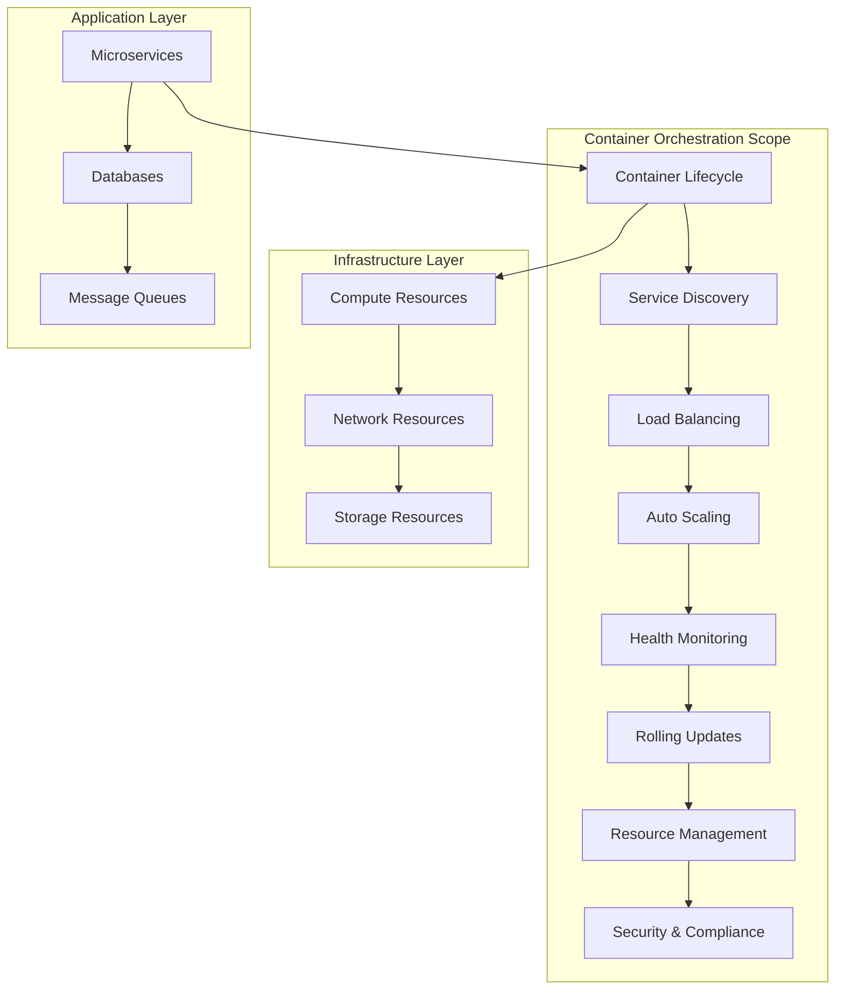
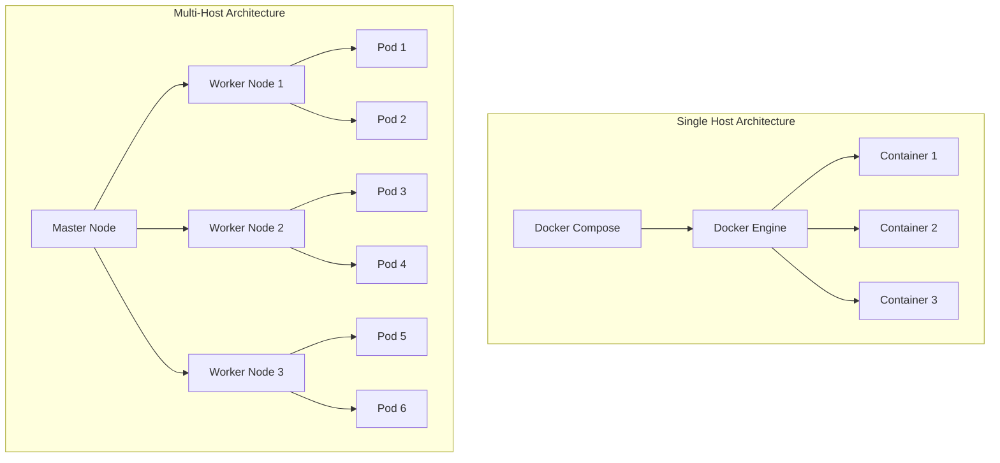

# Session 1: 컨테이너 오케스트레이션 개념 및 필요성

## 📍 교과과정에서의 위치
이 세션은 **Week 2 > Day 3 > Session 1**로, Day 2에서 학습한 컨테이너 최적화를 바탕으로 대규모 컨테이너 환경 관리를 위한 오케스트레이션 개념과 필요성을 심화 분석합니다.

## 학습 목표 (5분)
- **컨테이너 오케스트레이션**의 정의와 **핵심 기능** 완전 이해
- **단일 호스트 vs 멀티 호스트** 컨테이너 관리의 차이점 분석
- **오케스트레이션 플랫폼** 비교와 **선택 기준** 수립

## 1. 이론: 컨테이너 오케스트레이션 정의 및 핵심 기능 (20분)

### 오케스트레이션의 개념과 범위



### 오케스트레이션 핵심 기능 분석

```
컨테이너 오케스트레이션 핵심 기능:

1. 컨테이너 라이프사이클 관리:
├── 컨테이너 배포 및 시작
├── 상태 모니터링 및 헬스 체크
├── 장애 감지 및 자동 복구
├── 그레이스풀 셧다운 처리
├── 롤링 업데이트 및 롤백
├── 버전 관리 및 이력 추적
└── 리소스 정리 및 가비지 컬렉션

2. 서비스 디스커버리 및 네트워킹:
├── 동적 서비스 등록 및 해제
├── DNS 기반 서비스 해석
├── 로드 밸런싱 및 트래픽 분산
├── 서비스 간 통신 라우팅
├── 네트워크 정책 및 보안
├── 외부 트래픽 관리 (Ingress)
└── 서비스 메시 통합

3. 리소스 관리 및 스케줄링:
├── 클러스터 리소스 추상화
├── 워크로드 배치 최적화
├── 리소스 할당 및 제한
├── 노드 선택 및 어피니티
├── 우선순위 기반 스케줄링
├── 리소스 쿼터 관리
└── 멀티 테넌시 지원

4. 자동 스케일링:
├── 수평 스케일링 (Pod 수 조정)
├── 수직 스케일링 (리소스 조정)
├── 클러스터 오토스케일링
├── 메트릭 기반 스케일링
├── 예측적 스케일링
├── 스케줄 기반 스케일링
└── 비용 최적화 스케일링

5. 설정 및 시크릿 관리:
├── 환경별 설정 분리
├── 시크릿 정보 암호화 저장
├── 동적 설정 업데이트
├── 설정 버전 관리
├── 접근 권한 제어
├── 감사 로그 및 추적
└── 컴플라이언스 지원

6. 모니터링 및 로깅:
├── 클러스터 상태 모니터링
├── 애플리케이션 메트릭 수집
├── 중앙집중식 로그 관리
├── 분산 추적 지원
├── 알림 및 에스컬레이션
├── 대시보드 및 시각화
└── 성능 분석 및 최적화
```

### 오케스트레이션의 필요성

```
오케스트레이션이 해결하는 문제:

운영 복잡성 해결:
├── 수동 배포 및 관리의 한계
├── 서비스 간 의존성 관리 복잡성
├── 장애 대응 및 복구 자동화
├── 일관된 환경 구성 보장
├── 휴먼 에러 최소화
└── 운영 표준화 및 자동화

확장성 및 성능:
├── 트래픽 증가에 따른 자동 확장
├── 리소스 사용률 최적화
├── 로드 밸런싱 및 트래픽 분산
├── 지리적 분산 배포
├── 멀티 클라우드 지원
└── 엣지 컴퓨팅 통합

가용성 및 안정성:
├── 고가용성 아키텍처 구현
├── 장애 격리 및 복구
├── 무중단 배포 및 업데이트
├── 재해 복구 자동화
├── 백업 및 복원 관리
└── SLA 보장 체계

보안 및 컴플라이언스:
├── 네트워크 보안 정책 적용
├── 접근 제어 및 인증
├── 시크릿 관리 및 암호화
├── 감사 로그 및 추적
├── 컴플라이언스 자동 검사
└── 보안 취약점 관리

비용 최적화:
├── 리소스 사용률 최적화
├── 자동 스케일링을 통한 비용 절감
├── 멀티 클라우드 비용 관리
├── 스팟 인스턴스 활용
├── 리소스 예약 및 계획
└── 비용 모니터링 및 알림
```

## 2. 이론: 단일 호스트 vs 멀티 호스트 컨테이너 관리 (15분)

### 아키텍처 비교 분석



### 관리 방식 차이점 분석

```
단일 호스트 vs 멀티 호스트 비교:

단일 호스트 컨테이너 관리:
├── 장점:
│   ├── 간단한 설정 및 관리
│   ├── 낮은 학습 곡선
│   ├── 빠른 개발 및 테스트
│   ├── 네트워크 복잡성 최소
│   ├── 디버깅 용이성
│   └── 리소스 오버헤드 최소
├── 단점:
│   ├── 단일 장애점 (SPOF)
│   ├── 확장성 제한
│   ├── 리소스 제약
│   ├── 고가용성 구현 어려움
│   ├── 로드 밸런싱 제한
│   └── 지리적 분산 불가
└── 적용 사례:
    ├── 개발 및 테스트 환경
    ├── 소규모 애플리케이션
    ├── 프로토타입 개발
    ├── 로컬 개발 환경
    └── 단순한 마이크로서비스

멀티 호스트 컨테이너 관리:
├── 장점:
│   ├── 고가용성 및 내결함성
│   ├── 수평 확장성
│   ├── 리소스 풀링 및 최적화
│   ├── 로드 밸런싱 및 분산
│   ├── 지리적 분산 배포
│   ├── 롤링 업데이트 지원
│   └── 엔터프라이즈 기능
├── 단점:
│   ├── 복잡한 설정 및 관리
│   ├── 높은 학습 곡선
│   ├── 네트워크 복잡성 증가
│   ├── 디버깅 어려움
│   ├── 리소스 오버헤드
│   └── 운영 비용 증가
└── 적용 사례:
    ├── 프로덕션 환경
    ├── 대규모 애플리케이션
    ├── 마이크로서비스 아키텍처
    ├── 클라우드 네이티브 애플리케이션
    └── 엔터프라이즈 시스템
```

## 3. 이론: 오케스트레이션 플랫폼 비교 (10분)

### 주요 오케스트레이션 플랫폼

```
오케스트레이션 플랫폼 비교:

Kubernetes:
├── 특징:
│   ├── CNCF 졸업 프로젝트
│   ├── 가장 널리 사용되는 플랫폼
│   ├── 풍부한 생태계 및 커뮤니티
│   ├── 선언적 API 및 YAML 설정
│   ├── 확장 가능한 아키텍처
│   └── 멀티 클라우드 지원
├── 장점:
│   ├── 표준화된 API 및 인터페이스
│   ├── 강력한 스케줄링 및 오토스케일링
│   ├── 풍부한 네트워킹 옵션
│   ├── 활발한 커뮤니티 지원
│   ├── 엔터프라이즈 기능 완비
│   └── 클라우드 제공업체 지원
├── 단점:
│   ├── 높은 복잡성 및 학습 곡선
│   ├── 리소스 오버헤드
│   ├── 설정 및 관리 복잡성
│   └── 과도한 기능으로 인한 복잡성
└── 적용 분야:
    ├── 엔터프라이즈 애플리케이션
    ├── 마이크로서비스 아키텍처
    ├── 클라우드 네이티브 애플리케이션
    └── 대규모 분산 시스템

Docker Swarm:
├── 특징:
│   ├── Docker 네이티브 오케스트레이션
│   ├── 간단한 설정 및 사용
│   ├── Docker Compose 호환성
│   ├── 내장된 로드 밸런싱
│   └── 암호화된 네트워킹
├── 장점:
│   ├── 낮은 학습 곡선
│   ├── Docker와 완전 통합
│   ├── 간단한 클러스터 관리
│   ├── 빠른 배포 및 설정
│   └── 경량화된 아키텍처
├── 단점:
│   ├── 제한된 기능 및 확장성
│   ├── 작은 커뮤니티
│   ├── 엔터프라이즈 기능 부족
│   └── 생태계 제한
└── 적용 분야:
    ├── 중소규모 애플리케이션
    ├── 간단한 마이크로서비스
    ├── 개발 및 테스트 환경
    └── Docker 중심 환경

Apache Mesos:
├── 특징:
│   ├── 범용 클러스터 관리자
│   ├── 두 단계 스케줄링
│   ├── 다양한 워크로드 지원
│   ├── 고성능 및 확장성
│   └── 프레임워크 기반 아키텍처
├── 장점:
│   ├── 높은 성능 및 확장성
│   ├── 다양한 워크로드 통합
│   ├── 리소스 격리 및 공유
│   ├── 멀티 테넌시 지원
│   └── 유연한 스케줄링
├── 단점:
│   ├── 높은 복잡성
│   ├── 제한된 커뮤니티
│   ├── 컨테이너 특화 기능 부족
│   └── 운영 복잡성
└── 적용 분야:
    ├── 대규모 데이터 처리
    ├── 혼합 워크로드 환경
    ├── 고성능 컴퓨팅
    └── 레거시 시스템 통합
```

## 4. 개념 예시: 오케스트레이션 시나리오 분석 (7분)

### 단일 호스트 Docker Compose 예시

```yaml
# Docker Compose 단일 호스트 예시 (개념 예시)
version: '3.8'
services:
  web:
    image: nginx:alpine
    ports:
      - "80:80"
    depends_on:
      - api
    
  api:
    image: myapi:latest
    ports:
      - "8080:8080"
    environment:
      - DB_HOST=database
    depends_on:
      - database
    
  database:
    image: postgres:13
    environment:
      - POSTGRES_DB=myapp
      - POSTGRES_USER=user
      - POSTGRES_PASSWORD=password
    volumes:
      - db_data:/var/lib/postgresql/data

volumes:
  db_data:

# 제한사항:
# - 단일 호스트에서만 실행
# - 호스트 장애 시 전체 서비스 중단
# - 수평 확장 제한
# - 로드 밸런싱 기능 제한
```

### 멀티 호스트 Kubernetes 예시

```yaml
# Kubernetes 멀티 호스트 예시 (개념 예시)
apiVersion: apps/v1
kind: Deployment
metadata:
  name: web-deployment
spec:
  replicas: 3
  selector:
    matchLabels:
      app: web
  template:
    metadata:
      labels:
        app: web
    spec:
      containers:
      - name: nginx
        image: nginx:alpine
        ports:
        - containerPort: 80
        resources:
          requests:
            memory: "64Mi"
            cpu: "250m"
          limits:
            memory: "128Mi"
            cpu: "500m"

---
apiVersion: v1
kind: Service
metadata:
  name: web-service
spec:
  selector:
    app: web
  ports:
  - port: 80
    targetPort: 80
  type: LoadBalancer

# 장점:
# - 여러 노드에 분산 배포
# - 자동 장애 복구
# - 로드 밸런싱 내장
# - 자동 스케일링 지원
```

### 오케스트레이션 선택 기준 예시

```bash
# 오케스트레이션 플랫폼 선택 체크리스트 (개념 예시)

# 1. 애플리케이션 규모
if [ "$app_scale" = "small" ]; then
  echo "Docker Compose 권장"
elif [ "$app_scale" = "medium" ]; then
  echo "Docker Swarm 또는 Kubernetes 검토"
else
  echo "Kubernetes 권장"
fi

# 2. 팀 역량
if [ "$team_k8s_experience" = "low" ]; then
  echo "Docker Swarm으로 시작 후 Kubernetes 전환 고려"
else
  echo "Kubernetes 직접 도입 가능"
fi

# 3. 클라우드 전략
if [ "$cloud_strategy" = "multi_cloud" ]; then
  echo "Kubernetes 필수"
elif [ "$cloud_strategy" = "single_cloud" ]; then
  echo "관리형 서비스 활용 권장"
fi

# 4. 운영 요구사항
if [ "$ha_requirement" = "high" ]; then
  echo "Kubernetes 또는 Mesos 권장"
fi
```

## 5. 토론 및 정리 (3분)

### 핵심 개념 정리
- **컨테이너 오케스트레이션**은 대규모 컨테이너 환경의 필수 요소
- **단일 호스트 vs 멀티 호스트** 관리 방식의 명확한 차이점
- **플랫폼별 특성**을 고려한 적절한 선택 기준
- **비즈니스 요구사항**과 **기술적 제약사항**의 균형

### 토론 주제
"조직의 현재 상황과 미래 계획을 고려할 때, 가장 적합한 컨테이너 오케스트레이션 전략은 무엇인가?"

## 💡 핵심 키워드
- **오케스트레이션**: 자동화, 스케줄링, 서비스 관리, 확장성
- **아키텍처**: 단일 호스트, 멀티 호스트, 분산 시스템
- **플랫폼**: Kubernetes, Docker Swarm, Apache Mesos
- **선택 기준**: 규모, 복잡성, 팀 역량, 요구사항

## 📚 참고 자료
- [Kubernetes 개요](https://kubernetes.io/docs/concepts/overview/)
- [Docker Swarm 가이드](https://docs.docker.com/engine/swarm/)
- [컨테이너 오케스트레이션 비교](https://www.cncf.io/blog/2019/05/17/container-orchestration-landscape/)
