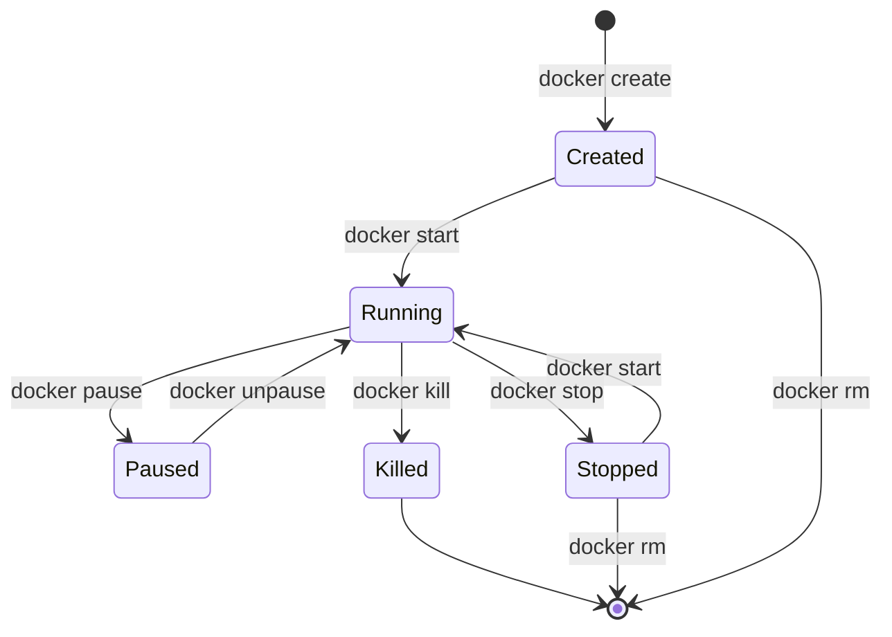

# Session 1: 컨테이너 라이프사이클 관리

## 📍 교과과정에서의 위치
이 세션은 **Week 2 > Day 3 > Session 1**로, Day 2에서 학습한 이미지 빌드 기술을 바탕으로 실제 컨테이너 실행과 관리 방법을 학습합니다.

## 학습 목표 (5분)
- **컨테이너 상태**와 **라이프사이클** 완전 이해
- **컨테이너 관리 명령어** 실무 활용
- **프로세스 관리**와 **시그널 처리** 실습

## 1. 이론: 컨테이너 라이프사이클 (20분)

### 컨테이너 상태 다이어그램



### 컨테이너 상태별 특징

```
컨테이너 상태 분석:

1. Created (생성됨)
├── 이미지에서 컨테이너 생성
├── 파일시스템 준비 완료
├── 네트워크 설정 대기
└── 프로세스 시작 전 상태

2. Running (실행 중)
├── 메인 프로세스 실행 중
├── 리소스 사용 중
├── 네트워크 통신 가능
└── 로그 생성 중

3. Paused (일시정지)
├── 프로세스 freeze 상태
├── 메모리 상태 보존
├── CPU 사용 중단
└── 네트워크 통신 중단

4. Stopped (중지됨)
├── 메인 프로세스 종료
├── 파일시스템 보존
├── 메모리 해제
└── 재시작 가능

5. Killed (강제종료)
├── SIGKILL 시그널로 종료
├── 정상 종료 절차 생략
├── 데이터 손실 위험
└── 즉시 종료
```

### 프로세스와 시그널 관리

```
Docker 시그널 처리:

SIGTERM (15):
├── 정상 종료 요청
├── 애플리케이션 정리 시간 제공
├── docker stop 기본 시그널
└── 30초 타임아웃 후 SIGKILL

SIGKILL (9):
├── 강제 즉시 종료
├── 정리 작업 불가
├── docker kill 기본 시그널
└── 데이터 손실 위험

SIGHUP (1):
├── 설정 재로드
├── 로그 파일 재오픈
├── 서비스 재시작 없이 갱신
└── 애플리케이션별 구현 필요

SIGUSR1/SIGUSR2:
├── 사용자 정의 시그널
├── 애플리케이션별 용도
├── 디버그 정보 출력
└── 상태 덤프 등
```

## 2. 실습: 기본 컨테이너 관리 (15분)

### 컨테이너 생성과 실행

```bash
# 컨테이너 생성 (실행하지 않음)
docker create --name test-container nginx:alpine
docker ps -a

# 컨테이너 시작
docker start test-container
docker ps

# 실행 중인 컨테이너 상태 확인
docker inspect test-container --format '{{.State.Status}}'
docker inspect test-container --format '{{.State.Pid}}'

# 한 번에 생성하고 실행
docker run -d --name web-server -p 8080:80 nginx:alpine

# 컨테이너 목록 확인
docker ps --format "table {{.Names}}\t{{.Status}}\t{{.Ports}}"
```

### 컨테이너 상태 제어

```bash
# 컨테이너 일시정지
docker pause web-server
docker ps --format "table {{.Names}}\t{{.Status}}"

# 일시정지 해제
docker unpause web-server
docker ps --format "table {{.Names}}\t{{.Status}}"

# 컨테이너 중지 (SIGTERM)
docker stop web-server

# 강제 종료 (SIGKILL)
docker run -d --name busy-container alpine sleep 3600
docker kill busy-container

# 컨테이너 재시작
docker restart web-server
```

### 컨테이너 정보 조회

```bash
# 상세 정보 확인
docker inspect web-server

# 특정 정보만 추출
docker inspect web-server --format '{{.Config.Image}}'
docker inspect web-server --format '{{.NetworkSettings.IPAddress}}'
docker inspect web-server --format '{{.State.StartedAt}}'

# 실행 중인 프로세스 확인
docker top web-server

# 리소스 사용량 확인
docker stats web-server --no-stream
```

## 3. 실습: 시그널과 프로세스 관리 (10분)

### 시그널 테스트 애플리케이션

```bash
# 시그널 처리 테스트 스크립트 생성
cat > signal-test.sh << 'EOF'
#!/bin/bash

cleanup() {
    echo "$(date): Received SIGTERM, cleaning up..."
    sleep 2
    echo "$(date): Cleanup complete, exiting"
    exit 0
}

reload() {
    echo "$(date): Received SIGHUP, reloading configuration"
}

debug() {
    echo "$(date): Received SIGUSR1, dumping debug info"
    echo "PID: $$, PPID: $PPID"
    ps aux
}

trap cleanup SIGTERM
trap reload SIGHUP
trap debug SIGUSR1

echo "$(date): Signal test application started (PID: $$)"

while true; do
    echo "$(date): Application running..."
    sleep 5
done
EOF

chmod +x signal-test.sh

# 시그널 테스트 컨테이너 실행
docker run -d --name signal-test -v $(pwd)/signal-test.sh:/app/signal-test.sh alpine sh -c "cd /app && ./signal-test.sh"

# 로그 확인
docker logs -f signal-test &
LOG_PID=$!

# 시그널 전송 테스트
sleep 3
echo "Sending SIGHUP..."
docker kill -s HUP signal-test

sleep 3
echo "Sending SIGUSR1..."
docker kill -s USR1 signal-test

sleep 3
echo "Sending SIGTERM..."
docker stop signal-test

# 로그 프로세스 종료
kill $LOG_PID 2>/dev/null
```

### 컨테이너 재시작 정책

```bash
# 재시작 정책 테스트
docker run -d --name restart-test --restart=always alpine sh -c 'echo "Starting..."; sleep 10; exit 1'

# 컨테이너 상태 모니터링
for i in {1..5}; do
    echo "Check $i:"
    docker ps --filter name=restart-test --format "table {{.Names}}\t{{.Status}}"
    sleep 5
done

# 다양한 재시작 정책
docker run -d --name no-restart --restart=no alpine sh -c 'exit 1'
docker run -d --name on-failure --restart=on-failure:3 alpine sh -c 'exit 1'
docker run -d --name unless-stopped --restart=unless-stopped alpine sleep 3600

# 재시작 정책 확인
docker inspect no-restart --format '{{.HostConfig.RestartPolicy}}'
docker inspect on-failure --format '{{.HostConfig.RestartPolicy}}'
docker inspect unless-stopped --format '{{.HostConfig.RestartPolicy}}'
```

## 4. 실습: 컨테이너 디버깅 (10분)

### 실행 중인 컨테이너 접근

```bash
# 실행 중인 컨테이너에 명령 실행
docker exec web-server ps aux
docker exec web-server ls -la /etc/nginx/

# 인터랙티브 셸 접근
docker exec -it web-server sh

# 새로운 프로세스로 디버깅 도구 실행
docker exec web-server netstat -tlnp
docker exec web-server cat /proc/meminfo
docker exec web-server df -h

# 파일 복사
echo "Custom config" > custom.conf
docker cp custom.conf web-server:/tmp/
docker exec web-server cat /tmp/custom.conf
```

### 컨테이너 로그 관리

```bash
# 로그 확인
docker logs web-server
docker logs --tail 10 web-server
docker logs --since "2024-01-01T00:00:00" web-server
docker logs -f web-server &

# 로그 드라이버 확인
docker inspect web-server --format '{{.HostConfig.LogConfig}}'

# 로그 크기 제한 설정
docker run -d --name limited-logs \
    --log-opt max-size=10m \
    --log-opt max-file=3 \
    nginx:alpine

# 로그 정보 확인
docker inspect limited-logs --format '{{.HostConfig.LogConfig}}'
```

### 컨테이너 문제 해결

```bash
# 종료된 컨테이너 분석
docker run --name failed-container alpine sh -c 'echo "Error occurred"; exit 1'

# 종료 코드 확인
docker inspect failed-container --format '{{.State.ExitCode}}'

# 종료 이유 확인
docker inspect failed-container --format '{{.State.Error}}'

# 마지막 로그 확인
docker logs failed-container

# 컨테이너 이벤트 확인
docker events --filter container=failed-container --since "1h" &
EVENTS_PID=$!

# 새 컨테이너로 테스트
docker run --name event-test alpine echo "Test complete"
docker rm event-test

sleep 2
kill $EVENTS_PID 2>/dev/null
```

## 5. 실습: 컨테이너 정리 및 관리 (10분)

### 컨테이너 정리 전략

```bash
# 모든 컨테이너 상태 확인
docker ps -a --format "table {{.Names}}\t{{.Status}}\t{{.Size}}"

# 중지된 컨테이너 정리
docker container prune -f

# 특정 조건으로 컨테이너 정리
docker ps -a --filter "status=exited" --filter "exited=0" -q | xargs -r docker rm

# 라벨 기반 정리
docker run -d --name temp-container --label "env=test" alpine sleep 60
docker ps --filter "label=env=test" -q | xargs -r docker stop
docker ps -a --filter "label=env=test" -q | xargs -r docker rm

# 시간 기반 정리 (24시간 이전 생성)
docker ps -a --filter "until=24h" -q | xargs -r docker rm

# 컨테이너 통계
echo "=== Container Statistics ==="
echo "Total containers: $(docker ps -a -q | wc -l)"
echo "Running containers: $(docker ps -q | wc -l)"
echo "Stopped containers: $(docker ps -a --filter 'status=exited' -q | wc -l)"
```

### 자동화된 관리 스크립트

```bash
# 컨테이너 관리 스크립트 생성
cat > container-manager.sh << 'EOF'
#!/bin/bash

show_status() {
    echo "=== Container Status ==="
    docker ps -a --format "table {{.Names}}\t{{.Status}}\t{{.RunningFor}}\t{{.Size}}"
}

cleanup_containers() {
    echo "=== Cleaning up containers ==="
    
    # 중지된 컨테이너 제거
    STOPPED=$(docker ps -a --filter "status=exited" -q)
    if [ ! -z "$STOPPED" ]; then
        echo "Removing stopped containers..."
        docker rm $STOPPED
    fi
    
    # 생성만 된 컨테이너 제거
    CREATED=$(docker ps -a --filter "status=created" -q)
    if [ ! -z "$CREATED" ]; then
        echo "Removing created containers..."
        docker rm $CREATED
    fi
}

restart_unhealthy() {
    echo "=== Restarting unhealthy containers ==="
    UNHEALTHY=$(docker ps --filter "health=unhealthy" -q)
    if [ ! -z "$UNHEALTHY" ]; then
        echo "Restarting unhealthy containers..."
        docker restart $UNHEALTHY
    fi
}

case "$1" in
    status)
        show_status
        ;;
    cleanup)
        cleanup_containers
        ;;
    restart)
        restart_unhealthy
        ;;
    all)
        show_status
        cleanup_containers
        restart_unhealthy
        ;;
    *)
        echo "Usage: $0 {status|cleanup|restart|all}"
        exit 1
        ;;
esac
EOF

chmod +x container-manager.sh

# 스크립트 테스트
./container-manager.sh status
./container-manager.sh cleanup
```

## 6. Q&A 및 정리 (5분)

### 컨테이너 라이프사이클 체크리스트

```bash
# 최종 정리 및 확인
echo "=== Container Lifecycle Summary ==="

# 1. 생성
docker create --name lifecycle-demo nginx:alpine
echo "✓ Container created"

# 2. 시작
docker start lifecycle-demo
echo "✓ Container started"

# 3. 상태 확인
docker ps --filter name=lifecycle-demo --format "{{.Status}}"

# 4. 일시정지
docker pause lifecycle-demo
echo "✓ Container paused"

# 5. 재개
docker unpause lifecycle-demo
echo "✓ Container unpaused"

# 6. 중지
docker stop lifecycle-demo
echo "✓ Container stopped"

# 7. 제거
docker rm lifecycle-demo
echo "✓ Container removed"

# 전체 정리
docker stop $(docker ps -q) 2>/dev/null || true
docker rm $(docker ps -aq) 2>/dev/null || true
echo "✓ All containers cleaned up"
```

## 💡 핵심 키워드
- **라이프사이클**: Created, Running, Paused, Stopped, Killed
- **시그널 처리**: SIGTERM, SIGKILL, SIGHUP, SIGUSR1/2
- **재시작 정책**: no, always, on-failure, unless-stopped
- **컨테이너 관리**: start, stop, pause, restart, kill

## 📚 참고 자료
- [Docker 컨테이너 관리](https://docs.docker.com/engine/reference/commandline/container/)
- [시그널 처리](https://docs.docker.com/engine/reference/builder/#signal)
- [재시작 정책](https://docs.docker.com/config/containers/start-containers-automatically/)

## 🔧 실습 체크리스트
- [ ] 컨테이너 상태 전환 실습 완료
- [ ] 시그널 처리 테스트 성공
- [ ] 재시작 정책 설정 및 확인
- [ ] 컨테이너 디버깅 기법 습득
- [ ] 자동화된 관리 스크립트 작성
