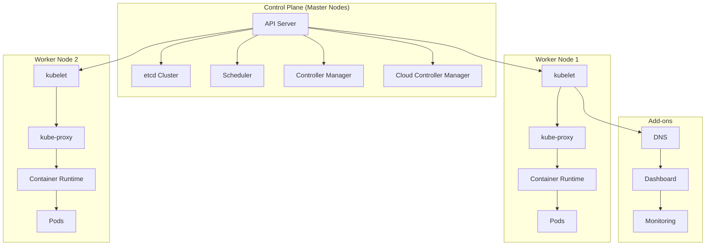
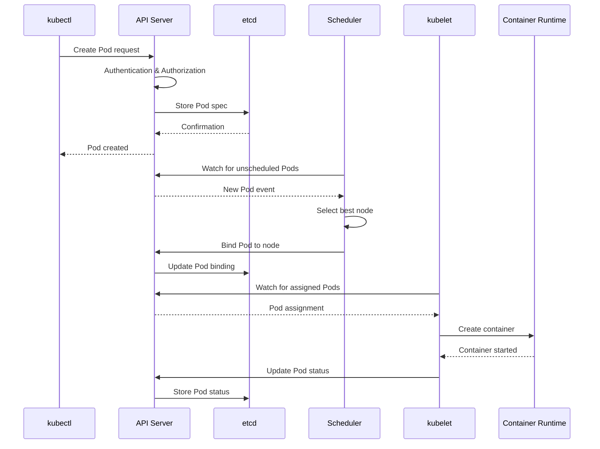

# Session 2: Kubernetes 아키텍처 심화 분석

## 📍 교과과정에서의 위치
이 세션은 **Week 2 > Day 3 > Session 2**로, 컨테이너 오케스트레이션 개념 이해를 바탕으로 Kubernetes의 내부 아키텍처와 핵심 컴포넌트 간의 상호작용을 심화 분석합니다.

## 학습 목표 (5분)
- **Kubernetes 클러스터 아키텍처** 및 **컴포넌트 역할** 완전 이해
- **마스터 노드와 워커 노드** 간의 **통신 메커니즘** 분석
- **etcd 클러스터**와 **상태 관리** 시스템 구조 파악

## 1. 이론: Kubernetes 클러스터 아키텍처 (20분)

### 전체 클러스터 구조



### 컨트롤 플레인 컴포넌트 상세 분석

```
Kubernetes 컨트롤 플레인 구성:

API Server (kube-apiserver):
├── 역할 및 기능:
│   ├── 클러스터의 중앙 관리 지점
│   ├── RESTful API 엔드포인트 제공
│   ├── 인증 및 권한 부여 처리
│   ├── 요청 검증 및 승인 제어
│   ├── etcd와의 유일한 통신 인터페이스
│   ├── 감시(Watch) API 제공
│   └── 클러스터 상태 변경 이벤트 발행
├── 아키텍처 특징:
│   ├── 무상태(Stateless) 설계
│   ├── 수평 확장 가능
│   ├── 로드 밸런서를 통한 고가용성
│   ├── TLS 암호화 통신
│   ├── 플러그인 아키텍처 지원
│   └── OpenAPI 스펙 준수
└── 주요 API 그룹:
    ├── Core API (v1): Pod, Service, ConfigMap
    ├── Apps API (apps/v1): Deployment, ReplicaSet
    ├── Networking API: NetworkPolicy, Ingress
    ├── Storage API: PersistentVolume, StorageClass
    ├── RBAC API: Role, RoleBinding, ClusterRole
    └── Custom Resource Definitions (CRDs)

etcd 클러스터:
├── 역할 및 기능:
│   ├── 분산 키-값 저장소
│   ├── 클러스터 상태 정보 저장
│   ├── 설정 데이터 및 메타데이터 관리
│   ├── 서비스 디스커버리 지원
│   ├── 분산 락 메커니즘 제공
│   ├── 감시(Watch) 기능 지원
│   └── 스냅샷 및 백업 기능
├── 아키텍처 특징:
│   ├── Raft 합의 알고리즘 사용
│   ├── 강한 일관성 보장
│   ├── 홀수 개 노드 구성 권장 (3, 5, 7)
│   ├── 리더-팔로워 구조
│   ├── 자동 장애 조치
│   └── TLS 상호 인증
└── 저장 데이터:
    ├── 클러스터 구성 정보
    ├── 리소스 오브젝트 상태
    ├── 네트워크 정책 및 설정
    ├── 시크릿 및 ConfigMap
    ├── 서비스 엔드포인트 정보
    └── 노드 및 Pod 메타데이터

Scheduler (kube-scheduler):
├── 역할 및 기능:
│   ├── Pod를 적절한 노드에 배치
│   ├── 리소스 요구사항 분석
│   ├── 노드 선택 알고리즘 실행
│   ├── 어피니티 및 안티-어피니티 처리
│   ├── 테인트 및 톨러레이션 고려
│   ├── 우선순위 기반 스케줄링
│   └── 커스텀 스케줄러 지원
├── 스케줄링 프로세스:
│   ├── 1단계: 필터링 (Predicates)
│   ├── 2단계: 점수 매기기 (Priorities)
│   ├── 3단계: 최적 노드 선택
│   ├── 4단계: 바인딩 요청 생성
│   └── 5단계: API 서버에 결과 전송
└── 스케줄링 정책:
    ├── 리소스 기반 스케줄링
    ├── 노드 어피니티 스케줄링
    ├── Pod 어피니티/안티-어피니티
    ├── 테인트 및 톨러레이션
    ├── 토폴로지 분산 제약
    └── 우선순위 클래스 기반

Controller Manager (kube-controller-manager):
├── 역할 및 기능:
│   ├── 클러스터 상태 감시 및 조정
│   ├── 선언적 상태와 실제 상태 동기화
│   ├── 다양한 컨트롤러 실행 및 관리
│   ├── 이벤트 기반 상태 변경 처리
│   ├── 자동 복구 및 자가 치유
│   └── 리소스 가비지 컬렉션
├── 주요 컨트롤러:
│   ├── Deployment Controller: 배포 관리
│   ├── ReplicaSet Controller: 복제본 관리
│   ├── Service Controller: 서비스 엔드포인트 관리
│   ├── Node Controller: 노드 상태 관리
│   ├── Namespace Controller: 네임스페이스 관리
│   ├── PersistentVolume Controller: 스토리지 관리
│   └── Job Controller: 배치 작업 관리
└── 제어 루프 패턴:
    ├── 현재 상태 관찰 (Observe)
    ├── 원하는 상태와 비교 (Diff)
    ├── 조정 작업 수행 (Act)
    └── 지속적인 모니터링 (Loop)
```

### 워커 노드 컴포넌트 분석

```
워커 노드 구성 요소:

kubelet:
├── 역할 및 기능:
│   ├── 노드의 Kubernetes 에이전트
│   ├── Pod 생명주기 관리
│   ├── 컨테이너 런타임과 통신
│   ├── 노드 상태 보고
│   ├── 볼륨 마운트 관리
│   ├── 헬스 체크 수행
│   └── 리소스 사용량 모니터링
├── 주요 기능:
│   ├── Pod 스펙 해석 및 실행
│   ├── 컨테이너 이미지 풀링
│   ├── 네트워크 및 스토리지 설정
│   ├── 로그 수집 및 전달
│   ├── 메트릭 수집 및 노출
│   └── 보안 컨텍스트 적용
└── 통신 인터페이스:
    ├── API 서버와 HTTPS 통신
    ├── Container Runtime Interface (CRI)
    ├── Container Network Interface (CNI)
    ├── Container Storage Interface (CSI)
    └── Device Plugin API

kube-proxy:
├── 역할 및 기능:
│   ├── 서비스 추상화 구현
│   ├── 로드 밸런싱 및 트래픽 라우팅
│   ├── 네트워크 규칙 관리
│   ├── 서비스 디스커버리 지원
│   ├── 클러스터 내부 통신 처리
│   └── 외부 트래픽 라우팅
├── 프록시 모드:
│   ├── iptables 모드 (기본)
│   ├── IPVS 모드 (고성능)
│   ├── userspace 모드 (레거시)
│   └── kernelspace 모드 (실험적)
└── 네트워크 기능:
    ├── 서비스 IP 가상화
    ├── 엔드포인트 로드 밸런싱
    ├── 세션 어피니티 지원
    ├── 외부 IP 및 NodePort 처리
    └── 네트워크 정책 적용

Container Runtime:
├── 지원 런타임:
│   ├── containerd (권장)
│   ├── CRI-O
│   ├── Docker Engine (deprecated)
│   └── 기타 CRI 호환 런타임
├── CRI 인터페이스:
│   ├── 이미지 관리 API
│   ├── 컨테이너 생명주기 API
│   ├── 샌드박스 관리 API
│   └── 스트리밍 API
└── 런타임 기능:
    ├── 컨테이너 실행 및 관리
    ├── 이미지 풀링 및 캐싱
    ├── 네트워크 네임스페이스 관리
    ├── 스토리지 마운트 처리
    └── 보안 컨텍스트 적용
```

## 2. 이론: 컴포넌트 간 통신 메커니즘 (15분)

### API 서버 중심 통신 아키텍처



### 통신 보안 및 인증

```
Kubernetes 보안 통신:

TLS 암호화:
├── 모든 컴포넌트 간 TLS 통신
├── 상호 TLS 인증 (mTLS)
├── 인증서 기반 신원 확인
├── 인증서 자동 갱신
├── 암호화 알고리즘 정책
└── 보안 채널 설정

인증 메커니즘:
├── X.509 클라이언트 인증서
├── 서비스 어카운트 토큰
├── OpenID Connect (OIDC)
├── 웹훅 토큰 인증
├── 프록시 인증
└── 익명 요청 처리

권한 부여 (Authorization):
├── RBAC (Role-Based Access Control)
├── ABAC (Attribute-Based Access Control)
├── 웹훅 권한 부여
├── 노드 권한 부여
└── 항상 허용/거부 모드

승인 제어 (Admission Control):
├── 변형 승인 컨트롤러 (Mutating)
├── 검증 승인 컨트롤러 (Validating)
├── 동적 승인 제어 (Webhooks)
├── 정책 기반 승인 제어
└── 리소스 쿼터 적용
```

## 3. 이론: etcd 클러스터와 상태 관리 (10분)

### etcd 아키텍처 및 데이터 모델

```
etcd 클러스터 구성:

Raft 합의 알고리즘:
├── 리더 선출 메커니즘
├── 로그 복제 프로토콜
├── 안전성 보장 (Safety)
├── 활성도 보장 (Liveness)
├── 분할 내성 (Partition Tolerance)
└── 강한 일관성 (Strong Consistency)

클러스터 토폴로지:
├── 홀수 개 노드 구성 (3, 5, 7)
├── 쿼럼 기반 의사결정
├── 리더-팔로워 역할 분담
├── 자동 장애 조치
├── 네트워크 분할 처리
└── 노드 추가/제거 동적 처리

데이터 저장 구조:
├── 키-값 저장 모델
├── 계층적 키 네임스페이스
├── 버전 관리 및 히스토리
├── TTL (Time To Live) 지원
├── 트랜잭션 처리
└── 압축 및 최적화

백업 및 복구:
├── 스냅샷 기반 백업
├── 증분 백업 지원
├── 포인트-인-타임 복구
├── 클러스터 간 복제
├── 재해 복구 절차
└── 데이터 무결성 검증
```

### Kubernetes 상태 관리

```
클러스터 상태 관리:

리소스 상태 추적:
├── 선언적 상태 (Desired State)
├── 현재 상태 (Current State)
├── 관찰된 상태 (Observed State)
├── 상태 전이 추적
├── 이벤트 기반 업데이트
└── 최종 일관성 보장

Watch 메커니즘:
├── 실시간 상태 변경 감지
├── 이벤트 스트림 처리
├── 효율적인 폴링 대체
├── 네트워크 대역폭 최적화
├── 클라이언트 캐싱 지원
└── 재연결 및 재동기화

리소스 버전 관리:
├── 낙관적 동시성 제어
├── 충돌 감지 및 해결
├── 버전 기반 업데이트
├── 조건부 업데이트 지원
├── 원자적 연산 보장
└── 데이터 경합 방지
```

## 4. 개념 예시: 아키텍처 구성 분석 (7분)

### 클러스터 구성 예시

```yaml
# 고가용성 클러스터 구성 (개념 예시)
apiVersion: kubeadm.k8s.io/v1beta3
kind: ClusterConfiguration
metadata:
  name: ha-cluster
kubernetesVersion: v1.28.0
controlPlaneEndpoint: "k8s-api.example.com:6443"
etcd:
  external:
    endpoints:
    - https://etcd1.example.com:2379
    - https://etcd2.example.com:2379
    - https://etcd3.example.com:2379
    caFile: /etc/kubernetes/pki/etcd/ca.crt
    certFile: /etc/kubernetes/pki/apiserver-etcd-client.crt
    keyFile: /etc/kubernetes/pki/apiserver-etcd-client.key
networking:
  serviceSubnet: "10.96.0.0/12"
  podSubnet: "10.244.0.0/16"
apiServer:
  extraArgs:
    audit-log-maxage: "30"
    audit-log-maxbackup: "3"
    audit-log-maxsize: "100"
    audit-log-path: /var/log/audit.log
  certSANs:
  - "k8s-api.example.com"
  - "10.0.0.100"
controllerManager:
  extraArgs:
    bind-address: "0.0.0.0"
scheduler:
  extraArgs:
    bind-address: "0.0.0.0"
```

### 컴포넌트 상태 확인 예시

```bash
# 클러스터 컴포넌트 상태 확인 (개념 예시)

# 노드 상태 확인
kubectl get nodes -o wide

# 컨트롤 플레인 컴포넌트 상태
kubectl get pods -n kube-system

# etcd 클러스터 상태 확인
kubectl exec -n kube-system etcd-master1 -- etcdctl \
  --endpoints=https://127.0.0.1:2379 \
  --cacert=/etc/kubernetes/pki/etcd/ca.crt \
  --cert=/etc/kubernetes/pki/etcd/server.crt \
  --key=/etc/kubernetes/pki/etcd/server.key \
  endpoint health

# API 서버 상태 확인
kubectl get --raw='/healthz'

# 스케줄러 리더 확인
kubectl get endpoints kube-scheduler -n kube-system -o yaml
```

### 통신 흐름 추적 예시

```bash
# API 요청 추적 (개념 예시)

# API 서버 감사 로그 확인
tail -f /var/log/audit.log | grep "Pod"

# kubelet 로그 확인
journalctl -u kubelet -f

# 네트워크 통신 확인
tcpdump -i any port 6443 -n

# etcd 통신 모니터링
etcdctl watch --prefix /registry/pods/
```

## 5. 토론 및 정리 (3분)

### 핵심 개념 정리
- **Kubernetes 아키텍처**는 마스터-워커 노드 구조로 설계
- **API 서버**가 모든 통신의 중심 역할 수행
- **etcd**를 통한 분산 상태 관리와 강한 일관성 보장
- **컴포넌트 간 보안 통신**과 인증/권한 부여 체계

### 토론 주제
"Kubernetes 아키텍처의 각 컴포넌트가 고가용성과 확장성을 보장하기 위해 어떻게 설계되었는가?"

## 💡 핵심 키워드
- **아키텍처**: 컨트롤 플레인, 워커 노드, 분산 시스템
- **핵심 컴포넌트**: API 서버, etcd, 스케줄러, kubelet
- **통신 메커니즘**: TLS, 인증, 권한 부여, Watch API
- **상태 관리**: Raft 합의, 선언적 상태, 최종 일관성

## 📚 참고 자료
- [Kubernetes 아키텍처](https://kubernetes.io/docs/concepts/architecture/)
- [etcd 문서](https://etcd.io/docs/)
- [Kubernetes API 개념](https://kubernetes.io/docs/concepts/overview/kubernetes-api/)
