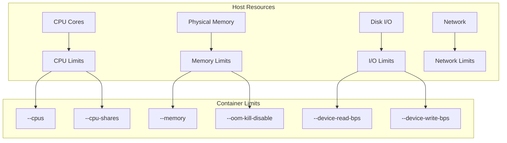

# Session 2: 컨테이너 리소스 관리

## 📍 교과과정에서의 위치
이 세션은 **Week 2 > Day 3 > Session 2**로, Session 1의 컨테이너 라이프사이클 관리를 바탕으로 실제 운영 환경에서 필요한 리소스 제한과 최적화 기법을 학습합니다.

## 학습 목표 (5분)
- **CPU, 메모리, 디스크** 리소스 제한 설정
- **리소스 모니터링**과 **성능 최적화** 실습
- **컨테이너 간 리소스 격리** 및 **QoS** 관리

## 1. 이론: 컨테이너 리소스 관리 (20분)

### 리소스 제한 구조



### 리소스 제한 옵션

```
CPU 제한:
├── --cpus: CPU 코어 수 제한 (예: 1.5)
├── --cpu-shares: 상대적 CPU 가중치 (기본: 1024)
├── --cpu-period: CPU 스케줄링 주기 (마이크로초)
├── --cpu-quota: 주기당 CPU 사용 시간
└── --cpuset-cpus: 특정 CPU 코어 할당

메모리 제한:
├── --memory: 메모리 사용량 제한
├── --memory-swap: 스왑 메모리 제한
├── --memory-reservation: 소프트 메모리 제한
├── --oom-kill-disable: OOM 킬러 비활성화
└── --kernel-memory: 커널 메모리 제한

디스크 I/O 제한:
├── --device-read-bps: 읽기 속도 제한
├── --device-write-bps: 쓰기 속도 제한
├── --device-read-iops: 읽기 IOPS 제한
└── --device-write-iops: 쓰기 IOPS 제한
```

## 2. 실습: CPU 리소스 관리 (15분)

### CPU 제한 설정

```bash
# CPU 집약적 작업 컨테이너
docker run -d --name cpu-unlimited alpine sh -c 'while true; do :; done'

# CPU 제한 컨테이너 (0.5 코어)
docker run -d --name cpu-limited --cpus="0.5" alpine sh -c 'while true; do :; done'

# CPU 가중치 설정
docker run -d --name cpu-high --cpu-shares=1024 alpine sh -c 'while true; do :; done'
docker run -d --name cpu-low --cpu-shares=512 alpine sh -c 'while true; do :; done'

# 특정 CPU 코어 할당
docker run -d --name cpu-pinned --cpuset-cpus="0" alpine sh -c 'while true; do :; done'

# CPU 사용량 모니터링
docker stats --format "table {{.Name}}\t{{.CPUPerc}}\t{{.MemUsage}}" --no-stream
```

### CPU 성능 테스트

```bash
# CPU 벤치마크 스크립트
cat > cpu-benchmark.sh << 'EOF'
#!/bin/bash
echo "Starting CPU benchmark..."
start_time=$(date +%s)

# CPU 집약적 작업 (소수 계산)
for i in {1..100000}; do
    factor $i > /dev/null
done

end_time=$(date +%s)
duration=$((end_time - start_time))
echo "Benchmark completed in ${duration} seconds"
EOF

chmod +x cpu-benchmark.sh

# 제한 없는 컨테이너
docker run --rm --name bench-unlimited -v $(pwd)/cpu-benchmark.sh:/benchmark.sh alpine sh /benchmark.sh

# CPU 제한 컨테이너
docker run --rm --name bench-limited --cpus="0.5" -v $(pwd)/cpu-benchmark.sh:/benchmark.sh alpine sh /benchmark.sh

# 결과 비교
echo "Performance comparison completed"
```

## 3. 실습: 메모리 리소스 관리 (15분)

### 메모리 제한 설정

```bash
# 메모리 제한 컨테이너 (128MB)
docker run -d --name mem-limited --memory="128m" alpine sh -c 'sleep 3600'

# 메모리 + 스왑 제한
docker run -d --name mem-swap --memory="128m" --memory-swap="256m" alpine sh -c 'sleep 3600'

# 메모리 예약 설정
docker run -d --name mem-reserved --memory="256m" --memory-reservation="128m" alpine sh -c 'sleep 3600'

# 메모리 사용량 확인
docker stats --format "table {{.Name}}\t{{.MemUsage}}\t{{.MemPerc}}" --no-stream
```

### 메모리 스트레스 테스트

```bash
# 메모리 할당 테스트 스크립트
cat > memory-test.sh << 'EOF'
#!/bin/bash
echo "Starting memory allocation test..."

# 메모리 할당 (100MB씩)
for i in {1..5}; do
    echo "Allocating ${i}00MB..."
    dd if=/dev/zero of=/tmp/memory_${i} bs=1M count=100 2>/dev/null
    sleep 2
    echo "Current memory usage:"
    free -m
done

echo "Memory test completed"
sleep 10

# 정리
rm -f /tmp/memory_*
EOF

chmod +x memory-test.sh

# 메모리 제한 없는 컨테이너
docker run --rm --name mem-test-unlimited -v $(pwd)/memory-test.sh:/test.sh alpine sh /test.sh

# 메모리 제한 컨테이너 (200MB)
docker run --rm --name mem-test-limited --memory="200m" -v $(pwd)/memory-test.sh:/test.sh alpine sh /test.sh || echo "Container killed by OOM"
```

### OOM 킬러 동작 확인

```bash
# OOM 테스트 컨테이너
docker run -d --name oom-test --memory="50m" alpine sh -c '
    echo "Allocating memory beyond limit..."
    dd if=/dev/zero of=/tmp/big_file bs=1M count=100
'

# 컨테이너 상태 확인
sleep 5
docker ps -a --filter name=oom-test --format "table {{.Names}}\t{{.Status}}"

# 종료 코드 확인 (137 = OOM killed)
docker inspect oom-test --format '{{.State.ExitCode}}'

# 로그 확인
docker logs oom-test
```

## 4. 실습: 디스크 I/O 제한 (10분)

### I/O 제한 설정

```bash
# 디스크 I/O 제한 컨테이너
docker run -d --name io-limited \
    --device-write-bps /dev/sda:1mb \
    --device-read-bps /dev/sda:1mb \
    alpine sh -c 'sleep 3600'

# I/O 테스트 스크립트
cat > io-test.sh << 'EOF'
#!/bin/bash
echo "Starting I/O performance test..."

# 쓰기 테스트
echo "Write test:"
time dd if=/dev/zero of=/tmp/test_write bs=1M count=100 2>&1

# 읽기 테스트
echo "Read test:"
time dd if=/tmp/test_write of=/dev/null bs=1M 2>&1

# 정리
rm -f /tmp/test_write
EOF

chmod +x io-test.sh

# I/O 제한 없는 컨테이너
docker run --rm --name io-unlimited -v $(pwd)/io-test.sh:/test.sh alpine sh /test.sh

# I/O 제한 컨테이너
docker run --rm --name io-limited \
    --device-write-bps /dev/sda:10mb \
    --device-read-bps /dev/sda:10mb \
    -v $(pwd)/io-test.sh:/test.sh alpine sh /test.sh
```

## 5. 실습: 리소스 모니터링 (10분)

### 실시간 모니터링

```bash
# 다양한 리소스 사용 컨테이너 실행
docker run -d --name monitor-cpu --cpus="0.5" alpine sh -c 'while true; do :; done'
docker run -d --name monitor-mem --memory="100m" alpine sh -c 'dd if=/dev/zero of=/tmp/mem bs=1M count=50; sleep 3600'
docker run -d --name monitor-io alpine sh -c 'while true; do dd if=/dev/zero of=/tmp/io bs=1M count=10; rm /tmp/io; done'

# 실시간 모니터링
docker stats --format "table {{.Name}}\t{{.CPUPerc}}\t{{.MemUsage}}\t{{.MemPerc}}\t{{.NetIO}}\t{{.BlockIO}}" &
STATS_PID=$!

sleep 10
kill $STATS_PID

# 개별 컨테이너 상세 정보
docker inspect monitor-cpu --format '{{.HostConfig.CpuShares}}'
docker inspect monitor-mem --format '{{.HostConfig.Memory}}'
```

### 모니터링 스크립트

```bash
# 리소스 모니터링 스크립트
cat > resource-monitor.sh << 'EOF'
#!/bin/bash

monitor_resources() {
    echo "=== Container Resource Usage ==="
    echo "$(date)"
    echo ""
    
    # CPU 사용률 상위 5개
    echo "Top 5 CPU Usage:"
    docker stats --no-stream --format "table {{.Name}}\t{{.CPUPerc}}" | sort -k2 -nr | head -6
    echo ""
    
    # 메모리 사용률 상위 5개
    echo "Top 5 Memory Usage:"
    docker stats --no-stream --format "table {{.Name}}\t{{.MemUsage}}\t{{.MemPerc}}" | sort -k3 -nr | head -6
    echo ""
    
    # 전체 시스템 리소스
    echo "System Resources:"
    echo "CPU: $(top -bn1 | grep "Cpu(s)" | awk '{print $2}' | cut -d'%' -f1)% used"
    echo "Memory: $(free | grep Mem | awk '{printf "%.1f%%", $3/$2 * 100.0}')"
    echo "Disk: $(df -h / | awk 'NR==2{print $5}')"
    echo ""
}

# 연속 모니터링
for i in {1..5}; do
    monitor_resources
    sleep 5
done
EOF

chmod +x resource-monitor.sh
./resource-monitor.sh
```

## 6. 실습: 리소스 최적화 전략 (10분)

### 컨테이너 리소스 프로파일링

```bash
# 애플리케이션별 리소스 프로파일
cat > app-profiles.yaml << 'EOF'
# Web Server Profile
web_server:
  cpu: "0.5"
  memory: "512m"
  memory_reservation: "256m"

# Database Profile  
database:
  cpu: "2.0"
  memory: "2g"
  memory_reservation: "1g"
  
# Cache Profile
cache:
  cpu: "0.25"
  memory: "256m"
  memory_reservation: "128m"

# Worker Profile
worker:
  cpu: "1.0"
  memory: "1g"
  memory_reservation: "512m"
EOF

# 프로파일 기반 컨테이너 실행
docker run -d --name web-optimized \
    --cpus="0.5" \
    --memory="512m" \
    --memory-reservation="256m" \
    nginx:alpine

docker run -d --name cache-optimized \
    --cpus="0.25" \
    --memory="256m" \
    --memory-reservation="128m" \
    redis:alpine

# 리소스 사용량 비교
docker stats --no-stream --format "table {{.Name}}\t{{.CPUPerc}}\t{{.MemUsage}}"
```

### 자동 스케일링 시뮬레이션

```bash
# 부하 기반 스케일링 스크립트
cat > auto-scale.sh << 'EOF'
#!/bin/bash

CONTAINER_NAME="web-app"
MAX_CONTAINERS=5
MIN_CONTAINERS=1

get_cpu_usage() {
    docker stats --no-stream --format "{{.CPUPerc}}" $1 | sed 's/%//'
}

scale_up() {
    local count=$(docker ps --filter name=${CONTAINER_NAME} -q | wc -l)
    if [ $count -lt $MAX_CONTAINERS ]; then
        local new_name="${CONTAINER_NAME}-$(date +%s)"
        docker run -d --name $new_name --cpus="0.5" --memory="256m" nginx:alpine
        echo "Scaled up: $new_name"
    fi
}

scale_down() {
    local containers=($(docker ps --filter name=${CONTAINER_NAME} --format "{{.Names}}" | tail -n +2))
    if [ ${#containers[@]} -gt $MIN_CONTAINERS ]; then
        docker stop ${containers[0]}
        docker rm ${containers[0]}
        echo "Scaled down: ${containers[0]}"
    fi
}

# 초기 컨테이너 실행
docker run -d --name ${CONTAINER_NAME} --cpus="0.5" --memory="256m" nginx:alpine

# 모니터링 및 스케일링
for i in {1..10}; do
    cpu_usage=$(get_cpu_usage $CONTAINER_NAME)
    echo "CPU Usage: ${cpu_usage}%"
    
    if (( $(echo "$cpu_usage > 80" | bc -l) )); then
        scale_up
    elif (( $(echo "$cpu_usage < 20" | bc -l) )); then
        scale_down
    fi
    
    sleep 5
done
EOF

chmod +x auto-scale.sh
```

## 7. Q&A 및 정리 (5분)

### 리소스 관리 체크리스트

```bash
# 최종 정리 및 확인
echo "=== Resource Management Summary ==="

# 현재 실행 중인 컨테이너 리소스 확인
docker ps --format "table {{.Names}}\t{{.Status}}" | head -10

# 리소스 제한 확인 함수
check_limits() {
    local container=$1
    echo "Container: $container"
    echo "  CPU: $(docker inspect $container --format '{{.HostConfig.NanoCpus}}')"
    echo "  Memory: $(docker inspect $container --format '{{.HostConfig.Memory}}')"
    echo "  CPU Shares: $(docker inspect $container --format '{{.HostConfig.CpuShares}}')"
}

# 실행 중인 컨테이너들의 제한 확인
for container in $(docker ps --format "{{.Names}}" | head -5); do
    check_limits $container
done

# 전체 정리
docker stop $(docker ps -q) 2>/dev/null || true
docker rm $(docker ps -aq) 2>/dev/null || true
echo "✓ All containers cleaned up"
```

## 💡 핵심 키워드
- **CPU 제한**: --cpus, --cpu-shares, --cpuset-cpus
- **메모리 제한**: --memory, --memory-swap, --oom-kill-disable
- **I/O 제한**: --device-read-bps, --device-write-bps
- **모니터링**: docker stats, 리소스 프로파일링

## 📚 참고 자료
- [Docker 리소스 제한](https://docs.docker.com/config/containers/resource_constraints/)
- [컨테이너 모니터링](https://docs.docker.com/config/containers/runmetrics/)

## 🔧 실습 체크리스트
- [ ] CPU 제한 설정 및 테스트
- [ ] 메모리 제한 및 OOM 동작 확인
- [ ] I/O 제한 설정 및 성능 측정
- [ ] 실시간 리소스 모니터링
- [ ] 리소스 최적화 전략 수립
