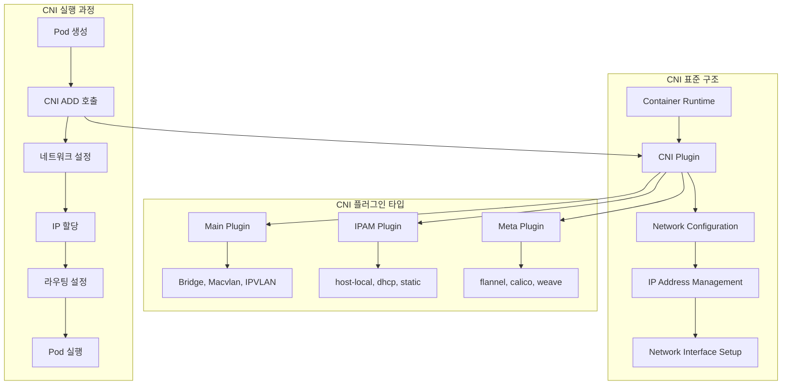
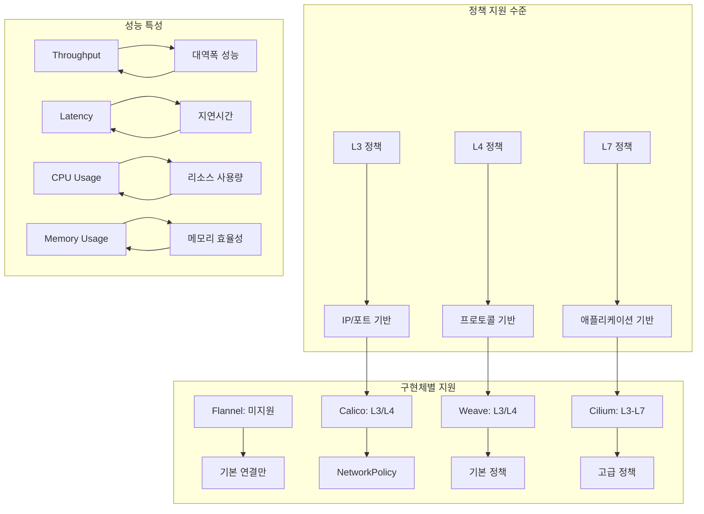
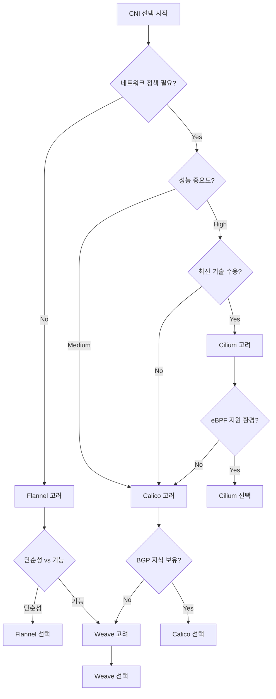

# Session 2: CNI (Container Network Interface)

## 📍 교과과정에서의 위치
이 세션은 **Week 2 > Day 3 > Session 2**로, Kubernetes 네트워킹의 핵심인 CNI 표준과 주요 구현체들을 학습합니다. Session 1에서 학습한 네트워킹 원칙이 실제로 어떻게 구현되는지 이해합니다.

## 학습 목표 (5분)
- **CNI 표준**과 **플러그인** 아키텍처 완전 이해
- **주요 CNI 구현체** 비교 분석 (Flannel, Calico, Weave)
- **네트워크 정책** 지원과 **성능** 특성 학습
- **CNI 선택** 기준과 **운영** 고려사항 파악

## 1. CNI 표준과 플러그인 아키텍처 (15분)

### CNI 아키텍처 개요



### CNI 표준 상세 분석
```
CNI (Container Network Interface) 표준:

CNI 기본 개념:
   🔹 CNCF 표준 네트워크 인터페이스
   🔹 컨테이너 런타임과 네트워크 플러그인 간 표준
   🔹 JSON 기반 설정 및 명령어 인터페이스
   🔹 플러그인 체인을 통한 확장성
   🔹 언어 독립적 실행 파일 기반
   🔹 단순하고 명확한 API 설계

CNI 명령어:
   🔹 ADD: 컨테이너를 네트워크에 추가
   🔹 DEL: 컨테이너를 네트워크에서 제거
   🔹 CHECK: 네트워크 설정 상태 확인
   🔹 VERSION: CNI 버전 정보 조회
   🔹 환경 변수를 통한 매개변수 전달

CNI 설정 구조:
   🔹 cniVersion: CNI 스펙 버전
   🔹 name: 네트워크 이름
   🔹 type: 플러그인 타입
   🔹 ipam: IP 주소 관리 설정
   🔹 dns: DNS 설정
   🔹 args: 추가 인수
   🔹 플러그인별 특화 설정

플러그인 체인:
   🔹 여러 플러그인 순차 실행
   🔹 각 플러그인의 결과를 다음으로 전달
   🔹 복합적인 네트워크 설정 가능
   🔹 모듈화된 기능 조합
   🔹 실패 시 롤백 메커니즘
   🔹 예: bridge → firewall → bandwidth

CNI 런타임 통합:
   🔹 kubelet이 CNI 플러그인 호출
   🔹 컨테이너 생성/삭제 시점에 실행
   🔹 네트워크 네임스페이스 관리
   🔹 인터페이스 생성 및 설정
   🔹 IP 주소 할당 및 라우팅
   🔹 DNS 설정 및 정책 적용

IPAM (IP Address Management):
   🔹 IP 주소 할당 및 관리
   🔹 서브넷 및 게이트웨이 설정
   🔹 IP 풀 관리 및 임대
   🔹 중복 방지 및 충돌 해결
   🔹 동적/정적 할당 지원
   🔹 플러그인별 IPAM 구현
```

## 2. 주요 CNI 구현체 비교 분석 (12분)

### CNI 구현체 아키텍처 비교

```mermaid
graph TB
    subgraph "Flannel"
        A[VXLAN Overlay] --> B[Simple Setup]
        B --> C[L3 Network]
        C --> D[etcd Backend]
    end
    
    subgraph "Calico"
        E[BGP Routing] --> F[Network Policy]
        F --> G[eBPF Support]
        G --> H[Felix Agent]
    end
    
    subgraph "Weave"
        I[Mesh Network] --> J[Encryption]
        J --> K[Auto Discovery]
        K --> L[Fast Datapath]
    end
    
    subgraph "Cilium"
        M[eBPF Datapath] --> N[L7 Policy]
        N --> O[Service Mesh]
        O --> P[Observability]
    end
    
    D --> A
    H --> E
    L --> I
    P --> M
```



### CNI 구현체 상세 비교
```
주요 CNI 구현체 특성:

Flannel:
   🔹 특징:
      • 단순하고 안정적인 오버레이 네트워크
      • VXLAN, UDP, host-gw 백엔드 지원
      • 최소한의 설정으로 빠른 구축
      • etcd를 통한 네트워크 정보 저장
      • 대부분의 환경에서 안정적 동작
   🔹 장점:
      • 설정 및 관리 단순성
      • 높은 호환성 및 안정성
      • 작은 리소스 사용량
      • 빠른 배포 및 문제 해결
   🔹 단점:
      • 네트워크 정책 미지원
      • 고급 기능 부족
      • 성능 최적화 제한
      • L7 기능 없음
   🔹 적합한 환경: 단순한 클러스터, 개발/테스트

Calico:
   🔹 특징:
      • BGP 기반 L3 네트워킹
      • 강력한 네트워크 정책 지원
      • eBPF 데이터플레인 옵션
      • Felix 에이전트를 통한 정책 적용
      • 확장성과 성능 최적화
   🔹 장점:
      • 우수한 성능 (네이티브 라우팅)
      • 세밀한 네트워크 정책
      • 대규모 클러스터 지원
      • 풍부한 관찰 가능성
      • 멀티 클라우드 지원
   🔹 단점:
      • 복잡한 설정 및 관리
      • BGP 지식 필요
      • 네트워크 인프라 의존성
      • 높은 학습 곡선
   🔹 적합한 환경: 대규모 프로덕션, 보안 중요

Weave:
   🔹 특징:
      • 메시 네트워크 토폴로지
      • 자동 피어 발견 및 연결
      • 네트워크 암호화 지원
      • Fast Datapath (커널 우회)
      • 간단한 설치 및 운영
   🔹 장점:
      • 자동 네트워크 구성
      • 내장 암호화 및 보안
      • 네트워크 분할 복구
      • 멀티 호스트 네트워킹
      • 시각적 네트워크 모니터링
   🔹 단점:
      • 상대적으로 높은 오버헤드
      • 복잡한 메시 토폴로지
      • 제한적인 정책 기능
      • 대규모 환경에서 성능 이슈
   🔹 적합한 환경: 중소규모, 보안 중시

Cilium:
   🔹 특징:
      • eBPF 기반 고성능 데이터플레인
      • L3-L7 네트워크 정책
      • 서비스 메시 기능 내장
      • 고급 관찰 가능성
      • API 인식 보안 정책
   🔹 장점:
      • 최고 수준의 성능
      • 세밀한 L7 정책 제어
      • 풍부한 모니터링 기능
      • 서비스 메시 통합
      • 혁신적인 기술 적용
   🔹 단점:
      • 높은 복잡성
      • 커널 버전 의존성
      • 상대적으로 새로운 기술
      • 전문 지식 필요
   🔹 적합한 환경: 고성능 요구, 최신 기술 도입

선택 기준 매트릭스:
   🔹 단순성: Flannel > Weave > Calico > Cilium
   🔹 성능: Cilium > Calico > Flannel > Weave
   🔹 보안: Cilium > Calico > Weave > Flannel
   🔹 안정성: Flannel > Calico > Weave > Cilium
   🔹 기능: Cilium > Calico > Weave > Flannel
   🔹 학습곡선: Flannel < Weave < Calico < Cilium
```

## 3. 네트워크 정책 지원과 성능 특성 (10분)

### 네트워크 정책 구현 비교



### 성능 및 정책 특성 분석
```
네트워크 정책 및 성능 비교:

네트워크 정책 지원:
   🔹 Flannel:
      • 네트워크 정책 미지원
      • 모든 Pod 간 통신 허용
      • 외부 방화벽 솔루션 필요
      • 단순한 연결성만 제공
   🔹 Calico:
      • Kubernetes NetworkPolicy 완전 지원
      • Calico 고유 정책 추가 기능
      • 글로벌 네트워크 정책
      • 호스트 엔드포인트 보호
      • 서비스 어카운트 기반 정책
      • 세밀한 트래픽 제어
   🔹 Weave:
      • 기본 NetworkPolicy 지원
      • 네임스페이스 격리
      • 제한적인 고급 기능
      • 단순한 정책 모델
   🔹 Cilium:
   🔹 L3-L7 정책 완전 지원
   🔹 HTTP/gRPC API 인식 정책
   🔹 DNS 기반 정책
   🔹 서비스 메시 정책 통합
   🔹 가장 세밀한 제어 가능

성능 특성 비교:
   🔹 처리량 (Throughput):
      • Cilium (eBPF): 최고 성능
      • Calico (BGP): 높은 성능
      • Flannel (host-gw): 중간 성능
      • Weave (FastDP): 중간 성능
      • 오버레이 네트워크: 상대적 저성능
   🔹 지연시간 (Latency):
      • 네이티브 라우팅: 최소 지연
      • 커널 우회: 낮은 지연
      • VXLAN 캡슐화: 추가 지연
      • 정책 처리: 미미한 오버헤드
   🔹 리소스 사용량:
      • CPU: 정책 복잡도에 비례
      • 메모리: 연결 상태 추적량에 비례
      • 네트워크: 캡슐화 오버헤드
      • 스토리지: 로그 및 상태 정보
   🔹 확장성:
   🔹 노드 수: 라우팅 테이블 크기 영향
   🔹 Pod 수: 정책 규칙 수 영향
   🔹 정책 수: 처리 복잡도 영향
   🔹 연결 수: 상태 추적 오버헤드

벤치마크 고려사항:
   🔹 테스트 환경: 하드웨어, OS, 커널 버전
   🔹 워크로드 특성: 연결 패턴, 데이터 크기
   🔹 네트워크 토폴로지: 노드 간 거리, 대역폭
   🔹 정책 복잡도: 규칙 수, 매칭 조건
   🔹 모니터링 오버헤드: 로깅, 메트릭 수집
   🔹 실제 애플리케이션 성능 측정 중요
```

## 4. CNI 선택 기준과 운영 고려사항 (10분)

### CNI 선택 의사결정 트리



### 선택 기준 및 운영 고려사항
```
CNI 선택 기준:

기술적 요구사항:
   🔹 네트워크 정책 필요성:
      • 마이크로세그멘테이션 요구
      • 컴플라이언스 규정 준수
      • 보안 격리 수준
      • 트래픽 제어 세밀도
   🔹 성능 요구사항:
      • 처리량 (Throughput) 목표
      • 지연시간 (Latency) 허용 범위
      • 동시 연결 수 지원
      • 확장성 요구사항
   🔹 환경 제약사항:
      • 클라우드 플랫폼 지원
      • 온프레미스 네트워크 통합
      • 기존 인프라 호환성
      • 보안 정책 및 규정

운영 고려사항:
   🔹 설치 및 설정:
      • 초기 구축 복잡도
      • 설정 파일 관리
      • 의존성 및 전제조건
      • 자동화 가능성
   🔹 관리 및 운영:
      • 모니터링 및 로깅
      • 트러블슈팅 도구
      • 업그레이드 절차
      • 백업 및 복구
      • 성능 튜닝 옵션
   🔹 인력 및 기술:
      • 필요한 전문 지식
      • 학습 곡선 및 교육
      • 커뮤니티 지원
      • 상용 지원 옵션
      • 문서화 품질

환경별 권장사항:
   🔹 개발/테스트 환경:
      • Flannel: 단순하고 안정적
      • 빠른 구축 및 재구축
      • 최소한의 관리 오버헤드
      • 네트워크 정책 불필요
   🔹 스테이징 환경:
      • 프로덕션과 동일한 CNI 사용
      • 성능 및 정책 테스트
      • 운영 절차 검증
      • 모니터링 시스템 테스트
   🔹 프로덕션 환경:
      • Calico: 균형잡힌 기능과 성능
      • Cilium: 최고 성능 및 기능
      • 강력한 네트워크 정책
      • 고가용성 및 확장성
      • 종합적인 모니터링
   🔹 특수 환경:
   🔹 엣지 컴퓨팅: 경량화된 솔루션
   🔹 멀티 클라우드: 호환성 중시
   🔹 고보안: 정책 기능 중시
   🔹 고성능: 최적화된 데이터플레인

마이그레이션 고려사항:
   🔹 기존 CNI에서 새 CNI로 전환
   🔹 다운타임 최소화 전략
   🔹 네트워크 정책 마이그레이션
   🔹 애플리케이션 호환성 검증
   🔹 롤백 계획 및 절차
   🔹 단계적 마이그레이션 방법
```

## 💬 그룹 토론: CNI 선택 기준과 운영 환경별 고려사항 (8분)

### 토론 주제
**"다양한 운영 환경(개발, 스테이징, 프로덕션)에서 CNI를 선택할 때 고려해야 할 핵심 기준과 실무 경험은 무엇인가?"**

### 토론 가이드라인

#### CNI 선택 기준 우선순위 (3분)
- **기능 요구사항**: 네트워크 정책, 성능, 확장성
- **운영 복잡성**: 설치, 관리, 트러블슈팅
- **조직 역량**: 기술 수준, 학습 곡선, 지원 체계

#### 환경별 선택 전략 (3분)
- **개발 환경**: 단순성과 빠른 구축 중시
- **프로덕션**: 안정성, 성능, 보안 중시
- **특수 환경**: 엣지, 멀티클라우드, 고보안

#### 실무 적용 경험 (2분)
- **마이그레이션**: 기존 CNI 전환 경험
- **운영 이슈**: 실제 발생한 문제와 해결 방안
- **성능 최적화**: 튜닝 및 모니터링 경험

## 💡 핵심 개념 정리
- **CNI 표준**: 컨테이너 네트워크 인터페이스, 플러그인 아키텍처
- **주요 구현체**: Flannel(단순), Calico(균형), Weave(메시), Cilium(고성능)
- **네트워크 정책**: L3-L7 트래픽 제어, 보안 격리
- **선택 기준**: 기능, 성능, 복잡성, 조직 역량

## 📚 참고 자료
- [CNI Specification](https://github.com/containernetworking/cni/blob/master/SPEC.md)
- [Flannel Documentation](https://github.com/flannel-io/flannel)
- [Calico Documentation](https://docs.projectcalico.org/)
- [Cilium Documentation](https://docs.cilium.io/)

## 다음 세션 준비
다음 세션에서는 **Service 네트워킹 심화**에 대해 학습합니다. Service 타입별 네트워킹 메커니즘과 로드 밸런싱 원리를 상세히 분석할 예정입니다.