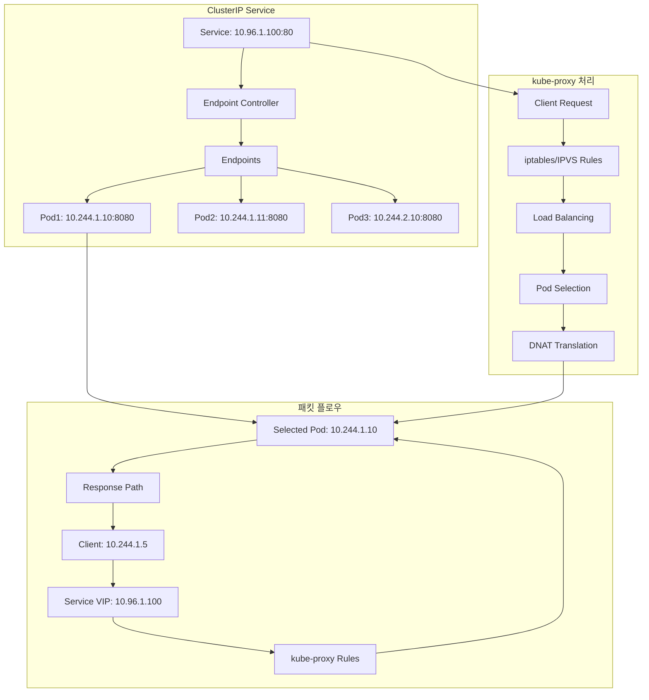
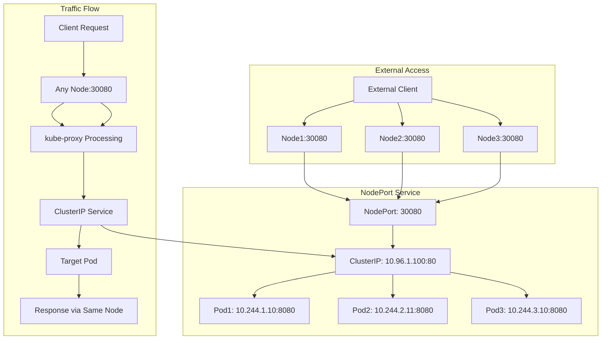
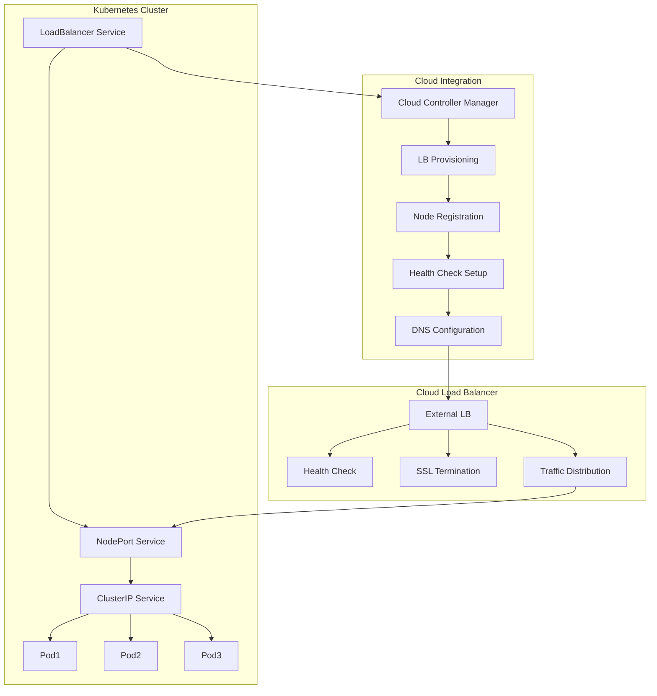
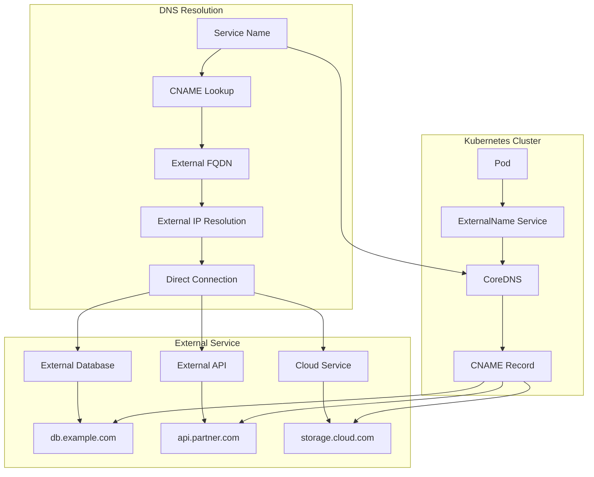

# Session 3: Service 네트워킹 심화

## 📍 교과과정에서의 위치
이 세션은 **Week 2 > Day 3 > Session 3**으로, Kubernetes Service의 네트워킹 메커니즘을 심화 학습합니다. Session 1-2에서 학습한 네트워킹 기초와 CNI를 바탕으로 Service 추상화가 어떻게 구현되는지 이해합니다.

## 학습 목표 (5분)
- **ClusterIP** 내부 로드 밸런싱 메커니즘 완전 이해
- **NodePort**와 **외부 접근** 패턴 학습
- **LoadBalancer**와 **클라우드 통합** 방식 파악
- **ExternalName**과 **외부 서비스** 연결 원리 이해

## 1. ClusterIP 내부 로드 밸런싱 메커니즘 (15분)

### ClusterIP 아키텍처



### ClusterIP 동작 메커니즘
```
ClusterIP Service 상세 분석:

가상 IP (VIP) 관리:
   🔹 Service CIDR에서 IP 할당
   🔹 클러스터 전체에서 유일한 IP
   🔹 실제 네트워크 인터페이스 없음
   🔹 kube-proxy가 트래픽 처리
   🔹 DNS 이름과 IP 매핑
   🔹 서비스 생명주기와 연동

Endpoint 관리:
   🔹 Endpoint Controller 역할:
      • Service Selector와 Pod Label 매칭
      • 준비된 Pod만 Endpoint에 포함
      • Pod 상태 변화 실시간 반영
      • 헬스 체크 결과 기반 관리
      • Endpoint 객체 자동 생성/업데이트
   🔹 Endpoint 구조:
      • IP 주소: Pod IP 목록
      • 포트: 서비스 포트와 매핑
      • 프로토콜: TCP, UDP, SCTP
      • 준비 상태: Ready/NotReady
      • 노드 정보: Pod가 실행 중인 노드

로드 밸런싱 알고리즘:
   🔹 라운드 로빈 (기본):
      • 순차적으로 Pod 선택
      • 균등한 트래픽 분산
      • 단순하고 예측 가능
      • 세션 상태 고려 없음
   🔹 세션 어피니티:
      • ClientIP 기반 고정
      • 동일 클라이언트 → 동일 Pod
      • 세션 유지 필요 시 사용
      • 로드 밸런싱 효율성 저하
   🔹 가중치 기반:
      • Pod 리소스 기반 가중치
      • 성능 차이 고려
      • IPVS 모드에서 지원
      • 복잡한 설정 필요

트래픽 처리 과정:
   🔹 클라이언트 요청 생성
   🔹 DNS 해결 (Service 이름 → ClusterIP)
   🔹 패킷 목적지: ClusterIP:Port
   🔹 kube-proxy 규칙 매칭
   🔹 대상 Pod 선택 (로드 밸런싱)
   🔹 DNAT (Destination NAT) 적용
   🔹 실제 Pod IP:Port로 전송
   🔹 Pod에서 응답 생성
   🔹 역방향 NAT 적용
   🔹 클라이언트에게 응답 전송

헬스 체크 통합:
   🔹 Readiness Probe 결과 반영
   🔹 준비되지 않은 Pod 제외
   🔹 장애 Pod 자동 격리
   🔹 복구 시 자동 포함
   🔹 트래픽 무중단 보장
   🔹 서비스 가용성 향상
```

## 2. NodePort와 외부 접근 패턴 (12분)

### NodePort 아키텍처



### NodePort 동작 원리
```
NodePort Service 메커니즘:

포트 할당 및 관리:
   🔹 NodePort 범위: 30000-32767 (기본)
   🔹 자동 할당 또는 명시적 지정
   🔹 모든 노드에서 동일 포트 바인딩
   🔹 포트 충돌 방지 메커니즘
   🔹 방화벽 규칙 자동 설정
   🔹 클러스터 전체 포트 관리

트래픽 라우팅:
   🔹 외부 → NodePort:
      • 클라이언트가 임의 노드 접근
      • 해당 노드의 NodePort로 연결
      • kube-proxy가 요청 수신
      • ClusterIP 서비스로 전달
   🔹 NodePort → ClusterIP:
      • 내부 ClusterIP 서비스 활용
      • 기존 로드 밸런싱 로직 재사용
      • Endpoint 기반 Pod 선택
      • 동일한 헬스 체크 적용
   🔹 크로스 노드 라우팅:
      • 요청 받은 노드와 Pod 노드 다를 수 있음
      • 네트워크 홉 추가 발생
      • 성능 오버헤드 고려
      • externalTrafficPolicy 설정 영향

외부 트래픽 정책:
   🔹 Cluster (기본):
      • 모든 노드에서 모든 Pod 접근
      • 균등한 로드 밸런싱
      • 소스 IP 정보 손실
      • 추가 네트워크 홉 가능
      • 높은 가용성
   🔹 Local:
      • 로컬 노드의 Pod만 접근
      • 소스 IP 정보 보존
      • 네트워크 홉 최소화
      • 불균등한 로드 밸런싱 가능
      • 로컬 Pod 없으면 실패

사용 사례 및 제한사항:
   🔹 적합한 사용 사례:
      • 개발/테스트 환경 외부 접근
      • 로드 밸런서 없는 온프레미스
      • 특정 포트 직접 노출 필요
      • 간단한 외부 접근 구현
   🔹 제한사항:
      • 포트 범위 제한 (30000-32767)
      • 노드 IP 변경 시 영향
      • 방화벽 설정 복잡성
      • 보안 노출 위험
      • 프로덕션 환경 부적합

고가용성 고려사항:
   🔹 다중 노드 배치
   🔹 노드 장애 시 자동 복구
   🔹 헬스 체크 및 모니터링
   🔹 로드 밸런서와 조합 사용
   🔹 DNS 라운드 로빈 활용
```

## 3. LoadBalancer와 클라우드 통합 (10분)

### LoadBalancer 아키텍처



### LoadBalancer 통합 메커니즘
```
LoadBalancer Service 클라우드 통합:

클라우드 컨트롤러 매니저:
   🔹 역할 및 기능:
      • 클라우드 API와 Kubernetes 연동
      • LoadBalancer Service 감지
      • 외부 로드 밸런서 자동 프로비저닝
      • 노드 등록 및 해제
      • 헬스 체크 설정
      • DNS 레코드 관리
   🔹 프로비저닝 과정:
      • Service 생성 이벤트 감지
      • 클라우드 API 호출
      • 로드 밸런서 인스턴스 생성
      • 백엔드 노드 등록
      • 헬스 체크 규칙 설정
      • 외부 IP 할당 및 반환

클라우드별 구현:
   🔹 AWS (ELB/ALB/NLB):
      • Classic Load Balancer (ELB)
      • Application Load Balancer (ALB)
      • Network Load Balancer (NLB)
      • 자동 스케일링 지원
      • SSL/TLS 종료
      • Route 53 통합
   🔹 Google Cloud (GCE LB):
      • HTTP(S) Load Balancer
      • Network Load Balancer
      • Internal Load Balancer
      • Global/Regional 옵션
      • Cloud DNS 통합
   🔹 Azure (Azure LB):
      • Standard Load Balancer
      • Basic Load Balancer
      • Application Gateway
      • 가용성 영역 지원
      • Azure DNS 통합

로드 밸런서 기능:
   🔹 트래픽 분산:
      • 라운드 로빈, 최소 연결
      • 지리적 라우팅
      • 가중치 기반 라우팅
      • 헬스 기반 라우팅
   🔹 고가용성:
      • 다중 가용성 영역
      • 자동 장애 조치
      • 백엔드 헬스 체크
      • 트래픽 드레이닝
   🔹 보안 기능:
      • SSL/TLS 종료
      • 인증서 자동 관리
      • DDoS 보호
      • 웹 애플리케이션 방화벽

설정 및 어노테이션:
   🔹 공통 어노테이션:
      • service.beta.kubernetes.io/aws-load-balancer-type
      • service.beta.kubernetes.io/azure-load-balancer-internal
      • cloud.google.com/load-balancer-type
      • 클라우드별 특화 설정
   🔹 고급 설정:
      • 로드 밸런서 타입 선택
      • 내부/외부 로드 밸런서
      • SSL 인증서 지정
      • 헬스 체크 설정
      • 접근 제어 정책
```

## 4. ExternalName과 외부 서비스 연결 (10분)

### ExternalName 아키텍처



### ExternalName 동작 원리
```
ExternalName Service 메커니즘:

DNS 기반 서비스 매핑:
   🔹 기본 개념:
      • 외부 서비스를 내부 서비스처럼 접근
      • DNS CNAME 레코드 생성
      • 실제 Pod나 Endpoint 없음
      • 순수 DNS 리다이렉션
      • 네트워크 프록시 없음
   🔹 DNS 해결 과정:
      • Pod에서 Service 이름 조회
      • CoreDNS가 CNAME 응답
      • 클라이언트가 외부 FQDN 해결
      • 외부 DNS 서버 조회
      • 실제 IP 주소 획득
      • 직접 외부 서비스 연결

사용 사례:
   🔹 외부 데이터베이스 연결:
      • RDS, Cloud SQL 등
      • 온프레미스 데이터베이스
      • 서비스 이름 추상화
      • 환경별 설정 분리
   🔹 외부 API 서비스:
      • 파트너 API 엔드포인트
      • 클라우드 서비스 API
      • 마이크로서비스 간 통신
      • 서비스 디스커버리 통합
   🔹 레거시 시스템 통합:
      • 기존 시스템 점진적 마이그레이션
      • 하이브리드 아키텍처 지원
      • 서비스 인터페이스 표준화
      • 의존성 관리 단순화

설정 및 관리:
   🔹 Service 정의:
      • type: ExternalName
      • externalName: 외부 FQDN
      • 포트 정의 (선택적)
      • 프로토콜 지정
   🔹 DNS 설정 고려사항:
      • 외부 DNS 서버 접근성
      • DNS 캐싱 정책
      • TTL 설정 최적화
      • DNS 장애 대응
   🔹 보안 고려사항:
      • 외부 서비스 인증
      • TLS/SSL 연결 보장
      • 네트워크 정책 적용 제한
      • 트래픽 암호화

제한사항 및 대안:
   🔹 제한사항:
      • 로드 밸런싱 불가
      • 헬스 체크 미지원
      • 네트워크 정책 적용 불가
      • 트래픽 모니터링 어려움
      • 포트 매핑 제한
   🔹 대안 솔루션:
      • Headless Service + Endpoints
      • Service Mesh (Istio) 활용
      • API Gateway 패턴
      • Ambassador/Envoy 프록시
      • 커스텀 컨트롤러 구현

환경별 활용 전략:
   🔹 개발 환경:
      • 로컬 개발 서비스 연결
      • 목업 서비스 전환
      • 빠른 프로토타이핑
   🔹 스테이징 환경:
      • 프로덕션 외부 서비스 연결
      • 통합 테스트 지원
      • 환경 간 일관성 유지
   🔹 프로덕션 환경:
   🔹 안정적인 외부 서비스 연결
   🔹 장애 격리 및 복구
   🔹 모니터링 및 알림 통합
```

## 💬 그룹 토론: Service 타입별 사용 시나리오와 설계 전략 (8분)

### 토론 주제
**"각 Service 타입(ClusterIP, NodePort, LoadBalancer, ExternalName)의 최적 사용 시나리오는 무엇이며, 실무에서 어떤 설계 전략을 적용해야 하는가?"**

### 토론 가이드라인

#### Service 타입별 적용 시나리오 (3분)
- **ClusterIP**: 내부 마이크로서비스 통신, API 게이트웨이
- **NodePort**: 개발/테스트 환경, 온프레미스 외부 접근
- **LoadBalancer**: 프로덕션 외부 서비스, 클라우드 환경
- **ExternalName**: 외부 서비스 통합, 레거시 시스템 연결

#### 설계 전략 고려사항 (3분)
- **성능**: 네트워크 홉, 로드 밸런싱 효율성
- **보안**: 외부 노출 최소화, 트래픽 암호화
- **가용성**: 장애 복구, 헬스 체크, 다중화

#### 실무 적용 경험 (2분)
- **마이그레이션**: Service 타입 전환 경험
- **트러블슈팅**: 네트워킹 이슈 해결 사례
- **최적화**: 성능 튜닝 및 모니터링 방안

## 💡 핵심 개념 정리
- **ClusterIP**: 내부 로드 밸런싱, 가상 IP, Endpoint 관리
- **NodePort**: 외부 접근, 포트 바인딩, 트래픽 정책
- **LoadBalancer**: 클라우드 통합, 자동 프로비저닝, 고가용성
- **ExternalName**: DNS 매핑, 외부 서비스 추상화

## 📚 참고 자료
- [Service Types](https://kubernetes.io/docs/concepts/services-networking/service/#publishing-services-service-types)
- [Load Balancer Services](https://kubernetes.io/docs/concepts/services-networking/service/#loadbalancer)
- [ExternalName Services](https://kubernetes.io/docs/concepts/services-networking/service/#externalname)

## 다음 세션 준비
다음 세션에서는 **kube-proxy와 로드 밸런싱**에 대해 학습합니다. kube-proxy의 구현 모드와 로드 밸런싱 알고리즘을 상세히 분석할 예정입니다.