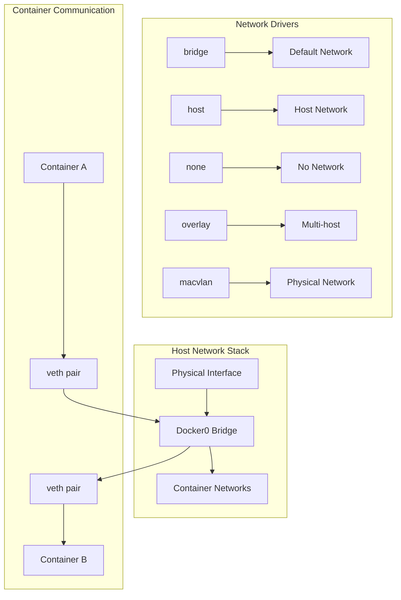

# Session 3: Docker 네트워킹 기초

## 📍 교과과정에서의 위치
이 세션은 **Week 2 > Day 3 > Session 3**으로, 컨테이너 리소스 관리를 바탕으로 Docker의 네트워킹 구조와 기본 네트워크 관리 방법을 학습합니다.

## 학습 목표 (5분)
- **Docker 네트워크 드라이버** 종류와 특징 이해
- **기본 네트워크 구성**과 **포트 매핑** 실습
- **컨테이너 간 통신** 및 **네트워크 격리** 구현

## 1. 이론: Docker 네트워킹 구조 (20분)

### Docker 네트워크 아키텍처



### 네트워크 드라이버 특징

```
Bridge Network (기본):
├── 컨테이너별 격리된 네트워크
├── NAT를 통한 외부 통신
├── 포트 매핑으로 서비스 노출
└── 같은 브리지 내 컨테이너 간 통신 가능

Host Network:
├── 호스트 네트워크 스택 직접 사용
├── 네트워크 격리 없음
├── 최고 성능 (오버헤드 없음)
└── 포트 충돌 주의 필요

None Network:
├── 네트워크 인터페이스 없음
├── 완전한 네트워크 격리
├── 로컬 처리만 가능
└── 보안이 중요한 작업에 사용

Overlay Network:
├── 멀티 호스트 통신
├── Docker Swarm에서 사용
├── VXLAN 터널링
└── 분산 환경 지원

Macvlan Network:
├── 컨테이너에 MAC 주소 할당
├── 물리 네트워크 직접 연결
├── 레거시 애플리케이션 지원
└── VLAN 태깅 지원
```

### 네트워크 네임스페이스와 격리

```
네트워크 격리 구조:

Host Namespace:
├── eth0 (물리 인터페이스)
├── docker0 (브리지)
├── lo (루프백)
└── 라우팅 테이블

Container Namespace:
├── eth0 (veth pair)
├── lo (루프백)
├── 독립적인 라우팅 테이블
└── 독립적인 iptables 규칙

통신 경로:
Container A → veth → docker0 → veth → Container B
Container → docker0 → host eth0 → External Network
```

## 2. 실습: 기본 네트워크 관리 (15분)

### 네트워크 조회 및 생성

```bash
# 기본 네트워크 확인
docker network ls

# 네트워크 상세 정보
docker network inspect bridge

# 사용자 정의 브리지 네트워크 생성
docker network create --driver bridge my-network

# 서브넷 지정 네트워크 생성
docker network create \
    --driver bridge \
    --subnet=172.20.0.0/16 \
    --ip-range=172.20.240.0/20 \
    --gateway=172.20.0.1 \
    custom-network

# 네트워크 목록 재확인
docker network ls
```

### 컨테이너 네트워크 연결

```bash
# 기본 네트워크로 컨테이너 실행
docker run -d --name web1 nginx:alpine

# 사용자 정의 네트워크로 컨테이너 실행
docker run -d --name web2 --network my-network nginx:alpine

# 특정 IP로 컨테이너 실행
docker run -d --name web3 --network custom-network --ip 172.20.0.10 nginx:alpine

# 컨테이너 네트워크 정보 확인
docker inspect web1 --format '{{.NetworkSettings.IPAddress}}'
docker inspect web2 --format '{{.NetworkSettings.Networks.my-network.IPAddress}}'
docker inspect web3 --format '{{.NetworkSettings.Networks.custom-network.IPAddress}}'
```

### 네트워크 연결 및 해제

```bash
# 실행 중인 컨테이너를 다른 네트워크에 연결
docker network connect my-network web1

# 컨테이너가 연결된 네트워크 확인
docker inspect web1 --format '{{json .NetworkSettings.Networks}}' | jq

# 네트워크에서 컨테이너 연결 해제
docker network disconnect bridge web1

# 네트워크 연결 상태 재확인
docker network inspect my-network --format '{{json .Containers}}' | jq
```

## 3. 실습: 포트 매핑과 서비스 노출 (15분)

### 포트 매핑 설정

```bash
# 단일 포트 매핑
docker run -d --name port-single -p 8080:80 nginx:alpine

# 다중 포트 매핑
docker run -d --name port-multi -p 8081:80 -p 8443:443 nginx:alpine

# 특정 인터페이스 바인딩
docker run -d --name port-interface -p 127.0.0.1:8082:80 nginx:alpine

# UDP 포트 매핑
docker run -d --name port-udp -p 5353:53/udp alpine sleep 3600

# 동적 포트 할당
docker run -d --name port-dynamic -P nginx:alpine

# 포트 매핑 확인
docker port port-single
docker port port-multi
docker port port-dynamic
```

### 포트 매핑 테스트

```bash
# 웹 서버 테스트
curl -s http://localhost:8080 | grep title
curl -s http://localhost:8081 | grep title
curl -s http://127.0.0.1:8082 | grep title

# 포트 사용 현황 확인
netstat -tlnp | grep :808
ss -tlnp | grep :808

# iptables 규칙 확인 (Docker가 생성한 규칙)
sudo iptables -t nat -L DOCKER
```

### 로드 밸런싱 시뮬레이션

```bash
# 여러 웹 서버 인스턴스 실행
for i in {1..3}; do
    docker run -d --name web-lb-$i -p $((8090+i)):80 \
        -e SERVER_ID=$i \
        nginx:alpine
    
    # 각 서버에 고유 페이지 생성
    docker exec web-lb-$i sh -c "echo 'Server $i - $(hostname)' > /usr/share/nginx/html/index.html"
done

# 로드 밸런싱 테스트
echo "Testing load balancing:"
for i in {1..3}; do
    echo "Server $i: $(curl -s http://localhost:$((8090+i)))"
done

# 간단한 로드 밸런서 스크립트
cat > simple-lb.sh << 'EOF'
#!/bin/bash
servers=(8091 8092 8093)
counter=0

for i in {1..9}; do
    port=${servers[$((counter % 3))]}
    echo "Request $i -> Server at port $port: $(curl -s http://localhost:$port)"
    counter=$((counter + 1))
done
EOF

chmod +x simple-lb.sh
./simple-lb.sh
```

## 4. 실습: 컨테이너 간 통신 (10분)

### 이름 기반 통신

```bash
# 사용자 정의 네트워크에서 이름 해석 테스트
docker network create app-network

# 데이터베이스 컨테이너
docker run -d --name database --network app-network \
    -e MYSQL_ROOT_PASSWORD=secret \
    -e MYSQL_DATABASE=testdb \
    mysql:8.0

# 애플리케이션 컨테이너
docker run -d --name app --network app-network alpine sleep 3600

# DNS 해석 테스트
docker exec app nslookup database
docker exec app ping -c 3 database

# 데이터베이스 연결 테스트
docker exec app nc -zv database 3306
```

### 네트워크 격리 테스트

```bash
# 격리된 네트워크 생성
docker network create isolated-network

# 각각 다른 네트워크의 컨테이너
docker run -d --name isolated-app --network isolated-network alpine sleep 3600
docker run -d --name public-app --network app-network alpine sleep 3600

# 네트워크 격리 확인
echo "Testing network isolation:"
docker exec public-app ping -c 2 database && echo "✓ Same network communication works"
docker exec isolated-app ping -c 2 database || echo "✓ Network isolation works"

# 네트워크 간 통신 불가 확인
docker exec isolated-app ping -c 2 app || echo "✓ Cross-network isolation confirmed"
```

### 서비스 디스커버리 구현

```bash
# 서비스 레지스트리 시뮬레이션
cat > service-discovery.sh << 'EOF'
#!/bin/bash

# 서비스 등록 함수
register_service() {
    local service_name=$1
    local container_name=$2
    local network=$3
    
    local ip=$(docker inspect $container_name --format "{{.NetworkSettings.Networks.$network.IPAddress}}")
    echo "$service_name:$ip" >> /tmp/service_registry
    echo "Registered $service_name at $ip"
}

# 서비스 조회 함수
discover_service() {
    local service_name=$1
    grep "^$service_name:" /tmp/service_registry | cut -d: -f2
}

# 서비스 등록
rm -f /tmp/service_registry
register_service "web" "web2" "my-network"
register_service "db" "database" "app-network"

# 서비스 디스커버리 테스트
echo "Discovering services:"
echo "Web service IP: $(discover_service web)"
echo "DB service IP: $(discover_service db)"

# 레지스트리 내용 확인
echo "Service registry:"
cat /tmp/service_registry
EOF

chmod +x service-discovery.sh
./service-discovery.sh
```

## 5. 실습: 네트워크 보안 및 방화벽 (10분)

### 네트워크 보안 설정

```bash
# 내부 전용 네트워크 (외부 접근 차단)
docker network create --internal secure-network

# 보안 네트워크에 컨테이너 배포
docker run -d --name secure-app --network secure-network alpine sleep 3600

# 외부 접근 테스트
docker exec secure-app ping -c 2 8.8.8.8 || echo "✓ External access blocked"

# 내부 통신은 가능
docker run -d --name secure-db --network secure-network alpine sleep 3600
docker exec secure-app ping -c 2 secure-db && echo "✓ Internal communication works"
```

### 커스텀 방화벽 규칙

```bash
# 특정 포트만 허용하는 네트워크
docker network create \
    --driver bridge \
    --opt com.docker.network.bridge.name=restricted-br \
    restricted-network

# 제한된 네트워크에 웹 서버 배포
docker run -d --name restricted-web \
    --network restricted-network \
    -p 9090:80 \
    nginx:alpine

# 네트워크 트래픽 모니터링
docker exec restricted-web netstat -tlnp
docker exec restricted-web ss -tlnp

# 연결 테스트
curl -s http://localhost:9090 | grep title
```

### 네트워크 문제 해결

```bash
# 네트워크 진단 도구 컨테이너
docker run -it --rm --name nettools \
    --network app-network \
    nicolaka/netshoot

# 진단 명령어들 (nettools 컨테이너 내에서 실행)
# nslookup database
# dig database
# traceroute database
# tcpdump -i eth0
# iftop
# netstat -rn

# 네트워크 연결성 테스트 스크립트
cat > network-test.sh << 'EOF'
#!/bin/bash

test_connectivity() {
    local source=$1
    local target=$2
    local port=$3
    
    echo "Testing $source -> $target:$port"
    if docker exec $source nc -zv $target $port 2>/dev/null; then
        echo "✓ Connection successful"
    else
        echo "✗ Connection failed"
    fi
}

# 연결성 테스트 매트릭스
test_connectivity app database 3306
test_connectivity web2 app 80
test_connectivity isolated-app database 3306
EOF

chmod +x network-test.sh
./network-test.sh
```

## 6. Q&A 및 정리 (5분)

### 네트워킹 구성 요약

```bash
# 네트워크 구성 현황 확인
echo "=== Docker Network Summary ==="

# 모든 네트워크 목록
echo "Networks:"
docker network ls --format "table {{.Name}}\t{{.Driver}}\t{{.Scope}}"

# 각 네트워크의 컨테이너 연결 상태
for network in $(docker network ls --format "{{.Name}}" | grep -v NETWORK); do
    echo ""
    echo "Network: $network"
    docker network inspect $network --format '{{range .Containers}}{{.Name}} ({{.IPv4Address}}){{end}}' | tr ' ' '\n' | grep -v '^$'
done

# 포트 매핑 현황
echo ""
echo "Port Mappings:"
docker ps --format "table {{.Names}}\t{{.Ports}}" | grep -v NAMES

# 네트워크 정리
echo ""
echo "Cleaning up networks..."
docker stop $(docker ps -q) 2>/dev/null || true
docker rm $(docker ps -aq) 2>/dev/null || true
docker network prune -f
echo "✓ Network cleanup completed"
```

## 💡 핵심 키워드
- **네트워크 드라이버**: bridge, host, none, overlay, macvlan
- **포트 매핑**: -p, -P, 바인딩, 동적 할당
- **서비스 디스커버리**: DNS, 이름 해석, 네트워크 격리
- **네트워크 보안**: internal, 방화벽, 트래픽 제어

## 📚 참고 자료
- [Docker 네트워킹 개요](https://docs.docker.com/network/)
- [네트워크 드라이버](https://docs.docker.com/network/drivers/)
- [포트 매핑](https://docs.docker.com/config/containers/container-networking/)

## 🔧 실습 체크리스트
- [ ] 사용자 정의 네트워크 생성 및 관리
- [ ] 포트 매핑 설정 및 테스트
- [ ] 컨테이너 간 통신 구현
- [ ] 네트워크 격리 및 보안 설정
- [ ] 네트워크 문제 해결 기법 습득
