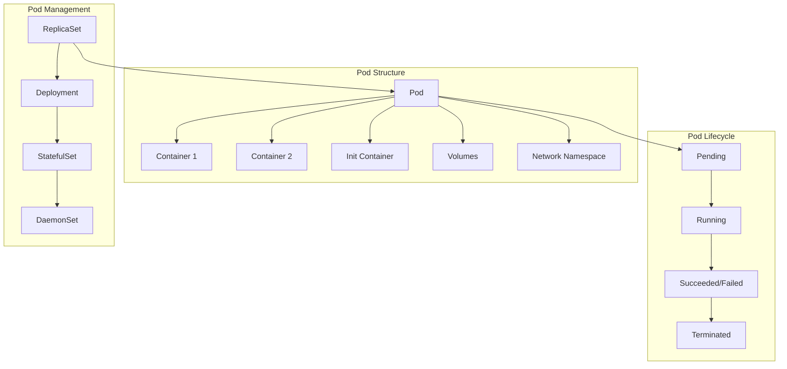
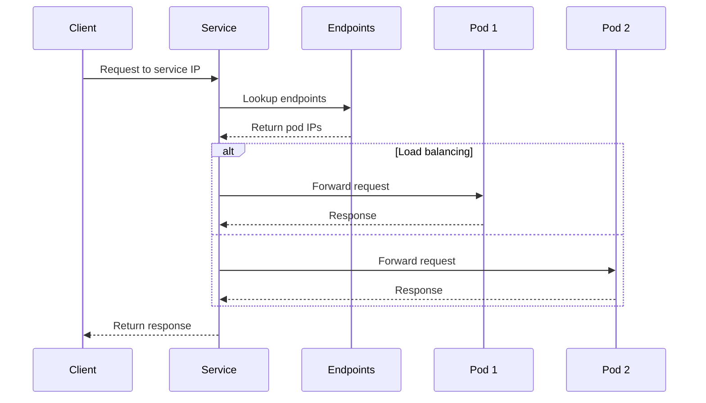

# Session 3: Kubernetes 핵심 오브젝트 이론

## 📍 교과과정에서의 위치
이 세션은 **Week 2 > Day 3 > Session 3**으로, Kubernetes 아키텍처 이해를 바탕으로 클러스터에서 사용되는 핵심 오브젝트들의 개념과 상호관계를 심화 분석합니다.

## 학습 목표 (5분)
- **Kubernetes 핵심 오브젝트** 개념과 **역할** 완전 이해
- **Pod, Service, Deployment** 간의 **상호관계** 및 **의존성** 분석
- **ConfigMap, Secret** 등 **설정 관리** 오브젝트 활용 전략

## 1. 이론: 기본 워크로드 오브젝트 (20분)

### Pod - 최소 배포 단위



### Pod 개념 및 특성

```
Pod 핵심 개념:

Pod 정의 및 특성:
├── Kubernetes의 최소 배포 및 관리 단위
├── 하나 이상의 컨테이너를 포함하는 그룹
├── 동일한 네트워크 네임스페이스 공유
├── 동일한 스토리지 볼륨 공유
├── 동일한 노드에서 함께 스케줄링
├── 생명주기를 함께 공유
├── IP 주소와 포트 공간 공유
└── 일시적(Ephemeral) 특성

Pod 내 컨테이너 패턴:
├── 사이드카 패턴 (Sidecar):
│   ├── 주 컨테이너를 보조하는 컨테이너
│   ├── 로그 수집, 모니터링, 프록시 역할
│   ├── 예: 로그 에이전트, 서비스 메시 프록시
│   └── 주 컨테이너와 독립적인 생명주기
├── 앰배서더 패턴 (Ambassador):
│   ├── 외부 서비스와의 통신을 중개
│   ├── 연결 풀링, 로드 밸런싱, 재시도 로직
│   ├── 예: 데이터베이스 프록시, API 게이트웨이
│   └── 네트워크 복잡성 추상화
└── 어댑터 패턴 (Adapter):
    ├── 데이터 형식 변환 및 표준화
    ├── 레거시 시스템 통합
    ├── 예: 메트릭 포맷 변환, 로그 파싱
    └── 인터페이스 호환성 제공

Pod 생명주기:
├── Pending: 스케줄링 대기 또는 이미지 다운로드 중
├── Running: 최소 하나의 컨테이너가 실행 중
├── Succeeded: 모든 컨테이너가 성공적으로 종료
├── Failed: 하나 이상의 컨테이너가 실패로 종료
├── Unknown: Pod 상태를 확인할 수 없음
└── 상태 전이 조건 및 이벤트

Pod 설계 원칙:
├── 단일 책임 원칙 (Single Responsibility)
├── 밀접한 결합도를 가진 컨테이너만 포함
├── 독립적인 스케일링이 필요한 컨테이너는 분리
├── 네트워크 및 스토리지 공유 최소화
├── 상태 비저장(Stateless) 설계 권장
└── 12-Factor App 원칙 준수
```

### ReplicaSet과 Deployment

```
ReplicaSet 개념:

ReplicaSet 역할:
├── 지정된 수의 Pod 복제본 유지
├── Pod 템플릿 기반 Pod 생성
├── 라벨 셀렉터를 통한 Pod 관리
├── 자동 복구 및 자가 치유
├── 수평 확장 및 축소 지원
└── 선언적 상태 관리

ReplicaSet 제어 루프:
├── 현재 실행 중인 Pod 수 확인
├── 원하는 복제본 수와 비교
├── 부족한 경우 새 Pod 생성
├── 초과한 경우 기존 Pod 삭제
├── 지속적인 모니터링 및 조정
└── 이벤트 기반 상태 업데이트

Deployment 고급 기능:

배포 전략:
├── 롤링 업데이트 (기본):
│   ├── 점진적 Pod 교체
│   ├── 무중단 서비스 제공
│   ├── maxUnavailable/maxSurge 설정
│   ├── 배포 속도 제어
│   └── 자동 롤백 지원
├── 재생성 (Recreate):
│   ├── 모든 Pod 동시 교체
│   ├── 일시적 서비스 중단
│   ├── 빠른 배포 완료
│   └── 상태 유지 애플리케이션에 부적합
└── 블루-그린 배포 (외부 도구):
    ├── 완전히 새로운 환경 구성
    ├── 트래픽 전환을 통한 배포
    ├── 즉시 롤백 가능
    └── 리소스 비용 2배

배포 히스토리 관리:
├── 리비전 히스토리 추적
├── 롤백 기능 지원
├── 변경 사유 기록 (change-cause)
├── 배포 상태 모니터링
├── 진행률 추적 및 타임아웃
└── 배포 일시 중지 및 재개
```

## 2. 이론: 서비스 및 네트워킹 오브젝트 (15분)

### Service 추상화 개념



### Service 타입 및 특성

```
Service 타입별 특성:

ClusterIP (기본):
├── 클러스터 내부에서만 접근 가능
├── 가상 IP 주소 할당
├── 내부 로드 밸런싱 제공
├── DNS 이름 자동 생성
├── 마이크로서비스 간 통신
├── 포트 매핑 및 프로토콜 지원
└── 세션 어피니티 옵션

NodePort:
├── 모든 노드의 특정 포트로 노출
├── 외부에서 직접 접근 가능
├── 포트 범위: 30000-32767 (기본)
├── 클러스터 외부 트래픽 수용
├── 로드 밸런서 없이 외부 노출
├── 방화벽 설정 필요
└── 개발/테스트 환경에 적합

LoadBalancer:
├── 클라우드 로드 밸런서 프로비저닝
├── 외부 IP 주소 자동 할당
├── 클라우드 제공업체 통합
├── 고가용성 및 확장성
├── 자동 헬스 체크
├── 트래픽 분산 최적화
└── 프로덕션 환경 권장

ExternalName:
├── 외부 서비스를 클러스터 내부로 매핑
├── DNS CNAME 레코드 생성
├── 외부 의존성 추상화
├── 서비스 디스커버리 통합
├── 마이그레이션 지원
└── 레거시 시스템 통합

Headless Service:
├── 클러스터 IP 할당하지 않음
├── DNS를 통한 직접 Pod 접근
├── StatefulSet과 함께 사용
├── 개별 Pod 식별 필요 시
├── 데이터베이스 클러스터링
└── 피어-투-피어 통신
```

### Endpoints와 EndpointSlices

```
엔드포인트 관리:

Endpoints 오브젝트:
├── Service와 Pod 간의 연결 정보
├── Pod IP 주소 및 포트 목록
├── 동적 업데이트 및 동기화
├── 헬스 체크 결과 반영
├── 로드 밸런싱 대상 관리
└── 서비스 디스커버리 기반

EndpointSlices (v1.17+):
├── 확장성 개선된 엔드포인트 관리
├── 대규모 클러스터 지원
├── 네트워크 효율성 향상
├── 토폴로지 인식 라우팅
├── 듀얼 스택 네트워킹 지원
└── 점진적 마이그레이션

서비스 디스커버리:
├── DNS 기반 서비스 해석
├── 환경 변수를 통한 서비스 정보
├── 동적 서비스 등록/해제
├── 네임스페이스 기반 격리
├── 크로스 네임스페이스 통신
└── 외부 서비스 통합
```

## 3. 이론: 설정 및 시크릿 관리 (10분)

### ConfigMap과 Secret

```
설정 관리 오브젝트:

ConfigMap:
├── 비기밀 설정 데이터 저장
├── 키-값 쌍 또는 파일 형태
├── 환경 변수로 주입
├── 볼륨으로 마운트
├── 명령행 인수로 사용
├── 런타임 설정 업데이트
├── 환경별 설정 분리
└── 애플리케이션 코드와 설정 분리

Secret:
├── 기밀 정보 안전한 저장
├── Base64 인코딩 저장
├── etcd에서 암호화 저장 (선택)
├── 메모리 기반 tmpfs 마운트
├── 접근 권한 제어
├── 자동 로테이션 지원
├── 다양한 시크릿 타입
└── 감사 로그 및 추적

Secret 타입:
├── Opaque: 일반적인 사용자 정의 데이터
├── kubernetes.io/service-account-token: 서비스 어카운트 토큰
├── kubernetes.io/dockercfg: Docker 레지스트리 인증
├── kubernetes.io/dockerconfigjson: Docker 설정 JSON
├── kubernetes.io/basic-auth: 기본 인증 정보
├── kubernetes.io/ssh-auth: SSH 인증 키
├── kubernetes.io/tls: TLS 인증서 및 키
└── bootstrap.kubernetes.io/token: 부트스트랩 토큰

설정 주입 방법:
├── 환경 변수 (env, envFrom)
├── 볼륨 마운트 (volumeMounts)
├── 명령행 인수 (args)
├── 초기화 컨테이너 (initContainers)
├── 사이드카 컨테이너
└── 동적 설정 업데이트
```

### Namespace와 리소스 격리

```
네임스페이스 개념:

Namespace 역할:
├── 가상 클러스터 분할
├── 리소스 격리 및 조직화
├── 멀티 테넌시 지원
├── 리소스 쿼터 적용 범위
├── 네트워크 정책 적용 범위
├── RBAC 권한 범위
└── DNS 네임스페이스 분리

기본 네임스페이스:
├── default: 기본 네임스페이스
├── kube-system: 시스템 컴포넌트
├── kube-public: 공개 리소스
├── kube-node-lease: 노드 하트비트
└── 사용자 정의 네임스페이스

네임스페이스 설계 전략:
├── 환경별 분리 (dev, staging, prod)
├── 팀별 분리 (team-a, team-b)
├── 애플리케이션별 분리 (app1, app2)
├── 고객별 분리 (tenant-1, tenant-2)
├── 기능별 분리 (frontend, backend, database)
└── 하이브리드 접근법

리소스 격리:
├── 네트워크 격리 (NetworkPolicy)
├── 스토리지 격리 (StorageClass)
├── 컴퓨팅 리소스 격리 (ResourceQuota)
├── 보안 격리 (RBAC, PSP)
├── DNS 격리 (서비스 디스커버리)
└── 모니터링 격리 (메트릭, 로그)
```

## 4. 개념 예시: 오브젝트 관계 분석 (7분)

### 기본 워크로드 구성 예시

```yaml
# Deployment와 Service 연동 (개념 예시)
apiVersion: apps/v1
kind: Deployment
metadata:
  name: web-app
  namespace: production
spec:
  replicas: 3
  selector:
    matchLabels:
      app: web-app
      version: v1
  template:
    metadata:
      labels:
        app: web-app
        version: v1
    spec:
      containers:
      - name: web
        image: nginx:1.21
        ports:
        - containerPort: 80
        env:
        - name: ENV
          value: "production"
        - name: DB_HOST
          valueFrom:
            configMapKeyRef:
              name: app-config
              key: database.host
        - name: DB_PASSWORD
          valueFrom:
            secretKeyRef:
              name: db-secret
              key: password
        volumeMounts:
        - name: config-volume
          mountPath: /etc/nginx/conf.d
        - name: secret-volume
          mountPath: /etc/ssl/certs
          readOnly: true
      volumes:
      - name: config-volume
        configMap:
          name: nginx-config
      - name: secret-volume
        secret:
          secretName: tls-secret

---
apiVersion: v1
kind: Service
metadata:
  name: web-service
  namespace: production
spec:
  selector:
    app: web-app
  ports:
  - port: 80
    targetPort: 80
    protocol: TCP
  type: ClusterIP
```

### 설정 관리 예시

```yaml
# ConfigMap 예시 (개념 예시)
apiVersion: v1
kind: ConfigMap
metadata:
  name: app-config
  namespace: production
data:
  database.host: "db.example.com"
  database.port: "5432"
  cache.ttl: "3600"
  nginx.conf: |
    server {
        listen 80;
        server_name example.com;
        location / {
            proxy_pass http://backend;
        }
    }

---
# Secret 예시 (개념 예시)
apiVersion: v1
kind: Secret
metadata:
  name: db-secret
  namespace: production
type: Opaque
data:
  username: YWRtaW4=  # base64 encoded 'admin'
  password: cGFzc3dvcmQ=  # base64 encoded 'password'

---
# TLS Secret 예시 (개념 예시)
apiVersion: v1
kind: Secret
metadata:
  name: tls-secret
  namespace: production
type: kubernetes.io/tls
data:
  tls.crt: LS0tLS1CRUdJTi... # base64 encoded certificate
  tls.key: LS0tLS1CRUdJTi... # base64 encoded private key
```

### 오브젝트 관계 확인 예시

```bash
# 오브젝트 간 관계 확인 (개념 예시)

# Deployment가 관리하는 ReplicaSet 확인
kubectl get rs -l app=web-app

# ReplicaSet이 관리하는 Pod 확인
kubectl get pods -l app=web-app

# Service의 Endpoints 확인
kubectl get endpoints web-service

# ConfigMap 사용 현황 확인
kubectl describe configmap app-config

# Secret 사용 현황 확인 (값은 숨김)
kubectl describe secret db-secret

# 네임스페이스별 리소스 확인
kubectl get all -n production
```

## 5. 토론 및 정리 (3분)

### 핵심 개념 정리
- **Pod**는 Kubernetes의 최소 배포 단위이며 컨테이너 그룹 관리
- **Deployment**와 **Service**를 통한 애플리케이션 배포 및 노출
- **ConfigMap**과 **Secret**을 통한 설정과 기밀 정보 분리
- **Namespace**를 통한 리소스 격리 및 멀티 테넌시 지원

### 토론 주제
"마이크로서비스 아키텍처에서 Kubernetes 오브젝트들을 어떻게 조합하여 효율적인 애플리케이션 배포 전략을 수립할 것인가?"

## 💡 핵심 키워드
- **워크로드**: Pod, ReplicaSet, Deployment, 생명주기
- **네트워킹**: Service, Endpoints, 서비스 디스커버리
- **설정 관리**: ConfigMap, Secret, 환경 변수, 볼륨
- **리소스 격리**: Namespace, 라벨, 셀렉터

## 📚 참고 자료
- [Kubernetes 오브젝트](https://kubernetes.io/docs/concepts/overview/working-with-objects/)
- [Pod 개념](https://kubernetes.io/docs/concepts/workloads/pods/)
- [Service 가이드](https://kubernetes.io/docs/concepts/services-networking/service/)
