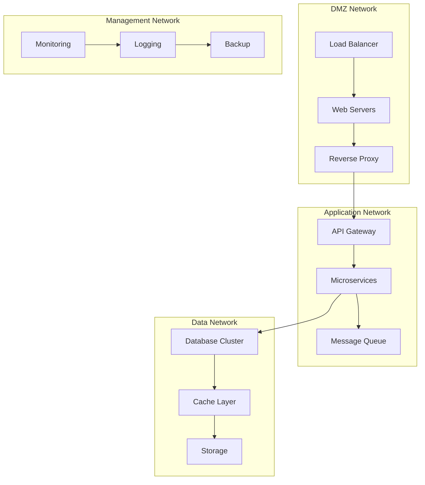

# Session 4: 커스텀 네트워크 구성

## 📍 교과과정에서의 위치
이 세션은 **Week 2 > Day 3 > Session 4**로, Session 3의 기본 네트워킹을 바탕으로 고급 네트워크 구성과 멀티 컨테이너 환경에서의 네트워크 설계를 학습합니다.

## 학습 목표 (5분)
- **고급 네트워크 드라이버** 활용 및 **멀티 호스트 네트워킹**
- **VLAN, 서브넷 분할** 및 **네트워크 토폴로지** 설계
- **마이크로서비스 아키텍처**를 위한 **네트워크 패턴** 구현

## 1. 이론: 고급 네트워크 아키텍처 (20분)

### 엔터프라이즈 네트워크 토폴로지



### 네트워크 세그멘테이션 전략

```
네트워크 계층 구조:

Frontend Tier (DMZ):
├── 172.16.1.0/24 - Load Balancers
├── 172.16.2.0/24 - Web Servers
├── 172.16.3.0/24 - CDN/Cache
└── 외부 접근 허용, 제한된 내부 접근

Application Tier:
├── 172.16.10.0/24 - API Gateway
├── 172.16.11.0/24 - Microservices
├── 172.16.12.0/24 - Message Queue
└── 내부 통신만, 보안 강화

Data Tier:
├── 172.16.20.0/24 - Primary DB
├── 172.16.21.0/24 - Replica DB
├── 172.16.22.0/24 - Cache
└── 최고 보안 수준, 암호화 통신

Management Tier:
├── 172.16.30.0/24 - Monitoring
├── 172.16.31.0/24 - Logging
├── 172.16.32.0/24 - Backup
└── 관리자 전용, VPN 접근
```

### 고급 네트워크 드라이버

```
Macvlan Network:
├── 컨테이너에 물리적 MAC 주소 할당
├── VLAN 태깅 지원
├── 레거시 시스템 통합
└── 브로드캐스트 도메인 분리

IPvlan Network:
├── 단일 MAC, 다중 IP 주소
├── L2/L3 모드 지원
├── 더 나은 성능
└── 스위치 MAC 테이블 절약

Overlay Network:
├── 멀티 호스트 통신
├── VXLAN 캡슐화
├── 분산 환경 지원
└── Docker Swarm 통합
```

## 2. 실습: Macvlan 네트워크 구성 (15분)

### Macvlan 네트워크 생성

```bash
# 물리 인터페이스 확인
ip link show

# Macvlan 네트워크 생성 (실제 환경에 맞게 조정)
docker network create -d macvlan \
    --subnet=192.168.1.0/24 \
    --gateway=192.168.1.1 \
    -o parent=eth0 \
    macvlan-net

# VLAN 태깅을 사용한 Macvlan
docker network create -d macvlan \
    --subnet=192.168.100.0/24 \
    --gateway=192.168.100.1 \
    -o parent=eth0.100 \
    vlan100-net

# Macvlan 네트워크 정보 확인
docker network inspect macvlan-net
```

### Macvlan 컨테이너 배포

```bash
# Macvlan 네트워크에 컨테이너 배포
docker run -d --name macvlan-web \
    --network macvlan-net \
    --ip 192.168.1.100 \
    nginx:alpine

# 물리 네트워크에서 직접 접근 가능한지 테스트
# (실제 환경에서는 192.168.1.100으로 직접 접근 가능)

# 네트워크 인터페이스 확인
docker exec macvlan-web ip addr show
docker exec macvlan-web ip route show
```

### IPvlan 네트워크 구성

```bash
# IPvlan L2 모드
docker network create -d ipvlan \
    --subnet=192.168.2.0/24 \
    --gateway=192.168.2.1 \
    -o parent=eth0 \
    -o ipvlan_mode=l2 \
    ipvlan-l2

# IPvlan L3 모드
docker network create -d ipvlan \
    --subnet=192.168.3.0/24 \
    -o parent=eth0 \
    -o ipvlan_mode=l3 \
    ipvlan-l3

# IPvlan 컨테이너 테스트
docker run -d --name ipvlan-test \
    --network ipvlan-l2 \
    --ip 192.168.2.50 \
    alpine sleep 3600

# 네트워크 모드 확인
docker exec ipvlan-test ip addr show
```

## 3. 실습: 멀티 네트워크 마이크로서비스 (15분)

### 3-Tier 아키텍처 구현

```bash
# 네트워크 계층 생성
docker network create --subnet=172.16.1.0/24 frontend-net
docker network create --subnet=172.16.10.0/24 backend-net  
docker network create --subnet=172.16.20.0/24 database-net

# Frontend 계층 (웹 서버)
docker run -d --name web-server \
    --network frontend-net \
    --ip 172.16.1.10 \
    -p 8080:80 \
    nginx:alpine

# API Gateway (Frontend와 Backend 연결)
docker run -d --name api-gateway \
    --network frontend-net \
    --ip 172.16.1.20 \
    alpine sleep 3600

# API Gateway를 Backend 네트워크에도 연결
docker network connect backend-net api-gateway --ip 172.16.10.20

# Backend 서비스들
docker run -d --name user-service \
    --network backend-net \
    --ip 172.16.10.30 \
    alpine sleep 3600

docker run -d --name order-service \
    --network backend-net \
    --ip 172.16.10.31 \
    alpine sleep 3600

# Database 서비스 (Backend와 Database 연결)
docker run -d --name database \
    --network database-net \
    --ip 172.16.20.10 \
    -e MYSQL_ROOT_PASSWORD=secret \
    mysql:8.0

# Backend 서비스들을 Database 네트워크에 연결
docker network connect database-net user-service --ip 172.16.20.30
docker network connect database-net order-service --ip 172.16.20.31
```

### 서비스 메시 구현

```bash
# 서비스 디스커버리를 위한 DNS 설정
cat > service-mesh.sh << 'EOF'
#!/bin/bash

# 서비스 간 통신 테스트
test_service_communication() {
    echo "=== Service Communication Test ==="
    
    # Frontend -> API Gateway
    echo "Frontend to API Gateway:"
    docker exec web-server ping -c 2 172.16.1.20
    
    # API Gateway -> Backend Services
    echo "API Gateway to User Service:"
    docker exec api-gateway ping -c 2 user-service
    
    echo "API Gateway to Order Service:"
    docker exec api-gateway ping -c 2 order-service
    
    # Backend -> Database
    echo "User Service to Database:"
    docker exec user-service ping -c 2 database
    
    echo "Order Service to Database:"
    docker exec order-service ping -c 2 database
}

# 네트워크 격리 테스트
test_network_isolation() {
    echo "=== Network Isolation Test ==="
    
    # Frontend는 Database에 직접 접근 불가
    echo "Frontend to Database (should fail):"
    docker exec web-server ping -c 2 172.16.20.10 || echo "✓ Isolation working"
    
    # Backend 서비스 간 통신
    echo "User Service to Order Service:"
    docker exec user-service ping -c 2 order-service
}

test_service_communication
test_network_isolation
EOF

chmod +x service-mesh.sh
./service-mesh.sh
```

### 로드 밸런싱 구현

```bash
# 로드 밸런서 네트워크 생성
docker network create --subnet=172.16.0.0/24 lb-net

# 로드 밸런서 (HAProxy)
cat > haproxy.cfg << 'EOF'
global
    daemon

defaults
    mode http
    timeout connect 5000ms
    timeout client 50000ms
    timeout server 50000ms

frontend web_frontend
    bind *:80
    default_backend web_servers

backend web_servers
    balance roundrobin
    server web1 172.16.1.10:80 check
    server web2 172.16.1.11:80 check
    server web3 172.16.1.12:80 check
EOF

# HAProxy 컨테이너 실행
docker run -d --name load-balancer \
    --network lb-net \
    --network frontend-net \
    -p 9090:80 \
    -v $(pwd)/haproxy.cfg:/usr/local/etc/haproxy/haproxy.cfg \
    haproxy:alpine

# 추가 웹 서버 인스턴스
for i in {2..3}; do
    docker run -d --name web-server-$i \
        --network frontend-net \
        --ip 172.16.1.1$i \
        nginx:alpine
    
    # 각 서버에 고유 식별자 추가
    docker exec web-server-$i sh -c "echo 'Server $i' > /usr/share/nginx/html/index.html"
done

# 로드 밸런싱 테스트
echo "Testing load balancing:"
for i in {1..6}; do
    echo "Request $i: $(curl -s http://localhost:9090)"
done
```

## 4. 실습: 네트워크 보안 및 정책 (10분)

### 네트워크 정책 구현

```bash
# 보안 네트워크 생성 (내부 전용)
docker network create --internal secure-backend

# 보안이 중요한 서비스 배포
docker run -d --name secure-db \
    --network secure-backend \
    -e POSTGRES_PASSWORD=secret \
    postgres:alpine

docker run -d --name secure-cache \
    --network secure-backend \
    redis:alpine

# 애플리케이션 서버 (보안 네트워크와 일반 네트워크 모두 연결)
docker run -d --name app-server \
    --network backend-net \
    alpine sleep 3600

docker network connect secure-backend app-server

# 보안 테스트
echo "Testing secure network isolation:"
docker exec app-server ping -c 2 secure-db && echo "✓ Internal access works"
docker exec web-server ping -c 2 secure-db || echo "✓ External access blocked"
```

### 방화벽 규칙 시뮬레이션

```bash
# 네트워크 ACL 시뮬레이션 스크립트
cat > network-acl.sh << 'EOF'
#!/bin/bash

# 허용된 통신 경로 정의
declare -A allowed_connections=(
    ["web-server"]="api-gateway"
    ["api-gateway"]="user-service order-service"
    ["user-service"]="database secure-db"
    ["order-service"]="database secure-cache"
)

# 연결 테스트 함수
test_connection() {
    local source=$1
    local target=$2
    
    if docker exec $source ping -c 1 $target >/dev/null 2>&1; then
        echo "✓ $source -> $target: ALLOWED"
        return 0
    else
        echo "✗ $source -> $target: BLOCKED"
        return 1
    fi
}

# ACL 검증
echo "=== Network ACL Validation ==="
for source in "${!allowed_connections[@]}"; do
    targets=${allowed_connections[$source]}
    for target in $targets; do
        test_connection $source $target
    done
done

# 금지된 연결 테스트
echo ""
echo "=== Forbidden Connection Tests ==="
test_connection web-server database
test_connection web-server secure-db
EOF

chmod +x network-acl.sh
./network-acl.sh
```

### 네트워크 모니터링

```bash
# 네트워크 트래픽 모니터링 컨테이너
docker run -d --name network-monitor \
    --network backend-net \
    --cap-add NET_ADMIN \
    nicolaka/netshoot sleep 3600

# 트래픽 분석 스크립트
cat > traffic-monitor.sh << 'EOF'
#!/bin/bash

echo "=== Network Traffic Analysis ==="

# 네트워크 인터페이스 통계
docker exec network-monitor cat /proc/net/dev

# 연결 상태 확인
echo ""
echo "Active connections:"
docker exec network-monitor netstat -tuln

# 라우팅 테이블
echo ""
echo "Routing table:"
docker exec network-monitor ip route show

# ARP 테이블
echo ""
echo "ARP table:"
docker exec network-monitor arp -a
EOF

chmod +x traffic-monitor.sh
./traffic-monitor.sh
```

## 5. 실습: 네트워크 성능 최적화 (10분)

### 네트워크 성능 테스트

```bash
# 성능 테스트용 컨테이너
docker run -d --name perf-server \
    --network backend-net \
    alpine sh -c 'nc -l -p 5001'

docker run -d --name perf-client \
    --network backend-net \
    alpine sleep 3600

# 대역폭 테스트 (iperf3 사용)
docker run -d --name iperf-server \
    --network backend-net \
    -p 5201:5201 \
    networkstatic/iperf3 -s

docker run --rm --name iperf-client \
    --network backend-net \
    networkstatic/iperf3 -c iperf-server -t 10

# 지연시간 테스트
echo "=== Latency Test ==="
docker exec perf-client ping -c 10 perf-server | tail -1
```

### 네트워크 최적화 설정

```bash
# 고성능 네트워크 생성
docker network create \
    --driver bridge \
    --opt com.docker.network.driver.mtu=9000 \
    --opt com.docker.network.bridge.name=high-perf \
    high-performance

# 최적화된 컨테이너 실행
docker run -d --name optimized-app \
    --network high-performance \
    --sysctl net.core.rmem_max=134217728 \
    --sysctl net.core.wmem_max=134217728 \
    alpine sleep 3600

# 네트워크 설정 확인
docker exec optimized-app sysctl net.core.rmem_max
docker exec optimized-app sysctl net.core.wmem_max
docker exec optimized-app ip link show eth0
```

### 네트워크 토폴로지 시각화

```bash
# 네트워크 토폴로지 분석 스크립트
cat > network-topology.sh << 'EOF'
#!/bin/bash

echo "=== Docker Network Topology ==="

# 모든 네트워크와 연결된 컨테이너 표시
for network in $(docker network ls --format "{{.Name}}" | grep -v bridge | grep -v host | grep -v none); do
    echo ""
    echo "Network: $network"
    echo "Subnet: $(docker network inspect $network --format '{{range .IPAM.Config}}{{.Subnet}}{{end}}')"
    echo "Containers:"
    docker network inspect $network --format '{{range .Containers}}  {{.Name}} ({{.IPv4Address}}){{end}}' | tr ' ' '\n' | grep -v '^$'
done

# 컨테이너별 네트워크 연결 상태
echo ""
echo "=== Container Network Connections ==="
for container in $(docker ps --format "{{.Names}}"); do
    echo ""
    echo "Container: $container"
    docker inspect $container --format '{{range $network, $config := .NetworkSettings.Networks}}  {{$network}}: {{$config.IPAddress}}{{end}}' | tr ' ' '\n' | grep -v '^$'
done
EOF

chmod +x network-topology.sh
./network-topology.sh
```

## 6. Q&A 및 정리 (5분)

### 네트워크 아키텍처 검증

```bash
# 최종 네트워크 구성 검증
echo "=== Final Network Architecture Validation ==="

# 네트워크 계층별 연결성 테스트
echo "1. Frontend Layer:"
docker exec web-server ping -c 1 api-gateway >/dev/null && echo "  ✓ Web -> API Gateway"

echo "2. Application Layer:"
docker exec api-gateway ping -c 1 user-service >/dev/null && echo "  ✓ API Gateway -> User Service"
docker exec api-gateway ping -c 1 order-service >/dev/null && echo "  ✓ API Gateway -> Order Service"

echo "3. Data Layer:"
docker exec user-service ping -c 1 database >/dev/null && echo "  ✓ User Service -> Database"
docker exec order-service ping -c 1 secure-cache >/dev/null && echo "  ✓ Order Service -> Cache"

echo "4. Security Isolation:"
docker exec web-server ping -c 1 database >/dev/null || echo "  ✓ Frontend isolated from Database"

# 네트워크 리소스 정리
echo ""
echo "Cleaning up network resources..."
docker stop $(docker ps -q) 2>/dev/null || true
docker rm $(docker ps -aq) 2>/dev/null || true
docker network prune -f
echo "✓ Network cleanup completed"
```

## 💡 핵심 키워드
- **고급 드라이버**: macvlan, ipvlan, overlay
- **네트워크 세그멘테이션**: 3-tier, DMZ, 보안 계층
- **서비스 메시**: 마이크로서비스, 로드 밸런싱, 서비스 디스커버리
- **네트워크 보안**: ACL, 격리, 방화벽 정책

## 📚 참고 자료
- [Macvlan 네트워크](https://docs.docker.com/network/macvlan/)
- [IPvlan 네트워크](https://docs.docker.com/network/ipvlan/)
- [네트워크 보안](https://docs.docker.com/network/security/)

## 🔧 실습 체크리스트
- [ ] Macvlan/IPvlan 네트워크 구성
- [ ] 3-tier 아키텍처 구현
- [ ] 서비스 메시 및 로드 밸런싱
- [ ] 네트워크 보안 정책 적용
- [ ] 성능 최적화 및 모니터링
