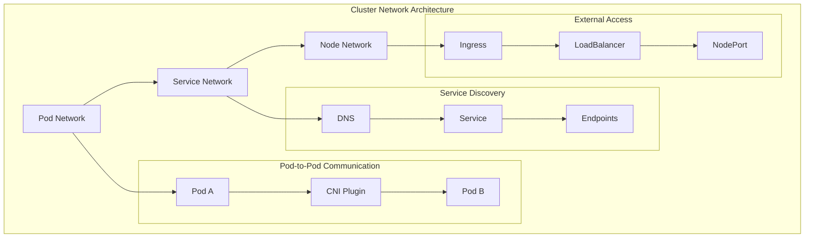
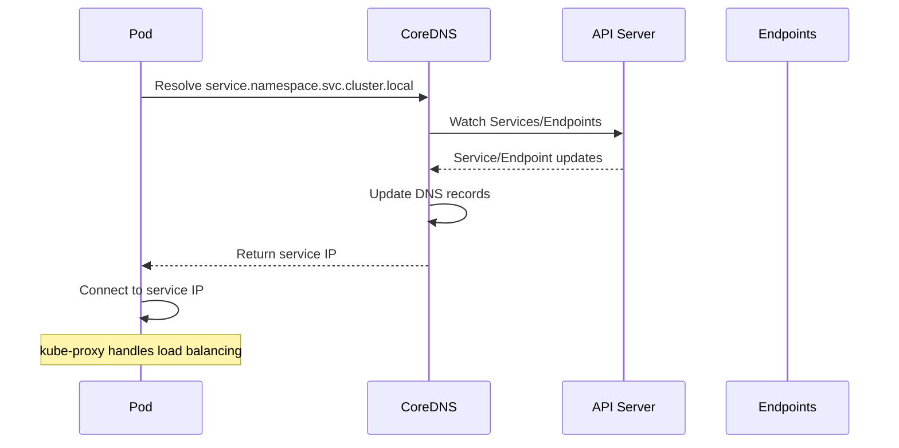

# Session 4: 클러스터 네트워킹 및 서비스 디스커버리

## 📍 교과과정에서의 위치
이 세션은 **Week 2 > Day 3 > Session 4**로, Kubernetes 핵심 오브젝트 이해를 바탕으로 클러스터 네트워킹 모델과 서비스 디스커버리 메커니즘을 심화 분석합니다.

## 학습 목표 (5분)
- **Kubernetes 네트워킹 모델** 및 **CNI 플러그인** 아키텍처 이해
- **서비스 타입별 특성**과 **로드 밸런싱** 메커니즘 분석
- **Ingress 컨트롤러**와 **트래픽 라우팅** 전략 수립

## 1. 이론: Kubernetes 네트워킹 모델 (20분)

### 네트워킹 아키텍처 개요



### Kubernetes 네트워킹 기본 원칙

```
Kubernetes 네트워킹 4대 원칙:

1. Pod 간 직접 통신:
├── 모든 Pod는 NAT 없이 서로 통신 가능
├── 동일한 노드 또는 다른 노드 상관없이
├── 각 Pod는 고유한 IP 주소 보유
├── 플랫 네트워크 구조 (Flat Network)
├── 네트워크 오버레이 또는 언더레이
└── 컨테이너 간 localhost 통신 (동일 Pod 내)

2. 노드-Pod 통신:
├── 노드는 NAT 없이 모든 Pod와 통신
├── Pod는 NAT 없이 모든 노드와 통신
├── 노드 에이전트 (kubelet, kube-proxy) 접근
├── 시스템 데몬 및 서비스 통신
├── 호스트 네트워크 네임스페이스 공유 옵션
└── 보안 정책을 통한 접근 제어

3. Pod 자체 IP 인식:
├── Pod는 자신의 IP 주소를 정확히 인식
├── 다른 Pod가 보는 IP와 동일
├── NAT나 프록시로 인한 IP 변환 없음
├── 애플리케이션 레벨 투명성
├── 서비스 디스커버리 단순화
└── 로드 밸런싱 및 헬스 체크 용이

4. 서비스 추상화:
├── Pod IP는 일시적이고 동적
├── Service를 통한 안정적인 엔드포인트 제공
├── 로드 밸런싱 및 서비스 디스커버리
├── DNS 기반 서비스 해석
├── 가상 IP (VIP) 및 포트 매핑
└── 외부 트래픽 라우팅 지원

네트워크 네임스페이스 구조:
├── 각 Pod는 독립적인 네트워크 네임스페이스
├── 네트워크 인터페이스, 라우팅 테이블, iptables 격리
├── 동일 Pod 내 컨테이너는 네트워크 네임스페이스 공유
├── localhost를 통한 컨테이너 간 통신
├── 포트 공간 공유 (포트 충돌 주의)
└── 볼륨을 통한 Unix 소켓 통신 가능
```

### CNI (Container Network Interface) 플러그인

```
CNI 플러그인 생태계:

CNI 표준 및 아키텍처:
├── CNCF 표준 네트워크 인터페이스
├── 컨테이너 런타임과 네트워크 플러그인 분리
├── JSON 기반 설정 및 바이너리 실행
├── 네트워크 생성, 삭제, 상태 확인 API
├── 체이닝을 통한 다중 플러그인 조합
└── 크로스 플랫폼 호환성

주요 CNI 플러그인:

Flannel:
├── 간단하고 안정적인 오버레이 네트워크
├── VXLAN, host-gw, UDP 백엔드 지원
├── 설정 및 관리 용이성
├── 소규모 클러스터에 적합
├── 제한적인 네트워크 정책 지원
└── 성능보다 안정성 중시

Calico:
├── L3 라우팅 기반 네트워크
├── BGP 프로토콜 활용
├── 고성능 및 확장성
├── 풍부한 네트워크 정책 지원
├── eBPF 데이터플레인 옵션
├── 멀티 클라우드 지원
└── 엔터프라이즈 기능 완비

Weave Net:
├── 메시 네트워크 토폴로지
├── 자동 네트워크 발견 및 구성
├── 암호화된 통신 지원
├── 네트워크 분할 복구 기능
├── 간단한 설치 및 관리
├── 시각적 네트워크 모니터링
└── 중소규모 클러스터 최적화

Cilium:
├── eBPF 기반 고성능 네트워킹
├── API 인식 네트워크 보안
├── L7 로드 밸런싱 및 정책
├── 서비스 메시 통합
├── 관찰가능성 및 모니터링
├── 클러스터 메시 지원
└── 차세대 네트워킹 기술

Amazon VPC CNI:
├── AWS VPC 네이티브 통합
├── Pod에 VPC IP 직접 할당
├── 보안 그룹 및 NACLs 활용
├── 높은 네트워크 성능
├── AWS 서비스 통합 최적화
└── 클라우드 네이티브 설계

Azure CNI:
├── Azure Virtual Network 통합
├── 네이티브 Azure 네트워킹
├── Network Security Groups 지원
├── Azure Load Balancer 통합
├── 하이브리드 클라우드 지원
└── Azure 서비스 최적화
```

## 2. 이론: 서비스 디스커버리 및 DNS (15분)

### Kubernetes DNS 시스템



### DNS 기반 서비스 디스커버리

```
Kubernetes DNS 구조:

CoreDNS 아키텍처:
├── 클러스터 DNS 서버 역할
├── 플러그인 기반 확장 가능한 구조
├── Kubernetes API 감시를 통한 동적 업데이트
├── 캐싱을 통한 성능 최적화
├── 고가용성 배포 지원
├── 메트릭 및 로깅 지원
└── 사용자 정의 DNS 정책 적용

DNS 레코드 구조:
├── 서비스 DNS 이름:
│   ├── <service-name>.<namespace>.svc.cluster.local
│   ├── <service-name>.<namespace>.svc
│   ├── <service-name> (동일 네임스페이스 내)
│   └── A 레코드: 서비스 ClusterIP 반환
├── Pod DNS 이름:
│   ├── <pod-ip>.<namespace>.pod.cluster.local
│   ├── 점(.)을 대시(-)로 변환된 IP
│   └── A 레코드: Pod IP 반환
├── Headless 서비스:
│   ├── 서비스 이름으로 모든 Pod IP 반환
│   ├── SRV 레코드: 포트 정보 포함
│   └── StatefulSet Pod 개별 DNS 이름
└── 외부 서비스:
    ├── ExternalName 서비스 CNAME 레코드
    ├── 외부 DNS 이름으로 리다이렉션
    └── 클러스터 외부 서비스 추상화

DNS 정책 및 설정:
├── Default: 클러스터 DNS 사용
├── ClusterFirst: 클러스터 DNS 우선, 업스트림 폴백
├── ClusterFirstWithHostNet: 호스트 네트워크 Pod용
├── None: 사용자 정의 DNS 설정
├── dnsConfig를 통한 세밀한 제어
└── 검색 도메인 및 옵션 설정

서비스 디스커버리 패턴:
├── DNS 기반 디스커버리 (권장)
├── 환경 변수 기반 디스커버리 (레거시)
├── API 서버 직접 조회
├── 서드파티 서비스 디스커버리 도구
├── 서비스 메시 통합
└── 외부 서비스 레지스트리 연동
```

### 로드 밸런싱 메커니즘

```
kube-proxy 로드 밸런싱:

프록시 모드:
├── iptables 모드 (기본):
│   ├── iptables 규칙을 통한 트래픽 라우팅
│   ├── 커널 공간에서 처리 (고성능)
│   ├── 랜덤 로드 밸런싱
│   ├── 연결 추적 기반 세션 어피니티
│   ├── 확장성 제한 (대규모 서비스)
│   └── 디버깅 복잡성
├── IPVS 모드:
│   ├── Linux IPVS 커널 모듈 활용
│   ├── 다양한 로드 밸런싱 알고리즘
│   ├── 높은 성능 및 확장성
│   ├── 연결 기반 로드 밸런싱
│   ├── 실시간 가중치 조정
│   └── 고급 스케줄링 옵션
└── userspace 모드 (레거시):
    ├── 사용자 공간 프록시
    ├── 낮은 성능
    ├── 호환성 목적으로만 사용
    └── 디버깅 용이성

로드 밸런싱 알고리즘 (IPVS):
├── Round Robin (rr): 순차적 분배
├── Least Connection (lc): 최소 연결 수
├── Destination Hashing (dh): 목적지 해싱
├── Source Hashing (sh): 소스 해싱
├── Shortest Expected Delay (sed): 예상 지연 최소
├── Never Queue (nq): 큐잉 방지
└── Weighted 변형: 가중치 적용 버전

세션 어피니티:
├── ClientIP 기반 세션 유지
├── 타임아웃 설정 가능
├── 상태 유지 애플리케이션 지원
├── 로드 밸런싱 효율성 트레이드오프
└── 클라이언트 IP 변경 시 세션 손실
```

## 3. 이론: Ingress 및 트래픽 라우팅 (10분)

### Ingress 아키텍처

```
Ingress 개념 및 구조:

Ingress 리소스:
├── L7 (HTTP/HTTPS) 로드 밸런싱
├── 호스트 기반 라우팅
├── 경로 기반 라우팅
├── TLS 터미네이션
├── 가상 호스팅 지원
├── 백엔드 서비스 추상화
└── 선언적 트래픽 라우팅 규칙

Ingress Controller:
├── Ingress 리소스 구현체
├── 실제 트래픽 라우팅 수행
├── 로드 밸런서 설정 자동화
├── 동적 설정 업데이트
├── 헬스 체크 및 모니터링
├── 메트릭 및 로깅 제공
└── 다양한 구현체 선택 가능

주요 Ingress Controller:

NGINX Ingress Controller:
├── 가장 널리 사용되는 컨트롤러
├── 높은 성능 및 안정성
├── 풍부한 어노테이션 지원
├── 커스텀 설정 유연성
├── 커뮤니티 및 상용 버전
├── 모니터링 및 메트릣 지원
└── 다양한 인증 및 보안 기능

Traefik:
├── 클라우드 네이티브 설계
├── 자동 서비스 디스커버리
├── 동적 설정 업데이트
├── 내장 대시보드 및 모니터링
├── Let's Encrypt 자동 인증서
├── 마이크로서비스 최적화
└── 개발자 친화적 인터페이스

HAProxy Ingress:
├── 엔터프라이즈급 로드 밸런서
├── 고성능 및 고가용성
├── 고급 로드 밸런싱 알고리즘
├── 세밀한 트래픽 제어
├── 실시간 통계 및 모니터링
├── 보안 및 DDoS 방어
└── 레거시 시스템 통합

클라우드 제공업체 Ingress:
├── AWS ALB Ingress Controller
├── Google Cloud Load Balancer
├── Azure Application Gateway
├── 클라우드 네이티브 통합
├── 관리형 서비스 활용
└── 클라우드 특화 기능

Ingress 고급 기능:
├── 경로 재작성 (Path Rewriting)
├── 리다이렉션 및 리라이트
├── 인증 및 권한 부여
├── 레이트 리미팅
├── CORS 정책 적용
├── 압축 및 캐싱
├── 웹소켓 지원
└── gRPC 프로토콜 지원
```

## 4. 개념 예시: 네트워킹 구성 분석 (7분)

### CNI 플러그인 설정 예시

```yaml
# Calico CNI 설정 (개념 예시)
apiVersion: v1
kind: ConfigMap
metadata:
  name: calico-config
  namespace: kube-system
data:
  cni_network_config: |
    {
      "name": "k8s-pod-network",
      "cniVersion": "0.3.1",
      "plugins": [
        {
          "type": "calico",
          "log_level": "info",
          "datastore_type": "kubernetes",
          "mtu": 1440,
          "ipam": {
            "type": "calico-ipam"
          },
          "policy": {
            "type": "k8s"
          },
          "kubernetes": {
            "kubeconfig": "/etc/cni/net.d/calico-kubeconfig"
          }
        },
        {
          "type": "portmap",
          "snat": true,
          "capabilities": {"portMappings": true}
        }
      ]
    }
```

### 서비스 및 Ingress 구성 예시

```yaml
# 멀티 티어 애플리케이션 네트워킹 (개념 예시)
apiVersion: v1
kind: Service
metadata:
  name: frontend-service
spec:
  selector:
    app: frontend
  ports:
  - port: 80
    targetPort: 8080
  type: ClusterIP

---
apiVersion: v1
kind: Service
metadata:
  name: backend-service
spec:
  selector:
    app: backend
  ports:
  - port: 8080
    targetPort: 8080
  type: ClusterIP

---
apiVersion: networking.k8s.io/v1
kind: Ingress
metadata:
  name: app-ingress
  annotations:
    nginx.ingress.kubernetes.io/rewrite-target: /
    nginx.ingress.kubernetes.io/ssl-redirect: "true"
    cert-manager.io/cluster-issuer: "letsencrypt-prod"
spec:
  tls:
  - hosts:
    - app.example.com
    secretName: app-tls
  rules:
  - host: app.example.com
    http:
      paths:
      - path: /
        pathType: Prefix
        backend:
          service:
            name: frontend-service
            port:
              number: 80
      - path: /api
        pathType: Prefix
        backend:
          service:
            name: backend-service
            port:
              number: 8080
```

### 네트워크 정책 예시

```yaml
# 네트워크 정책 (개념 예시)
apiVersion: networking.k8s.io/v1
kind: NetworkPolicy
metadata:
  name: backend-netpol
spec:
  podSelector:
    matchLabels:
      app: backend
  policyTypes:
  - Ingress
  - Egress
  ingress:
  - from:
    - podSelector:
        matchLabels:
          app: frontend
    ports:
    - protocol: TCP
      port: 8080
  egress:
  - to:
    - podSelector:
        matchLabels:
          app: database
    ports:
    - protocol: TCP
      port: 5432
  - to: []
    ports:
    - protocol: TCP
      port: 53
    - protocol: UDP
      port: 53
```

### 네트워크 디버깅 예시

```bash
# 네트워크 연결성 테스트 (개념 예시)

# Pod 간 통신 테스트
kubectl exec -it pod1 -- ping pod2-ip

# 서비스 디스커버리 테스트
kubectl exec -it pod1 -- nslookup backend-service

# DNS 해석 확인
kubectl exec -it pod1 -- dig backend-service.default.svc.cluster.local

# 네트워크 정책 확인
kubectl describe networkpolicy backend-netpol

# CNI 플러그인 상태 확인
kubectl get pods -n kube-system -l k8s-app=calico-node

# Ingress 상태 및 엔드포인트 확인
kubectl describe ingress app-ingress
kubectl get endpoints frontend-service
```

## 5. 토론 및 정리 (3분)

### 핵심 개념 정리
- **Kubernetes 네트워킹 모델**의 4대 원칙과 CNI 플러그인 역할
- **DNS 기반 서비스 디스커버리**와 kube-proxy 로드 밸런싱
- **Ingress 컨트롤러**를 통한 L7 트래픽 라우팅 및 관리
- **네트워크 정책**을 통한 마이크로세그멘테이션 구현

### 토론 주제
"대규모 마이크로서비스 환경에서 네트워크 성능, 보안, 관리 효율성을 동시에 만족하는 최적의 네트워킹 전략은 무엇인가?"

## 💡 핵심 키워드
- **네트워킹 모델**: CNI, Pod 통신, 플랫 네트워크
- **서비스 디스커버리**: DNS, CoreDNS, 로드 밸런싱
- **트래픽 라우팅**: Ingress, L7 로드 밸런싱, TLS
- **네트워크 보안**: NetworkPolicy, 마이크로세그멘테이션

## 📚 참고 자료
- [Kubernetes 네트워킹 개념](https://kubernetes.io/docs/concepts/services-networking/)
- [CNI 플러그인 비교](https://kubernetes.io/docs/concepts/extend-kubernetes/compute-storage-net/network-plugins/)
- [Ingress 컨트롤러](https://kubernetes.io/docs/concepts/services-networking/ingress-controllers/)
