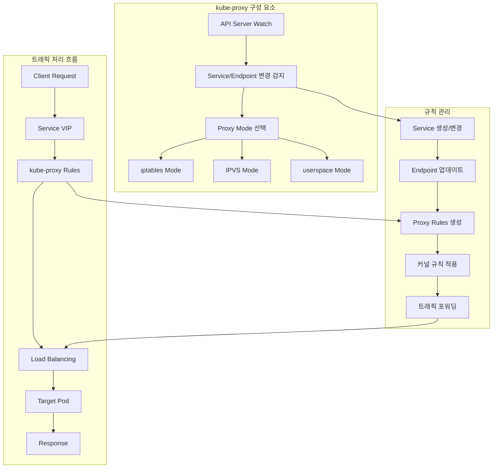
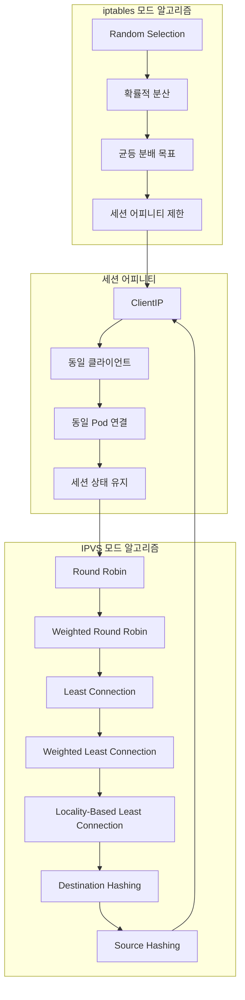
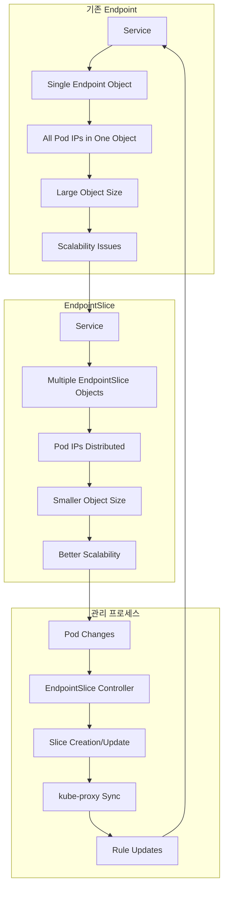

# Session 4: kube-proxy와 로드 밸런싱

## 📍 교과과정에서의 위치
이 세션은 **Week 2 > Day 3 > Session 4**로, Kubernetes Service 구현의 핵심인 kube-proxy의 동작 원리와 로드 밸런싱 메커니즘을 학습합니다. Session 3에서 학습한 Service 타입들이 실제로 어떻게 구현되는지 이해합니다.

## 학습 목표 (5분)
- **kube-proxy** 역할과 **구현 모드** 완전 이해
- **iptables vs IPVS** 모드 비교 분석
- **세션 어피니티**와 **로드 밸런싱** 알고리즘 학습
- **Endpoint**와 **EndpointSlice** 관리 메커니즘 파악

## 1. kube-proxy 역할과 구현 모드 (15분)

### kube-proxy 아키텍처



### kube-proxy 핵심 역할
```
kube-proxy 기본 개념:

주요 역할:
├── Service 추상화 구현:
│   ├── 가상 IP (ClusterIP) 트래픽 처리
│   ├── Service와 Pod 간 연결 관리
│   ├── 로드 밸런싱 규칙 적용
│   └── 서비스 디스커버리 지원
├── 네트워크 규칙 관리:
│   ├── iptables/IPVS 규칙 생성/삭제
│   ├── NAT (Network Address Translation)
│   ├── 포트 포워딩 및 매핑
│   └── 트래픽 라우팅 제어
├── 상태 동기화:
│   ├── API 서버와 실시간 동기화
│   ├── Service/Endpoint 변경 감지
│   ├── Pod 상태 변화 반영
│   └── 네트워크 규칙 업데이트

동작 원리:
├── 초기화 과정:
│   ├── API 서버 연결 및 인증
│   ├── 노드 정보 및 설정 로드
│   ├── 프록시 모드 선택
│   ├── 기존 규칙 정리
│   └── Watch 연결 설정
├── 런타임 동작:
│   ├── Service/Endpoint 이벤트 수신
│   ├── 변경 사항 분석 및 검증
│   ├── 네트워크 규칙 계산
│   ├── 커널 규칙 적용
│   ├── 상태 업데이트 및 로깅
│   └── 헬스 체크 및 모니터링

구현 모드 개요:
├── userspace 모드 (레거시):
│   ├── 사용자 공간에서 프록시 동작
│   ├── 모든 트래픽이 kube-proxy 경유
│   ├── 높은 지연시간과 오버헤드
│   ├── 디버깅 용이성
│   └── 현재 사용 비권장
├── iptables 모드 (기본):
│   ├── 커널 iptables 규칙 활용
│   ├── 높은 성능과 낮은 지연시간
│   ├── 확률적 로드 밸런싱
│   ├── 대부분 환경에서 기본 사용
│   └── 규칙 수에 따른 성능 영향
├── IPVS 모드 (고성능):
│   ├── Linux IPVS 커널 모듈 활용
│   ├── 최고 성능과 확장성
│   ├── 다양한 로드 밸런싱 알고리즘
│   ├── 대규모 클러스터 최적화
│   └── 추가 커널 모듈 필요

설정 및 관리:
├── 설정 파라미터:
│   ├── --proxy-mode: 프록시 모드 선택
│   ├── --cluster-cidr: 클러스터 CIDR 설정
│   ├── --masquerade-all: 소스 IP 마스커레이드
│   ├── --bind-address: 바인딩 주소
│   └── --healthz-port: 헬스 체크 포트
├── 모니터링:
│   ├── 메트릭 수집 (Prometheus)
│   ├── 로그 분석 및 디버깅
│   ├── 성능 지표 추적
│   ├── 오류 및 경고 모니터링
│   └── 규칙 동기화 상태 확인
```

## 2. iptables vs IPVS 모드 비교 (12분)

### 모드별 아키텍처 비교

```mermaid
graph TB
    subgraph "iptables 모드"
        A[Service Request] --> B[iptables PREROUTING]
        B --> C[KUBE-SERVICES Chain]
        C --> D[Service-specific Chain]
        D --> E[Random Pod Selection]
        E --> F[DNAT to Pod IP]
    end
    
    subgraph "IPVS 모드"
        G[Service Request] --> H[IPVS Virtual Server]
        H --> I[Load Balancing Algorithm]
        I --> J[Real Server Selection]
        J --> K[Direct Forwarding]
    end
    
    subgraph "성능 비교"
        L[Connection Count] --> M[iptables: O(n)]
        L --> N[IPVS: O(1)]
        
        O[Rule Processing] --> P[iptables: Sequential]
        O --> Q[IPVS: Hash Table]
    end
    
    F --> L
    K --> L
    M --> O
    N --> O
```

### 모드별 상세 비교
```
iptables vs IPVS 모드 비교:

iptables 모드:
├── 동작 원리:
│   ├── netfilter 프레임워크 활용
│   ├── iptables 규칙 체인 생성
│   ├── PREROUTING 체인에서 처리
│   ├── 확률적 로드 밸런싱 (random)
│   ├── DNAT를 통한 목적지 변경
│   └── 커널 공간에서 패킷 처리
├── 장점:
│   ├── 기본 설치, 추가 모듈 불필요
│   ├── 안정성과 호환성 우수
│   ├── 디버깅 도구 풍부
│   ├── 네트워크 정책과 통합 용이
│   └── 소규모 클러스터에 적합
├── 단점:
│   ├── 서비스 수 증가 시 성능 저하 (O(n))
│   ├── 규칙 업데이트 시 지연 발생
│   ├── 로드 밸런싱 알고리즘 제한
│   ├── 세션 어피니티 구현 복잡
│   └── 대규모 환경에서 확장성 한계

IPVS 모드:
├── 동작 원리:
│   ├── Linux Virtual Server 활용
│   ├── 커널 레벨 로드 밸런서
│   ├── 해시 테이블 기반 룩업 (O(1))
│   ├── 다양한 스케줄링 알고리즘
│   ├── 직접 라우팅 또는 NAT
│   └── 고성능 패킷 처리
├── 장점:
│   ├── 뛰어난 성능과 확장성
│   ├── 다양한 로드 밸런싱 알고리즘
│   ├── 세션 어피니티 네이티브 지원
│   ├── 연결 추적 및 통계 제공
│   ├── 대규모 클러스터 최적화
│   └── 실시간 가중치 조정 가능
├── 단점:
│   ├── 추가 커널 모듈 필요 (ip_vs)
│   ├── 복잡한 설정 및 디버깅
│   ├── 일부 환경에서 호환성 이슈
│   ├── iptables 규칙과 혼재 시 복잡성
│   └── 학습 곡선 상대적 높음

성능 특성 비교:
├── 처리량 (Throughput):
│   ├── IPVS: 높은 패킷 처리율
│   ├── iptables: 규칙 수에 따라 감소
│   ├── 대규모: IPVS 압도적 우위
│   └── 소규모: 큰 차이 없음
├── 지연시간 (Latency):
│   ├── IPVS: 일정한 낮은 지연시간
│   ├── iptables: 규칙 수에 비례 증가
│   ├── 연결 설정: IPVS 빠름
│   └── 패킷 처리: IPVS 효율적
├── 메모리 사용량:
│   ├── IPVS: 연결 테이블 메모리 사용
│   ├── iptables: 규칙 저장 메모리
│   ├── 대규모: IPVS 메모리 효율적
│   └── 소규모: 비슷한 수준
├── CPU 사용량:
│   ├── IPVS: 낮고 일정한 CPU 사용
│   ├── iptables: 규칙 처리 CPU 오버헤드
│   ├── 스케일링: IPVS 선형적 증가
│   └── 규칙 업데이트: IPVS 효율적

선택 기준:
├── iptables 모드 권장:
│   ├── 소규모 클러스터 (< 1000 서비스)
│   ├── 단순한 네트워크 요구사항
│   ├── 기존 iptables 기반 보안 정책
│   ├── 안정성 우선 환경
│   └── 디버깅 및 트러블슈팅 중시
└── IPVS 모드 권장:
    ├── 대규모 클러스터 (> 1000 서비스)
    ├── 고성능 요구사항
    ├── 복잡한 로드 밸런싱 필요
    ├── 세션 어피니티 중요
    └── 확장성 우선 환경
```

## 3. 세션 어피니티와 로드 밸런싱 알고리즘 (10분)

### 로드 밸런싱 알고리즘 비교



### 로드 밸런싱 상세 분석
```
로드 밸런싱 알고리즘:

iptables 모드 알고리즘:
├── Random (확률적):
│   ├── 각 Pod에 동일한 선택 확률
│   ├── 통계적으로 균등 분산
│   ├── 단순하고 빠른 처리
│   ├── 세션 상태 고려 없음
│   └── 기본 알고리즘

IPVS 모드 알고리즘:
├── Round Robin (rr):
│   ├── 순차적으로 Pod 선택
│   ├── 균등한 요청 분산
│   ├── 단순하고 예측 가능
│   ├── Pod 성능 차이 미고려
│   └── 기본 IPVS 알고리즘
├── Weighted Round Robin (wrr):
│   ├── 가중치 기반 순차 선택
│   ├── Pod별 처리 능력 반영
│   ├── 동적 가중치 조정 가능
│   ├── 리소스 기반 분산
│   └── 성능 차이 있는 환경 적합
├── Least Connection (lc):
│   ├── 최소 연결 수 Pod 선택
│   ├── 연결 상태 기반 분산
│   ├── 장시간 연결에 효과적
│   ├── 연결 추적 오버헤드
│   └── 웹 서비스에 적합
├── Weighted Least Connection (wlc):
│   ├── 가중치 + 최소 연결 조합
│   ├── 성능과 부하 모두 고려
│   ├── 최적의 분산 효과
│   ├── 복잡한 계산 필요
│   └── 고성능 환경 권장
├── Source Hashing (sh):
│   ├── 클라이언트 IP 해시 기반
│   ├── 동일 클라이언트 → 동일 Pod
│   ├── 세션 어피니티 구현
│   ├── 캐시 효율성 향상
│   └── 상태 유지 애플리케이션
├── Destination Hashing (dh):
│   ├── 목적지 IP 해시 기반
│   ├── 특정 목적지 → 특정 Pod
│   ├── 캐시 지역성 활용
│   └── 특수 용도 알고리즘

세션 어피니티 (Session Affinity):
├── 기본 개념:
│   ├── 동일 클라이언트의 요청을 동일 Pod로 라우팅
│   ├── 세션 상태 유지 필요 시 사용
│   ├── 로드 밸런싱 효율성과 트레이드오프
│   └── 애플리케이션 설계에 따라 선택
├── 구현 방식:
│   ├── ClientIP 기반:
│   │   ├── 클라이언트 IP 주소 해시
│   │   ├── 동일 IP → 동일 Pod
│   │   ├── NAT 환경에서 제한
│   │   └── 간단한 구현
│   ├── Cookie 기반 (Ingress 레벨):
│   │   ├── HTTP 쿠키 활용
│   │   ├── 애플리케이션 레벨 제어
│   │   ├── 더 정확한 세션 추적
│   │   └── L7 로드 밸런서 필요
├── 고려사항:
│   ├── 장점:
│   │   ├── 세션 상태 일관성 보장
│   │   ├── 캐시 효율성 향상
│   │   ├── 애플리케이션 단순화
│   │   └── 데이터 지역성 활용
│   ├── 단점:
│   │   ├── 불균등한 로드 분산
│   │   ├── Pod 장애 시 세션 손실
│   │   ├── 확장성 제한
│   │   └── 핫스팟 발생 가능

알고리즘 선택 가이드:
├── 웹 애플리케이션:
│   ├── 상태 없음: Round Robin
│   ├── 세션 상태: Source Hashing
│   ├── 장시간 연결: Least Connection
│   └── 성능 차이: Weighted 알고리즘
├── API 서비스:
│   ├── 단순 요청: Round Robin
│   ├── 복잡 처리: Weighted Round Robin
│   ├── 캐시 활용: Source Hashing
│   └── 실시간: Least Connection
├── 데이터베이스:
│   ├── 읽기 전용: Round Robin
│   ├── 읽기/쓰기: Weighted 알고리즘
│   ├── 연결 풀: Least Connection
│   └── 샤딩: Destination Hashing
```

## 4. Endpoint와 EndpointSlice 관리 (10분)

### Endpoint vs EndpointSlice 아키텍처



### Endpoint 관리 메커니즘
```
Endpoint vs EndpointSlice:

기존 Endpoint 한계:
├── 확장성 문제:
│   ├── 단일 Endpoint 객체에 모든 Pod IP
│   ├── 대규모 서비스에서 객체 크기 급증
│   ├── etcd 저장 및 네트워크 전송 부담
│   ├── 업데이트 시 전체 객체 교체
│   └── API 서버 성능 영향
├── 네트워크 오버헤드:
│   ├── 작은 변경에도 전체 객체 전송
│   ├── kube-proxy 동기화 비효율
│   ├── 메모리 사용량 증가
│   └── 네트워크 대역폭 낭비
├── 동시성 문제:
│   ├── 여러 컨트롤러의 동시 업데이트
│   ├── 경쟁 조건 (Race Condition)
│   ├── 일관성 보장 어려움
│   └── 업데이트 충돌 가능성

EndpointSlice 개선사항:
├── 분산 저장:
│   ├── 여러 EndpointSlice 객체로 분할
│   ├── 기본 100개 엔드포인트 per slice
│   ├── 작은 객체 크기로 효율성 향상
│   ├── 부분 업데이트 가능
│   └── 병렬 처리 지원
├── 성능 최적화:
│   ├── 변경된 slice만 업데이트
│   ├── 네트워크 트래픽 감소
│   ├── 메모리 사용량 최적화
│   ├── API 서버 부하 분산
│   └── kube-proxy 동기화 효율성
├── 확장성 향상:
│   ├── 대규모 서비스 지원
│   ├── 수천 개 Pod 처리 가능
│   ├── 선형적 성능 확장
│   └── 클러스터 크기 제한 완화

EndpointSlice 구조:
├── 메타데이터:
│   ├── 서비스 참조 (kubernetes.io/service-name)
│   ├── 주소 타입 (IPv4, IPv6, FQDN)
│   ├── 포트 정보
│   └── 라벨 및 어노테이션
├── 엔드포인트 정보:
│   ├── IP 주소 목록
│   ├── 포트 매핑
│   ├── 준비 상태 (ready/serving/terminating)
│   ├── 노드 정보
│   ├── 존 정보 (topology)
│   └── 힌트 정보 (hints)

관리 프로세스:
├── EndpointSlice Controller:
│   ├── Service와 Pod 변경 감시
│   ├── EndpointSlice 자동 생성/업데이트
│   ├── 슬라이스 크기 관리 (기본 100개)
│   ├── 미러링 모드 지원 (Endpoint → EndpointSlice)
│   └── 가비지 컬렉션
├── kube-proxy 통합:
│   ├── EndpointSlice 우선 사용
│   ├── Endpoint 호환성 유지
│   ├── 점진적 마이그레이션 지원
│   ├── 성능 모니터링
│   └── 자동 폴백 메커니즘

토폴로지 인식 라우팅:
├── 존 인식 (Zone-aware):
│   ├── 동일 존 내 Pod 우선 라우팅
│   ├── 네트워크 지연시간 최소화
│   ├── 대역폭 비용 절약
│   ├── 가용성 존 장애 대응
│   └── 클라우드 환경 최적화
├── 힌트 기반 라우팅:
│   ├── EndpointSlice 힌트 활용
│   ├── 트래픽 분산 최적화
│   ├── 지역성 기반 라우팅
│   ├── 성능 향상 및 비용 절감
│   └── 자동 힌트 생성

마이그레이션 전략:
├── 점진적 전환:
│   ├── 기본적으로 EndpointSlice 활성화
│   ├── Endpoint 호환성 유지
│   ├── 기능 플래그를 통한 제어
│   ├── 성능 모니터링 및 비교
│   └── 문제 발생 시 롤백
├── 운영 고려사항:
│   ├── 모니터링 도구 업데이트
│   ├── 디버깅 방법 변경
│   ├── 로그 분석 패턴 조정
│   └── 문서화 및 교육
```

## 💬 그룹 토론: kube-proxy 모드 선택과 성능 최적화 (8분)

### 토론 주제
**"대규모 Kubernetes 클러스터에서 kube-proxy 모드를 선택하고 성능을 최적화하기 위한 전략과 실무 경험은 무엇인가?"**

### 토론 가이드라인

#### 모드 선택 기준 (3분)
- **클러스터 규모**: 서비스 수, Pod 수, 노드 수
- **성능 요구사항**: 처리량, 지연시간, 확장성
- **운영 복잡성**: 설정, 디버깅, 모니터링

#### 성능 최적화 전략 (3분)
- **IPVS 알고리즘**: 워크로드별 최적 알고리즘 선택
- **세션 어피니티**: 애플리케이션 특성에 따른 설정
- **EndpointSlice**: 대규모 환경에서의 활용

#### 실무 적용 경험 (2분)
- **마이그레이션**: iptables → IPVS 전환 경험
- **트러블슈팅**: 네트워크 성능 이슈 해결
- **모니터링**: kube-proxy 성능 측정 및 튜닝

## 💡 핵심 개념 정리
- **kube-proxy**: Service 구현, 네트워크 규칙 관리, 로드 밸런싱
- **iptables vs IPVS**: 성능, 확장성, 알고리즘 다양성
- **로드 밸런싱**: Round Robin, Least Connection, Source Hashing
- **EndpointSlice**: 확장성 개선, 분산 저장, 토폴로지 인식

## 📚 참고 자료
- [kube-proxy](https://kubernetes.io/docs/reference/command-line-tools-reference/kube-proxy/)
- [IPVS-Based In-Cluster Load Balancing](https://kubernetes.io/blog/2018/07/09/ipvs-based-in-cluster-load-balancing-deep-dive/)
- [EndpointSlices](https://kubernetes.io/docs/concepts/services-networking/endpoint-slices/)

## 다음 세션 준비
다음 세션에서는 **Ingress 아키텍처**에 대해 학습합니다. Ingress 컨트롤러의 구현체별 특징과 HTTP/HTTPS 라우팅 메커니즘을 상세히 분석할 예정입니다.