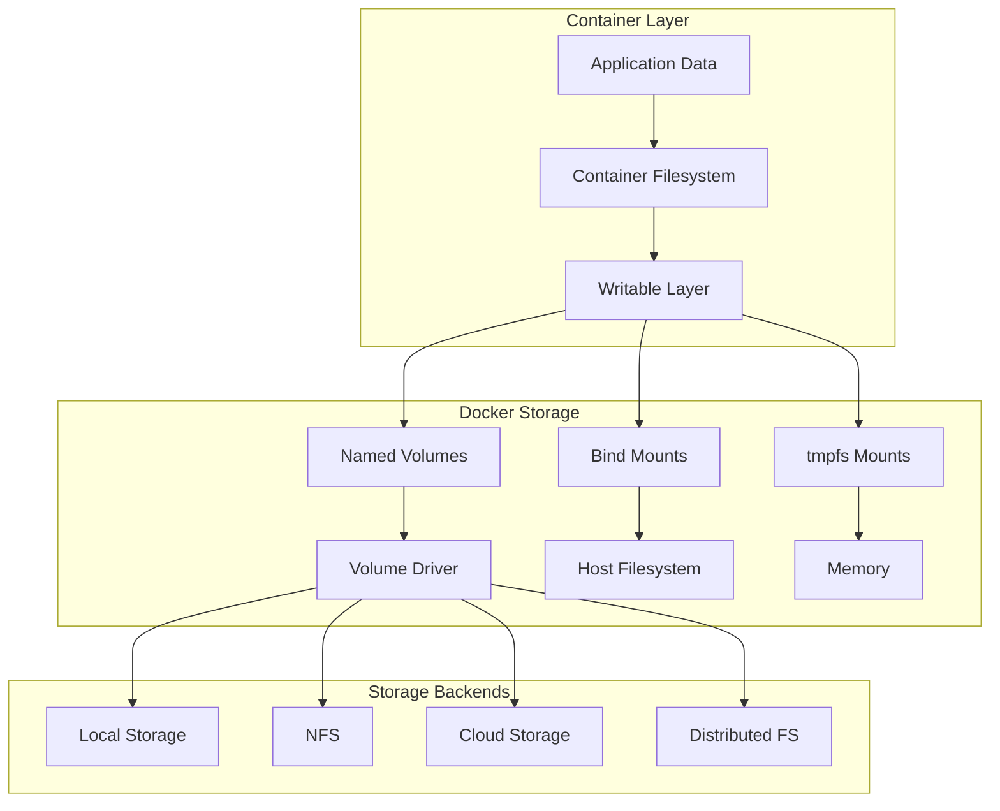

# Session 5: 볼륨과 데이터 관리

## 📍 교과과정에서의 위치
이 세션은 **Week 2 > Day 3 > Session 5**로, 네트워킹 구성을 마친 후 컨테이너의 데이터 영속성과 볼륨 관리 방법을 학습합니다.

## 학습 목표 (5분)
- **Docker 볼륨 타입**과 **데이터 영속성** 전략 이해
- **볼륨 드라이버**와 **스토리지 백엔드** 활용
- **데이터 백업, 복원** 및 **마이그레이션** 실습

## 1. 이론: Docker 스토리지 아키텍처 (20분)

### 스토리지 계층 구조



### 볼륨 타입별 특징

```
Named Volumes (권장):
├── Docker가 관리하는 볼륨
├── /var/lib/docker/volumes/ 저장
├── 컨테이너 간 공유 가능
├── 백업 및 마이그레이션 용이
├── 볼륨 드라이버 지원
└── 성능 최적화

Bind Mounts:
├── 호스트 파일시스템 직접 마운트
├── 절대 경로 필요
├── 개발 환경에서 주로 사용
├── 호스트 파일 직접 수정 가능
├── 보안 위험 존재
└── 플랫폼 종속적

tmpfs Mounts:
├── 메모리에 임시 저장
├── 컨테이너 종료 시 데이터 삭제
├── 빠른 I/O 성능
├── 민감한 데이터 처리
├── 캐시 용도
└── 메모리 사용량 주의
```

### 데이터 영속성 전략

```
데이터 분류별 전략:

Application Data (영구 보존):
├── Named Volume 사용
├── 정기적 백업
├── 복제 및 동기화
└── 버전 관리

Configuration Data:
├── Bind Mount 또는 ConfigMap
├── 버전 제어 시스템 연동
├── 환경별 분리
└── 보안 설정 적용

Cache Data (임시):
├── tmpfs Mount 사용
├── 메모리 기반 저장
├── 자동 정리
└── 성능 최적화

Log Data:
├── 로그 볼륨 분리
├── 로그 로테이션
├── 중앙 집중식 수집
└── 장기 보관 정책
```

## 2. 실습: Named Volume 관리 (15분)

### 볼륨 생성 및 관리

```bash
# 볼륨 생성
docker volume create app-data
docker volume create db-data
docker volume create logs

# 볼륨 목록 확인
docker volume ls

# 볼륨 상세 정보
docker volume inspect app-data

# 특정 드라이버로 볼륨 생성
docker volume create --driver local \
    --opt type=none \
    --opt o=bind \
    --opt device=/host/data \
    host-bind-volume
```

### 볼륨을 사용한 컨테이너 실행

```bash
# 웹 애플리케이션 데이터 볼륨
docker run -d --name web-app \
    -v app-data:/var/www/html \
    -p 8080:80 \
    nginx:alpine

# 데이터베이스 볼륨
docker run -d --name database \
    -v db-data:/var/lib/mysql \
    -e MYSQL_ROOT_PASSWORD=secret \
    -e MYSQL_DATABASE=testdb \
    mysql:8.0

# 로그 볼륨
docker run -d --name log-collector \
    -v logs:/var/log \
    alpine sh -c 'while true; do echo "$(date): Log entry" >> /var/log/app.log; sleep 5; done'

# 볼륨 사용 현황 확인
docker system df -v
```

### 볼륨 간 데이터 공유

```bash
# 데이터 생성 컨테이너
docker run --rm -v app-data:/data alpine sh -c '
    echo "Hello from container 1" > /data/file1.txt
    echo "Shared data" > /data/shared.txt
    ls -la /data
'

# 데이터 읽기 컨테이너
docker run --rm -v app-data:/data alpine sh -c '
    echo "Contents of shared volume:"
    cat /data/file1.txt
    cat /data/shared.txt
    echo "New file from container 2" > /data/file2.txt
'

# 웹 서버에서 데이터 확인
docker exec web-app ls -la /var/www/html/
docker exec web-app cat /var/www/html/file1.txt
```

## 3. 실습: Bind Mount 활용 (15분)

### 개발 환경 설정

```bash
# 개발용 프로젝트 디렉토리 생성
mkdir -p dev-project/{src,config,logs}

# 소스 코드 생성
cat > dev-project/src/index.html << 'EOF'
<!DOCTYPE html>
<html>
<head>
    <title>Development Server</title>
</head>
<body>
    <h1>Live Development Environment</h1>
    <p>This file is mounted from host filesystem</p>
    <p>Changes are reflected immediately</p>
</body>
</html>
EOF

# 설정 파일 생성
cat > dev-project/config/nginx.conf << 'EOF'
server {
    listen 80;
    server_name localhost;
    
    location / {
        root /usr/share/nginx/html;
        index index.html;
    }
    
    location /api {
        proxy_pass http://backend:3000;
    }
}
EOF

# Bind Mount로 개발 서버 실행
docker run -d --name dev-server \
    -v $(pwd)/dev-project/src:/usr/share/nginx/html \
    -v $(pwd)/dev-project/config/nginx.conf:/etc/nginx/conf.d/default.conf \
    -v $(pwd)/dev-project/logs:/var/log/nginx \
    -p 8081:80 \
    nginx:alpine

# 실시간 파일 변경 테스트
echo "Testing live reload..."
curl -s http://localhost:8081 | grep "Live Development"

# 파일 수정
sed -i 's/Live Development Environment/Updated Development Environment/' dev-project/src/index.html

# 변경 사항 즉시 반영 확인
curl -s http://localhost:8081 | grep "Updated Development"
```

### 호스트 파일 시스템 통합

```bash
# 호스트 디렉토리 구조
mkdir -p host-integration/{data,backup,scripts}

# 백업 스크립트 생성
cat > host-integration/scripts/backup.sh << 'EOF'
#!/bin/bash
echo "Starting backup at $(date)"
tar -czf /backup/data-$(date +%Y%m%d-%H%M%S).tar.gz /data/*
echo "Backup completed"
ls -la /backup/
EOF

chmod +x host-integration/scripts/backup.sh

# 데이터 생성
echo "Important data $(date)" > host-integration/data/important.txt
echo "Configuration data" > host-integration/data/config.json

# 백업 컨테이너 실행
docker run --rm \
    -v $(pwd)/host-integration/data:/data \
    -v $(pwd)/host-integration/backup:/backup \
    -v $(pwd)/host-integration/scripts:/scripts \
    alpine sh /scripts/backup.sh

# 백업 결과 확인
ls -la host-integration/backup/
```

### 권한 및 보안 관리

```bash
# 사용자 ID 매핑 테스트
echo "Current user: $(id)"

# 권한 문제 시뮬레이션
docker run --rm -v $(pwd)/host-integration/data:/data alpine sh -c '
    echo "Container user: $(id)"
    ls -la /data
    echo "New file from container" > /data/container-file.txt
'

# 호스트에서 파일 권한 확인
ls -la host-integration/data/

# 사용자 매핑으로 권한 문제 해결
docker run --rm \
    --user $(id -u):$(id -g) \
    -v $(pwd)/host-integration/data:/data \
    alpine sh -c '
    echo "Container user with mapping: $(id)"
    echo "Mapped user file" > /data/mapped-file.txt
'

ls -la host-integration/data/
```

## 4. 실습: tmpfs Mount 활용 (10분)

### 메모리 기반 스토리지

```bash
# tmpfs 마운트로 캐시 서버 실행
docker run -d --name cache-server \
    --tmpfs /cache:rw,size=100m,mode=1777 \
    alpine sh -c '
        while true; do
            echo "Cache entry $(date)" > /cache/entry-$(date +%s).txt
            ls /cache | wc -l
            sleep 2
        done
    '

# 메모리 사용량 모니터링
docker stats cache-server --no-stream

# tmpfs 마운트 정보 확인
docker exec cache-server df -h /cache
docker exec cache-server mount | grep tmpfs
```

### 임시 데이터 처리

```bash
# 민감한 데이터 처리 컨테이너
docker run -d --name secure-processor \
    --tmpfs /tmp/secure:rw,noexec,nosuid,size=50m \
    alpine sh -c '
        echo "Processing sensitive data..."
        echo "secret-key-12345" > /tmp/secure/secret.key
        echo "user-token-abcde" > /tmp/secure/token.txt
        
        echo "Files in secure tmpfs:"
        ls -la /tmp/secure/
        
        echo "Sleeping for 30 seconds..."
        sleep 30
        
        echo "Processing complete, data will be automatically cleaned"
    '

# 컨테이너 종료 후 데이터 확인 (데이터 없음)
sleep 35
docker logs secure-processor
```

### 고성능 임시 스토리지

```bash
# 고성능 작업용 tmpfs
docker run --rm --name performance-test \
    --tmpfs /workspace:rw,size=200m \
    alpine sh -c '
        echo "Performance test starting..."
        
        # 메모리 기반 I/O 테스트
        time dd if=/dev/zero of=/workspace/test1 bs=1M count=50
        time dd if=/workspace/test1 of=/dev/null bs=1M
        
        # 일반 디스크 I/O 테스트 (비교용)
        time dd if=/dev/zero of=/tmp/test2 bs=1M count=50
        time dd if=/tmp/test2 of=/dev/null bs=1M
        
        echo "Performance test completed"
    '
```

## 5. 실습: 데이터 백업 및 복원 (10분)

### 볼륨 백업 전략

```bash
# 백업용 볼륨 생성
docker volume create backup-storage

# 데이터 볼륨 백업 스크립트
cat > volume-backup.sh << 'EOF'
#!/bin/bash

VOLUME_NAME=$1
BACKUP_NAME=$2

if [ -z "$VOLUME_NAME" ] || [ -z "$BACKUP_NAME" ]; then
    echo "Usage: $0 <volume_name> <backup_name>"
    exit 1
fi

echo "Backing up volume: $VOLUME_NAME"

# 볼륨 백업
docker run --rm \
    -v $VOLUME_NAME:/source:ro \
    -v backup-storage:/backup \
    alpine tar -czf /backup/$BACKUP_NAME.tar.gz -C /source .

echo "Backup completed: $BACKUP_NAME.tar.gz"

# 백업 파일 목록
docker run --rm -v backup-storage:/backup alpine ls -la /backup/
EOF

chmod +x volume-backup.sh

# 볼륨 백업 실행
./volume-backup.sh app-data app-backup-$(date +%Y%m%d)
./volume-backup.sh db-data db-backup-$(date +%Y%m%d)
```

### 볼륨 복원 및 마이그레이션

```bash
# 복원용 스크립트
cat > volume-restore.sh << 'EOF'
#!/bin/bash

BACKUP_NAME=$1
TARGET_VOLUME=$2

if [ -z "$BACKUP_NAME" ] || [ -z "$TARGET_VOLUME" ]; then
    echo "Usage: $0 <backup_name> <target_volume>"
    exit 1
fi

echo "Restoring backup: $BACKUP_NAME to volume: $TARGET_VOLUME"

# 타겟 볼륨이 없으면 생성
docker volume create $TARGET_VOLUME

# 백업 복원
docker run --rm \
    -v backup-storage:/backup:ro \
    -v $TARGET_VOLUME:/target \
    alpine sh -c "cd /target && tar -xzf /backup/$BACKUP_NAME.tar.gz"

echo "Restore completed"

# 복원된 데이터 확인
docker run --rm -v $TARGET_VOLUME:/data alpine ls -la /data/
EOF

chmod +x volume-restore.sh

# 새 볼륨으로 복원 테스트
./volume-restore.sh app-backup-$(date +%Y%m%d) restored-app-data

# 복원된 데이터로 컨테이너 실행
docker run --rm -v restored-app-data:/data alpine cat /data/file1.txt
```

### 볼륨 마이그레이션

```bash
# 볼륨 간 데이터 마이그레이션
migrate_volume() {
    local source_volume=$1
    local target_volume=$2
    
    echo "Migrating $source_volume to $target_volume"
    
    # 타겟 볼륨 생성
    docker volume create $target_volume
    
    # 데이터 복사
    docker run --rm \
        -v $source_volume:/source:ro \
        -v $target_volume:/target \
        alpine sh -c 'cp -a /source/. /target/'
    
    echo "Migration completed"
}

# 마이그레이션 실행
migrate_volume app-data migrated-app-data

# 마이그레이션 검증
echo "Original volume:"
docker run --rm -v app-data:/data alpine ls -la /data/

echo "Migrated volume:"
docker run --rm -v migrated-app-data:/data alpine ls -la /data/
```

## 6. 실습: 고급 볼륨 관리 (10분)

### 볼륨 드라이버 활용

```bash
# NFS 볼륨 시뮬레이션 (로컬 환경)
docker volume create --driver local \
    --opt type=nfs \
    --opt o=addr=localhost,rw \
    --opt device=:/tmp/nfs-share \
    nfs-volume || echo "NFS not available, using local"

# 볼륨 라벨링
docker volume create --label environment=production \
    --label backup=daily \
    prod-data

docker volume create --label environment=development \
    --label backup=none \
    dev-data

# 라벨로 볼륨 필터링
docker volume ls --filter label=environment=production
docker volume ls --filter label=backup=daily
```

### 볼륨 모니터링

```bash
# 볼륨 사용량 모니터링 스크립트
cat > volume-monitor.sh << 'EOF'
#!/bin/bash

echo "=== Docker Volume Usage Report ==="
echo "Generated at: $(date)"
echo ""

# 전체 볼륨 목록
echo "All Volumes:"
docker volume ls --format "table {{.Name}}\t{{.Driver}}\t{{.Labels}}"

echo ""
echo "Volume Usage Details:"

# 각 볼륨의 사용량 확인
for volume in $(docker volume ls -q); do
    echo "Volume: $volume"
    
    # 볼륨 크기 확인
    size=$(docker run --rm -v $volume:/data alpine du -sh /data 2>/dev/null | cut -f1)
    echo "  Size: ${size:-Unknown}"
    
    # 볼륨을 사용하는 컨테이너 확인
    containers=$(docker ps -a --filter volume=$volume --format "{{.Names}}" | tr '\n' ' ')
    echo "  Used by: ${containers:-None}"
    
    echo ""
done

# 사용되지 않는 볼륨
echo "Unused Volumes:"
docker volume ls --filter dangling=true
EOF

chmod +x volume-monitor.sh
./volume-monitor.sh
```

### 볼륨 정리 및 최적화

```bash
# 볼륨 정리 스크립트
cat > volume-cleanup.sh << 'EOF'
#!/bin/bash

echo "=== Volume Cleanup Process ==="

# 사용되지 않는 볼륨 확인
echo "Dangling volumes:"
docker volume ls --filter dangling=true

# 개발 환경 볼륨 정리 (라벨 기반)
echo ""
echo "Development volumes to clean:"
docker volume ls --filter label=environment=development

# 안전한 정리 (확인 후 실행)
read -p "Remove dangling volumes? (y/N): " confirm
if [ "$confirm" = "y" ]; then
    docker volume prune -f
    echo "Dangling volumes removed"
fi

# 볼륨 백업 상태 확인
echo ""
echo "Backup status check:"
for volume in $(docker volume ls -q); do
    backup_label=$(docker volume inspect $volume --format '{{index .Labels "backup"}}' 2>/dev/null)
    if [ "$backup_label" = "daily" ]; then
        echo "  $volume: Requires daily backup"
    elif [ "$backup_label" = "weekly" ]; then
        echo "  $volume: Requires weekly backup"
    else
        echo "  $volume: No backup policy"
    fi
done
EOF

chmod +x volume-cleanup.sh
./volume-cleanup.sh
```

## 7. Q&A 및 정리 (5분)

### 볼륨 관리 체크리스트

```bash
# 최종 볼륨 상태 확인
echo "=== Final Volume Management Summary ==="

# 생성된 모든 볼륨
echo "Created Volumes:"
docker volume ls --format "table {{.Name}}\t{{.Driver}}\t{{.Scope}}"

# 볼륨별 사용 현황
echo ""
echo "Volume Usage:"
docker system df -v | grep -A 20 "Local Volumes"

# 실행 중인 컨테이너의 볼륨 마운트
echo ""
echo "Active Volume Mounts:"
for container in $(docker ps --format "{{.Names}}"); do
    echo "Container: $container"
    docker inspect $container --format '{{range .Mounts}}  {{.Type}}: {{.Source}} -> {{.Destination}}{{end}}' | grep -v '^$'
done

# 정리
echo ""
echo "Cleaning up test resources..."
docker stop $(docker ps -q) 2>/dev/null || true
docker rm $(docker ps -aq) 2>/dev/null || true
# 볼륨은 데이터 보존을 위해 유지
echo "✓ Containers cleaned up (volumes preserved)"
```

## 💡 핵심 키워드
- **볼륨 타입**: Named Volume, Bind Mount, tmpfs
- **데이터 영속성**: 백업, 복원, 마이그레이션
- **볼륨 드라이버**: local, NFS, 클라우드 스토리지
- **스토리지 관리**: 모니터링, 정리, 최적화

## 📚 참고 자료
- [Docker 볼륨 관리](https://docs.docker.com/storage/volumes/)
- [Bind Mount](https://docs.docker.com/storage/bind-mounts/)
- [tmpfs Mount](https://docs.docker.com/storage/tmpfs/)

## 🔧 실습 체크리스트
- [ ] Named Volume 생성 및 관리
- [ ] Bind Mount 개발 환경 구성
- [ ] tmpfs Mount 고성능 스토리지
- [ ] 볼륨 백업 및 복원 전략
- [ ] 볼륨 모니터링 및 최적화
