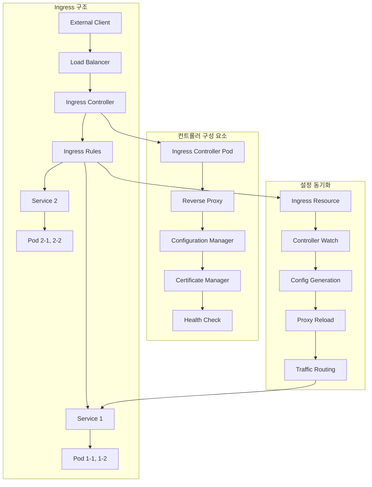
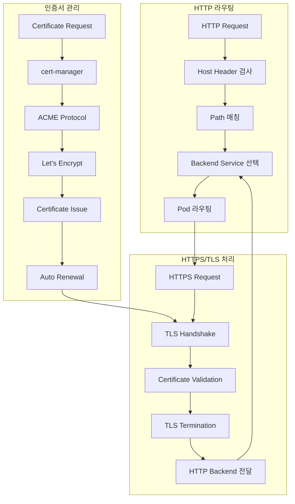
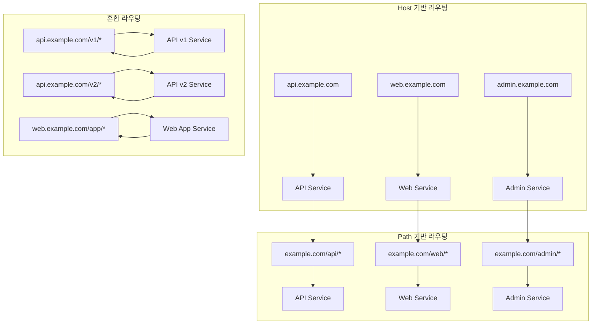
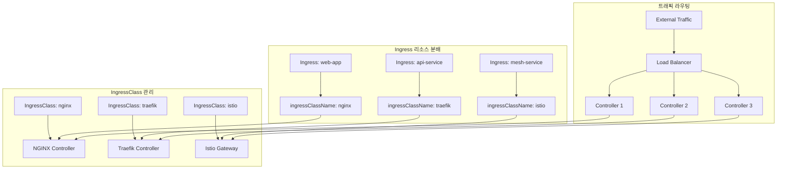

# Session 5: Ingress 아키텍처

## 📍 교과과정에서의 위치
이 세션은 **Week 2 > Day 3 > Session 5**로, HTTP/HTTPS 트래픽의 외부 접근을 담당하는 Ingress 아키텍처를 학습합니다. Session 3-4에서 학습한 Service와 kube-proxy를 바탕으로 L7 라우팅이 어떻게 구현되는지 이해합니다.

## 학습 목표 (5분)
- **Ingress 컨트롤러** 개념과 **구현체** 비교 완전 이해
- **HTTP/HTTPS** 라우팅과 **TLS 종료** 메커니즘 학습
- **Path 기반**과 **Host 기반** 라우팅 원리 파악
- **Ingress 클래스**와 **다중 컨트롤러** 관리 방안 이해

## 1. Ingress 컨트롤러 개념과 구현체 비교 (15분)

### Ingress 아키텍처 개요



### Ingress 컨트롤러 상세 분석
```
Ingress 컨트롤러 기본 개념:

Ingress vs Service 비교:
   🔹 Service (L4 로드 밸런싱):
      • IP/포트 기반 라우팅
      • TCP/UDP 프로토콜 지원
      • 단순한 로드 밸런싱
      • 클러스터 내부 추상화
      • kube-proxy 구현
   🔹 Ingress (L7 로드 밸런싱):
      • HTTP/HTTPS 기반 라우팅
      • 호스트명, 경로 기반 분기
      • TLS 종료 및 인증서 관리
      • 외부 트래픽 진입점
      • 컨트롤러 구현 필요

주요 구현체 비교:
   🔹 NGINX Ingress Controller:
      • 특징:
         • 가장 널리 사용되는 구현체
         • NGINX 기반 고성능 프록시
         • 풍부한 어노테이션 지원
         • 커뮤니티와 상용 버전 존재
         • 안정성과 성능 검증
      • 장점:
         • 높은 성능과 안정성
         • 광범위한 기능 지원
         • 활발한 커뮤니티
         • 상세한 문서화
         • 다양한 플러그인
      • 단점:
      • 설정 복잡성
      • 리소스 사용량 상대적 높음
      • 동적 설정 변경 시 재로드
      • 일부 고급 기능 상용 버전 제한

   🔹 Traefik:
      • 특징:
         • 클라우드 네이티브 설계
         • 자동 서비스 디스커버리
         • 동적 설정 업데이트
         • 내장 대시보드 및 모니터링
         • 마이크로서비스 친화적
      • 장점:
         • 설정 및 관리 단순성
         • 자동 인증서 관리 (Let's Encrypt)
         • 실시간 설정 업데이트
         • 내장 모니터링 도구
         • 경량화된 구조
      • 단점:
      • 상대적으로 새로운 기술
      • 대규모 환경 검증 부족
      • 일부 고급 기능 제한
      • 커뮤니티 규모 상대적 작음

   🔹 HAProxy Ingress:
      • 특징:
         • HAProxy 기반 고성능
         • 엔터프라이즈급 로드 밸런싱
         • 세밀한 트래픽 제어
         • 고급 헬스 체크
         • 통계 및 모니터링
      • 장점:
         • 최고 수준의 성능
         • 정교한 로드 밸런싱
         • 엔터프라이즈 기능
         • 안정성 검증
         • 세밀한 설정 가능
      • 단점:
      • 설정 복잡성 높음
      • 학습 곡선 가파름
      • 커뮤니티 상대적 작음
      • 문서화 부족

   🔹 Istio Gateway:
      • 특징:
         • 서비스 메시 통합
         • Envoy 프록시 기반
         • 고급 트래픽 관리
         • 보안 정책 통합
         • 관찰 가능성 내장
      • 장점:
         • 서비스 메시 완전 통합
         • 고급 트래픽 정책
         • 강력한 보안 기능
         • 상세한 텔레메트리
         • 마이크로서비스 최적화
      • 단점:
      • 높은 복잡성
      • 리소스 오버헤드 큼
      • 학습 곡선 매우 가파름
      • 서비스 메시 의존성

선택 기준:
   🔹 단순한 웹 애플리케이션: Traefik
   🔹 고성능 요구사항: NGINX, HAProxy
   🔹 엔터프라이즈 환경: NGINX (상용), HAProxy
   🔹 마이크로서비스 아키텍처: Istio Gateway
   🔹 클라우드 네이티브: Traefik, NGINX
   🔹 기존 인프라 통합: 기존 사용 중인 프록시 기반
```

## 2. HTTP/HTTPS 라우팅과 TLS 종료 (12분)

### HTTP/HTTPS 라우팅 메커니즘



### 라우팅 및 TLS 상세 분석
```
HTTP/HTTPS 라우팅 메커니즘:

HTTP 라우팅 규칙:
   🔹 Host 기반 라우팅:
      • HTTP Host 헤더 기반 분기
      • 도메인별 서비스 분리
      • 멀티 테넌트 지원
      • 가상 호스트 구현
      • 예: api.example.com → api-service
   🔹 Path 기반 라우팅:
      • URL 경로 기반 분기
      • 마이크로서비스별 경로 분할
      • API 버전 관리
      • 기능별 서비스 분리
      • 예: /api/v1/* → api-v1-service
   🔹 조합 라우팅:
      • Host + Path 조합 매칭
      • 복잡한 라우팅 규칙
      • 세밀한 트래픽 제어
      • 우선순위 기반 매칭

라우팅 우선순위:
   🔹 정확한 매칭 > 와일드카드 매칭
   🔹 긴 경로 > 짧은 경로
   🔹 명시적 호스트 > 와일드카드 호스트
   🔹 먼저 정의된 규칙 우선
   🔹 기본 백엔드 (fallback)

TLS/SSL 처리:
   🔹 TLS 종료 (TLS Termination):
      • Ingress 컨트롤러에서 TLS 해독
      • 백엔드는 HTTP 통신
      • 성능 최적화 (SSL 오프로딩)
      • 중앙화된 인증서 관리
      • 백엔드 단순화
   🔹 TLS 패스스루 (TLS Passthrough):
      • TLS 트래픽을 백엔드로 직접 전달
      • 백엔드에서 TLS 처리
      • 종단간 암호화 보장
      • 인증서 분산 관리
      • 성능 오버헤드 증가
   🔹 상호 TLS (mTLS):
      • 클라이언트 인증서 검증
      • 양방향 인증 구현
      • 높은 보안 수준
      • 복잡한 인증서 관리
      • 서비스 메시 통합

인증서 관리:
   🔹 수동 인증서 관리:
      • Secret 리소스에 인증서 저장
      • 수동 갱신 및 배포
      • 운영 부담 증가
      • 만료 위험 존재
   🔹 cert-manager 자동화:
      • 자동 인증서 발급 및 갱신
      • Let's Encrypt 통합
      • 다양한 CA 지원
      • Kubernetes 네이티브
      • 운영 부담 최소화
   🔹 클라우드 인증서 서비스:
      • AWS Certificate Manager
      • Google Cloud SSL Certificates
      • Azure Key Vault
      • 클라우드 통합 최적화
      • 관리형 서비스 활용

보안 고려사항:
   🔹 TLS 버전 및 암호화 스위트:
      • TLS 1.2 이상 사용
      • 안전한 암호화 알고리즘
      • Perfect Forward Secrecy
      • 취약한 프로토콜 비활성화
   🔹 HSTS (HTTP Strict Transport Security):
      • HTTPS 강제 사용
      • 프로토콜 다운그레이드 방지
      • 중간자 공격 방어
      • 브라우저 보안 강화
   🔹 보안 헤더:
      • X-Frame-Options
      • X-Content-Type-Options
      • X-XSS-Protection
      • Content-Security-Policy
      • 웹 애플리케이션 보안 강화
```

## 3. Path 기반과 Host 기반 라우팅 (10분)

### 라우팅 패턴 비교



### 라우팅 패턴 상세 분석
```
라우팅 패턴 설계:

Host 기반 라우팅:
   🔹 장점:
      • 명확한 서비스 분리
      • 독립적인 도메인 관리
      • 브랜딩 및 마케팅 유리
      • SSL 인증서 개별 관리
      • 캐싱 전략 최적화
      • SEO 친화적
   🔹 단점:
      • 도메인 비용 증가
      • DNS 관리 복잡성
      • 인증서 관리 부담
      • 서브도메인 제한
      • 크로스 도메인 이슈
   🔹 적용 사례:
      • 마이크로서비스 아키텍처
      • 멀티 테넌트 애플리케이션
      • API와 웹 서비스 분리
      • 환경별 서비스 (dev, staging, prod)
      • 지역별 서비스 분산

Path 기반 라우팅:
   🔹 장점:
      • 단일 도메인 사용
      • 인증서 관리 단순화
      • DNS 설정 최소화
      • 비용 효율성
      • 통합된 사용자 경험
      • 세션 관리 용이
   🔹 단점:
      • 경로 충돌 가능성
      • 서비스 간 의존성 증가
      • 캐싱 전략 복잡화
      • 라우팅 규칙 복잡성
      • 서비스 독립성 제한
   🔹 적용 사례:
      • 모놀리식 애플리케이션 분해
      • API 버전 관리
      • 기능별 서비스 분리
      • 레거시 시스템 통합
      • 단일 진입점 구현

혼합 라우팅 전략:
   🔹 계층적 라우팅:
      • 도메인 → 서비스 그룹
      • 경로 → 세부 기능
      • 유연한 확장성
      • 명확한 구조화
   🔹 환경별 분리:
      • dev.api.example.com
      • staging.api.example.com
      • api.example.com (production)
      • 환경 격리 및 관리
   🔹 버전 관리:
      • api.example.com/v1/
      • api.example.com/v2/
      • 하위 호환성 유지
      • 점진적 마이그레이션

라우팅 규칙 최적화:
   🔹 매칭 순서 최적화:
      • 구체적 규칙 우선 배치
      • 자주 사용되는 경로 우선
      • 와일드카드 규칙 후순위
      • 기본 백엔드 마지막 배치
   🔹 정규식 사용 최소화:
      • 성능 오버헤드 고려
      • 단순한 문자열 매칭 우선
      • 필요시에만 정규식 활용
      • 캐싱 가능한 패턴 선호
   🔹 라우팅 테이블 관리:
      • 규칙 수 최소화
      • 중복 규칙 제거
      • 주기적 정리 및 최적화
      • 성능 모니터링

실무 설계 가이드라인:
   🔹 서비스 특성 고려:
      • 독립성 요구사항
      • 확장성 계획
      • 보안 요구사항
      • 운영 복잡성
   🔹 조직 구조 반영:
      • 팀별 서비스 소유권
      • 개발 및 배포 프로세스
      • 운영 책임 분담
      • 의사소통 패턴
   🔹 기술적 제약사항:
      • 기존 인프라 호환성
      • 성능 요구사항
      • 보안 정책
      • 예산 및 리소스
```

## 4. Ingress 클래스와 다중 컨트롤러 관리 (10분)

### 다중 컨트롤러 아키텍처



### 다중 컨트롤러 관리 전략
```
IngressClass와 다중 컨트롤러:

IngressClass 개념:
   🔹 Kubernetes 1.18+ 표준:
      • Ingress 리소스와 컨트롤러 연결
      • 명시적 컨트롤러 선택
      • 다중 컨트롤러 환경 지원
      • 네임스페이스 독립적 리소스
      • 컨트롤러별 설정 분리
   🔹 기존 어노테이션 방식:
      • kubernetes.io/ingress.class
      • 하위 호환성 유지
      • 점진적 마이그레이션 지원
      • 레거시 시스템 호환

다중 컨트롤러 사용 사례:
   🔹 기능별 분리:
      • 외부 트래픽: NGINX
      • 내부 API: Traefik
      • 서비스 메시: Istio
      • 특수 요구사항별 최적화
   🔹 환경별 분리:
      • 개발: 단순한 컨트롤러
      • 스테이징: 프로덕션과 동일
      • 프로덕션: 고성능 컨트롤러
      • 환경별 최적화
   🔹 팀별 분리:
      • 플랫폼 팀: 공통 인프라
      • 애플리케이션 팀: 전용 컨트롤러
      • 보안 팀: 보안 특화 컨트롤러
      • 책임 분담 및 격리
   🔹 성능별 분리:
      • 고성능 요구: HAProxy
      • 일반 웹: NGINX
      • 마이크로서비스: Traefik
      • 워크로드별 최적화

관리 전략:
   🔹 기본 컨트롤러 설정:
      • 클러스터 기본 IngressClass 지정
      • 명시적 클래스 없는 Ingress 처리
      • 일관된 기본 동작 보장
      • 신규 사용자 편의성
   🔹 네임스페이스 정책:
      • 네임스페이스별 허용 컨트롤러 제한
      • RBAC을 통한 접근 제어
      • 정책 기반 자동 할당
      • 보안 및 거버넌스 강화
   🔹 리소스 격리:
      • 컨트롤러별 전용 노드
      • 리소스 할당량 설정
      • 네트워크 분리
      • 성능 간섭 방지

운영 고려사항:
   🔹 모니터링 및 로깅:
      • 컨트롤러별 메트릭 수집
      • 통합 로그 관리
      • 성능 비교 분석
      • 장애 격리 및 추적
      • 용량 계획 데이터
   🔹 업그레이드 전략:
      • 컨트롤러별 독립 업그레이드
      • 카나리 배포 적용
      • 롤백 계획 수립
      • 호환성 검증
      • 다운타임 최소화
   🔹 설정 관리:
      • GitOps 기반 설정 관리
      • 컨트롤러별 설정 템플릿
      • 환경별 설정 분리
      • 변경 추적 및 승인
      • 자동화된 배포

마이그레이션 전략:
   🔹 단계적 전환:
      • 새로운 서비스부터 적용
      • 기존 서비스 점진적 이전
      • 트래픽 분할 테스트
      • 성능 및 안정성 검증
      • 완전 전환 후 정리
   🔹 호환성 유지:
      • 기존 어노테이션 지원
      • 자동 변환 도구 활용
      • 문서화 및 교육
      • 지원 기간 설정

모범 사례:
   🔹 명확한 역할 분담
   🔹 표준화된 설정 템플릿
   🔹 자동화된 배포 파이프라인
   🔹 종합적인 모니터링
   🔹 정기적인 성능 검토
   🔹 지속적인 최적화
```

## 💬 그룹 토론: Ingress 컨트롤러 선택과 고가용성 설계 (8분)

### 토론 주제
**"대규모 프로덕션 환경에서 Ingress 컨트롤러를 선택하고 고가용성을 보장하기 위한 설계 전략은 무엇인가?"**

## 💡 핵심 개념 정리
- Ingress 컨트롤러: L7 로드 밸런싱, HTTP/HTTPS 라우팅
- TLS 종료: 인증서 관리, 보안 최적화
- 라우팅 패턴: Host 기반, Path 기반, 혼합 전략
- IngressClass: 다중 컨트롤러 관리, 명시적 선택

## 📚 참고 자료
- [Ingress Controllers](https://kubernetes.io/docs/concepts/services-networking/ingress-controllers/)
- [Ingress](https://kubernetes.io/docs/concepts/services-networking/ingress/)
- [cert-manager](https://cert-manager.io/docs/)

## 다음 세션 준비
다음 세션에서는 **DNS와 서비스 디스커버리**에 대해 학습합니다.