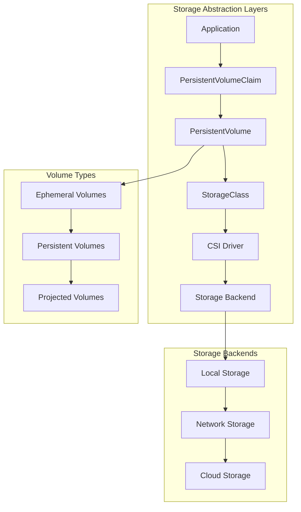
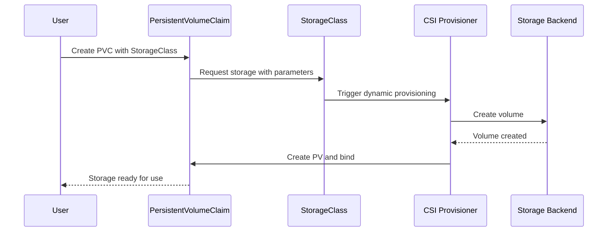

# Session 5: 스토리지 오케스트레이션 이론

## 📍 교과과정에서의 위치
이 세션은 **Week 2 > Day 3 > Session 5**로, 클러스터 네트워킹 이해를 바탕으로 Kubernetes의 스토리지 오케스트레이션 시스템과 데이터 영속성 관리 메커니즘을 심화 분석합니다.

## 학습 목표 (5분)
- **Kubernetes 스토리지 아키텍처** 및 **볼륨 추상화** 개념 이해
- **PV/PVC 모델**과 **동적 프로비저닝** 메커니즘 분석
- **상태 유지 애플리케이션** 관리와 **StatefulSet** 활용 전략

## 1. 이론: Kubernetes 스토리지 아키텍처 (20분)

### 스토리지 추상화 계층



### 볼륨 타입 및 특성

```
Kubernetes 볼륨 분류:

임시 볼륨 (Ephemeral Volumes):
├── emptyDir:
│   ├── Pod 생명주기와 동일
│   ├── 노드 로컬 스토리지 사용
│   ├── 메모리 기반 옵션 (tmpfs)
│   ├── 컨테이너 간 데이터 공유
│   ├── 임시 캐시 및 스크래치 공간
│   └── Pod 삭제 시 데이터 소멸
├── configMap/secret:
│   ├── 설정 및 시크릿 데이터 마운트
│   ├── 읽기 전용 볼륨
│   ├── 파일 또는 디렉토리 형태
│   ├── 동적 업데이트 지원
│   └── 메모리 기반 tmpfs 마운트
└── downwardAPI:
    ├── Pod/컨테이너 메타데이터 노출
    ├── 라벨, 어노테이션, 리소스 정보
    ├── 환경 변수 또는 파일 형태
    └── 런타임 정보 접근

영구 볼륨 (Persistent Volumes):
├── 클러스터 레벨 스토리지 리소스
├── Pod 생명주기와 독립적
├── 관리자 또는 동적 프로비저닝
├── 다양한 스토리지 백엔드 지원
├── 접근 모드 및 용량 정의
├── 재사용 정책 설정
└── 백업 및 스냅샷 지원

프로젝티드 볼륨 (Projected Volumes):
├── 여러 볼륨 소스를 단일 디렉토리로 투영
├── secret, configMap, downwardAPI, serviceAccountToken
├── 복잡한 설정 구성 단순화
├── 파일 권한 및 경로 제어
└── 원자적 업데이트 지원

호스트 경로 볼륨:
├── hostPath:
│   ├── 노드 파일시스템 직접 마운트
│   ├── 시스템 레벨 접근 필요 시
│   ├── 보안 위험 및 이식성 제한
│   ├── 노드별 데이터 접근
│   └── 시스템 모니터링 및 로깅
└── local:
    ├── 노드 로컬 스토리지 (SSD, NVMe)
    ├── 고성능 워크로드 최적화
    ├── 노드 어피니티 필수
    ├── 정적 프로비저닝만 지원
    └── 데이터베이스 및 캐시 시스템
```

### PersistentVolume과 PersistentVolumeClaim

```
PV/PVC 모델 상세:

PersistentVolume (PV):
├── 클러스터 관리자가 프로비저닝한 스토리지
├── 클러스터 레벨 리소스 (네임스페이스 무관)
├── 실제 스토리지 백엔드와 연결
├── 용량, 접근 모드, 스토리지 클래스 정의
├── 재사용 정책 (Retain, Delete, Recycle)
├── 마운트 옵션 및 노드 어피니티
└── 생명주기 관리 (Available, Bound, Released, Failed)

PersistentVolumeClaim (PVC):
├── 사용자의 스토리지 요청
├── 네임스페이스 범위 리소스
├── 용량, 접근 모드, 스토리지 클래스 요구사항
├── PV와 바인딩을 통한 스토리지 할당
├── Pod에서 볼륨으로 마운트
├── 동적 프로비저닝 트리거
└── 리소스 쿼터 적용 대상

접근 모드 (Access Modes):
├── ReadWriteOnce (RWO):
│   ├── 단일 노드에서 읽기/쓰기
│   ├── 블록 스토리지 일반적 모드
│   ├── 데이터베이스, 파일 시스템
│   └── 가장 널리 지원되는 모드
├── ReadOnlyMany (ROX):
│   ├── 다중 노드에서 읽기 전용
│   ├── 정적 콘텐츠, 설정 파일
│   ├── 공유 라이브러리, 참조 데이터
│   └── 네트워크 스토리지 주로 지원
├── ReadWriteMany (RWX):
│   ├── 다중 노드에서 읽기/쓰기
│   ├── 공유 파일시스템 필요
│   ├── 협업 워크로드, 로그 수집
│   └── 제한적 스토리지 백엔드 지원
└── ReadWriteOncePod (RWOP):
    ├── 단일 Pod에서만 읽기/쓰기
    ├── 더 강한 격리 보장
    ├── CSI 볼륨만 지원
    └── Kubernetes 1.22+ 지원

재사용 정책 (Reclaim Policy):
├── Retain:
│   ├── PVC 삭제 후 PV 유지
│   ├── 수동 데이터 복구 가능
│   ├── 관리자 개입 필요
│   └── 중요 데이터 보호
├── Delete:
│   ├── PVC 삭제 시 PV 및 스토리지 삭제
│   ├── 동적 프로비저닝 기본값
│   ├── 자동 정리 및 비용 절약
│   └── 클라우드 스토리지 최적화
└── Recycle (deprecated):
    ├── 기본 스크럽 후 재사용
    ├── 보안 위험으로 사용 중단
    └── Retain + Delete 조합 권장
```

## 2. 이론: 동적 프로비저닝 및 StorageClass (15분)

### StorageClass 아키텍처



### StorageClass 설계 및 구성

```
StorageClass 핵심 개념:

동적 프로비저닝:
├── 사용자 요청 시 자동 스토리지 생성
├── PVC 생성 시 적절한 PV 자동 생성
├── 스토리지 관리 자동화
├── 리소스 효율성 및 비용 최적화
├── 표준화된 스토리지 정책
└── 셀프 서비스 스토리지 제공

StorageClass 구성 요소:
├── Provisioner:
│   ├── 스토리지 생성 담당 컴포넌트
│   ├── CSI 드라이버 또는 내장 프로비저너
│   ├── 클라우드 제공업체별 구현
│   ├── 커스텀 프로비저너 지원
│   └── 플러그인 아키텍처
├── Parameters:
│   ├── 스토리지 백엔드별 설정
│   ├── 성능 티어, 복제 수준
│   ├── 암호화, 압축 옵션
│   ├── 지역, 가용성 영역
│   └── 백업 정책, 스냅샷 설정
├── ReclaimPolicy:
│   ├── 동적 생성 PV의 재사용 정책
│   ├── Delete (기본값)
│   ├── Retain (데이터 보존)
│   └── 정책별 비용 및 보안 고려
├── VolumeBindingMode:
│   ├── Immediate: 즉시 바인딩
│   ├── WaitForFirstConsumer: Pod 스케줄링 후 바인딩
│   ├── 토폴로지 인식 스케줄링
│   └── 지연 바인딩을 통한 최적화
└── AllowVolumeExpansion:
    ├── 볼륨 크기 확장 허용 여부
    ├── 온라인 확장 지원
    ├── 파일시스템 자동 확장
    └── 다운타임 없는 용량 증설

주요 스토리지 프로비저너:

클라우드 네이티브:
├── AWS EBS CSI Driver:
│   ├── gp3, io2, st1 볼륨 타입
│   ├── 암호화, 스냅샷 지원
│   ├── 토폴로지 인식 스케줄링
│   └── 성능 최적화 옵션
├── Azure Disk CSI Driver:
│   ├── Premium SSD, Standard HDD
│   ├── Ultra Disk 고성능 옵션
│   ├── 가용성 영역 지원
│   └── 디스크 암호화 통합
├── Google Persistent Disk CSI:
│   ├── SSD, HDD 성능 옵션
│   ├── 지역 영구 디스크
│   ├── 스냅샷 및 복제
│   └── 자동 크기 조정
└── 멀티 클라우드 솔루션:
    ├── Portworx
    ├── StorageOS
    ├── Robin Storage
    └── 하이브리드 클라우드 지원

온프레미스 솔루션:
├── Ceph RBD/CephFS:
│   ├── 분산 스토리지 시스템
│   ├── 블록, 파일, 오브젝트 스토리지
│   ├── 자가 치유 및 확장성
│   └── 오픈소스 솔루션
├── OpenEBS:
│   ├── 컨테이너 네이티브 스토리지
│   ├── 로컬 및 복제 스토리지
│   ├── 스냅샷 및 백업
│   └── Kubernetes 네이티브
└── Longhorn:
    ├── 클라우드 네이티브 분산 스토리지
    ├── 마이크로서비스 기반 아키텍처
    ├── 웹 UI 관리 인터페이스
    └── 재해 복구 지원
```

## 3. 이론: StatefulSet과 상태 유지 애플리케이션 (10분)

### StatefulSet 아키텍처

```
StatefulSet 핵심 개념:

상태 유지 워크로드 특성:
├── 안정적인 네트워크 식별자
├── 안정적인 영구 스토리지
├── 순서가 있는 배포 및 스케일링
├── 순서가 있는 롤링 업데이트
├── 개별 Pod 식별 및 관리
└── 데이터 일관성 및 순서 보장

StatefulSet vs Deployment:
├── Pod 이름: 순차적 인덱스 (web-0, web-1, web-2)
├── 네트워크 ID: 안정적인 DNS 이름
├── 스토리지: Pod별 전용 PVC
├── 배포 순서: 순차적 생성/삭제
├── 업데이트: 순서 기반 롤링 업데이트
└── 스케일링: 순차적 확장/축소

Headless Service 연동:
├── 클러스터 IP 없는 서비스
├── 개별 Pod DNS 이름 제공
├── <pod-name>.<service-name>.<namespace>.svc.cluster.local
├── 직접 Pod 접근 가능
├── 로드 밸런싱 없이 서비스 디스커버리
└── 데이터베이스 클러스터링 지원

볼륨 클레임 템플릿:
├── Pod별 전용 PVC 자동 생성
├── 스토리지 요구사항 템플릿 정의
├── Pod 삭제 시 PVC 유지 (기본)
├── 데이터 영속성 보장
├── 개별 Pod 스토리지 관리
└── 백업 및 복구 단위

상태 유지 애플리케이션 패턴:
├── 데이터베이스 (MySQL, PostgreSQL, MongoDB)
├── 메시지 큐 (Kafka, RabbitMQ)
├── 분산 시스템 (Elasticsearch, Cassandra)
├── 캐시 시스템 (Redis Cluster)
├── 모니터링 시스템 (Prometheus)
└── 빅데이터 플랫폼 (Hadoop, Spark)
```

## 4. 개념 예시: 스토리지 구성 분석 (12분)

### StorageClass 및 PVC 구성 예시

```yaml
# 클라우드 스토리지 클래스 (개념 예시)
apiVersion: storage.k8s.io/v1
kind: StorageClass
metadata:
  name: fast-ssd
provisioner: ebs.csi.aws.com
parameters:
  type: gp3
  iops: "3000"
  throughput: "125"
  encrypted: "true"
reclaimPolicy: Delete
allowVolumeExpansion: true
volumeBindingMode: WaitForFirstConsumer

---
# 고성능 스토리지 클래스
apiVersion: storage.k8s.io/v1
kind: StorageClass
metadata:
  name: ultra-performance
provisioner: disk.csi.azure.com
parameters:
  skuName: UltraSSD_LRS
  diskIOPSReadWrite: "10000"
  diskMBpsReadWrite: "200"
reclaimPolicy: Retain
allowVolumeExpansion: true

---
# PVC 요청 예시
apiVersion: v1
kind: PersistentVolumeClaim
metadata:
  name: database-storage
spec:
  accessModes:
    - ReadWriteOnce
  storageClassName: fast-ssd
  resources:
    requests:
      storage: 100Gi
```

### StatefulSet 구성 예시

```yaml
# MySQL StatefulSet (개념 예시)
apiVersion: apps/v1
kind: StatefulSet
metadata:
  name: mysql
spec:
  serviceName: mysql-headless
  replicas: 3
  selector:
    matchLabels:
      app: mysql
  template:
    metadata:
      labels:
        app: mysql
    spec:
      containers:
      - name: mysql
        image: mysql:8.0
        env:
        - name: MYSQL_ROOT_PASSWORD
          valueFrom:
            secretKeyRef:
              name: mysql-secret
              key: root-password
        ports:
        - containerPort: 3306
        volumeMounts:
        - name: mysql-data
          mountPath: /var/lib/mysql
        - name: mysql-config
          mountPath: /etc/mysql/conf.d
      volumes:
      - name: mysql-config
        configMap:
          name: mysql-config
  volumeClaimTemplates:
  - metadata:
      name: mysql-data
    spec:
      accessModes: ["ReadWriteOnce"]
      storageClassName: fast-ssd
      resources:
        requests:
          storage: 50Gi

---
# Headless Service
apiVersion: v1
kind: Service
metadata:
  name: mysql-headless
spec:
  clusterIP: None
  selector:
    app: mysql
  ports:
  - port: 3306
    targetPort: 3306
```

### 스토리지 모니터링 예시

```bash
# 스토리지 리소스 확인 (개념 예시)

# PV 상태 확인
kubectl get pv -o wide

# PVC 상태 및 바인딩 확인
kubectl get pvc -A

# StorageClass 목록 확인
kubectl get storageclass

# 볼륨 사용량 확인
kubectl exec -it mysql-0 -- df -h /var/lib/mysql

# StatefulSet 상태 확인
kubectl get statefulset mysql -o wide

# Pod별 PVC 매핑 확인
kubectl describe statefulset mysql

# 스토리지 이벤트 확인
kubectl get events --field-selector involvedObject.kind=PersistentVolumeClaim
```

### CSI 드라이버 구성 예시

```yaml
# CSI 드라이버 배포 (개념 예시)
apiVersion: storage.k8s.io/v1
kind: CSIDriver
metadata:
  name: ebs.csi.aws.com
spec:
  attachRequired: true
  podInfoOnMount: false
  volumeLifecycleModes:
  - Persistent
  - Ephemeral

---
# CSI 노드 정보
apiVersion: storage.k8s.io/v1
kind: CSINode
metadata:
  name: ip-192-168-1-100.ec2.internal
spec:
  drivers:
  - name: ebs.csi.aws.com
    nodeID: i-1234567890abcdef0
    topologyKeys:
    - topology.ebs.csi.aws.com/zone
```

## 5. 토론 및 정리 (8분)

### 핵심 개념 정리
- **Kubernetes 스토리지 추상화**를 통한 다양한 백엔드 통합
- **PV/PVC 모델**과 **동적 프로비저닝**을 통한 스토리지 자동화
- **StatefulSet**을 통한 상태 유지 애플리케이션 관리
- **CSI 표준**을 통한 스토리지 생태계 확장

### 토론 주제
"클라우드 네이티브 환경에서 데이터 영속성, 성능, 비용 효율성을 동시에 만족하는 스토리지 전략은 무엇인가?"

## 💡 핵심 키워드
- **스토리지 추상화**: PV/PVC, StorageClass, 동적 프로비저닝
- **상태 관리**: StatefulSet, Headless Service, 볼륨 템플릿
- **CSI 표준**: 드라이버, 프로비저너, 플러그인 아키텍처
- **데이터 영속성**: 접근 모드, 재사용 정책, 백업 전략

## 📚 참고 자료
- [Kubernetes 스토리지](https://kubernetes.io/docs/concepts/storage/)
- [StatefulSet 가이드](https://kubernetes.io/docs/concepts/workloads/controllers/statefulset/)
- [CSI 드라이버](https://kubernetes-csi.github.io/docs/)
