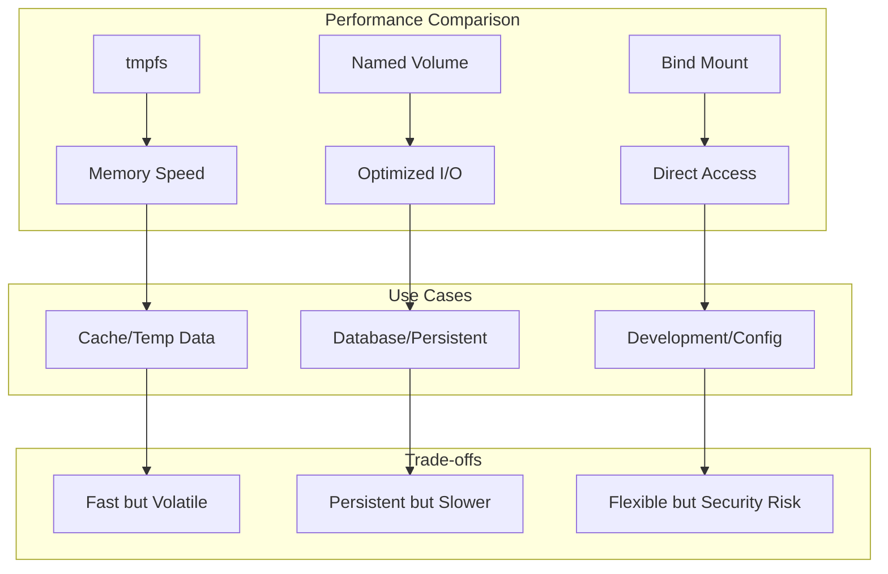

# Session 6: 바인드 마운트와 tmpfs

## 📍 교과과정에서의 위치
이 세션은 **Week 2 > Day 3 > Session 6**으로, Session 5의 볼륨 관리를 바탕으로 바인드 마운트와 tmpfs의 고급 활용법과 성능 최적화 기법을 학습합니다.

## 학습 목표 (5분)
- **바인드 마운트** 고급 활용 및 **개발 워크플로우** 최적화
- **tmpfs 마운트** 성능 튜닝 및 **메모리 관리** 전략
- **마운트 타입별** 최적 사용 시나리오 및 **보안 고려사항**

## 1. 이론: 마운트 타입별 심화 분석 (20분)

### 마운트 성능 비교



### 마운트 타입별 성능 특성

```
성능 벤치마크 (상대적):

tmpfs Mount:
├── 읽기 성능: ★★★★★ (메모리 속도)
├── 쓰기 성능: ★★★★★ (메모리 속도)
├── 지연시간: ★★★★★ (나노초 단위)
├── 처리량: ★★★★★ (GB/s 단위)
└── 영속성: ☆☆☆☆☆ (휘발성)

Named Volume:
├── 읽기 성능: ★★★★☆ (최적화된 I/O)
├── 쓰기 성능: ★★★★☆ (버퍼링)
├── 지연시간: ★★★☆☆ (밀리초 단위)
├── 처리량: ★★★☆☆ (MB/s 단위)
└── 영속성: ★★★★★ (영구 보존)

Bind Mount:
├── 읽기 성능: ★★★☆☆ (호스트 FS 의존)
├── 쓰기 성능: ★★★☆☆ (호스트 FS 의존)
├── 지연시간: ★★★☆☆ (호스트 FS 의존)
├── 처리량: ★★★☆☆ (호스트 FS 의존)
└── 영속성: ★★★★★ (호스트에 저장)
```

### 보안 및 격리 수준

```
보안 매트릭스:

tmpfs Mount:
├── 데이터 격리: ★★★★★ (메모리 격리)
├── 호스트 접근: ☆☆☆☆☆ (접근 불가)
├── 권한 상속: ☆☆☆☆☆ (독립적)
├── 데이터 유출: ★★★★★ (자동 삭제)
└── 추천 용도: 임시/민감 데이터

Named Volume:
├── 데이터 격리: ★★★★☆ (Docker 관리)
├── 호스트 접근: ★★☆☆☆ (제한적)
├── 권한 상속: ★★★☆☆ (Docker 제어)
├── 데이터 유출: ★★★☆☆ (관리 필요)
└── 추천 용도: 애플리케이션 데이터

Bind Mount:
├── 데이터 격리: ★★☆☆☆ (호스트 공유)
├── 호스트 접근: ★☆☆☆☆ (직접 접근)
├── 권한 상속: ★☆☆☆☆ (호스트 권한)
├── 데이터 유출: ★☆☆☆☆ (높은 위험)
└── 추천 용도: 개발/설정 파일
```

## 2. 실습: 바인드 마운트 고급 활용 (15분)

### 개발 환경 최적화

```bash
# 풀스택 개발 환경 구성
mkdir -p fullstack-dev/{frontend,backend,database,nginx}

# Frontend 프로젝트 구조
mkdir -p fullstack-dev/frontend/{src,public,build}
cat > fullstack-dev/frontend/src/App.js << 'EOF'
import React from 'react';

function App() {
  return (
    <div className="App">
      <h1>Live Development Environment</h1>
      <p>Changes reflect immediately!</p>
      <p>Timestamp: {new Date().toLocaleString()}</p>
    </div>
  );
}

export default App;
EOF

# Backend API
mkdir -p fullstack-dev/backend/{src,config}
cat > fullstack-dev/backend/src/server.js << 'EOF'
const express = require('express');
const app = express();
const port = 3000;

app.get('/api/health', (req, res) => {
  res.json({ 
    status: 'healthy', 
    timestamp: new Date().toISOString(),
    version: '1.0.0'
  });
});

app.get('/api/data', (req, res) => {
  res.json({ 
    message: 'Live reload working!',
    data: [1, 2, 3, 4, 5]
  });
});

app.listen(port, '0.0.0.0', () => {
  console.log(`Server running on port ${port}`);
});
EOF

# Nginx 설정
cat > fullstack-dev/nginx/nginx.conf << 'EOF'
events {
    worker_connections 1024;
}

http {
    upstream backend {
        server backend:3000;
    }
    
    server {
        listen 80;
        
        location / {
            root /usr/share/nginx/html;
            try_files $uri $uri/ /index.html;
        }
        
        location /api {
            proxy_pass http://backend;
            proxy_set_header Host $host;
            proxy_set_header X-Real-IP $remote_addr;
        }
    }
}
EOF

# 개발 환경 네트워크
docker network create dev-network

# Backend 서비스 (라이브 리로드)
docker run -d --name backend \
    --network dev-network \
    -v $(pwd)/fullstack-dev/backend/src:/app \
    -w /app \
    node:alpine sh -c 'npm init -y && npm install express && node server.js'

# Frontend 빌드 환경
docker run -d --name frontend-build \
    --network dev-network \
    -v $(pwd)/fullstack-dev/frontend:/app \
    -w /app \
    node:alpine sh -c 'while true; do echo "Frontend build process"; sleep 30; done'

# Nginx 프록시
docker run -d --name nginx-proxy \
    --network dev-network \
    -v $(pwd)/fullstack-dev/nginx/nginx.conf:/etc/nginx/nginx.conf \
    -v $(pwd)/fullstack-dev/frontend/build:/usr/share/nginx/html \
    -p 8080:80 \
    nginx:alpine

# 개발 환경 테스트
sleep 5
curl -s http://localhost:8080/api/health | jq
```

### 실시간 파일 동기화

```bash
# 파일 변경 감지 및 자동 재시작
cat > file-watcher.sh << 'EOF'
#!/bin/bash

WATCH_DIR="./fullstack-dev/backend/src"
CONTAINER_NAME="backend"

echo "Starting file watcher for $WATCH_DIR"

# inotify를 사용한 파일 변경 감지 (Linux)
if command -v inotifywait >/dev/null 2>&1; then
    while inotifywait -e modify,create,delete -r "$WATCH_DIR"; do
        echo "File change detected, restarting container..."
        docker restart $CONTAINER_NAME
        sleep 2
    done
else
    # 폴링 방식 (크로스 플랫폼)
    last_modified=$(find "$WATCH_DIR" -type f -exec stat -c %Y {} \; | sort -n | tail -1)
    
    while true; do
        current_modified=$(find "$WATCH_DIR" -type f -exec stat -c %Y {} \; | sort -n | tail -1)
        
        if [ "$current_modified" != "$last_modified" ]; then
            echo "File change detected, restarting container..."
            docker restart $CONTAINER_NAME
            last_modified=$current_modified
            sleep 2
        fi
        
        sleep 1
    done
fi
EOF

chmod +x file-watcher.sh

# 백그라운드에서 파일 감시 시작
./file-watcher.sh &
WATCHER_PID=$!

# 파일 변경 테스트
sleep 3
echo "// Updated at $(date)" >> fullstack-dev/backend/src/server.js

sleep 5
kill $WATCHER_PID 2>/dev/null
```

### 설정 파일 관리

```bash
# 환경별 설정 관리
mkdir -p config-management/{development,staging,production}

# 개발 환경 설정
cat > config-management/development/app.json << 'EOF'
{
  "database": {
    "host": "localhost",
    "port": 5432,
    "name": "dev_db",
    "debug": true
  },
  "api": {
    "baseUrl": "http://localhost:3000",
    "timeout": 5000,
    "retries": 3
  },
  "logging": {
    "level": "debug",
    "console": true
  }
}
EOF

# 스테이징 환경 설정
cat > config-management/staging/app.json << 'EOF'
{
  "database": {
    "host": "staging-db",
    "port": 5432,
    "name": "staging_db",
    "debug": false
  },
  "api": {
    "baseUrl": "https://staging-api.example.com",
    "timeout": 10000,
    "retries": 5
  },
  "logging": {
    "level": "info",
    "console": false
  }
}
EOF

# 환경별 컨테이너 실행
for env in development staging; do
    docker run -d --name app-$env \
        -v $(pwd)/config-management/$env:/config:ro \
        alpine sh -c "
            echo 'Starting $env environment'
            cat /config/app.json
            sleep 3600
        "
done

# 설정 확인
docker logs app-development | head -10
docker logs app-staging | head -10
```

## 3. 실습: tmpfs 성능 최적화 (15분)

### 고성능 캐시 시스템

```bash
# Redis 캐시 서버 (tmpfs 사용)
docker run -d --name redis-cache \
    --tmpfs /data:rw,size=512m,mode=0755 \
    redis:alpine redis-server --dir /data --save ""

# 메모리 기반 데이터베이스
docker run -d --name memory-db \
    --tmpfs /var/lib/sqlite:rw,size=256m \
    alpine sh -c '
        apk add sqlite
        cd /var/lib/sqlite
        
        # 메모리 기반 SQLite 데이터베이스
        sqlite3 memory.db "
            CREATE TABLE users (id INTEGER PRIMARY KEY, name TEXT, email TEXT);
            INSERT INTO users (name, email) VALUES 
                (\"John Doe\", \"john@example.com\"),
                (\"Jane Smith\", \"jane@example.com\");
        "
        
        while true; do
            echo "Database entries: $(sqlite3 memory.db \"SELECT COUNT(*) FROM users;\")"
            sleep 10
        done
    '

# 성능 테스트
docker exec redis-cache redis-benchmark -n 10000 -c 10 -q
```

### 임시 작업 공간 최적화

```bash
# 대용량 데이터 처리 작업공간
docker run -d --name data-processor \
    --tmpfs /workspace:rw,size=1g,mode=1777 \
    --tmpfs /tmp:rw,size=512m,noexec,nosuid \
    alpine sh -c '
        echo "Setting up high-performance workspace..."
        
        # 작업 디렉토리 구조 생성
        mkdir -p /workspace/{input,output,temp}
        
        # 대용량 파일 처리 시뮬레이션
        for i in {1..5}; do
            echo "Processing batch $i..."
            dd if=/dev/urandom of=/workspace/input/data_$i.bin bs=1M count=50 2>/dev/null
            
            # 데이터 변환 (예시)
            cp /workspace/input/data_$i.bin /workspace/temp/processing_$i.bin
            gzip /workspace/temp/processing_$i.bin
            mv /workspace/temp/processing_$i.bin.gz /workspace/output/
            
            echo "Batch $i completed"
        done
        
        echo "All processing completed"
        ls -lh /workspace/output/
        
        sleep 3600
    '

# 작업 진행 상황 모니터링
docker exec data-processor df -h /workspace
docker exec data-processor ls -la /workspace/output/
```

### 보안 강화 tmpfs

```bash
# 보안 강화된 임시 스토리지
docker run -d --name secure-workspace \
    --tmpfs /secure:rw,size=100m,mode=0700,noexec,nosuid,nodev \
    --user 1000:1000 \
    alpine sh -c '
        echo "Secure workspace initialized"
        
        # 민감한 데이터 처리
        echo "secret-api-key-12345" > /secure/api.key
        echo "database-password-67890" > /secure/db.pass
        
        # 권한 확인
        ls -la /secure/
        
        # 보안 검증
        echo "Security check:"
        mount | grep /secure
        
        # 작업 완료 후 자동 정리 (컨테이너 종료 시)
        sleep 30
        echo "Secure processing completed, data will be automatically purged"
    '

# 보안 설정 확인
docker exec secure-workspace mount | grep secure
docker exec secure-workspace ls -la /secure/
```

## 4. 실습: 성능 벤치마킹 (10분)

### I/O 성능 비교 테스트

```bash
# 성능 테스트 스크립트
cat > performance-benchmark.sh << 'EOF'
#!/bin/bash

echo "=== Docker Storage Performance Benchmark ==="

# 테스트 파라미터
TEST_SIZE="100M"
BLOCK_SIZE="1M"

# tmpfs 성능 테스트
echo "1. tmpfs Performance:"
docker run --rm --tmpfs /test:rw,size=200m alpine sh -c "
    echo 'Write test:'
    time dd if=/dev/zero of=/test/tmpfs_write bs=$BLOCK_SIZE count=100 2>&1 | grep -E '(copied|MB/s)'
    echo 'Read test:'
    time dd if=/test/tmpfs_write of=/dev/null bs=$BLOCK_SIZE 2>&1 | grep -E '(copied|MB/s)'
"

# Named Volume 성능 테스트
echo ""
echo "2. Named Volume Performance:"
docker volume create perf-test-vol
docker run --rm -v perf-test-vol:/test alpine sh -c "
    echo 'Write test:'
    time dd if=/dev/zero of=/test/volume_write bs=$BLOCK_SIZE count=100 2>&1 | grep -E '(copied|MB/s)'
    echo 'Read test:'
    time dd if=/test/volume_write of=/dev/null bs=$BLOCK_SIZE 2>&1 | grep -E '(copied|MB/s)'
"

# Bind Mount 성능 테스트
echo ""
echo "3. Bind Mount Performance:"
mkdir -p /tmp/bind-test
docker run --rm -v /tmp/bind-test:/test alpine sh -c "
    echo 'Write test:'
    time dd if=/dev/zero of=/test/bind_write bs=$BLOCK_SIZE count=100 2>&1 | grep -E '(copied|MB/s)'
    echo 'Read test:'
    time dd if=/test/bind_write of=/dev/null bs=$BLOCK_SIZE 2>&1 | grep -E '(copied|MB/s)'
"

# 정리
docker volume rm perf-test-vol
rm -rf /tmp/bind-test

echo ""
echo "Benchmark completed!"
EOF

chmod +x performance-benchmark.sh
./performance-benchmark.sh
```

### 메모리 사용량 분석

```bash
# 메모리 사용량 모니터링
cat > memory-analysis.sh << 'EOF'
#!/bin/bash

echo "=== Memory Usage Analysis ==="

# 다양한 크기의 tmpfs 생성
for size in 50m 100m 200m; do
    container_name="tmpfs-$size"
    
    echo "Creating tmpfs container with size: $size"
    docker run -d --name $container_name \
        --tmpfs /data:rw,size=$size \
        alpine sh -c "
            # tmpfs 공간 채우기
            dd if=/dev/zero of=/data/fill bs=1M count=\$(echo $size | sed 's/m//') 2>/dev/null || true
            df -h /data
            sleep 3600
        "
done

# 메모리 사용량 확인
echo ""
echo "Container memory usage:"
docker stats --no-stream --format "table {{.Name}}\t{{.MemUsage}}\t{{.MemPerc}}"

# tmpfs 마운트 정보
echo ""
echo "tmpfs mount information:"
for container in tmpfs-50m tmpfs-100m tmpfs-200m; do
    echo "Container: $container"
    docker exec $container df -h /data
done

# 정리
docker stop tmpfs-50m tmpfs-100m tmpfs-200m
docker rm tmpfs-50m tmpfs-100m tmpfs-200m
EOF

chmod +x memory-analysis.sh
./memory-analysis.sh
```

### 동시성 성능 테스트

```bash
# 동시 접근 성능 테스트
cat > concurrent-test.sh << 'EOF'
#!/bin/bash

echo "=== Concurrent Access Performance Test ==="

# 공유 볼륨 생성
docker volume create shared-volume

# 동시 쓰기 테스트
echo "Starting concurrent write test..."
for i in {1..5}; do
    docker run -d --name writer-$i \
        -v shared-volume:/shared \
        alpine sh -c "
            for j in {1..100}; do
                echo 'Writer $i - Entry \$j - \$(date)' >> /shared/writer-$i.log
                sleep 0.1
            done
            echo 'Writer $i completed'
        " &
done

# 동시 읽기 테스트
sleep 2
echo "Starting concurrent read test..."
for i in {1..3}; do
    docker run -d --name reader-$i \
        -v shared-volume:/shared \
        alpine sh -c "
            while [ \$(ls /shared/*.log 2>/dev/null | wc -l) -lt 5 ]; do
                echo 'Reader $i waiting for files...'
                sleep 1
            done
            
            for file in /shared/*.log; do
                echo 'Reader $i reading \$file'
                wc -l \$file
            done
            
            echo 'Reader $i completed'
        " &
done

# 모든 작업 완료 대기
wait

# 결과 확인
echo ""
echo "Test results:"
docker run --rm -v shared-volume:/shared alpine sh -c "
    echo 'Files created:'
    ls -la /shared/
    echo ''
    echo 'Total lines written:'
    cat /shared/*.log | wc -l
"

# 정리
docker stop $(docker ps -q --filter name=writer-) $(docker ps -q --filter name=reader-) 2>/dev/null || true
docker rm $(docker ps -aq --filter name=writer-) $(docker ps -aq --filter name=reader-) 2>/dev/null || true
docker volume rm shared-volume
EOF

chmod +x concurrent-test.sh
./concurrent-test.sh
```

## 5. 실습: 보안 및 권한 관리 (10분)

### 권한 매핑 전략

```bash
# 사용자 권한 매핑 테스트
echo "Current host user: $(id)"

# 권한 문제 시나리오
mkdir -p security-test/{data,logs}
echo "Host file" > security-test/data/host-file.txt

# 권한 문제 발생
docker run --rm -v $(pwd)/security-test:/test alpine sh -c '
    echo "Container user: $(id)"
    echo "Container file" > /test/data/container-file.txt
    ls -la /test/data/
'

# 호스트에서 권한 확인
ls -la security-test/data/

# 사용자 매핑으로 해결
docker run --rm \
    --user $(id -u):$(id -g) \
    -v $(pwd)/security-test:/test \
    alpine sh -c '
    echo "Mapped user: $(id)"
    echo "Mapped file" > /test/data/mapped-file.txt
    ls -la /test/data/
'

# 결과 확인
ls -la security-test/data/
```

### 읽기 전용 마운트

```bash
# 읽기 전용 설정 파일 마운트
mkdir -p readonly-config
cat > readonly-config/app.conf << 'EOF'
# Application Configuration
debug=false
log_level=info
max_connections=100
EOF

# 읽기 전용 마운트로 컨테이너 실행
docker run -d --name secure-app \
    -v $(pwd)/readonly-config:/config:ro \
    alpine sh -c '
        echo "Configuration loaded:"
        cat /config/app.conf
        
        echo "Attempting to modify config (should fail):"
        echo "modified=true" >> /config/app.conf 2>&1 || echo "Write blocked (expected)"
        
        sleep 3600
    '

# 보안 검증
docker logs secure-app
```

### 네임스페이스 격리

```bash
# 네임스페이스 격리 테스트
cat > namespace-test.sh << 'EOF'
#!/bin/bash

echo "=== Namespace Isolation Test ==="

# 호스트 정보
echo "Host namespace info:"
echo "  PID: $$"
echo "  User: $(id)"
echo "  Network: $(ip addr show | grep inet | head -2)"

# 컨테이너 네임스페이스
docker run --rm alpine sh -c '
    echo ""
    echo "Container namespace info:"
    echo "  PID: $$"
    echo "  User: $(id)"
    echo "  Network: $(ip addr show | grep inet | head -2)"
    echo "  Mount: $(mount | grep tmpfs | head -2)"
'

# 권한 격리 테스트
echo ""
echo "Permission isolation test:"
docker run --rm \
    --tmpfs /isolated:rw,size=50m,mode=0700 \
    --user 1000:1000 \
    alpine sh -c '
    echo "Creating isolated data..."
    echo "sensitive data" > /isolated/secret.txt
    ls -la /isolated/
    
    echo "Namespace isolation verified"
'
EOF

chmod +x namespace-test.sh
./namespace-test.sh
```

## 6. Q&A 및 정리 (5분)

### 마운트 전략 가이드라인

```bash
# 마운트 타입 선택 가이드
cat > mount-strategy-guide.md << 'EOF'
# Docker Mount Strategy Guide

## 사용 시나리오별 권장사항

### 개발 환경
- **소스 코드**: Bind Mount (실시간 편집)
- **설정 파일**: Bind Mount (환경별 관리)
- **빌드 캐시**: tmpfs (빠른 I/O)
- **로그**: Named Volume (영속성)

### 스테이징 환경
- **애플리케이션 데이터**: Named Volume
- **설정**: ConfigMap/Secret (K8s) 또는 Named Volume
- **임시 파일**: tmpfs
- **로그**: 중앙 집중식 로깅

### 프로덕션 환경
- **데이터베이스**: Named Volume + 백업
- **정적 자산**: Named Volume
- **캐시**: tmpfs 또는 Redis
- **로그**: 외부 로그 시스템

## 성능 고려사항
1. **tmpfs**: 최고 성능, 휘발성
2. **Named Volume**: 균형잡힌 성능, 영속성
3. **Bind Mount**: 호스트 의존적, 개발용

## 보안 고려사항
1. **최소 권한 원칙** 적용
2. **읽기 전용** 마운트 활용
3. **사용자 매핑** 설정
4. **네임스페이스 격리** 확인
EOF

echo "Mount strategy guide created: mount-strategy-guide.md"

# 최종 정리 및 검증
echo ""
echo "=== Final Mount Configuration Summary ==="

# 현재 실행 중인 컨테이너의 마운트 정보
for container in $(docker ps --format "{{.Names}}" | head -5); do
    echo "Container: $container"
    docker inspect $container --format '{{range .Mounts}}  {{.Type}}: {{.Source}} -> {{.Destination}} ({{.Mode}}){{end}}' | grep -v '^$'
done

# 시스템 리소스 사용량
echo ""
echo "System resource usage:"
docker system df

# 정리
echo ""
echo "Cleaning up test resources..."
docker stop $(docker ps -q) 2>/dev/null || true
docker rm $(docker ps -aq) 2>/dev/null || true
rm -rf fullstack-dev config-management security-test readonly-config
echo "✓ Cleanup completed"
```

## 💡 핵심 키워드
- **바인드 마운트**: 개발 워크플로우, 실시간 동기화, 권한 매핑
- **tmpfs 마운트**: 고성능 캐시, 메모리 관리, 보안 강화
- **성능 최적화**: I/O 벤치마킹, 동시성, 메모리 효율성
- **보안 관리**: 읽기 전용, 네임스페이스 격리, 권한 제어

## 📚 참고 자료
- [Bind Mount 보안](https://docs.docker.com/storage/bind-mounts/#configure-bind-propagation)
- [tmpfs 성능 튜닝](https://docs.docker.com/storage/tmpfs/#tmpfs-containers)
- [스토리지 드라이버](https://docs.docker.com/storage/storagedriver/)

## 🔧 실습 체크리스트
- [ ] 바인드 마운트 개발 환경 구성
- [ ] tmpfs 고성능 캐시 시스템
- [ ] 성능 벤치마킹 및 분석
- [ ] 보안 강화 마운트 설정
- [ ] 마운트 전략 가이드라인 수립
