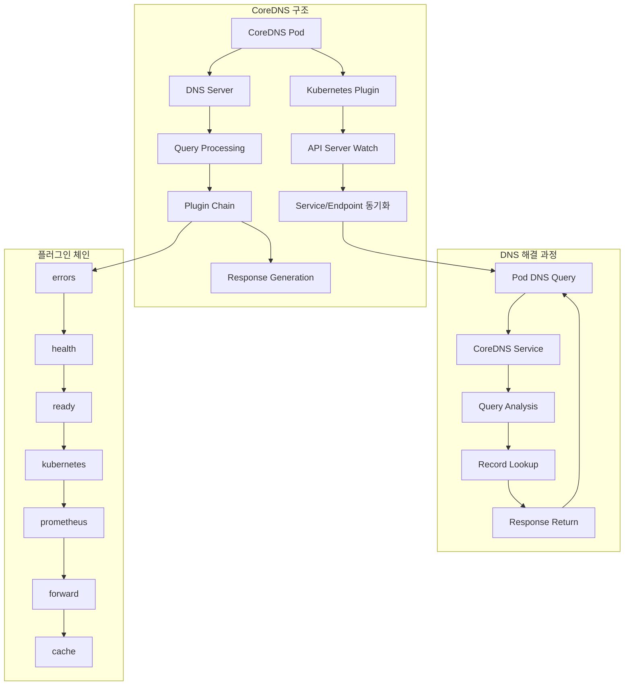
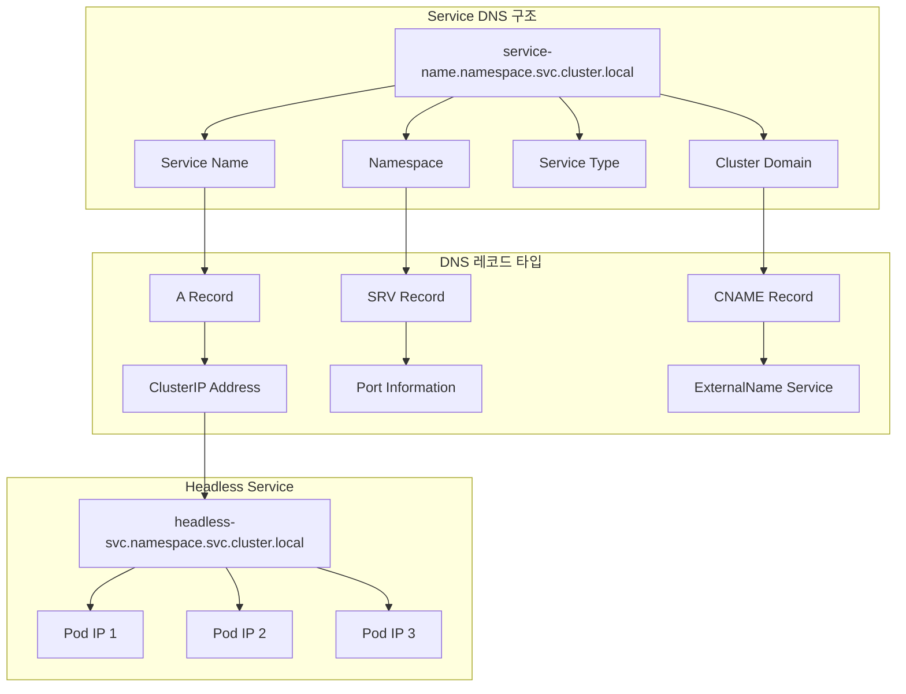
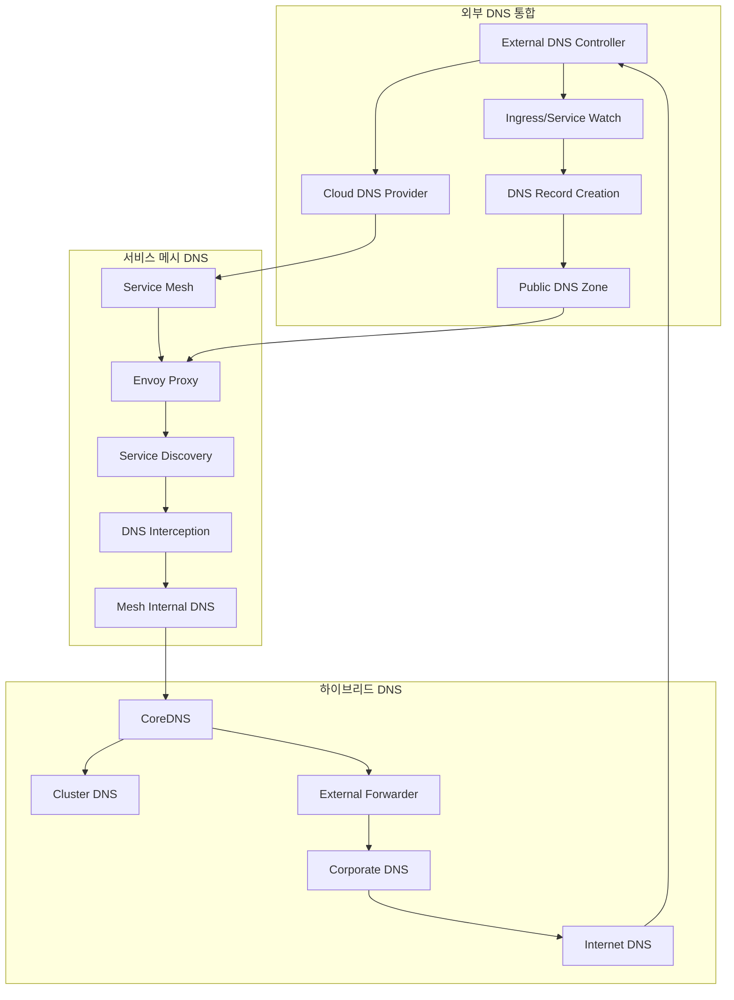

# Session 6: DNS와 서비스 디스커버리

## 📍 교과과정에서의 위치
이 세션은 **Week 2 > Day 3 > Session 6**으로, Kubernetes 클러스터 내 서비스 디스커버리의 핵심인 DNS 시스템을 학습합니다. Session 3-5에서 학습한 Service와 Ingress가 어떻게 이름으로 접근되는지 이해합니다.

## 학습 목표 (5분)
- **CoreDNS** 아키텍처와 **DNS 해결** 과정 완전 이해
- **Service DNS** 레코드와 **네이밍** 규칙 학습
- **Pod DNS** 정책과 **사용자 정의** 설정 파악
- **외부 DNS** 통합과 **서비스 메시** 연동 방안 이해

## 1. CoreDNS 아키텍처와 DNS 해결 과정 (15분)

### CoreDNS 아키텍처



### CoreDNS 상세 분석
```
CoreDNS 아키텍처:

CoreDNS 기본 개념:
   🔹 CNCF 졸업 프로젝트:
      • Go 언어로 개발된 DNS 서버
      • 플러그인 기반 확장 가능 아키텍처
      • Kubernetes 네이티브 통합
      • 고성능 및 확장성 지원
      • kube-dns 후속 솔루션
   🔹 주요 특징:
      • 플러그인 체인 기반 처리
      • 동적 설정 업데이트
      • 메트릭 및 모니터링 내장
      • 다양한 백엔드 지원
      • 클라우드 네이티브 설계

플러그인 시스템:
   🔹 핵심 플러그인:
      • kubernetes: K8s 리소스 DNS 해결
      • forward: 외부 DNS 서버 전달
      • cache: DNS 응답 캐싱
      • health: 헬스 체크 엔드포인트
      • ready: 준비 상태 확인
      • prometheus: 메트릭 노출
      • errors: 오류 로깅
      • log: 쿼리 로깅
   🔹 플러그인 체인 처리:
      • 순차적 플러그인 실행
      • 각 플러그인의 결과 전달
      • 조건부 처리 및 분기
      • 실패 시 다음 플러그인 시도
      • 최종 응답 생성

Kubernetes 통합:
   🔹 API 서버 연동:
      • Service/Endpoint Watch
      • Pod 정보 실시간 동기화
      • Namespace 기반 격리
      • RBAC 권한 관리
      • 클러스터 상태 반영
   🔹 DNS 레코드 생성:
      • Service A/AAAA 레코드
      • Service SRV 레코드
      • Pod A/AAAA 레코드
      • Headless Service 처리
      • 외부 서비스 CNAME

DNS 해결 과정:
   🔹 쿼리 수신 및 분석:
      • DNS 쿼리 파싱
      • 쿼리 타입 확인 (A, AAAA, SRV, etc.)
      • 도메인 이름 분석
      • 네임스페이스 추출
   🔹 레코드 검색:
      • Kubernetes 리소스 매칭
      • 캐시 확인
      • 외부 DNS 전달 (필요시)
      • 기본값 적용
   🔹 응답 생성:
      • DNS 응답 패킷 구성
      • TTL 설정
      • 추가 레코드 포함
      • 클라이언트 응답 전송

성능 최적화:
   🔹 캐싱 전략:
      • 성공/실패 응답 캐싱
      • TTL 기반 만료 관리
      • 메모리 사용량 제한
      • 캐시 히트율 최적화
   🔹 부하 분산:
      • 다중 CoreDNS 인스턴스
      • 안티 어피니티 배치
      • 수평 확장 지원
      • 로드 밸런싱 최적화
   🔹 리소스 관리:
      • 메모리 사용량 모니터링
      • CPU 사용률 최적화
      • 네트워크 대역폭 관리
      • 가비지 컬렉션 튜닝
```

## 2. Service DNS 레코드와 네이밍 규칙 (12분)

### DNS 네이밍 구조



### Service DNS 상세 분석
```
Service DNS 네이밍 규칙:

DNS 이름 구조:
   🔹 완전한 도메인 이름 (FQDN):
      • <service-name>.<namespace>.svc.<cluster-domain>
      • 예: web-service.default.svc.cluster.local
      • 클러스터 전체에서 유일
      • 네임스페이스 간 접근 가능
      • 명시적이고 명확한 참조
   🔹 단축 이름 (Short Names):
      • 동일 네임스페이스: <service-name>
      • 다른 네임스페이스: <service-name>.<namespace>
      • 서비스 타입 포함: <service-name>.<namespace>.svc
      • DNS 검색 도메인 활용
      • 편의성과 가독성 향상

DNS 레코드 타입:
   🔹 A/AAAA 레코드:
      • Service ClusterIP 주소 반환
      • IPv4 (A) / IPv6 (AAAA) 지원
      • 로드 밸런싱된 가상 IP
      • 가장 일반적인 사용 사례
      • 애플리케이션 투명성 보장
   🔹 SRV 레코드:
      • 서비스 포트 정보 포함
      • _<port-name>._<protocol>.<service-fqdn>
      • 예: _http._tcp.web-service.default.svc.cluster.local
      • 포트 디스커버리 지원
      • 프로토콜별 접근 가능
      • 고급 서비스 디스커버리
   🔹 CNAME 레코드:
      • ExternalName 서비스용
      • 외부 도메인으로 리다이렉션
      • 별칭 및 간접 참조
      • 외부 서비스 통합

Headless Service DNS:
   🔹 기본 개념:
      • ClusterIP: None으로 설정
      • 개별 Pod IP 직접 반환
      • 로드 밸런싱 우회
      • StatefulSet과 주로 사용
      • 직접 Pod 접근 필요시
   🔹 DNS 동작:
      • A 레코드: 모든 Ready Pod IP 반환
      • SRV 레코드: Pod별 포트 정보
      • Pod 서브도메인: <pod-name>.<service-name>
      • 동적 Pod 목록 업데이트
      • 클라이언트 측 로드 밸런싱
   🔹 사용 사례:
      • 데이터베이스 클러스터 (MySQL, MongoDB)
      • 메시징 시스템 (Kafka, RabbitMQ)
      • 분산 캐시 (Redis Cluster)
      • 피어 투 피어 애플리케이션
      • 커스텀 로드 밸런싱

DNS 검색 도메인:
   🔹 Pod DNS 설정:
      • /etc/resolv.conf 자동 생성
      • nameserver: CoreDNS ClusterIP
      • search 도메인 목록
      • options 설정
      • 동적 업데이트
   🔹 검색 순서:
      • <namespace>.svc.<cluster-domain>
      • svc.<cluster-domain>
      • <cluster-domain>
      • 호스트 검색 도메인 (선택적)
      • 순차적 해결 시도
   🔹 최적화 고려사항:
      • 검색 도메인 수 최소화
      • 명시적 FQDN 사용 권장
      • DNS 쿼리 수 감소
      • 성능 향상

특수 DNS 기능:
   🔹 와일드카드 DNS:
      • *.namespace.svc.cluster.local
      • 동적 서비스 매칭
      • 개발 환경 유연성
      • 보안 고려사항 존재
   🔹 조건부 전달:
      • 특정 도메인 외부 DNS 전달
      • 하이브리드 환경 지원
      • 기업 내부 DNS 통합
      • 복잡한 네트워크 토폴로지
   🔹 DNS 정책:
      • Default: 클러스터 DNS 우선
      • ClusterFirst: 클러스터 DNS만
      • ClusterFirstWithHostNet: 호스트 네트워크 고려
      • None: 사용자 정의 설정
      • 환경별 최적화
```

## 3. Pod DNS 정책과 사용자 정의 설정 (10분)

### Pod DNS 정책 비교

```mermaid
graph TB
    subgraph "DNS 정책 타입"
        A[Default] --> B[Node DNS + Cluster DNS]
        C[ClusterFirst] --> D[Cluster DNS Only]
        E[ClusterFirstWithHostNet] --> F[Host Network + Cluster DNS]
        G[None] --> H[Custom DNS Config]
    end
    
    subgraph "DNS 설정 구성"
        I[nameservers] --> J[DNS Server List]
        K[searches] --> L[Search Domain List]
        M[options] --> N[DNS Options]
    end
    
    subgraph "resolv.conf 생성"
        O[Pod Spec] --> P[DNS Policy]
        P --> Q[DNS Config]
        Q --> R[/etc/resolv.conf]
    end
    
    B --> I
    D --> K
    F --> M
    H --> O
```

### Pod DNS 정책 상세 분석
```
Pod DNS 정책:

DNS 정책 타입:
   🔹 Default:
      • 노드의 DNS 설정 상속
      • /etc/resolv.conf 복사
      • 클러스터 DNS 추가
      • 하이브리드 해결 방식
      • 호스트 네트워크 Pod 기본값
      • 외부 서비스 접근 우선
   🔹 ClusterFirst (기본):
      • 클러스터 DNS 우선 사용
      • CoreDNS를 첫 번째 네임서버로 설정
      • 클러스터 도메인 검색 우선
      • 외부 쿼리는 업스트림 전달
      • 대부분 Pod의 기본 정책
      • 클러스터 서비스 최적화
   🔹 ClusterFirstWithHostNet:
      • 호스트 네트워크 Pod용
      • 클러스터 DNS + 호스트 DNS
      • 네트워크 네임스페이스 공유 시
      • DaemonSet 등에서 사용
      • 특수한 네트워킹 요구사항
   🔹 None:
      • 완전 사용자 정의 설정
      • dnsConfig 필드 필수
      • 모든 DNS 설정 명시적 지정
      • 고급 사용자용
      • 특별한 DNS 요구사항

사용자 정의 DNS 설정:
   🔹 dnsConfig 구조:
      • nameservers: DNS 서버 목록
      • searches: 검색 도메인 목록
      • options: DNS 옵션 설정
      • 기존 설정과 병합 또는 대체
   🔹 nameservers 설정:
      • 최대 3개 DNS 서버
      • IP 주소 형태로 지정
      • 순서대로 쿼리 시도
      • 첫 번째 서버 우선 사용
      • 장애 시 다음 서버 사용
   🔹 searches 설정:
      • 최대 6개 검색 도메인
      • 총 길이 256자 제한
      • 단축 이름 해결용
      • 순서대로 시도
      • 성능 영향 고려
   🔹 options 설정:
      • ndots: 절대/상대 도메인 판단
      • timeout: DNS 쿼리 타임아웃
      • attempts: 재시도 횟수
      • rotate: 서버 순환 사용
      • 기타 resolver 옵션

고급 DNS 설정:
   🔹 ndots 최적화:
      • 기본값: 5
      • 점(.) 개수 기준 판단
      • 절대 도메인 판단 기준
      • 불필요한 검색 도메인 쿼리 방지
      • 성능 최적화 핵심 설정
      • 애플리케이션별 튜닝 필요
   🔹 타임아웃 설정:
      • 기본 타임아웃: 5초
      • 네트워크 지연 고려
      • 애플리케이션 요구사항 반영
      • 장애 감지 시간 단축
      • 사용자 경험 최적화
   🔹 캐싱 전략:
      • 클라이언트 측 캐싱
      • TTL 기반 만료 관리
      • 네거티브 캐싱
      • 메모리 사용량 제한
      • 네트워크 트래픽 감소

DNS 디버깅:
   🔹 일반적인 문제:
      • DNS 해결 실패
      • 느린 DNS 응답
      • 잘못된 IP 반환
      • 검색 도메인 문제
      • 네임서버 접근 불가
   🔹 디버깅 도구:
      • nslookup: 기본 DNS 조회
      • dig: 상세 DNS 정보
      • host: 간단한 조회
      • systemd-resolve: systemd 환경
      • kubectl exec 활용
   🔹 로그 분석:
      • CoreDNS 로그 확인
      • Pod DNS 설정 검증
      • 네트워크 연결 상태
      • 방화벽 규칙 확인
      • 성능 메트릭 분석

모범 사례:
   🔹 명시적 FQDN 사용
   🔹 ndots 값 최적화
   🔹 불필요한 검색 도메인 제거
   🔹 DNS 캐싱 활용
   🔹 모니터링 및 알림 설정
   🔹 정기적인 성능 검토
```

## 4. 외부 DNS 통합과 서비스 메시 연동 (10분)

### 외부 DNS 통합 아키텍처



### 외부 DNS 및 서비스 메시 연동
```
외부 DNS 통합:

External DNS 컨트롤러:
   🔹 기본 개념:
      • Kubernetes 리소스 기반 DNS 레코드 자동 생성
      • Ingress/Service 어노테이션 기반 동작
      • 클라우드 DNS 서비스 통합
      • 외부 접근 가능한 DNS 레코드 관리
      • GitOps 워크플로우 지원
   🔹 지원 DNS 제공자:
      • AWS Route 53
      • Google Cloud DNS
      • Azure DNS
      • Cloudflare
      • 기타 RFC2136 호환 서버
      • 다중 제공자 동시 지원
   🔹 동작 원리:
      • Ingress/Service 리소스 감시
      • 어노테이션 기반 설정 추출
      • DNS 제공자 API 호출
      • DNS 레코드 생성/업데이트/삭제
      • 상태 동기화 및 모니터링

서비스 메시 DNS 통합:
   🔹 Istio DNS:
      • Envoy 프록시 DNS 인터셉션
      • 서비스 메시 내부 DNS 해결
      • 트래픽 정책 기반 라우팅
      • 멀티 클러스터 서비스 디스커버리
      • 보안 정책 통합
      • 관찰 가능성 향상
   🔹 Linkerd DNS:
      • 경량화된 DNS 프록시
      • 자동 TLS 및 로드 밸런싱
      • 서비스 프로파일 기반 라우팅
      • 메트릭 및 추적 통합
      • 단순한 설정 및 관리
   🔹 Consul Connect:
      • Consul 기반 서비스 디스커버리
      • 다중 데이터센터 지원
      • 헬스 체크 통합
      • 동적 설정 업데이트
      • 레거시 시스템 통합

하이브리드 DNS 아키텍처:
   🔹 계층적 DNS 구조:
      • 클러스터 DNS (CoreDNS)
      • 기업 내부 DNS
      • 퍼블릭 DNS
      • 조건부 전달 설정
      • 캐싱 계층 최적화
   🔹 DNS 전달 규칙:
      • 내부 도메인: 기업 DNS
      • 클러스터 도메인: CoreDNS
      • 외부 도메인: 퍼블릭 DNS
      • 우선순위 기반 해결
      • 장애 시 폴백 메커니즘
   🔹 보안 고려사항:
      • DNS over HTTPS (DoH)
      • DNS over TLS (DoT)
      • DNSSEC 검증
      • DNS 필터링 및 차단
      • 로깅 및 감사

멀티 클러스터 DNS:
   🔹 클러스터 간 서비스 디스커버리:
      • 글로벌 DNS 네임스페이스
      • 클러스터별 도메인 분리
      • 서비스 메시 통합
      • 로드 밸런싱 및 장애 조치
      • 지리적 라우팅
   🔹 Admiral/Submariner:
      • 멀티 클러스터 네트워킹
      • 서비스 익스포트/임포트
      • DNS 자동 동기화
      • 네트워크 정책 통합
      • 보안 터널링
   🔹 구현 패턴:
      • 중앙집중식 DNS
      • 분산 DNS 동기화
      • 페더레이션 기반
      • 서비스 메시 통합
      • 하이브리드 접근법

DNS 성능 최적화:
   🔹 캐싱 전략:
      • 다층 캐싱 구조
      • TTL 최적화
      • 프리페칭
      • 네거티브 캐싱
      • 캐시 워밍
   🔹 로드 밸런싱:
      • DNS 서버 분산
      • Anycast 라우팅
      • 지리적 분산
      • 헬스 체크 기반 라우팅
      • 트래픽 분산 최적화
   🔹 모니터링:
      • DNS 쿼리 메트릭
      • 응답 시간 추적
      • 오류율 모니터링
      • 캐시 히트율
      • 용량 계획

운영 고려사항:
   🔹 장애 복구:
      • DNS 서버 이중화
      • 자동 장애 조치
      • 백업 DNS 설정
      • 복구 절차 자동화
      • 재해 복구 계획
   🔹 보안 관리:
      • DNS 쿼리 로깅
      • 악성 도메인 차단
      • DGA 탐지
      • DNS 터널링 방지
      • 접근 제어 정책
   🔹 규정 준수:
      • 데이터 주권 요구사항
      • 로그 보존 정책
      • 개인정보 보호
      • 감사 요구사항
      • 규제 준수 보고
```

## 💬 그룹 토론: DNS 기반 서비스 디스커버리의 한계와 대안 (8분)

### 토론 주제
**"DNS 기반 서비스 디스커버리의 한계점은 무엇이며, 대규모 마이크로서비스 환경에서 어떤 대안 기술을 고려해야 하는가?"**

## 💡 핵심 개념 정리
- **CoreDNS**: 플러그인 기반 DNS 서버, Kubernetes 네이티브 통합
- **Service DNS**: FQDN 구조, A/SRV/CNAME 레코드, Headless Service
- **Pod DNS 정책**: ClusterFirst, Default, None, 사용자 정의 설정
- **외부 DNS**: External DNS 컨트롤러, 서비스 메시 통합

## 📚 참고 자료
- [CoreDNS](https://coredns.io/manual/toc/)
- [DNS for Services and Pods](https://kubernetes.io/docs/concepts/services-networking/dns-pod-service/)
- [External DNS](https://github.com/kubernetes-sigs/external-dns)

## 다음 세션 준비
다음 세션에서는 **네트워크 정책과 보안**에 대해 학습합니다.