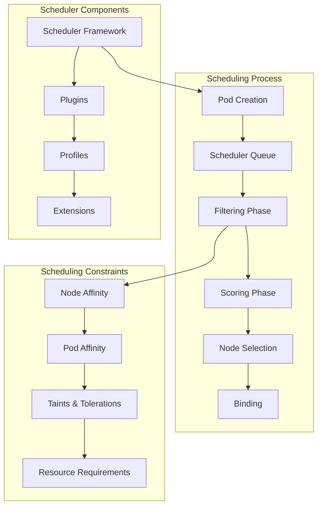
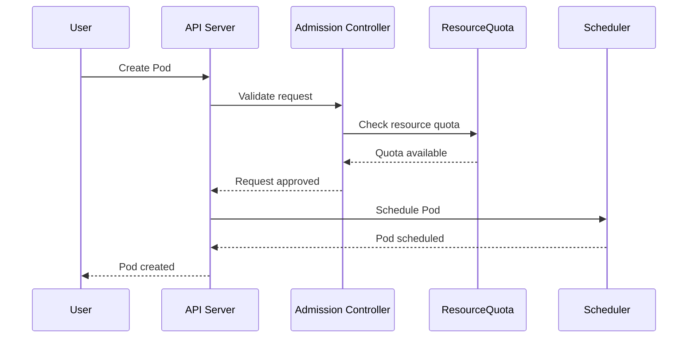

# Session 6: 워크로드 스케줄링 및 리소스 관리

## 📍 교과과정에서의 위치
이 세션은 **Week 2 > Day 3 > Session 6**으로, 스토리지 오케스트레이션 이해를 바탕으로 Kubernetes의 워크로드 스케줄링 알고리즘과 클러스터 리소스 관리 메커니즘을 심화 분석합니다.

## 학습 목표 (5분)
- **Kubernetes 스케줄러** 알고리즘과 **Pod 배치 전략** 이해
- **리소스 쿼터** 및 **제한 정책**을 통한 **멀티 테넌시** 관리
- **오토스케일링** 메커니즘과 **클러스터 확장** 전략 수립

## 1. 이론: Kubernetes 스케줄러 아키텍처 (20분)

### 스케줄링 프로세스 개요



### 스케줄링 알고리즘 상세

```
Kubernetes 스케줄러 동작 원리:

스케줄링 사이클:
├── 1단계: 스케줄링 큐에서 Pod 선택
├── 2단계: 필터링 (Predicates/Filter Plugins)
├── 3단계: 점수 매기기 (Priorities/Score Plugins)
├── 4단계: 최적 노드 선택
├── 5단계: 바인딩 (Bind Plugins)
├── 6단계: 사후 처리 (PostBind Plugins)
└── 7단계: 다음 Pod 처리

필터링 단계 (Filter Plugins):
├── NodeResourcesFit:
│   ├── CPU, 메모리, 스토리지 요구사항 확인
│   ├── 확장 리소스 (GPU, FPGA) 가용성
│   ├── 포트 충돌 검사
│   └── 리소스 오버커밋 정책 적용
├── NodeAffinity:
│   ├── 노드 셀렉터 및 어피니티 규칙
│   ├── 필수 조건 (requiredDuringScheduling)
│   ├── 선호 조건 (preferredDuringScheduling)
│   └── 라벨 기반 노드 선택
├── PodAffinity/AntiAffinity:
│   ├── Pod 간 배치 규칙
│   ├── 동일 노드/영역 배치 (Affinity)
│   ├── 분산 배치 (AntiAffinity)
│   └── 토폴로지 도메인 고려
├── TaintToleration:
│   ├── 노드 테인트와 Pod 톨러레이션 매칭
│   ├── 전용 노드 할당
│   ├── 문제 노드 격리
│   └── 스케줄링 제외 메커니즘
├── VolumeBinding:
│   ├── PVC와 PV 바인딩 가능성
│   ├── 토폴로지 제약 조건
│   ├── 스토리지 클래스 호환성
│   └── 지연 바인딩 지원
└── 기타 필터:
    ├── NodeUnschedulable: 스케줄링 비활성화 노드
    ├── NodeName: 특정 노드 지정
    ├── NodePorts: 포트 가용성 확인
    └── ImageLocality: 이미지 로컬 존재 여부

점수 매기기 단계 (Score Plugins):
├── NodeResourcesFit:
│   ├── 리소스 사용률 기반 점수
│   ├── 균등 분산 vs 집중 배치
│   ├── 요청/제한 비율 고려
│   └── 확장 리소스 가중치
├── ImageLocality:
│   ├── 이미지 로컬 존재 시 높은 점수
│   ├── 이미지 크기 고려
│   ├── 네트워크 대역폭 절약
│   └── 시작 시간 단축
├── InterPodAffinity:
│   ├── Pod 어피니티 선호도 점수
│   ├── 토폴로지 분산 고려
│   ├── 가중치 기반 계산
│   └── 복잡도 제한 (기본 300개 노드)
├── NodeAffinity:
│   ├── 노드 어피니티 선호도 점수
│   ├── 가중치 기반 우선순위
│   ├── 다중 조건 조합
│   └── 소프트 제약 조건 처리
└── 커스텀 스코어링:
    ├── 플러그인 기반 확장
    ├── 비즈니스 로직 반영
    ├── 외부 메트릭 통합
    └── 동적 점수 계산

스케줄러 프레임워크:
├── 확장 가능한 플러그인 아키텍처
├── 다중 스케줄링 프로파일 지원
├── 커스텀 스케줄러 개발 지원
├── 이벤트 기반 확장 포인트
├── 성능 최적화 및 병렬 처리
└── 디버깅 및 관찰가능성 지원
```

### 고급 스케줄링 기능

```
고급 스케줄링 개념:

Pod 우선순위 및 선점:
├── PriorityClass를 통한 우선순위 정의
├── 높은 우선순위 Pod의 선점 스케줄링
├── 낮은 우선순위 Pod 축출 (Eviction)
├── 리소스 부족 시 우선순위 기반 결정
├── 시스템 크리티컬 워크로드 보호
└── 배치 작업 vs 서비스 워크로드 분리

토폴로지 분산 제약:
├── Pod 토폴로지 분산 제약 (PodTopologySpreadConstraints)
├── 영역, 노드, 랙 단위 분산
├── 최대 편차 (maxSkew) 제어
├── 고가용성 및 장애 격리
├── 로드 밸런싱 최적화
└── 지리적 분산 배치

다중 스케줄러:
├── 기본 스케줄러 외 커스텀 스케줄러
├── 워크로드별 특화 스케줄링
├── 스케줄러 이름 지정 (schedulerName)
├── 병렬 스케줄링 지원
├── 특수 요구사항 처리
└── 실험적 스케줄링 알고리즘

스케줄링 게이트:
├── 외부 시스템 승인 대기
├── 조건부 스케줄링 제어
├── 워크플로우 통합
├── 리소스 예약 시스템 연동
└── 복잡한 배치 정책 구현
```

## 2. 이론: 리소스 관리 및 쿼터 시스템 (15분)

### 리소스 쿼터 아키텍처



### 리소스 쿼터 및 제한 정책

```
리소스 관리 체계:

ResourceQuota:
├── 네임스페이스별 리소스 사용량 제한
├── 컴퓨팅 리소스 (CPU, 메모리, 스토리지)
├── 오브젝트 수량 제한 (Pod, Service, PVC 등)
├── 확장 리소스 (GPU, 사용자 정의 리소스)
├── 스코프 기반 쿼터 (우선순위, QoS 클래스)
├── 하드 제한 vs 소프트 제한
└── 실시간 사용량 추적 및 제어

LimitRange:
├── 개별 리소스 오브젝트 제한
├── Pod, 컨테이너, PVC별 최소/최대 리소스
├── 기본값 및 기본 요청량 설정
├── 요청/제한 비율 제어
├── 리소스 오버커밋 방지
└── 네임스페이스 레벨 정책 적용

QoS (Quality of Service) 클래스:
├── Guaranteed:
│   ├── 모든 컨테이너에 CPU/메모리 요청=제한
│   ├── 최고 우선순위, 축출 저항성
│   ├── 예측 가능한 성능
│   ├── 크리티컬 워크로드 적합
│   └── 리소스 예약 보장
├── Burstable:
│   ├── 최소 하나의 컨테이너에 요청량 설정
│   ├── 요청량 < 제한량 또는 제한량 미설정
│   ├── 중간 우선순위
│   ├── 리소스 버스트 허용
│   └── 일반적인 애플리케이션 워크로드
└── BestEffort:
    ├── 요청량 및 제한량 미설정
    ├── 최저 우선순위, 먼저 축출
    ├── 남은 리소스 활용
    ├── 배치 작업 및 실험적 워크로드
    └── 비용 효율적 리소스 활용

멀티 테넌시 지원:
├── 네임스페이스 기반 격리
├── RBAC 권한 분리
├── 네트워크 정책 격리
├── 리소스 쿼터 할당
├── 노드 풀 분리
├── 스토리지 클래스 분리
└── 모니터링 및 로깅 분리
```

### 리소스 모니터링 및 최적화

```
리소스 최적화 전략:

Vertical Pod Autoscaler (VPA):
├── Pod 리소스 요청량 자동 조정
├── 과거 사용량 기반 추천
├── 수직 스케일링 (리소스 증감)
├── 재시작 기반 또는 인플레이스 업데이트
├── 리소스 효율성 개선
├── 오버프로비저닝 방지
└── 워크로드별 최적화

리소스 사용량 분석:
├── 메트릭 서버를 통한 실시간 모니터링
├── Prometheus 기반 장기 메트릭 수집
├── 리소스 사용 패턴 분석
├── 피크 시간대 및 계절성 고려
├── 비용 최적화 기회 식별
└── 용량 계획 및 예측

노드 리소스 관리:
├── 시스템 예약 리소스 (system-reserved)
├── kubelet 예약 리소스 (kube-reserved)
├── 축출 임계값 (eviction-threshold)
├── 노드 압박 상황 처리
├── 우선순위 기반 Pod 축출
└── 노드 상태 및 조건 관리
```

## 3. 이론: 오토스케일링 메커니즘 (10분)

### 오토스케일링 아키텍처

```
Kubernetes 오토스케일링 계층:

Horizontal Pod Autoscaler (HPA):
├── Pod 복제본 수 자동 조정
├── CPU, 메모리 사용률 기반
├── 커스텀 메트릭 지원 (Prometheus, 외부 메트릭)
├── 다중 메트릭 조합 정책
├── 스케일 업/다운 정책 및 안정화
├── 최소/최대 복제본 수 제한
└── 배치 작업 제외 (Deployment, ReplicaSet 대상)

Vertical Pod Autoscaler (VPA):
├── Pod 리소스 요청량 자동 조정
├── 과거 사용량 패턴 학습
├── 추천 모드 vs 자동 적용 모드
├── 업데이트 정책 (Off, Initial, Auto)
├── 컨테이너별 개별 조정
├── 리소스 효율성 극대화
└── HPA와 동시 사용 제한

Cluster Autoscaler:
├── 노드 수 자동 조정
├── 스케줄링 불가능한 Pod 감지
├── 노드 그룹별 확장/축소
├── 클라우드 제공업체 통합
├── 비용 최적화 고려
├── 스케일 다운 지연 및 안전장치
└── 다중 노드 풀 지원

오토스케일링 정책:
├── 메트릭 기반 정책:
│   ├── 리소스 메트릭 (CPU, 메모리)
│   ├── 커스텀 메트릭 (애플리케이션 메트릭)
│   ├── 외부 메트릭 (클라우드 서비스 메트릭)
│   └── 다중 메트릭 조합 및 가중치
├── 행동 정책:
│   ├── 스케일 업 정책 (빠른 반응)
│   ├── 스케일 다운 정책 (안정화 우선)
│   ├── 안정화 윈도우 (thrashing 방지)
│   └── 백오프 및 쿨다운 기간
└── 제약 조건:
    ├── 최소/최대 복제본 수
    ├── 리소스 쿼터 한계
    ├── 노드 가용성 제약
    └── 비용 예산 제한
```

## 4. 개념 예시: 스케줄링 및 리소스 관리 구성 (12분)

### 고급 스케줄링 구성 예시

```yaml
# Pod 우선순위 클래스 (개념 예시)
apiVersion: scheduling.k8s.io/v1
kind: PriorityClass
metadata:
  name: high-priority
value: 1000
globalDefault: false
description: "High priority class for critical workloads"

---
# 토폴로지 분산 제약이 있는 Deployment
apiVersion: apps/v1
kind: Deployment
metadata:
  name: web-app
spec:
  replicas: 6
  selector:
    matchLabels:
      app: web-app
  template:
    metadata:
      labels:
        app: web-app
    spec:
      priorityClassName: high-priority
      topologySpreadConstraints:
      - maxSkew: 1
        topologyKey: topology.kubernetes.io/zone
        whenUnsatisfiable: DoNotSchedule
        labelSelector:
          matchLabels:
            app: web-app
      - maxSkew: 2
        topologyKey: kubernetes.io/hostname
        whenUnsatisfiable: ScheduleAnyway
        labelSelector:
          matchLabels:
            app: web-app
      affinity:
        nodeAffinity:
          requiredDuringSchedulingIgnoredDuringExecution:
            nodeSelectorTerms:
            - matchExpressions:
              - key: node-type
                operator: In
                values: ["compute"]
          preferredDuringSchedulingIgnoredDuringExecution:
          - weight: 100
            preference:
              matchExpressions:
              - key: instance-type
                operator: In
                values: ["c5.large", "c5.xlarge"]
        podAntiAffinity:
          preferredDuringSchedulingIgnoredDuringExecution:
          - weight: 100
            podAffinityTerm:
              labelSelector:
                matchExpressions:
                - key: app
                  operator: In
                  values: ["web-app"]
              topologyKey: kubernetes.io/hostname
      containers:
      - name: web
        image: nginx:1.21
        resources:
          requests:
            cpu: 100m
            memory: 128Mi
          limits:
            cpu: 500m
            memory: 512Mi
```

### 리소스 쿼터 및 제한 정책 예시

```yaml
# ResourceQuota (개념 예시)
apiVersion: v1
kind: ResourceQuota
metadata:
  name: team-quota
  namespace: team-a
spec:
  hard:
    requests.cpu: "10"
    requests.memory: 20Gi
    limits.cpu: "20"
    limits.memory: 40Gi
    requests.storage: 100Gi
    persistentvolumeclaims: "10"
    pods: "50"
    services: "10"
    secrets: "20"
    configmaps: "20"
  scopes:
  - NotTerminating
  scopeSelector:
    matchExpressions:
    - operator: In
      scopeName: PriorityClass
      values: ["high", "medium"]

---
# LimitRange (개념 예시)
apiVersion: v1
kind: LimitRange
metadata:
  name: resource-limits
  namespace: team-a
spec:
  limits:
  - type: Container
    default:
      cpu: 200m
      memory: 256Mi
    defaultRequest:
      cpu: 100m
      memory: 128Mi
    min:
      cpu: 50m
      memory: 64Mi
    max:
      cpu: 2
      memory: 4Gi
    maxLimitRequestRatio:
      cpu: 4
      memory: 8
  - type: Pod
    max:
      cpu: 4
      memory: 8Gi
  - type: PersistentVolumeClaim
    min:
      storage: 1Gi
    max:
      storage: 100Gi
```

### 오토스케일링 구성 예시

```yaml
# HPA 구성 (개념 예시)
apiVersion: autoscaling/v2
kind: HorizontalPodAutoscaler
metadata:
  name: web-app-hpa
spec:
  scaleTargetRef:
    apiVersion: apps/v1
    kind: Deployment
    name: web-app
  minReplicas: 3
  maxReplicas: 50
  metrics:
  - type: Resource
    resource:
      name: cpu
      target:
        type: Utilization
        averageUtilization: 70
  - type: Resource
    resource:
      name: memory
      target:
        type: Utilization
        averageUtilization: 80
  - type: Pods
    pods:
      metric:
        name: http_requests_per_second
      target:
        type: AverageValue
        averageValue: "100"
  behavior:
    scaleUp:
      stabilizationWindowSeconds: 60
      policies:
      - type: Percent
        value: 100
        periodSeconds: 15
      - type: Pods
        value: 4
        periodSeconds: 15
      selectPolicy: Max
    scaleDown:
      stabilizationWindowSeconds: 300
      policies:
      - type: Percent
        value: 10
        periodSeconds: 60

---
# VPA 구성 (개념 예시)
apiVersion: autoscaling.k8s.io/v1
kind: VerticalPodAutoscaler
metadata:
  name: web-app-vpa
spec:
  targetRef:
    apiVersion: apps/v1
    kind: Deployment
    name: web-app
  updatePolicy:
    updateMode: "Auto"
  resourcePolicy:
    containerPolicies:
    - containerName: web
      minAllowed:
        cpu: 50m
        memory: 64Mi
      maxAllowed:
        cpu: 1
        memory: 2Gi
      controlledResources: ["cpu", "memory"]
```

## 5. 토론 및 정리 (8분)

### 핵심 개념 정리
- **Kubernetes 스케줄러**의 2단계 알고리즘과 고급 배치 전략
- **리소스 쿼터 시스템**을 통한 멀티 테넌시 및 리소스 거버넌스
- **오토스케일링** 메커니즘을 통한 동적 리소스 관리
- **QoS 클래스**와 **우선순위**를 통한 워크로드 차별화

### 토론 주제
"대규모 멀티 테넌트 클러스터에서 리소스 효율성과 워크로드 격리를 동시에 보장하는 최적의 스케줄링 전략은 무엇인가?"

## 💡 핵심 키워드
- **스케줄링**: 필터링, 점수 매기기, 어피니티, 토폴로지 분산
- **리소스 관리**: ResourceQuota, LimitRange, QoS 클래스
- **오토스케일링**: HPA, VPA, Cluster Autoscaler, 메트릭 기반
- **멀티 테넌시**: 네임스페이스, 우선순위, 격리 정책

## 📚 참고 자료
- [Kubernetes 스케줄러](https://kubernetes.io/docs/concepts/scheduling-eviction/)
- [리소스 관리](https://kubernetes.io/docs/concepts/policy/resource-quotas/)
- [오토스케일링](https://kubernetes.io/docs/tasks/run-application/horizontal-pod-autoscale/)
