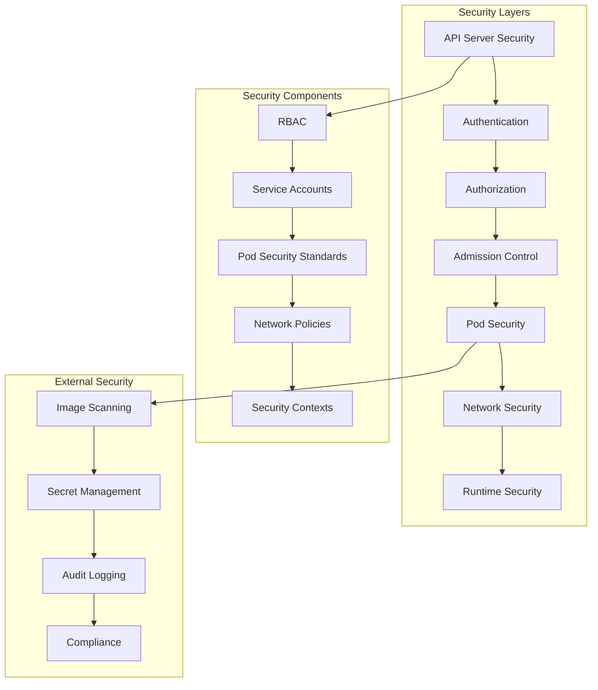

# Session 7: 보안 및 정책 관리

## 📍 교과과정에서의 위치
이 세션은 **Week 2 > Day 3 > Session 7**로, 워크로드 스케줄링 이해를 바탕으로 Kubernetes 클러스터의 보안 아키텍처와 정책 기반 접근 제어 메커니즘을 심화 분석합니다.

## 학습 목표 (5분)
- **Kubernetes 보안 모델** 및 **다층 보안 아키텍처** 이해
- **RBAC 시스템**과 **접근 제어** 메커니즘 분석
- **Pod Security Standards** 및 **네트워크 정책** 설계 전략

## 1. 이론: Kubernetes 보안 아키텍처 (20분)

### 다층 보안 모델



### 인증 및 권한 부여 체계

```
Kubernetes 보안 계층:

1. API 서버 보안:
├── TLS 암호화 통신
├── 클라이언트 인증서 검증
├── API 서버 인증서 관리
├── 보안 포트 및 프로토콜
├── 감사 로깅 활성화
└── API 버전 및 기능 게이트 제어

2. 인증 (Authentication):
├── X.509 클라이언트 인증서:
│   ├── 사용자 및 서비스 계정 인증
│   ├── CN (Common Name)을 사용자명으로 사용
│   ├── O (Organization)를 그룹으로 사용
│   ├── 인증서 만료 및 갱신 관리
│   └── CA (Certificate Authority) 신뢰 체인
├── 서비스 어카운트 토큰:
│   ├── JWT (JSON Web Token) 기반
│   ├── 자동 마운트 및 로테이션
│   ├── 네임스페이스 범위 제한
│   ├── 토큰 만료 시간 설정
│   └── 바운드 서비스 어카운트 토큰
├── OpenID Connect (OIDC):
│   ├── 외부 ID 제공업체 통합
│   ├── SSO (Single Sign-On) 지원
│   ├── 그룹 멤버십 정보 포함
│   ├── 토큰 갱신 및 만료 처리
│   └── 엔터프라이즈 인증 시스템 연동
├── 웹훅 토큰 인증:
│   ├── 외부 인증 서비스 호출
│   ├── 커스텀 인증 로직 구현
│   ├── 토큰 검증 및 사용자 정보 반환
│   └── 레거시 시스템 통합
└── 프록시 인증:
    ├── 리버스 프록시를 통한 인증
    ├── 헤더 기반 사용자 정보 전달
    ├── 기존 인증 인프라 활용
    └── 네트워크 레벨 보안 강화

3. 권한 부여 (Authorization):
├── RBAC (Role-Based Access Control):
│   ├── 역할 기반 접근 제어
│   ├── 최소 권한 원칙 적용
│   ├── 세밀한 권한 제어
│   ├── 네임스페이스 및 클러스터 범위
│   └── 동적 권한 관리
├── ABAC (Attribute-Based Access Control):
│   ├── 속성 기반 접근 제어
│   ├── 복잡한 정책 표현 가능
│   ├── 컨텍스트 기반 결정
│   ├── 정적 정책 파일 기반
│   └── 고급 보안 요구사항 지원
├── 웹훅 권한 부여:
│   ├── 외부 권한 부여 서비스
│   ├── 실시간 정책 결정
│   ├── 비즈니스 로직 통합
│   └── 감사 및 로깅 강화
└── 노드 권한 부여:
    ├── kubelet 전용 권한 부여
    ├── 노드별 리소스 접근 제한
    ├── Pod 및 서비스 범위 제한
    └── 노드 보안 강화

4. 승인 제어 (Admission Control):
├── 변형 승인 컨트롤러 (Mutating):
│   ├── 요청 객체 수정
│   ├── 기본값 설정 및 라벨 추가
│   ├── 보안 컨텍스트 강제 적용
│   ├── 리소스 제한 자동 설정
│   └── 정책 기반 객체 변형
├── 검증 승인 컨트롤러 (Validating):
│   ├── 요청 객체 검증
│   ├── 정책 준수 확인
│   ├── 보안 규칙 적용
│   ├── 리소스 제약 검사
│   └── 거부 또는 승인 결정
├── 동적 승인 제어:
│   ├── 웹훅 기반 확장
│   ├── 외부 정책 엔진 통합
│   ├── 실시간 정책 평가
│   └── 커스텀 비즈니스 로직
└── 내장 승인 컨트롤러:
    ├── NamespaceLifecycle
    ├── ResourceQuota
    ├── LimitRanger
    ├── ServiceAccount
    └── PodSecurityPolicy (deprecated)
```

### RBAC 시스템 상세

```
RBAC 구성 요소:

Role과 ClusterRole:
├── Role (네임스페이스 범위):
│   ├── 특정 네임스페이스 내 리소스 권한
│   ├── Pod, Service, ConfigMap 등 접근 제어
│   ├── 세밀한 동작 권한 (get, list, create, update, delete)
│   ├── 리소스 이름별 제한 가능
│   └── 서브리소스 접근 제어 (logs, exec, portforward)
├── ClusterRole (클러스터 범위):
│   ├── 클러스터 전체 리소스 권한
│   ├── 노드, PV, 네임스페이스 등 클러스터 리소스
│   ├── 비리소스 URL 접근 제어 (/api, /healthz)
│   ├── 집계 규칙을 통한 역할 조합
│   └── 네임스페이스 리소스에 대한 전역 권한

RoleBinding과 ClusterRoleBinding:
├── RoleBinding:
│   ├── Role을 사용자/그룹/서비스어카운트에 바인딩
│   ├── 네임스페이스 범위 권한 부여
│   ├── ClusterRole을 네임스페이스 범위로 바인딩 가능
│   └── 상속 및 위임 권한 관리
├── ClusterRoleBinding:
│   ├── ClusterRole을 전역적으로 바인딩
│   ├── 클러스터 관리자 권한
│   ├── 시스템 컴포넌트 권한
│   └── 크로스 네임스페이스 권한

서비스 어카운트:
├── Pod에서 사용하는 ID
├── 네임스페이스별 기본 서비스 어카운트
├── 자동 토큰 마운트 및 갱신
├── RBAC 권한 바인딩 대상
├── 이미지 풀 시크릿 연결
├── 감사 로깅 및 추적
└── 최소 권한 원칙 적용

RBAC 모범 사례:
├── 최소 권한 원칙 (Principle of Least Privilege)
├── 역할 기반 책임 분리
├── 정기적인 권한 검토 및 감사
├── 임시 권한 및 만료 정책
├── 그룹 기반 권한 관리
├── 네임스페이스별 권한 격리
└── 자동화된 권한 프로비저닝
```

## 2. 이론: Pod Security Standards (15분)

### Pod 보안 정책 진화

```
Pod Security 발전 과정:

PodSecurityPolicy (PSP) - Deprecated:
├── 클러스터 전체 Pod 보안 정책
├── 승인 컨트롤러 기반 구현
├── 복잡한 설정 및 디버깅
├── RBAC과의 복잡한 상호작용
├── Kubernetes 1.21에서 deprecated
└── 1.25에서 완전 제거

Pod Security Standards (PSS) - Current:
├── 표준화된 보안 프로파일
├── 네임스페이스 레벨 적용
├── 간단한 설정 및 관리
├── 점진적 보안 강화 지원
├── 내장 승인 컨트롤러
└── 모니터링 및 경고 모드 지원

Pod Security Admission:
├── 내장 승인 컨트롤러
├── 네임스페이스 라벨 기반 정책
├── 실시간 정책 적용
├── 경고 및 감사 모드
├── 버전별 정책 지원
└── 마이그레이션 도구 제공
```

### Pod Security Standards 프로파일

```
보안 프로파일 상세:

Privileged:
├── 제한 없는 정책 (기본값과 동일)
├── 모든 권한 및 기능 허용
├── 호스트 네임스페이스 접근 허용
├── 특권 컨테이너 실행 허용
├── 호스트 경로 마운트 허용
├── 모든 볼륨 타입 허용
├── 시스템 관리 워크로드용
└── 최대 유연성, 최소 보안

Baseline:
├── 기본적인 보안 강화
├── 알려진 권한 에스컬레이션 방지
├── 특권 컨테이너 금지
├── 호스트 네임스페이스 접근 제한
├── 호스트 경로 볼륨 제한
├── 위험한 capabilities 제거
├── 일반적인 애플리케이션 워크로드
└── 보안과 호환성의 균형

Restricted:
├── 강화된 보안 정책
├── 보안 모범 사례 강제 적용
├── 비루트 사용자 실행 필수
├── 읽기 전용 루트 파일시스템 권장
├── 모든 capabilities 제거
├── seccomp 프로파일 적용
├── 높은 보안이 필요한 워크로드
└── 최대 보안, 제한된 유연성

적용 모드:
├── enforce: 정책 위반 시 거부
├── audit: 감사 로그에 위반 기록
├── warn: 클라이언트에 경고 메시지
├── 다중 모드 동시 적용 가능
├── 점진적 보안 강화 지원
└── 마이그레이션 및 테스트 지원

보안 컨텍스트:
├── Pod 레벨 보안 설정:
│   ├── runAsUser/runAsGroup: 사용자/그룹 ID
│   ├── runAsNonRoot: 비루트 사용자 강제
│   ├── fsGroup: 파일시스템 그룹 설정
│   ├── seccompProfile: seccomp 프로파일
│   └── supplementalGroups: 추가 그룹
├── 컨테이너 레벨 보안 설정:
│   ├── allowPrivilegeEscalation: 권한 에스컬레이션 제어
│   ├── capabilities: Linux capabilities 관리
│   ├── privileged: 특권 컨테이너 여부
│   ├── readOnlyRootFilesystem: 읽기 전용 루트 FS
│   ├── runAsUser/runAsGroup: 컨테이너별 사용자
│   └── seccompProfile: 컨테이너별 seccomp
└── 상속 및 오버라이드 규칙
```

## 3. 이론: 네트워크 보안 및 정책 (10분)

### 네트워크 정책 아키텍처

```
네트워크 보안 계층:

NetworkPolicy:
├── Pod 간 트래픽 제어
├── 네임스페이스 범위 정책
├── 라벨 셀렉터 기반 대상 선택
├── Ingress/Egress 트래픽 규칙
├── 포트 및 프로토콜 제어
├── IP 블록 기반 제어
├── 기본 거부 정책 구현
└── CNI 플러그인 지원 필요

정책 타입:
├── Ingress 정책:
│   ├── 들어오는 트래픽 제어
│   ├── 소스 Pod/네임스페이스 선택
│   ├── IP 주소 범위 제한
│   ├── 포트 및 프로토콜 지정
│   └── 화이트리스트 방식
├── Egress 정책:
│   ├── 나가는 트래픽 제어
│   ├── 대상 Pod/네임스페이스 선택
│   ├── 외부 서비스 접근 제한
│   ├── DNS 트래픽 허용 규칙
│   └── 데이터 유출 방지
└── 혼합 정책:
    ├── Ingress + Egress 동시 적용
    ├── 완전한 트래픽 제어
    ├── 마이크로세그멘테이션
    └── 제로 트러스트 네트워킹

네트워크 보안 패턴:
├── 기본 거부 (Default Deny):
│   ├── 모든 트래픽 차단 후 필요한 것만 허용
│   ├── 보안 우선 접근법
│   ├── 명시적 허용 규칙 필요
│   └── 높은 보안 수준
├── 네임스페이스 격리:
│   ├── 네임스페이스 간 트래픽 차단
│   ├── 멀티 테넌시 지원
│   ├── 환경별 격리 (dev, staging, prod)
│   └── 팀별 리소스 격리
├── 계층별 분리:
│   ├── 프론트엔드, 백엔드, 데이터베이스 분리
│   ├── 티어별 접근 제어
│   ├── 북-남 트래픽 제어
│   └── 동-서 트래픽 제어
└── 서비스 메시 통합:
    ├── Istio, Linkerd 정책 연동
    ├── L7 트래픽 제어
    ├── 상호 TLS 인증
    └── 고급 보안 기능
```

## 4. 개념 예시: 보안 정책 구성 분석 (12분)

### RBAC 구성 예시

```yaml
# 네임스페이스별 개발자 역할 (개념 예시)
apiVersion: rbac.authorization.k8s.io/v1
kind: Role
metadata:
  namespace: development
  name: developer
rules:
- apiGroups: [""]
  resources: ["pods", "services", "configmaps", "secrets"]
  verbs: ["get", "list", "create", "update", "patch", "delete"]
- apiGroups: ["apps"]
  resources: ["deployments", "replicasets"]
  verbs: ["get", "list", "create", "update", "patch", "delete"]
- apiGroups: [""]
  resources: ["pods/log", "pods/exec"]
  verbs: ["get", "create"]

---
# 클러스터 읽기 전용 역할
apiVersion: rbac.authorization.k8s.io/v1
kind: ClusterRole
metadata:
  name: cluster-reader
rules:
- apiGroups: [""]
  resources: ["nodes", "namespaces", "persistentvolumes"]
  verbs: ["get", "list"]
- apiGroups: ["metrics.k8s.io"]
  resources: ["nodes", "pods"]
  verbs: ["get", "list"]
- nonResourceURLs: ["/healthz", "/version", "/metrics"]
  verbs: ["get"]

---
# 역할 바인딩
apiVersion: rbac.authorization.k8s.io/v1
kind: RoleBinding
metadata:
  name: developer-binding
  namespace: development
subjects:
- kind: User
  name: john.doe
  apiGroup: rbac.authorization.k8s.io
- kind: Group
  name: developers
  apiGroup: rbac.authorization.k8s.io
- kind: ServiceAccount
  name: dev-service-account
  namespace: development
roleRef:
  kind: Role
  name: developer
  apiGroup: rbac.authorization.k8s.io

---
# 서비스 어카운트
apiVersion: v1
kind: ServiceAccount
metadata:
  name: app-service-account
  namespace: production
automountServiceAccountToken: false
imagePullSecrets:
- name: registry-secret
```

### Pod Security Standards 적용 예시

```yaml
# 네임스페이스 보안 정책 (개념 예시)
apiVersion: v1
kind: Namespace
metadata:
  name: secure-namespace
  labels:
    pod-security.kubernetes.io/enforce: restricted
    pod-security.kubernetes.io/audit: restricted
    pod-security.kubernetes.io/warn: restricted
    pod-security.kubernetes.io/enforce-version: v1.28
    pod-security.kubernetes.io/audit-version: v1.28
    pod-security.kubernetes.io/warn-version: v1.28

---
# 보안 강화된 Deployment
apiVersion: apps/v1
kind: Deployment
metadata:
  name: secure-app
  namespace: secure-namespace
spec:
  replicas: 3
  selector:
    matchLabels:
      app: secure-app
  template:
    metadata:
      labels:
        app: secure-app
    spec:
      serviceAccountName: app-service-account
      securityContext:
        runAsNonRoot: true
        runAsUser: 1000
        runAsGroup: 1000
        fsGroup: 1000
        seccompProfile:
          type: RuntimeDefault
      containers:
      - name: app
        image: nginx:1.21-alpine
        securityContext:
          allowPrivilegeEscalation: false
          readOnlyRootFilesystem: true
          runAsNonRoot: true
          runAsUser: 1000
          runAsGroup: 1000
          capabilities:
            drop:
            - ALL
          seccompProfile:
            type: RuntimeDefault
        ports:
        - containerPort: 8080
        resources:
          requests:
            cpu: 100m
            memory: 128Mi
          limits:
            cpu: 500m
            memory: 512Mi
        volumeMounts:
        - name: tmp-volume
          mountPath: /tmp
        - name: cache-volume
          mountPath: /var/cache/nginx
      volumes:
      - name: tmp-volume
        emptyDir: {}
      - name: cache-volume
        emptyDir: {}
```

### 네트워크 정책 예시

```yaml
# 기본 거부 정책 (개념 예시)
apiVersion: networking.k8s.io/v1
kind: NetworkPolicy
metadata:
  name: default-deny-all
  namespace: production
spec:
  podSelector: {}
  policyTypes:
  - Ingress
  - Egress

---
# 웹 애플리케이션 네트워크 정책
apiVersion: networking.k8s.io/v1
kind: NetworkPolicy
metadata:
  name: web-app-netpol
  namespace: production
spec:
  podSelector:
    matchLabels:
      app: web-app
  policyTypes:
  - Ingress
  - Egress
  ingress:
  - from:
    - namespaceSelector:
        matchLabels:
          name: ingress-system
    - podSelector:
        matchLabels:
          app: load-balancer
    ports:
    - protocol: TCP
      port: 8080
  egress:
  - to:
    - podSelector:
        matchLabels:
          app: backend-api
    ports:
    - protocol: TCP
      port: 8080
  - to:
    - namespaceSelector:
        matchLabels:
          name: database
    - podSelector:
        matchLabels:
          app: postgres
    ports:
    - protocol: TCP
      port: 5432
  - to: []
    ports:
    - protocol: TCP
      port: 53
    - protocol: UDP
      port: 53

---
# 네임스페이스 간 격리 정책
apiVersion: networking.k8s.io/v1
kind: NetworkPolicy
metadata:
  name: namespace-isolation
  namespace: development
spec:
  podSelector: {}
  policyTypes:
  - Ingress
  - Egress
  ingress:
  - from:
    - namespaceSelector:
        matchLabels:
          name: development
  egress:
  - to:
    - namespaceSelector:
        matchLabels:
          name: development
  - to: []
    ports:
    - protocol: TCP
      port: 53
    - protocol: UDP
      port: 53
    - protocol: TCP
      port: 443
```

## 5. 토론 및 정리 (8분)

### 핵심 개념 정리
- **다층 보안 아키텍처**를 통한 종합적 보안 강화
- **RBAC 시스템**을 통한 세밀한 접근 제어 및 권한 관리
- **Pod Security Standards**를 통한 표준화된 Pod 보안 정책
- **네트워크 정책**을 통한 마이크로세그멘테이션 구현

### 토론 주제
"제로 트러스트 보안 모델을 Kubernetes 환경에 적용할 때 고려해야 할 핵심 요소와 구현 전략은 무엇인가?"

## 💡 핵심 키워드
- **보안 아키텍처**: 인증, 권한 부여, 승인 제어, 다층 보안
- **RBAC**: Role, ClusterRole, RoleBinding, 서비스 어카운트
- **Pod 보안**: Security Standards, Security Context, 보안 프로파일
- **네트워크 보안**: NetworkPolicy, 마이크로세그멘테이션, 제로 트러스트

## 📚 참고 자료
- [Kubernetes 보안](https://kubernetes.io/docs/concepts/security/)
- [RBAC 가이드](https://kubernetes.io/docs/reference/access-authn-authz/rbac/)
- [Pod Security Standards](https://kubernetes.io/docs/concepts/security/pod-security-standards/)
