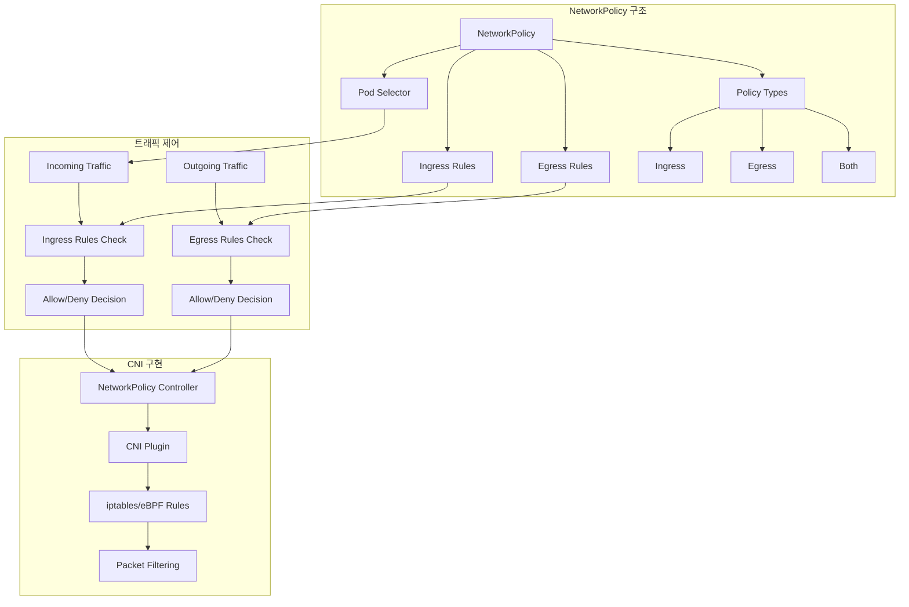
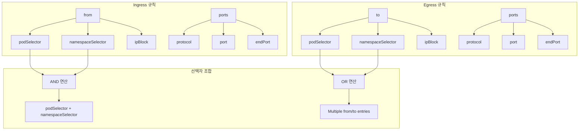
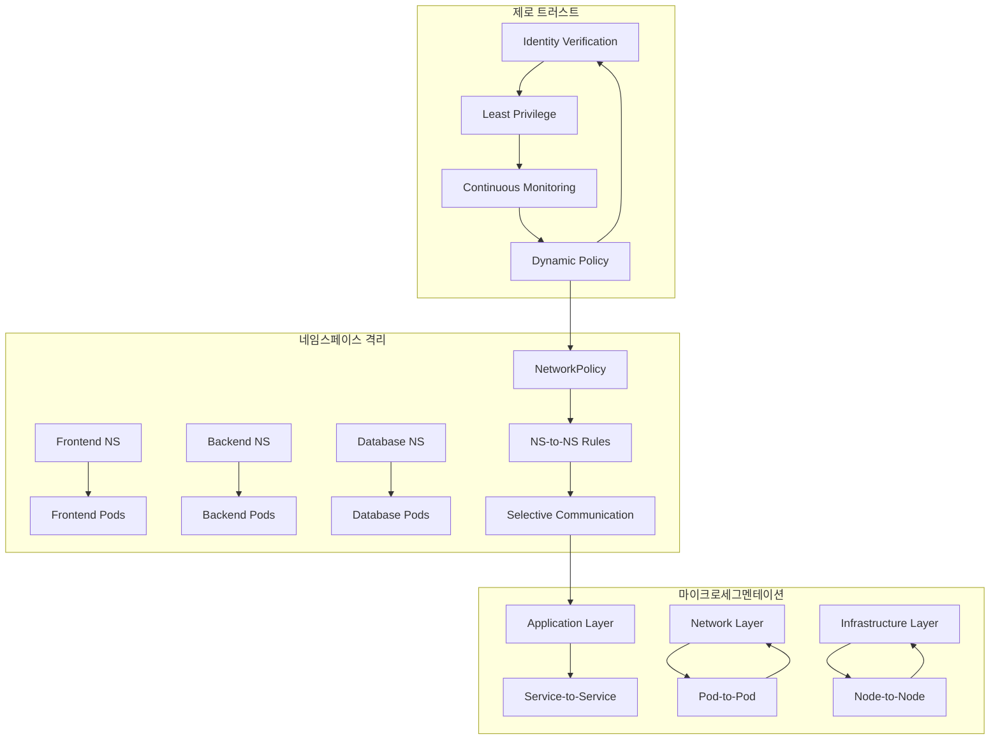
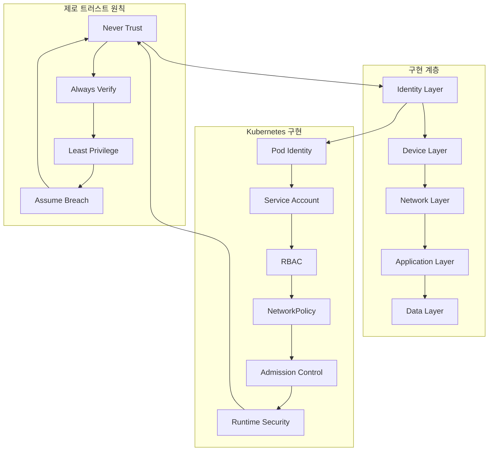

# Session 7: 네트워크 정책과 보안

## 📍 교과과정에서의 위치
이 세션은 **Week 2 > Day 3 > Session 7**로, Kubernetes 클러스터의 네트워크 보안을 담당하는 NetworkPolicy와 보안 모델을 학습합니다. 지금까지 학습한 네트워킹 기술들을 보안 관점에서 통합적으로 이해합니다.

## 학습 목표 (5분)
- **NetworkPolicy** 개념과 **트래픽 제어** 메커니즘 완전 이해
- **Ingress/Egress** 규칙과 **선택자** 패턴 학습
- **네임스페이스** 기반 격리와 **마이크로세그멘테이션** 파악
- **보안 모델**과 **제로 트러스트** 네트워킹 원리 이해

## 1. NetworkPolicy 개념과 트래픽 제어 (15분)

### NetworkPolicy 아키텍처



### NetworkPolicy 상세 분석
```
NetworkPolicy 기본 개념:

정책 기반 네트워크 보안:
   🔹 기본 원칙:
      • 기본적으로 모든 트래픽 허용 (Kubernetes 기본)
      • NetworkPolicy 적용 시 명시적 허용만 가능
      • 화이트리스트 기반 보안 모델
      • Pod 레벨 트래픽 제어
      • 네임스페이스 범위 리소스
   🔹 정책 적용 범위:
      • podSelector로 대상 Pod 선택
      • 네임스페이스 내 Pod만 대상
      • 여러 정책 동시 적용 가능
      • OR 연산으로 규칙 결합
      • 가장 허용적인 정책 적용

정책 타입:
   🔹 Ingress 정책:
      • 들어오는 트래픽 제어
      • 소스 기반 접근 제어
      • 포트 및 프로토콜 제한
      • 외부 접근 차단/허용
      • 서비스 간 통신 제어
   🔹 Egress 정책:
      • 나가는 트래픽 제어
      • 목적지 기반 접근 제어
      • 외부 서비스 접근 제한
      • 데이터 유출 방지
      • 컴플라이언스 요구사항 충족
   🔹 혼합 정책:
      • Ingress + Egress 동시 적용
      • 양방향 트래픽 제어
      • 완전한 네트워크 격리
      • 높은 보안 수준 구현

선택자 패턴:
   🔹 Pod Selector:
      • 라벨 기반 Pod 선택
      • matchLabels: 정확한 매칭
      • matchExpressions: 조건부 매칭
      • 빈 선택자: 모든 Pod 선택
      • 동적 Pod 그룹 관리
   🔹 Namespace Selector:
      • 네임스페이스 기반 선택
      • 크로스 네임스페이스 통신 제어
      • 테넌트 격리 구현
      • 환경별 분리 (dev, prod)
      • 조직 구조 반영
   🔹 IP Block:
      • CIDR 기반 IP 범위 지정
      • 외부 네트워크 접근 제어
      • 레거시 시스템 통합
      • 클라우드 서비스 접근
      • 인터넷 접근 제한

CNI 구현 요구사항:
   🔹 NetworkPolicy 지원 CNI:
      • Calico: 완전한 정책 지원
      • Cilium: eBPF 기반 고성능
      • Weave: 기본 정책 지원
      • Antrea: VMware 개발
      • Flannel: 정책 미지원 (별도 솔루션 필요)
   🔹 구현 메커니즘:
      • iptables 규칙 생성
      • eBPF 프로그램 로드
      • OVS 플로우 규칙
      • 커널 네트워크 스택 통합
      • 실시간 정책 업데이트

정책 우선순위 및 결합:
   🔹 다중 정책 적용:
      • 모든 적용 가능한 정책 수집
      • OR 연산으로 규칙 결합
      • 가장 허용적인 규칙 적용
      • 명시적 거부 없음 (허용 또는 기본 거부)
      • 정책 순서 무관
   🔹 기본 동작:
      • 정책 없음: 모든 트래픽 허용
      • 정책 있음: 명시적 허용만 가능
      • 부분 정책: 해당 방향만 제어
      • 빈 정책: 모든 트래픽 차단
      • 점진적 보안 강화 가능
```

## 2. Ingress/Egress 규칙과 선택자 패턴 (12분)

### 규칙 구조 및 패턴



### 규칙 패턴 상세 분석
```
Ingress/Egress 규칙 패턴:

Ingress 규칙 구조:
   🔹 from 선택자:
      • podSelector: 소스 Pod 선택
         • 동일 네임스페이스 내 Pod
         • 라벨 기반 매칭
         • 빈 선택자: 모든 Pod
         • 마이크로서비스 간 통신 제어
      • namespaceSelector: 소스 네임스페이스 선택
         • 크로스 네임스페이스 통신
         • 테넌트 격리 구현
         • 환경별 접근 제어
         • 조직 경계 반영
      • ipBlock: 외부 IP 범위 지정
         • CIDR 표기법 사용
         • except: 예외 IP 범위
         • 외부 서비스 접근 제어
         • 레거시 시스템 통합
         • 클라우드 서비스 접근
      • 조합 규칙:
      • AND 연산: 동일 from 항목 내
      • OR 연산: 여러 from 항목 간
      • 복잡한 접근 제어 구현
      • 세밀한 권한 관리
   🔹 ports 지정:
      • protocol: TCP, UDP, SCTP
      • port: 단일 포트 또는 이름
      • endPort: 포트 범위 지정
      • 서비스별 포트 제한

Egress 규칙 구조:
   🔹 to 선택자:
      • podSelector: 목적지 Pod 선택
         • 내부 서비스 접근 제어
         • 데이터베이스 접근 제한
         • 서비스 의존성 관리
         • 최소 권한 원칙 적용
      • namespaceSelector: 목적지 네임스페이스
         • 크로스 네임스페이스 호출
         • 공유 서비스 접근
         • 플랫폼 서비스 이용
         • 환경 간 통신 제어
      • ipBlock: 외부 목적지 IP
         • 외부 API 접근 제한
         • 인터넷 접근 차단
         • 클라우드 서비스 허용
         • 데이터 유출 방지
         • 컴플라이언스 준수
      • DNS 기반 제어:
      • FQDN 기반 정책 (일부 CNI)
      • 도메인 이름 허용/차단
      • 동적 IP 서비스 대응
      • 관리 편의성 향상
   🔹 ports 지정:
      • 목적지 포트 제한
      • 프로토콜별 접근 제어
      • 서비스 포트 매핑
      • 보안 포트 차단

일반적인 정책 패턴:
   🔹 기본 거부 정책:
      • 모든 Ingress/Egress 차단
      • 명시적 허용만 가능
      • 제로 트러스트 기반
      • 높은 보안 수준
      • 점진적 권한 부여
   🔹 네임스페이스 격리:
      • 네임스페이스 간 통신 차단
      • 테넌트별 완전 격리
      • 환경별 분리 (dev/prod)
      • 팀별 리소스 격리
      • 멀티 테넌시 구현
   🔹 서비스별 접근 제어:
      • 데이터베이스 접근 제한
      • API 서버 보호
      • 관리 인터페이스 격리
      • 모니터링 시스템 보호
      • 백엔드 서비스 은닉
   🔹 외부 접근 제어:
      • 인터넷 접근 차단
      • 특정 외부 서비스만 허용
      • 지역별 접근 제한
      • 시간 기반 접근 제어 (고급)
      • 데이터 주권 준수

고급 선택자 패턴:
   🔹 라벨 기반 동적 그룹:
      • 환경 라벨: env=production
      • 티어 라벨: tier=frontend
      • 버전 라벨: version=v1.2.0
      • 팀 라벨: team=platform
      • 동적 멤버십 관리
   🔹 표현식 기반 선택:
      • In: 값 목록 포함
      • NotIn: 값 목록 제외
      • Exists: 라벨 존재 확인
      • DoesNotExist: 라벨 부재 확인
      • 복잡한 조건 표현
   🔹 계층적 선택자:
      • 애플리케이션 → 컴포넌트 → 인스턴스
      • 조직 → 팀 → 프로젝트
      • 환경 → 지역 → 가용성 영역
      • 구조화된 접근 제어

정책 검증 및 테스트:
   🔹 정책 시뮬레이션:
      • 실제 적용 전 테스트
      • 영향 범위 분석
      • 의도하지 않은 차단 방지
      • 점진적 롤아웃
   🔹 모니터링 및 로깅:
      • 차단된 연결 로깅
      • 정책 위반 알림
      • 트래픽 패턴 분석
      • 정책 효과성 측정
   🔹 디버깅 도구:
      • kubectl describe networkpolicy
      • CNI별 디버깅 도구
      • 패킷 캡처 분석
      • 연결 테스트 자동화
```

## 3. 네임스페이스 기반 격리와 마이크로세그멘테이션 (10분)

### 마이크로세그멘테이션 아키텍처



### 마이크로세그멘테이션 상세 분석
```
네임스페이스 기반 격리:

네임스페이스 격리 전략:
   🔹 완전 격리 모델:
      • 네임스페이스 간 모든 통신 차단
      • 기본 거부 정책 적용
      • 명시적 허용만 가능
      • 최고 수준 보안
      • 컴플라이언스 요구사항 충족
      • 운영 복잡성 증가
   🔹 선택적 격리 모델:
      • 중요 네임스페이스만 격리
      • 일반 통신은 허용
      • 점진적 보안 강화
      • 운영 편의성 유지
      • 비즈니스 요구사항 반영
      • 위험 기반 접근법
   🔹 계층적 격리 모델:
      • 보안 수준별 네임스페이스 분류
      • 상위 계층 → 하위 계층 접근 허용
      • 동일 계층 간 제한적 통신
      • 하위 → 상위 접근 차단
      • 정보 보안 등급 반영

마이크로세그멘테이션 구현:
   🔹 애플리케이션 레벨:
      • 서비스별 세분화된 정책
      • API 엔드포인트 기반 제어
      • 사용자 권한 기반 접근
      • 비즈니스 로직 반영
      • 데이터 분류 기반 보호
      • 애플리케이션 인식 보안
   🔹 네트워크 레벨:
      • Pod 간 통신 제어
      • 포트 및 프로토콜 제한
      • 트래픽 패턴 기반 정책
      • 지리적 위치 기반 제어
      • 시간 기반 접근 제한
      • 네트워크 행동 분석
   🔹 인프라 레벨:
      • 노드 간 통신 제어
      • 클러스터 경계 보안
      • 하드웨어 기반 격리
      • 가상화 레벨 분리
      • 물리적 네트워크 분할
      • 인프라 보안 통합

세그멘테이션 패턴:
   🔹 수평적 세그멘테이션:
      • 동일 계층 서비스 간 격리
      • 마이크로서비스별 분리
      • 테넌트별 격리
      • 지역별 분할
      • 기능별 그룹화
   🔹 수직적 세그멘테이션:
      • 계층 간 통신 제어
      • 프레젠테이션 → 비즈니스 → 데이터
      • 상하위 계층 접근 제한
      • 권한 상승 방지
      • 데이터 흐름 제어
   🔹 하이브리드 세그멘테이션:
      • 수평 + 수직 조합
      • 복잡한 보안 요구사항 대응
      • 다차원 보안 모델
      • 유연한 정책 적용
      • 비즈니스 복잡성 반영

동적 세그멘테이션:
   🔹 컨텍스트 인식 정책:
      • 사용자 신원 기반
      • 디바이스 상태 기반
      • 위치 정보 기반
      • 시간 및 패턴 기반
      • 위험 점수 기반
   🔹 적응형 보안:
      • 위협 인텔리전스 통합
      • 행동 분석 기반 조정
      • 자동 정책 업데이트
      • 실시간 위험 평가
      • 머신러닝 기반 최적화
   🔹 자동화된 대응:
      • 이상 행동 탐지 시 격리
      • 자동 정책 강화
      • 임시 접근 권한 부여
      • 단계적 권한 축소
      • 자동 복구 메커니즘

구현 도구 및 기술:
   🔹 Kubernetes 네이티브:
      • NetworkPolicy 리소스
      • RBAC 통합
      • Pod Security Standards
      • Admission Controllers
      • 네이티브 보안 기능
   🔹 서비스 메시 통합:
      • Istio Security Policies
      • Linkerd Policy
      • Consul Connect
      • mTLS 자동화
      • L7 보안 정책
   🔹 전문 보안 솔루션:
      • Calico Enterprise
      • Tigera Secure
      • Aqua Security
      • Twistlock/Prisma Cloud
      • 상용 보안 플랫폼

운영 고려사항:
   🔹 정책 관리:
      • GitOps 기반 정책 관리
      • 정책 템플릿 표준화
      • 변경 승인 프로세스
      • 정책 버전 관리
      • 자동화된 배포
   🔹 모니터링 및 감사:
      • 정책 위반 탐지
      • 트래픽 패턴 분석
      • 보안 이벤트 로깅
      • 컴플라이언스 보고
      • 포렌식 분석 지원
   🔹 성능 영향:
      • 정책 처리 오버헤드
      • 네트워크 지연시간 증가
      • 처리량 감소 가능성
      • 리소스 사용량 증가
      • 성능 모니터링 필수
```

## 4. 보안 모델과 제로 트러스트 네트워킹 (10분)

### 제로 트러스트 아키텍처



### 제로 트러스트 상세 분석
```
제로 트러스트 네트워킹:

제로 트러스트 핵심 원칙:
   🔹 Never Trust, Always Verify:
      • 네트워크 위치 기반 신뢰 거부
      • 모든 연결에 대한 인증/인가
      • 지속적인 신원 검증
      • 컨텍스트 기반 접근 제어
      • 동적 신뢰 평가
   🔹 Least Privilege Access:
      • 최소 필요 권한만 부여
      • Just-in-Time 접근
      • 시간 제한 권한
      • 작업 기반 권한 부여
      • 정기적 권한 검토
   🔹 Assume Breach:
      • 침해 가정 하 설계
      • 측면 이동 방지
      • 빠른 탐지 및 대응
      • 피해 범위 최소화
      • 복구 계획 수립

Kubernetes 제로 트러스트 구현:
   🔹 Identity 및 Authentication:
      • Service Account 기반 Pod 신원
      • OIDC 통합 사용자 인증
      • X.509 인증서 기반 mTLS
      • JWT 토큰 기반 인증
      • 외부 Identity Provider 통합
      • 다단계 인증 (MFA) 지원
   🔹 Authorization:
      • RBAC (Role-Based Access Control)
      • ABAC (Attribute-Based Access Control)
      • Webhook 기반 동적 인가
      • OPA (Open Policy Agent) 통합
      • 세밀한 권한 제어
      • 정책 기반 자동화
   🔹 Network Security:
      • NetworkPolicy 기반 마이크로세그멘테이션
      • Service Mesh mTLS
      • Ingress/Egress 트래픽 제어
      • DNS 기반 보안 정책
      • 암호화된 통신 강제
      • 네트워크 행동 분석

서비스 메시 제로 트러스트:
   🔹 Istio 보안 모델:
      • 자동 mTLS 구성
      • SPIFFE/SPIRE 기반 신원
      • JWT 기반 최종 사용자 인증
      • Authorization Policy
      • Security Scanning 통합
      • 보안 텔레메트리
   🔹 Linkerd 보안:
      • 자동 TLS 암호화
      • 경량화된 보안 모델
      • 트래픽 정책 기반 제어
      • 실시간 보안 메트릭
      • 단순한 설정 및 관리
   🔹 Consul Connect:
      • Service Identity 기반
      • Intention 기반 정책
      • 다중 데이터센터 지원
      • 레거시 시스템 통합
      • 동적 서비스 디스커버리

보안 정책 자동화:
   🔹 Policy as Code:
      • Git 기반 정책 관리
      • 코드 리뷰 프로세스
      • 자동화된 정책 배포
      • 버전 관리 및 롤백
      • 테스트 및 검증
      • CI/CD 파이프라인 통합
   🔹 동적 정책 적용:
      • 컨텍스트 기반 정책 조정
      • 위험 점수 기반 제어
      • 실시간 위협 대응
      • 자동 격리 및 차단
      • 적응형 보안 제어
      • 머신러닝 기반 최적화
   🔹 컴플라이언스 자동화:
      • 규정 준수 정책 자동 적용
│   ├��─ 감사 로그 자동 생성
      • 위반 사항 자동 탐지
      • 보고서 자동 생성
      • 지속적 컴플라이언스 모니터링

관찰 가능성 및 모니터링:
   🔹 보안 텔레메트리:
      • 네트워크 트래픽 분석
      • 인증/인가 이벤트 추적
      • 정책 위반 탐지
      • 이상 행동 분석
      • 성능 영향 모니터링
      • 보안 메트릭 수집
   🔹 위협 탐지:
      • 실시간 이상 탐지
      • 행동 기반 분석
      • 위협 인텔리전스 통합
      • 머신러닝 기반 탐지
      • 자동 대응 트리거
      • 포렌식 데이터 수집
   🔹 대시보드 및 알림:
      • 보안 상태 시각화
      • 실시간 위협 알림
      • 컴플라이언스 상태 표시
      • 성능 영향 모니터링
      • 경영진 보고서 생성

구현 로드맵:
   🔹 1단계: 기본 보안 강화
      • RBAC 구현
      • NetworkPolicy 적용
      • Pod Security Standards
      • 기본 모니터링 구축
      • 보안 정책 수립
   🔹 2단계: 고급 보안 기능
      • Service Mesh 도입
      • mTLS 자동화
      • 동적 정책 적용
      • 위협 탐지 시스템
      • 자동화된 대응
   🔹 3단계: 완전한 제로 트러스트
      • 지속적 검증 구현
      • 컨텍스트 인식 정책
      • 머신러닝 기반 보안
      • 완전 자동화
      • 지속적 개선

모범 사례:
   🔹 점진적 구현
   🔹 비즈니스 영향 최소화
   🔹 사용자 경험 고려
   🔹 성능 영향 모니터링
   🔹 지속적 교육 및 훈련
   🔹 정기적 보안 검토
```

## 💬 그룹 토론: 네트워크 보안 정책 설계와 제로 트러스트 (8분)

### 토론 주제
**"Kubernetes 환경에서 제로 트러스트 네트워킹을 구현하기 위한 네트워크 보안 정책 설계 전략과 실무 적용 방안은 무엇인가?"**

## 💡 핵심 개념 정리
- NetworkPolicy: 트래픽 제어, Ingress/Egress 규칙, 선택자 패턴
- 마이크로세그멘테이션: 네임스페이스 격리, 세밀한 접근 제어
- 제로 트러스트: Never Trust Always Verify, 최소 권한, 지속적 검증
- 보안 자동화: Policy as Code, 동적 정책, 컴플라이언스

## 📚 참고 자료
- [Network Policies](https://kubernetes.io/docs/concepts/services-networking/network-policies/)
- [Zero Trust Architecture](https://www.nist.gov/publications/zero-trust-architecture)
- [Kubernetes Security Best Practices](https://kubernetes.io/docs/concepts/security/)

## 다음 세션 준비
다음 세션에서는 **네트워킹 설계 패턴**에 대해 학습합니다.