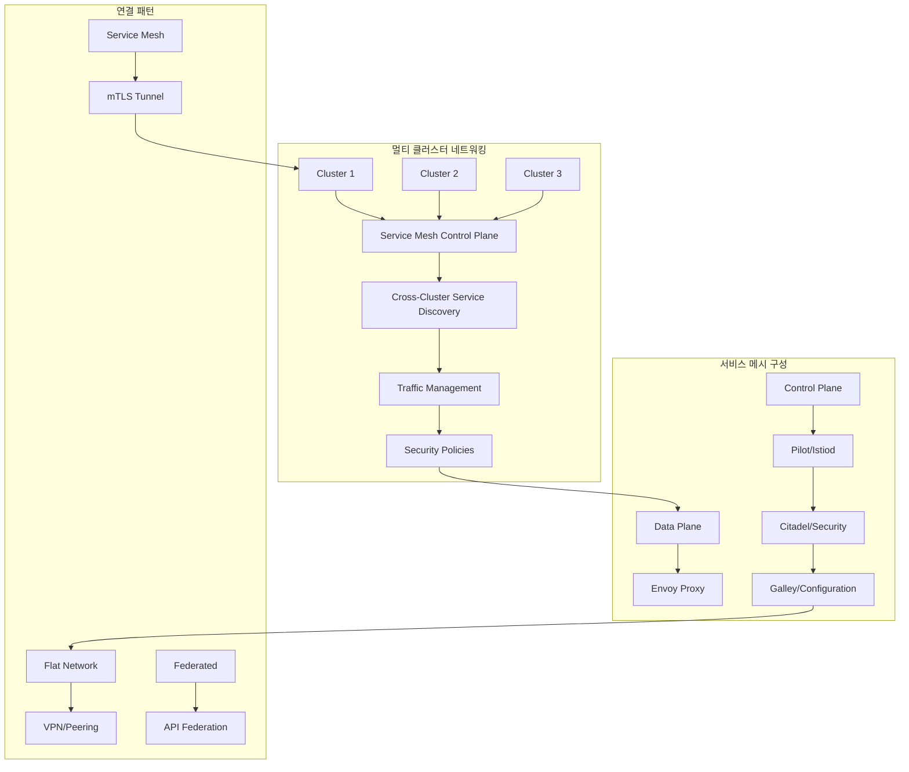
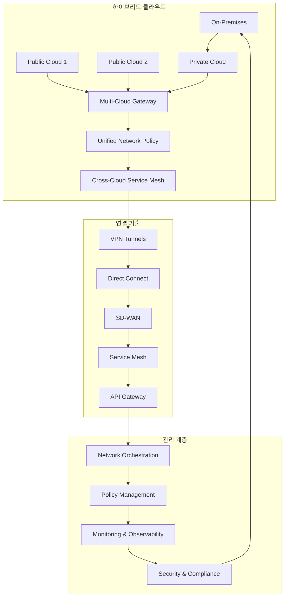
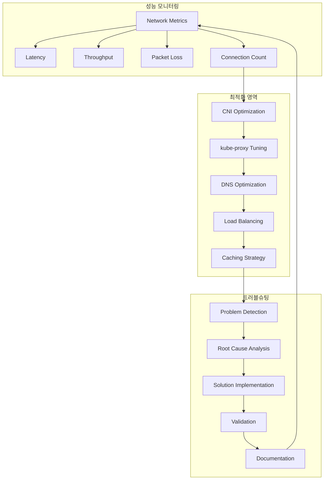
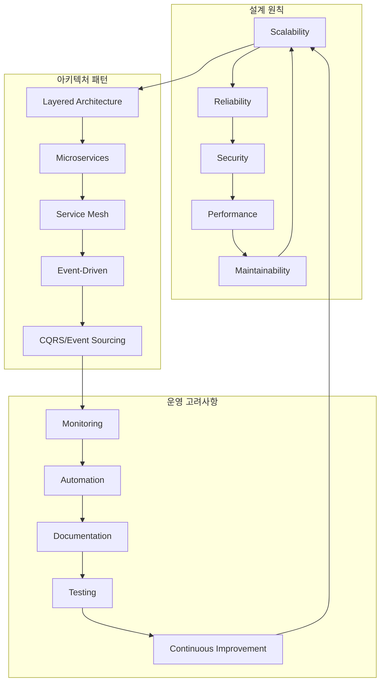

# Session 8: 네트워킹 설계 패턴

## 📍 교과과정에서의 위치
이 세션은 **Week 2 > Day 3 > Session 8**로, Day 3의 마지막 세션입니다. 지금까지 학습한 Kubernetes 네트워킹 기술들을 종합하여 실무에서 사용되는 설계 패턴과 아키텍처 원칙을 정리합니다.

## 학습 목표 (5분)
- **멀티 클러스터** 네트워킹과 **서비스 메시** 아키텍처 완전 이해
- **하이브리드 클라우드** 네트워킹 패턴 학습
- **성능 최적화**와 **트러블슈팅** 방법론 파악
- **네트워킹 아키텍처** 설계 원칙과 **모범 사례** 이해

## 1. 멀티 클러스터 네트워킹과 서비스 메시 (15분)

### 멀티 클러스터 아키텍처



### 멀티 클러스터 네트워킹 상세 분석
```
멀티 클러스터 네트워킹 패턴:

클러스터 연결 모델:
   🔹 Flat Network 모델:
      • 모든 클러스터가 동일 네트워크 평면
      • Pod IP 직접 라우팅 가능
      • 최고 성능과 단순성
      • 네트워크 인프라 의존성 높음
      • 보안 경계 모호
      • 적용 사례:
         • 동일 데이터센터 내 클러스터
         • 클라우드 VPC 피어링
         • 온프레미스 L2/L3 네트워크
         • 개발/테스트 환경
      • 구현 기술:
      • Submariner
      • Cilium Cluster Mesh
      • Calico Federation
      • 커스텀 CNI 확장
   🔹 Federated 모델:
      • API 레벨에서 클러스터 연합
      • 서비스 및 리소스 동기화
      • 중앙집중식 관리
      • 네트워크 독립성 유지
      • 복잡한 설정 및 관리
      • 적용 사례:
         • 지리적 분산 클러스터
         • 클라우드 간 연결
         • 하이브리드 환경
         • 재해 복구 시나리오
      • 구현 기술:
      • Admiral
      • Liqo
      • Virtual Kubelet
      • Cluster API
   🔹 Service Mesh 모델:
      • 애플리케이션 레벨 연결
      • mTLS 기반 보안 터널
      • 고급 트래픽 관리
      • 관찰 가능성 내장
      • 복잡성과 오버헤드 증가
      • 적용 사례:
         • 마이크로서비스 아키텍처
         • 멀티 클라우드 애플리케이션
         • 제로 트러스트 환경
         • 고급 트래픽 제어 필요
      • 구현 기술:
      • Istio Multi-Cluster
      • Linkerd Multi-Cluster
      • Consul Connect
      • AWS App Mesh

서비스 메시 아키텍처:
   🔹 단일 클러스터 서비스 메시:
      • 클러스터 내 모든 서비스 연결
      • 사이드카 프록시 패턴
      • 중앙집중식 제어 평면
      • 자동 mTLS 및 정책 적용
      • 풍부한 텔레메트리
      • 상대적 단순한 운영
   🔹 멀티 클러스터 서비스 메시:
      • 클러스터 간 서비스 연결
      • 분산 제어 평면 또는 중앙 제어
      • 크로스 클러스터 서비스 디스커버리
      • 통합 보안 정책
      • 글로벌 트래픽 관리
      • 복잡한 설정 및 운영
      • 높은 가용성 및 확장성
   🔹 하이브리드 서비스 메시:
      • 클라우드 + 온프레미스 연결
      • 레거시 시스템 통합
      • 점진적 마이그레이션 지원
      • 다양한 네트워크 환경 대응
      • 복잡한 연결 토폴로지

멀티 클러스터 서비스 디스커버리:
   🔹 DNS 기반 디스커버리:
      • 클러스터별 DNS 도메인
      • 크로스 클러스터 DNS 전달
      • 서비스 FQDN 표준화
      • 지리적 라우팅 지원
      • 캐싱 및 성능 최적화
   🔹 레지스트리 기반 디스커버리:
      • 중앙집중식 서비스 레지스트리
      • 동적 서비스 등록/해제
      • 헬스 체크 통합
      • 메타데이터 기반 라우팅
      • API 기반 쿼리 인터페이스
   🔹 서비스 메시 디스커버리:
      • 제어 평면 기반 동기화
      • 자동 엔드포인트 발견
      • 실시간 상태 업데이트
      • 정책 기반 가시성 제어
      • 보안 컨텍스트 통합

트래픽 관리 패턴:
   🔹 지리적 라우팅:
      • 지역별 클러스터 우선 라우팅
      • 지연시간 최적화
      • 데이터 주권 준수
      • 재해 복구 자동화
      • 비용 최적화
   🔹 카나리 배포:
      • 클러스터 간 점진적 배포
      • 트래픽 분할 제어
      • A/B 테스트 지원
      • 자동 롤백 메커니즘
      • 위험 최소화
   🔹 로드 밸런싱:
      • 클러스터 간 부하 분산
      • 가중치 기반 라우팅
      • 헬스 기반 라우팅
      • 용량 기반 분산
      • 동적 가중치 조정
```

## 2. 하이브리드 클라우드 네트워킹 패턴 (12분)

### 하이브리드 클라우드 아키텍처



### 하이브리드 클라우드 패턴 상세 분석
```
하이브리드 클라우드 네트워킹:

연결 패턴:
   🔹 VPN 기반 연결:
      • Site-to-Site VPN
         • IPsec 터널 구성
         • 암호화된 통신
         • 상대적 저비용
         • 인터넷 의존성
         • 대역폭 제한
         • 지연시간 변동성
      • Client-to-Site VPN
         • 원격 접근 지원
         • 사용자별 인증
         • 세밀한 접근 제어
         • 모바일 지원
         • 관리 복잡성
      • Mesh VPN
      • 다중 사이트 연결
      • 동적 라우팅
      • 자동 장애 조치
      • 확장성 우수
      • 설정 복잡성
   🔹 전용선 기반 연결:
      • AWS Direct Connect
         • 전용 네트워크 연결
         • 일관된 성능
         • 높은 대역폭
         • 보안성 우수
         • 높은 비용
         • 구축 시간 소요
      • Azure ExpressRoute
         • 프라이빗 연결
         • 예측 가능한 성능
         • SLA 보장
         • 다중 회선 지원
         • 지역별 가용성
      • Google Cloud Interconnect
         • 전용/파트너 연결
         • 고성능 네트워킹
         • 글로벌 네트워크
         • 유연한 대역폭
         • 비용 효율성
      • 멀티 클라우드 연결
      • 클라우드 간 직접 연결
      • 통합 네트워크 관리
      • 최적화된 라우팅
      • 단일 장애점 제거
      • 복잡한 설정
   🔹 SD-WAN 기반 연결:
      • 소프트웨어 정의 네트워킹
      • 중앙집중식 정책 관리
      • 동적 경로 선택
      • 애플리케이션 인식 라우팅
      • 자동 장애 조치
      • 비용 최적화
      • 클라우드 네이티브 통합

네트워크 정책 통합:
   🔹 통합 보안 정책:
      • 하이브리드 환경 전체 정책 적용
      • 일관된 보안 수준 유지
      • 중앙집중식 정책 관리
      • 자동화된 정책 배포
      • 컴플라이언스 준수
      • 감사 및 모니터링
   🔹 네트워크 세그멘테이션:
      • 환경별 네트워크 분리
      • 워크로드별 격리
      • 데이터 분류 기반 제어
      • 제로 트러스트 구현
      • 측면 이동 방지
   🔹 트래픽 제어:
      • QoS 정책 적용
      • 대역폭 관리
      • 우선순위 기반 라우팅
      • 트래픽 셰이핑
      • 혼잡 제어

데이터 거버넌스:
   🔹 데이터 주권:
      • 지역별 데이터 저장 규정
      • 국경 간 데이터 이동 제한
      • 규정 준수 자동화
      • 데이터 분류 및 태깅
      • 감사 추적 보장
   🔹 데이터 보호:
      • 전송 중 암호화
      • 저장 시 암호화
      • 키 관리 통합
      • 접근 제어 정책
      • 데이터 손실 방지
   🔹 백업 및 복구:
      • 크로스 클라우드 백업
      • 재해 복구 계획
      • RTO/RPO 목표 설정
      • 자동화된 복구
      • 정기적 복구 테스트

운영 모델:
   🔹 중앙집중식 운영:
      • 단일 운영 센터
      • 통합 모니터링
      • 일관된 프로세스
      • 효율적 리소스 활용
      • 전문성 집중
      • 단일 장애점 위험
   🔹 분산 운영:
      • 지역별 운영 센터
      • 로컬 대응 능력
      • 지연시간 최소화
      • 규정 준수 용이
      • 높은 가용성
      • 운영 복잡성 증가
   🔹 하이브리드 운영:
      • 중앙 + 분산 조합
      • 계층적 운영 구조
      • 역할 기반 분담
      • 유연한 대응
      • 최적화된 효율성

비용 최적화:
   🔹 네트워크 비용 관리:
      • 트래픽 패턴 분석
      • 대역폭 최적화
      • 캐싱 전략 활용
      • 압축 기술 적용
      • 피어링 활용
   🔹 리소스 최적화:
      • 워크로드 배치 최적화
      • 오토스케일링 활용
      • 예약 인스턴스 활용
      • 스팟 인스턴스 활용
      • 리소스 풀링
   🔹 운영 비용 절감:
      • 자동화 확대
      • 셀프 서비스 제공
      • 표준화 추진
      • 도구 통합
      • 프로세스 최적화
```

## 3. 성능 최적화와 트러블슈팅 방법론 (10분)

### 성능 최적화 아키텍처



### 성능 최적화 상세 분석
```
네트워크 성능 최적화:

성능 메트릭 및 모니터링:
   🔹 핵심 성능 지표:
      • 지연시간 (Latency)
         • RTT (Round Trip Time)
         • 연결 설정 시간
         • DNS 해결 시간
         • TLS 핸드셰이크 시간
         • 애플리케이션 응답 시간
      • 처리량 (Throughput)
         • 대역폭 활용률
         • 패킷 처리율 (PPS)
         • 연결 처리율 (CPS)
         • 트랜잭션 처리율 (TPS)
         • 데이터 전송률
      • 가용성 (Availability)
         • 업타임 비율
         • 패킷 손실률
         • 연결 실패율
         • 서비스 응답률
         • SLA 준수율
      • 리소스 사용률
      • CPU 사용률
      • 메모리 사용률
      • 네트워크 대역폭
      • 파일 디스크립터
      • 커넥션 풀 사용률
   🔹 모니터링 도구:
      • Prometheus + Grafana
      • Datadog, New Relic
      • Istio/Linkerd 텔레메트리
      • eBPF 기반 도구 (Cilium Hubble)
      • 클라우드 네이티브 모니터링

CNI 성능 최적화:
   🔹 CNI 선택 최적화:
      • 워크로드 특성 분석
      • 성능 벤치마크 수행
      • 확장성 요구사항 고려
      • 기능 vs 성능 트레이드오프
      • 운영 복잡성 평가
   🔹 네트워크 모드 최적화:
      • Host 네트워킹 활용
      • SR-IOV 지원 활용
      • DPDK 기반 가속화
      • 하드웨어 오프로드
      • 커널 우회 기술
   🔹 설정 튜닝:
      • MTU 크기 최적화
      • 버퍼 크기 조정
      • 큐 길이 설정
      • 인터럽트 처리 최적화
      • CPU 어피니티 설정

kube-proxy 최적화:
   🔹 프록시 모드 선택:
      • IPVS 모드 활용
      • eBPF 기반 구현
      • 커널 버전 고려
      • 기능 요구사항 확인
      • 성능 벤치마크 수행
   🔹 설정 최적화:
      • 동기화 주기 조정
      • 연결 추적 설정
      • 세션 어피니티 최적화
      • 헬스 체크 간격 조정
      • 로그 레벨 최적화
   🔹 리소스 할당:
      • CPU/메모리 리소스 충분히 할당
      • 전용 노드 배치 고려
      • 우선순위 클래스 설정
      • 리소스 모니터링

DNS 성능 최적화:
   🔹 CoreDNS 튜닝:
      • 캐시 크기 최적화
      • TTL 설정 조정
      • 업스트림 DNS 최적화
      • 플러그인 체인 최적화
      • 리소스 할당 증대
   🔹 클라이언트 최적화:
      • ndots 값 조정
      • 검색 도메인 최소화
      • DNS 캐싱 활용
      • 연결 풀링
      • 타임아웃 최적화
   🔹 아키텍처 최적화:
      • DNS 서버 분산 배치
      • 지역별 DNS 캐시
      • Anycast DNS 활용
      • 외부 DNS 서비스 활용

트러블슈팅 방법론:
   🔹 문제 탐지:
      • 모니터링 알림 분석
      • 성능 지표 추세 분석
      • 사용자 신고 분석
      • 로그 패턴 분석
      • 자동화된 이상 탐지
   🔹 근본 원인 분석:
      • 계층별 분석 (L2-L7)
      • 패킷 캡처 및 분석
      • 트레이싱 도구 활용
      • 성능 프로파일링
      • 상관관계 분석
   🔹 해결 방안 구현:
      • 임시 해결책 적용
      • 근본 해결책 개발
      • 변경 영향 분석
      • 단계적 적용
      • 롤백 계획 수립
   🔹 검증 및 문서화:
      • 해결 효과 검증
      • 성능 개선 측정
      • 사후 분석 수행
      • 문서화 및 공유
      • 예방 조치 수립

일반적인 성능 문제:
   🔹 네트워크 지연:
      • 물리적 거리
      • 네트워크 홉 수
      • 대역폭 제한
      • 혼잡 제어
      • 프로토콜 오버헤드
   🔹 처리량 제한:
      • CPU 병목
      • 메모리 부족
      • 네트워크 인터페이스 한계
      • 애플리케이션 병목
      • 설정 제한
   🔹 연결 문제:
      • 포트 고갈
      • 연결 풀 부족
      • 타임아웃 설정
      • 방화벽 규칙
      • DNS 해결 실패

성능 테스트 방법론:
   🔹 부하 테스트:
      • 점진적 부하 증가
      • 임계점 탐지
      • 병목 지점 식별
      • 확장성 검증
      • SLA 검증
   🔹 스트레스 테스트:
      • 극한 부하 적용
      • 장애 시나리오 테스트
      • 복구 능력 검증
      • 리소스 한계 확인
      • 안정성 검증
   🔹 지속성 테스트:
      • 장시간 부하 적용
      • 메모리 누수 탐지
      • 성능 저하 모니터링
      • 리소스 사용 패턴 분석
      • 안정성 확인
```

## 4. 네트워킹 아키텍처 설계 원칙과 모범 사례 (10분)

### 설계 원칙 아키텍처



### 설계 원칙 상세 분석
```
네트워킹 아키텍처 설계 원칙:

핵심 설계 원칙:
   🔹 확장성 (Scalability):
      • 수평적 확장 우선 설계
      • 상태 비저장 아키텍처
      • 로드 밸런싱 내장
      • 자동 스케일링 지원
      • 병목 지점 최소화
      • 캐싱 전략 통합
      • 비동기 처리 활용
   🔹 신뢰성 (Reliability):
      • 단일 장애점 제거
      • 다중화 및 이중화
      • 자동 장애 조치
      • 회로 차단기 패턴
      • 재시도 및 백오프
      • 우아한 성능 저하
      • 재해 복구 계획
   🔹 보안 (Security):
      • 심층 방어 전략
      • 제로 트러스트 모델
      • 최소 권한 원칙
      • 암호화 기본 적용
      • 정기적 보안 검토
      • 취약점 관리
      • 컴플라이언스 준수
   🔹 성능 (Performance):
      • 지연시간 최소화
      • 처리량 최대화
      • 리소스 효율성
      • 캐싱 최적화
      • 네트워크 최적화
      • 데이터베이스 최적화
      • 지속적 성능 모니터링
   🔹 유지보수성 (Maintainability):
      • 모듈화 설계
      • 표준화 및 일관성
      • 문서화 충실
      • 테스트 자동화
      • 모니터링 및 로깅
      • 버전 관리
      • 지속적 개선

아키텍처 패턴:
   🔹 계층화 아키텍처:
      • 프레젠테이션 계층
      • 비즈니스 로직 계층
      • 데이터 접근 계층
      • 인프라 계층
      • 명확한 책임 분리
      • 계층 간 의존성 관리
      • 테스트 및 유지보수 용이
   🔹 마이크로서비스 아키텍처:
      • 비즈니스 기능별 분해
      • 독립적 배포 및 확장
      • 기술 스택 다양성
      • 팀 자율성 증대
      • 장애 격리
      • 복잡성 증가
      • 분산 시스템 도전과제
   🔹 서비스 메시 패턴:
      • 서비스 간 통신 추상화
      • 트래픽 관리 중앙화
      • 보안 정책 통합
      • 관찰 가능성 향상
      • 운영 복잡성 증가
      • 성능 오버헤드
   🔹 이벤트 기반 아키텍처:
      • 비동기 통신 패턴
      • 느슨한 결합
      • 확장성 우수
      • 복원력 향상
      • 복잡성 증가
      • 일관성 도전과제

네트워크 설계 모범 사례:
   🔹 네트워크 분할:
      • 환경별 네트워크 분리
      • 보안 영역별 세그멘테이션
      • 트래픽 타입별 분리
      • 성능 요구사항별 분할
      • 관리 복잡성 고려
   🔹 주소 체계 설계:
      • 확장 가능한 IP 주소 계획
      • 서브넷 크기 최적화
      • 예약 주소 공간 확보
      • 라우팅 효율성 고려
      • 표준화된 네이밍 규칙
   🔹 라우팅 설계:
      • 최적 경로 설계
      • 이중화 경로 구성
      • 로드 밸런싱 통합
      • QoS 정책 적용
      • 동적 라우팅 활용
   🔹 보안 설계:
      • 네트워크 정책 표준화
      • 방화벽 규칙 최소화
      • 암호화 통신 강제
      • 접근 제어 자동화
      • 모니터링 및 감사

운영 고려사항:
   🔹 모니터링 전략:
      • 계층별 모니터링
      • 종단간 추적
      • 실시간 알림
      • 대시보드 표준화
      • 메트릭 수집 자동화
      • 용량 계획 데이터
   🔹 자동화 구현:
      • 인프라 코드화 (IaC)
      • CI/CD 파이프라인
      • 자동 배포 및 롤백
      • 자동 스케일링
      • 자동 복구
      • 정책 자동 적용
   🔹 문서화 및 지식 관리:
      • 아키텍처 문서 유지
      • 운영 절차 문서화
      • 트러블슈팅 가이드
      • 모범 사례 공유
      • 교육 및 훈련
      • 지식 베이스 구축
   🔹 테스트 전략:
      • 단위 테스트 자동화
      • 통합 테스트 구현
      • 성능 테스트 정기화
      • 보안 테스트 통합
      • 카오스 엔지니어링
      • 재해 복구 테스트

지속적 개선:
   🔹 성능 최적화:
      • 정기적 성능 검토
      • 병목 지점 식별
      • 최적화 기회 탐색
      • 새로운 기술 평가
      • 벤치마크 업데이트
   🔹 보안 강화:
      • 위협 모델 업데이트
      • 취약점 정기 스캔
      • 보안 정책 개선
      • 침투 테스트 수행
      • 보안 교육 강화
   🔹 운영 효율성:
      • 프로세스 개선
      • 도구 통합 및 자동화
      • 팀 역량 강화
      • 비용 최적화
      • 사용자 경험 개선

성공 요인:
   🔹 명확한 요구사항 정의
   🔹 적절한 기술 선택
   🔹 단계적 구현 접근법
   🔹 충분한 테스트 및 검증
   🔹 지속적 모니터링 및 개선
   🔹 팀 역량 및 문화
   🔹 경영진 지원 및 투자
```

## 💬 그룹 토론: 대규모 환경에서의 네트워킹 아키텍처 설계 (8분)

### 토론 주제
**"대규모 Kubernetes 환경에서 확장성, 성능, 보안을 모두 만족하는 네트워킹 아키텍처를 설계하기 위한 핵심 전략과 실무 경험은 무엇인가?"**

### 토론 가이드라인

#### 아키텍처 설계 전략 (3분)
- 확장성: 멀티 클러스터, 서비스 메시, 자동 스케일링
- 성능: CNI 선택, 최적화 기법, 모니터링
- 보안: 제로 트러스트, 네트워크 정책, 암호화

#### 기술 선택 및 트레이드오프 (3분)
- CNI 구현체: 기능 vs 성능 vs 복잡성
- 서비스 메시: 필요성 vs 오버헤드
- 멀티 클러스터: 연결 방식과 관리 복잡성

#### 실무 적용 경험 (2분)
- 마이그레이션: 기존 시스템에서 전환 경험
- 운영 도전과제: 실제 운영에서 겪은 문제
- 성공 요인: 프로젝트 성공을 위한 핵심 요소

## 💡 핵심 개념 정리
- 멀티 클러스터: Flat Network, Federation, Service Mesh 모델
- 하이브리드 클라우드: VPN, 전용선, SD-WAN 연결 패턴
- 성능 최적화: CNI 튜닝, DNS 최적화, 트러블슈팅 방법론
- 설계 원칙: 확장성, 신뢰성, 보안, 성능, 유지보수성

## 📚 참고 자료
- [Multi-Cluster Networking](https://kubernetes.io/docs/concepts/cluster-administration/networking/#multi-cluster-networking)
- [Network Performance Tuning](https://kubernetes.io/docs/concepts/cluster-administration/networking/#network-performance-tuning)
- [Istio Multi-Cluster](https://istio.io/latest/docs/setup/install/multicluster/)

## Day 3 학습 완료
오늘 학습한 **Kubernetes 네트워킹**의 모든 측면을 완전히 이해했습니다. 내일은 **Kubernetes 스토리지 이론**에 대해 학습하여 데이터 영속성과 스토리지 관리를 심화 학습할 예정입니다.

## 다음 날 준비
내일 **Day 4**에서는 Kubernetes 스토리지의 핵심 개념들을 학습합니다:
- 볼륨과 영구 볼륨
- 스토리지 클래스와 동적 프로비저닝
- 데이터 관리 패턴
- 백업과 복구 전략