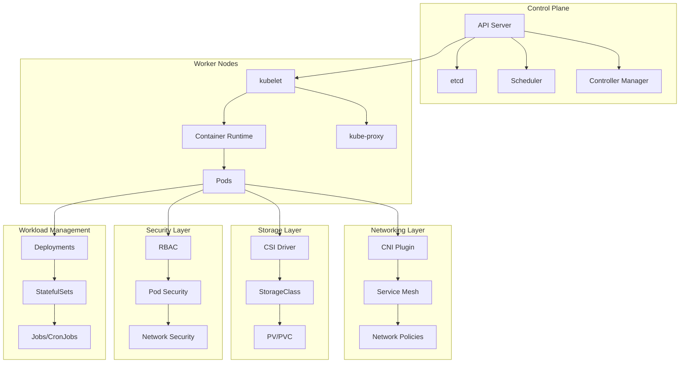

# Session 8: Day 3 종합 정리 및 오케스트레이션 설계

## 📍 교과과정에서의 위치
이 세션은 **Week 2 > Day 3 > Session 8**로, 하루 동안 학습한 컨테이너 오케스트레이션 이론들을 종합 정리하고 실제 환경에 적용 가능한 오케스트레이션 아키텍처 설계 방법론을 심화 분석합니다.

## 학습 목표 (5분)
- **Kubernetes 오케스트레이션** 구성 요소들의 **통합적 이해**
- **실무 시나리오** 기반 **아키텍처 설계** 능력 배양
- **확장성, 보안, 운영성**을 고려한 **종합적 설계** 전략 수립

## 1. 종합 정리: Kubernetes 오케스트레이션 통합 아키텍처 (15분)

### 전체 아키텍처 통합 뷰



### 오케스트레이션 핵심 개념 통합

```
Kubernetes 오케스트레이션 통합 분석:

아키텍처 계층별 역할:
├── 컨트롤 플레인 계층:
│   ├── API 서버: 모든 통신의 중앙 허브
│   ├── etcd: 클러스터 상태의 신뢰할 수 있는 소스
│   ├── 스케줄러: 지능적 워크로드 배치
│   ├── 컨트롤러: 선언적 상태 유지 및 자동화
│   └── 고가용성 및 확장성 보장
├── 워커 노드 계층:
│   ├── kubelet: 노드 에이전트 및 Pod 관리
│   ├── 컨테이너 런타임: 실제 컨테이너 실행
│   ├── kube-proxy: 서비스 추상화 구현
│   └── 리소스 관리 및 모니터링
├── 네트워킹 계층:
│   ├── CNI 플러그인: 컨테이너 네트워킹 표준
│   ├── 서비스 디스커버리: DNS 기반 자동 발견
│   ├── 로드 밸런싱: 트래픽 분산 및 가용성
│   └── 네트워크 정책: 마이크로세그멘테이션
├── 스토리지 계층:
│   ├── CSI 드라이버: 스토리지 백엔드 추상화
│   ├── 동적 프로비저닝: 자동 스토리지 할당
│   ├── 상태 관리: StatefulSet과 영구 볼륨
│   └── 데이터 영속성 및 백업
├── 보안 계층:
│   ├── 인증/권한 부여: 다층 보안 모델
│   ├── RBAC: 세밀한 접근 제어
│   ├── Pod 보안: 런타임 보안 강화
│   └── 네트워크 보안: 트래픽 제어 및 격리
└── 워크로드 관리 계층:
    ├── 배포 전략: 롤링 업데이트, 카나리 배포
    ├── 스케일링: 수평/수직 자동 확장
    ├── 상태 관리: 상태 유지 vs 상태 비저장
    └── 작업 스케줄링: 배치 및 크론 작업

오케스트레이션 설계 원칙:
├── 선언적 구성 (Declarative Configuration):
│   ├── 원하는 상태 정의
│   ├── 자동 상태 조정
│   ├── 버전 관리 및 추적
│   └── GitOps 워크플로우 지원
├── 불변 인프라 (Immutable Infrastructure):
│   ├── 컨테이너 이미지 불변성
│   ├── 설정 외부화
│   ├── 재현 가능한 배포
│   └── 드리프트 방지
├── 마이크로서비스 아키텍처:
│   ├── 서비스 분해 및 독립성
│   ├── API 기반 통신
│   ├── 독립적 배포 및 확장
│   └── 장애 격리 및 복구
├── 관찰가능성 (Observability):
│   ├── 메트릭, 로그, 트레이스 통합
│   ├── 실시간 모니터링
│   ├── 알림 및 대시보드
│   └── 성능 최적화 지원
└── 자동화 우선 (Automation First):
    ├── 인프라 as Code
    ├── CI/CD 파이프라인 통합
    ├── 자동 복구 및 치유
    └── 운영 효율성 극대화
```

## 2. 실무 시나리오 1: 전자상거래 플랫폼 오케스트레이션 설계 (20분)

### 시나리오 요구사항 분석

```
전자상거래 플랫폼 요구사항:

비즈니스 요구사항:
├── 일일 거래량: 100만 건
├── 피크 시간 트래픽: 평상시 대비 10배
├── 글로벌 서비스: 5개 지역, 15개 가용성 영역
├── 가용성: 99.99% (연간 52분 다운타임)
├── 응답 시간: 평균 200ms, 95th percentile 500ms
├── 데이터 일관성: 강한 일관성 (주문, 결제)
├── 컴플라이언스: PCI DSS, GDPR, SOX
└── 비용 최적화: 30% 인프라 비용 절감

기술적 요구사항:
├── 마이크로서비스 아키텍처 (20+ 서비스)
├── 다중 데이터베이스 (PostgreSQL, MongoDB, Redis)
├── 이벤트 기반 아키텍처 (Kafka, RabbitMQ)
├── 실시간 분석 및 추천 시스템
├── 이미지 및 미디어 처리
├── 검색 엔진 (Elasticsearch)
├── 캐싱 계층 (Redis Cluster)
└── 외부 API 통합 (결제, 배송, 알림)

운영 요구사항:
├── 무중단 배포 (Blue-Green, Canary)
├── 자동 스케일링 (트래픽 기반)
├── 재해 복구 (RTO: 15분, RPO: 5분)
├── 보안 모니터링 및 침입 탐지
├── 성능 모니터링 및 APM
├── 로그 중앙집중화 및 분석
├── 백업 및 아카이빙
└── 컴플라이언스 자동 검사
```

### 오케스트레이션 아키텍처 설계

```yaml
# 전자상거래 플랫폼 아키텍처 (개념 예시)

# 1. 네임스페이스 구조
apiVersion: v1
kind: Namespace
metadata:
  name: ecommerce-frontend
  labels:
    tier: frontend
    environment: production
    pod-security.kubernetes.io/enforce: baseline
---
apiVersion: v1
kind: Namespace
metadata:
  name: ecommerce-backend
  labels:
    tier: backend
    environment: production
    pod-security.kubernetes.io/enforce: restricted
---
apiVersion: v1
kind: Namespace
metadata:
  name: ecommerce-data
  labels:
    tier: data
    environment: production
    pod-security.kubernetes.io/enforce: restricted

---
# 2. 프론트엔드 서비스 (React SPA)
apiVersion: apps/v1
kind: Deployment
metadata:
  name: web-frontend
  namespace: ecommerce-frontend
spec:
  replicas: 10
  strategy:
    type: RollingUpdate
    rollingUpdate:
      maxSurge: 50%
      maxUnavailable: 25%
  selector:
    matchLabels:
      app: web-frontend
  template:
    metadata:
      labels:
        app: web-frontend
        version: v1.2.3
    spec:
      topologySpreadConstraints:
      - maxSkew: 1
        topologyKey: topology.kubernetes.io/zone
        whenUnsatisfiable: DoNotSchedule
        labelSelector:
          matchLabels:
            app: web-frontend
      containers:
      - name: frontend
        image: ecommerce/frontend:v1.2.3
        ports:
        - containerPort: 80
        resources:
          requests:
            cpu: 100m
            memory: 128Mi
          limits:
            cpu: 500m
            memory: 512Mi
        livenessProbe:
          httpGet:
            path: /health
            port: 80
          initialDelaySeconds: 30
          periodSeconds: 10
        readinessProbe:
          httpGet:
            path: /ready
            port: 80
          initialDelaySeconds: 5
          periodSeconds: 5

---
# 3. API Gateway
apiVersion: apps/v1
kind: Deployment
metadata:
  name: api-gateway
  namespace: ecommerce-backend
spec:
  replicas: 5
  selector:
    matchLabels:
      app: api-gateway
  template:
    metadata:
      labels:
        app: api-gateway
    spec:
      containers:
      - name: gateway
        image: ecommerce/api-gateway:v2.1.0
        ports:
        - containerPort: 8080
        env:
        - name: RATE_LIMIT_RPS
          value: "1000"
        - name: JWT_SECRET
          valueFrom:
            secretKeyRef:
              name: jwt-secret
              key: secret
        resources:
          requests:
            cpu: 200m
            memory: 256Mi
          limits:
            cpu: 1
            memory: 1Gi

---
# 4. 주문 서비스 (StatefulSet)
apiVersion: apps/v1
kind: StatefulSet
metadata:
  name: order-service
  namespace: ecommerce-backend
spec:
  serviceName: order-service-headless
  replicas: 3
  selector:
    matchLabels:
      app: order-service
  template:
    metadata:
      labels:
        app: order-service
    spec:
      containers:
      - name: order-service
        image: ecommerce/order-service:v1.5.2
        ports:
        - containerPort: 8080
        env:
        - name: DB_HOST
          value: postgres-primary.ecommerce-data.svc.cluster.local
        - name: KAFKA_BROKERS
          value: kafka.ecommerce-data.svc.cluster.local:9092
        volumeMounts:
        - name: order-data
          mountPath: /app/data
  volumeClaimTemplates:
  - metadata:
      name: order-data
    spec:
      accessModes: ["ReadWriteOnce"]
      storageClassName: fast-ssd
      resources:
        requests:
          storage: 50Gi

---
# 5. HPA 구성
apiVersion: autoscaling/v2
kind: HorizontalPodAutoscaler
metadata:
  name: frontend-hpa
  namespace: ecommerce-frontend
spec:
  scaleTargetRef:
    apiVersion: apps/v1
    kind: Deployment
    name: web-frontend
  minReplicas: 5
  maxReplicas: 100
  metrics:
  - type: Resource
    resource:
      name: cpu
      target:
        type: Utilization
        averageUtilization: 70
  - type: Pods
    pods:
      metric:
        name: http_requests_per_second
      target:
        type: AverageValue
        averageValue: "100"
  behavior:
    scaleUp:
      stabilizationWindowSeconds: 60
      policies:
      - type: Percent
        value: 100
        periodSeconds: 15
    scaleDown:
      stabilizationWindowSeconds: 300
      policies:
      - type: Percent
        value: 10
        periodSeconds: 60
```

### 보안 및 네트워크 정책

```yaml
# 네트워크 보안 정책 (개념 예시)
apiVersion: networking.k8s.io/v1
kind: NetworkPolicy
metadata:
  name: frontend-netpol
  namespace: ecommerce-frontend
spec:
  podSelector:
    matchLabels:
      app: web-frontend
  policyTypes:
  - Ingress
  - Egress
  ingress:
  - from:
    - namespaceSelector:
        matchLabels:
          name: ingress-nginx
    ports:
    - protocol: TCP
      port: 80
  egress:
  - to:
    - namespaceSelector:
        matchLabels:
          name: ecommerce-backend
    ports:
    - protocol: TCP
      port: 8080
  - to: []
    ports:
    - protocol: TCP
      port: 53
    - protocol: UDP
      port: 53

---
# RBAC 구성
apiVersion: rbac.authorization.k8s.io/v1
kind: Role
metadata:
  namespace: ecommerce-backend
  name: service-reader
rules:
- apiGroups: [""]
  resources: ["services", "endpoints", "configmaps"]
  verbs: ["get", "list", "watch"]
- apiGroups: [""]
  resources: ["secrets"]
  resourceNames: ["jwt-secret", "db-credentials"]
  verbs: ["get"]

---
apiVersion: rbac.authorization.k8s.io/v1
kind: RoleBinding
metadata:
  name: service-reader-binding
  namespace: ecommerce-backend
subjects:
- kind: ServiceAccount
  name: ecommerce-service-account
  namespace: ecommerce-backend
roleRef:
  kind: Role
  name: service-reader
  apiGroup: rbac.authorization.k8s.io
```

## 3. 실무 시나리오 2: 금융 서비스 컴플라이언스 오케스트레이션 (12분)

### 금융 규제 환경 대응 설계

```
금융 서비스 특수 요구사항:

규제 컴플라이언스:
├── PCI DSS Level 1: 카드 데이터 보호
├── SOX 404: 내부 통제 및 감사
├── Basel III: 리스크 관리 및 자본 적정성
├── GDPR/개인정보보호법: 데이터 프라이버시
├── 금융감독원 규정: 전자금융 감독
├── ISO 27001: 정보보안 관리체계
└── 실시간 거래 모니터링 및 보고

보안 강화 요구사항:
├── 제로 트러스트 아키텍처
├── 종단간 암호화 (E2E Encryption)
├── 다단계 인증 (MFA) 필수
├── 특권 계정 관리 (PAM)
├── 데이터 손실 방지 (DLP)
├── 실시간 사기 탐지 (Fraud Detection)
├── 보안 운영 센터 (SOC) 연동
└── 침입 탐지 및 대응 (IDS/IPS)

데이터 거버넌스:
├── 데이터 분류 및 라벨링
├── 데이터 마스킹 및 익명화
├── 암호화 키 관리 (HSM 연동)
├── 데이터 보관 및 삭제 정책
├── 감사 로그 무결성 보장
├── 데이터 계보 추적 (Data Lineage)
└── 개인정보 처리 동의 관리
```

### 컴플라이언스 자동화 구현

```yaml
# 금융 서비스 보안 강화 구성 (개념 예시)
apiVersion: v1
kind: Namespace
metadata:
  name: banking-core
  labels:
    compliance.level: "pci-dss-level1"
    data.classification: "confidential"
    pod-security.kubernetes.io/enforce: restricted
    pod-security.kubernetes.io/audit: restricted
    pod-security.kubernetes.io/warn: restricted

---
# 보안 강화된 배포
apiVersion: apps/v1
kind: Deployment
metadata:
  name: payment-processor
  namespace: banking-core
  annotations:
    compliance.audit: "required"
    security.scan: "daily"
spec:
  replicas: 3
  selector:
    matchLabels:
      app: payment-processor
  template:
    metadata:
      labels:
        app: payment-processor
        security.level: "high"
      annotations:
        vault.hashicorp.com/agent-inject: "true"
        vault.hashicorp.com/role: "payment-processor"
    spec:
      serviceAccountName: payment-processor-sa
      securityContext:
        runAsNonRoot: true
        runAsUser: 10001
        runAsGroup: 10001
        fsGroup: 10001
        seccompProfile:
          type: RuntimeDefault
      containers:
      - name: payment-processor
        image: banking/payment-processor:v2.1.0-secure
        securityContext:
          allowPrivilegeEscalation: false
          readOnlyRootFilesystem: true
          runAsNonRoot: true
          capabilities:
            drop:
            - ALL
        ports:
        - containerPort: 8443
          protocol: TCP
        env:
        - name: TLS_CERT_PATH
          value: "/etc/tls/tls.crt"
        - name: TLS_KEY_PATH
          value: "/etc/tls/tls.key"
        - name: AUDIT_LOG_LEVEL
          value: "DEBUG"
        volumeMounts:
        - name: tls-certs
          mountPath: /etc/tls
          readOnly: true
        - name: tmp-volume
          mountPath: /tmp
        - name: audit-logs
          mountPath: /var/log/audit
        resources:
          requests:
            cpu: 500m
            memory: 1Gi
          limits:
            cpu: 2
            memory: 4Gi
        livenessProbe:
          httpGet:
            path: /health
            port: 8443
            scheme: HTTPS
          initialDelaySeconds: 30
          periodSeconds: 10
        readinessProbe:
          httpGet:
            path: /ready
            port: 8443
            scheme: HTTPS
          initialDelaySeconds: 5
          periodSeconds: 5
      volumes:
      - name: tls-certs
        secret:
          secretName: payment-processor-tls
      - name: tmp-volume
        emptyDir: {}
      - name: audit-logs
        persistentVolumeClaim:
          claimName: audit-logs-pvc

---
# 감사 로그 수집을 위한 사이드카
apiVersion: apps/v1
kind: DaemonSet
metadata:
  name: audit-log-collector
  namespace: banking-core
spec:
  selector:
    matchLabels:
      app: audit-log-collector
  template:
    metadata:
      labels:
        app: audit-log-collector
    spec:
      serviceAccountName: audit-collector-sa
      containers:
      - name: log-collector
        image: banking/audit-collector:v1.0.0
        securityContext:
          runAsNonRoot: true
          readOnlyRootFilesystem: true
        volumeMounts:
        - name: audit-logs
          mountPath: /var/log/audit
          readOnly: true
        - name: host-logs
          mountPath: /host/var/log
          readOnly: true
        env:
        - name: SIEM_ENDPOINT
          valueFrom:
            secretKeyRef:
              name: siem-config
              key: endpoint
      volumes:
      - name: audit-logs
        hostPath:
          path: /var/log/audit
      - name: host-logs
        hostPath:
          path: /var/log
```

## 4. 오케스트레이션 설계 모범 사례 (5분)

### 설계 원칙 및 패턴

```
오케스트레이션 설계 모범 사례:

아키텍처 설계 원칙:
├── 단일 책임 원칙 (Single Responsibility)
├── 느슨한 결합 (Loose Coupling)
├── 높은 응집도 (High Cohesion)
├── 장애 격리 (Failure Isolation)
├── 확장성 우선 설계 (Scalability First)
├── 보안 내재화 (Security by Design)
└── 관찰가능성 내장 (Built-in Observability)

운영 효율성 패턴:
├── Infrastructure as Code
├── GitOps 워크플로우
├── 자동화된 테스팅
├── 점진적 배포 전략
├── 카오스 엔지니어링
├── 성능 기준선 설정
└── 지속적 최적화

보안 설계 패턴:
├── 제로 트러스트 네트워킹
├── 최소 권한 원칙
├── 심층 방어 (Defense in Depth)
├── 시크릿 외부화
├── 감사 로그 중앙화
└── 자동화된 컴플라이언스 검사
```

## 5. 미래 발전 방향 및 다음 단계 (3분)

### 차세대 오케스트레이션 기술

```
기술 발전 방향:

서버리스 통합:
├── Knative 서버리스 플랫폼
├── 이벤트 기반 스케일링
├── 함수형 워크로드 지원
└── 비용 최적화 자동화

엣지 컴퓨팅:
├── 분산 클러스터 관리
├── 지연시간 최적화
├── 대역폭 효율성
└── 오프라인 운영 지원

AI/ML 운영:
├── MLOps 파이프라인 통합
├── 모델 서빙 최적화
├── GPU 리소스 관리
└── 자동화된 모델 배포

지속가능성:
├── 탄소 발자국 최소화
├── 에너지 효율적 스케줄링
├── 그린 컴퓨팅 전략
└── 환경 영향 모니터링
```

### Week 2 Day 4 예고

```
다음 학습 주제:

고급 Kubernetes 운영:
├── 클러스터 운영 및 관리
├── 업그레이드 및 마이그레이션
├── 성능 튜닝 및 최적화
├── 트러블슈팅 및 디버깅
├── 백업 및 재해 복구
├── 멀티 클러스터 관리
├── 클라우드 네이티브 도구
└── 운영 자동화 전략
```

## 💡 핵심 키워드
- **통합 아키텍처**: 컨트롤 플레인, 워커 노드, 네트워킹, 스토리지, 보안
- **실무 설계**: 전자상거래, 금융 서비스, 컴플라이언스
- **설계 원칙**: 확장성, 보안성, 운영성, 관찰가능성
- **미래 기술**: 서버리스, 엣지, AI/ML, 지속가능성

## 📚 추가 학습 자료
- [Kubernetes 아키텍처 가이드](https://kubernetes.io/docs/concepts/architecture/)
- [클라우드 네이티브 패턴](https://www.cncf.io/blog/2020/11/17/cloud-native-patterns/)
- [Kubernetes 보안 모범 사례](https://kubernetes.io/docs/concepts/security/)
