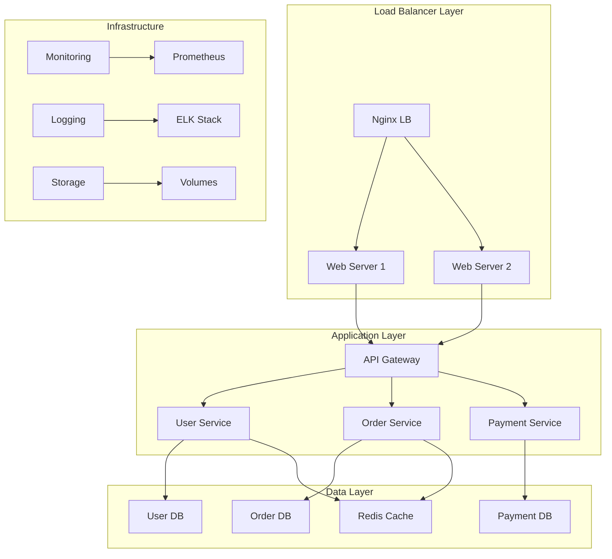

# Session 8: Day 3 종합 실습

## 📍 교과과정에서의 위치
이 세션은 **Week 2 > Day 3 > Session 8**로, Day 3에서 학습한 모든 내용을 통합하여 실제 운영 환경과 유사한 멀티 컨테이너 애플리케이션을 구축합니다.

## 학습 목표 (5분)
- **Day 3 전체 내용** 통합 및 **실무 프로젝트** 구현
- **3-tier 아키텍처** 구축 및 **운영 환경** 시뮬레이션
- **모니터링, 로깅, 네트워킹, 스토리지** 종합 활용

## 1. 이론: 컨테이너 오케스트레이션 개념 (15분)

### 멀티 컨테이너 아키텍처



### 컨테이너 오케스트레이션 원칙

```
오케스트레이션 핵심 개념:

서비스 디스커버리:
├── DNS 기반 이름 해석
├── 서비스 레지스트리
├── 헬스체크 통합
└── 동적 엔드포인트 관리

로드 밸런싱:
├── 라운드 로빈
├── 가중치 기반
├── 헬스 기반 라우팅
└── 세션 어피니티

스케일링:
├── 수평 확장 (Scale Out)
├── 수직 확장 (Scale Up)
├── 자동 스케일링
└── 리소스 기반 스케일링

장애 복구:
├── 헬스체크
├── 자동 재시작
├── 롤링 업데이트
└── 백업 및 복원
```

## 2. 실습: 3-Tier 애플리케이션 구축 (30분)

### 프로젝트 구조 생성

```bash
# 프로젝트 디렉토리 구조
mkdir -p ecommerce-app/{frontend,backend,database,config,monitoring,logs}
cd ecommerce-app

# 네트워크 생성
docker network create --subnet=172.20.0.0/16 ecommerce-frontend
docker network create --subnet=172.21.0.0/16 ecommerce-backend  
docker network create --subnet=172.22.0.0/16 ecommerce-database
docker network create --subnet=172.23.0.0/16 ecommerce-monitoring

# 볼륨 생성
docker volume create ecommerce-db-data
docker volume create ecommerce-cache-data
docker volume create ecommerce-logs
docker volume create ecommerce-config
```

### Frontend Layer 구성

```bash
# Nginx 설정
cat > config/nginx.conf << 'EOF'
events {
    worker_connections 1024;
}

http {
    upstream backend {
        server api-gateway:3000;
    }
    
    upstream monitoring {
        server grafana:3000;
    }
    
    server {
        listen 80;
        server_name localhost;
        
        location / {
            root /usr/share/nginx/html;
            index index.html;
            try_files $uri $uri/ /index.html;
        }
        
        location /api/ {
            proxy_pass http://backend/;
            proxy_set_header Host $host;
            proxy_set_header X-Real-IP $remote_addr;
            proxy_set_header X-Forwarded-For $proxy_add_x_forwarded_for;
        }
        
        location /monitoring/ {
            proxy_pass http://monitoring/;
            proxy_set_header Host $host;
        }
    }
}
EOF

# 웹 애플리케이션 파일
cat > frontend/index.html << 'EOF'
<!DOCTYPE html>
<html>
<head>
    <title>E-commerce Application</title>
    <style>
        body { font-family: Arial, sans-serif; margin: 40px; }
        .container { max-width: 800px; margin: 0 auto; }
        .service { background: #f5f5f5; padding: 20px; margin: 10px 0; border-radius: 5px; }
        button { background: #007cba; color: white; padding: 10px 20px; border: none; border-radius: 3px; cursor: pointer; }
        .status { margin: 10px 0; padding: 10px; border-radius: 3px; }
        .success { background: #d4edda; color: #155724; }
        .error { background: #f8d7da; color: #721c24; }
    </style>
</head>
<body>
    <div class="container">
        <h1>E-commerce Microservices Demo</h1>
        
        <div class="service">
            <h3>User Service</h3>
            <button onclick="testService('/api/users/health')">Test User Service</button>
            <div id="user-status" class="status"></div>
        </div>
        
        <div class="service">
            <h3>Order Service</h3>
            <button onclick="testService('/api/orders/health')">Test Order Service</button>
            <div id="order-status" class="status"></div>
        </div>
        
        <div class="service">
            <h3>Payment Service</h3>
            <button onclick="testService('/api/payments/health')">Test Payment Service</button>
            <div id="payment-status" class="status"></div>
        </div>
        
        <div class="service">
            <h3>System Status</h3>
            <button onclick="getSystemStatus()">Check System Status</button>
            <div id="system-status" class="status"></div>
        </div>
    </div>

    <script>
        async function testService(endpoint) {
            try {
                const response = await fetch(endpoint);
                const data = await response.json();
                const statusDiv = document.getElementById(endpoint.split('/')[2] + '-status');
                statusDiv.className = 'status success';
                statusDiv.innerHTML = `✓ Service healthy: ${JSON.stringify(data)}`;
            } catch (error) {
                const statusDiv = document.getElementById(endpoint.split('/')[2] + '-status');
                statusDiv.className = 'status error';
                statusDiv.innerHTML = `✗ Service error: ${error.message}`;
            }
        }
        
        async function getSystemStatus() {
            const statusDiv = document.getElementById('system-status');
            try {
                const response = await fetch('/api/system/status');
                const data = await response.json();
                statusDiv.className = 'status success';
                statusDiv.innerHTML = `System Status: ${JSON.stringify(data, null, 2)}`;
            } catch (error) {
                statusDiv.className = 'status error';
                statusDiv.innerHTML = `System Error: ${error.message}`;
            }
        }
    </script>
</body>
</html>
EOF

# 로드 밸런서 실행
docker run -d --name load-balancer \
    --network ecommerce-frontend \
    --ip 172.20.0.10 \
    -p 8080:80 \
    -v $(pwd)/config/nginx.conf:/etc/nginx/nginx.conf:ro \
    -v $(pwd)/frontend:/usr/share/nginx/html:ro \
    nginx:alpine

# 웹 서버 인스턴스들
for i in {1..2}; do
    docker run -d --name web-server-$i \
        --network ecommerce-frontend \
        --ip 172.20.0.1$i \
        -v $(pwd)/frontend:/usr/share/nginx/html:ro \
        nginx:alpine
done
```

### Backend Services 구성

```bash
# API Gateway
cat > backend/api-gateway.js << 'EOF'
const express = require('express');
const { createProxyMiddleware } = require('http-proxy-middleware');
const app = express();

app.use(express.json());

// 서비스 라우팅
app.use('/users', createProxyMiddleware({
    target: 'http://user-service:3001',
    changeOrigin: true,
    pathRewrite: { '^/users': '' }
}));

app.use('/orders', createProxyMiddleware({
    target: 'http://order-service:3002',
    changeOrigin: true,
    pathRewrite: { '^/orders': '' }
}));

app.use('/payments', createProxyMiddleware({
    target: 'http://payment-service:3003',
    changeOrigin: true,
    pathRewrite: { '^/payments': '' }
}));

// 시스템 상태 엔드포인트
app.get('/system/status', async (req, res) => {
    const services = [
        { name: 'user-service', url: 'http://user-service:3001/health' },
        { name: 'order-service', url: 'http://order-service:3002/health' },
        { name: 'payment-service', url: 'http://payment-service:3003/health' }
    ];
    
    const status = {};
    for (const service of services) {
        try {
            const response = await fetch(service.url);
            status[service.name] = await response.json();
        } catch (error) {
            status[service.name] = { error: error.message };
        }
    }
    
    res.json({
        timestamp: new Date().toISOString(),
        gateway: 'healthy',
        services: status
    });
});

app.listen(3000, '0.0.0.0', () => {
    console.log('API Gateway running on port 3000');
});
EOF

# 마이크로서비스 템플릿
create_microservice() {
    local service_name=$1
    local port=$2
    
    cat > backend/${service_name}.js << EOF
const express = require('express');
const app = express();

app.use(express.json());

// 헬스체크
app.get('/health', (req, res) => {
    res.json({
        service: '${service_name}',
        status: 'healthy',
        timestamp: new Date().toISOString(),
        uptime: process.uptime()
    });
});

// 서비스별 엔드포인트
app.get('/', (req, res) => {
    res.json({
        service: '${service_name}',
        message: 'Service is running',
        data: []
    });
});

app.post('/', (req, res) => {
    console.log('${service_name} received:', req.body);
    res.json({
        service: '${service_name}',
        message: 'Data processed',
        id: Math.random().toString(36).substr(2, 9)
    });
});

app.listen(${port}, '0.0.0.0', () => {
    console.log('${service_name} running on port ${port}');
});
EOF
}

# 마이크로서비스 생성
create_microservice "user-service" 3001
create_microservice "order-service" 3002  
create_microservice "payment-service" 3003

# package.json 생성
cat > backend/package.json << 'EOF'
{
  "name": "ecommerce-backend",
  "version": "1.0.0",
  "dependencies": {
    "express": "^4.18.2",
    "http-proxy-middleware": "^2.0.6"
  }
}
EOF
```

### Backend 컨테이너 실행

```bash
# API Gateway
docker run -d --name api-gateway \
    --network ecommerce-frontend \
    --network ecommerce-backend \
    --ip 172.21.0.10 \
    -v $(pwd)/backend:/app \
    -w /app \
    node:alpine sh -c 'npm install && node api-gateway.js'

# 마이크로서비스들
docker run -d --name user-service \
    --network ecommerce-backend \
    --ip 172.21.0.11 \
    -v $(pwd)/backend:/app \
    -w /app \
    node:alpine sh -c 'npm install && node user-service.js'

docker run -d --name order-service \
    --network ecommerce-backend \
    --ip 172.21.0.12 \
    -v $(pwd)/backend:/app \
    -w /app \
    node:alpine sh -c 'npm install && node order-service.js'

docker run -d --name payment-service \
    --network ecommerce-backend \
    --ip 172.21.0.13 \
    -v $(pwd)/backend:/app \
    -w /app \
    node:alpine sh -c 'npm install && node payment-service.js'

# API Gateway를 frontend 네트워크에도 연결
docker network connect ecommerce-frontend api-gateway --ip 172.20.0.20
```

### Database Layer 구성

```bash
# MySQL 데이터베이스
docker run -d --name mysql-db \
    --network ecommerce-database \
    --ip 172.22.0.10 \
    -v ecommerce-db-data:/var/lib/mysql \
    -e MYSQL_ROOT_PASSWORD=rootpassword \
    -e MYSQL_DATABASE=ecommerce \
    -e MYSQL_USER=app \
    -e MYSQL_PASSWORD=apppassword \
    mysql:8.0

# Redis 캐시
docker run -d --name redis-cache \
    --network ecommerce-database \
    --ip 172.22.0.11 \
    -v ecommerce-cache-data:/data \
    redis:alpine redis-server --appendonly yes

# MongoDB (추가 데이터 저장소)
docker run -d --name mongodb \
    --network ecommerce-database \
    --ip 172.22.0.12 \
    -v ecommerce-logs:/data/db \
    mongo:latest

# 백엔드 서비스들을 데이터베이스 네트워크에 연결
docker network connect ecommerce-database user-service --ip 172.22.0.21
docker network connect ecommerce-database order-service --ip 172.22.0.22
docker network connect ecommerce-database payment-service --ip 172.22.0.23
```

## 3. 실습: 모니터링 및 로깅 통합 (15분)

### 모니터링 스택 구성

```bash
# Prometheus 설정
cat > monitoring/prometheus.yml << 'EOF'
global:
  scrape_interval: 15s

scrape_configs:
  - job_name: 'prometheus'
    static_configs:
      - targets: ['localhost:9090']
  
  - job_name: 'cadvisor'
    static_configs:
      - targets: ['cadvisor:8080']
  
  - job_name: 'api-gateway'
    static_configs:
      - targets: ['api-gateway:3000']
EOF

# Prometheus
docker run -d --name prometheus \
    --network ecommerce-monitoring \
    --ip 172.23.0.10 \
    -p 9090:9090 \
    -v $(pwd)/monitoring/prometheus.yml:/etc/prometheus/prometheus.yml \
    prom/prometheus

# Grafana
docker run -d --name grafana \
    --network ecommerce-monitoring \
    --ip 172.23.0.11 \
    -p 3000:3000 \
    -e "GF_SECURITY_ADMIN_PASSWORD=admin" \
    grafana/grafana

# cAdvisor
docker run -d --name cadvisor \
    --network ecommerce-monitoring \
    --ip 172.23.0.12 \
    -p 8081:8080 \
    --volume=/:/rootfs:ro \
    --volume=/var/run:/var/run:ro \
    --volume=/sys:/sys:ro \
    --volume=/var/lib/docker/:/var/lib/docker:ro \
    gcr.io/cadvisor/cadvisor:latest

# 모니터링 네트워크를 다른 네트워크에 연결
docker network connect ecommerce-frontend grafana --ip 172.20.0.30
```

### 로깅 시스템 구성

```bash
# ELK Stack 설정
docker run -d --name elasticsearch \
    --network ecommerce-monitoring \
    --ip 172.23.0.20 \
    -p 9200:9200 \
    -e "discovery.type=single-node" \
    -e "ES_JAVA_OPTS=-Xms512m -Xmx512m" \
    elasticsearch:7.17.0

docker run -d --name kibana \
    --network ecommerce-monitoring \
    --ip 172.23.0.21 \
    -p 5601:5601 \
    -e "ELASTICSEARCH_HOSTS=http://elasticsearch:9200" \
    kibana:7.17.0

# Fluentd 설정
mkdir -p monitoring/fluentd
cat > monitoring/fluentd/fluent.conf << 'EOF'
<source>
  @type forward
  port 24224
  bind 0.0.0.0
</source>

<match docker.**>
  @type elasticsearch
  host elasticsearch
  port 9200
  index_name ecommerce-logs
  type_name _doc
</match>
EOF

docker run -d --name fluentd \
    --network ecommerce-monitoring \
    --ip 172.23.0.22 \
    -p 24224:24224 \
    -v $(pwd)/monitoring/fluentd:/fluentd/etc \
    fluent/fluentd:v1.14-1
```

## 4. 실습: 시스템 테스트 및 검증 (10분)

### 애플리케이션 테스트

```bash
# 시스템 테스트 스크립트
cat > test-system.sh << 'EOF'
#!/bin/bash

echo "=== E-commerce Application System Test ==="

# 웹 애플리케이션 접근 테스트
echo "1. Frontend Access Test:"
curl -s http://localhost:8080 | grep -q "E-commerce" && echo "✓ Frontend accessible" || echo "✗ Frontend failed"

# API Gateway 테스트
echo "2. API Gateway Test:"
curl -s http://localhost:8080/api/system/status | jq '.gateway' && echo "✓ API Gateway working" || echo "✗ API Gateway failed"

# 마이크로서비스 테스트
echo "3. Microservices Test:"
for service in users orders payments; do
    response=$(curl -s http://localhost:8080/api/$service/health)
    if echo "$response" | jq -e '.status == "healthy"' >/dev/null; then
        echo "✓ $service service healthy"
    else
        echo "✗ $service service failed"
    fi
done

# 데이터베이스 연결 테스트
echo "4. Database Connection Test:"
docker exec mysql-db mysql -u app -papppassword -e "SELECT 1" >/dev/null 2>&1 && echo "✓ MySQL connected" || echo "✗ MySQL failed"
docker exec redis-cache redis-cli ping | grep -q PONG && echo "✓ Redis connected" || echo "✗ Redis failed"
docker exec mongodb mongosh --eval "db.runCommand('ping')" >/dev/null 2>&1 && echo "✓ MongoDB connected" || echo "✗ MongoDB failed"

# 모니터링 시스템 테스트
echo "5. Monitoring System Test:"
curl -s http://localhost:9090/-/healthy >/dev/null && echo "✓ Prometheus healthy" || echo "✗ Prometheus failed"
curl -s http://localhost:3000/api/health >/dev/null && echo "✓ Grafana healthy" || echo "✗ Grafana failed"
curl -s http://localhost:9200/_cluster/health >/dev/null && echo "✓ Elasticsearch healthy" || echo "✗ Elasticsearch failed"

echo ""
echo "System test completed!"
EOF

chmod +x test-system.sh
./test-system.sh
```

### 부하 테스트

```bash
# 부하 테스트 스크립트
cat > load-test.sh << 'EOF'
#!/bin/bash

echo "=== Load Testing ==="

# 동시 요청 생성
for i in {1..50}; do
    curl -s http://localhost:8080/api/users/health >/dev/null &
    curl -s http://localhost:8080/api/orders/health >/dev/null &
    curl -s http://localhost:8080/api/payments/health >/dev/null &
done

echo "Generated 150 concurrent requests..."

# 부하 중 시스템 상태 모니터링
sleep 2
echo "System status during load:"
docker stats --no-stream --format "table {{.Name}}\t{{.CPUPerc}}\t{{.MemUsage}}" | head -10

wait
echo "Load test completed!"
EOF

chmod +x load-test.sh
./load-test.sh
```

## 5. Q&A 및 정리 (5분)

### 시스템 아키텍처 검증

```bash
# 최종 시스템 상태 확인
echo "=== Final System Architecture Validation ==="

# 네트워크 토폴로지 확인
echo "Network Topology:"
for network in ecommerce-frontend ecommerce-backend ecommerce-database ecommerce-monitoring; do
    echo "Network: $network"
    docker network inspect $network --format '{{range .Containers}}  {{.Name}} ({{.IPv4Address}}){{end}}' | tr ' ' '\n' | grep -v '^$'
done

# 볼륨 사용 현황
echo ""
echo "Volume Usage:"
docker volume ls --filter name=ecommerce

# 서비스 상태 요약
echo ""
echo "Service Status Summary:"
docker ps --format "table {{.Names}}\t{{.Status}}\t{{.Ports}}" | grep -E "(load-balancer|api-gateway|user-service|order-service|payment-service|mysql-db|redis-cache|prometheus|grafana)"

# 접속 정보
cat > access-info.md << 'EOF'
# E-commerce Application Access Information

## Application URLs
- **Main Application**: http://localhost:8080
- **API Gateway**: http://localhost:8080/api/system/status
- **Load Balancer**: http://localhost:8080

## Monitoring & Management
- **Prometheus**: http://localhost:9090
- **Grafana**: http://localhost:3000 (admin/admin)
- **Kibana**: http://localhost:5601
- **cAdvisor**: http://localhost:8081

## Architecture Summary
- **Frontend**: Nginx Load Balancer + Web Servers
- **Backend**: API Gateway + 3 Microservices
- **Database**: MySQL + Redis + MongoDB
- **Monitoring**: Prometheus + Grafana + ELK Stack

## Network Segmentation
- Frontend Network: 172.20.0.0/16
- Backend Network: 172.21.0.0/16
- Database Network: 172.22.0.0/16
- Monitoring Network: 172.23.0.0/16

## Data Persistence
- Database Data: ecommerce-db-data volume
- Cache Data: ecommerce-cache-data volume
- Logs: ecommerce-logs volume
- Configuration: ecommerce-config volume
EOF

echo "Access information created: access-info.md"
echo ""
echo "✅ Day 3 comprehensive project completed successfully!"
echo "🌐 Access your application at: http://localhost:8080"
```

## 💡 핵심 키워드
- **멀티 컨테이너 아키텍처**: 3-tier, 마이크로서비스, 서비스 메시
- **네트워크 세그멘테이션**: Frontend, Backend, Database, Monitoring
- **데이터 영속성**: 볼륨 관리, 백업 전략, 상태 관리
- **운영 관찰성**: 모니터링, 로깅, 알림, 대시보드

## 📚 참고 자료
- [Docker Compose 대안](https://docs.docker.com/compose/)
- [마이크로서비스 패턴](https://microservices.io/patterns/)
- [컨테이너 오케스트레이션](https://kubernetes.io/docs/concepts/)

## 🔧 실습 체크리스트
- [ ] 3-tier 아키텍처 구현 완료
- [ ] 네트워크 세그멘테이션 적용
- [ ] 마이크로서비스 간 통신 구현
- [ ] 모니터링 및 로깅 시스템 통합
- [ ] 부하 테스트 및 시스템 검증
