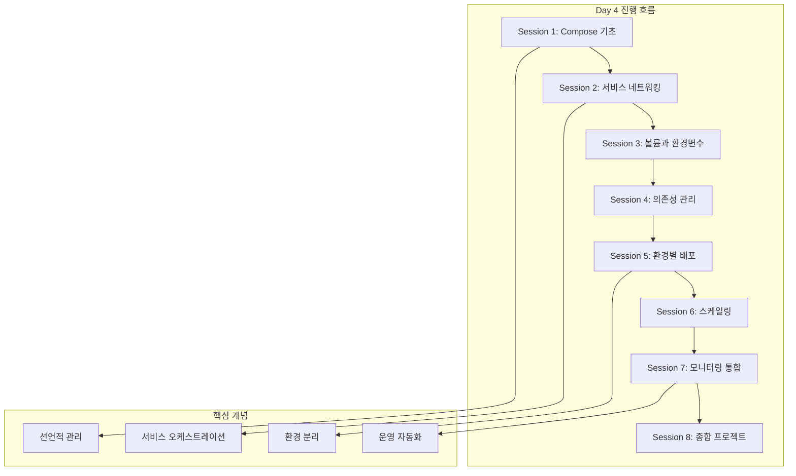

# Week 2 - Day 4: Docker Compose와 멀티 컨테이너 관리

## 📍 교과과정에서의 위치
**Week 2 > Day 4**는 Day 3에서 학습한 개별 컨테이너 관리 기술을 바탕으로, Docker Compose를 활용한 멀티 컨테이너 애플리케이션의 선언적 관리와 오케스트레이션을 학습합니다.

## 🎯 학습 목표
- **Docker Compose** 문법과 **YAML 구성** 완전 이해
- **서비스 정의**와 **의존성 관리** 실무 활용
- **환경별 배포** 전략 및 **스케일링** 기법
- **개발 워크플로우** 최적화 및 **CI/CD 연동**

## 📚 Day 4 세션 구성

### Session 1: Docker Compose 기초
- **이론 (20분)**: Compose 개념과 YAML 문법
- **실습 (25분)**: 기본 서비스 정의 및 실행
- **Q&A (5분)**: Compose vs 개별 컨테이너 관리

### Session 2: 서비스 정의와 네트워킹
- **이론 (20분)**: 서비스 간 통신과 네트워크 구성
- **실습 (25분)**: 멀티 서비스 애플리케이션 구축
- **Q&A (5분)**: 네트워크 설계 모범 사례

### Session 3: 볼륨과 환경 변수 관리
- **이론 (20분)**: 데이터 영속성과 설정 관리
- **실습 (25분)**: 볼륨 마운트와 환경별 설정
- **Q&A (5분)**: 보안 및 설정 관리 전략

### Session 4: 의존성과 헬스체크
- **이론 (20분)**: 서비스 의존성과 시작 순서
- **실습 (25분)**: 헬스체크와 재시작 정책
- **Q&A (5분)**: 장애 복구 전략

### Session 5: 환경별 배포 전략
- **이론 (20분)**: 개발/스테이징/프로덕션 환경 관리
- **실습 (25분)**: Override 파일과 프로파일 활용
- **Q&A (5분)**: 배포 자동화 방안

### Session 6: 스케일링과 로드 밸런싱
- **이론 (20분)**: 수평 확장과 부하 분산
- **실습 (25분)**: 서비스 스케일링 실습
- **Q&A (5분)**: 성능 최적화 기법

### Session 7: 모니터링과 로깅 통합
- **이론 (20분)**: Compose 환경에서의 관찰성
- **실습 (25분)**: 통합 모니터링 스택 구축
- **Q&A (5분)**: 운영 환경 모니터링

### Session 8: Day 4 종합 프로젝트
- **이론 (15분)**: 프로덕션 배포 고려사항
- **실습 (30분)**: 완전한 애플리케이션 스택 구축
- **Q&A (5분)**: Day 4 내용 정리 및 질의응답

## 🔄 이론-실습 비율
```
각 세션: ████████████ 40% 이론 + ████████████████████ 60% 실습
```

## 🛠 실습 환경
- **Docker Compose** v2.x 이상
- **YAML 편집기** (VS Code 권장)
- **Git** (버전 관리)
- **curl, jq** (API 테스트)

## 📊 Day 4 학습 로드맵



## 🎯 Day 4 완료 후 성취 목표
- [ ] Docker Compose 파일 작성 및 관리 능력
- [ ] 멀티 서비스 애플리케이션 오케스트레이션
- [ ] 환경별 배포 전략 수립 및 실행
- [ ] 스케일링과 로드 밸런싱 구현
- [ ] 통합 모니터링 및 로깅 시스템 구축

## 📚 참고 자료
- [Docker Compose 공식 문서](https://docs.docker.com/compose/)
- [Compose 파일 레퍼런스](https://docs.docker.com/compose/compose-file/)
- [Compose 네트워킹](https://docs.docker.com/compose/networking/)

## 🔗 연계 학습
- **Day 3 연결**: 개별 컨테이너 관리 → 멀티 컨테이너 오케스트레이션
- **Day 5 준비**: Docker Compose → Kubernetes 기초 개념
- **Week 3 연결**: 로컬 오케스트레이션 → 클러스터 오케스트레이션

---
*Day 4에서는 Docker Compose를 통해 복잡한 멀티 컨테이너 애플리케이션을 선언적으로 관리하는 현대적 접근법을 학습합니다.*
