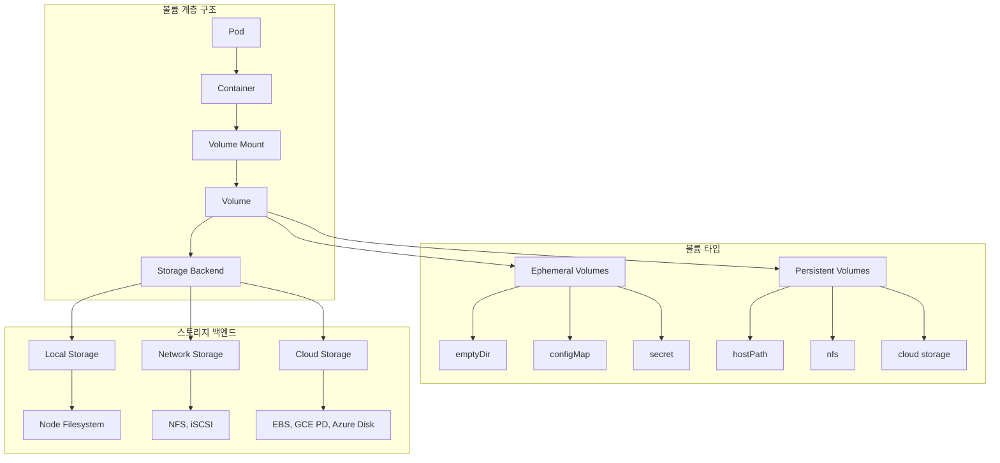
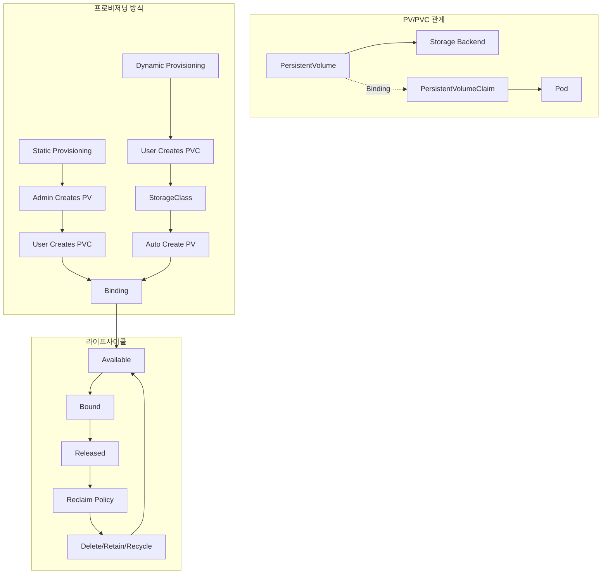
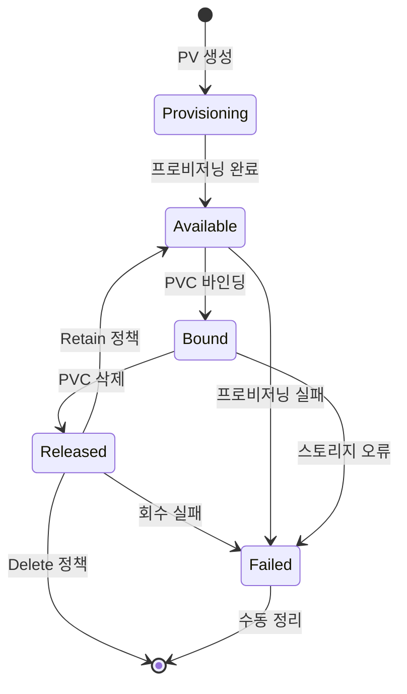
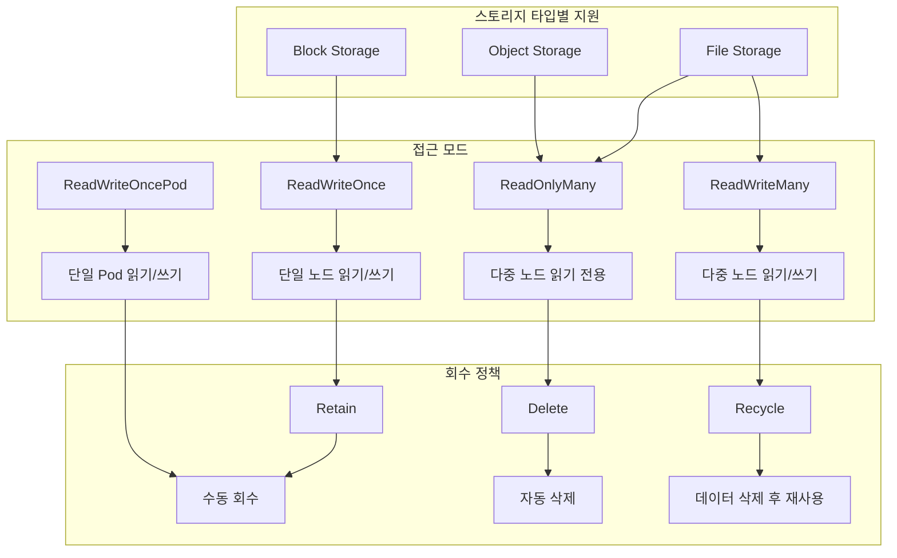

# Session 1: 볼륨과 영구 볼륨 개념

## 📍 교과과정에서의 위치
이 세션은 **Week 2 > Day 4 > Session 1**로, Kubernetes 스토리지의 기본 개념인 볼륨과 영구 볼륨을 학습합니다. Day 2-3에서 학습한 오브젝트와 네트워킹을 바탕으로 데이터 영속성이 어떻게 구현되는지 이해합니다.

## 학습 목표 (5분)
- **볼륨** 기본 개념과 **타입별** 특징 완전 이해
- **영구 볼륨**과 **영구 볼륨 클레임** 관계 학습
- **볼륨 라이프사이클**과 **바인딩** 메커니즘 파악
- **접근 모드**와 **회수 정책** 이해

## 1. 볼륨 기본 개념과 타입별 특징 (15분)

### 볼륨 아키텍처 개요



### 볼륨 개념 상세 분석
```
Kubernetes 볼륨 기본 개념:

볼륨의 필요성:
   🔹 컨테이너 파일시스템 한계:
      • 컨테이너 재시작 시 데이터 손실
      • 임시적인 파일시스템
      • 컨테이너 간 데이터 공유 불가
      • 호스트와 데이터 공유 제한
      • 영구 데이터 저장 불가능
   🔹 볼륨을 통한 해결:
      • 데이터 영속성 보장
      • 컨테이너 간 데이터 공유
      • 호스트와 데이터 교환
      • 외부 스토리지 연결
      • 백업 및 복구 지원

볼륨 vs 도커 볼륨:
   🔹 Docker 볼륨:
      • 호스트 기반 볼륨 관리
      • 단일 호스트 범위
      • 제한적인 볼륨 타입
      • 수동 관리 필요
      • 오케스트레이션 지원 부족
   🔹 Kubernetes 볼륨:
      • 클러스터 레벨 볼륨 관리
      • 다중 노드 지원
      • 다양한 볼륨 타입
      • 자동화된 관리
      • 오케스트레이션 통합

볼륨 타입 분류:
   🔹 임시 볼륨 (Ephemeral Volumes):
      • emptyDir:
         • Pod 생성 시 빈 디렉토리 생성
         • Pod 삭제 시 데이터 삭제
         • 컨테이너 간 데이터 공유
         • 임시 캐시 및 스크래치 공간
         • 메모리 기반 저장 가능 (tmpfs)
         • 사용 사례: 로그 수집, 임시 파일
      • configMap:
         • ConfigMap 리소스를 파일로 마운트
         • 설정 파일 및 환경 변수
         • 읽기 전용 볼륨
         • 동적 설정 업데이트 가능
         • 사용 사례: 애플리케이션 설정
      • secret:
         • Secret 리소스를 파일로 마운트
         • 민감한 정보 저장
         • 읽기 전용 볼륨
         • 메모리 기반 저장 (tmpfs)
         • 사용 사례: 인증서, 패스워드
      • downwardAPI:
      • Pod/Container 메타데이터 노출
      • 라벨, 어노테이션, 리소스 정보
      • 읽기 전용 볼륨
      • 사용 사례: 모니터링, 로깅
   🔹 영구 볼륨 (Persistent Volumes):
      • hostPath:
         • 호스트 노드의 파일시스템 마운트
         • 노드별 로컬 스토리지
         • 개발/테스트 환경 주로 사용
         • 보안 위험 존재
         • 프로덕션 환경 비권장
      • 네트워크 스토리지:
         • nfs: Network File System
         • iscsi: Internet Small Computer Systems Interface
         • cephfs: Ceph File System
         • glusterfs: GlusterFS
         • 다중 노드 접근 가능
      • 클라우드 스토리지:
         • awsElasticBlockStore (EBS)
         • gcePersistentDisk (GCE PD)
         • azureDisk/azureFile
         • 클라우드 네이티브 통합
         • 고가용성 및 확장성
      • CSI 볼륨:
      • Container Storage Interface 표준
      • 벤더 중립적 인터페이스
      • 플러그인 기반 확장
      • 동적 프로비저닝 지원
      • 미래 지향적 표준

볼륨 마운트 메커니즘:
   🔹 볼륨 정의 (Pod.spec.volumes):
      • 볼륨 이름 지정
      • 볼륨 타입 선택
      • 볼륨별 설정 매개변수
      • 다중 볼륨 정의 가능
   🔹 볼륨 마운트 (Container.volumeMounts):
      • 마운트 경로 지정
      • 읽기/쓰기 권한 설정
      • 서브 경로 마운트 가능
      • 마운트 전파 설정
      • 컨테이너별 개별 마운트
   🔹 마운트 옵션:
      • readOnly: 읽기 전용 마운트
      • subPath: 볼륨 내 특정 경로
      • subPathExpr: 동적 서브 경로
      • mountPropagation: 마운트 전파
      • 볼륨별 특화 옵션
```

## 2. 영구 볼륨과 영구 볼륨 클레임 관계 (12분)

### PV/PVC 아키텍처



### PV/PVC 상세 분석
```
PersistentVolume과 PersistentVolumeClaim:

PV/PVC 분리 설계:
   🔹 관심사 분리 (Separation of Concerns):
      • PV: 스토리지 리소스 추상화
      • PVC: 스토리지 요구사항 명세
      • 인프라 관리자 vs 애플리케이션 개발자
      • 스토리지 세부사항 은닉
      • 재사용 가능한 스토리지 리소스
   🔹 역할 분담:
      • 클러스터 관리자: PV 생성 및 관리
      • 애플리케이션 개발자: PVC 생성 및 사용
      • 스토리지 세부사항 추상화
      • 보안 및 정책 분리
      • 운영 효율성 향상

PersistentVolume (PV):
   🔹 클러스터 리소스:
      • 네임스페이스 독립적
      • 클러스터 전체에서 공유 가능
      • 관리자가 사전 프로비저닝
      • 실제 스토리지와 연결
      • 스토리지 용량 및 특성 정의
   🔹 PV 스펙 구성:
      • capacity: 스토리지 용량
      • accessModes: 접근 모드
      • persistentVolumeReclaimPolicy: 회수 정책
      • storageClassName: 스토리지 클래스
      • volumeMode: 볼륨 모드 (Filesystem/Block)
      • mountOptions: 마운트 옵션
      • 볼륨 타입별 특화 설정
   🔹 PV 상태:
      • Available: 사용 가능한 상태
      • Bound: PVC와 바인딩된 상태
      • Released: PVC 삭제 후 상태
      • Failed: 회수 실패 상태
      • 상태 전이 자동 관리

PersistentVolumeClaim (PVC):
   🔹 네임스페이스 리소스:
      • 특정 네임스페이스에 속함
      • Pod에서 볼륨으로 참조
      • 스토리지 요구사항 명세
      • 적절한 PV와 자동 바인딩
      • 애플리케이션 중심 관점
   🔹 PVC 스펙 구성:
      • resources: 요청 리소스 (용량)
      • accessModes: 필요한 접근 모드
      • storageClassName: 원하는 스토리지 클래스
      • selector: PV 선택 조건
      • volumeMode: 볼륨 모드
      • dataSource: 데이터 소스 (스냅샷 등)
   🔹 PVC 상태:
      • Pending: 적절한 PV 대기 중
      • Bound: PV와 바인딩 완료
      • Lost: 바인딩된 PV 손실
      • 바인딩 상태 추적

바인딩 메커니즘:
   🔹 바인딩 조건:
      • 용량: PV 용량 >= PVC 요청 용량
      • 접근 모드: PV와 PVC 접근 모드 일치
      • 스토리지 클래스: 동일한 스토리지 클래스
      • 선택자: PVC 선택자와 PV 라벨 매칭
      • 볼륨 모드: Filesystem 또는 Block 일치
   🔹 바인딩 과정:
      • PVC 생성 시 적절한 PV 검색
      • 조건 만족하는 PV 중 최적 선택
      • 1:1 바인딩 관계 설정
      • 바인딩 정보 양방향 업데이트
      • 바인딩 완료 후 Pod에서 사용 가능
      • 바인딩은 영구적 (PVC 삭제 전까지)
   🔹 바인딩 우선순위:
      • 정확한 용량 매칭 우선
      • 작은 용량 PV 우선 선택
      • 라벨 선택자 조건 우선
      • 생성 시간 순서 고려
      • 스토리지 클래스 정책 반영

동적 vs 정적 프로비저닝:
   🔹 정적 프로비저닝:
      • 관리자가 미리 PV 생성
      • 사전 정의된 스토리지 풀
      • 예측 가능한 리소스 관리
      • 수동 관리 부담
      • 리소스 낭비 가능성
      • 엄격한 용량 계획 필요
   🔹 동적 프로비저닝:
      • PVC 생성 시 자동 PV 생성
      • StorageClass 기반 자동화
      • 필요 시점 리소스 할당
      • 효율적 리소스 활용
      • 관리 부담 감소
      • 클라우드 환경 최적화
```

## 3. 볼륨 라이프사이클과 바인딩 메커니즘 (10분)

### 볼륨 라이프사이클



### 라이프사이클 상세 분석
```
볼륨 라이프사이클 관리:

PV 라이프사이클 단계:
   🔹 Provisioning (프로비저닝):
      • 정적 프로비저닝: 관리자가 수동 생성
      • 동적 프로비저닝: StorageClass 기반 자동 생성
      • 스토리지 백엔드와 연결 설정
      • PV 리소스 클러스터에 등록
      • Available 상태로 전이
   🔹 Available (사용 가능):
      • PVC 바인딩 대기 상태
      • 바인딩 조건 만족하는 PVC 검색
      • 여러 PVC 중 최적 매칭 선택
      • 바인딩 가능한 상태 유지
      • Bound 상태로 전이 가능
   🔹 Bound (바인딩됨):
      • 특정 PVC와 1:1 바인딩 상태
      • Pod에서 실제 사용 가능
      • 바인딩 해제 불가 (PVC 삭제 전까지)
      • 스토리지 사용 중 상태
      • PVC 삭제 시 Released로 전이
   🔹 Released (해제됨):
      • PVC 삭제 후 상태
      • 데이터는 여전히 존재
      • 회수 정책에 따라 처리
      • 새로운 PVC 바인딩 불가
      • 회수 정책 실행 대기
   🔹 Failed (실패):
      • 회수 정책 실행 실패
      • 스토리지 백엔드 오류
      • 수동 개입 필요
      • 데이터 복구 또는 정리 필요
      • 관리자 조치 후 재사용 가능

PVC 라이프사이클:
   🔹 Pending (대기):
      • PVC 생성 직후 상태
      • 적절한 PV 검색 중
      • 바인딩 조건 만족하는 PV 대기
      • 동적 프로비저닝 진행 중
      • Bound 상태로 전이 대기
   🔹 Bound (바인딩됨):
      • PV와 성공적으로 바인딩
      • Pod에서 볼륨으로 사용 가능
      • 스토리지 리소스 확보 완료
      • 애플리케이션 사용 준비 완료
      • PVC 삭제 시까지 유지
   🔹 Lost (손실):
      • 바인딩된 PV가 삭제됨
      • 스토리지 백엔드 장애
      • 데이터 접근 불가 상태
      • 복구 또는 재생성 필요
      • 드물게 발생하는 상태

바인딩 세부 메커니즘:
   🔹 바인딩 컨트롤러:
      • PV/PVC 상태 지속적 모니터링
      • 바인딩 조건 검사 및 매칭
      • 바인딩 관계 설정 및 업데이트
      • 바인딩 실패 시 재시도
      • 상태 변경 이벤트 처리
   🔹 매칭 알고리즘:
      • 용량 기반 필터링
      • 접근 모드 호환성 검사
      • 스토리지 클래스 일치 확인
      • 라벨 선택자 조건 평가
      • 최적 PV 선택 (용량, 생성 시간)
      • 바인딩 관계 원자적 설정
   🔹 바인딩 정보:
      • PV.spec.claimRef: 바인딩된 PVC 참조
      • PVC.spec.volumeName: 바인딩된 PV 이름
      • 양방향 참조 관계 설정
      • UID 기반 정확한 참조
      • 바인딩 무결성 보장

볼륨 사용 과정:
   🔹 Pod 생성 및 볼륨 마운트:
      • Pod 스펙에 PVC 참조
      • kubelet이 PVC 상태 확인
      • 바인딩된 PV 정보 조회
      • 스토리지 백엔드 마운트
      • 컨테이너 내 경로에 마운트
      • 애플리케이션 사용 가능
   🔹 볼륨 언마운트:
      • Pod 삭제 시 자동 언마운트
      • 스토리지 백엔드 연결 해제
      • PV/PVC 바인딩 관계 유지
      • 데이터는 PV에 보존
      • 다른 Pod에서 재사용 가능
   🔹 정리 과정:
      • PVC 삭제 시 PV Released 상태
      • 회수 정책에 따른 처리
      • 데이터 보존 또는 삭제
      • PV 재사용 또는 제거
      • 스토리지 리소스 회수
```

## 4. 접근 모드와 회수 정책 (10분)

### 접근 모드와 회수 정책



### 접근 모드와 회수 정책 상세 분석
```
접근 모드 (Access Modes):

접근 모드 타입:
   🔹 ReadWriteOnce (RWO):
      • 단일 노드에서만 읽기/쓰기 가능
      • 동일 노드의 여러 Pod 접근 가능
      • 가장 일반적인 접근 모드
      • 블록 스토리지에서 주로 지원
      • 데이터베이스, 파일 시스템 용도
      • 예: AWS EBS, GCE PD, Azure Disk
   🔹 ReadOnlyMany (ROX):
      • 여러 노드에서 읽기 전용 접근
      • 정적 콘텐츠 배포에 적합
      • 설정 파일, 라이브러리 공유
      • 네트워크 스토리지에서 지원
      • 캐시, CDN 용도로 활용
      • 예: NFS, CephFS (읽기 전용)
   🔹 ReadWriteMany (RWX):
      • 여러 노드에서 읽기/쓰기 가능
      • 공유 파일 시스템 필요
      • 협업 애플리케이션에 적합
      • 복잡한 동시성 제어 필요
      • 성능 오버헤드 존재
      • 예: NFS, CephFS, GlusterFS
   🔹 ReadWriteOncePod (RWOP):
      • Kubernetes 1.22+ 지원
      • 단일 Pod에서만 읽기/쓰기
      • 더 엄격한 접근 제어
      • 데이터 일관성 보장
      • 특수한 용도로 제한적 사용
      • CSI 드라이버 지원 필요

접근 모드 선택 기준:
   🔹 애플리케이션 특성:
      • 단일 인스턴스: RWO
      • 읽기 전용 공유: ROX
      • 다중 인스턴스 공유: RWX
      • 엄격한 단일 접근: RWOP
      • 동시성 요구사항 고려
   🔹 스토리지 백엔드 지원:
      • 블록 스토리지: 주로 RWO
      • 파일 스토리지: RWO, ROX, RWX
      • 오브젝트 스토리지: 주로 ROX
      • 네트워크 스토리지: 다양한 모드
      • CSI 드라이버별 지원 범위
   🔹 성능 고려사항:
      • RWO: 최고 성능
      • ROX: 읽기 성능 우수
      • RWX: 동시성 오버헤드
      • RWOP: 단일 접근 최적화
      • 네트워크 지연시간 영향

회수 정책 (Reclaim Policy):
   🔹 Retain (보존):
      • PVC 삭제 후 PV 유지
      • 데이터 완전 보존
      • 수동 정리 필요
      • 데이터 복구 가능
      • 스토리지 비용 지속 발생
      • 보안 및 컴플라이언스 고려
      • 중요 데이터에 권장
   🔹 Delete (삭제):
      • PVC 삭제 시 PV 자동 삭제
      • 스토리지 백엔드도 함께 삭제
      • 데이터 완전 제거
      • 스토리지 비용 절약
      • 자동화된 정리
      • 데이터 복구 불가
      • 임시 데이터에 적합
   🔹 Recycle (재활용):
      • 데이터 삭제 후 PV 재사용
      • 기본 스크럽 작업 수행
      • Available 상태로 복귀
      • 제한적 스토리지 타입 지원
      • 보안 위험 존재
      • Deprecated (사용 중단)
      • Delete 정책 사용 권장

회수 정책 선택 가이드:
   🔹 데이터 중요도:
      • 중요 데이터: Retain
      • 임시 데이터: Delete
      • 테스트 데이터: Delete
      • 백업 가능 데이터: Delete
      • 복구 불가 데이터: Retain
   🔹 비용 고려사항:
      • 스토리지 비용 최적화: Delete
      • 관리 비용 최소화: Delete
      • 데이터 보존 비용: Retain
      • 컴플라이언스 비용: Retain
      • 총 소유 비용 분석
   🔹 운영 정책:
      • 자동화 수준
      • 백업 전략
      • 재해 복구 계획
      • 데이터 거버넌스
      • 보안 요구사항

볼륨 모드 (Volume Mode):
   🔹 Filesystem (기본):
      • 파일시스템으로 포맷
      • 디렉토리 구조 제공
      • 일반적인 애플리케이션 사용
      • 마운트 포인트 제공
      • 대부분 사용 사례
   🔹 Block:
      • 원시 블록 디바이스 제공
      • 파일시스템 없이 직접 접근
      • 데이터베이스 최적화
      • 고성능 I/O 요구사항
      • 특수한 애플리케이션 용도

실무 고려사항:
   🔹 접근 모드 호환성 확인
   🔹 스토리지 백엔드 제약사항 파악
   🔹 애플리케이션 요구사항 분석
   🔹 성능 vs 가용성 트레이드오프
   🔹 비용 vs 데이터 보존 균형
   🔹 운영 복잡성 최소화
```

## 💬 그룹 토론: 영구 볼륨의 필요성과 설계 고려사항 (8분)

### 토론 주제
**"Kubernetes 환경에서 영구 볼륨을 설계할 때 고려해야 할 핵심 요소와 실무 적용 시 주의사항은 무엇인가?"**

### 토론 가이드라인

#### 설계 고려사항 (3분)
- 접근 모드: 애플리케이션 특성에 따른 선택
- 회수 정책: 데이터 중요도와 비용 고려
- 스토리지 타입: 성능, 가용성, 비용 균형

#### 실무 적용 경험 (3분)
- 동적 vs 정적: 프로비저닝 방식 선택 기준
- 바인딩 이슈: 실제 운영에서 발생한 문제
- 성능 최적화: 스토리지 성능 튜닝 경험

#### 운영 관리 방안 (2분)
- 모니터링: 볼륨 사용량 및 성능 추적
- 백업 전략: 데이터 보호 및 복구 계획
- 용량 계획: 스토리지 확장 및 관리

## 💡 핵심 개념 정리
- 볼륨: 데이터 영속성, 타입별 특징, 마운트 메커니즘
- PV/PVC: 관심사 분리, 바인딩 관계, 라이프사이클
- 접근 모드: RWO, ROX, RWX, RWOP 특성과 선택 기준
- 회수 정책: Retain, Delete 정책과 데이터 보존 전략

## 📚 참고 자료
- [Volumes](https://kubernetes.io/docs/concepts/storage/volumes/)
- [Persistent Volumes](https://kubernetes.io/docs/concepts/storage/persistent-volumes/)
- [Storage Classes](https://kubernetes.io/docs/concepts/storage/storage-classes/)

## 다음 세션 준비
다음 세션에서는 **스토리지 클래스와 동적 프로비저닝**에 대해 학습합니다. StorageClass의 역할과 CSI 드라이버를 통한 자동화된 스토리지 관리를 상세히 분석할 예정입니다.