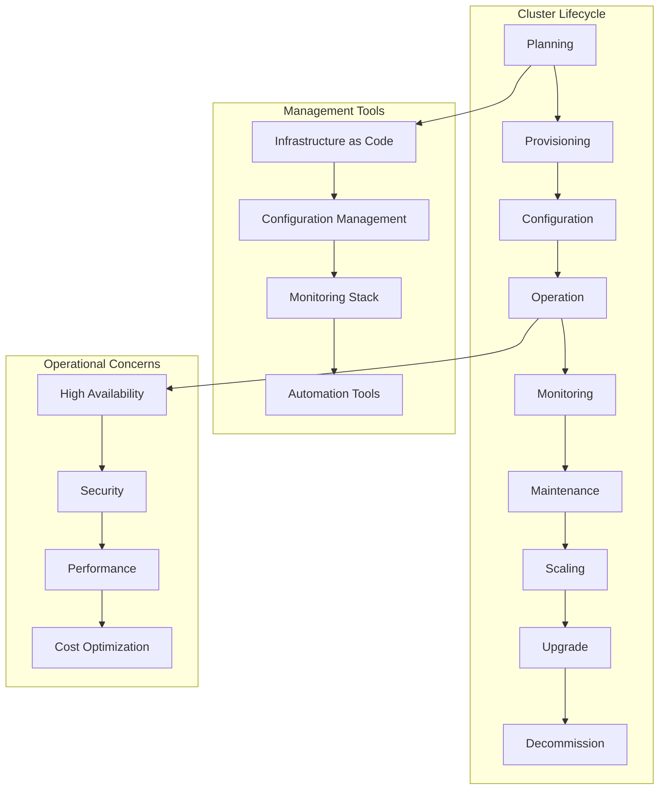
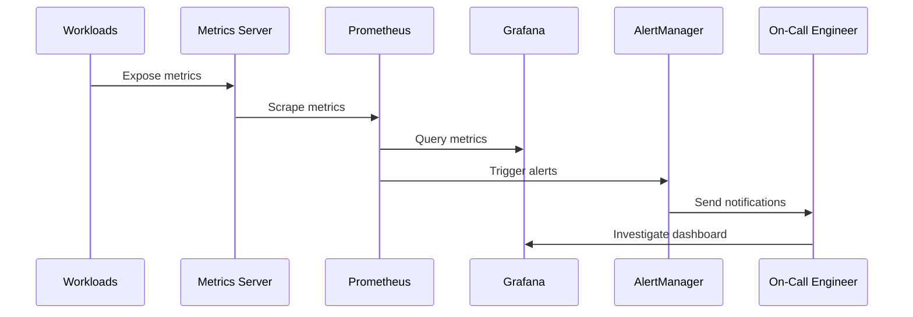

# Session 1: 클러스터 운영 및 관리 전략

## 📍 교과과정에서의 위치
이 세션은 **Week 2 > Day 4 > Session 1**로, Day 3에서 학습한 Kubernetes 오케스트레이션 이론을 바탕으로 실제 프로덕션 환경에서의 클러스터 운영 및 관리 전략을 심화 분석합니다.

## 학습 목표 (5분)
- **클러스터 생명주기 관리** 전략과 **운영 프로세스** 수립
- **노드 관리** 및 **유지보수** 방법론 이해
- **클러스터 모니터링** 및 **헬스 체크** 시스템 구축

## 1. 이론: 클러스터 생명주기 관리 (20분)

### 클러스터 운영 아키텍처



### 클러스터 설계 및 계획

```
클러스터 생명주기 단계:

1. 계획 및 설계 (Planning & Design):
├── 요구사항 분석:
│   ├── 워크로드 특성 분석 (CPU/메모리 집약적)
│   ├── 트래픽 패턴 및 확장성 요구사항
│   ├── 가용성 및 복구 목표 (RTO/RPO)
│   ├── 보안 및 컴플라이언스 요구사항
│   ├── 네트워크 및 스토리지 요구사항
│   └── 예산 및 비용 제약사항
├── 아키텍처 설계:
│   ├── 멀티 마스터 고가용성 구성
│   ├── 워커 노드 풀 설계 (용도별 분리)
│   ├── 네트워크 토폴로지 및 보안 영역
│   ├── 스토리지 아키텍처 및 백업 전략
│   ├── 모니터링 및 로깅 아키텍처
│   └── 재해 복구 및 비즈니스 연속성
├── 용량 계획:
│   ├── 현재 및 예상 워크로드 분석
│   ├── 리소스 사용률 예측 모델링
│   ├── 피크 시간대 및 계절성 고려
│   ├── 확장 임계값 및 트리거 설정
│   └── 비용 최적화 시나리오 분석
└── 기술 스택 선택:
    ├── Kubernetes 배포판 선택
    ├── CNI 플러그인 선택
    ├── CSI 드라이버 선택
    ├── 모니터링 도구 선택
    └── 보안 도구 및 정책 선택

2. 프로비저닝 (Provisioning):
├── 인프라 프로비저닝:
│   ├── Infrastructure as Code (Terraform, Pulumi)
│   ├── 클라우드 리소스 자동 생성
│   ├── 네트워크 및 보안 그룹 설정
│   ├── 로드 밸런서 및 DNS 구성
│   └── 스토리지 및 백업 인프라
├── 클러스터 부트스트래핑:
│   ├── kubeadm, kops, 또는 관리형 서비스
│   ├── 마스터 노드 초기화 및 구성
│   ├── 워커 노드 조인 및 검증
│   ├── 네트워크 플러그인 설치
│   └── 기본 시스템 컴포넌트 배포
└── 초기 구성:
    ├── RBAC 정책 설정
    ├── 네임스페이스 및 리소스 쿼터
    ├── 보안 정책 적용
    ├── 모니터링 에이전트 배포
    └── 백업 시스템 구성

3. 운영 및 관리 (Operation & Management):
├── 일상 운영 작업:
│   ├── 클러스터 상태 모니터링
│   ├── 리소스 사용률 추적
│   ├── 보안 이벤트 모니터링
│   ├── 백업 상태 확인
│   ├── 성능 메트릭 분석
│   └── 용량 계획 업데이트
├── 변경 관리:
│   ├── 애플리케이션 배포 승인
│   ├── 설정 변경 검토 및 적용
│   ├── 보안 패치 계획 및 적용
│   ├── 스케일링 결정 및 실행
│   └── 변경 사항 문서화 및 추적
└── 인시던트 대응:
    ├── 알림 및 에스컬레이션 절차
    ├── 근본 원인 분석 (RCA)
    ├── 임시 조치 및 영구 해결책
    ├── 포스트모템 및 개선 사항
    └── 플레이북 업데이트
```

### 노드 관리 전략

```
노드 생명주기 관리:

노드 프로비저닝:
├── 자동 노드 프로비저닝:
│   ├── Cluster Autoscaler 구성
│   ├── 노드 그룹별 스케일링 정책
│   ├── 스팟 인스턴스 활용 전략
│   ├── 다중 가용성 영역 분산
│   └── 비용 최적화 스케줄링
├── 노드 초기화:
│   ├── 부트스트랩 스크립트 실행
│   ├── 컨테이너 런타임 설치
│   ├── kubelet 구성 및 시작
│   ├── 네트워크 플러그인 설정
│   └── 모니터링 에이전트 배포
└── 노드 검증:
    ├── 헬스 체크 및 준비 상태 확인
    ├── 네트워크 연결성 테스트
    ├── 스토리지 마운트 검증
    ├── 보안 정책 적용 확인
    └── 성능 벤치마크 실행

노드 유지보수:
├── 정기 유지보수:
│   ├── OS 패치 및 보안 업데이트
│   ├── 컨테이너 런타임 업데이트
│   ├── kubelet 및 kube-proxy 업데이트
│   ├── 시스템 로그 로테이션
│   └── 디스크 정리 및 최적화
├── 노드 드레인 및 코든:
│   ├── 계획된 유지보수를 위한 드레인
│   ├── 워크로드 안전한 이동
│   ├── 유지보수 완료 후 언코든
│   ├── 노드 준비 상태 검증
│   └── 워크로드 재분산 확인
└── 노드 교체:
    ├── 불변 인프라 원칙 적용
    ├── 새 노드 프로비저닝
    ├── 기존 노드 그레이스풀 제거
    ├── 워크로드 자동 재스케줄링
    └── 설정 및 상태 검증

노드 모니터링:
├── 시스템 메트릭:
│   ├── CPU, 메모리, 디스크 사용률
│   ├── 네트워크 I/O 및 연결 상태
│   ├── 파일시스템 사용량 및 inode
│   ├── 시스템 로드 및 프로세스 수
│   └── 하드웨어 상태 (온도, 팬 등)
├── Kubernetes 메트릭:
│   ├── kubelet 상태 및 성능
│   ├── Pod 스케줄링 성공률
│   ├── 컨테이너 런타임 메트릭
│   ├── 네트워크 플러그인 상태
│   └── 볼륨 마운트 상태
└── 알림 및 대응:
    ├── 임계값 기반 알림 설정
    ├── 자동 복구 액션 정의
    ├── 에스컬레이션 매트릭스
    ├── 온콜 로테이션 관리
    └── 인시던트 추적 시스템
```

## 2. 이론: 클러스터 모니터링 및 관찰가능성 (15분)

### 모니터링 아키텍처



### 종합 모니터링 전략

```
클러스터 모니터링 체계:

메트릭 수집 계층:
├── 인프라 메트릭:
│   ├── 노드 리소스 사용률 (CPU, 메모리, 디스크)
│   ├── 네트워크 트래픽 및 연결 상태
│   ├── 스토리지 성능 및 용량
│   ├── 하드웨어 상태 및 온도
│   └── 시스템 이벤트 및 로그
├── Kubernetes 메트릭:
│   ├── API 서버 성능 및 가용성
│   ├── etcd 클러스터 상태 및 성능
│   ├── 스케줄러 효율성 및 지연시간
│   ├── 컨트롤러 매니저 상태
│   └── kubelet 및 kube-proxy 메트릭
├── 워크로드 메트릭:
│   ├── Pod 리소스 사용률 및 상태
│   ├── 컨테이너 성능 및 재시작 횟수
│   ├── 서비스 응답 시간 및 처리량
│   ├── 애플리케이션 비즈니스 메트릭
│   └── 사용자 경험 메트릭
└── 보안 메트릭:
    ├── 인증 실패 및 권한 위반
    ├── 네트워크 정책 위반
    ├── 보안 스캔 결과
    ├── 취약점 및 패치 상태
    └── 감사 로그 이벤트

로깅 및 추적:
├── 구조화된 로깅:
│   ├── JSON 형식 로그 표준화
│   ├── 로그 레벨 및 카테고리 분류
│   ├── 컨텍스트 정보 포함 (요청 ID, 사용자 ID)
│   ├── 타임스탬프 및 메타데이터
│   └── 민감 정보 마스킹
├── 중앙집중식 로그 관리:
│   ├── 로그 수집 및 전송 (Fluentd, Fluent Bit)
│   ├── 로그 저장 및 인덱싱 (Elasticsearch)
│   ├── 로그 검색 및 분석 (Kibana)
│   ├── 로그 보관 및 아카이빙
│   └── 로그 기반 알림 및 대시보드
└── 분산 추적:
    ├── 요청 흐름 추적 (Jaeger, Zipkin)
    ├── 서비스 간 의존성 분석
    ├── 성능 병목 지점 식별
    ├── 에러 전파 경로 추적
    └── 사용자 경험 분석

알림 및 대응:
├── 지능형 알림 시스템:
│   ├── 다중 조건 기반 알림 규칙
│   ├── 알림 그룹핑 및 중복 제거
│   ├── 동적 임계값 및 이상 탐지
│   ├── 비즈니스 시간 고려 알림
│   └── 알림 피로도 관리
├── 에스컬레이션 매트릭스:
│   ├── 심각도별 대응 절차
│   ├── 온콜 로테이션 관리
│   ├── 자동 티켓 생성 및 할당
│   ├── SLA 기반 에스컬레이션
│   └── 경영진 보고 체계
└── 자동 복구:
    ├── 알려진 문제 자동 해결
    ├── 자가 치유 메커니즘
    ├── 예방적 조치 실행
    ├── 복구 액션 로깅 및 추적
    └── 수동 개입 최소화
```

## 3. 이론: 운영 자동화 및 GitOps (10분)

### GitOps 운영 모델

```
GitOps 기반 운영:

GitOps 원칙:
├── 선언적 구성:
│   ├── 모든 시스템 상태를 Git에 저장
│   ├── YAML/JSON 형식의 구성 파일
│   ├── 버전 관리 및 변경 이력 추적
│   ├── 코드 리뷰를 통한 변경 승인
│   └── 롤백 및 감사 가능성
├── 버전 관리:
│   ├── Git을 단일 진실 소스로 활용
│   ├── 브랜치 전략 및 머지 정책
│   ├── 태그를 통한 릴리스 관리
│   ├── 변경 사항 추적 및 문서화
│   └── 협업 및 코드 리뷰 프로세스
├── 자동 배포:
│   ├── Git 커밋 기반 자동 배포
│   ├── 지속적 동기화 (Continuous Sync)
│   ├── 드리프트 감지 및 자동 수정
│   ├── 배포 상태 모니터링
│   └── 실패 시 자동 롤백
└── 관찰가능성:
    ├── 배포 상태 실시간 모니터링
    ├── 변경 사항 영향 분석
    ├── 성능 및 안정성 메트릭
    ├── 알림 및 대시보드
    └── 감사 로그 및 컴플라이언스

운영 자동화 도구:
├── ArgoCD:
│   ├── Kubernetes 네이티브 GitOps
│   ├── 멀티 클러스터 지원
│   ├── 웹 UI 및 CLI 제공
│   ├── RBAC 및 SSO 통합
│   └── 헬름 차트 지원
├── Flux:
│   ├── CNCF 졸업 프로젝트
│   ├── GitOps Toolkit 기반
│   ├── 헬름 및 Kustomize 지원
│   ├── 이미지 자동 업데이트
│   └── 알림 및 웹훅 지원
└── Jenkins X:
    ├── 클라우드 네이티브 CI/CD
    ├── GitOps 기본 내장
    ├── 프리뷰 환경 자동 생성
    ├── 프로모션 파이프라인
    └── Tekton 기반 파이프라인
```

## 4. 개념 예시: 클러스터 운영 구성 (12분)

### 클러스터 모니터링 스택 구성 예시

```yaml
# Prometheus 모니터링 스택 (개념 예시)
apiVersion: v1
kind: Namespace
metadata:
  name: monitoring
---
apiVersion: apps/v1
kind: Deployment
metadata:
  name: prometheus
  namespace: monitoring
spec:
  replicas: 2
  selector:
    matchLabels:
      app: prometheus
  template:
    metadata:
      labels:
        app: prometheus
    spec:
      containers:
      - name: prometheus
        image: prom/prometheus:v2.40.0
        ports:
        - containerPort: 9090
        volumeMounts:
        - name: config
          mountPath: /etc/prometheus
        - name: storage
          mountPath: /prometheus
        args:
        - '--config.file=/etc/prometheus/prometheus.yml'
        - '--storage.tsdb.path=/prometheus'
        - '--storage.tsdb.retention.time=30d'
        - '--web.enable-lifecycle'
        - '--web.enable-admin-api'
      volumes:
      - name: config
        configMap:
          name: prometheus-config
      - name: storage
        persistentVolumeClaim:
          claimName: prometheus-storage
```

### 노드 관리 자동화 예시

```bash
# 노드 드레인 및 유지보수 스크립트 (개념 예시)
#!/bin/bash

NODE_NAME=$1
MAINTENANCE_REASON=${2:-"Scheduled maintenance"}

echo "Starting maintenance for node: $NODE_NAME"

# 1. 노드 코든 (새로운 Pod 스케줄링 방지)
kubectl cordon $NODE_NAME

# 2. 노드 드레인 (기존 Pod 안전하게 이동)
kubectl drain $NODE_NAME \
  --ignore-daemonsets \
  --delete-emptydir-data \
  --force \
  --grace-period=300

# 3. 유지보수 작업 수행
echo "Performing maintenance tasks..."
# OS 패치, 재부팅 등

# 4. 노드 준비 상태 확인
kubectl wait --for=condition=Ready node/$NODE_NAME --timeout=600s

# 5. 노드 언코든 (스케줄링 재개)
kubectl uncordon $NODE_NAME

echo "Maintenance completed for node: $NODE_NAME"
```

### GitOps 구성 예시

```yaml
# ArgoCD 애플리케이션 (개념 예시)
apiVersion: argoproj.io/v1alpha1
kind: Application
metadata:
  name: production-app
  namespace: argocd
spec:
  project: default
  source:
    repoURL: https://github.com/company/k8s-manifests
    targetRevision: HEAD
    path: production
  destination:
    server: https://kubernetes.default.svc
    namespace: production
  syncPolicy:
    automated:
      prune: true
      selfHeal: true
    syncOptions:
    - CreateNamespace=true
    retry:
      limit: 5
      backoff:
        duration: 5s
        factor: 2
        maxDuration: 3m
```

## 5. 토론 및 정리 (8분)

### 핵심 개념 정리
- **클러스터 생명주기 관리**를 통한 체계적 운영
- **노드 관리 자동화**와 **무중단 유지보수** 전략
- **종합 모니터링**을 통한 **관찰가능성** 확보
- **GitOps 기반 운영**을 통한 **자동화 및 표준화**

### 토론 주제
"대규모 프로덕션 환경에서 클러스터 운영의 안정성과 효율성을 동시에 보장하는 최적의 전략은 무엇인가?"

## 💡 핵심 키워드
- **생명주기 관리**: 계획, 프로비저닝, 운영, 유지보수
- **노드 관리**: 드레인, 코든, 자동 스케일링, 유지보수
- **모니터링**: 메트릭, 로깅, 알림, 관찰가능성
- **운영 자동화**: GitOps, ArgoCD, 지속적 배포

## 📚 참고 자료
- [Kubernetes 클러스터 관리](https://kubernetes.io/docs/tasks/administer-cluster/)
- [GitOps 가이드](https://www.gitops.tech/)
- [Prometheus 모니터링](https://prometheus.io/docs/)
