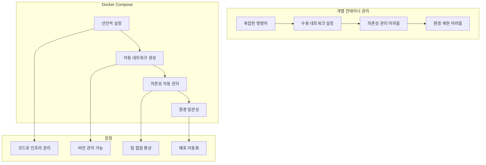

# Session 1: Docker Compose 기초

## 📍 교과과정에서의 위치
이 세션은 **Week 2 > Day 4 > Session 1**로, Day 3에서 학습한 개별 컨테이너 관리를 바탕으로 Docker Compose를 통한 선언적 멀티 컨테이너 관리 방법을 학습합니다.

## 학습 목표 (5분)
- **Docker Compose** 개념과 **YAML 문법** 이해
- **서비스 정의** 기본 구조 및 **명령어** 활용
- **개별 컨테이너 vs Compose** 비교 및 **장점** 파악

## 1. 이론: Docker Compose 개념 (20분)

### Compose의 필요성과 장점



### YAML 기본 문법

```yaml
# Docker Compose 파일 구조
version: '3.8'  # Compose 파일 버전

services:       # 서비스 정의 섹션
  web:          # 서비스 이름
    image: nginx:alpine
    ports:
      - "80:80"
    
  database:
    image: mysql:8.0
    environment:
      MYSQL_ROOT_PASSWORD: secret

networks:       # 네트워크 정의 (선택사항)
  default:
    driver: bridge

volumes:        # 볼륨 정의 (선택사항)
  db_data:
    driver: local
```

### Compose 파일 구조 분석

```
Compose 파일 주요 섹션:

version (필수):
├── Compose 파일 스키마 버전
├── 3.8 (권장, Docker 19.03+)
├── 기능 호환성 결정
└── 예: version: '3.8'

services (필수):
├── 애플리케이션 구성 요소 정의
├── 각 서비스는 컨테이너 하나
├── 이미지, 포트, 볼륨 등 설정
└── 서비스 간 의존성 정의

networks (선택):
├── 커스텀 네트워크 정의
├── 서비스 간 통신 제어
├── 외부 네트워크 연결
└── 기본값: 프로젝트별 브리지 네트워크

volumes (선택):
├── 데이터 영속성 관리
├── 서비스 간 데이터 공유
├── 외부 볼륨 마운트
└── 기본값: 익명 볼륨

configs/secrets (선택):
├── 설정 파일 관리
├── 민감한 정보 보호
├── 런타임 주입
└── Swarm 모드에서 주로 사용
```

## 2. 실습: 첫 번째 Compose 파일 작성 (15분)

### 간단한 웹 애플리케이션

```bash
# 프로젝트 디렉토리 생성
mkdir -p compose-basics && cd compose-basics

# 첫 번째 Compose 파일
cat > docker-compose.yml << 'EOF'
version: '3.8'

services:
  web:
    image: nginx:alpine
    ports:
      - "8080:80"
    volumes:
      - ./html:/usr/share/nginx/html:ro
    
  api:
    image: node:alpine
    working_dir: /app
    volumes:
      - ./api:/app
    ports:
      - "3000:3000"
    command: sh -c "npm install && npm start"
EOF

# 웹 콘텐츠 생성
mkdir -p html
cat > html/index.html << 'EOF'
<!DOCTYPE html>
<html>
<head>
    <title>Docker Compose Demo</title>
    <style>
        body { font-family: Arial, sans-serif; margin: 40px; text-align: center; }
        .container { max-width: 600px; margin: 0 auto; }
        button { background: #007cba; color: white; padding: 10px 20px; border: none; border-radius: 3px; cursor: pointer; margin: 10px; }
        #result { margin: 20px; padding: 20px; background: #f5f5f5; border-radius: 5px; }
    </style>
</head>
<body>
    <div class="container">
        <h1>Docker Compose 기초 실습</h1>
        <p>웹 서버와 API 서버가 Compose로 관리됩니다</p>
        
        <button onclick="testAPI()">API 테스트</button>
        <button onclick="getTime()">현재 시간</button>
        
        <div id="result"></div>
    </div>

    <script>
        async function testAPI() {
            try {
                const response = await fetch('http://localhost:3000/api/test');
                const data = await response.json();
                document.getElementById('result').innerHTML = 
                    `<strong>API 응답:</strong><br>${JSON.stringify(data, null, 2)}`;
            } catch (error) {
                document.getElementById('result').innerHTML = 
                    `<strong>오류:</strong> ${error.message}`;
            }
        }
        
        async function getTime() {
            try {
                const response = await fetch('http://localhost:3000/api/time');
                const data = await response.json();
                document.getElementById('result').innerHTML = 
                    `<strong>서버 시간:</strong><br>${data.time}`;
            } catch (error) {
                document.getElementById('result').innerHTML = 
                    `<strong>오류:</strong> ${error.message}`;
            }
        }
    </script>
</body>
</html>
EOF

# API 서버 코드
mkdir -p api
cat > api/package.json << 'EOF'
{
  "name": "compose-api",
  "version": "1.0.0",
  "main": "server.js",
  "scripts": {
    "start": "node server.js"
  },
  "dependencies": {
    "express": "^4.18.2",
    "cors": "^2.8.5"
  }
}
EOF

cat > api/server.js << 'EOF'
const express = require('express');
const cors = require('cors');
const app = express();

app.use(cors());
app.use(express.json());

app.get('/api/test', (req, res) => {
    res.json({
        message: 'Docker Compose API 테스트 성공!',
        timestamp: new Date().toISOString(),
        service: 'api-server'
    });
});

app.get('/api/time', (req, res) => {
    res.json({
        time: new Date().toLocaleString('ko-KR'),
        timezone: Intl.DateTimeFormat().resolvedOptions().timeZone
    });
});

app.listen(3000, '0.0.0.0', () => {
    console.log('API 서버가 포트 3000에서 실행 중입니다');
});
EOF

# Compose 실행
docker-compose up -d

# 서비스 상태 확인
docker-compose ps
```

### 기본 Compose 명령어

```bash
# Compose 명령어 실습
echo "=== Docker Compose 기본 명령어 ==="

# 서비스 시작 (백그라운드)
docker-compose up -d

# 서비스 상태 확인
docker-compose ps

# 로그 확인
docker-compose logs web
docker-compose logs api

# 실시간 로그 추적
docker-compose logs -f api &
LOG_PID=$!

# 서비스 테스트
sleep 5
curl -s http://localhost:8080 | grep -q "Docker Compose" && echo "✓ 웹 서비스 정상"
curl -s http://localhost:3000/api/test | jq && echo "✓ API 서비스 정상"

# 로그 추적 중단
kill $LOG_PID 2>/dev/null

# 서비스 중지
docker-compose stop

# 서비스 재시작
docker-compose restart

# 서비스 제거 (볼륨 보존)
docker-compose down

# 서비스 제거 (볼륨 포함)
docker-compose down -v
```

## 3. 실습: Compose vs 개별 컨테이너 비교 (10분)

### 개별 컨테이너 방식

```bash
# 개별 컨테이너로 동일한 환경 구성
echo "=== 개별 컨테이너 방식 ==="

# 네트워크 생성
docker network create app-network

# 웹 서버 실행
docker run -d --name individual-web \
    --network app-network \
    -p 8081:80 \
    -v $(pwd)/html:/usr/share/nginx/html:ro \
    nginx:alpine

# API 서버 실행
docker run -d --name individual-api \
    --network app-network \
    -p 3001:3000 \
    -v $(pwd)/api:/app \
    -w /app \
    node:alpine sh -c "npm install && npm start"

# 상태 확인
docker ps --filter network=app-network

# 개별 관리의 복잡성 시연
echo "개별 컨테이너 관리 명령어들:"
echo "docker run -d --name individual-web --network app-network -p 8081:80 -v \$(pwd)/html:/usr/share/nginx/html:ro nginx:alpine"
echo "docker run -d --name individual-api --network app-network -p 3001:3000 -v \$(pwd)/api:/app -w /app node:alpine sh -c 'npm install && npm start'"
echo "docker stop individual-web individual-api"
echo "docker rm individual-web individual-api"
echo "docker network rm app-network"

# 정리
docker stop individual-web individual-api
docker rm individual-web individual-api
docker network rm app-network
```

### Compose 방식의 장점 비교

```bash
# Compose 방식 재실행
echo "=== Compose 방식 ==="

# 한 줄로 전체 스택 실행
docker-compose up -d

echo "Compose 관리 명령어들:"
echo "docker-compose up -d     # 전체 스택 시작"
echo "docker-compose ps        # 상태 확인"
echo "docker-compose logs      # 로그 확인"
echo "docker-compose down      # 전체 스택 정리"

# 장점 비교표 생성
cat > comparison.md << 'EOF'
# 개별 컨테이너 vs Docker Compose 비교

| 항목 | 개별 컨테이너 | Docker Compose |
|------|---------------|----------------|
| **설정 복잡도** | 높음 (긴 명령어) | 낮음 (YAML 파일) |
| **네트워크 관리** | 수동 생성/연결 | 자동 생성/연결 |
| **의존성 관리** | 수동 순서 제어 | 자동 의존성 해결 |
| **환경 재현** | 어려움 | 쉬움 (파일 공유) |
| **버전 관리** | 불가능 | 가능 (Git 등) |
| **팀 협업** | 어려움 | 쉬움 |
| **스케일링** | 수동 | 명령어 하나 |
| **모니터링** | 개별 관리 | 통합 관리 |

## Compose의 주요 장점
1. **Infrastructure as Code**: 인프라를 코드로 관리
2. **선언적 설정**: 원하는 상태를 선언하면 Compose가 구현
3. **환경 일관성**: 개발/테스트/운영 환경 동일하게 구성
4. **자동화**: 복잡한 설정을 자동으로 처리
5. **협업**: 팀원 간 환경 공유 용이
EOF

echo "비교 분석 완료: comparison.md"

# 테스트 및 정리
curl -s http://localhost:8080 | grep -q "Docker Compose" && echo "✓ Compose 웹 서비스 정상"
curl -s http://localhost:3000/api/test | jq '.message' && echo "✓ Compose API 서비스 정상"

docker-compose down
```

## 4. 실습: Compose 파일 구조 심화 (10분)

### 고급 서비스 정의

```bash
# 고급 Compose 파일 작성
cat > docker-compose.advanced.yml << 'EOF'
version: '3.8'

services:
  web:
    image: nginx:alpine
    container_name: advanced-web
    restart: unless-stopped
    ports:
      - "8080:80"
    volumes:
      - ./html:/usr/share/nginx/html:ro
      - ./nginx.conf:/etc/nginx/nginx.conf:ro
    depends_on:
      - api
    networks:
      - frontend
    labels:
      - "traefik.enable=true"
      - "traefik.http.routers.web.rule=Host(`localhost`)"
    
  api:
    build:
      context: ./api
      dockerfile: Dockerfile
    container_name: advanced-api
    restart: unless-stopped
    ports:
      - "3000:3000"
    environment:
      - NODE_ENV=development
      - API_PORT=3000
      - DB_HOST=database
    volumes:
      - ./api:/app
      - /app/node_modules
    depends_on:
      database:
        condition: service_healthy
    networks:
      - frontend
      - backend
    healthcheck:
      test: ["CMD", "curl", "-f", "http://localhost:3000/api/health"]
      interval: 30s
      timeout: 10s
      retries: 3
      start_period: 40s
  
  database:
    image: mysql:8.0
    container_name: advanced-db
    restart: unless-stopped
    environment:
      MYSQL_ROOT_PASSWORD: rootpassword
      MYSQL_DATABASE: appdb
      MYSQL_USER: appuser
      MYSQL_PASSWORD: apppassword
    volumes:
      - db_data:/var/lib/mysql
      - ./init.sql:/docker-entrypoint-initdb.d/init.sql:ro
    networks:
      - backend
    healthcheck:
      test: ["CMD", "mysqladmin", "ping", "-h", "localhost"]
      interval: 10s
      timeout: 5s
      retries: 5
    ports:
      - "3306:3306"

networks:
  frontend:
    driver: bridge
  backend:
    driver: bridge
    internal: true

volumes:
  db_data:
    driver: local
EOF

# Dockerfile 생성 (API용)
cat > api/Dockerfile << 'EOF'
FROM node:alpine

WORKDIR /app

COPY package*.json ./
RUN npm install

COPY . .

EXPOSE 3000

HEALTHCHECK --interval=30s --timeout=3s --start-period=5s --retries=3 \
  CMD curl -f http://localhost:3000/api/health || exit 1

CMD ["npm", "start"]
EOF

# 헬스체크 엔드포인트 추가
cat >> api/server.js << 'EOF'

app.get('/api/health', (req, res) => {
    res.json({
        status: 'healthy',
        timestamp: new Date().toISOString(),
        uptime: process.uptime()
    });
});
EOF

# 데이터베이스 초기화 스크립트
cat > init.sql << 'EOF'
CREATE TABLE IF NOT EXISTS users (
    id INT AUTO_INCREMENT PRIMARY KEY,
    name VARCHAR(100) NOT NULL,
    email VARCHAR(100) UNIQUE NOT NULL,
    created_at TIMESTAMP DEFAULT CURRENT_TIMESTAMP
);

INSERT INTO users (name, email) VALUES 
('John Doe', 'john@example.com'),
('Jane Smith', 'jane@example.com');
EOF

# Nginx 설정 파일
cat > nginx.conf << 'EOF'
events {
    worker_connections 1024;
}

http {
    upstream api_backend {
        server api:3000;
    }
    
    server {
        listen 80;
        
        location / {
            root /usr/share/nginx/html;
            index index.html;
        }
        
        location /api/ {
            proxy_pass http://api_backend/api/;
            proxy_set_header Host $host;
            proxy_set_header X-Real-IP $remote_addr;
        }
    }
}
EOF

# 고급 Compose 실행
docker-compose -f docker-compose.advanced.yml up -d

# 서비스 상태 및 헬스체크 확인
docker-compose -f docker-compose.advanced.yml ps
sleep 30
docker-compose -f docker-compose.advanced.yml exec api curl -s http://localhost:3000/api/health | jq

# 정리
docker-compose -f docker-compose.advanced.yml down -v
```

## 5. Q&A 및 정리 (5분)

### Compose 파일 검증 및 디버깅

```bash
# Compose 파일 검증 도구
echo "=== Compose 파일 검증 ==="

# 문법 검증
docker-compose config

# 서비스 구성 확인
docker-compose config --services

# 볼륨 구성 확인
docker-compose config --volumes

# 네트워크 구성 확인
docker-compose config --networks

# 환경 변수 확인
docker-compose config --resolve-envvars

# 디버깅을 위한 상세 출력
docker-compose --verbose config

# 최종 정리 및 체크리스트
cat > session1-checklist.md << 'EOF'
# Session 1 체크리스트

## 학습 완료 항목
- [ ] Docker Compose 개념 이해
- [ ] YAML 기본 문법 숙지
- [ ] 기본 Compose 파일 작성
- [ ] 주요 Compose 명령어 실습
- [ ] 개별 컨테이너 vs Compose 비교
- [ ] 고급 서비스 정의 구조 이해

## 핵심 명령어
```bash
docker-compose up -d        # 서비스 시작
docker-compose ps           # 상태 확인
docker-compose logs         # 로그 확인
docker-compose down         # 서비스 정리
docker-compose config       # 설정 검증
```

## 다음 세션 준비사항
- 네트워킹 개념 복습
- 서비스 간 통신 방법 예습
- 멀티 서비스 아키텍처 설계 고민
EOF

echo "Session 1 완료! 체크리스트: session1-checklist.md"
```

## 💡 핵심 키워드
- **선언적 관리**: YAML 파일로 인프라 정의
- **서비스 오케스트레이션**: 멀티 컨테이너 자동 관리
- **Infrastructure as Code**: 코드로 인프라 관리
- **환경 일관성**: 개발부터 운영까지 동일한 환경

## 📚 참고 자료
- [Compose 파일 레퍼런스](https://docs.docker.com/compose/compose-file/)
- [YAML 문법 가이드](https://yaml.org/spec/1.2/spec.html)
- [Compose 명령어](https://docs.docker.com/compose/reference/)

## 🔧 실습 체크리스트
- [ ] 기본 Compose 파일 작성 및 실행
- [ ] 주요 Compose 명령어 숙지
- [ ] 개별 컨테이너 관리와 비교 분석
- [ ] 고급 서비스 정의 구조 이해
- [ ] Compose 파일 검증 및 디버깅
