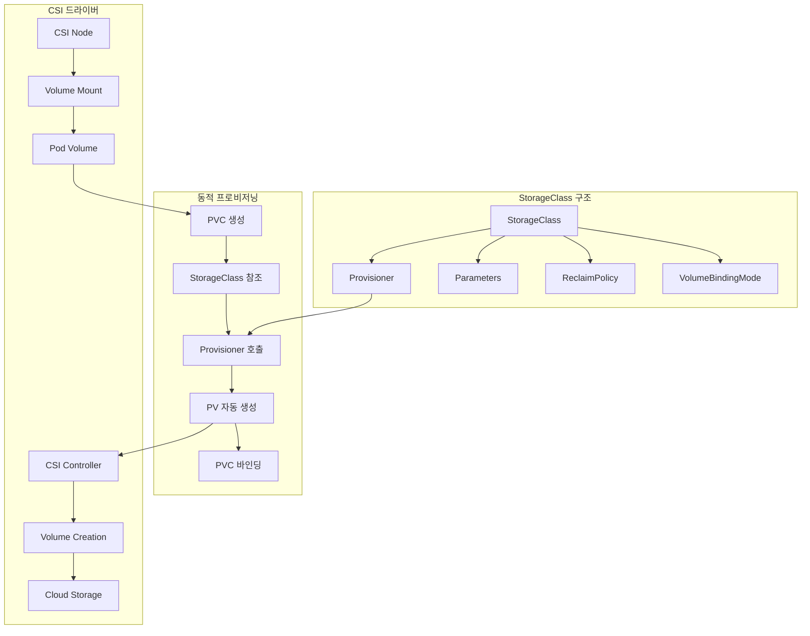
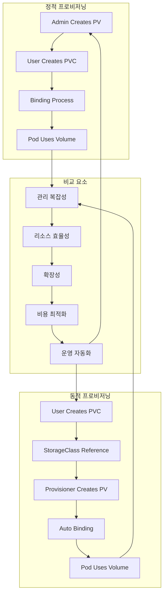
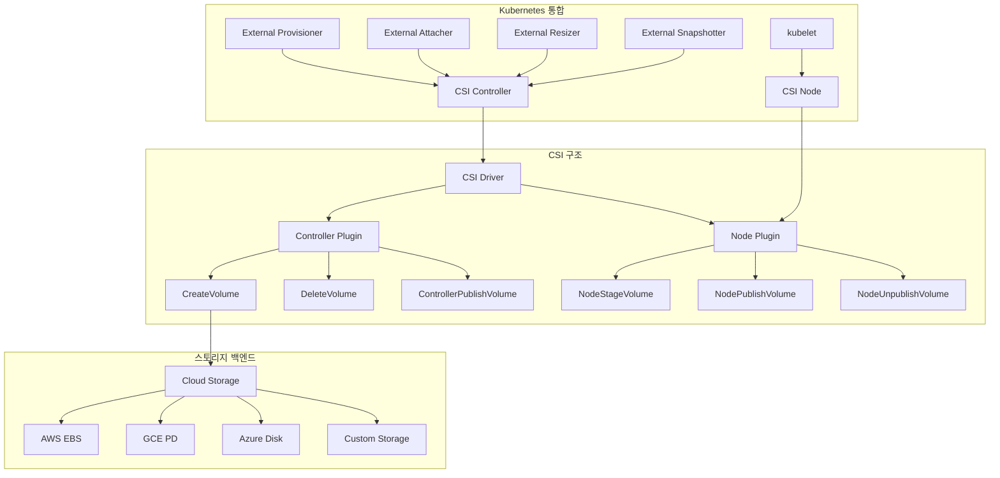
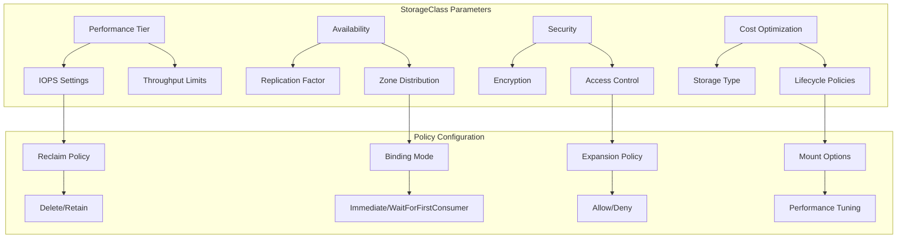

# Session 2: 스토리지 클래스와 동적 프로비저닝

## 📍 교과과정에서의 위치
이 세션은 **Week 2 > Day 4 > Session 2**로, Session 1에서 학습한 볼륨과 영구 볼륨을 바탕으로 스토리지 클래스와 동적 프로비저닝의 개념과 구현 방식을 학습합니다.

## 학습 목표 (5분)
- **스토리지 클래스** 개념과 **프로비저너** 역할 완전 이해
- **동적 프로비저닝**과 **정적 프로비저닝** 비교 학습
- **클라우드 스토리지** 통합과 **CSI** 드라이버 파악
- **스토리지 매개변수**와 **정책** 설정 이해

## 1. 스토리지 클래스 개념과 프로비저너 역할 (15분)

### 스토리지 클래스 아키텍처



### 스토리지 클래스 상세 분석
```
StorageClass 기본 개념:

스토리지 클래스 역할:
   🔹 스토리지 추상화:
      • 스토리지 타입별 템플릿 제공
      • 프로비저닝 정책 정의
      • 성능 특성 분류
      • 비용 최적화 옵션
      • 사용자 친화적 인터페이스
   🔹 동적 프로비저닝 지원:
      • PVC 요청 시 자동 PV 생성
      • 스토리지 백엔드 자동 할당
      • 용량 및 성능 자동 설정
      • 라이프사이클 자동 관리
      • 리소스 효율성 향상
   🔹 정책 기반 관리:
      • 회수 정책 표준화
      • 바인딩 모드 제어
      • 확장 정책 설정
      • 백업 정책 통합
      • 보안 정책 적용

프로비저너 (Provisioner):
   🔹 내장 프로비저너:
      • kubernetes.io/aws-ebs
      • kubernetes.io/gce-pd
      • kubernetes.io/azure-disk
      • kubernetes.io/azure-file
      • kubernetes.io/cinder
      • kubernetes.io/vsphere-volume
      • kubernetes.io/no-provisioner (정적)
   🔹 외부 프로비저너:
      • CSI 드라이버 기반
      • 벤더별 전용 프로비저너
      • 오픈소스 프로비저너
      • 커뮤니티 프로비저너
      • 커스텀 프로비저너
   🔹 프로비저너 기능:
      • 볼륨 생성 및 삭제
      • 스냅샷 생성 및 관리
      • 볼륨 확장 지원
      • 클론 및 복제
      • 메트릭 및 모니터링

스토리지 클래스 구성 요소:
   🔹 provisioner:
      • 스토리지 프로비저너 지정
      • 볼륨 생성 담당 컴포넌트
      • 클라우드별 전용 프로비저너
      • CSI 드라이버 이름
      • 커스텀 프로비저너 지원
   🔹 parameters:
      • 프로비저너별 설정 매개변수
      • 스토리지 타입 (SSD, HDD)
      • 성능 등급 (IOPS, 처리량)
      • 가용성 영역 지정
      • 암호화 설정
      • 복제 정책
      • 백업 설정
   🔹 reclaimPolicy:
      • Delete (기본값)
      • Retain
      • 동적 생성 PV 정책
      • 데이터 보존 전략
   🔹 volumeBindingMode:
      • Immediate (즉시 바인딩)
      • WaitForFirstConsumer (지연 바인딩)
      • 토폴로지 인식 스케줄링
      • 노드 어피니티 고려
   🔹 allowVolumeExpansion:
      • 볼륨 확장 허용 여부
      • 온라인 확장 지원
      • 파일시스템 자동 확장
      • 다운타임 없는 확장
   🔹 mountOptions:
   🔹 마운트 시 추가 옵션
   🔹 성능 튜닝 옵션
   🔹 보안 관련 옵션
   🔹 파일시스템별 옵션
```

## 2. 동적 프로비저닝과 정적 프로비저닝 비교 (12분)

### 프로비저닝 방식 비교



### 프로비저닝 방식 상세 비교
```
동적 vs 정적 프로비저닝 비교:

정적 프로비저닝:
   🔹 특징:
      • 관리자가 사전에 PV 생성
      • 미리 정의된 스토리지 풀
      • 수동 관리 및 할당
      • 예측 가능한 리소스
      • 전통적인 관리 방식
   🔹 장점:
      • 완전한 제어 가능
      • 예측 가능한 성능
      • 보안 정책 엄격 적용
      • 비용 예측 용이
      • 규정 준수 용이
      • 특수 요구사항 대응
   🔹 단점:
      • 높은 관리 부담
      • 리소스 낭비 가능성
      • 확장성 제한
      • 사용자 대기 시간
      • 운영 효율성 저하
      • 자동화 어려움
   🔹 적용 사례:
      • 고성능 전용 스토리지
      • 규정 준수 환경
      • 레거시 시스템 통합
      • 특수 하드웨어 활용
      • 엄격한 보안 요구사항

동적 프로비저닝:
   🔹 특징:
      • PVC 생성 시 자동 PV 생성
      • StorageClass 기반 자동화
      • 필요 시점 리소스 할당
      • 클라우드 네이티브 방식
      • 현대적 관리 패러다임
   🔹 장점:
      • 관리 부담 최소화
      • 리소스 효율성 극대화
      • 높은 확장성
      • 빠른 프로비저닝
      • 사용자 셀프서비스
      • 자동화 친화적
      • 클라우드 최적화
   🔹 단점:
      • 제어 수준 제한
      • 예측하기 어려운 비용
      • 보안 정책 복잡성
      • 벤더 종속성 위험
      • 디버깅 복잡성
      • 네트워크 의존성
   🔹 적용 사례:
      • 클라우드 네이티브 애플리케이션
      • 개발/테스트 환경
      • 마이크로서비스 아키텍처
      • 자동 스케일링 환경
      • DevOps 파이프라인

선택 기준:
   🔹 조직 성숙도:
      • 클라우드 네이티브 역량
      • 자동화 수준
      • 운영 프로세스
      • 기술 전문성
   🔹 비즈니스 요구사항:
      • 확장성 요구사항
      • 비용 최적화 목표
      • 서비스 수준 목표
      • 규정 준수 요구사항
   🔹 기술적 제약사항:
      • 기존 인프라 호환성
      • 보안 정책 요구사항
      • 성능 요구사항
      • 가용성 요구사항
   🔹 운영 모델:
   🔹 중앙집중식 vs 분산형
   🔹 셀프서비스 vs 관리형
   🔹 자동화 vs 수동 관리
   🔹 표준화 vs 맞춤형

하이브리드 접근법:
   🔹 계층별 전략:
      • 중요 워크로드: 정적
      • 일반 워크로드: 동적
      • 개발 환경: 동적
      • 프로덕션: 혼합
   🔹 단계적 전환:
      • 정적에서 동적으로 점진적 이동
      • 파일럿 프로젝트 적용
      • 경험 축적 후 확대
      • 위험 최소화 접근법
   🔹 정책 기반 선택:
   🔹 워크로드 특성별 자동 선택
   🔹 라벨 기반 정책 적용
   🔹 네임스페이스별 기본 정책
   🔹 사용자 권한 기반 제한
```

## 3. 클라우드 스토리지 통합과 CSI 드라이버 (10분)

### CSI 아키텍처



### CSI 드라이버 상세 분석
```
Container Storage Interface (CSI):

CSI 표준 개요:
   🔹 목적 및 배경:
      • 스토리지 벤더 중립적 인터페이스
      • Kubernetes 외부 표준
      • 플러그인 기반 확장성
      • 벤더 종속성 해결
      • 표준화된 스토리지 통합
   🔹 CSI vs In-tree 드라이버:
      • In-tree: Kubernetes 코어에 포함
      • CSI: 외부 플러그인 형태
      • 독립적 개발 및 배포
      • 버전 호환성 개선
      • 유지보수성 향상
   🔹 CSI 구성 요소:
      • CSI Controller: 볼륨 생명주기 관리
      • CSI Node: 노드별 볼륨 작업
      • External Components: Kubernetes 통합
      • gRPC 인터페이스: 표준 통신
      • 사이드카 컨테이너: 보조 기능

CSI 드라이버 구현:
   🔹 Controller Plugin:
      • CreateVolume: 볼륨 생성
      • DeleteVolume: 볼륨 삭제
      • ControllerPublishVolume: 노드에 볼륨 연결
      • ControllerUnpublishVolume: 노드에서 볼륨 분리
      • ValidateVolumeCapabilities: 볼륨 기능 검증
      • ListVolumes: 볼륨 목록 조회
      • GetCapacity: 용량 정보 조회
      • CreateSnapshot: 스냅샷 생성
      • ControllerExpandVolume: 볼륨 확장
   🔹 Node Plugin:
      • NodeStageVolume: 노드에 볼륨 준비
      • NodeUnstageVolume: 노드에서 볼륨 정리
      • NodePublishVolume: Pod에 볼륨 마운트
      • NodeUnpublishVolume: Pod에서 볼륨 언마운트
      • NodeGetVolumeStats: 볼륨 사용량 조회
      • NodeExpandVolume: 노드에서 볼륨 확장
      • NodeGetCapabilities: 노드 기능 조회
   🔹 Identity Service:
      • GetPluginInfo: 플러그인 정보
      • GetPluginCapabilities: 플러그인 기능
      • Probe: 플러그인 상태 확인

주요 CSI 드라이버:
   🔹 클라우드 제공업체:
      • AWS EBS CSI Driver
      • AWS EFS CSI Driver
      • GCE PD CSI Driver
      • Azure Disk CSI Driver
      • Azure File CSI Driver
      • 각 클라우드별 전용 기능
   🔹 스토리지 벤더:
      • NetApp Trident
      • Pure Storage
      • Dell EMC
      • HPE Storage
      • IBM Storage
      • 엔터프라이즈 스토리지 통합
   🔹 오픈소스:
      • Ceph CSI
      • GlusterFS CSI
      • OpenEBS
      • Longhorn
      • Portworx
      • 커뮤니티 기반 솔루션
   🔹 특수 목적:
   🔹 Local Path Provisioner
   🔹 NFS CSI Driver
   🔹 iSCSI CSI Driver
   🔹 SMB CSI Driver
   🔹 프로토콜별 드라이버

CSI 사이드카 컨테이너:
   🔹 external-provisioner:
      • PVC 감시 및 볼륨 생성 요청
      • StorageClass 기반 프로비저닝
      • 볼륨 생성 상태 관리
      • PV 객체 생성 및 바인딩
   🔹 external-attacher:
      • VolumeAttachment 객체 감시
      • 볼륨 연결/분리 관리
      • 노드별 볼륨 상태 추적
      • 연결 실패 시 재시도
   🔹 external-resizer:
      • PVC 크기 변경 감지
      • 볼륨 확장 요청 처리
      • 파일시스템 확장 지원
      • 온라인 확장 관리
   🔹 external-snapshotter:
      • VolumeSnapshot 객체 관리
      • 스냅샷 생성/삭제 처리
      • 스냅샷 메타데이터 관리
      • 복원 기능 지원
   🔹 node-driver-registrar:
   🔹 kubelet에 CSI 드라이버 등록
   🔹 Unix 도메인 소켓 통신
   🔹 드라이버 상태 모니터링
   🔹 플러그인 생명주기 관리
```

## 4. 스토리지 매개변수와 정책 설정 (10분)

### 스토리지 매개변수 구성



### 매개변수 및 정책 상세 분석
```
스토리지 매개변수 설정:

성능 관련 매개변수:
   🔹 IOPS 설정:
      • 프로비저닝된 IOPS (AWS gp3, io1/io2)
      • 버스트 가능 IOPS (gp2)
      • 최대 IOPS 제한
      • 읽기/쓰기 IOPS 분리
      • 워크로드별 최적화
   🔹 처리량 설정:
      • 대역폭 제한 (MB/s)
      • 순차/랜덤 I/O 최적화
      • 네트워크 처리량 고려
      • 버퍼 크기 조정
      • 캐시 정책 설정
   🔹 지연시간 최적화:
      • SSD vs HDD 선택
      • 로컬 vs 네트워크 스토리지
      • 캐시 계층 활용
      • 압축 및 중복제거
      • 큐 깊이 최적화

가용성 및 내구성:
   🔹 복제 정책:
      • 복제본 수 설정
      • 지역 간 복제
      • 동기/비동기 복제
      • 일관성 수준 선택
      • 장애 복구 시간 목표
   🔹 가용성 영역:
      • 다중 AZ 배치
      • 영역별 복제본 분산
      • 영역 장애 대응
      • 네트워크 지연 고려
      • 비용 vs 가용성 균형
   🔹 백업 및 스냅샷:
      • 자동 스냅샷 정책
      • 백업 주기 설정
      • 보존 기간 정책
      • 증분 백업 지원
      • 크로스 리전 백업

보안 설정:
   🔹 암호화:
      • 저장 시 암호화 (Encryption at Rest)
      • 전송 중 암호화 (Encryption in Transit)
      • 키 관리 서비스 통합
      • 고객 관리 키 (CMK)
      • 하드웨어 보안 모듈 (HSM)
      • 암호화 성능 영향 고려
   🔹 접근 제어:
      • IAM 정책 통합
      • 네트워크 ACL 설정
      • VPC 엔드포인트 사용
      • 보안 그룹 규칙
      • 감사 로깅 활성화
   🔹 컴플라이언스:
      • 데이터 주권 요구사항
      • 규정 준수 인증
      • 감사 추적 보장
      • 데이터 분류 정책
      • 보존 정책 준수

비용 최적화:
   🔹 스토리지 계층화:
      • 핫 데이터: 고성능 스토리지
      • 웜 데이터: 표준 스토리지
      • 콜드 데이터: 저비용 스토리지
      • 아카이브: 장기 보관용
      • 자동 계층화 정책
   🔹 라이프사이클 관리:
      • 데이터 에이징 정책
      • 자동 삭제 규칙
      • 압축 및 중복제거
      • 사용량 기반 최적화
      • 비용 모니터링 및 알림
   🔹 리소스 최적화:
      • 오버프로비저닝 방지
      • 사용률 기반 스케일링
      • 예약 인스턴스 활용
      • 스팟 인스턴스 고려
      • 멀티 클라우드 비용 비교

정책 설정 모범 사례:
   🔹 환경별 정책:
      • 개발: 비용 최적화 우선
      • 스테이징: 프로덕션 유사 설정
      • 프로덕션: 성능 및 가용성 우선
      • 재해복구: 지역 간 복제
      • 아카이브: 장기 보관 최적화
   🔹 워크로드별 정책:
      • 데이터베이스: 고성능, 고가용성
      • 로그 저장: 대용량, 저비용
      • 미디어 파일: 대용량, 아카이브
      • 캐시: 고성능, 임시 저장
      • 백업: 내구성, 비용 효율성
   🔹 자동화 정책:
      • 라벨 기반 자동 분류
      • 사용 패턴 기반 최적화
      • 정책 위반 자동 감지
      • 비용 임계값 알림
      • 자동 정리 및 최적화
   🔹 거버넌스:
   🔹 정책 승인 프로세스
   🔹 변경 관리 절차
   🔹 정기적 정책 검토
   🔹 컴플라이언스 모니터링
   🔹 교육 및 문서화
```

## 💬 그룹 토론: 동적 프로비저닝의 장점과 운영 복잡성 (8분)

### 토론 주제
**"동적 프로비저닝이 가져다주는 운영 효율성과 함께 발생할 수 있는 복잡성을 어떻게 관리해야 하는가?"**

## 💡 핵심 개념 정리
- **StorageClass**: 스토리지 템플릿, 프로비저너, 정책 정의
- **동적 프로비저닝**: 자동 PV 생성, 리소스 효율성, 운영 자동화
- **CSI 드라이버**: 표준 인터페이스, 벤더 중립성, 플러그인 확장
- **스토리지 정책**: 성능, 가용성, 보안, 비용 최적화

## 📚 참고 자료
- [Storage Classes](https://kubernetes.io/docs/concepts/storage/storage-classes/)
- [CSI Drivers](https://kubernetes-csi.github.io/docs/)
- [Dynamic Volume Provisioning](https://kubernetes.io/docs/concepts/storage/dynamic-provisioning/)

## 다음 세션 준비
다음 세션에서는 **StatefulSet과 영구 스토리지**에 대해 학습합니다.