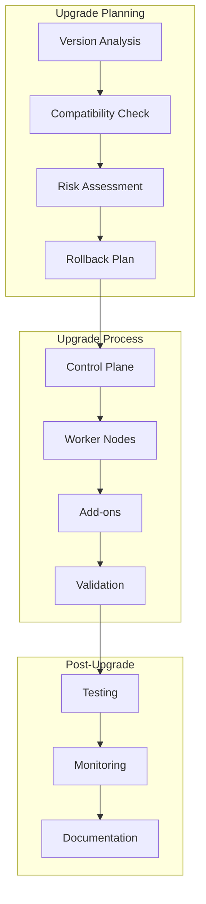
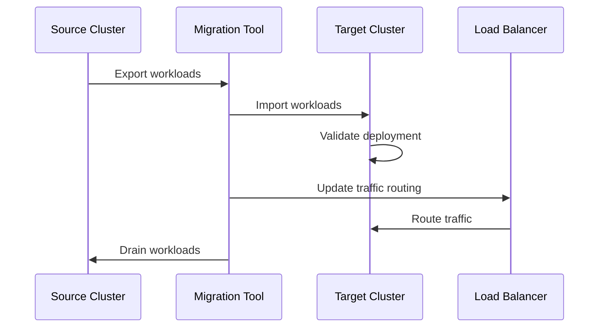

# Session 2: 업그레이드 및 마이그레이션 전략

## 📍 교과과정에서의 위치
이 세션은 **Week 2 > Day 4 > Session 2**로, 클러스터 운영 관리 이해를 바탕으로 Kubernetes 클러스터의 안전한 업그레이드와 워크로드 마이그레이션 전략을 심화 분석합니다.

## 학습 목표 (5분)
- **Kubernetes 버전 업그레이드** 전략과 **호환성 관리** 방법
- **워크로드 마이그레이션** 기법과 **무중단 전환** 전략
- **롤백 계획** 및 **리스크 관리** 방법론 수립

## 1. 이론: Kubernetes 버전 업그레이드 전략 (20분)

### 업그레이드 계획 및 준비



### 버전 호환성 및 업그레이드 경로

```
Kubernetes 업그레이드 전략:

버전 호환성 분석:
├── Kubernetes 버전 정책:
│   ├── 마이너 버전 간 호환성 (n-2 지원)
│   ├── API 버전 지원 정책
│   ├── 기능 게이트 생명주기
│   ├── 사용 중단 정책 (Deprecation Policy)
│   └── 보안 패치 및 백포트
├── 컴포넌트 호환성:
│   ├── kubelet 버전 스큐 정책
│   ├── kube-proxy 호환성
│   ├── kubectl 클라이언트 호환성
│   ├── 컨테이너 런타임 지원
│   └── CNI/CSI 플러그인 호환성
├── 애플리케이션 호환성:
│   ├── API 버전 변경 영향 분석
│   ├── 사용 중단된 API 사용 현황
│   ├── 커스텀 리소스 호환성
│   ├── 헬름 차트 호환성
│   └── 서드파티 도구 호환성
└── 인프라 호환성:
    ├── 클라우드 제공업체 지원
    ├── 네트워크 플러그인 호환성
    ├── 스토리지 드라이버 지원
    ├── 모니터링 도구 호환성
    └── 보안 도구 통합

업그레이드 준비 단계:
├── 현재 상태 분석:
│   ├── 클러스터 버전 및 구성 확인
│   ├── 워크로드 인벤토리 작성
│   ├── API 사용 현황 분석
│   ├── 리소스 사용량 평가
│   └── 의존성 매핑
├── 호환성 검증:
│   ├── kubectl convert를 통한 API 변환 테스트
│   ├── 사용 중단 API 식별 및 마이그레이션
│   ├── 애드온 및 오퍼레이터 호환성 확인
│   ├── 커스텀 컨트롤러 테스트
│   └── 통합 테스트 수행
├── 백업 및 스냅샷:
│   ├── etcd 클러스터 전체 백업
│   ├── 애플리케이션 데이터 백업
│   ├── 설정 파일 및 시크릿 백업
│   ├── 인프라 상태 스냅샷
│   └── 복구 절차 검증
└── 테스트 환경 구성:
    ├── 프로덕션 동일 환경 구성
    ├── 업그레이드 시나리오 테스트
    ├── 성능 및 안정성 검증
    ├── 롤백 시나리오 테스트
    └── 자동화 스크립트 검증

업그레이드 실행 전략:
├── 단계적 업그레이드:
│   ├── 컨트롤 플레인 우선 업그레이드
│   ├── 워커 노드 순차 업그레이드
│   ├── 애드온 및 시스템 컴포넌트
│   ├── 사용자 워크로드 검증
│   └── 모니터링 및 검증
├── 블루-그린 업그레이드:
│   ├── 새로운 클러스터 구성
│   ├── 워크로드 점진적 이동
│   ├── 트래픽 전환 및 검증
│   ├── 기존 클러스터 유지 (롤백용)
│   └── 완전 전환 후 정리
├── 카나리 업그레이드:
│   ├── 일부 노드만 업그레이드
│   ├── 제한된 워크로드 테스트
│   ├── 점진적 확대 적용
│   ├── 문제 발생 시 즉시 롤백
│   └── 전체 클러스터 업그레이드
└── 인플레이스 업그레이드:
    ├── 기존 클러스터 직접 업그레이드
    ├── 최소 다운타임 목표
    ├── 자동화된 업그레이드 도구 활용
    ├── 실시간 모니터링 및 검증
    └── 빠른 롤백 메커니즘
```

### 컨트롤 플레인 업그레이드

```
컨트롤 플레인 업그레이드 절차:

etcd 업그레이드:
├── 백업 및 스냅샷 생성
├── 멤버별 순차 업그레이드
├── 클러스터 상태 검증
├── 데이터 무결성 확인
└── 성능 메트릭 모니터링

API 서버 업그레이드:
├── 로드 밸런서에서 제거
├── 새 버전으로 교체
├── 헬스 체크 통과 확인
├── 로드 밸런서에 재추가
└── API 호환성 검증

기타 컴포넌트:
├── kube-controller-manager
├── kube-scheduler
├── cloud-controller-manager
├── DNS 및 네트워크 애드온
└── 모니터링 및 로깅 스택
```

## 2. 이론: 워크로드 마이그레이션 전략 (15분)

### 마이그레이션 패턴 및 전략



### 마이그레이션 방법론

```
워크로드 마이그레이션 전략:

마이그레이션 패턴:
├── Lift and Shift:
│   ├── 최소한의 변경으로 이동
│   ├── 기존 구성 그대로 복제
│   ├── 빠른 마이그레이션 가능
│   ├── 최적화 기회 제한
│   └── 호환성 문제 가능성
├── Re-platforming:
│   ├── 플랫폼 특화 최적화
│   ├── 클라우드 네이티브 기능 활용
│   ├── 성능 및 비용 최적화
│   ├── 중간 수준의 변경 필요
│   └── 점진적 개선 가능
├── Refactoring:
│   ├── 아키텍처 재설계
│   ├── 마이크로서비스 분해
│   ├── 클라우드 네이티브 패턴 적용
│   ├── 높은 변경 비용
│   └── 장기적 이익 극대화
└── Hybrid Approach:
    ├── 워크로드별 차별화 전략
    ├── 위험도 기반 접근법
    ├── 단계적 현대화
    ├── 비즈니스 연속성 보장
    └── 점진적 투자 회수

데이터 마이그레이션:
├── 상태 비저장 워크로드:
│   ├── 설정 및 시크릿 이동
│   ├── 이미지 레지스트리 동기화
│   ├── 네트워크 정책 복제
│   ├── RBAC 권한 매핑
│   └── 모니터링 설정 이전
├── 상태 유지 워크로드:
│   ├── 데이터베이스 마이그레이션
│   ├── 볼륨 데이터 복제
│   ├── 백업 및 복원 전략
│   ├── 데이터 일관성 보장
│   └── 다운타임 최소화
├── 네트워크 구성:
│   ├── 서비스 디스커버리 업데이트
│   ├── 로드 밸런서 재구성
│   ├── DNS 레코드 업데이트
│   ├── 방화벽 규칙 조정
│   └── 인증서 및 TLS 설정
└── 보안 정책:
    ├── RBAC 정책 이전
    ├── 네트워크 정책 적용
    ├── Pod 보안 표준 설정
    ├── 시크릿 및 키 관리
    └── 감사 로그 설정

마이그레이션 도구:
├── Velero:
│   ├── 클러스터 백업 및 복원
│   ├── 네임스페이스 단위 마이그레이션
│   ├── 볼륨 스냅샷 지원
│   ├── 스케줄된 백업
│   └── 재해 복구 지원
├── Kubernetes Migration Tools:
│   ├── kubectl을 통한 리소스 내보내기
│   ├── Helm 차트 기반 배포
│   ├── Kustomize 오버레이 활용
│   ├── GitOps 기반 동기화
│   └── 커스텀 마이그레이션 스크립트
├── 클라우드 제공업체 도구:
│   ├── AWS Migration Hub
│   ├── Azure Migrate
│   ├── Google Cloud Migrate
│   ├── 관리형 마이그레이션 서비스
│   └── 네이티브 통합 지원
└── 서드파티 솔루션:
    ├── Portworx PX-Migrate
    ├── Kasten K10
    ├── Rancher Fleet
    ├── 상용 마이그레이션 도구
    └── 컨설팅 서비스 활용
```

## 3. 이론: 롤백 및 리스크 관리 (10분)

### 롤백 전략 및 복구 계획

```
롤백 및 복구 전략:

롤백 시나리오:
├── 업그레이드 실패:
│   ├── 컨트롤 플레인 장애
│   ├── 워커 노드 문제
│   ├── 네트워크 연결 실패
│   ├── 스토리지 접근 불가
│   └── 애플리케이션 호환성 문제
├── 성능 저하:
│   ├── 응답 시간 증가
│   ├── 처리량 감소
│   ├── 리소스 사용량 급증
│   ├── 메모리 누수 발생
│   └── CPU 사용률 급증
├── 기능 장애:
│   ├── API 호환성 문제
│   ├── 기능 동작 오류
│   ├── 데이터 손실 위험
│   ├── 보안 취약점 노출
│   └── 통합 서비스 실패
└── 비즈니스 영향:
    ├── 서비스 중단
    ├── 사용자 경험 저하
    ├── 매출 손실 발생
    ├── SLA 위반
    └── 고객 신뢰도 하락

롤백 메커니즘:
├── 자동 롤백:
│   ├── 헬스 체크 기반 자동 감지
│   ├── 메트릭 임계값 기반 트리거
│   ├── 사전 정의된 롤백 스크립트
│   ├── 최소 개입으로 빠른 복구
│   └── 알림 및 로깅 자동화
├── 수동 롤백:
│   ├── 운영팀 판단 기반 실행
│   ├── 상황별 맞춤 대응
│   ├── 부분 롤백 및 선택적 복구
│   ├── 근본 원인 분석 병행
│   └── 문서화된 절차 준수
├── 점진적 롤백:
│   ├── 단계별 순차 롤백
│   ├── 영향 범위 최소화
│   ├── 서비스 연속성 보장
│   ├── 데이터 일관성 유지
│   └── 사용자 영향 최소화
└── 완전 롤백:
    ├── 전체 시스템 이전 상태 복원
    ├── 백업에서 완전 복구
    ├── 모든 변경 사항 되돌리기
    ├── 최대 안정성 확보
    └── 최대 다운타임 발생

리스크 관리:
├── 사전 위험 평가:
│   ├── 업그레이드 영향 분석
│   ├── 의존성 위험 평가
│   ├── 비즈니스 연속성 계획
│   ├── 복구 시간 목표 설정
│   └── 위험 완화 전략 수립
├── 모니터링 및 알림:
│   ├── 실시간 상태 모니터링
│   ├── 이상 징후 조기 감지
│   ├── 자동 알림 및 에스컬레이션
│   ├── 대시보드 및 시각화
│   └── 로그 분석 및 추적
└── 커뮤니케이션:
    ├── 이해관계자 사전 통보
    ├── 진행 상황 실시간 공유
    ├── 문제 발생 시 즉시 보고
    ├── 복구 완료 후 사후 분석
    └── 교훈 학습 및 개선
```

## 4. 개념 예시: 업그레이드 및 마이그레이션 구성 (12분)

### kubeadm 업그레이드 예시

```bash
# Kubernetes 클러스터 업그레이드 (개념 예시)

# 1. 현재 버전 확인
kubectl version --short
kubeadm version

# 2. 업그레이드 계획 확인
kubeadm upgrade plan

# 3. 컨트롤 플레인 업그레이드
sudo kubeadm upgrade apply v1.28.0

# 4. kubelet 및 kubectl 업그레이드
sudo apt-mark unhold kubeadm kubelet kubectl
sudo apt-get update
sudo apt-get install -y kubeadm=1.28.0-00 kubelet=1.28.0-00 kubectl=1.28.0-00
sudo apt-mark hold kubeadm kubelet kubectl

# 5. kubelet 재시작
sudo systemctl daemon-reload
sudo systemctl restart kubelet

# 6. 워커 노드 업그레이드 (각 노드에서)
kubectl drain <node-name> --ignore-daemonsets
sudo kubeadm upgrade node
sudo systemctl restart kubelet
kubectl uncordon <node-name>
```

### Velero 백업 및 마이그레이션 예시

```yaml
# Velero 백업 구성 (개념 예시)
apiVersion: velero.io/v1
kind: Backup
metadata:
  name: full-cluster-backup
  namespace: velero
spec:
  includedNamespaces:
  - "*"
  excludedNamespaces:
  - kube-system
  - velero
  includedResources:
  - "*"
  excludedResources:
  - events
  - events.events.k8s.io
  labelSelector:
    matchLabels:
      backup: "true"
  snapshotVolumes: true
  ttl: 720h0m0s
  storageLocation: default
  volumeSnapshotLocations:
  - default

---
# 복원 구성
apiVersion: velero.io/v1
kind: Restore
metadata:
  name: full-cluster-restore
  namespace: velero
spec:
  backupName: full-cluster-backup
  includedNamespaces:
  - production
  - staging
  excludedResources:
  - nodes
  - events
  restorePVs: true
```

### 업그레이드 자동화 스크립트 예시

```bash
#!/bin/bash
# Kubernetes 업그레이드 자동화 스크립트 (개념 예시)

set -e

TARGET_VERSION="1.28.0"
BACKUP_NAME="pre-upgrade-$(date +%Y%m%d-%H%M%S)"

echo "Starting Kubernetes upgrade to version $TARGET_VERSION"

# 1. 사전 백업
echo "Creating backup..."
velero backup create $BACKUP_NAME --wait

# 2. 업그레이드 전 검증
echo "Pre-upgrade validation..."
kubectl get nodes
kubectl get pods --all-namespaces | grep -v Running | grep -v Completed

# 3. 컨트롤 플레인 업그레이드
echo "Upgrading control plane..."
kubeadm upgrade plan
kubeadm upgrade apply $TARGET_VERSION -y

# 4. 워커 노드 업그레이드
echo "Upgrading worker nodes..."
for node in $(kubectl get nodes -o jsonpath='{.items[*].metadata.name}' | grep -v master); do
    echo "Upgrading node: $node"
    kubectl drain $node --ignore-daemonsets --delete-emptydir-data --force
    
    # SSH to node and upgrade
    ssh $node "
        kubeadm upgrade node
        systemctl restart kubelet
    "
    
    kubectl uncordon $node
    kubectl wait --for=condition=Ready node/$node --timeout=300s
done

# 5. 업그레이드 후 검증
echo "Post-upgrade validation..."
kubectl version
kubectl get nodes
kubectl get pods --all-namespaces

echo "Upgrade completed successfully!"
```

### 마이그레이션 체크리스트 예시

```yaml
# 마이그레이션 체크리스트 (개념 예시)
apiVersion: v1
kind: ConfigMap
metadata:
  name: migration-checklist
data:
  pre-migration.md: |
    # Pre-Migration Checklist
    
    ## Infrastructure
    - [ ] Target cluster provisioned and configured
    - [ ] Network connectivity established
    - [ ] Storage systems prepared
    - [ ] Backup systems configured
    
    ## Security
    - [ ] RBAC policies reviewed and updated
    - [ ] Secrets and certificates migrated
    - [ ] Network policies configured
    - [ ] Security scanning completed
    
    ## Applications
    - [ ] Application inventory completed
    - [ ] Dependencies mapped
    - [ ] Configuration externalized
    - [ ] Health checks configured
    
    ## Testing
    - [ ] Migration scripts tested
    - [ ] Rollback procedures verified
    - [ ] Performance benchmarks established
    - [ ] Monitoring and alerting configured
  
  post-migration.md: |
    # Post-Migration Checklist
    
    ## Validation
    - [ ] All workloads running successfully
    - [ ] Network connectivity verified
    - [ ] Data integrity confirmed
    - [ ] Performance metrics within acceptable range
    
    ## Cleanup
    - [ ] Source cluster resources cleaned up
    - [ ] Temporary migration resources removed
    - [ ] Documentation updated
    - [ ] Team training completed
```

## 5. 토론 및 정리 (8분)

### 핵심 개념 정리
- **체계적 업그레이드 계획**과 **호환성 검증** 프로세스
- **다양한 마이그레이션 패턴**과 **상황별 최적 전략**
- **롤백 메커니즘**과 **리스크 관리** 체계
- **자동화 도구** 활용을 통한 **안전하고 효율적인 전환**

### 토론 주제
"대규모 프로덕션 환경에서 무중단 업그레이드와 마이그레이션을 보장하면서도 리스크를 최소화하는 전략은 무엇인가?"

## 💡 핵심 키워드
- **업그레이드 전략**: 버전 호환성, 단계적 업그레이드, 블루-그린
- **마이그레이션**: Lift and Shift, Re-platforming, 데이터 마이그레이션
- **롤백 계획**: 자동 롤백, 리스크 평가, 복구 전략
- **자동화 도구**: kubeadm, Velero, 마이그레이션 스크립트

## 📚 참고 자료
- [Kubernetes 업그레이드 가이드](https://kubernetes.io/docs/tasks/administer-cluster/kubeadm/kubeadm-upgrade/)
- [Velero 백업 솔루션](https://velero.io/docs/)
- [클러스터 마이그레이션 모범 사례](https://kubernetes.io/docs/setup/production-environment/)
