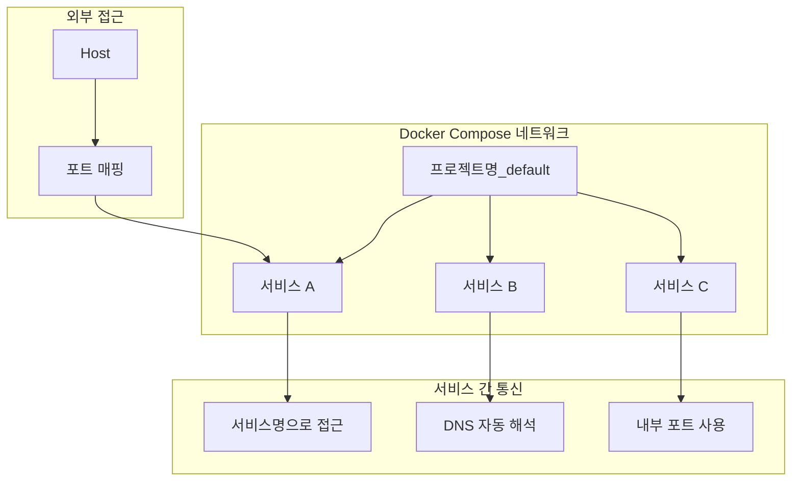

# Session 2: 서비스 정의와 네트워킹

## 📍 교과과정에서의 위치
이 세션은 **Week 2 > Day 4 > Session 2**로, Session 1의 기본 Compose 구조를 바탕으로 서비스 간 통신과 네트워크 설계를 학습합니다.

## 학습 목표 (5분)
- **서비스 간 통신** 패턴 및 **DNS 해석** 이해
- **커스텀 네트워크** 설계 및 **네트워크 분리** 구현
- **포트 매핑** 전략 및 **로드 밸런싱** 기초

## 1. 이론: Compose 네트워킹 (20분)

### 기본 네트워킹 동작



### 네트워크 설계 패턴

```yaml
# 기본 네트워크 (자동 생성)
version: '3.8'
services:
  web:
    image: nginx
  api:
    image: node:alpine
# 자동으로 프로젝트명_default 네트워크 생성

---
# 커스텀 네트워크
version: '3.8'
services:
  web:
    image: nginx
    networks:
      - frontend
  api:
    image: node:alpine
    networks:
      - frontend
      - backend
  db:
    image: mysql
    networks:
      - backend

networks:
  frontend:
    driver: bridge
  backend:
    driver: bridge
    internal: true  # 외부 접근 차단
```

## 2. 실습: 멀티 서비스 통신 구현 (15분)

### 3-tier 아키텍처 구성

```bash
# 프로젝트 디렉토리 생성
mkdir -p microservices-demo && cd microservices-demo

# 멀티 서비스 Compose 파일
cat > docker-compose.yml << 'EOF'
version: '3.8'

services:
  # Frontend - Nginx 리버스 프록시
  nginx:
    image: nginx:alpine
    ports:
      - "8080:80"
    volumes:
      - ./nginx/nginx.conf:/etc/nginx/nginx.conf:ro
      - ./nginx/html:/usr/share/nginx/html:ro
    networks:
      - frontend
    depends_on:
      - api-gateway

  # API Gateway
  api-gateway:
    build: ./gateway
    ports:
      - "3000:3000"
    environment:
      - USER_SERVICE_URL=http://user-service:3001
      - ORDER_SERVICE_URL=http://order-service:3002
      - PRODUCT_SERVICE_URL=http://product-service:3003
    networks:
      - frontend
      - backend
    depends_on:
      - user-service
      - order-service
      - product-service

  # 마이크로서비스들
  user-service:
    build: ./services/user
    environment:
      - DB_HOST=postgres
      - DB_NAME=userdb
      - DB_USER=user
      - DB_PASS=password
    networks:
      - backend
      - database
    depends_on:
      - postgres

  order-service:
    build: ./services/order
    environment:
      - DB_HOST=postgres
      - DB_NAME=orderdb
      - REDIS_HOST=redis
    networks:
      - backend
      - database
    depends_on:
      - postgres
      - redis

  product-service:
    build: ./services/product
    environment:
      - DB_HOST=mongo
      - DB_NAME=productdb
    networks:
      - backend
      - database
    depends_on:
      - mongo

  # 데이터베이스들
  postgres:
    image: postgres:13
    environment:
      POSTGRES_DB: appdb
      POSTGRES_USER: admin
      POSTGRES_PASSWORD: secret
    volumes:
      - postgres_data:/var/lib/postgresql/data
      - ./init-db.sql:/docker-entrypoint-initdb.d/init.sql:ro
    networks:
      - database

  redis:
    image: redis:alpine
    networks:
      - database

  mongo:
    image: mongo:latest
    environment:
      MONGO_INITDB_ROOT_USERNAME: admin
      MONGO_INITDB_ROOT_PASSWORD: secret
    volumes:
      - mongo_data:/data/db
    networks:
      - database

networks:
  frontend:
    driver: bridge
  backend:
    driver: bridge
  database:
    driver: bridge
    internal: true

volumes:
  postgres_data:
  mongo_data:
EOF

# 디렉토리 구조 생성
mkdir -p {nginx,gateway,services/{user,order,product}}
```

### API Gateway 구현

```bash
# API Gateway 코드
cat > gateway/package.json << 'EOF'
{
  "name": "api-gateway",
  "version": "1.0.0",
  "dependencies": {
    "express": "^4.18.2",
    "http-proxy-middleware": "^2.0.6",
    "cors": "^2.8.5"
  }
}
EOF

cat > gateway/server.js << 'EOF'
const express = require('express');
const { createProxyMiddleware } = require('http-proxy-middleware');
const cors = require('cors');

const app = express();
app.use(cors());
app.use(express.json());

// 서비스 URL 설정
const services = {
  user: process.env.USER_SERVICE_URL || 'http://user-service:3001',
  order: process.env.ORDER_SERVICE_URL || 'http://order-service:3002',
  product: process.env.PRODUCT_SERVICE_URL || 'http://product-service:3003'
};

// 프록시 설정
Object.keys(services).forEach(service => {
  app.use(`/api/${service}`, createProxyMiddleware({
    target: services[service],
    changeOrigin: true,
    pathRewrite: { [`^/api/${service}`]: '' }
  }));
});

// 헬스체크 및 서비스 디스커버리
app.get('/api/health', async (req, res) => {
  const healthChecks = {};
  
  for (const [name, url] of Object.entries(services)) {
    try {
      const response = await fetch(`${url}/health`);
      healthChecks[name] = await response.json();
    } catch (error) {
      healthChecks[name] = { status: 'unhealthy', error: error.message };
    }
  }
  
  res.json({
    gateway: 'healthy',
    timestamp: new Date().toISOString(),
    services: healthChecks
  });
});

app.listen(3000, '0.0.0.0', () => {
  console.log('API Gateway running on port 3000');
  console.log('Service URLs:', services);
});
EOF

cat > gateway/Dockerfile << 'EOF'
FROM node:alpine
WORKDIR /app
COPY package*.json ./
RUN npm install
COPY . .
EXPOSE 3000
CMD ["node", "server.js"]
EOF
```

### 마이크로서비스 구현

```bash
# User Service
cat > services/user/package.json << 'EOF'
{
  "name": "user-service",
  "version": "1.0.0",
  "dependencies": {
    "express": "^4.18.2",
    "pg": "^8.8.0"
  }
}
EOF

cat > services/user/server.js << 'EOF'
const express = require('express');
const { Client } = require('pg');

const app = express();
app.use(express.json());

const db = new Client({
  host: process.env.DB_HOST || 'postgres',
  database: process.env.DB_NAME || 'userdb',
  user: process.env.DB_USER || 'admin',
  password: process.env.DB_PASS || 'secret'
});

db.connect().catch(console.error);

app.get('/health', (req, res) => {
  res.json({ service: 'user-service', status: 'healthy', timestamp: new Date().toISOString() });
});

app.get('/users', async (req, res) => {
  try {
    const result = await db.query('SELECT * FROM users');
    res.json(result.rows);
  } catch (error) {
    res.status(500).json({ error: error.message });
  }
});

app.post('/users', async (req, res) => {
  const { name, email } = req.body;
  try {
    const result = await db.query(
      'INSERT INTO users (name, email) VALUES ($1, $2) RETURNING *',
      [name, email]
    );
    res.json(result.rows[0]);
  } catch (error) {
    res.status(500).json({ error: error.message });
  }
});

app.listen(3001, '0.0.0.0', () => {
  console.log('User service running on port 3001');
});
EOF

cat > services/user/Dockerfile << 'EOF'
FROM node:alpine
WORKDIR /app
COPY package*.json ./
RUN npm install
COPY . .
EXPOSE 3001
CMD ["node", "server.js"]
EOF

# Order Service (유사한 구조)
cp -r services/user/* services/order/
sed -i 's/user-service/order-service/g' services/order/server.js
sed -i 's/3001/3002/g' services/order/server.js
sed -i 's/users/orders/g' services/order/server.js

# Product Service (MongoDB 사용)
cat > services/product/package.json << 'EOF'
{
  "name": "product-service",
  "version": "1.0.0",
  "dependencies": {
    "express": "^4.18.2",
    "mongodb": "^4.12.0"
  }
}
EOF

cat > services/product/server.js << 'EOF'
const express = require('express');
const { MongoClient } = require('mongodb');

const app = express();
app.use(express.json());

const mongoUrl = `mongodb://admin:secret@${process.env.DB_HOST || 'mongo'}:27017`;
let db;

MongoClient.connect(mongoUrl).then(client => {
  db = client.db(process.env.DB_NAME || 'productdb');
  console.log('Connected to MongoDB');
}).catch(console.error);

app.get('/health', (req, res) => {
  res.json({ service: 'product-service', status: 'healthy', timestamp: new Date().toISOString() });
});

app.get('/products', async (req, res) => {
  try {
    const products = await db.collection('products').find({}).toArray();
    res.json(products);
  } catch (error) {
    res.status(500).json({ error: error.message });
  }
});

app.listen(3003, '0.0.0.0', () => {
  console.log('Product service running on port 3003');
});
EOF

cat > services/product/Dockerfile << 'EOF'
FROM node:alpine
WORKDIR /app
COPY package*.json ./
RUN npm install
COPY . .
EXPOSE 3003
CMD ["node", "server.js"]
EOF
```

## 3. 실습: 네트워크 분리 및 보안 (15분)

### Nginx 프록시 설정

```bash
# Nginx 설정
cat > nginx/nginx.conf << 'EOF'
events {
    worker_connections 1024;
}

http {
    upstream api_gateway {
        server api-gateway:3000;
    }
    
    server {
        listen 80;
        
        # 정적 파일 서빙
        location / {
            root /usr/share/nginx/html;
            index index.html;
            try_files $uri $uri/ /index.html;
        }
        
        # API 프록시
        location /api/ {
            proxy_pass http://api_gateway;
            proxy_set_header Host $host;
            proxy_set_header X-Real-IP $remote_addr;
            proxy_set_header X-Forwarded-For $proxy_add_x_forwarded_for;
            proxy_set_header X-Forwarded-Proto $scheme;
        }
        
        # 헬스체크
        location /nginx-health {
            access_log off;
            return 200 "healthy\n";
            add_header Content-Type text/plain;
        }
    }
}
EOF

# 프론트엔드 HTML
cat > nginx/html/index.html << 'EOF'
<!DOCTYPE html>
<html>
<head>
    <title>Microservices Demo</title>
    <style>
        body { font-family: Arial, sans-serif; margin: 40px; }
        .service { background: #f5f5f5; padding: 20px; margin: 10px 0; border-radius: 5px; }
        button { background: #007cba; color: white; padding: 10px 20px; border: none; border-radius: 3px; cursor: pointer; margin: 5px; }
        .result { margin: 10px 0; padding: 10px; background: #e9ecef; border-radius: 3px; }
    </style>
</head>
<body>
    <h1>마이크로서비스 아키텍처 데모</h1>
    
    <div class="service">
        <h3>시스템 상태</h3>
        <button onclick="checkHealth()">전체 헬스체크</button>
        <div id="health-result" class="result"></div>
    </div>
    
    <div class="service">
        <h3>사용자 서비스</h3>
        <button onclick="getUsers()">사용자 목록</button>
        <button onclick="addUser()">사용자 추가</button>
        <div id="user-result" class="result"></div>
    </div>
    
    <div class="service">
        <h3>주문 서비스</h3>
        <button onclick="getOrders()">주문 목록</button>
        <div id="order-result" class="result"></div>
    </div>
    
    <div class="service">
        <h3>상품 서비스</h3>
        <button onclick="getProducts()">상품 목록</button>
        <div id="product-result" class="result"></div>
    </div>

    <script>
        async function checkHealth() {
            try {
                const response = await fetch('/api/health');
                const data = await response.json();
                document.getElementById('health-result').innerHTML = 
                    `<pre>${JSON.stringify(data, null, 2)}</pre>`;
            } catch (error) {
                document.getElementById('health-result').innerHTML = `오류: ${error.message}`;
            }
        }
        
        async function getUsers() {
            try {
                const response = await fetch('/api/user/users');
                const data = await response.json();
                document.getElementById('user-result').innerHTML = 
                    `<pre>${JSON.stringify(data, null, 2)}</pre>`;
            } catch (error) {
                document.getElementById('user-result').innerHTML = `오류: ${error.message}`;
            }
        }
        
        async function addUser() {
            try {
                const response = await fetch('/api/user/users', {
                    method: 'POST',
                    headers: { 'Content-Type': 'application/json' },
                    body: JSON.stringify({ name: 'Test User', email: 'test@example.com' })
                });
                const data = await response.json();
                document.getElementById('user-result').innerHTML = 
                    `사용자 추가됨: <pre>${JSON.stringify(data, null, 2)}</pre>`;
            } catch (error) {
                document.getElementById('user-result').innerHTML = `오류: ${error.message}`;
            }
        }
        
        async function getOrders() {
            document.getElementById('order-result').innerHTML = '주문 서비스 구현 중...';
        }
        
        async function getProducts() {
            document.getElementById('product-result').innerHTML = '상품 서비스 구현 중...';
        }
    </script>
</body>
</html>
EOF

# 데이터베이스 초기화
cat > init-db.sql << 'EOF'
-- 사용자 데이터베이스
CREATE DATABASE IF NOT EXISTS userdb;
\c userdb;

CREATE TABLE IF NOT EXISTS users (
    id SERIAL PRIMARY KEY,
    name VARCHAR(100) NOT NULL,
    email VARCHAR(100) UNIQUE NOT NULL,
    created_at TIMESTAMP DEFAULT CURRENT_TIMESTAMP
);

INSERT INTO users (name, email) VALUES 
('John Doe', 'john@example.com'),
('Jane Smith', 'jane@example.com');

-- 주문 데이터베이스
CREATE DATABASE IF NOT EXISTS orderdb;
\c orderdb;

CREATE TABLE IF NOT EXISTS orders (
    id SERIAL PRIMARY KEY,
    user_id INTEGER NOT NULL,
    product_id INTEGER NOT NULL,
    quantity INTEGER DEFAULT 1,
    created_at TIMESTAMP DEFAULT CURRENT_TIMESTAMP
);
EOF
```

## 4. 실습: 서비스 디스커버리 및 통신 테스트 (10분)

### 네트워크 연결성 테스트

```bash
# 전체 스택 실행
docker-compose up -d

# 서비스 시작 대기
echo "서비스 시작 대기 중..."
sleep 30

# 네트워크 연결성 테스트
echo "=== 네트워크 연결성 테스트 ==="

# 서비스 상태 확인
docker-compose ps

# 네트워크 구조 확인
docker network ls | grep microservices

# 서비스 간 통신 테스트
echo "API Gateway에서 마이크로서비스 접근 테스트:"
docker-compose exec api-gateway sh -c "
    echo 'User Service:' && curl -s http://user-service:3001/health | jq .service
    echo 'Order Service:' && curl -s http://order-service:3002/health | jq .service  
    echo 'Product Service:' && curl -s http://product-service:3003/health | jq .service
"

# DNS 해석 테스트
echo "DNS 해석 테스트:"
docker-compose exec api-gateway nslookup user-service
docker-compose exec api-gateway nslookup postgres

# 외부 접근 테스트
echo "외부 접근 테스트:"
curl -s http://localhost:8080/api/health | jq '.gateway'
curl -s http://localhost:8080/api/user/health | jq '.service'
```

### 네트워크 격리 검증

```bash
# 네트워크 격리 테스트 스크립트
cat > test-network-isolation.sh << 'EOF'
#!/bin/bash

echo "=== 네트워크 격리 테스트 ==="

# Frontend 네트워크에서 Database 접근 시도 (실패해야 함)
echo "1. Frontend -> Database 접근 테스트 (차단되어야 함):"
docker-compose exec nginx sh -c "nc -zv postgres 5432" 2>&1 || echo "✓ 접근 차단됨 (정상)"

# Backend 네트워크에서 Database 접근 (성공해야 함)
echo "2. Backend -> Database 접근 테스트 (허용되어야 함):"
docker-compose exec user-service sh -c "nc -zv postgres 5432" && echo "✓ 접근 허용됨 (정상)"

# API Gateway의 다중 네트워크 접근
echo "3. API Gateway 다중 네트워크 접근:"
docker-compose exec api-gateway sh -c "
    echo 'Frontend 네트워크 - Nginx:' && nc -zv nginx 80 && echo '✓ 접근 가능'
    echo 'Backend 네트워크 - User Service:' && nc -zv user-service 3001 && echo '✓ 접근 가능'
"

# 네트워크 정보 확인
echo "4. 네트워크 구성 정보:"
for network in frontend backend database; do
    echo "Network: microservices-demo_$network"
    docker network inspect microservices-demo_$network --format '{{range .Containers}}{{.Name}} {{end}}'
done
EOF

chmod +x test-network-isolation.sh
./test-network-isolation.sh
```

## 5. Q&A 및 정리 (5분)

### 서비스 통신 패턴 분석

```bash
# 통신 패턴 분석 스크립트
cat > analyze-communication.sh << 'EOF'
#!/bin/bash

echo "=== 서비스 통신 패턴 분석 ==="

# 1. 동기 통신 (HTTP REST API)
echo "1. 동기 통신 테스트:"
time curl -s http://localhost:8080/api/user/users | jq length

# 2. 서비스 체인 통신
echo "2. 서비스 체인 통신 (Gateway -> Service -> DB):"
docker-compose logs --tail=5 api-gateway
docker-compose logs --tail=5 user-service

# 3. 로드 밸런싱 시뮬레이션
echo "3. 로드 밸런싱 테스트 (여러 요청):"
for i in {1..5}; do
    curl -s http://localhost:8080/api/health | jq '.timestamp'
done

# 4. 장애 시나리오 테스트
echo "4. 장애 복구 테스트:"
docker-compose stop user-service
sleep 2
curl -s http://localhost:8080/api/user/health || echo "서비스 다운 감지"
docker-compose start user-service
sleep 5
curl -s http://localhost:8080/api/user/health | jq '.status'
EOF

chmod +x analyze-communication.sh
./analyze-communication.sh

# 세션 정리 및 다음 단계 준비
cat > session2-summary.md << 'EOF'
# Session 2 요약: 서비스 정의와 네트워킹

## 구현한 아키텍처
```
Frontend Network:  [Nginx] ←→ [API Gateway]
Backend Network:   [API Gateway] ←→ [Microservices]
Database Network:  [Microservices] ←→ [Databases]
```

## 핵심 학습 내용
1. **네트워크 분리**: 보안과 격리를 위한 다중 네트워크 설계
2. **서비스 디스커버리**: DNS 기반 자동 서비스 발견
3. **API Gateway 패턴**: 단일 진입점을 통한 마이크로서비스 관리
4. **프록시 설정**: Nginx를 통한 로드 밸런싱과 라우팅

## 네트워크 보안 원칙
- Frontend: 외부 접근 허용, 제한된 내부 접근
- Backend: 내부 통신만, 비즈니스 로직 처리
- Database: 완전 격리, 애플리케이션 서비스만 접근

## 다음 세션 준비
- 볼륨과 환경 변수 관리
- 설정 파일 외부화
- 시크릿 관리 방법
EOF

echo "Session 2 완료! 요약: session2-summary.md"

# 정리 (선택사항)
# docker-compose down -v
```

## 💡 핵심 키워드
- **서비스 디스커버리**: DNS 기반 자동 서비스 발견
- **네트워크 분리**: Frontend, Backend, Database 계층 분리
- **API Gateway**: 단일 진입점, 라우팅, 프록시
- **마이크로서비스**: 독립적 서비스, 느슨한 결합

## 📚 참고 자료
- [Compose 네트워킹](https://docs.docker.com/compose/networking/)
- [마이크로서비스 패턴](https://microservices.io/patterns/)
- [API Gateway 패턴](https://microservices.io/patterns/apigateway.html)

## 🔧 실습 체크리스트
- [ ] 멀티 서비스 아키텍처 구현
- [ ] 네트워크 분리 및 보안 설정
- [ ] API Gateway 패턴 적용
- [ ] 서비스 간 통신 테스트
- [ ] 네트워크 격리 검증
