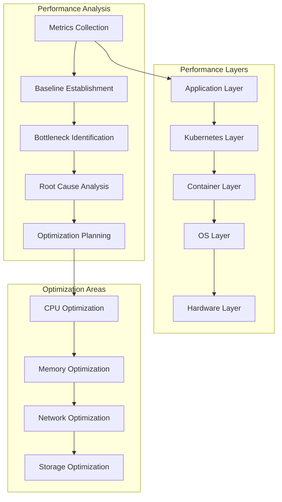

# Session 3: 성능 튜닝 및 최적화

## 📍 교과과정에서의 위치
이 세션은 **Week 2 > Day 4 > Session 3**으로, 업그레이드 및 마이그레이션 전략 이해를 바탕으로 Kubernetes 클러스터의 성능 분석, 튜닝 및 최적화 기법을 심화 분석합니다.

## 학습 목표 (5분)
- **클러스터 성능 분석** 방법론과 **병목 지점 식별** 기법
- **리소스 최적화** 전략과 **비용 효율성** 개선 방안
- **네트워크 및 스토리지** 성능 튜닝 기법 습득

## 1. 이론: 클러스터 성능 분석 및 진단 (20분)

### 성능 분석 프레임워크



### 성능 메트릭 체계

```
Kubernetes 성능 메트릭:

클러스터 레벨 메트릭:
├── API 서버 성능:
│   ├── 요청 처리 시간 (P50, P95, P99)
│   ├── 요청 처리량 (RPS)
│   ├── 에러율 및 타임아웃
│   ├── 인증/권한 부여 지연시간
│   ├── etcd 통신 지연시간
│   └── 웹훅 처리 시간
├── etcd 성능:
│   ├── 읽기/쓰기 지연시간
│   ├── 디스크 동기화 시간
│   ├── 네트워크 라운드트립 시간
│   ├── 리더 선출 시간
│   ├── 압축 및 조각 모음 시간
│   └── 백엔드 커밋 지연시간
├── 스케줄러 성능:
│   ├── 스케줄링 지연시간
│   ├── 스케줄링 처리량
│   ├── 스케줄링 실패율
│   ├── 필터링 단계 시간
│   ├── 점수 매기기 시간
│   └── 바인딩 지연시간
└── 컨트롤러 성능:
    ├── 조정 루프 지연시간
    ├── 워크큐 깊이 및 처리율
    ├── 이벤트 처리 지연시간
    ├── 리소스 동기화 시간
    └── 에러 및 재시도 비율

노드 레벨 메트릭:
├── 시스템 리소스:
│   ├── CPU 사용률 (user, system, iowait, steal)
│   ├── 메모리 사용률 (used, available, cached, buffer)
│   ├── 디스크 I/O (IOPS, 처리량, 지연시간, 큐 깊이)
│   ├── 네트워크 I/O (패킷/바이트 송수신, 에러, 드롭)
│   ├── 파일시스템 사용률 (용량, inode)
│   └── 로드 애버리지 및 컨텍스트 스위치
├── kubelet 성능:
│   ├── Pod 시작 시간
│   ├── 이미지 풀링 시간
│   ├── 볼륨 마운트 시간
│   ├── 컨테이너 런타임 통신 지연
│   ├── cAdvisor 메트릭 수집 시간
│   └── 가비지 컬렉션 시간
├── 컨테이너 런타임:
│   ├── 컨테이너 생성/시작/중지 시간
│   ├── 이미지 레이어 다운로드 시간
│   ├── 오버레이 파일시스템 성능
│   ├── 네트워크 네임스페이스 생성 시간
│   └── 리소스 제한 적용 오버헤드
└── 네트워크 성능:
    ├── CNI 플러그인 성능
    ├── kube-proxy 규칙 업데이트 시간
    ├── 서비스 디스커버리 지연시간
    ├── 로드 밸런싱 성능
    └── 네트워크 정책 적용 오버헤드

워크로드 레벨 메트릭:
├── 애플리케이션 성능:
│   ├── 응답 시간 및 처리량
│   ├── 에러율 및 가용성
│   ├── 리소스 사용 효율성
│   ├── 스케일링 반응성
│   └── 사용자 경험 메트릭
├── Pod 성능:
│   ├── 시작 시간 및 준비 시간
│   ├── 리소스 사용률 vs 요청/제한
│   ├── 재시작 빈도 및 원인
│   ├── 네트워크 연결 성능
│   └── 스토리지 I/O 성능
└── 서비스 성능:
    ├── 엔드포인트 업데이트 지연
    ├── 로드 밸런싱 분산 효율성
    ├── 세션 어피니티 성능
    ├── 헬스 체크 응답 시간
    └── 서비스 메시 오버헤드
```

### 성능 병목 지점 식별

```
병목 지점 분석 방법론:

CPU 병목 분석:
├── CPU 사용률 패턴 분석:
│   ├── 시간대별 CPU 사용률 추이
│   ├── 프로세스별 CPU 소비 분석
│   ├── 컨텍스트 스위치 빈도 측정
│   ├── 인터럽트 처리 오버헤드
│   └── CPU 스로틀링 발생 여부
├── CPU 바운드 워크로드 식별:
│   ├── CPU 집약적 애플리케이션 분류
│   ├── 배치 작업 vs 대화형 워크로드
│   ├── CPU 요청량 vs 실제 사용량
│   ├── 노드별 CPU 분산 상태
│   └── CPU 어피니티 최적화 기회
└── 최적화 전략:
    ├── CPU 리소스 할당 조정
    ├── 워크로드 분산 개선
    ├── CPU 어피니티 설정
    ├── 프로세스 우선순위 조정
    └── 하드웨어 업그레이드 고려

메모리 병목 분석:
├── 메모리 사용 패턴:
│   ├── 메모리 사용률 및 압박 상태
│   ├── 페이지 폴트 및 스왑 사용량
│   ├── 캐시 및 버퍼 효율성
│   ├── 메모리 누수 탐지
│   └── OOM 이벤트 분석
├── 메모리 최적화:
│   ├── 메모리 요청/제한 조정
│   ├── JVM 힙 크기 최적화
│   ├── 캐시 계층 최적화
│   ├── 메모리 압축 활용
│   └── 스왑 정책 조정
└── 가비지 컬렉션 최적화:
    ├── GC 알고리즘 선택
    ├── 힙 크기 및 세대 비율 조정
    ├── GC 일시 정지 시간 최소화
    ├── 메모리 할당 패턴 분석
    └── 오프힙 메모리 활용

I/O 병목 분석:
├── 디스크 I/O 성능:
│   ├── IOPS 및 처리량 분석
│   ├── I/O 대기 시간 측정
│   ├── 큐 깊이 및 병목 지점
│   ├── 순차 vs 랜덤 I/O 패턴
│   └── 파일시스템 성능 분석
├── 네트워크 I/O 성능:
│   ├── 네트워크 처리량 및 지연시간
│   ├── 패킷 드롭 및 재전송율
│   ├── 연결 수 및 연결 풀 효율성
│   ├── DNS 해석 성능
│   └── 로드 밸런서 성능
└── 스토리지 최적화:
    ├── 스토리지 클래스 선택
    ├── 볼륨 성능 튜닝
    ├── 캐시 계층 구성
    ├── 압축 및 중복제거
    └── 백업 및 스냅샷 최적화
```

## 2. 이론: 리소스 최적화 전략 (15분)

### 리소스 효율성 개선

```
리소스 최적화 방법론:

CPU 최적화:
├── 리소스 요청 최적화:
│   ├── VPA를 통한 자동 크기 조정
│   ├── 과거 사용량 기반 요청량 설정
│   ├── 버스트 패턴 고려한 제한 설정
│   ├── QoS 클래스 최적화
│   └── CPU 어피니티 및 토폴로지 고려
├── 스케줄링 최적화:
│   ├── 노드 어피니티 규칙 설정
│   ├── Pod 안티어피니티로 분산 배치
│   ├── 토폴로지 분산 제약 활용
│   ├── 우선순위 클래스 설정
│   └── 테인트 및 톨러레이션 활용
└── 워크로드 최적화:
    ├── CPU 집약적 작업 분리
    ├── 배치 작업 스케줄링 최적화
    ├── 멀티스레딩 효율성 개선
    ├── 알고리즘 및 데이터 구조 최적화
    └── 컴파일러 최적화 옵션 활용

메모리 최적화:
├── 메모리 할당 최적화:
│   ├── 메모리 요청량 정확한 설정
│   ├── 메모리 제한으로 OOM 방지
│   ├── 메모리 오버커밋 정책 조정
│   ├── 스왑 사용 최소화
│   └── NUMA 토폴로지 고려
├── 애플리케이션 메모리 최적화:
│   ├── 메모리 풀링 및 재사용
│   ├── 객체 생성 최소화
│   ├── 캐시 크기 최적화
│   ├── 메모리 매핑 파일 활용
│   └── 압축 알고리즘 적용
└── 가비지 컬렉션 튜닝:
    ├── GC 알고리즘 선택 (G1, ZGC, Shenandoah)
    ├── 힙 크기 및 세대 비율 조정
    ├── GC 트리거 임계값 설정
    ├── 병렬 GC 스레드 수 조정
    └── 오프힙 스토리지 활용

스토리지 최적화:
├── 볼륨 성능 튜닝:
│   ├── 스토리지 클래스 선택 최적화
│   ├── IOPS 및 처리량 프로비저닝
│   ├── 볼륨 크기 및 성능 비례 고려
│   ├── 로컬 SSD vs 네트워크 스토리지
│   └── 읽기 전용 볼륨 활용
├── 파일시스템 최적화:
│   ├── 파일시스템 선택 (ext4, xfs, btrfs)
│   ├── 마운트 옵션 튜닝 (noatime, relatime)
│   ├── 블록 크기 최적화
│   ├── 저널링 모드 설정
│   └── 압축 및 중복제거 활용
└── 캐싱 전략:
    ├── 애플리케이션 레벨 캐시
    ├── 분산 캐시 시스템 (Redis, Memcached)
    ├── CDN 및 엣지 캐싱
    ├── 데이터베이스 쿼리 캐시
    └── 파일시스템 캐시 최적화

네트워크 최적화:
├── 네트워크 토폴로지 최적화:
│   ├── 지역별 클러스터 배치
│   ├── 가용성 영역 분산 전략
│   ├── 네트워크 지연시간 최소화
│   ├── 대역폭 사용량 최적화
│   └── 네트워크 홉 수 최소화
├── 서비스 메시 최적화:
│   ├── 사이드카 프록시 성능 튜닝
│   ├── 서킷 브레이커 및 재시도 정책
│   ├── 연결 풀링 최적화
│   ├── 압축 및 프로토콜 최적화
│   └── 트래픽 라우팅 최적화
└── 로드 밸런싱 최적화:
    ├── 로드 밸런싱 알고리즘 선택
    ├── 헬스 체크 최적화
    ├── 세션 어피니티 설정
    ├── 연결 드레이닝 최적화
    └── 글로벌 로드 밸런싱
```

## 3. 이론: 비용 최적화 전략 (10분)

### 클라우드 비용 최적화

```
비용 효율성 개선:

리소스 사용률 최적화:
├── 리소스 모니터링 및 분석:
│   ├── 실제 vs 요청 리소스 비교
│   ├── 유휴 리소스 식별 및 회수
│   ├── 피크 시간대 분석
│   ├── 계절성 패턴 고려
│   └── 리소스 사용률 목표 설정
├── 자동 스케일링 최적화:
│   ├── HPA 메트릭 및 임계값 조정
│   ├── VPA를 통한 적정 크기 조정
│   ├── 클러스터 오토스케일러 정책
│   ├── 스케일 다운 지연 최적화
│   └── 예측적 스케일링 구현
└── 워크로드 최적화:
    ├── 배치 작업 스케줄링 최적화
    ├── 스팟 인스턴스 활용
    ├── 예약 인스턴스 계획
    ├── 멀티 클라우드 비용 비교
    └── 서버리스 워크로드 전환

인스턴스 최적화:
├── 인스턴스 타입 선택:
│   ├── 워크로드 특성별 최적 인스턴스
│   ├── CPU vs 메모리 집약적 분류
│   ├── 네트워크 성능 요구사항
│   ├── 스토리지 성능 요구사항
│   └── 가격 대비 성능 분석
├── 스팟 인스턴스 활용:
│   ├── 내결함성 워크로드 식별
│   ├── 스팟 인스턴스 혼합 전략
│   ├── 인터럽션 처리 메커니즘
│   ├── 다중 인스턴스 타입 활용
│   └── 비용 절감 효과 측정
└── 예약 인스턴스 계획:
    ├── 베이스라인 용량 분석
    ├── 예약 기간 및 결제 옵션
    ├── 인스턴스 패밀리 유연성
    ├── 가용성 영역 유연성
    └── ROI 계산 및 추적

스토리지 비용 최적화:
├── 스토리지 계층화:
│   ├── 핫, 웜, 콜드 데이터 분류
│   ├── 자동 계층화 정책 설정
│   ├── 아카이빙 및 삭제 정책
│   ├── 압축 및 중복제거
│   └── 백업 보관 정책 최적화
├── 볼륨 최적화:
│   ├── 볼륨 크기 적정화
│   ├── IOPS 프로비저닝 최적화
│   ├── 스냅샷 관리 정책
│   ├── 미사용 볼륨 정리
│   └── 스토리지 클래스 최적화
└── 네트워크 비용:
    ├── 데이터 전송 비용 최소화
    ├── CDN 활용을 통한 비용 절감
    ├── 지역 간 트래픽 최적화
    ├── 압축을 통한 대역폭 절약
    └── 캐싱을 통한 반복 전송 방지
```

## 4. 개념 예시: 성능 튜닝 구성 (12분)

### 성능 모니터링 대시보드 구성 예시

```yaml
# Grafana 성능 대시보드 (개념 예시)
apiVersion: v1
kind: ConfigMap
metadata:
  name: performance-dashboard
data:
  dashboard.json: |
    {
      "dashboard": {
        "title": "Kubernetes Performance Dashboard",
        "panels": [
          {
            "title": "API Server Performance",
            "targets": [
              {
                "expr": "histogram_quantile(0.99, apiserver_request_duration_seconds_bucket)",
                "legendFormat": "99th percentile"
              },
              {
                "expr": "rate(apiserver_request_total[5m])",
                "legendFormat": "Request Rate"
              }
            ]
          },
          {
            "title": "etcd Performance",
            "targets": [
              {
                "expr": "histogram_quantile(0.99, etcd_disk_wal_fsync_duration_seconds_bucket)",
                "legendFormat": "WAL fsync 99th percentile"
              }
            ]
          },
          {
            "title": "Node Resource Usage",
            "targets": [
              {
                "expr": "100 - (avg by (instance) (rate(node_cpu_seconds_total{mode=\"idle\"}[5m])) * 100)",
                "legendFormat": "CPU Usage %"
              },
              {
                "expr": "(1 - (node_memory_MemAvailable_bytes / node_memory_MemTotal_bytes)) * 100",
                "legendFormat": "Memory Usage %"
              }
            ]
          }
        ]
      }
    }
```

### 리소스 최적화 정책 예시

```yaml
# VPA 구성 (개념 예시)
apiVersion: autoscaling.k8s.io/v1
kind: VerticalPodAutoscaler
metadata:
  name: performance-optimized-vpa
spec:
  targetRef:
    apiVersion: apps/v1
    kind: Deployment
    name: web-application
  updatePolicy:
    updateMode: "Auto"
  resourcePolicy:
    containerPolicies:
    - containerName: web-app
      minAllowed:
        cpu: 100m
        memory: 128Mi
      maxAllowed:
        cpu: 2
        memory: 4Gi
      controlledResources: ["cpu", "memory"]
      controlledValues: RequestsAndLimits

---
# HPA 구성
apiVersion: autoscaling/v2
kind: HorizontalPodAutoscaler
metadata:
  name: performance-optimized-hpa
spec:
  scaleTargetRef:
    apiVersion: apps/v1
    kind: Deployment
    name: web-application
  minReplicas: 3
  maxReplicas: 100
  metrics:
  - type: Resource
    resource:
      name: cpu
      target:
        type: Utilization
        averageUtilization: 70
  - type: Resource
    resource:
      name: memory
      target:
        type: Utilization
        averageUtilization: 80
  behavior:
    scaleUp:
      stabilizationWindowSeconds: 60
      policies:
      - type: Percent
        value: 50
        periodSeconds: 60
    scaleDown:
      stabilizationWindowSeconds: 300
      policies:
      - type: Percent
        value: 10
        periodSeconds: 60
```

### 성능 벤치마크 스크립트 예시

```bash
#!/bin/bash
# Kubernetes 성능 벤치마크 스크립트 (개념 예시)

echo "Starting Kubernetes performance benchmark..."

# 1. API 서버 성능 테스트
echo "Testing API Server performance..."
kubectl get --raw /metrics | grep apiserver_request_duration_seconds

# 2. etcd 성능 테스트
echo "Testing etcd performance..."
kubectl exec -n kube-system etcd-master -- etcdctl \
  --endpoints=https://127.0.0.1:2379 \
  --cacert=/etc/kubernetes/pki/etcd/ca.crt \
  --cert=/etc/kubernetes/pki/etcd/server.crt \
  --key=/etc/kubernetes/pki/etcd/server.key \
  endpoint status --write-out=table

# 3. 노드 리소스 사용률 확인
echo "Checking node resource utilization..."
kubectl top nodes

# 4. Pod 리소스 사용률 확인
echo "Checking pod resource utilization..."
kubectl top pods --all-namespaces --sort-by=cpu

# 5. 네트워크 성능 테스트
echo "Testing network performance..."
kubectl run network-test --image=nicolaka/netshoot --rm -it -- \
  iperf3 -c iperf-server.default.svc.cluster.local

# 6. 스토리지 성능 테스트
echo "Testing storage performance..."
kubectl run storage-test --image=alpine --rm -it -- \
  dd if=/dev/zero of=/tmp/test bs=1M count=1000 oflag=direct

echo "Performance benchmark completed!"
```

### 비용 최적화 분석 예시

```yaml
# 비용 최적화 분석 도구 (개념 예시)
apiVersion: batch/v1
kind: CronJob
metadata:
  name: cost-optimization-analyzer
spec:
  schedule: "0 6 * * *"
  jobTemplate:
    spec:
      template:
        spec:
          containers:
          - name: cost-analyzer
            image: cost-analyzer:latest
            command:
            - /bin/sh
            - -c
            - |
              # 리소스 사용률 분석
              kubectl top nodes --no-headers | awk '{
                cpu_usage = $3; mem_usage = $5;
                if (cpu_usage < 50 || mem_usage < 50) {
                  print "Underutilized node: " $1 " CPU:" cpu_usage "% Memory:" mem_usage "%"
                }
              }'
              
              # 유휴 리소스 식별
              kubectl get pods --all-namespaces -o json | jq -r '
                .items[] | select(.status.phase == "Running") |
                select(.spec.containers[].resources.requests.cpu == null or 
                       .spec.containers[].resources.requests.memory == null) |
                "\(.metadata.namespace)/\(.metadata.name) - Missing resource requests"
              '
              
              # 스팟 인스턴스 후보 식별
              kubectl get nodes -l node.kubernetes.io/instance-type -o json | jq -r '
                .items[] | select(.spec.taints == null or 
                (.spec.taints | map(.key) | index("node.kubernetes.io/not-ready") == null)) |
                "\(.metadata.name) - Candidate for spot instance"
              '
          restartPolicy: OnFailure
```

## 5. 토론 및 정리 (8분)

### 핵심 개념 정리
- **체계적 성능 분석**을 통한 **병목 지점 식별** 및 **최적화 우선순위** 설정
- **리소스 효율성 개선**을 통한 **성능 향상**과 **비용 절감** 동시 달성
- **자동화된 최적화** 도구 활용을 통한 **지속적 성능 개선**
- **모니터링 기반** 데이터 드리븐 **최적화 의사결정**

### 토론 주제
"클라우드 네이티브 환경에서 성능 최적화와 비용 효율성을 동시에 달성하기 위한 균형잡힌 전략은 무엇인가?"

## 💡 핵심 키워드
- **성능 분석**: 메트릭 수집, 병목 식별, 근본 원인 분석
- **리소스 최적화**: CPU/메모리/스토리지/네트워크 튜닝
- **비용 최적화**: 스팟 인스턴스, 자동 스케일링, 리소스 효율성
- **자동화**: VPA/HPA, 성능 모니터링, 지속적 최적화

## 📚 참고 자료
- [Kubernetes 성능 튜닝](https://kubernetes.io/docs/concepts/cluster-administration/system-metrics/)
- [리소스 관리 모범 사례](https://kubernetes.io/docs/concepts/configuration/manage-resources-containers/)
- [클라우드 비용 최적화](https://www.cncf.io/blog/2021/06/29/kubernetes-cost-optimization/)
