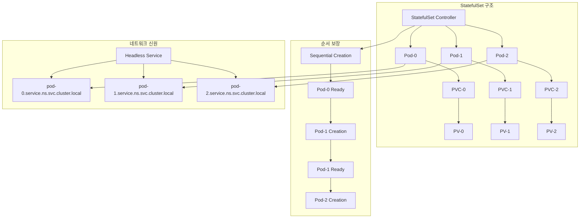
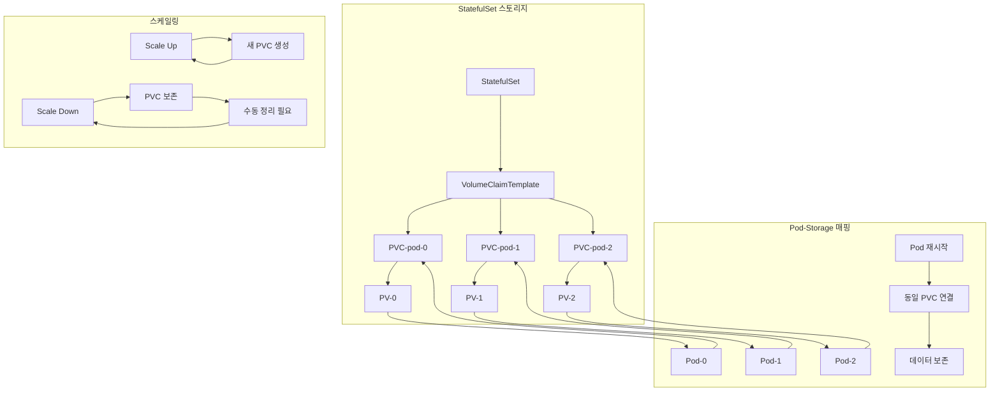
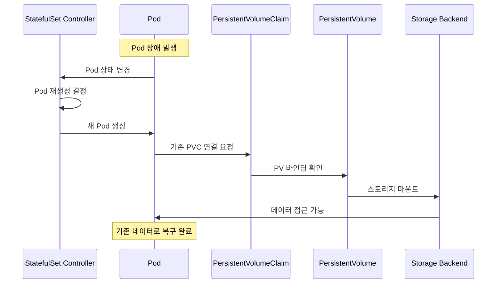
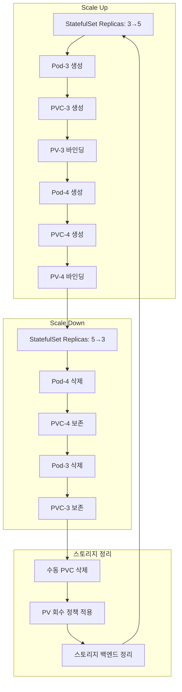

# Session 3: StatefulSet과 영구 스토리지

## 📍 교과과정에서의 위치
이 세션은 **Week 2 > Day 4 > Session 3**으로, Session 1-2에서 학습한 볼륨과 스토리지 클래스를 바탕으로 StatefulSet의 영구 스토리지 연결과 상태 유지 메커니즘을 학습합니다.

## 학습 목표 (5분)
- **StatefulSet** 개념과 **순서 보장** 메커니즘 완전 이해
- **영구 스토리지** 연결과 **데이터 영속성** 학습
- **Pod 재시작**과 **스토리지 유지** 원리 파악
- **스케일링**과 **스토리지 관리** 전략 이해

## 1. StatefulSet 개념과 순서 보장 메커니즘 (15분)

### StatefulSet 아키텍처



### StatefulSet 상세 분석
```
StatefulSet 기본 개념:

StatefulSet vs Deployment:
├── Deployment (무상태 워크로드):
│   ├── Pod 간 동일성 (Identical Pods)
│   ├── 임의 순서 생성/삭제
│   ├── 임시 네트워크 신원
│   ├── 공유 스토리지 또는 무상태
│   ├── 수평 확장 최적화
│   └── 로드 밸런싱 친화적
├── StatefulSet (상태 유지 워크로드):
│   ├── Pod 간 고유성 (Unique Pods)
│   ├── 순차적 생성/삭제
│   ├── 안정적 네트워크 신원
│   ├── 개별 영구 스토리지
│   ├── 순서 의존성 관리
│   └── 상태 유지 최적화

StatefulSet 핵심 특징:
├── 안정적 네트워크 신원:
│   ├── 예측 가능한 Pod 이름 (pod-0, pod-1, ...)
│   ├── 고정된 DNS 이름
│   ├── Headless Service 연동
│   ├── 재시작 후에도 동일한 이름
│   └── 클러스터 멤버십 관리
├── 안정적 스토리지:
│   ├── Pod별 전용 PVC
│   ├── Pod 재시작 시 동일 스토리지 연결
│   ├── 스케일 다운 시 PVC 보존
│   ├── 데이터 영속성 보장
│   └── 개별 스토리지 관리
├── 순서 보장:
│   ├── 순차적 배포 (0 → 1 → 2)
│   ├── 역순 종료 (2 → 1 → 0)
│   ├── 이전 Pod 준비 완료 후 다음 Pod 생성
│   ├── 롤링 업데이트 순서 제어
│   └── 장애 복구 순서 관리

순서 보장 메커니즘:
├── Pod 생성 과정:
│   ├── StatefulSet Controller가 Pod-0 생성
│   ├── Pod-0이 Running 및 Ready 상태 대기
│   ├── Pod-0 준비 완료 후 Pod-1 생성
│   ├── 순차적으로 모든 Pod 생성
│   └── 각 단계별 상태 검증
├── Pod 삭제 과정:
│   ├── 가장 높은 순번 Pod부터 삭제
│   ├── Pod 완전 종료 확인 후 다음 Pod 삭제
│   ├── 역순으로 모든 Pod 삭제
│   ├── PVC는 삭제되지 않고 보존
│   └── 데이터 보존 및 재사용 가능
├── 업데이트 전략:
│   ├── RollingUpdate (기본): 순차적 업데이트
│   ├── OnDelete: 수동 삭제 시에만 업데이트
│   ├── Partition: 특정 순번 이후만 업데이트
│   ├── 카나리 배포 지원
│   └── 점진적 롤아웃 제어

StatefulSet 사용 사례:
├── 데이터베이스:
│   ├── MySQL, PostgreSQL 클러스터
│   ├── MongoDB 레플리카 세트
│   ├── Cassandra, CockroachDB
│   ├── Redis 클러스터
│   └── 마스터-슬레이브 구조
├── 메시징 시스템:
│   ├── Apache Kafka
│   ├── RabbitMQ 클러스터
│   ├── Apache Pulsar
│   ├── NATS Streaming
│   └── 순서 보장 메시징
├── 분산 시스템:
│   ├── Apache Zookeeper
│   ├── etcd 클러스터
│   ├── Consul
│   ├── Elasticsearch
│   └── 분산 코디네이션
└── 상태 유지 애플리케이션:
    ├── 게임 서버
    ├── 세션 저장소
    ├── 캐시 클러스터
    ├── 워크플로우 엔진
    └── 상태 기반 처리
```

## 2. 영구 스토리지 연결과 데이터 영속성 (12분)

### StatefulSet 스토리지 연결



### 영구 스토리지 상세 분석
```
StatefulSet 영구 스토리지:

VolumeClaimTemplate:
├── 기본 개념:
│   ├── PVC 생성을 위한 템플릿
│   ├── 각 Pod마다 개별 PVC 생성
│   ├── Pod 이름 기반 PVC 명명
│   ├── StorageClass 기반 동적 프로비저닝
│   └── 일관된 스토리지 설정
├── 템플릿 구성:
│   ├── metadata: PVC 메타데이터 템플릿
│   ├── spec: 스토리지 요구사항
│   ├── accessModes: 접근 모드 설정
│   ├── resources: 용량 요청
│   ├── storageClassName: 스토리지 클래스
│   └── selector: PV 선택 조건
├── PVC 생성 규칙:
│   ├── 명명 규칙: <template-name>-<pod-name>
│   ├── 예: data-mysql-0, data-mysql-1
│   ├── Pod 생성과 동시에 PVC 생성
│   ├── 바인딩 완료 후 Pod 시작
│   └── 개별 PVC 독립 관리

데이터 영속성 보장:
├── Pod 재시작 시:
│   ├── 동일한 PVC에 재연결
│   ├── 기존 데이터 완전 보존
│   ├── 애플리케이션 상태 복구
│   ├── 설정 및 로그 유지
│   └── 무중단 데이터 접근
├── 노드 장애 시:
│   ├── 다른 노드에서 Pod 재시작
│   ├── 네트워크 스토리지 자동 연결
│   ├── 데이터 가용성 유지
│   ├── 클러스터 복구 지원
│   └── 자동 장애 조치
├── 업데이트 시:
│   ├── 롤링 업데이트 중 데이터 보존
│   ├── 새 버전 Pod에 기존 데이터 연결
│   ├── 업데이트 실패 시 롤백 가능
│   ├── 데이터 일관성 유지
│   └── 무중단 업데이트 지원

스토리지 관리 패턴:
├── 개별 스토리지 패턴:
│   ├── 각 Pod마다 전용 스토리지
│   ├── 독립적인 데이터 관리
│   ├── 장애 격리 효과
│   ├── 개별 백업 및 복구
│   └── 확장성 및 성능 최적화
├── 공유 스토리지 패턴:
│   ├── 여러 Pod가 동일 스토리지 공유
│   ├── ReadWriteMany 접근 모드 필요
│   ├── 데이터 일관성 관리 복잡
│   ├── 파일 시스템 기반 공유
│   └── 협업 워크로드에 적합
├── 계층화 스토리지:
│   ├── 핫 데이터: 고성능 SSD
│   ├── 웜 데이터: 표준 스토리지
│   ├── 콜드 데이터: 저비용 스토리지
│   ├── 자동 계층화 정책
│   └── 비용 최적화 전략

스토리지 백업 전략:
├── 개별 백업:
│   ├── Pod별 독립적 백업
│   ├── 스냅샷 기반 백업
│   ├── 증분 백업 지원
│   ├── 개별 복구 가능
│   └── 세밀한 백업 제어
├── 클러스터 백업:
│   ├── 전체 StatefulSet 백업
│   ├── 일관된 시점 백업
│   ├── 클러스터 상태 보존
│   ├── 전체 복구 지원
│   └── 재해 복구 최적화
├── 연속 복제:
│   ├── 실시간 데이터 복제
│   ├── 지역 간 복제
│   ├── 자동 장애 조치
│   ├── RPO/RTO 최소화
│   └── 고가용성 보장
└── 백업 자동화:
    ├── 스케줄 기반 백업
    ├── 정책 기반 보존
    ├── 자동 정리 및 아카이브
    ├── 모니터링 및 알림
    └── 복구 테스트 자동화
```

## 3. Pod 재시작과 스토리지 유지 원리 (10분)

### Pod 재시작 시나리오



### Pod 재시작 메커니즘 상세 분석
```
Pod 재시작과 스토리지 유지:

Pod 재시작 시나리오:
├── 계획된 재시작:
│   ├── 업데이트 및 패치 적용
│   ├── 설정 변경 반영
│   ├── 리소스 할당 조정
│   ├── 노드 유지보수
│   └── 스케줄링 최적화
├── 비계획된 재시작:
│   ├── 애플리케이션 크래시
│   ├── 노드 장애
│   ├── 네트워크 분할
│   ├── 리소스 부족
│   └── 하드웨어 장애
├── 자동 복구:
│   ├── kubelet 자동 재시작
│   ├── StatefulSet Controller 관리
│   ├── 헬스 체크 기반 복구
│   ├── 리소스 모니터링
│   └── 자동 장애 조치

스토리지 연결 과정:
├── Pod 생성 단계:
│   ├── StatefulSet Controller가 Pod 스펙 생성
│   ├── 기존 PVC 이름 매핑 확인
│   ├── PVC 존재 여부 검증
│   ├── 볼륨 마운트 설정
│   └── Pod 스케줄링 및 생성
├── 볼륨 연결 단계:
│   ├── kubelet이 PVC 상태 확인
│   ├── PV 바인딩 상태 검증
│   ├── CSI 드라이버 호출
│   ├── 스토리지 백엔드 마운트
│   ├── 파일시스템 검사 및 복구
│   └── 컨테이너 볼륨 마운트
├── 데이터 복구 단계:
│   ├── 애플리케이션 시작
│   ├── 기존 데이터 검증
│   ├── 상태 복구 프로세스
│   ├── 클러스터 재조인
│   └── 서비스 준비 완료

데이터 일관성 보장:
├── 파일시스템 수준:
│   ├── 저널링 파일시스템 사용
│   ├── 파일시스템 체크 자동 실행
│   ├── 메타데이터 일관성 검증
│   ├── 손상된 블록 복구
│   └── 백업 슈퍼블록 활용
├── 애플리케이션 수준:
│   ├── 트랜잭션 로그 복구
│   ├── 체크포인트 기반 복구
│   ├── WAL (Write-Ahead Logging)
│   ├── 데이터 무결성 검증
│   └── 자동 복구 메커니즘
├── 클러스터 수준:
│   ├── 분산 합의 알고리즘
│   ├── 리더 선출 프로세스
│   ├── 데이터 동기화
│   ├── 스플릿 브레인 방지
│   └── 쿼럼 기반 결정

장애 복구 전략:
├── 빠른 복구:
│   ├── 로컬 스토리지 우선 사용
│   ├── 캐시 및 버퍼 최적화
│   ├── 병렬 복구 프로세스
│   ├── 우선순위 기반 복구
│   └── 점진적 서비스 복구
├── 안전한 복구:
│   ├── 데이터 무결성 우선
│   ├── 완전한 검증 후 서비스
│   ├── 백업에서 복구 옵션
│   ├── 수동 개입 지점 제공
│   └── 복구 과정 로깅
├── 자동화된 복구:
│   ├── 헬스 체크 기반 자동 복구
│   ├── 임계값 기반 에스컬레이션
│   ├── 알림 및 모니터링 통합
│   ├── 복구 성공률 추적
│   └── 지속적 개선
└── 수동 복구:
    ├── 복잡한 장애 상황 대응
    ├── 데이터 손실 위험 상황
    ├── 전문가 개입 필요
    ├── 단계별 복구 절차
    └── 문서화된 복구 가이드
```

## 4. 스케일링과 스토리지 관리 전략 (10분)

### StatefulSet 스케일링



### 스케일링 전략 상세 분석
```
StatefulSet 스케일링 관리:

Scale Up (확장):
├── 확장 과정:
│   ├── StatefulSet replicas 수 증가
│   ├── 순차적 Pod 생성 (기존 순서 유지)
│   ├── 각 새 Pod마다 PVC 자동 생성
│   ├── 동적 프로비저닝으로 PV 생성
│   ├── 볼륨 바인딩 및 마운트
│   ├── 애플리케이션 초기화
│   └── 클러스터 조인 및 동기화
├── 확장 고려사항:
│   ├── 스토리지 용량 계획
│   ├── 네트워크 대역폭 영향
│   ├── 클러스터 리밸런싱
│   ├── 성능 영향 분석
│   ├── 라이선스 및 비용
│   └── 모니터링 및 알림 설정
├── 자동 확장:
│   ├── HPA (Horizontal Pod Autoscaler) 제한
│   ├── VPA (Vertical Pod Autoscaler) 활용
│   ├── 커스텀 메트릭 기반 확장
│   ├── 예측 기반 확장
│   └── 비즈니스 규칙 기반 확장

Scale Down (축소):
├── 축소 과정:
│   ├── StatefulSet replicas 수 감소
│   ├── 역순으로 Pod 삭제 (높은 순번부터)
│   ├── Pod 정상 종료 대기
│   ├── PVC는 자동 삭제되지 않음
│   ├── 데이터 보존 상태 유지
│   └── 수동 정리 필요
├── 축소 고려사항:
│   ├── 데이터 재분산 필요성
│   ├── 쿼럼 및 가용성 영향
│   ├── 클라이언트 연결 재조정
│   ├── 백업 및 아카이브
│   ├── 성능 모니터링
│   └── 롤백 계획 수립
├── 안전한 축소:
│   ├── 데이터 마이그레이션 선행
│   ├── 복제본 재배치
│   ├── 헬스 체크 확인
│   ├── 단계적 축소 진행
│   └── 모니터링 강화

스토리지 관리 전략:
├── PVC 생명주기 관리:
│   ├── 자동 생성: Scale Up 시
│   ├── 수동 삭제: Scale Down 후
│   ├── 보존 정책: 데이터 보호
│   ├── 정리 자동화: 스크립트 활용
│   └── 비용 모니터링: 사용하지 않는 PVC
├── 스토리지 최적화:
│   ├── 용량 계획 및 예측
│   ├── 성능 모니터링 및 튜닝
│   ├── 비용 최적화 전략
│   ├── 백업 및 아카이브 정책
│   └── 라이프사이클 관리
├── 데이터 관리:
│   ├── 백업 전략 수립
│   ├── 복구 절차 문서화
│   ├── 데이터 마이그레이션 계획
│   ├── 보안 및 암호화
│   └── 컴플라이언스 준수

운영 모범 사례:
├── 용량 계획:
│   ├── 성장률 기반 예측
│   ├── 피크 사용량 고려
│   ├── 여유 용량 확보
│   ├── 비용 vs 성능 균형
│   └── 정기적 검토 및 조정
├── 모니터링:
│   ├── 스토리지 사용량 추적
│   ├── 성능 메트릭 수집
│   ├── 알림 및 임계값 설정
│   ├── 트렌드 분석
│   └── 예측적 유지보수
├── 자동화:
│   ├── 스케일링 정책 자동화
│   ├── 백업 스케줄 자동화
│   ├── 정리 작업 자동화
│   ├── 모니터링 자동화
│   └── 알림 및 대응 자동화
└── 거버넌스:
    ├── 변경 관리 프로세스
    ├── 승인 워크플로우
    ├── 문서화 및 교육
    ├── 정기적 검토
    └── 지속적 개선
```

## 💬 그룹 토론: StatefulSet 사용 시나리오와 설계 전략 (8분)

### 토론 주제
**"StatefulSet을 사용해야 하는 시나리오와 효과적인 설계 전략은 무엇이며, 운영 시 주의해야 할 점은 무엇인가?"**

## 💡 핵심 개념 정리
- **StatefulSet**: 순서 보장, 안정적 네트워크 신원, 영구 스토리지
- **VolumeClaimTemplate**: Pod별 개별 PVC 생성, 데이터 영속성
- **순서 보장**: 순차적 생성/삭제, 롤링 업데이트 제어
- **스케일링**: Scale Up 자동화, Scale Down 수동 정리

## 📚 참고 자료
- [StatefulSets](https://kubernetes.io/docs/concepts/workloads/controllers/statefulset/)
- [StatefulSet Basics](https://kubernetes.io/docs/tutorials/stateful-application/basic-stateful-set/)

## 다음 세션 준비
다음 세션에서는 **데이터 백업과 복구 전략**에 대해 학습합니다.