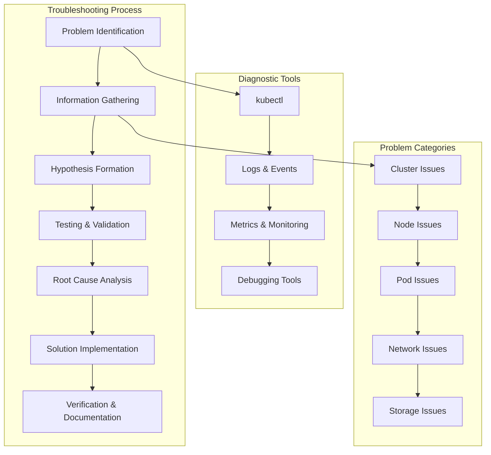

# Session 4: 트러블슈팅 및 디버깅

## 📍 교과과정에서의 위치
이 세션은 **Week 2 > Day 4 > Session 4**로, 성능 튜닝 및 최적화 이해를 바탕으로 Kubernetes 클러스터의 문제 진단, 트러블슈팅 및 디버깅 방법론을 심화 분석합니다.

## 학습 목표 (5분)
- **체계적 문제 진단** 방법론과 **근본 원인 분석** 기법
- **로그 분석** 및 **이벤트 추적**을 통한 **문제 해결** 프로세스
- **디버깅 도구** 활용과 **자동화된 문제 해결** 전략

## 1. 이론: 체계적 트러블슈팅 방법론 (20분)

### 문제 진단 프레임워크



### 문제 분류 및 진단 접근법

```
Kubernetes 문제 분류:

클러스터 레벨 문제:
├── 컨트롤 플레인 장애:
│   ├── API 서버 응답 없음 또는 느림
│   ├── etcd 클러스터 분할 또는 데이터 손실
│   ├── 스케줄러 작동 중단
│   ├── 컨트롤러 매니저 오류
│   └── 네트워크 연결 문제
├── 인증/권한 문제:
│   ├── RBAC 권한 부족
│   ├── 서비스 어카운트 토큰 만료
│   ├── 인증서 만료 또는 오류
│   ├── 웹훅 인증 실패
│   └── 네트워크 정책 차단
└── 리소스 부족:
    ├── 노드 리소스 고갈
    ├── 스토리지 용량 부족
    ├── IP 주소 풀 고갈
    ├── PV/PVC 바인딩 실패
    └── 리소스 쿼터 초과

노드 레벨 문제:
├── 노드 상태 이상:
│   ├── NotReady 상태
│   ├── 네트워크 연결 불가
│   ├── 디스크 압박 (DiskPressure)
│   ├── 메모리 압박 (MemoryPressure)
│   └── PID 압박 (PIDPressure)
├── kubelet 문제:
│   ├── kubelet 서비스 중단
│   ├── 컨테이너 런타임 통신 오류
│   ├── 이미지 풀링 실패
│   ├── 볼륨 마운트 실패
│   └── 네트워크 플러그인 오류
└── 시스템 리소스 문제:
    ├── 높은 CPU/메모리 사용률
    ├── 디스크 I/O 병목
    ├── 네트워크 대역폭 포화
    ├── 파일 디스크립터 부족
    └── 커널 리소스 고갈

Pod 레벨 문제:
├── Pod 시작 실패:
│   ├── 이미지 풀링 오류
│   ├── 리소스 부족으로 스케줄링 실패
│   ├── 볼륨 마운트 실패
│   ├── 초기화 컨테이너 실패
│   └── 보안 정책 위반
├── Pod 런타임 문제:
│   ├── 애플리케이션 크래시
│   ├── 헬스 체크 실패
│   ├── 리소스 제한 초과 (OOMKilled)
│   ├── 네트워크 연결 문제
│   └── 스토리지 접근 오류
└── Pod 종료 문제:
    ├── 그레이스풀 셧다운 실패
    ├── SIGTERM 처리 오류
    ├── 좀비 프로세스 생성
    ├── 리소스 정리 실패
    └── 볼륨 언마운트 오류
```

### 진단 도구 및 명령어

```
kubectl 진단 명령어:

기본 상태 확인:
├── kubectl get nodes -o wide
├── kubectl get pods --all-namespaces -o wide
├── kubectl get events --sort-by='.lastTimestamp'
├── kubectl top nodes
├── kubectl top pods --all-namespaces
├── kubectl describe node <node-name>
├── kubectl describe pod <pod-name>
└── kubectl logs <pod-name> -c <container-name>

고급 진단 명령어:
├── kubectl get pods --field-selector=status.phase=Failed
├── kubectl get pods --field-selector=status.phase=Pending
├── kubectl get events --field-selector type=Warning
├── kubectl get componentstatuses
├── kubectl cluster-info dump
├── kubectl auth can-i <verb> <resource>
├── kubectl explain <resource>
└── kubectl api-resources

디버깅 및 트러블슈팅:
├── kubectl exec -it <pod-name> -- /bin/bash
├── kubectl port-forward <pod-name> 8080:80
├── kubectl cp <pod-name>:/path/to/file ./local-file
├── kubectl attach <pod-name> -c <container-name>
├── kubectl run debug --image=busybox -it --rm
├── kubectl debug <pod-name> --image=busybox
├── kubectl rollout status deployment/<deployment-name>
└── kubectl rollout history deployment/<deployment-name>
```

## 2. 이론: 로그 분석 및 이벤트 추적 (15분)

### 로그 분석 전략

```
로그 분석 방법론:

로그 수집 및 중앙화:
├── 컨테이너 로그 수집:
│   ├── kubectl logs를 통한 실시간 로그
│   ├── 로그 드라이버 설정 (json-file, syslog)
│   ├── 로그 로테이션 및 보관 정책
│   ├── 멀티 컨테이너 Pod 로그 관리
│   └── 사이드카 패턴 로그 수집
├── 시스템 로그 수집:
│   ├── kubelet 로그 (/var/log/kubelet.log)
│   ├── 컨테이너 런타임 로그
│   ├── 시스템 서비스 로그 (systemd)
│   ├── 커널 로그 (dmesg, /var/log/kern.log)
│   └── 네트워크 및 방화벽 로그
└── 중앙집중식 로깅:
    ├── ELK/EFK 스택 구성
    ├── Fluentd/Fluent Bit 로그 수집
    ├── 로그 파싱 및 구조화
    ├── 인덱싱 및 검색 최적화
    └── 로그 보관 및 아카이빙

이벤트 분석:
├── Kubernetes 이벤트:
│   ├── 이벤트 타입 (Normal, Warning)
│   ├── 이벤트 소스 및 대상 오브젝트
│   ├── 이벤트 발생 시간 및 빈도
│   ├── 이벤트 메시지 패턴 분석
│   └── 이벤트 상관관계 분석
├── 이벤트 보존 및 확장:
│   ├── 이벤트 TTL 연장 (기본 1시간)
│   ├── 외부 이벤트 저장소 연동
│   ├── 이벤트 기반 알림 설정
│   ├── 이벤트 메트릭 생성
│   └── 이벤트 기반 자동화
└── 감사 로그 분석:
    ├── API 서버 감사 로그 활성화
    ├── 사용자 활동 추적
    ├── 권한 변경 이력
    ├── 리소스 변경 추적
    └── 보안 이벤트 분석
```

### 문제 패턴 인식

```
일반적인 문제 패턴:

이미지 관련 문제:
├── ImagePullBackOff:
│   ├── 이미지 이름 또는 태그 오류
│   ├── 레지스트리 접근 권한 부족
│   ├── 네트워크 연결 문제
│   ├── 이미지 레지스트리 다운
│   └── 이미지 크기 또는 레이어 문제
├── ErrImagePull:
│   ├── 존재하지 않는 이미지
│   ├── 인증 정보 오류
│   ├── 레지스트리 URL 오류
│   └── 프록시 설정 문제
└── 해결 방법:
    ├── 이미지 이름 및 태그 확인
    ├── imagePullSecrets 설정
    ├── 네트워크 연결성 테스트
    └── 레지스트리 상태 확인

리소스 관련 문제:
├── Pending 상태:
│   ├── 리소스 부족 (CPU, 메모리)
│   ├── 노드 어피니티 조건 불만족
│   ├── 테인트/톨러레이션 불일치
│   ├── PVC 바인딩 실패
│   └── 스케줄링 제약 조건
├── OOMKilled:
│   ├── 메모리 제한 초과
│   ├── 메모리 누수
│   ├── 부적절한 메모리 제한 설정
│   └── JVM 힙 크기 문제
└── CrashLoopBackOff:
    ├── 애플리케이션 시작 실패
    ├── 설정 오류
    ├── 의존성 서비스 접근 불가
    └── 헬스 체크 실패

네트워크 관련 문제:
├── 서비스 연결 실패:
│   ├── 서비스 엔드포인트 없음
│   ├── 네트워크 정책 차단
│   ├── DNS 해석 실패
│   ├── 포트 불일치
│   └── 로드 밸런서 설정 오류
├── DNS 문제:
│   ├── CoreDNS 서비스 장애
│   ├── DNS 정책 설정 오류
│   ├── 네임스페이스 격리 문제
│   └── 외부 DNS 연결 실패
└── 네트워크 정책:
    ├── 기본 거부 정책
    ├── 잘못된 라벨 셀렉터
    ├── 포트 또는 프로토콜 불일치
    └── 네임스페이스 간 통신 차단
```

## 3. 이론: 고급 디버깅 기법 (10분)

### 디버깅 도구 및 기법

```
고급 디버깅 도구:

kubectl debug 명령어:
├── 임시 디버깅 컨테이너 생성
├── 기존 Pod에 디버깅 컨테이너 추가
├── 노드 디버깅을 위한 특권 컨테이너
├── 네트워크 네임스페이스 공유 디버깅
└── 프로세스 네임스페이스 공유 디버깅

네트워크 디버깅:
├── 연결성 테스트 도구:
│   ├── ping, traceroute, nslookup
│   ├── telnet, nc (netcat)
│   ├── curl, wget
│   └── iperf3 (대역폭 테스트)
├── 패킷 분석:
│   ├── tcpdump 패킷 캡처
│   ├── wireshark 분석
│   ├── 네트워크 플로우 추적
│   └── DNS 쿼리 분석
└── 서비스 메시 디버깅:
    ├── Envoy 프록시 로그 분석
    ├── 트래픽 미러링
    ├── 서킷 브레이커 상태
    └── 분산 추적 (Jaeger, Zipkin)

스토리지 디버깅:
├── 볼륨 마운트 문제:
│   ├── 마운트 포인트 확인
│   ├── 파일시스템 권한 검사
│   ├── 스토리지 클래스 호환성
│   └── CSI 드라이버 로그 분석
├── 성능 문제:
│   ├── I/O 메트릭 분석 (iostat, iotop)
│   ├── 디스크 사용량 확인 (df, du)
│   ├── 파일 시스템 오류 검사
│   └── 스토리지 백엔드 상태
└── 데이터 일관성:
    ├── 파일시스템 무결성 검사
    ├── 백업 및 복원 테스트
    ├── 스냅샷 상태 확인
    └── 복제 상태 모니터링
```

## 4. 개념 예시: 트러블슈팅 시나리오 (12분)

### 일반적인 문제 해결 예시

```bash
# Pod 시작 실패 디버깅 (개념 예시)

# 1. Pod 상태 확인
kubectl get pods
kubectl describe pod problematic-pod

# 2. 이벤트 확인
kubectl get events --field-selector involvedObject.name=problematic-pod

# 3. 로그 확인
kubectl logs problematic-pod
kubectl logs problematic-pod --previous

# 4. 리소스 확인
kubectl top nodes
kubectl describe node worker-node-1

# 5. 네트워크 디버깅
kubectl run netshoot --image=nicolaka/netshoot -it --rm
# 컨테이너 내에서:
# nslookup kubernetes.default
# ping google.com
# curl -I http://service-name.namespace.svc.cluster.local
```

### 자동화된 진단 스크립트 예시

```bash
#!/bin/bash
# Kubernetes 클러스터 헬스 체크 스크립트 (개념 예시)

echo "=== Kubernetes Cluster Health Check ==="

# 1. 클러스터 기본 상태
echo "1. Cluster Basic Status"
kubectl cluster-info
kubectl get componentstatuses

# 2. 노드 상태 확인
echo "2. Node Status"
kubectl get nodes -o wide
kubectl top nodes

# 3. 시스템 Pod 상태
echo "3. System Pods Status"
kubectl get pods -n kube-system

# 4. 실패한 Pod 확인
echo "4. Failed Pods"
kubectl get pods --all-namespaces --field-selector=status.phase=Failed

# 5. 대기 중인 Pod 확인
echo "5. Pending Pods"
kubectl get pods --all-namespaces --field-selector=status.phase=Pending

# 6. 최근 경고 이벤트
echo "6. Recent Warning Events"
kubectl get events --all-namespaces --field-selector type=Warning \
  --sort-by='.lastTimestamp' | tail -10

# 7. 리소스 사용률 높은 Pod
echo "7. High Resource Usage Pods"
kubectl top pods --all-namespaces --sort-by=cpu | head -10
kubectl top pods --all-namespaces --sort-by=memory | head -10

# 8. PVC 상태 확인
echo "8. PVC Status"
kubectl get pvc --all-namespaces

# 9. 네트워크 정책 확인
echo "9. Network Policies"
kubectl get networkpolicies --all-namespaces

echo "=== Health Check Complete ==="
```

### 문제 해결 플레이북 예시

```yaml
# 트러블슈팅 플레이북 (개념 예시)
apiVersion: v1
kind: ConfigMap
metadata:
  name: troubleshooting-playbook
data:
  pod-crashloopbackoff.md: |
    # CrashLoopBackOff 문제 해결
    
    ## 진단 단계
    1. Pod 상태 및 재시작 횟수 확인
       ```
       kubectl get pods
       kubectl describe pod <pod-name>
       ```
    
    2. 로그 분석
       ```
       kubectl logs <pod-name>
       kubectl logs <pod-name> --previous
       ```
    
    3. 리소스 제한 확인
       ```
       kubectl describe pod <pod-name> | grep -A 5 Limits
       ```
    
    ## 일반적인 원인
    - 애플리케이션 시작 실패
    - 메모리 부족 (OOMKilled)
    - 설정 파일 오류
    - 의존성 서비스 접근 불가
    
    ## 해결 방법
    - 애플리케이션 로그 분석
    - 리소스 제한 조정
    - 설정 검증
    - 헬스 체크 조정
  
  network-connectivity.md: |
    # 네트워크 연결 문제 해결
    
    ## 진단 단계
    1. 서비스 엔드포인트 확인
       ```
       kubectl get endpoints <service-name>
       kubectl describe service <service-name>
       ```
    
    2. DNS 해석 테스트
       ```
       kubectl run dnsutils --image=tutum/dnsutils -it --rm
       nslookup <service-name>.<namespace>.svc.cluster.local
       ```
    
    3. 네트워크 정책 확인
       ```
       kubectl get networkpolicies
       kubectl describe networkpolicy <policy-name>
       ```
    
    ## 해결 방법
    - 서비스 라벨 셀렉터 확인
    - 네트워크 정책 수정
    - DNS 설정 검증
    - 방화벽 규칙 확인
```

## 5. 토론 및 정리 (8분)

### 핵심 개념 정리
- **체계적 트러블슈팅** 방법론을 통한 **효율적 문제 해결**
- **로그 및 이벤트 분석**을 통한 **근본 원인 파악**
- **고급 디버깅 도구** 활용과 **자동화된 진단** 프로세스
- **문제 패턴 인식**과 **예방적 모니터링** 체계

### 토론 주제
"복잡한 마이크로서비스 환경에서 신속한 문제 해결을 위한 최적의 트러블슈팅 전략과 도구 조합은 무엇인가?"

## 💡 핵심 키워드
- **트러블슈팅**: 문제 진단, 근본 원인 분석, 체계적 접근법
- **로그 분석**: 중앙집중화, 패턴 인식, 이벤트 추적
- **디버깅 도구**: kubectl debug, 네트워크 도구, 성능 분석
- **자동화**: 헬스 체크, 진단 스크립트, 플레이북

## 📚 참고 자료
- [Kubernetes 트러블슈팅](https://kubernetes.io/docs/tasks/debug-application-cluster/)
- [kubectl 디버깅 가이드](https://kubernetes.io/docs/reference/kubectl/cheatsheet/)
- [클러스터 문제 해결](https://kubernetes.io/docs/tasks/debug-application-cluster/debug-cluster/)
