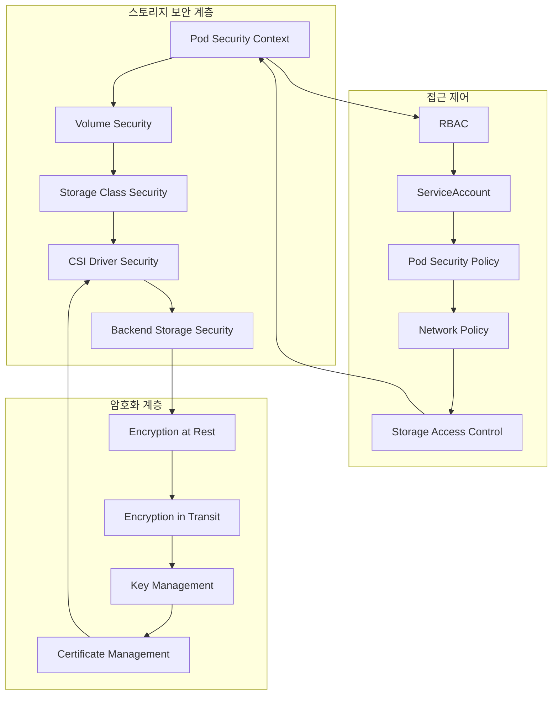
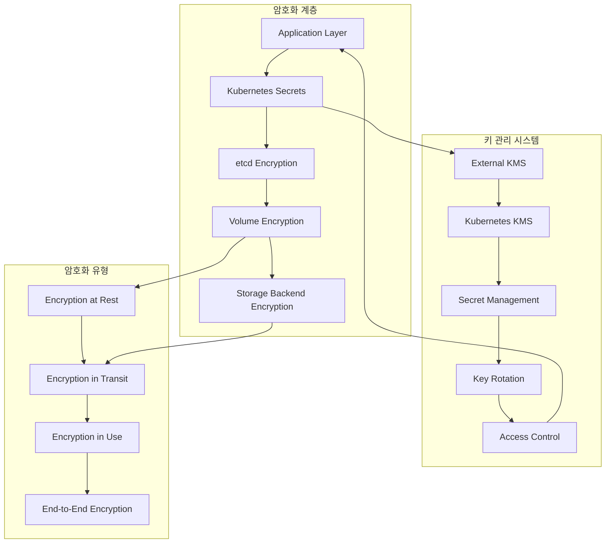
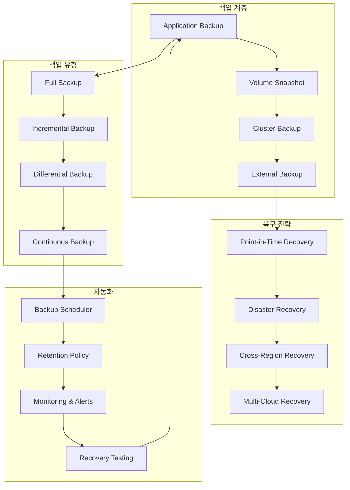
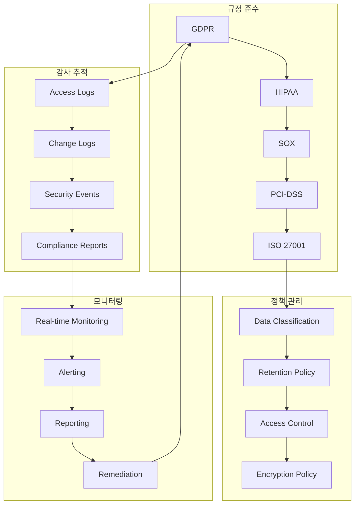

# Session 4: 스토리지 보안과 백업 전략

## 📍 교과과정에서의 위치
이 세션은 **Week 2 > Day 4 > Session 4**로, Session 1-3에서 학습한 볼륨, 스토리지 클래스, StatefulSet을 바탕으로 Kubernetes 스토리지의 보안과 백업 전략을 학습합니다.

## 학습 목표 (5분)
- **스토리지 보안** 모델과 **접근 제어** 메커니즘 완전 이해
- **데이터 암호화** 전략과 **키 관리** 시스템 학습
- **백업 및 복구** 전략과 **재해 복구** 계획 수립
- **컴플라이언스**와 **감사** 요구사항 이해

## 1. 스토리지 보안 모델과 접근 제어 (15분)

### Kubernetes 스토리지 보안 아키텍처



### 스토리지 보안 상세 분석
```
Kubernetes 스토리지 보안:

보안 계층 구조:
├── Pod 수준 보안:
│   ├── Security Context 설정
│   ├── runAsUser/runAsGroup 지정
│   ├── fsGroup으로 볼륨 소유권 설정
│   ├── readOnlyRootFilesystem 적용
│   ├── allowPrivilegeEscalation 제어
│   ├── capabilities 제한
│   └── seccomp/AppArmor 프로파일
├── 볼륨 수준 보안:
│   ├── 볼륨 마운트 권한 제어
│   ├── 읽기 전용 마운트 옵션
│   ├── 볼륨 접근 모드 제한
│   ├── 마운트 경로 보안
│   ├── 심볼릭 링크 제한
│   └── 파일시스템 권한 관리
├── 스토리지 클래스 보안:
│   ├── 허용된 스토리지 클래스 제한
│   ├── 동적 프로비저닝 보안 정책
│   ├── 스토리지 백엔드 인증
│   ├── 네트워크 접근 제어
│   └── 리소스 할당량 제한
└── CSI 드라이버 보안:
    ├── 드라이버 인증 및 권한
    ├── 노드 권한 최소화
    ├── 보안 컨텍스트 적용
    ├── 네트워크 격리
    └── 감사 로깅 활성화

RBAC 기반 접근 제어:
├── 스토리지 관련 권한:
│   ├── PV 생성/삭제/수정 권한
│   ├── PVC 생성/삭제/수정 권한
│   ├── StorageClass 관리 권한
│   ├── 볼륨 스냅샷 권한
│   ├── CSI 드라이버 관리 권한
│   └── 스토리지 메트릭 조회 권한
├── 역할 기반 분리:
│   ├── 스토리지 관리자 (Storage Admin)
│   ├── 개발자 (Developer)
│   ├── 운영자 (Operator)
│   ├── 감사자 (Auditor)
│   └── 읽기 전용 사용자 (Viewer)
├── 네임스페이스 격리:
│   ├── 네임스페이스별 스토리지 할당량
│   ├── 교차 네임스페이스 접근 제한
│   ├── 공유 스토리지 정책
│   ├── 테넌트 격리
│   └── 리소스 경계 설정
└── 서비스 계정 관리:
    ├── 최소 권한 원칙 적용
    ├── 자동 토큰 마운트 제어
    ├── 토큰 만료 및 순환
    ├── 외부 인증 통합
    └── 감사 추적 활성화

Pod Security Standards:
├── Privileged (특권):
│   ├── 모든 권한 허용
│   ├── 호스트 네임스페이스 접근
│   ├── 특권 컨테이너 실행
│   ├── 호스트 볼륨 마운트
│   └── 시스템 관리 작업
├── Baseline (기본):
│   ├── 알려진 권한 상승 방지
│   ├── 호스트 네임스페이스 제한
│   ├── 특권 컨테이너 금지
│   ├── 호스트 경로 볼륨 제한
│   └── 기본 보안 수준 유지
├── Restricted (제한):
│   ├── 강화된 보안 정책
│   ├── 루트 사용자 금지
│   ├── 읽기 전용 루트 파일시스템
│   ├── 권한 상승 금지
│   ├── 제한된 볼륨 타입
│   └── 최소 권한 실행
└── 정책 적용 모드:
    ├── enforce: 정책 위반 시 거부
    ├── audit: 정책 위반 로깅
    ├── warn: 정책 위반 경고
    ├── 네임스페이스별 설정
    └── 점진적 적용 전략

네트워크 보안:
├── 스토리지 네트워크 격리:
│   ├── 전용 스토리지 네트워크
│   ├── VLAN 기반 격리
│   ├── 방화벽 규칙 적용
│   ├── 트래픽 암호화
│   └── 대역폭 제한
├── Network Policy:
│   ├── 스토리지 트래픽 제한
│   ├── Pod 간 통신 제어
│   ├── 외부 접근 차단
│   ├── 포트 기반 필터링
│   └── 레이블 기반 선택
├── 서비스 메시 통합:
│   ├── mTLS 자동 적용
│   ├── 트래픽 정책 관리
│   ├── 접근 로깅
│   ├── 레이트 리미팅
│   └── 회로 차단기
└── 인증서 관리:
    ├── 자동 인증서 발급
    ├── 인증서 순환
    ├── CA 신뢰 체인
    ├── 인증서 검증
    └── 만료 모니터링
```

## 2. 데이터 암호화 전략과 키 관리 (12분)

### 암호화 아키텍처



### 데이터 암호화 상세 분석
```
Kubernetes 데이터 암호화:

암호화 계층별 전략:
├── 저장 시 암호화 (Encryption at Rest):
│   ├── etcd 데이터 암호화:
│   │   ├── Kubernetes Secrets 암호화
│   │   ├── ConfigMap 암호화 (선택적)
│   │   ├── 외부 KMS 통합
│   │   ├── 봉투 암호화 (Envelope Encryption)
│   │   ├── 키 순환 자동화
│   │   └── 암호화 상태 모니터링
│   ├── 볼륨 수준 암호화:
│   │   ├── 블록 스토리지 암호화
│   │   ├── 파일시스템 수준 암호화
│   │   ├── 애플리케이션 수준 암호화
│   │   ├── 투명한 데이터 암호화 (TDE)
│   │   ├── 키 관리 통합
│   │   └── 성능 최적화
│   └── 스토리지 백엔드 암호화:
│       ├── 클라우드 스토리지 암호화
│       ├── SAN/NAS 암호화
│       ├── 하드웨어 암호화
│       ├── 소프트웨어 암호화
│       ├── 하이브리드 암호화
│       └── 규정 준수 암호화
├── 전송 중 암호화 (Encryption in Transit):
│   ├── 클러스터 내부 통신:
│   │   ├── kubelet-API 서버 TLS
│   │   ├── etcd 클러스터 TLS
│   │   ├── Pod 간 통신 암호화
│   │   ├── 서비스 메시 mTLS
│   │   ├── CNI 플러그인 암호화
│   │   └── 스토리지 트래픽 암호화
│   ├── 외부 통신 암호화:
│   │   ├── 클라이언트-API 서버 TLS
│   │   ├── 스토리지 백엔드 연결 암호화
│   │   ├── 외부 서비스 통신 TLS
│   │   ├── 로드 밸런서 SSL 종료
│   │   ├── Ingress TLS 설정
│   │   └── 외부 KMS 통신 암호화
│   └── 네트워크 수준 암호화:
│       ├── IPSec 터널
│       ├── WireGuard VPN
│       ├── VXLAN 암호화
│       ├── 네트워크 정책 암호화
│       ├── 방화벽 규칙 적용
│       └── 트래픽 분석 방지
└── 사용 중 암호화 (Encryption in Use):
    ├── 메모리 암호화:
    │   ├── 애플리케이션 메모리 보호
    │   ├── 키 메모리 격리
    │   ├── 메모리 덤프 방지
    │   ├── 스왑 암호화
    │   └── 하드웨어 지원 활용
    ├── 처리 중 암호화:
    │   ├── 동형 암호화
    │   ├── 보안 엔클레이브
    │   ├── 신뢰 실행 환경
    │   ├── 기밀 컴퓨팅
    │   └── 제로 지식 증명
    └── 런타임 보호:
        ├── 컨테이너 런타임 보안
        ├── 프로세스 격리
        ├── 시스템 호출 필터링
        ├── 메모리 보호 기법
        └── 실행 시간 검증

키 관리 시스템 (KMS):
├── 외부 KMS 통합:
│   ├── AWS KMS 통합
│   ├── Azure Key Vault 통합
│   ├── Google Cloud KMS 통합
│   ├── HashiCorp Vault 통합
│   ├── 온프레미스 HSM 통합
│   └── 다중 KMS 지원
├── 키 생명주기 관리:
│   ├── 키 생성 및 배포
│   ├── 키 순환 (Key Rotation)
│   ├── 키 백업 및 복구
│   ├── 키 폐기 및 삭제
│   ├── 키 버전 관리
│   └── 키 감사 추적
├── 접근 제어:
│   ├── 역할 기반 키 접근
│   ├── 시간 기반 접근 제한
│   ├── 지리적 접근 제한
│   ├── 다중 인증 요구
│   ├── 승인 워크플로우
│   └── 접근 로깅
└── 키 보안 정책:
    ├── 키 강도 요구사항
    ├── 암호화 알고리즘 정책
    ├── 키 분리 원칙
    ├── 키 에스크로 정책
    ├── 규정 준수 요구사항
    └── 보안 감사 정책

Secret 관리 모범 사례:
├── Secret 생성 및 관리:
│   ├── 강력한 Secret 생성
│   ├── Secret 네임스페이스 격리
│   ├── Secret 접근 권한 최소화
│   ├── Secret 자동 순환
│   ├── Secret 버전 관리
│   └── Secret 백업 전략
├── Secret 사용 패턴:
│   ├── 환경 변수 vs 볼륨 마운트
│   ├── Init Container 활용
│   ├── Sidecar 패턴 적용
│   ├── Secret 캐싱 전략
│   ├── Secret 동기화
│   └── Secret 검증
├── 외부 Secret 관리:
│   ├── External Secrets Operator
│   ├── Secret Store CSI Driver
│   ├── Vault Agent Injector
│   ├── AWS Secrets Manager 통합
│   ├── Azure Key Vault 통합
│   └── Google Secret Manager 통합
└── Secret 보안 강화:
    ├── Secret 암호화 강화
    ├── Secret 접근 모니터링
    ├── Secret 유출 탐지
    ├── Secret 무결성 검증
    ├── Secret 감사 로깅
    └── Secret 규정 준수
```

## 3. 백업 및 복구 전략 (10분)

### 백업 아키텍처



### 백업 및 복구 상세 분석
```
Kubernetes 백업 및 복구:

백업 계층별 전략:
├── 애플리케이션 수준 백업:
│   ├── 데이터베이스 백업:
│   │   ├── 논리적 백업 (SQL 덤프)
│   │   ├── 물리적 백업 (바이너리 복사)
│   │   ├── 트랜잭션 로그 백업
│   │   ├── 증분 백업 전략
│   │   ├── 일관성 있는 백업
│   │   └── 압축 및 암호화
│   ├── 파일시스템 백업:
│   │   ├── 파일 수준 백업
│   │   ├── 디렉토리 동기화
│   │   ├── 변경 사항 추적
│   │   ├── 메타데이터 보존
│   │   ├── 권한 및 속성 유지
│   │   └── 심볼릭 링크 처리
│   └── 상태 정보 백업:
│       ├── 설정 파일 백업
│       ├── 로그 파일 아카이브
│       ├── 캐시 데이터 백업
│       ├── 세션 정보 보존
│       ├── 임시 파일 정리
│       └── 애플리케이션 상태 스냅샷
├── 볼륨 수준 백업:
│   ├── 볼륨 스냅샷:
│   │   ├── CSI 스냅샷 기능 활용
│   │   ├── 스토리지 백엔드 스냅샷
│   │   ├── Copy-on-Write 최적화
│   │   ├── 스냅샷 체인 관리
│   │   ├── 스냅샷 메타데이터
│   │   └── 스냅샷 검증
│   ├── 볼륨 복제:
│   │   ├── 실시간 복제
│   │   ├── 비동기 복제
│   │   ├── 지역 간 복제
│   │   ├── 복제 일관성 보장
│   │   ├── 복제 지연 모니터링
│   │   └── 자동 장애 조치
│   └── 볼륨 아카이브:
│       ├── 장기 보관 전략
│       ├── 계층화 스토리지
│       ├── 압축 및 중복 제거
│       ├── 암호화 적용
│       ├── 무결성 검증
│       └── 검색 및 복구
├── 클러스터 수준 백업:
│   ├── etcd 백업:
│   │   ├── etcd 스냅샷 생성
│   │   ├── 정기적 백업 스케줄
│   │   ├── 백업 검증 및 테스트
│   │   ├── 백업 암호화
│   │   ├── 오프사이트 저장
│   │   └── 복구 절차 문서화
│   ├── 클러스터 상태 백업:
│   │   ├── Kubernetes 오브젝트 백업
│   │   ├── RBAC 설정 백업
│   │   ├── 네트워크 정책 백업
│   │   ├── 커스텀 리소스 백업
│   │   ├── 설정 맵 및 시크릿 백업
│   │   └── 네임스페이스 구성 백업
│   └── 인프라 백업:
│       ├── 노드 설정 백업
│       ├── 네트워크 구성 백업
│       ├── 스토리지 구성 백업
│       ├── 보안 정책 백업
│       ├── 모니터링 설정 백업
│       └── 로깅 구성 백업
└── 외부 백업:
    ├── 클라우드 백업:
    │   ├── 클라우드 스토리지 활용
    │   ├── 다중 리전 백업
    │   ├── 클라우드 네이티브 도구
    │   ├── 자동 백업 정책
    │   ├── 비용 최적화
    │   └── 규정 준수
    ├── 하이브리드 백업:
    │   ├── 온프레미스-클라우드 백업
    │   ├── 다중 클라우드 백업
    │   ├── 백업 복제 전략
    │   ├── 네트워크 최적화
    │   ├── 보안 터널링
    │   └── 비용 관리
    └── 오프라인 백업:
        ├── 테이프 백업
        ├── 외부 디스크 백업
        ├── 물리적 격리
        ├── 장기 보관
        ├── 재해 복구 대비
        └── 규정 준수 보관

백업 유형별 전략:
├── 전체 백업 (Full Backup):
│   ├── 모든 데이터 완전 백업
│   ├── 독립적 복구 가능
│   ├── 높은 저장 공간 요구
│   ├── 긴 백업 시간
│   ├── 단순한 복구 과정
│   └── 기준점 역할
├── 증분 백업 (Incremental Backup):
│   ├── 마지막 백업 이후 변경사항만
│   ├── 저장 공간 효율적
│   ├── 빠른 백업 시간
│   ├── 복잡한 복구 과정
│   ├── 백업 체인 의존성
│   └── 일일 백업에 적합
├── 차등 백업 (Differential Backup):
│   ├── 마지막 전체 백업 이후 변경사항
│   ├── 증분 백업보다 큰 용량
│   ├── 증분 백업보다 빠른 복구
│   ├── 전체 + 차등 백업으로 복구
│   ├── 균형잡힌 접근법
│   └── 주간 백업에 적합
└── 연속 백업 (Continuous Backup):
    ├── 실시간 데이터 보호
    ├── 최소 데이터 손실
    ├── 높은 리소스 요구
    ├── 복잡한 구현
    ├── 미션 크리티컬 시스템
    └── 트랜잭션 로그 기반

복구 전략:
├── 시점 복구 (Point-in-Time Recovery):
│   ├── 특정 시점으로 복구
│   ├── 트랜잭션 로그 활용
│   ├── 세밀한 복구 제어
│   ├── 데이터 손실 최소화
│   ├── 복구 시점 선택
│   └── 테스트 및 검증
├── 재해 복구 (Disaster Recovery):
│   ├── 전체 시스템 복구
│   ├── 대체 사이트 활용
│   ├── RTO/RPO 목표 달성
│   ├── 자동 장애 조치
│   ├── 비즈니스 연속성
│   └── 정기적 DR 테스트
├── 지역 간 복구:
│   ├── 지리적 분산 백업
│   ├── 네트워크 지연 고려
│   ├── 데이터 주권 준수
│   ├── 비용 최적화
│   ├── 복구 시간 단축
│   └── 자동화된 복구
└── 다중 클라우드 복구:
    ├── 벤더 종속성 회피
    ├── 최적 비용 선택
    ├── 성능 최적화
    ├── 규정 준수 유연성
    ├── 복잡성 관리
    └── 통합 관리 도구
```

## 4. 컴플라이언스와 감사 요구사항 (8분)

### 컴플라이언스 프레임워크



### 컴플라이언스 상세 분석
```
Kubernetes 컴플라이언스 및 감사:

주요 규정 준수 요구사항:
├── GDPR (일반 데이터 보호 규정):
│   ├── 개인 데이터 보호:
│   │   ├── 데이터 최소화 원칙
│   │   ├── 목적 제한 원칙
│   │   ├── 정확성 보장
│   │   ├── 저장 제한
│   │   ├── 무결성 및 기밀성
│   │   └── 책임성 원칙
│   ├── 데이터 주체 권리:
│   │   ├── 접근권 (Right to Access)
│   │   ├── 정정권 (Right to Rectification)
│   │   ├── 삭제권 (Right to Erasure)
│   │   ├── 처리 제한권
│   │   ├── 데이터 이동권
│   │   └── 반대권
│   └── 기술적 조치:
│       ├── 데이터 암호화
│       ├── 접근 제어
│       ├── 감사 로깅
│       ├── 데이터 분류
│       ├── 개인정보 영향평가
│       └── 데이터 보호 설계
├── HIPAA (건강보험 이동성 및 책임법):
│   ├── 물리적 보안:
│   │   ├── 시설 접근 제어
│   │   ├── 워크스테이션 보안
│   │   ├── 장치 및 미디어 제어
│   │   ├── 환경 보안
│   │   └── 물리적 격리
│   ├── 기술적 보안:
│   │   ├── 접근 제어
│   │   ├── 감사 제어
│   │   ├── 무결성 보장
│   │   ├── 전송 보안
│   │   └── 암호화
│   └── 관리적 보안:
│       ├── 보안 책임자 지정
│       ├── 직원 교육
│       ├── 사고 대응 절차
│       ├── 비상 계획
│       └── 정기 평가
├── SOX (사베인-옥슬리법):
│   ├── 내부 통제:
│   │   ├── 재무 보고 통제
│   │   ├── IT 일반 통제
│   │   ├── 애플리케이션 통제
│   │   ├── 변경 관리
│   │   └── 접근 관리
│   ├── 문서화 요구사항:
│   │   ├── 프로세스 문서화
│   │   ├── 통제 활동 문서화
│   │   ├── 테스트 결과 문서화
│   │   ├── 결함 및 개선사항
│   │   └── 경영진 인증
│   └── 감사 요구사항:
│       ├── 독립적 감사
│       ├── 내부 감사
│       ├── 통제 테스트
│       ├── 결함 보고
│       └── 개선 조치
├── PCI-DSS (지불카드 산업 데이터 보안 표준):
│   ├── 네트워크 보안:
│   │   ├── 방화벽 구성
│   │   ├── 기본 패스워드 변경
│   │   ├── 카드 소지자 데이터 보호
│   │   ├── 전송 중 암호화
│   │   └── 안티바이러스 사용
│   ├── 접근 제어:
│   │   ├── 데이터 접근 제한
│   │   ├── 고유 ID 할당
│   │   ├── 물리적 접근 제한
│   │   ├── 네트워크 리소스 제한
│   │   └── 정기적 모니터링
│   └── 정책 및 절차:
│       ├── 정보 보안 정책
│       ├── 취약점 관리
│       ├── 보안 테스트
│       ├── 네트워크 모니터링
│       └── 정기적 평가
└── ISO 27001 (정보보안 관리시스템):
    ├── ISMS 구축:
    │   ├── 정보보안 정책
    │   ├── 위험 관리
    │   ├── 보안 통제
    │   ├── 모니터링 및 측정
    │   └── 지속적 개선
    ├── 보안 통제:
    │   ├── 조직적 보안
    │   ├── 인적 보안
    │   ├── 물리적 환경 보안
    │   ├── 통신 및 운영 관리
    │   ├── 접근 통제
    │   ├── 시스템 개발 및 유지보수
    │   ├── 정보보안 사고 관리
    │   └── 사업 연속성 관리
    └── 인증 프로세스:
        ├── 내부 감사
        ├── 경영진 검토
        ├── 외부 인증 심사
        ├── 인증서 발급
        ├── 사후 관리 심사
        └── 인증 갱신

감사 추적 시스템:
├── 로그 수집 및 관리:
│   ├── 중앙화된 로깅:
│   │   ├── 모든 시스템 로그 수집
│   │   ├── 표준화된 로그 형식
│   │   ├── 실시간 로그 전송
│   │   ├── 로그 무결성 보장
│   │   ├── 로그 암호화
│   │   └── 로그 백업 및 아카이브
│   ├── 감사 로그 요구사항:
│   │   ├── 사용자 인증 로그
│   │   ├── 권한 변경 로그
│   │   ├── 데이터 접근 로그
│   │   ├── 시스템 변경 로그
│   │   ├── 보안 이벤트 로그
│   │   └── 오류 및 예외 로그
│   └── 로그 보존 정책:
│       ├── 보존 기간 설정
│       ├── 자동 아카이브
│       ├── 안전한 삭제
│       ├── 법적 보존 요구
│       ├── 비용 최적화
│       └── 검색 및 복구
├── 실시간 모니터링:
│   ├── 보안 이벤트 탐지:
│   │   ├── 비정상 접근 패턴
│   │   ├── 권한 상승 시도
│   │   ├── 데이터 유출 시도
│   │   ├── 시스템 침입 시도
│   │   ├── 정책 위반 행위
│   │   └── 내부자 위협
│   ├── 자동 알림 시스템:
│   │   ├── 임계값 기반 알림
│   │   ├── 패턴 기반 알림
│   │   ├── 다단계 에스컬레이션
│   │   ├── 다양한 알림 채널
│   │   ├── 알림 우선순위 관리
│   │   └── 알림 피로도 관리
│   └── 대시보드 및 리포팅:
│       ├── 실시간 보안 대시보드
│       ├── 컴플라이언스 상태 표시
│       ├── 위험 지표 모니터링
│       ├── 트렌드 분석
│       ├── 자동 리포트 생성
│       └── 경영진 리포트
└── 컴플라이언스 자동화:
    ├── 정책 자동 적용:
    │   ├── 보안 정책 코드화
    │   ├── 자동 정책 검증
    │   ├── 정책 위반 자동 차단
    │   ├── 정책 업데이트 자동화
    │   ├── 예외 처리 워크플로우
    │   └── 정책 효과성 측정
    ├── 자동 감사 도구:
    │   ├── 설정 검사 자동화
    │   ├── 취약점 스캔 자동화
    │   ├── 컴플라이언스 체크 자동화
    │   ├── 증거 수집 자동화
    │   ├── 리포트 생성 자동화
    │   └── 개선 조치 추적
    └── 지속적 컴플라이언스:
        ├── DevSecOps 통합
        ├── 파이프라인 보안 검사
        ├── 자동 보안 테스트
        ├── 컴플라이언스 게이트
        ├── 지속적 모니터링
        └── 자동 개선 조치
```

## 실습 과제 (5분)

### 과제 1: 스토리지 보안 정책 설계
```yaml
# 다음 요구사항을 만족하는 보안 정책을 설계하세요:
# 1. 민감한 데이터를 위한 암호화된 스토리지 클래스
# 2. RBAC 기반 스토리지 접근 제어
# 3. Pod Security Standards 적용
# 4. 네트워크 정책을 통한 스토리지 트래픽 제한

# 설계 고려사항:
# - 데이터 분류 (Public, Internal, Confidential, Restricted)
# - 암호화 요구사항 (저장 시, 전송 중)
# - 접근 제어 매트릭스
# - 감사 로깅 요구사항
```

### 과제 2: 백업 및 복구 전략 수립
```yaml
# 다음 시나리오에 대한 백업 전략을 수립하세요:
# 1. 전자상거래 플랫폼 (24/7 운영)
# 2. 개인정보 포함 (GDPR 준수 필요)
# 3. 다중 리전 배포
# 4. RTO: 4시간, RPO: 15분

# 전략 포함사항:
# - 백업 유형 및 주기
# - 보존 정책
# - 암호화 및 보안
# - 복구 절차
# - 테스트 계획
```

## 토론 주제 (5분)

1. **스토리지 보안과 성능의 균형점**
   - 암호화로 인한 성능 오버헤드 vs 보안 요구사항
   - 실시간 시스템에서의 보안 적용 전략

2. **클라우드 네이티브 환경에서의 컴플라이언스**
   - 전통적 컴플라이언스 vs 클라우드 네이티브 접근법
   - 자동화된 컴플라이언스의 장단점

3. **백업 전략의 진화**
   - 전통적 백업 vs 클라우드 네이티브 백업
   - 마이크로서비스 환경에서의 백업 복잡성

## 다음 세션 예고 (2분)

다음 세션에서는 **"스토리지 모니터링과 성능 최적화"**를 다룹니다:
- 스토리지 메트릭 수집 및 분석
- 성능 병목 지점 식별 및 해결
- 용량 계획 및 확장 전략
- 비용 최적화 방안

---

## 📚 참고 자료

- [Kubernetes Security Best Practices](https://kubernetes.io/docs/concepts/security/)
- [Pod Security Standards](https://kubernetes.io/docs/concepts/security/pod-security-standards/)
- [Encrypting Secret Data at Rest](https://kubernetes.io/docs/tasks/administer-cluster/encrypt-data/)
- [Volume Snapshots](https://kubernetes.io/docs/concepts/storage/volume-snapshots/)
- [GDPR Compliance Guide](https://gdpr.eu/)
- [NIST Cybersecurity Framework](https://www.nist.gov/cyberframework)

---
*본 세션은 Kubernetes 스토리지의 보안과 컴플라이언스 요구사항을 체계적으로 이해하고, 실무에서 적용할 수 있는 전략을 수립하는 것을 목표로 합니다.*