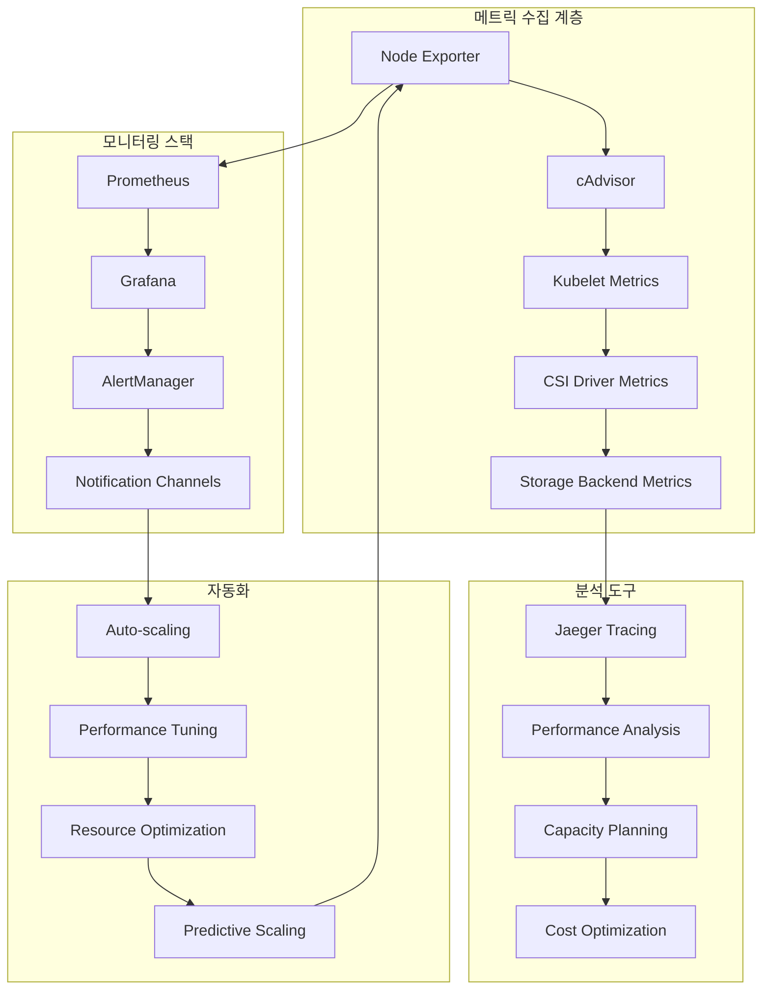
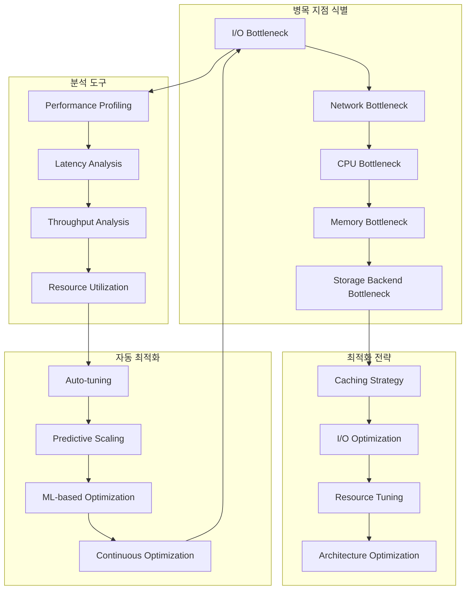
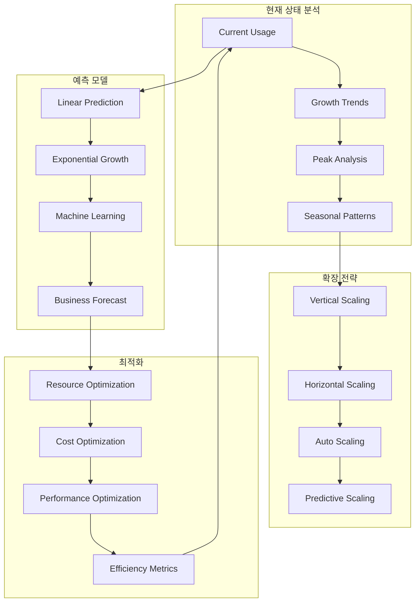
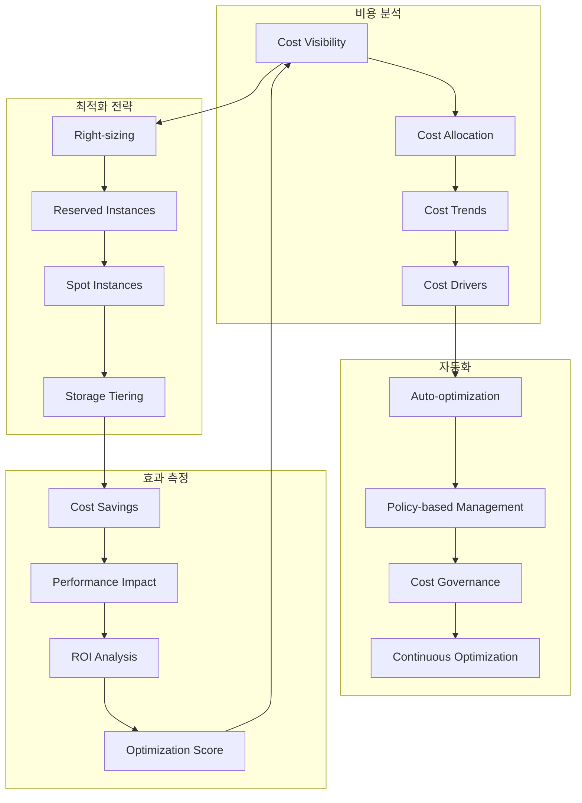

# Session 5: 스토리지 모니터링과 성능 최적화

## 📍 교과과정에서의 위치
이 세션은 **Week 2 > Day 4 > Session 5**로, Session 1-4에서 학습한 스토리지 기초, 보안, 백업을 바탕으로 Kubernetes 스토리지의 모니터링과 성능 최적화 전략을 학습합니다.

## 학습 목표 (5분)
- **스토리지 메트릭** 수집과 **모니터링 시스템** 구축 이해
- **성능 병목 지점** 식별과 **최적화 전략** 학습
- **용량 계획**과 **확장 전략** 수립 방법 파악
- **비용 최적화**와 **리소스 효율성** 향상 방안 이해

## 1. 스토리지 메트릭 수집과 모니터링 시스템 (15분)

### 스토리지 모니터링 아키텍처



### 스토리지 메트릭 상세 분석
```
Kubernetes 스토리지 모니터링:

핵심 메트릭 카테고리:
   🔹 용량 메트릭 (Capacity Metrics):
      • 볼륨 사용률:
         • kubelet_volume_stats_used_bytes
         • kubelet_volume_stats_capacity_bytes
         • kubelet_volume_stats_available_bytes
         • kubelet_volume_stats_inodes_used
         • kubelet_volume_stats_inodes_free
         • 사용률 백분율 계산
      • PV/PVC 상태:
         • kube_persistentvolume_status_phase
         • kube_persistentvolumeclaim_status_phase
         • kube_persistentvolume_capacity_bytes
         • kube_persistentvolumeclaim_resource_requests_storage_bytes
         • 바인딩 상태 추적
         • 프로비저닝 지연 시간
      • 스토리지 클래스 사용량:
      • 클래스별 PV 수량
      • 클래스별 총 용량
      • 클래스별 사용률
      • 동적 프로비저닝 성공률
      • 프로비저닝 실패 원인
      • 비용 분석 데이터
   🔹 성능 메트릭 (Performance Metrics):
      • I/O 성능:
         • container_fs_reads_total
         • container_fs_writes_total
         • container_fs_read_seconds_total
         • container_fs_write_seconds_total
         • IOPS (Input/Output Operations Per Second)
         • 처리량 (Throughput)
         • 지연 시간 (Latency)
         • 큐 깊이 (Queue Depth)
      • 네트워크 스토리지:
         • 네트워크 대역폭 사용률
         • 네트워크 지연 시간
         • 패킷 손실률
         • 연결 상태
         • 재시도 횟수
         • 타임아웃 발생률
      • 캐시 성능:
      • 캐시 히트율
      • 캐시 미스율
      • 캐시 사용률
      • 캐시 플러시 빈도
      • 더티 페이지 비율
      • 메모리 압박 상황
   🔹 가용성 메트릭 (Availability Metrics):
      • 볼륨 상태:
         • 마운트 성공률
         • 마운트 실패 원인
         • 언마운트 지연 시간
         • 볼륨 오류 발생률
         • 파일시스템 오류
         • 복구 시간
      • CSI 드라이버 상태:
         • 드라이버 응답 시간
         • 드라이버 오류율
         • 프로비저닝 성공률
         • 스냅샷 성공률
         • 복제 성공률
         • 드라이버 재시작 빈도
      • 스토리지 백엔드:
      • 백엔드 연결 상태
      • 백엔드 응답 시간
      • 백엔드 오류율
      • 백엔드 용량 상태
      • 백엔드 성능 지표
      • 백엔드 알림 상태
   🔹 비용 메트릭 (Cost Metrics):
   🔹 리소스 비용:
      • 스토리지 클래스별 비용
      • 볼륨 크기별 비용
      • 사용 시간별 비용
      • 지역별 비용 차이
      • 예약 인스턴스 할인
      • 스팟 인스턴스 활용
   🔹 효율성 지표:
      • 비용 대비 성능
      • 사용률 대비 비용
      • 낭비되는 리소스
      • 최적화 기회
      • ROI 계산
      • TCO 분석
   🔹 예산 관리:
   🔹 예산 대비 실제 비용
   🔹 비용 증가 추세
   🔹 예산 초과 알림
   🔹 비용 할당 추적
   🔹 부서별 비용 분석
   🔹 프로젝트별 비용 추적

모니터링 도구 스택:
   🔹 Prometheus 기반 모니터링:
      • 메트릭 수집 설정:
         • ServiceMonitor 구성
         • PodMonitor 설정
         • 스크래핑 간격 최적화
         • 메트릭 레이블 관리
         • 메트릭 필터링
         • 보존 정책 설정
      • 알림 규칙:
         • 용량 임계값 알림
         • 성능 저하 알림
         • 오류율 증가 알림
         • 가용성 문제 알림
         • 비용 초과 알림
         • 예측 기반 알림
      • 데이터 관리:
      • 메트릭 압축
      • 다운샘플링
      • 장기 저장소 연동
      • 백업 및 복구
      • 고가용성 구성
      • 페더레이션 설정
   🔹 Grafana 대시보드:
      • 스토리지 개요 대시보드:
         • 전체 용량 사용률
         • 성능 요약
         • 가용성 상태
         • 비용 요약
         • 알림 상태
         • 트렌드 분석
      • 상세 분석 대시보드:
         • 볼륨별 상세 메트릭
         • 애플리케이션별 사용량
         • 노드별 스토리지 상태
         • 스토리지 클래스별 분석
         • 성능 병목 분석
         • 용량 계획 대시보드
      • 운영 대시보드:
      • 실시간 모니터링
      • 알림 관리
      • 인시던트 추적
      • SLA 모니터링
      • 변경 추적
      • 보고서 생성
   🔹 로그 분석:
      • ELK Stack (Elasticsearch, Logstash, Kibana):
         • 스토리지 관련 로그 수집
         • 로그 파싱 및 구조화
         • 인덱싱 및 검색
         • 시각화 및 대시보드
         • 알림 및 워크플로우
         • 로그 보존 정책
      • Fluentd/Fluent Bit:
         • 로그 수집 에이전트
         • 로그 라우팅
         • 로그 변환
         • 버퍼링 및 재시도
         • 다중 출력 지원
         • 성능 최적화
      • 로그 분석 패턴:
      • 오류 패턴 탐지
      • 성능 이상 탐지
      • 보안 이벤트 탐지
      • 용량 경고 탐지
      • 트렌드 분석
      • 근본 원인 분석
   🔹 분산 추적:
   🔹 Jaeger/Zipkin:
      • 스토리지 I/O 추적
      • 요청 흐름 추적
      • 지연 시간 분석
      • 병목 지점 식별
      • 의존성 맵핑
      • 성능 최적화 인사이트
   🔹 OpenTelemetry:
      • 표준화된 계측
      • 다중 백엔드 지원
      • 자동 계측
      • 커스텀 메트릭
      • 컨텍스트 전파
      • 샘플링 전략
   🔹 APM 통합:
   🔹 애플리케이션 성능 모니터링
   🔹 스토리지 성능 상관관계
   🔹 사용자 경험 영향 분석
   🔹 비즈니스 메트릭 연동
   🔹 SLA 추적
   🔹 성능 최적화 권장사항
```

## 2. 성능 병목 지점 식별과 최적화 전략 (12분)

### 성능 분석 프레임워크



### 성능 최적화 상세 분석
```
Kubernetes 스토리지 성능 최적화:

병목 지점 식별 방법론:
   🔹 I/O 병목 분석:
      • I/O 패턴 분석:
         • 순차 vs 랜덤 I/O 비율
         • 읽기 vs 쓰기 비율
         • 블록 크기 분포
         • 큐 깊이 분석
         • I/O 집중도 분석
         • 동시성 수준 측정
      • 지연 시간 분석:
         • 평균 응답 시간
         • 95/99 백분위수 지연 시간
         • 지연 시간 분포
         • 지연 시간 변동성
         • 테일 레이턴시 분석
         • 지연 시간 구성 요소 분해
      • 처리량 분석:
      • 최대 IOPS 측정
      • 최대 대역폭 측정
      • 처리량 포화점 식별
      • 처리량 확장성 분석
      • 리소스 대비 처리량
      • 비용 대비 처리량
   🔹 네트워크 병목 분석:
      • 네트워크 지연 시간:
         • RTT (Round Trip Time) 측정
         • 네트워크 홉 분석
         • 대역폭 지연 곱
         • 네트워크 지터
         • 패킷 손실률
         • 네트워크 혼잡 분석
      • 대역폭 활용:
         • 네트워크 사용률
         • 대역폭 포화 상태
         • 트래픽 패턴 분석
         • 피크 시간 분석
         • 대역폭 경합 상황
         • QoS 정책 효과
      • 프로토콜 최적화:
      • TCP 윈도우 크기 조정
      • TCP 혼잡 제어 알고리즘
      • 네트워크 버퍼 크기
      • 멀티패스 활용
      • 압축 및 중복 제거
      • 프로토콜 오버헤드 최소화
   🔹 리소스 병목 분석:
      • CPU 병목:
         • CPU 사용률 분석
         • 컨텍스트 스위치 빈도
         • 인터럽트 처리 오버헤드
         • 시스템 vs 사용자 시간
         • CPU 대기 시간
         • NUMA 토폴로지 영향
      • 메모리 병목:
         • 메모리 사용률
         • 페이지 폴트 빈도
         • 스왑 사용량
         • 캐시 히트율
         • 메모리 대역폭 사용률
         • 메모리 지역성 분석
      • 스토리지 백엔드 병목:
      • 디스크 사용률
      • 디스크 큐 길이
      • 디스크 서비스 시간
      • 디스크 처리량
      • RAID 성능 영향
      • 스토리지 컨트롤러 성능
   🔹 애플리케이션 수준 병목:
   🔹 애플리케이션 I/O 패턴:
      • 파일 접근 패턴
      • 데이터베이스 쿼리 패턴
      • 캐시 사용 패턴
      • 트랜잭션 패턴
      • 배치 처리 패턴
      • 실시간 처리 패턴
   🔹 리소스 경합:
      • 락 경합 분석
      • 데드락 탐지
      • 리소스 대기 시간
      • 동시성 제어 오버헤드
      • 스레드 풀 포화
      • 연결 풀 관리
   🔹 설정 최적화:
   🔹 버퍼 크기 조정
   🔹 연결 풀 크기 최적화
   🔹 캐시 크기 조정
   🔹 배치 크기 최적화
   🔹 타임아웃 설정 조정
   🔹 재시도 정책 최적화

성능 최적화 전략:
   🔹 캐싱 전략:
      • 다층 캐싱:
         • 애플리케이션 레벨 캐시
         • 데이터베이스 캐시
         • 파일시스템 캐시
         • 블록 레벨 캐시
         • 네트워크 캐시
         • CDN 캐시
      • 캐시 정책:
         • LRU (Least Recently Used)
         • LFU (Least Frequently Used)
         • FIFO (First In, First Out)
         • 적응형 캐시 정책
         • 시간 기반 만료
         • 크기 기반 제거
      • 캐시 최적화:
      • 캐시 히트율 최적화
      • 캐시 워밍 전략
      • 캐시 무효화 전략
      • 캐시 일관성 관리
      • 캐시 분할 전략
      • 캐시 모니터링
   🔹 I/O 최적화:
      • I/O 스케줄링:
         • I/O 스케줄러 선택
         • 큐 깊이 조정
         • I/O 우선순위 설정
         • 배치 처리 최적화
         • 비동기 I/O 활용
         • 직접 I/O 사용
      • 파일시스템 최적화:
         • 파일시스템 선택
         • 블록 크기 최적화
         • 저널링 설정
         • 마운트 옵션 조정
         • 파일시스템 정렬
         • 메타데이터 최적화
      • 스토리지 계층화:
      • 핫 데이터 SSD 배치
      • 웜 데이터 HDD 배치
      • 콜드 데이터 아카이브
      • 자동 계층화 정책
      • 데이터 이동 최적화
      • 계층 간 밸런싱
   🔹 리소스 튜닝:
      • CPU 최적화:
         • CPU 어피니티 설정
         • NUMA 인식 스케줄링
         • CPU 거버너 설정
         • 인터럽트 밸런싱
         • 컨텍스트 스위치 최소화
         • CPU 격리 설정
      • 메모리 최적화:
         • 메모리 할당 정책
         • 대용량 페이지 사용
         • 메모리 압축 설정
         • 스왑 정책 조정
         • 메모리 지역성 최적화
         • 메모리 풀 관리
      • 네트워크 최적화:
      • 네트워크 버퍼 크기 조정
      • TCP 윈도우 스케일링
      • 네트워크 인터럽트 코얼레싱
      • RSS (Receive Side Scaling)
      • 네트워크 오프로딩
      • 멀티큐 네트워킹
   🔹 아키텍처 최적화:
   🔹 분산 스토리지:
      • 샤딩 전략
      • 복제 전략
      • 일관성 수준 조정
      • 파티셔닝 최적화
      • 로드 밸런싱
      • 장애 조치 최적화
   🔹 마이크로서비스 최적화:
      • 서비스 분해 전략
      • 데이터 지역성 최적화
      • 서비스 간 통신 최적화
      • 상태 관리 최적화
      • 이벤트 기반 아키텍처
      • CQRS 패턴 적용
   🔹 클라우드 네이티브 최적화:
   🔹 컨테이너 최적화
   🔹 오케스트레이션 최적화
   🔹 서비스 메시 최적화
   🔹 서버리스 아키텍처
   🔹 엣지 컴퓨팅 활용
   🔹 멀티 클라우드 최적화
```

## 3. 용량 계획과 확장 전략 (10분)

### 용량 계획 프레임워크



### 용량 계획 상세 분석
```
Kubernetes 스토리지 용량 계획:

현재 상태 분석:
   🔹 사용량 분석:
      • 현재 스토리지 사용량:
         • 네임스페이스별 사용량
         • 애플리케이션별 사용량
         • 스토리지 클래스별 사용량
         • 노드별 사용량 분포
         • 시간대별 사용 패턴
         • 사용률 히스토그램
      • 성능 기준선:
         • 현재 IOPS 수준
         • 현재 처리량 수준
         • 현재 지연 시간 수준
         • 리소스 사용률
         • 병목 지점 식별
         • SLA 달성률
      • 비용 분석:
      • 현재 스토리지 비용
      • 비용 구성 요소 분석
      • 비용 효율성 지표
      • 낭비되는 리소스
      • 최적화 기회
      • ROI 계산
   🔹 성장 추세 분석:
      • 히스토리컬 데이터 분석:
         • 과거 6개월 성장률
         • 과거 1년 성장률
         • 계절성 패턴 분석
         • 주기적 변동 분석
         • 이상치 제거 및 분석
         • 트렌드 변화점 탐지
      • 성장 동인 분석:
         • 비즈니스 성장 요인
         • 사용자 증가 요인
         • 데이터 증가 요인
         • 기능 확장 요인
         • 규정 준수 요인
         • 기술적 요인
      • 변동성 분석:
      • 일일 변동성
      • 주간 변동성
      • 월간 변동성
      • 계절적 변동성
      • 이벤트 기반 변동성
      • 예측 불가능한 변동성
   🔹 피크 분석:
      • 피크 시간 식별:
         • 일일 피크 시간
         • 주간 피크 시간
         • 월간 피크 시간
         • 연간 피크 시간
         • 이벤트 기반 피크
         • 예상치 못한 피크
      • 피크 특성 분석:
         • 피크 지속 시간
         • 피크 강도
         • 피크 빈도
         • 피크 예측 가능성
         • 피크 영향 범위
         • 피크 복구 시간
      • 피크 대응 전략:
      • 사전 확장 전략
      • 실시간 확장 전략
      • 부하 분산 전략
      • 캐싱 전략
      • 우선순위 기반 처리
      • 서비스 품질 조정
   🔹 계절성 패턴:
   🔹 계절적 변동:
      • 분기별 패턴
      • 월별 패턴
      • 주별 패턴
      • 일별 패턴
      • 시간별 패턴
      • 특별 이벤트 패턴
   🔹 비즈니스 사이클:
      • 회계 연도 사이클
      • 판매 사이클
      • 마케팅 캠페인 사이클
      • 제품 출시 사이클
      • 휴일 및 이벤트 사이클
      • 업계 특성 사이클
   🔹 예측 모델 적용:
   🔹 시계열 분석
   🔹 회귀 분석
   🔹 머신러닝 모델
   🔹 앙상블 모델
   🔹 딥러닝 모델
   🔹 하이브리드 모델

예측 모델링:
   🔹 통계적 예측 모델:
      • 선형 회귀:
         • 단순 선형 회귀
         • 다중 선형 회귀
         • 다항 회귀
         • 정규화 회귀
         • 로버스트 회귀
         • 베이지안 회귀
      • 시계열 분석:
         • ARIMA 모델
         • 지수 평활법
         • 계절성 분해
         • 상태 공간 모델
         • 벡터 자기회귀
         • 동적 선형 모델
      • 비선형 모델:
      • 로지스틱 성장 모델
      • 지수 성장 모델
      • 파워 법칙 모델
      • S-곡선 모델
      • 고메르츠 모델
      • 바스 확산 모델
   🔹 머신러닝 예측 모델:
      • 지도 학습:
         • 랜덤 포레스트
         • 그래디언트 부스팅
         • 서포트 벡터 머신
         • 신경망
         • XGBoost
         • LightGBM
      • 시계열 특화 모델:
         • LSTM (Long Short-Term Memory)
         • GRU (Gated Recurrent Unit)
         • Transformer 모델
         • Prophet
         • DeepAR
         • N-BEATS
      • 앙상블 방법:
      • 배깅 (Bagging)
      • 부스팅 (Boosting)
      • 스태킹 (Stacking)
      • 블렌딩 (Blending)
      • 투표 (Voting)
      • 가중 평균
   🔹 비즈니스 기반 예측:
      • 비즈니스 계획 통합:
         • 매출 성장 계획
         • 사용자 증가 계획
         • 제품 로드맵
         • 마케팅 계획
         • 확장 계획
         • 투자 계획
      • 시장 분석:
         • 시장 성장률
         • 경쟁사 분석
         • 기술 트렌드
         • 규제 변화
         • 경제 지표
         • 산업 동향
      • 시나리오 계획:
      • 낙관적 시나리오
      • 현실적 시나리오
      • 비관적 시나리오
      • 최악의 시나리오
      • 블랙 스완 이벤트
      • 스트레스 테스트
   🔹 예측 정확도 개선:
   🔹 모델 검증:
      • 교차 검증
      • 시계열 분할 검증
      • 워크포워드 분석
      • 백테스팅
      • A/B 테스트
      • 챔피언-챌린저 모델
   🔹 오차 분석:
      • 평균 절대 오차 (MAE)
      • 평균 제곱근 오차 (RMSE)
      • 평균 절대 백분율 오차 (MAPE)
      • 대칭 평균 절대 백분율 오차 (sMAPE)
      • 평균 절대 스케일 오차 (MASE)
      • 예측 구간 커버리지
   🔹 지속적 개선:
   🔹 온라인 학습
   🔹 적응형 모델
   🔹 피드백 루프
   🔹 모델 재훈련
   🔹 하이퍼파라미터 최적화
   🔹 특성 엔지니어링

확장 전략:
   🔹 수직 확장 (Vertical Scaling):
      • 스토리지 용량 확장:
         • PV 크기 증가
         • 동적 볼륨 확장
         • 스토리지 클래스 업그레이드
         • 성능 티어 변경
         • IOPS 증가
         • 처리량 증가
      • 하드웨어 업그레이드:
         • 더 빠른 디스크
         • 더 많은 메모리
         • 더 빠른 CPU
         • 더 빠른 네트워크
         • 전용 스토리지 노드
         • 하드웨어 가속기
      • 제한사항:
      • 최대 용량 제한
      • 성능 한계
      • 비용 증가
      • 단일 장애점
      • 다운타임 필요
      • 확장성 한계
   🔹 수평 확장 (Horizontal Scaling):
      • 스토리지 노드 추가:
         • 새 스토리지 노드 추가
         • 분산 스토리지 확장
         • 복제본 증가
         • 샤딩 확장
         • 파티셔닝 확장
         • 클러스터 확장
      • 지리적 확장:
         • 다중 가용 영역
         • 다중 리전
         • 엣지 로케이션
         • 하이브리드 클라우드
         • 멀티 클라우드
         • 온프레미스 확장
      • 장점:
      • 선형 확장성
      • 장애 내성
      • 점진적 확장
      • 비용 효율성
      • 무중단 확장
      • 유연성
   🔹 자동 확장 (Auto Scaling):
      • 메트릭 기반 확장:
         • CPU 사용률 기반
         • 메모리 사용률 기반
         • 스토리지 사용률 기반
         • I/O 사용률 기반
         • 네트워크 사용률 기반
         • 커스텀 메트릭 기반
      • 확장 정책:
         • 임계값 기반 확장
         • 예측 기반 확장
         • 스케줄 기반 확장
         • 이벤트 기반 확장
         • 하이브리드 확장
         • 적응형 확장
      • 확장 제어:
      • 최소/최대 인스턴스 수
      • 확장 속도 제어
      • 쿨다운 기간
      • 확장 임계값 조정
      • 확장 비용 제한
      • 확장 알림
   🔹 예측 기반 확장:
   🔹 예측 모델 활용:
      • 수요 예측 모델
      • 용량 예측 모델
      • 성능 예측 모델
      • 비용 예측 모델
      • 장애 예측 모델
      • 통합 예측 모델
   🔹 사전 확장:
      • 예상 피크 대비 확장
      • 계절성 대비 확장
      • 이벤트 대비 확장
      • 성장 대비 확장
      • 장애 대비 확장
      • 유지보수 대비 확장
   🔹 지능형 최적화:
   🔹 강화 학습 기반 최적화
   🔹 유전 알고리즘 최적화
   🔹 시뮬레이션 기반 최적화
   🔹 다목적 최적화
   🔹 실시간 최적화
   🔹 지속적 학습 및 개선
```

## 4. 비용 최적화와 리소스 효율성 향상 (8분)

### 비용 최적화 프레임워크



### 비용 최적화 상세 분석
```
Kubernetes 스토리지 비용 최적화:

비용 가시성 및 분석:
   🔹 비용 추적 및 모니터링:
      • 실시간 비용 모니터링:
         • 시간당 비용 추적
         • 일일 비용 추적
         • 월간 비용 추적
         • 프로젝트별 비용 추적
         • 팀별 비용 추적
         • 서비스별 비용 추적
      • 비용 할당 및 차지백:
         • 네임스페이스별 비용 할당
         • 애플리케이션별 비용 할당
         • 사용자별 비용 할당
         • 부서별 비용 할당
         • 비즈니스 유닛별 할당
         • 고객별 비용 할당
      • 비용 예측 및 예산:
      • 월간 비용 예측
      • 분기별 비용 예측
      • 연간 비용 예측
      • 예산 대비 실제 비용
      • 예산 초과 알림
      • 비용 변동 분석
   🔹 비용 동인 분석:
      • 스토리지 유형별 비용:
         • SSD vs HDD 비용 비교
         • 로컬 vs 네트워크 스토리지
         • 블록 vs 파일 vs 오브젝트
         • 성능 티어별 비용
         • 가용성 수준별 비용
         • 지역별 비용 차이
      • 사용 패턴별 비용:
         • 사용률 대비 비용
         • 피크 vs 평균 사용량
         • 일시적 vs 지속적 사용
         • 읽기 vs 쓰기 비용
         • 트랜잭션 비용
         • 데이터 전송 비용
      • 운영 비용:
      • 관리 오버헤드
      • 모니터링 비용
      • 백업 비용
      • 보안 비용
      • 컴플라이언스 비용
      • 인력 비용
   🔹 낭비 식별:
      • 미사용 리소스:
         • 연결되지 않은 볼륨
         • 사용되지 않는 스냅샷
         • 오래된 백업
         • 중복 데이터
         • 임시 파일
         • 테스트 데이터
      • 과도한 프로비저닝:
         • 과도한 용량 할당
         • 과도한 성능 할당
         • 과도한 복제본
         • 과도한 백업 보존
         • 과도한 모니터링
         • 과도한 보안 설정
      • 비효율적 사용:
      • 낮은 사용률
      • 비효율적 데이터 구조
      • 비효율적 쿼리
      • 비효율적 캐싱
      • 비효율적 압축
      • 비효율적 아키텍처
   🔹 벤치마킹:
   🔹 내부 벤치마킹:
      • 팀 간 비용 비교
      • 프로젝트 간 비용 비교
      • 시간별 비용 비교
      • 환경별 비용 비교
      • 애플리케이션별 비교
      • 효율성 지표 비교
   🔹 외부 벤치마킹:
      • 업계 평균 비교
      • 경쟁사 비교
      • 모범 사례 비교
      • 클라우드 제공업체 비교
      • 기술 스택 비교
      • 지역별 비교
   🔹 성능 대비 비용:
   🔹 비용 대비 IOPS
   🔹 비용 대비 처리량
   🔹 비용 대비 지연 시간
   🔹 비용 대비 가용성
   🔹 비용 대비 확장성
   🔹 총 소유 비용 (TCO)

최적화 전략:
   🔹 라이트사이징 (Right-sizing):
      • 용량 최적화:
         • 실제 사용량 기반 크기 조정
         • 성장 예측 기반 조정
         • 피크 사용량 분석
         • 버퍼 최적화
         • 동적 크기 조정
         • 자동 크기 조정
      • 성능 최적화:
         • IOPS 요구사항 분석
         • 처리량 요구사항 분석
         • 지연 시간 요구사항 분석
         • 성능 티어 최적화
         • 버스트 성능 활용
         • 성능 모니터링 기반 조정
      • 지속적 최적화:
      • 정기적 크기 검토
      • 사용 패턴 변화 모니터링
      • 성능 요구사항 변화 추적
      • 비용 효율성 분석
      • 자동화된 권장사항
      • 최적화 효과 측정
   🔹 구매 옵션 최적화:
      • 예약 인스턴스 (Reserved Instances):
         • 사용 패턴 분석
         • 예약 기간 최적화
         • 예약 유형 선택
         • 예약 범위 최적화
         • 예약 교환 및 수정
         • 예약 활용률 모니터링
      • 스팟 인스턴스 (Spot Instances):
         • 스팟 가격 모니터링
         • 스팟 인스턴스 전략
         • 다양한 인스턴스 타입 활용
         • 스팟 플릿 관리
         • 중단 처리 전략
         • 하이브리드 구성
      • 온디맨드 최적화:
      • 온디맨드 사용 최소화
      • 피크 시간 관리
      • 버스트 용량 관리
      • 테스트 환경 최적화
      • 개발 환경 최적화
      • 임시 워크로드 최적화
   🔹 스토리지 계층화:
      • 데이터 분류:
         • 핫 데이터 식별
         • 웜 데이터 식별
         • 콜드 데이터 식별
         • 아카이브 데이터 식별
         • 접근 패턴 분석
         • 데이터 생명주기 관리
      • 자동 계층화:
         • 정책 기반 이동
         • 접근 빈도 기반 이동
         • 시간 기반 이동
         • 비용 기반 이동
         • 성능 요구사항 기반 이동
         • 지능형 계층화
      • 계층별 최적화:
      • 고성능 계층 최적화
      • 표준 계층 최적화
      • 저빈도 접근 계층 최적화
      • 아카이브 계층 최적화
      • 딥 아카이브 최적화
      • 계층 간 이동 최적화
   🔹 데이터 최적화:
   🔹 압축 및 중복 제거:
      • 데이터 압축 알고리즘
      • 중복 제거 기술
      • 압축률 최적화
      • 압축 성능 영향 분석
      • 선택적 압축
      • 압축 효과 모니터링
   🔹 데이터 정리:
      • 불필요한 데이터 삭제
      • 중복 데이터 제거
      • 오래된 데이터 아카이브
      • 임시 데이터 정리
      • 로그 데이터 정리
      • 백업 데이터 정리
   🔹 데이터 구조 최적화:
   🔹 데이터베이스 최적화
   🔹 인덱스 최적화
   🔹 파티셔닝 최적화
   🔹 정규화/비정규화
   🔹 데이터 타입 최적화
   🔹 스키마 최적화
```

## 실습 과제 (5분)

### 과제 1: 스토리지 모니터링 대시보드 설계
```yaml
# 다음 요구사항을 만족하는 모니터링 대시보드를 설계하세요:
# 1. 실시간 스토리지 사용률 모니터링
# 2. 성능 메트릭 (IOPS, 처리량, 지연 시간) 추적
# 3. 비용 분석 및 최적화 권장사항
# 4. 용량 계획 및 예측 정보

# 설계 고려사항:
# - 사용자별 맞춤형 뷰
# - 알림 및 에스컬레이션 정책
# - 드릴다운 분석 기능
# - 자동화된 리포트 생성
```

### 과제 2: 용량 계획 모델 구축
```yaml
# 다음 시나리오에 대한 용량 계획 모델을 구축하세요:
# 1. 전자상거래 플랫폼 (계절성 있음)
# 2. 연간 30% 성장 예상
# 3. 블랙프라이데이 등 이벤트 대응 필요
# 4. 비용 최적화 목표: 20% 절감

# 모델 포함사항:
# - 현재 상태 분석
# - 성장 예측 모델
# - 피크 대응 전략
# - 비용 최적화 계획
# - 위험 분석 및 대응책
```

## 토론 주제 (5분)

1. **모니터링과 성능의 트레이드오프**
   - 상세한 모니터링 vs 시스템 오버헤드
   - 실시간 모니터링의 필요성과 비용

2. **예측 모델의 정확성과 실용성**
   - 복잡한 모델 vs 단순한 모델
   - 예측 오차가 비즈니스에 미치는 영향

3. **비용 최적화와 성능 보장**
   - 비용 절감 vs 성능 요구사항
   - 자동화된 최적화의 위험성

## 다음 세션 예고 (2분)

다음 세션에서는 **"스토리지 트러블슈팅과 문제 해결"**을 다룹니다:
- 일반적인 스토리지 문제 패턴
- 진단 도구와 방법론
- 문제 해결 프로세스
- 예방적 유지보수 전략

---

## 📚 참고 자료

- [Kubernetes Monitoring Architecture](https://kubernetes.io/docs/tasks/debug-application-cluster/resource-usage-monitoring/)
- [Prometheus Storage Monitoring](https://prometheus.io/docs/prometheus/latest/storage/)
- [Grafana Dashboard Best Practices](https://grafana.com/docs/grafana/latest/best-practices/)
- [Kubernetes Resource Management](https://kubernetes.io/docs/concepts/configuration/manage-resources-containers/)
- [Cloud Cost Optimization Guide](https://aws.amazon.com/aws-cost-management/)
- [Storage Performance Benchmarking](https://kubernetes.io/docs/concepts/cluster-administration/system-logs/)

---
*본 세션은 Kubernetes 스토리지의 모니터링과 성능 최적화를 통해 효율적이고 비용 효과적인 스토리지 운영 방안을 학습하는 것을 목표로 합니다.*