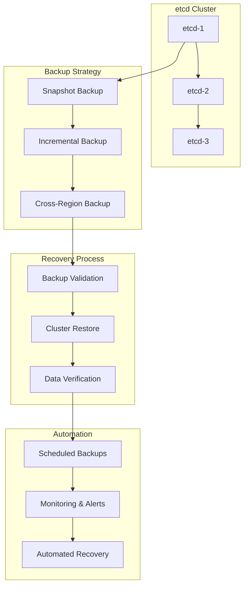

# Session 5: 백업 및 재해 복구

## 📍 교과과정에서의 위치
이 세션은 **Week 2 > Day 4 > Session 5**로, 트러블슈팅 및 디버깅 이해를 바탕으로 Kubernetes 클러스터의 백업 전략과 재해 복구 계획 수립 방법론을 심화 분석합니다.

## 학습 목표 (5분)
- **etcd 백업 및 복구** 전략과 **클러스터 상태 관리** 방법
- **애플리케이션 데이터 백업** 및 **볼륨 스냅샷** 관리 기법
- **재해 복구 계획** 수립과 **비즈니스 연속성** 보장 전략

## 1. 이론: etcd 백업 및 복구 전략 (20분)

### etcd 백업 아키텍처



### etcd 백업 전략

```
etcd 백업 방법론:

스냅샷 백업:
├── 전체 스냅샷 생성:
│   ├── etcdctl snapshot save 명령어 사용
│   ├── 클러스터 전체 상태 포함
│   ├── 일관된 시점 백업 보장
│   ├── 압축된 형태로 저장
│   └── 빠른 복구 가능
├── 스냅샷 스케줄링:
│   ├── 정기적 자동 백업 (매시간/일일)
│   ├── 중요 변경 전 수동 백업
│   ├── 백업 보관 정책 (일일/주간/월간)
│   ├── 백업 파일 압축 및 암호화
│   └── 원격 저장소 동기화
├── 백업 검증:
│   ├── 백업 파일 무결성 검사
│   ├── 복원 테스트 정기 수행
│   ├── 백업 메타데이터 확인
│   ├── 체크섬 검증
│   └── 복구 시간 측정
└── 백업 모니터링:
    ├── 백업 성공/실패 알림
    ├── 백업 파일 크기 추적
    ├── 백업 소요 시간 모니터링
    ├── 저장소 용량 관리
    └── 백업 정책 준수 확인

증분 백업:
├── WAL (Write-Ahead Log) 백업:
│   ├── 변경 사항만 백업
│   ├── 스토리지 효율성 향상
│   ├── 네트워크 대역폭 절약
│   ├── 빠른 백업 완료
│   └── 복구 시 순차 적용 필요
├── 연속 백업:
│   ├── 실시간 변경 사항 추적
│   ├── 최소 데이터 손실 (RPO 최소화)
│   ├── 스트리밍 백업 지원
│   ├── 네트워크 장애 복구 지원
│   └── 복잡한 복구 프로세스
└── 하이브리드 접근:
    ├── 전체 + 증분 백업 조합
    ├── 백업 윈도우 최적화
    ├── 복구 시간 단축
    ├── 스토리지 비용 절감
    └── 복구 복잡성 관리

백업 저장 전략:
├── 로컬 백업:
│   ├── 동일 클러스터 내 저장
│   ├── 빠른 접근 및 복구
│   ├── 네트워크 의존성 없음
│   ├── 재해 시 함께 손실 위험
│   └── 임시 백업용으로 적합
├── 원격 백업:
│   ├── 별도 지역/클라우드 저장
│   ├── 재해 복구 보장
│   ├── 지리적 분산 저장
│   ├── 네트워크 의존성 존재
│   └── 전송 시간 고려 필요
├── 다중 백업:
│   ├── 여러 위치 동시 백업
│   ├── 최고 수준 안정성
│   ├── 백업 실패 위험 최소화
│   ├── 높은 비용 및 복잡성
│   └── 엔터프라이즈 환경 적합
└── 클라우드 백업:
    ├── 관리형 백업 서비스 활용
    ├── 자동 복제 및 버전 관리
    ├── 확장성 및 내구성 보장
    ├── 비용 효율적 장기 보관
    └── 벤더 종속성 고려
```

### etcd 복구 프로세스

```
etcd 복구 절차:

복구 준비:
├── 백업 파일 검증:
│   ├── 백업 파일 무결성 확인
│   ├── 백업 시점 및 버전 확인
│   ├── 복구 대상 클러스터 식별
│   ├── 복구 영향 범위 분석
│   └── 롤백 계획 수립
├── 클러스터 상태 확인:
│   ├── 현재 etcd 클러스터 상태
│   ├── 데이터 손실 범위 평가
│   ├── 복구 필요성 판단
│   ├── 다운타임 계획 수립
│   └── 이해관계자 통보
└── 복구 환경 준비:
    ├── 복구용 임시 클러스터 구성
    ├── 네트워크 및 스토리지 준비
    ├── 백업 파일 접근 권한 확인
    ├── 복구 도구 및 스크립트 준비
    └── 모니터링 시스템 설정

복구 실행:
├── 클러스터 중지:
│   ├── 모든 etcd 멤버 중지
│   ├── API 서버 중지
│   ├── 컨트롤러 및 스케줄러 중지
│   ├── 워크로드 트래픽 차단
│   └── 복구 모드 진입
├── 데이터 복원:
│   ├── 기존 데이터 디렉토리 백업
│   ├── etcdctl snapshot restore 실행
│   ├── 새로운 클러스터 ID 생성
│   ├── 멤버 구성 정보 업데이트
│   └── 데이터 디렉토리 권한 설정
├── 클러스터 재시작:
│   ├── etcd 멤버 순차 시작
│   ├── 클러스터 상태 확인
│   ├── 리더 선출 대기
│   ├── 데이터 일관성 검증
│   └── API 서버 재시작
└── 서비스 복구:
    ├── 컨트롤 플레인 컴포넌트 시작
    ├── 워커 노드 재연결
    ├── Pod 상태 확인 및 복구
    ├── 서비스 가용성 검증
    └── 모니터링 시스템 복구

복구 후 검증:
├── 데이터 무결성 확인:
│   ├── 리소스 오브젝트 개수 확인
│   ├── 중요 설정 데이터 검증
│   ├── 네임스페이스 및 RBAC 확인
│   ├── 시크릿 및 ConfigMap 검증
│   └── 커스텀 리소스 상태 확인
├── 기능 테스트:
│   ├── API 서버 응답성 테스트
│   ├── Pod 생성 및 삭제 테스트
│   ├── 서비스 디스커버리 테스트
│   ├── 스토리지 마운트 테스트
│   └── 네트워크 연결성 테스트
└── 성능 검증:
    ├── 클러스터 응답 시간 측정
    ├── 처리량 및 동시성 테스트
    ├── 리소스 사용률 확인
    ├── 백그라운드 작업 상태
    └── 모니터링 메트릭 정상화
```

## 2. 이론: 애플리케이션 데이터 백업 (15분)

### 볼륨 백업 전략

```
애플리케이션 데이터 백업:

볼륨 스냅샷:
├── CSI 스냅샷 기능:
│   ├── VolumeSnapshot 리소스 활용
│   ├── 스토리지 백엔드 네이티브 스냅샷
│   ├── 애플리케이션 일관성 보장
│   ├── 빠른 스냅샷 생성 및 복원
│   └── 스토리지 효율적 공간 사용
├── 스냅샷 스케줄링:
│   ├── CronJob을 통한 정기 스냅샷
│   ├── 애플리케이션 정지 시점 스냅샷
│   ├── 트랜잭션 경계 고려
│   ├── 백업 윈도우 최적화
│   └── 스냅샷 보관 정책 적용
├── 크로스 리전 복제:
│   ├── 스냅샷 원격 복제
│   ├── 재해 복구 준비
│   ├── 지리적 분산 백업
│   ├── 네트워크 대역폭 고려
│   └── 복제 지연 시간 관리
└── 스냅샷 관리:
    ├── 스냅샷 메타데이터 관리
    ├── 보관 기간 및 정책
    ├── 자동 정리 및 아카이빙
    ├── 스냅샷 체인 관리
    └── 복구 포인트 선택

애플리케이션별 백업:
├── 데이터베이스 백업:
│   ├── 논리적 백업 (덤프)
│   ├── 물리적 백업 (바이너리)
│   ├── 트랜잭션 로그 백업
│   ├── 포인트-인-타임 복구
│   └── 마스터-슬레이브 복제 활용
├── 파일 시스템 백업:
│   ├── rsync 기반 증분 백업
│   ├── tar/zip 아카이브 백업
│   ├── 파일 레벨 중복제거
│   ├── 압축 및 암호화
│   └── 메타데이터 보존
├── 오브젝트 스토리지 백업:
│   ├── S3/MinIO 버킷 동기화
│   ├── 버전 관리 활용
│   ├── 라이프사이클 정책 적용
│   ├── 크로스 리전 복제
│   └── 접근 제어 및 암호화
└── 상태 저장 애플리케이션:
    ├── StatefulSet 데이터 백업
    ├── 순서 보장 복구
    ├── 네트워크 식별자 보존
    ├── 볼륨 클레임 템플릿 관리
    └── 클러스터 상태 동기화
```

### Velero를 통한 통합 백업

```
Velero 백업 솔루션:

Velero 아키텍처:
├── 백업 컨트롤러:
│   ├── Kubernetes 리소스 백업
│   ├── 볼륨 스냅샷 조정
│   ├── 백업 라이프사이클 관리
│   ├── 복원 프로세스 제어
│   └── 스케줄 기반 자동 백업
├── 플러그인 시스템:
│   ├── 오브젝트 스토리지 플러그인
│   ├── 볼륨 스냅샷 플러그인
│   ├── 백업 아이템 액션 플러그인
│   ├── 복원 아이템 액션 플러그인
│   └── 커스텀 플러그인 개발 지원
├── 백업 저장소:
│   ├── S3 호환 오브젝트 스토리지
│   ├── Azure Blob Storage
│   ├── Google Cloud Storage
│   ├── 온프레미스 MinIO
│   └── 다중 백업 위치 지원
└── 복원 기능:
    ├── 전체 클러스터 복원
    ├── 네임스페이스별 복원
    ├── 리소스별 선택적 복원
    ├── 크로스 클러스터 마이그레이션
    └── 부분 복원 및 변환

백업 정책 및 전략:
├── 백업 범위 정의:
│   ├── 포함/제외 네임스페이스
│   ├── 리소스 타입 필터링
│   ├── 라벨 셀렉터 기반 선택
│   ├── 볼륨 백업 정책
│   └── 훅(Hook) 실행 정책
├── 스케줄 백업:
│   ├── Cron 표현식 기반 스케줄
│   ├── 백업 보관 기간 (TTL)
│   ├── 백업 개수 제한
│   ├── 백업 실패 재시도 정책
│   └── 백업 완료 알림
├── 재해 복구 계획:
│   ├── RTO (Recovery Time Objective)
│   ├── RPO (Recovery Point Objective)
│   ├── 우선순위 기반 복구 순서
│   ├── 의존성 고려 복구 계획
│   └── 복구 테스트 및 검증
└── 모니터링 및 알림:
    ├── 백업 상태 모니터링
    ├── 백업 실패 알림
    ├── 스토리지 사용량 추적
    ├── 복구 시간 측정
    └── 컴플라이언스 리포팅
```

## 3. 이론: 재해 복구 계획 수립 (10분)

### 비즈니스 연속성 계획

```
재해 복구 전략:

재해 시나리오 분석:
├── 자연 재해:
│   ├── 지진, 홍수, 화재 등
│   ├── 데이터센터 전체 손실
│   ├── 장기간 서비스 중단
│   ├── 물리적 인프라 복구 필요
│   └── 대체 사이트 활성화
├── 기술적 재해:
│   ├── 하드웨어 대규모 장애
│   ├── 소프트웨어 버그 또는 손상
│   ├── 네트워크 인프라 장애
│   ├── 클라우드 서비스 중단
│   └── 사이버 보안 공격
├── 인적 재해:
│   ├── 운영 실수 또는 오류
│   ├── 악의적 내부자 공격
│   ├── 핵심 인력 부재
│   ├── 프로세스 미준수
│   └── 지식 손실
└── 외부 재해:
    ├── 공급업체 서비스 중단
    ├── 인터넷 연결 장애
    ├── 전력 공급 중단
    ├── 규제 변경 영향
    └── 경제적 위기

복구 목표 설정:
├── RTO (Recovery Time Objective):
│   ├── 서비스별 복구 시간 목표
│   ├── 비즈니스 영향도 기반 우선순위
│   ├── 기술적 복구 가능 시간
│   ├── 비용 대비 효과 분석
│   └── 이해관계자 합의
├── RPO (Recovery Point Objective):
│   ├── 허용 가능한 데이터 손실 범위
│   ├── 백업 주기 및 방법 결정
│   ├── 트랜잭션 일관성 요구사항
│   ├── 규제 준수 요구사항
│   └── 비즈니스 연속성 요구사항
├── RLO (Recovery Level Objective):
│   ├── 복구 후 서비스 수준
│   ├── 성능 및 용량 목표
│   ├── 기능 제한 허용 범위
│   ├── 사용자 경험 기준
│   └── 점진적 복구 계획
└── 비용 최적화:
    ├── 복구 비용 vs 비즈니스 손실
    ├── 보험 및 위험 전가
    ├── 예방 투자 vs 복구 비용
    ├── 클라우드 활용 비용 효율성
    └── 장기적 ROI 분석

복구 아키텍처:
├── 액티브-패시브:
│   ├── 주 사이트와 대기 사이트
│   ├── 정기적 데이터 동기화
│   ├── 수동 장애조치
│   ├── 비용 효율적
│   └── 복구 시간 상대적 길음
├── 액티브-액티브:
│   ├── 다중 사이트 동시 운영
│   ├── 실시간 데이터 동기화
│   ├── 자동 로드 밸런싱
│   ├── 높은 가용성
│   └── 높은 비용 및 복잡성
├── 하이브리드 클라우드:
│   ├── 온프레미스 + 클라우드
│   ├── 클라우드 버스팅
│   ├── 재해 시 클라우드 확장
│   ├── 유연한 리소스 활용
│   └── 네트워크 의존성
└── 멀티 클라우드:
    ├── 여러 클라우드 제공업체
    ├── 벤더 종속성 회피
    ├── 지리적 분산
    ├── 복잡한 관리
    └── 높은 운영 비용
```

## 4. 개념 예시: 백업 및 복구 구성 (12분)

### etcd 백업 자동화 예시

```bash
#!/bin/bash
# etcd 자동 백업 스크립트 (개념 예시)

BACKUP_DIR="/var/backups/etcd"
DATE=$(date +%Y%m%d_%H%M%S)
BACKUP_FILE="$BACKUP_DIR/etcd-snapshot-$DATE.db"
RETENTION_DAYS=7

# 백업 디렉토리 생성
mkdir -p $BACKUP_DIR

# etcd 스냅샷 생성
ETCDCTL_API=3 etcdctl snapshot save $BACKUP_FILE \
  --endpoints=https://127.0.0.1:2379 \
  --cacert=/etc/kubernetes/pki/etcd/ca.crt \
  --cert=/etc/kubernetes/pki/etcd/server.crt \
  --key=/etc/kubernetes/pki/etcd/server.key

# 백업 검증
ETCDCTL_API=3 etcdctl snapshot status $BACKUP_FILE

# 압축 및 암호화
gzip $BACKUP_FILE
gpg --cipher-algo AES256 --compress-algo 1 --symmetric \
    --output $BACKUP_FILE.gz.gpg $BACKUP_FILE.gz

# 원격 저장소 업로드
aws s3 cp $BACKUP_FILE.gz.gpg s3://etcd-backups/$(date +%Y/%m/%d)/

# 오래된 백업 정리
find $BACKUP_DIR -name "etcd-snapshot-*.db.gz.gpg" \
     -mtime +$RETENTION_DAYS -delete

echo "etcd backup completed: $BACKUP_FILE"
```

### Velero 백업 구성 예시

```yaml
# Velero 백업 스케줄 (개념 예시)
apiVersion: velero.io/v1
kind: Schedule
metadata:
  name: daily-backup
  namespace: velero
spec:
  schedule: "0 2 * * *"
  template:
    includedNamespaces:
    - production
    - staging
    excludedNamespaces:
    - kube-system
    - velero
    includedResources:
    - "*"
    excludedResources:
    - events
    - events.events.k8s.io
    labelSelector:
      matchLabels:
        backup: "enabled"
    snapshotVolumes: true
    ttl: 720h0m0s
    storageLocation: default
    volumeSnapshotLocations:
    - default

---
# 백업 복원 예시
apiVersion: velero.io/v1
kind: Restore
metadata:
  name: production-restore
  namespace: velero
spec:
  backupName: daily-backup-20231201-020000
  includedNamespaces:
  - production
  excludedResources:
  - nodes
  - events
  restorePVs: true
  preserveNodePorts: false
```

### 재해 복구 플레이북 예시

```yaml
# 재해 복구 플레이북 (개념 예시)
apiVersion: v1
kind: ConfigMap
metadata:
  name: disaster-recovery-playbook
data:
  dr-checklist.md: |
    # 재해 복구 체크리스트
    
    ## 1단계: 상황 평가 (15분)
    - [ ] 재해 범위 및 영향도 평가
    - [ ] 서비스 중단 범위 확인
    - [ ] 데이터 손실 범위 평가
    - [ ] 복구 우선순위 결정
    - [ ] 이해관계자 통보
    
    ## 2단계: 긴급 대응 (30분)
    - [ ] 트래픽 우회 또는 차단
    - [ ] 추가 손상 방지 조치
    - [ ] 백업 시스템 활성화
    - [ ] 임시 서비스 구성
    - [ ] 상황 모니터링 강화
    
    ## 3단계: 복구 실행 (2-4시간)
    - [ ] 백업 데이터 검증
    - [ ] 인프라 복구 또는 재구성
    - [ ] 데이터 복원
    - [ ] 서비스 재시작
    - [ ] 기능 테스트 수행
    
    ## 4단계: 검증 및 정상화 (1-2시간)
    - [ ] 전체 시스템 기능 검증
    - [ ] 성능 및 안정성 확인
    - [ ] 모니터링 시스템 정상화
    - [ ] 사용자 서비스 재개
    - [ ] 복구 완료 통보
    
    ## 5단계: 사후 분석
    - [ ] 근본 원인 분석
    - [ ] 복구 과정 검토
    - [ ] 개선 사항 도출
    - [ ] 문서 업데이트
    - [ ] 교육 및 훈련 계획
  
  recovery-commands.sh: |
    #!/bin/bash
    # 긴급 복구 명령어 모음
    
    # etcd 복구
    etcd_restore() {
        ETCDCTL_API=3 etcdctl snapshot restore /backup/etcd-snapshot.db \
          --data-dir=/var/lib/etcd-restore \
          --name=master \
          --initial-cluster=master=https://10.0.0.1:2380 \
          --initial-advertise-peer-urls=https://10.0.0.1:2380
    }
    
    # Velero 복구
    velero_restore() {
        velero restore create emergency-restore \
          --from-backup daily-backup-latest \
          --include-namespaces production
    }
    
    # 클러스터 상태 확인
    cluster_health() {
        kubectl get nodes
        kubectl get pods --all-namespaces
        kubectl get componentstatuses
    }
```

## 5. 토론 및 정리 (8분)

### 핵심 개념 정리
- **etcd 백업**을 통한 **클러스터 상태 보호**와 **신속한 복구** 체계
- **애플리케이션 데이터 백업** 전략과 **볼륨 스냅샷** 활용
- **재해 복구 계획** 수립과 **비즈니스 연속성** 보장 방법론
- **자동화된 백업** 시스템과 **복구 프로세스** 표준화

### 토론 주제
"클라우드 네이티브 환경에서 RTO/RPO 목표를 만족하면서도 비용 효율적인 백업 및 재해 복구 전략은 무엇인가?"

## 💡 핵심 키워드
- **etcd 백업**: 스냅샷, 증분 백업, 자동화, 검증
- **애플리케이션 백업**: 볼륨 스냅샷, Velero, 상태 관리
- **재해 복구**: RTO/RPO, 복구 아키텍처, 비즈니스 연속성
- **자동화**: 스케줄 백업, 모니터링, 복구 플레이북

## 📚 참고 자료
- [etcd 백업 및 복구](https://kubernetes.io/docs/tasks/administer-cluster/configure-upgrade-etcd/#backing-up-an-etcd-cluster)
- [Velero 백업 솔루션](https://velero.io/docs/)
- [Kubernetes 재해 복구](https://kubernetes.io/docs/concepts/cluster-administration/)
