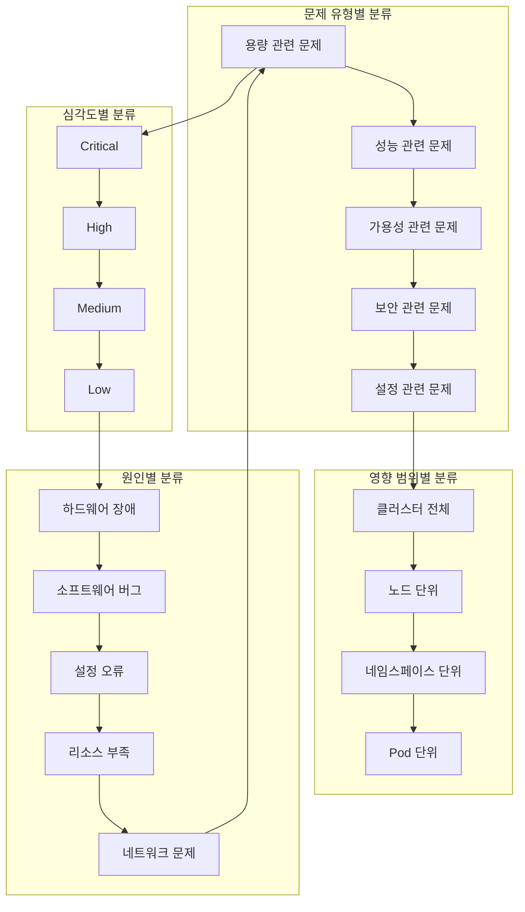
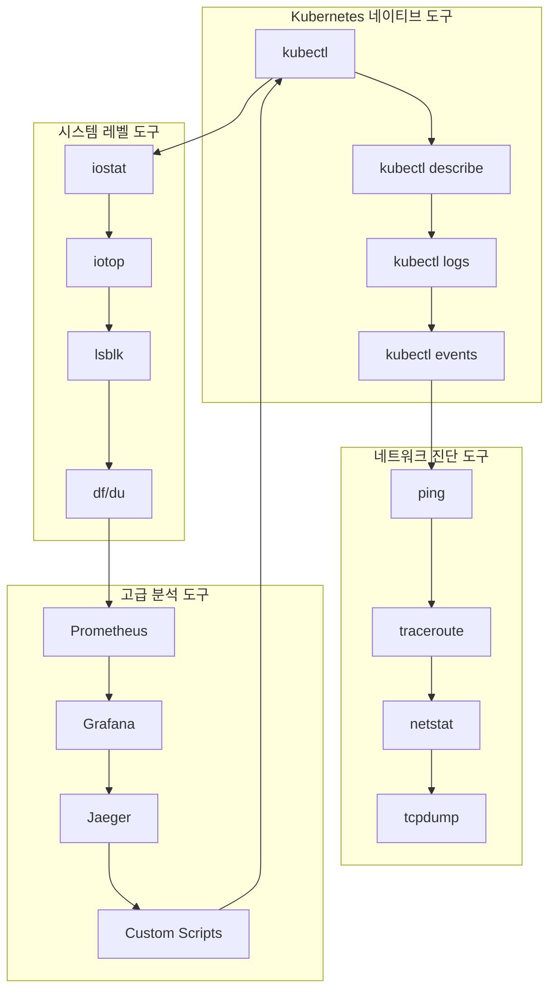
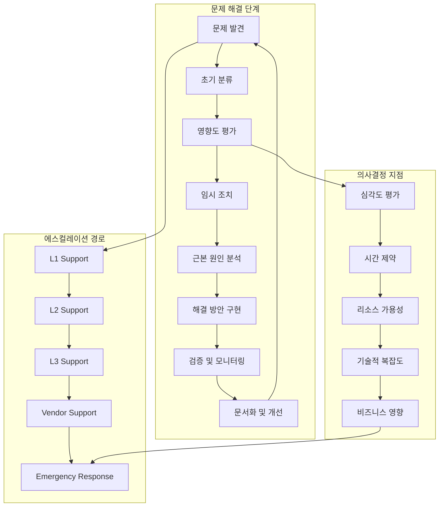
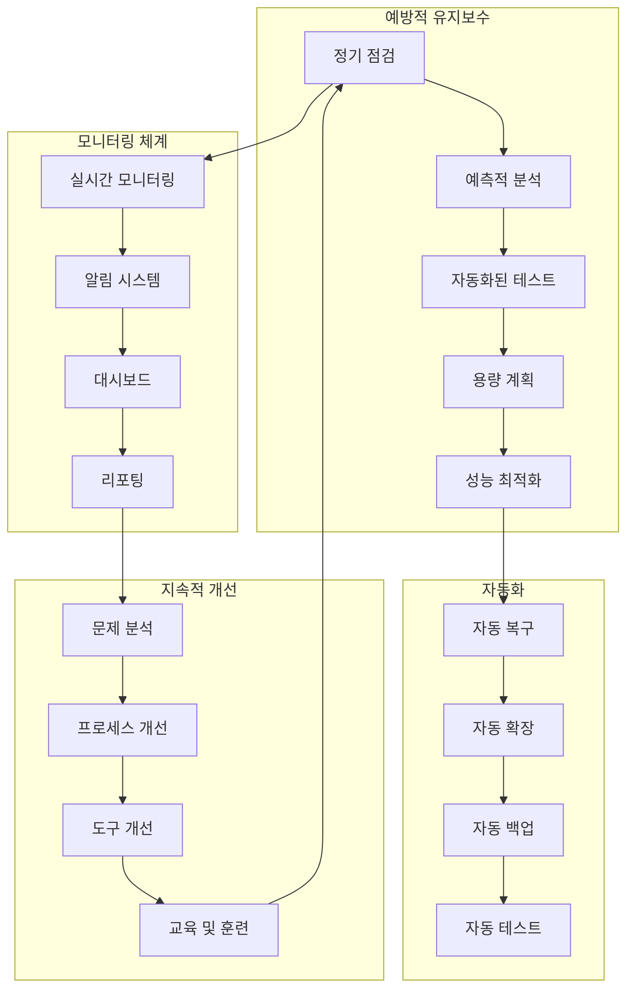

# Session 6: 스토리지 트러블슈팅과 문제 해결

## 📍 교과과정에서의 위치
이 세션은 **Week 2 > Day 4 > Session 6**으로, Session 1-5에서 학습한 스토리지 기초, 보안, 모니터링을 바탕으로 실제 운영 환경에서 발생하는 스토리지 문제의 진단과 해결 방법을 학습합니다.

## 학습 목표 (5분)
- **일반적인 스토리지 문제** 패턴과 **근본 원인** 분석 이해
- **진단 도구**와 **방법론**을 활용한 **체계적 문제 해결** 학습
- **문제 해결 프로세스**와 **에스컬레이션** 절차 파악
- **예방적 유지보수** 전략과 **모니터링** 체계 구축

## 1. 일반적인 스토리지 문제 패턴과 근본 원인 분석 (15분)

### 스토리지 문제 분류 체계



### 스토리지 문제 패턴 상세 분석
```
Kubernetes 스토리지 문제 패턴:

용량 관련 문제:
   🔹 디스크 공간 부족:
      • 증상:
         • Pod 생성 실패 (Pending 상태)
         • PVC 바인딩 실패
         • 애플리케이션 쓰기 오류
         • 로그 파일 생성 실패
         • 임시 파일 생성 불가
         • 데이터베이스 트랜잭션 실패
      • 근본 원인:
         • 예상보다 빠른 데이터 증가
         • 로그 파일 무제한 증가
         • 임시 파일 정리 실패
         • 백업 파일 누적
         • 캐시 파일 과도한 생성
         • 용량 계획 부족
      • 영향:
      • 서비스 중단
      • 데이터 손실 위험
      • 성능 저하
      • 사용자 경험 악화
      • SLA 위반
      • 비즈니스 영향
   🔹 PV 할당량 초과:
      • 증상:
         • 새로운 PVC 생성 실패
         • 동적 프로비저닝 실패
         • 스토리지 클래스 할당량 초과
         • 네임스페이스 할당량 초과
         • 클러스터 전체 할당량 초과
         • 특정 스토리지 타입 고갈
      • 근본 원인:
         • 할당량 정책 부적절
         • 리소스 사용량 예측 실패
         • 할당량 모니터링 부족
         • 사용하지 않는 PVC 누적
         • 테스트 환경 정리 미흡
         • 자동 정리 정책 부재
      • 해결 방안:
      • 할당량 정책 재검토
      • 사용하지 않는 PVC 정리
      • 자동 정리 스크립트 구현
      • 모니터링 및 알림 강화
      • 용량 계획 개선
      • 거버넌스 정책 수립
   🔹 스토리지 클래스 부족:
   🔹 증상:
      • 특정 성능 요구사항 미충족
      • 비용 최적화 옵션 부족
      • 지역별 스토리지 옵션 제한
      • 백업 정책 적용 불가
      • 암호화 요구사항 미충족
      • 컴플라이언스 요구사항 미충족
   🔹 근본 원인:
      • 스토리지 클래스 설계 부족
      • 비즈니스 요구사항 변화
      • 새로운 기술 도입 필요
      • 규정 준수 요구사항 변화
      • 비용 최적화 압박
      • 성능 요구사항 증가
   🔹 해결 방안:
   🔹 스토리지 클래스 다양화
   🔹 동적 스토리지 클래스 생성
   🔹 정책 기반 스토리지 할당
   🔹 멀티 클라우드 스토리지 지원
   🔹 하이브리드 스토리지 전략
   🔹 지속적 요구사항 수집

성능 관련 문제:
   🔹 I/O 성능 저하:
      • 증상:
         • 애플리케이션 응답 시간 증가
         • 데이터베이스 쿼리 지연
         • 파일 읽기/쓰기 지연
         • 백업 시간 증가
         • 로그 처리 지연
         • 사용자 불만 증가
      • 근본 원인:
         • 스토리지 백엔드 과부하
         • 네트워크 대역폭 부족
         • 디스크 I/O 경합
         • 파일시스템 단편화
         • 캐시 효율성 저하
         • 하드웨어 노화
      • 진단 방법:
      • I/O 메트릭 분석
      • 지연 시간 분포 분석
      • 처리량 트렌드 분석
      • 리소스 사용률 분석
      • 애플리케이션 프로파일링
      • 하드웨어 상태 점검
   🔹 네트워크 스토리지 지연:
      • 증상:
         • 원격 스토리지 접근 지연
         • 네트워크 타임아웃 발생
         • 연결 끊김 현상
         • 데이터 전송 속도 저하
         • 마운트 실패 빈발
         • 클러스터 간 동기화 지연
      • 근본 원인:
         • 네트워크 혼잡
         • 라우팅 문제
         • 방화벽 설정 문제
         • DNS 해석 지연
         • 네트워크 장비 장애
         • 대역폭 제한
      • 해결 방안:
      • 네트워크 경로 최적화
      • QoS 정책 적용
      • 전용 스토리지 네트워크
      • 로드 밸런싱 개선
      • 캐싱 전략 강화
      • 네트워크 모니터링 강화
   🔹 동시성 문제:
   🔹 증상:
      • 락 경합으로 인한 지연
      • 데드락 발생
      • 트랜잭션 타임아웃
      • 동시 접근 오류
      • 데이터 일관성 문제
      • 성능 급격한 저하
   🔹 근본 원인:
      • 부적절한 락 전략
      • 트랜잭션 범위 과도
      • 인덱스 설계 문제
      • 동시성 제어 부족
      • 리소스 경합
      • 아키텍처 설계 문제
   🔹 해결 방안:
   🔹 락 전략 최적화
   🔹 트랜잭션 분할
   🔹 읽기 전용 복제본 활용
   🔹 샤딩 전략 적용
   🔹 비동기 처리 도입
   🔹 아키텍처 재설계

가용성 관련 문제:
   🔹 볼륨 마운트 실패:
      • 증상:
         • Pod 시작 실패
         • ContainerCreating 상태 지속
         • 볼륨 마운트 에러 메시지
         • 파일시스템 접근 불가
         • 애플리케이션 초기화 실패
         • 서비스 중단
      • 근본 원인:
         • PV/PVC 바인딩 실패
         • 스토리지 백엔드 접근 불가
         • 권한 설정 문제
         • 네트워크 연결 문제
         • CSI 드라이버 오류
         • 노드 리소스 부족
      • 진단 단계:
      • Pod 이벤트 확인
      • PVC 상태 점검
      • 스토리지 백엔드 상태 확인
      • 네트워크 연결 테스트
      • 권한 설정 검증
      • CSI 드라이버 로그 분석
   🔹 데이터 손실:
      • 증상:
         • 파일 또는 디렉토리 누락
         • 데이터베이스 테이블 손상
         • 백업 파일 손상
         • 트랜잭션 로그 손실
         • 메타데이터 손상
         • 애플리케이션 데이터 불일치
      • 근본 원인:
         • 하드웨어 장애
         • 소프트웨어 버그
         • 인간 실수
         • 악의적 공격
         • 자연 재해
         • 시스템 오류
      • 복구 전략:
      • 백업에서 복구
      • 스냅샷 활용 복구
      • 복제본에서 복구
      • 트랜잭션 로그 재생
      • 부분 복구 시도
      • 재해 복구 절차 실행
   🔹 스토리지 백엔드 장애:
   🔹 증상:
      • 모든 볼륨 접근 불가
      • 새로운 PV 생성 불가
      • 스냅샷 생성 실패
      • 백업 작업 실패
      • 복제 작업 중단
      • 전체 서비스 중단
   🔹 근본 원인:
      • 스토리지 시스템 장애
      • 네트워크 인프라 장애
      • 전원 공급 장애
      • 소프트웨어 업데이트 실패
      • 설정 변경 오류
      • 용량 한계 도달
   🔹 대응 방안:
   🔹 백업 스토리지 시스템 활성화
   🔹 다른 가용 영역으로 이전
   🔹 임시 로컬 스토리지 활용
   🔹 서비스 우선순위 기반 복구
   🔹 재해 복구 계획 실행
   🔹 벤더 지원 요청
```

## 2. 진단 도구와 방법론 (12분)

### 진단 도구 생태계



### 진단 방법론 상세 분석
```
스토리지 문제 진단 방법론:

체계적 진단 접근법:
   🔹 1단계: 문제 정의 및 범위 파악
      • 문제 증상 정확한 기술:
         • 언제 문제가 시작되었는가?
         • 어떤 조건에서 발생하는가?
         • 영향받는 시스템 범위는?
         • 오류 메시지나 로그는?
         • 재현 가능한 패턴이 있는가?
         • 사용자 영향도는 어느 정도인가?
      • 환경 정보 수집:
         • 클러스터 버전 및 구성
         • 스토리지 백엔드 정보
         • 네트워크 토폴로지
         • 최근 변경사항
         • 관련 애플리케이션 정보
         • 모니터링 데이터 현황
      • 우선순위 설정:
      • 비즈니스 영향도 평가
      • 기술적 복잡도 평가
      • 복구 시간 목표 설정
      • 리소스 할당 계획
      • 에스컬레이션 기준 설정
      • 커뮤니케이션 계획 수립
   🔹 2단계: 초기 데이터 수집
      • Kubernetes 오브젝트 상태 확인:
         • kubectl get pods -o wide
         • kubectl get pv,pvc
         • kubectl get storageclass
         • kubectl get events --sort-by='.lastTimestamp'
         • kubectl describe pod <pod-name>
         • kubectl describe pvc <pvc-name>
      • 로그 수집:
         • kubectl logs <pod-name> --previous
         • kubelet 로그 (/var/log/kubelet.log)
         • 컨테이너 런타임 로그
         • CSI 드라이버 로그
         • 스토리지 백엔드 로그
         • 시스템 로그 (/var/log/messages)
      • 시스템 상태 확인:
      • 노드 리소스 사용률
      • 디스크 공간 및 I/O 상태
      • 네트워크 연결 상태
      • 프로세스 상태
      • 시스템 부하
      • 하드웨어 상태
   🔹 3단계: 심화 분석
      • 메트릭 분석:
         • 시계열 데이터 패턴 분석
         • 이상치 탐지
         • 상관관계 분석
         • 트렌드 분석
         • 계절성 패턴 분석
         • 임계값 위반 분석
      • 로그 분석:
         • 오류 패턴 식별
         • 시간 순서 분석
         • 빈도 분석
         • 상관관계 분석
         • 근본 원인 추적
         • 예외 상황 분석
      • 성능 프로파일링:
      • I/O 패턴 분석
      • 리소스 사용 패턴
      • 병목 지점 식별
      • 지연 시간 분해
      • 처리량 분석
      • 확장성 분석
   🔹 4단계: 가설 수립 및 검증
   🔹 가설 수립:
      • 수집된 데이터 기반 가설
      • 경험 기반 가설
      • 문서 기반 가설
      • 커뮤니티 지식 기반 가설
      • 벤더 지원 기반 가설
      • 다중 가설 동시 고려
   🔹 가설 검증:
      • 실험적 검증
      • 시뮬레이션 검증
      • 테스트 환경 검증
      • 단계적 검증
      • A/B 테스트
      • 롤백 가능한 검증
   🔹 결론 도출:
   🔹 근본 원인 확정
   🔹 해결 방안 수립
   🔹 위험도 평가
   🔹 구현 계획 수립
   🔹 검증 계획 수립
   🔹 문서화 및 공유

Kubernetes 네이티브 진단 도구:
   🔹 kubectl 명령어 활용:
      • 기본 상태 확인:
         • kubectl get all -n <namespace>
         • kubectl get pv,pvc -A
         • kubectl get storageclass
         • kubectl get csinodes
         • kubectl get csidrivers
         • kubectl get volumeattachments
      • 상세 정보 확인:
         • kubectl describe pod <pod-name>
         • kubectl describe pvc <pvc-name>
         • kubectl describe pv <pv-name>
         • kubectl describe storageclass <sc-name>
         • kubectl describe node <node-name>
         • kubectl describe volumeattachment <va-name>
      • 로그 및 이벤트:
      • kubectl logs <pod-name> -c <container-name>
      • kubectl logs <pod-name> --previous
      • kubectl get events --sort-by='.lastTimestamp'
      • kubectl get events --field-selector involvedObject.name=<object-name>
      • kubectl top nodes
      • kubectl top pods
   🔹 고급 kubectl 기법:
      • JSON Path 활용:
         • kubectl get pods -o jsonpath='{.items[*].spec.volumes[*]}'
         • kubectl get pvc -o jsonpath='{.items[*].status.phase}'
         • kubectl get pv -o jsonpath='{.items[*].spec.capacity.storage}'
         • kubectl get nodes -o jsonpath='{.items[*].status.allocatable.storage}'
         • 커스텀 컬럼 출력
      • 필터링 및 정렬:
         • --field-selector 활용
         • --label-selector 활용
         • --sort-by 활용
         • grep, awk 조합 활용
         • jq 도구 활용
      • 배치 작업:
      • 여러 오브젝트 동시 조회
      • 스크립트 기반 자동화
      • 정기적 상태 점검
      • 알림 연동
      • 리포트 생성
   🔹 디버깅 Pod 활용:
   🔹 디버깅 Pod 생성:
      • 네트워크 진단 도구 포함
      • 스토리지 진단 도구 포함
      • 시스템 진단 도구 포함
      • 특권 모드 실행
      • 호스트 네트워크 접근
      • 호스트 파일시스템 접근
   🔹 문제 Pod와 동일 노드 배치:
      • nodeSelector 활용
      • nodeName 직접 지정
      • 동일 볼륨 마운트
      • 동일 네트워크 설정
      • 동일 보안 컨텍스트
      • 동일 리소스 제한
   🔹 실시간 디버깅:
   🔹 kubectl exec 활용
   🔹 대화형 셸 접근
   🔹 파일시스템 탐색
   🔹 네트워크 연결 테스트
   🔹 프로세스 상태 확인
   🔹 실시간 로그 모니터링

시스템 레벨 진단 도구:
   🔹 디스크 및 파일시스템:
      • 용량 및 사용률:
         • df -h (파일시스템 사용률)
         • du -sh * (디렉토리별 사용량)
         • lsblk (블록 디바이스 구조)
         • fdisk -l (디스크 파티션 정보)
         • mount (마운트된 파일시스템)
         • findmnt (마운트 트리 구조)
      • I/O 성능 분석:
         • iostat -x 1 (I/O 통계)
         • iotop (프로세스별 I/O)
         • sar -d 1 (디스크 활동)
         • dstat --disk (실시간 디스크 통계)
         • fio (I/O 벤치마크)
         • dd (간단한 I/O 테스트)
      • 파일시스템 상태:
      • fsck (파일시스템 검사)
      • tune2fs -l (ext 파일시스템 정보)
      • xfs_info (XFS 파일시스템 정보)
      • lsof (열린 파일 목록)
      • fuser (파일 사용 프로세스)
      • debugfs (파일시스템 디버깅)
   🔹 네트워크 진단:
      • 연결성 테스트:
         • ping (기본 연결 테스트)
         • traceroute (경로 추적)
         • mtr (연속 경로 추적)
         • telnet (포트 연결 테스트)
         • nc (네트워크 연결 도구)
         • curl (HTTP 연결 테스트)
      • 네트워크 상태:
         • netstat -tuln (포트 상태)
         • ss -tuln (소켓 상태)
         • ip route (라우팅 테이블)
         • ip addr (네트워크 인터페이스)
         • arp -a (ARP 테이블)
         • ethtool (네트워크 인터페이스 정보)
      • 트래픽 분석:
      • tcpdump (패킷 캡처)
      • wireshark (패킷 분석)
      • iftop (인터페이스별 트래픽)
      • nethogs (프로세스별 네트워크 사용량)
      • vnstat (네트워크 통계)
      • nload (실시간 네트워크 로드)
   🔹 시스템 리소스:
   🔹 CPU 및 메모리:
      • top/htop (프로세스 모니터링)
      • ps aux (프로세스 목록)
      • free -h (메모리 사용률)
      • vmstat 1 (가상 메모리 통계)
      • sar -u 1 (CPU 사용률)
      • mpstat -P ALL 1 (CPU별 통계)
   🔹 시스템 부하:
      • uptime (시스템 부하 평균)
      • w (사용자 및 부하)
      • load average 분석
      • 프로세스 대기 큐 분석
      • I/O 대기 시간 분석
      • 컨텍스트 스위치 분석
   🔹 로그 분석:
   🔹 journalctl (systemd 로그)
   🔹 dmesg (커널 메시지)
   🔹 /var/log/messages (시스템 로그)
   🔹 /var/log/syslog (시스템 로그)
   🔹 로그 로테이션 상태
   🔹 로그 파일 크기 및 증가율
```

## 3. 문제 해결 프로세스와 에스컬레이션 절차 (10분)

### 문제 해결 워크플로우



### 문제 해결 프로세스 상세 분석
```
체계적 문제 해결 프로세스:

문제 해결 단계별 가이드:
   🔹 1단계: 문제 발견 및 접수
      • 문제 접수 채널:
         • 모니터링 시스템 알림
         • 사용자 신고
         • 정기 점검 발견
         • 자동화된 헬스 체크
         • 로그 분석 시스템
         • 외부 모니터링 서비스
      • 초기 정보 수집:
         • 문제 발생 시간
         • 영향받는 시스템/사용자
         • 오류 메시지 및 증상
         • 재현 가능 여부
         • 최근 변경사항
         • 유사 문제 이력
      • 티켓 생성 및 할당:
      • 고유 식별자 부여
      • 초기 분류 및 우선순위
      • 담당자 할당
      • SLA 시간 설정
      • 관련 팀 통보
      • 상태 추적 시작
   🔹 2단계: 초기 분류 및 우선순위 설정
      • 심각도 분류:
         • Critical (P1): 서비스 완전 중단
         • High (P2): 주요 기능 영향
         • Medium (P3): 부분적 기능 영향
         • Low (P4): 경미한 문제
         • Enhancement: 개선 요청
      • 영향도 평가:
         • 사용자 수 영향
         • 비즈니스 프로세스 영향
         • 데이터 손실 위험
         • 보안 영향
         • 컴플라이언스 영향
         • 재정적 영향
      • 긴급도 평가:
      • 즉시 대응 필요
      • 4시간 내 대응
      • 24시간 내 대응
      • 72시간 내 대응
      • 계획된 유지보수 시간
      • 차기 릴리스 포함
   🔹 3단계: 임시 조치 (Workaround)
      • 즉시 가능한 조치:
         • 서비스 재시작
         • 트래픽 우회
         • 리소스 할당 증가
         • 백업 시스템 활성화
         • 수동 프로세스 전환
         • 사용자 공지
      • 임시 조치 평가:
         • 효과성 검증
         • 부작용 평가
         • 지속 가능성 평가
         • 리소스 요구사항
         • 모니터링 필요성
         • 롤백 계획
      • 임시 조치 구현:
      • 변경 승인 획득
      • 백업 및 롤백 준비
      • 단계적 적용
      • 실시간 모니터링
      • 효과 검증
      • 문서화
   🔹 4단계: 근본 원인 분석 (RCA)
      • 데이터 수집 및 분석:
         • 로그 분석
         • 메트릭 분석
         • 트레이스 분석
         • 설정 검토
         • 코드 검토
         • 환경 검토
      • 가설 수립 및 검증:
         • 다중 가설 고려
         • 실험적 검증
         • 시뮬레이션 검증
         • 전문가 의견 수렴
         • 문헌 조사
         • 벤더 지원 활용
      • 근본 원인 확정:
      • 직접 원인 식별
      • 기여 요인 식별
      • 시스템적 원인 식별
      • 프로세스 원인 식별
      • 인적 요인 식별
      • 환경적 요인 식별
   🔹 5단계: 영구 해결 방안 구현
   🔹 해결 방안 설계:
      • 기술적 해결 방안
      • 프로세스 개선 방안
      • 교육 및 훈련 방안
      • 도구 및 자동화 방안
      • 모니터링 강화 방안
      • 예방 조치 방안
   🔹 구현 계획 수립:
      • 단계별 구현 계획
      • 리소스 할당 계획
      • 일정 및 마일스톤
      • 위험 관리 계획
      • 테스트 계획
      • 롤백 계획
   🔹 구현 및 검증:
   🔹 테스트 환경 검증
   🔹 단계적 프로덕션 적용
   🔹 실시간 모니터링
   🔹 성능 영향 평가
   🔹 사용자 피드백 수집
   🔹 최종 검증 완료

에스컬레이션 절차:
   🔹 에스컬레이션 기준:
      • 시간 기반 에스컬레이션:
         • P1: 30분 내 해결 안 되면 에스컬레이션
         • P2: 2시간 내 해결 안 되면 에스컬레이션
         • P3: 8시간 내 해결 안 되면 에스컬레이션
         • P4: 24시간 내 해결 안 되면 에스컬레이션
         • 주말/휴일 특별 기준 적용
      • 복잡도 기반 에스컬레이션:
         • 기술적 전문성 부족
         • 권한 부족
         • 리소스 부족
         • 다중 시스템 연관
         • 벤더 지원 필요
         • 보안 이슈 관련
      • 영향도 기반 에스컬레이션:
      • 비즈니스 크리티컬 시스템
      • 다수 사용자 영향
      • 데이터 손실 위험
      • 보안 침해 의심
      • 컴플라이언스 위반 위험
      • 미디어 관심 가능성
   🔹 에스컬레이션 레벨:
      • L1 Support (1차 지원):
         • 기본적인 문제 해결
         • 표준 절차 수행
         • 문서화된 해결책 적용
         • 기본 진단 도구 사용
         • 사용자 지원 및 안내
         • 상위 레벨로 에스컬레이션
      • L2 Support (2차 지원):
         • 심화된 기술 지원
         • 복잡한 문제 분석
         • 고급 진단 도구 사용
         • 시스템 설정 변경
         • 임시 해결책 구현
         • 전문가 지원 요청
      • L3 Support (3차 지원):
         • 전문가 수준 지원
         • 아키텍처 수준 분석
         • 코드 수준 디버깅
         • 벤더와 직접 소통
         • 영구 해결책 설계
         • 시스템 개선 제안
      • Vendor Support (벤더 지원):
      • 제품 전문가 지원
      • 소스 코드 수준 분석
      • 핫픽스 및 패치 제공
      • 제품 로드맵 반영
      • 엔지니어링 팀 직접 지원
      • 온사이트 지원 제공
   🔹 에스컬레이션 프로세스:
   🔹 에스컬레이션 결정:
      • 기준 충족 여부 확인
      • 현재 상황 요약 준비
      • 시도한 해결책 정리
      • 필요한 지원 유형 식별
      • 긴급도 재평가
      • 승인 절차 수행
   🔹 에스컬레이션 실행:
      • 상위 레벨 팀 연락
      • 상황 브리핑 제공
      • 관련 자료 전달
      • 권한 이양 또는 협업
      • 진행 상황 모니터링
      • 이해관계자 업데이트
   🔹 에스컬레이션 관리:
   🔹 다중 레벨 동시 참여
   🔹 역할 및 책임 명확화
   🔹 의사소통 채널 관리
   🔹 진행 상황 추적
   🔹 리소스 조정
   🔹 해결 후 디브리핑
```

## 4. 예방적 유지보수 전략과 모니터링 체계 (8분)

### 예방적 유지보수 프레임워크



### 예방적 유지보수 상세 전략
```
예방적 스토리지 유지보수 전략:

정기 점검 체계:
   🔹 일일 점검 항목:
      • 스토리지 사용률 확인:
         • 전체 클러스터 사용률
         • 네임스페이스별 사용률
         • 노드별 사용률
         • 임계값 근접 볼륨 식별
         • 급격한 증가 패턴 탐지
         • 사용률 트렌드 분석
      • 성능 지표 모니터링:
         • I/O 지연 시간 확인
         • 처리량 변화 추적
         • 오류율 모니터링
         • 큐 길이 확인
         • 병목 지점 식별
         • SLA 준수 여부 확인
      • 시스템 상태 점검:
      • PV/PVC 상태 확인
      • 스토리지 클래스 상태
      • CSI 드라이버 상태
      • 백엔드 연결 상태
      • 네트워크 연결 상태
      • 보안 정책 준수 확인
   🔹 주간 점검 항목:
      • 용량 계획 검토:
         • 성장률 분석
         • 예측 모델 정확도 검증
         • 용량 확장 필요성 평가
         • 비용 효율성 분석
         • 스토리지 클래스 최적화
         • 할당량 정책 검토
      • 성능 최적화 검토:
         • 성능 트렌드 분석
         • 병목 지점 분석
         • 최적화 기회 식별
         • 캐시 효율성 분석
         • 네트워크 성능 분석
         • 애플리케이션 패턴 분석
      • 보안 및 컴플라이언스:
      • 보안 정책 준수 확인
      • 접근 권한 검토
      • 암호화 상태 확인
      • 감사 로그 검토
      • 취약점 스캔 결과 검토
      • 컴플라이언스 상태 확인
   🔹 월간 점검 항목:
      • 전체 아키텍처 검토:
         • 스토리지 아키텍처 적합성
         • 확장성 평가
         • 가용성 평가
         • 재해 복구 준비 상태
         • 기술 부채 평가
         • 업그레이드 계획 검토
      • 비용 최적화 검토:
         • 비용 트렌드 분석
         • 사용률 대비 비용 분석
         • 최적화 기회 식별
         • 예산 대비 실제 비용
         • ROI 분석
         • 비용 절감 계획 수립
      • 프로세스 개선:
      • 운영 프로세스 효율성
      • 자동화 기회 식별
      • 도구 및 스크립트 개선
      • 문서화 상태 점검
      • 교육 필요성 평가
      • 베스트 프랙티스 적용
   🔹 분기별 점검 항목:
   🔹 전략적 검토:
      • 비즈니스 요구사항 변화
      • 기술 트렌드 분석
      • 경쟁사 벤치마킹
      • 벤더 로드맵 검토
      • 규정 변화 대응
      • 장기 전략 수립
   🔹 재해 복구 테스트:
      • 백업 복구 테스트
      • 장애 조치 테스트
      • 비즈니스 연속성 테스트
      • 복구 시간 측정
      • 데이터 무결성 검증
      • 절차 개선 사항 도출
   🔹 종합 평가:
   🔹 전체 시스템 성능 평가
   🔹 가용성 목표 달성도
   🔹 보안 상태 종합 평가
   🔹 비용 효율성 평가
   🔹 사용자 만족도 조사
   🔹 개선 계획 수립

예측적 분석 및 자동화:
   🔹 예측적 분석 시스템:
      • 머신러닝 기반 예측:
         • 용량 사용량 예측
         • 성능 저하 예측
         • 장애 발생 예측
         • 비용 증가 예측
         • 사용 패턴 예측
         • 최적화 시점 예측
      • 이상 탐지 시스템:
         • 통계적 이상 탐지
         • 패턴 기반 이상 탐지
         • 시계열 이상 탐지
         • 다변량 이상 탐지
         • 실시간 이상 탐지
         • 예측적 이상 탐지
      • 의사결정 지원:
      • 자동화된 권장사항
      • 위험도 평가
      • 영향도 분석
      • 비용 편익 분석
      • 시나리오 분석
      • 최적화 계획 제안
   🔹 자동화된 유지보수:
      • 자동 복구 시스템:
         • 자동 재시작
         • 자동 장애 조치
         • 자동 리소스 할당
         • 자동 네트워크 복구
         • 자동 데이터 복구
         • 자동 서비스 복구
      • 자동 최적화:
         • 자동 성능 튜닝
         • 자동 리소스 조정
         • 자동 캐시 최적화
         • 자동 네트워크 최적화
         • 자동 스토리지 계층화
         • 자동 비용 최적화
      • 자동 유지보수 작업:
      • 자동 백업 및 아카이브
      • 자동 로그 로테이션
      • 자동 정리 작업
      • 자동 보안 패치
      • 자동 설정 업데이트
      • 자동 문서 생성
   🔹 지속적 개선 프로세스:
   🔹 피드백 루프:
      • 사용자 피드백 수집
      • 운영 팀 피드백
      • 개발 팀 피드백
      • 비즈니스 팀 피드백
      • 외부 전문가 의견
      • 벤더 권장사항
   🔹 개선 사항 식별:
      • 반복적 문제 패턴 분석
      • 비효율성 요소 식별
      • 자동화 기회 발굴
      • 프로세스 개선 기회
      • 도구 개선 필요성
      • 교육 필요성 평가
   🔹 개선 계획 실행:
   🔹 우선순위 기반 계획
   🔹 단계적 구현 전략
   🔹 파일럿 테스트 실행
   🔹 효과 측정 및 검증
   🔹 전체 적용 및 확산
   🔹 지속적 모니터링 및 개선
```

## 실습 과제 (5분)

### 과제 1: 스토리지 문제 진단 시나리오
```yaml
# 다음 상황에서 체계적인 진단 절차를 수행하세요:
# 상황: Pod가 ContainerCreating 상태에서 멈춰있음
# 증상: PVC는 Bound 상태이지만 볼륨 마운트 실패
# 환경: AWS EKS 클러스터, EBS CSI 드라이버 사용

# 진단 단계:
# 1. 초기 정보 수집 명령어 나열
# 2. 가능한 원인 가설 수립
# 3. 각 가설에 대한 검증 방법
# 4. 해결 방안 우선순위 설정
```

### 과제 2: 예방적 유지보수 계획 수립
```yaml
# 다음 환경에 대한 예방적 유지보수 계획을 수립하세요:
# 환경: 100개 노드, 1000개 Pod, 다양한 워크로드
# 요구사항: 99.9% 가용성, 비용 최적화, 보안 준수

# 계획 포함사항:
# 1. 일일/주간/월간 점검 체크리스트
# 2. 자동화 가능한 작업 식별
# 3. 모니터링 및 알림 설정
# 4. 에스컬레이션 절차
# 5. 성과 측정 지표
```

## 토론 주제 (5분)

1. **자동화 vs 수동 개입의 균형점**
   - 어느 정도까지 자동화해야 하는가?
   - 수동 개입이 필요한 상황은?

2. **예방적 유지보수의 비용 대비 효과**
   - 예방적 유지보수 투자의 ROI 측정 방법
   - 과도한 예방 조치의 부작용

3. **복잡한 분산 시스템에서의 문제 진단**
   - 다중 시스템 연관 문제의 진단 어려움
   - 근본 원인과 증상의 구분

## 다음 세션 예고 (2분)

다음 세션에서는 **"스토리지 성능 벤치마킹과 테스트"**를 다룹니다:
- 성능 벤치마킹 방법론
- 테스트 도구와 시나리오
- 성능 기준선 설정
- 지속적 성능 검증

---

## 📚 참고 자료

- [Kubernetes Troubleshooting Guide](https://kubernetes.io/docs/tasks/debug-application-cluster/)
- [Storage Troubleshooting](https://kubernetes.io/docs/concepts/storage/troubleshooting/)
- [kubectl Cheat Sheet](https://kubernetes.io/docs/reference/kubectl/cheatsheet/)
- [Linux Performance Tools](http://www.brendangregg.com/linuxperf.html)
- [Site Reliability Engineering](https://sre.google/books/)
- [Incident Response Best Practices](https://response.pagerduty.com/)

---
*본 세션은 실제 운영 환경에서 발생할 수 있는 스토리지 문제를 체계적으로 진단하고 해결하는 능력을 기르는 것을 목표로 합니다.*