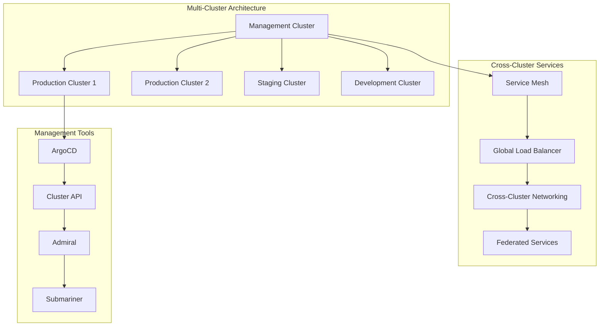

# Session 6: 멀티 클러스터 관리

## 📍 교과과정에서의 위치
이 세션은 **Week 2 > Day 4 > Session 6**으로, 백업 및 재해 복구 이해를 바탕으로 멀티 클러스터 환경의 관리 전략과 워크로드 분산 기법을 심화 분석합니다.

## 학습 목표 (5분)
- **멀티 클러스터 아키텍처** 설계와 **클러스터 페더레이션** 개념
- **크로스 클러스터 네트워킹** 및 **서비스 메시** 통합 전략
- **워크로드 분산** 및 **글로벌 로드 밸런싱** 구현 방법

## 1. 이론: 멀티 클러스터 아키텍처 (20분)

### 멀티 클러스터 설계 패턴



### 멀티 클러스터 사용 사례

```
멀티 클러스터 전략:

지리적 분산:
├── 글로벌 서비스 제공:
│   ├── 지역별 클러스터 배치
│   ├── 지연시간 최소화
│   ├── 데이터 주권 준수
│   ├── 로컬 규제 대응
│   └── 사용자 경험 최적화
├── 재해 복구:
│   ├── 다중 지역 백업
│   ├── 자동 장애조치
│   ├── 데이터 복제 및 동기화
│   ├── 비즈니스 연속성 보장
│   └── RTO/RPO 목표 달성
└── 엣지 컴퓨팅:
    ├── 엣지 위치 클러스터
    ├── 중앙-엣지 하이브리드
    ├── 로컬 데이터 처리
    ├── 대역폭 최적화
    └── 실시간 응답 요구사항

환경 분리:
├── 개발/스테이징/프로덕션:
│   ├── 환경별 독립 클러스터
│   ├── 리소스 격리 및 보안
│   ├── 배포 파이프라인 분리
│   ├── 테스트 환경 안정성
│   └── 프로덕션 영향 최소화
├── 테넌트 분리:
│   ├── 고객별 전용 클러스터
│   ├── 멀티 테넌시 보안 강화
│   ├── 성능 격리 보장
│   ├── 컴플라이언스 요구사항
│   └── SLA 차별화 서비스
└── 워크로드 분리:
    ├── 배치 vs 실시간 워크로드
    ├── CPU vs GPU 집약적 작업
    ├── 보안 수준별 분리
    ├── 리소스 요구사항별 분리
    └── 성능 최적화

조직적 요구사항:
├── 팀별 클러스터:
│   ├── 개발팀별 독립 환경
│   ├── 권한 및 책임 분리
│   ├── 리소스 할당 및 관리
│   ├── 비용 추적 및 청구
│   └── 자율적 운영 지원
├── 벤더 다양화:
│   ├── 멀티 클라우드 전략
│   ├── 벤더 종속성 회피
│   ├── 비용 최적화 기회
│   ├── 서비스 비교 및 선택
│   └── 협상력 강화
└── 규제 준수:
    ├── 데이터 거주 요구사항
    ├── 산업별 규제 대응
    ├── 보안 인증 요구사항
    ├── 감사 및 컴플라이언스
    └── 위험 관리 및 분산
```

### 클러스터 페더레이션 개념

```
Kubernetes 페더레이션:

페더레이션 v2 (Admiral):
├── 서비스 디스커버리:
│   ├── 크로스 클러스터 서비스 발견
│   ├── 글로벌 DNS 관리
│   ├── 서비스 엔드포인트 집계
│   ├── 헬스 체크 및 라우팅
│   └── 장애조치 자동화
├── 트래픽 관리:
│   ├── 글로벌 로드 밸런싱
│   ├── 지역별 트래픽 라우팅
│   ├── 가중치 기반 분산
│   ├── 카나리 배포 지원
│   └── 서킷 브레이커 통합
├── 보안 정책:
│   ├── 크로스 클러스터 mTLS
│   ├── 통합 인증 및 권한 부여
│   ├── 네트워크 정책 동기화
│   ├── 시크릿 관리 및 동기화
│   └── 감사 로그 중앙화
└── 설정 관리:
    ├── 글로벌 설정 배포
    ├── 클러스터별 오버라이드
    ├── 설정 드리프트 감지
    ├── 자동 동기화 및 복구
    └── 버전 관리 및 롤백

Cluster API:
├── 클러스터 생명주기 관리:
│   ├── 선언적 클러스터 정의
│   ├── 자동 프로비저닝
│   ├── 업그레이드 및 패치
│   ├── 스케일링 자동화
│   └── 클러스터 삭제 및 정리
├── 인프라 추상화:
│   ├── 클라우드 제공업체 통합
│   ├── 온프레미스 지원
│   ├── 하이브리드 클라우드
│   ├── 표준화된 API
│   └── 플러그인 아키텍처
├── 운영 자동화:
│   ├── GitOps 통합
│   ├── 모니터링 및 알림
│   ├── 백업 및 복구
│   ├── 보안 정책 적용
│   └── 컴플라이언스 검사
└── 멀티 클러스터 관리:
    ├── 클러스터 인벤토리
    ├── 상태 모니터링
    ├── 리소스 사용률 추적
    ├── 비용 분석 및 최적화
    └── 성능 벤치마킹

Submariner:
├── 네트워크 연결:
│   ├── 클러스터 간 VPN 터널
│   ├── 오버레이 네트워크 구성
│   ├── 네트워크 주소 변환
│   ├── 방화벽 및 보안 그룹 관리
│   └── 네트워크 토폴로지 최적화
├── 서비스 연결:
│   ├── 크로스 클러스터 서비스 노출
│   ├── 서비스 임포트/익스포트
│   ├── 로드 밸런싱 및 장애조치
│   ├── 헬스 체크 및 모니터링
│   └── 서비스 메시 통합
└── 보안 및 암호화:
    ├── IPSec 터널 암호화
    ├── 인증서 기반 인증
    ├── 네트워크 정책 동기화
    ├── 트래픽 격리 및 제어
    └── 감사 로그 및 모니터링
```

## 2. 이론: 크로스 클러스터 네트워킹 (15분)

### 네트워크 연결 패턴

```
멀티 클러스터 네트워킹:

네트워크 연결 모델:
├── 플랫 네트워크:
│   ├── 모든 클러스터가 동일 네트워크
│   ├── 직접적인 Pod 간 통신
│   ├── 간단한 설정 및 관리
│   ├── 네트워크 충돌 위험
│   └── 보안 경계 모호
├── 오버레이 네트워크:
│   ├── VPN 터널을 통한 연결
│   ├── 네트워크 격리 유지
│   ├── 암호화된 통신
│   ├── 성능 오버헤드 존재
│   └── 복잡한 라우팅 설정
├── 서비스 메시 연결:
│   ├── 애플리케이션 레벨 연결
│   ├── 프록시 기반 통신
│   ├── 고급 트래픽 관리
│   ├── 보안 정책 통합
│   └── 관찰가능성 강화
└── API 게이트웨이:
    ├── 중앙집중식 진입점
    ├── 인증 및 권한 부여
    ├── 레이트 리미팅
    ├── 프로토콜 변환
    └── 모니터링 및 분석

서비스 디스커버리:
├── DNS 기반 디스커버리:
│   ├── 글로벌 DNS 네임스페이스
│   ├── 클러스터별 DNS 위임
│   ├── 서비스 레코드 동기화
│   ├── 헬스 체크 통합
│   └── 캐싱 및 성능 최적화
├── 서비스 레지스트리:
│   ├── 중앙집중식 서비스 카탈로그
│   ├── 동적 서비스 등록/해제
│   ├── 메타데이터 및 태그 관리
│   ├── 버전 관리 및 호환성
│   └── API 기반 쿼리 인터페이스
├── 서비스 메시 디스커버리:
│   ├── Envoy 기반 서비스 발견
│   ├── xDS API를 통한 동적 설정
│   ├── 로드 밸런싱 정책 적용
│   ├── 헬스 체크 및 아웃라이어 감지
│   └── 트래픽 라우팅 규칙
└── 하이브리드 접근:
    ├── 다중 디스커버리 메커니즘
    ├── 우선순위 기반 해석
    ├── 폴백 및 장애조치
    ├── 성능 및 가용성 최적화
    └── 점진적 마이그레이션 지원

로드 밸런싱 전략:
├── 글로벌 로드 밸런서:
│   ├── DNS 기반 글로벌 LB
│   ├── Anycast IP 활용
│   ├── 지리적 라우팅
│   ├── 헬스 체크 기반 장애조치
│   └── 성능 기반 라우팅
├── 클러스터 간 로드 밸런싱:
│   ├── 라운드 로빈 분산
│   ├── 가중치 기반 라우팅
│   ├── 지연시간 기반 라우팅
│   ├── 리소스 사용률 기반
│   └── 사용자 정의 메트릭
├── 장애조치 정책:
│   ├── 자동 장애 감지
│   ├── 트래픽 우회 및 재라우팅
│   ├── 부분 장애 처리
│   ├── 복구 후 트래픽 복원
│   └── 카스케이딩 장애 방지
└── 성능 최적화:
    ├── 연결 풀링 및 재사용
    ├── 압축 및 캐싱
    ├── 프로토콜 최적화
    ├── 배치 처리 및 파이프라이닝
    └── 네트워크 경로 최적화
```

## 3. 이론: 워크로드 분산 및 관리 (10분)

### 멀티 클러스터 워크로드 전략

```
워크로드 분산 패턴:

지역별 분산:
├── 지리적 친화성:
│   ├── 사용자 근접성 기반 배치
│   ├── 지연시간 최소화
│   ├── 대역폭 사용량 최적화
│   ├── 로컬 데이터 처리
│   └── 규제 준수 요구사항
├── 데이터 지역성:
│   ├── 데이터 거주 요구사항
│   ├── 개인정보보호 규정 준수
│   ├── 데이터 주권 보장
│   ├── 크로스 보더 데이터 제한
│   └── 로컬 백업 및 아카이빙
└── 비즈니스 연속성:
    ├── 지역별 재해 복구
    ├── 다중 지역 백업
    ├── 자동 장애조치
    ├── 비즈니스 시간대 고려
    └── 지역별 SLA 차별화

리소스 기반 분산:
├── 컴퓨팅 리소스 최적화:
│   ├── CPU 집약적 vs 메모리 집약적
│   ├── GPU 가속 워크로드
│   ├── 고성능 컴퓨팅 (HPC)
│   ├── 배치 처리 vs 실시간 처리
│   └── 스팟 인스턴스 활용
├── 스토리지 요구사항:
│   ├── 고성능 스토리지 (NVMe SSD)
│   ├── 대용량 스토리지 (HDD)
│   ├── 네트워크 스토리지 vs 로컬
│   ├── 백업 및 아카이빙 요구사항
│   └── 데이터 복제 및 동기화
├── 네트워크 요구사항:
│   ├── 고대역폭 네트워크
│   ├── 저지연 네트워크
│   ├── 네트워크 보안 요구사항
│   ├── 외부 연결성 요구사항
│   └── 네트워크 격리 정책
└── 비용 최적화:
    ├── 클라우드 제공업체별 가격 비교
    ├── 예약 인스턴스 활용
    ├── 스팟 인스턴스 혼합 사용
    ├── 리소스 사용률 최적화
    └── 자동 스케일링 정책

워크로드 스케줄링:
├── 멀티 클러스터 스케줄러:
│   ├── 글로벌 리소스 뷰
│   ├── 클러스터 간 로드 밸런싱
│   ├── 제약 조건 기반 배치
│   ├── 우선순위 기반 스케줄링
│   └── 동적 재배치 및 마이그레이션
├── 정책 기반 배치:
│   ├── 어피니티 및 안티어피니티
│   ├── 테인트 및 톨러레이션
│   ├── 노드 셀렉터 및 라벨
│   ├── 토폴로지 분산 제약
│   └── 커스텀 스케줄링 정책
├── 자동 스케일링:
│   ├── 클러스터 간 워크로드 이동
│   ├── 리소스 부족 시 확장
│   ├── 비용 최적화 스케일링
│   ├── 예측적 스케일링
│   └── 하이브리드 클라우드 버스팅
└── 모니터링 및 최적화:
    ├── 워크로드 성능 추적
    ├── 리소스 사용률 분석
    ├── 비용 분석 및 최적화
    ├── SLA 준수 모니터링
    └── 지속적인 최적화 개선
```

## 4. 개념 예시: 멀티 클러스터 구성 (12분)

### Admiral 서비스 메시 구성 예시

```yaml
# Admiral 글로벌 트래픽 정책 (개념 예시)
apiVersion: admiral.io/v1alpha1
kind: GlobalTrafficPolicy
metadata:
  name: webapp-gtp
  namespace: admiral-sync
spec:
  selector:
    identity: webapp
  policy:
  - dns: webapp.global
    lbType: 1  # Round Robin
    target:
    - region: us-west-2
      weight: 50
    - region: eu-west-1
      weight: 30
    - region: ap-southeast-1
      weight: 20

---
# 의존성 관리
apiVersion: admiral.io/v1alpha1
kind: Dependency
metadata:
  name: webapp-dependency
  namespace: admiral-sync
spec:
  source: webapp
  destinations:
  - database
  - cache
  - auth-service
```

### Submariner 네트워크 연결 예시

```yaml
# Submariner Broker 구성 (개념 예시)
apiVersion: submariner.io/v1alpha1
kind: Broker
metadata:
  name: submariner-broker
spec:
  globalnetEnabled: true
  defaultGlobalnetClusterSize: 8192
  globalnetCIDR: "169.254.0.0/16"
  components:
  - service-discovery
  - connectivity

---
# 클러스터 간 서비스 익스포트
apiVersion: multicluster.x-k8s.io/v1alpha1
kind: ServiceExport
metadata:
  name: database-service
  namespace: production
spec: {}

---
# 서비스 임포트
apiVersion: multicluster.x-k8s.io/v1alpha1
kind: ServiceImport
metadata:
  name: database-service
  namespace: production
spec:
  type: ClusterSetIP
  ports:
  - port: 5432
    protocol: TCP
```

### 멀티 클러스터 GitOps 구성 예시

```yaml
# ArgoCD ApplicationSet (개념 예시)
apiVersion: argoproj.io/v1alpha1
kind: ApplicationSet
metadata:
  name: multi-cluster-apps
  namespace: argocd
spec:
  generators:
  - clusters:
      selector:
        matchLabels:
          environment: production
  template:
    metadata:
      name: '{{name}}-webapp'
    spec:
      project: default
      source:
        repoURL: https://github.com/company/k8s-manifests
        targetRevision: HEAD
        path: 'clusters/{{name}}/webapp'
      destination:
        server: '{{server}}'
        namespace: webapp
      syncPolicy:
        automated:
          prune: true
          selfHeal: true
        syncOptions:
        - CreateNamespace=true

---
# 클러스터 등록
apiVersion: v1
kind: Secret
metadata:
  name: cluster-us-west-2
  namespace: argocd
  labels:
    argocd.argoproj.io/secret-type: cluster
    environment: production
    region: us-west-2
type: Opaque
stringData:
  name: us-west-2
  server: https://k8s-us-west-2.company.com
  config: |
    {
      "bearerToken": "...",
      "tlsClientConfig": {
        "insecure": false,
        "caData": "..."
      }
    }
```

### 멀티 클러스터 모니터링 예시

```yaml
# Prometheus 페더레이션 (개념 예시)
apiVersion: v1
kind: ConfigMap
metadata:
  name: prometheus-federation-config
data:
  prometheus.yml: |
    global:
      scrape_interval: 15s
      evaluation_interval: 15s
    
    scrape_configs:
    - job_name: 'federate'
      scrape_interval: 15s
      honor_labels: true
      metrics_path: '/federate'
      params:
        'match[]':
          - '{job=~"kubernetes-.*"}'
          - '{__name__=~"job:.*"}'
      static_configs:
      - targets:
        - 'prometheus-us-west-2.monitoring.svc.cluster.local:9090'
        - 'prometheus-eu-west-1.monitoring.svc.cluster.local:9090'
        - 'prometheus-ap-southeast-1.monitoring.svc.cluster.local:9090'

---
# 글로벌 알림 규칙
apiVersion: monitoring.coreos.com/v1
kind: PrometheusRule
metadata:
  name: multi-cluster-alerts
spec:
  groups:
  - name: multi-cluster.rules
    rules:
    - alert: ClusterDown
      expr: up{job="kubernetes-apiservers"} == 0
      for: 5m
      labels:
        severity: critical
        cluster: "{{ $labels.cluster }}"
      annotations:
        summary: "Kubernetes cluster {{ $labels.cluster }} is down"
        description: "Cluster {{ $labels.cluster }} has been down for more than 5 minutes"
    
    - alert: CrossClusterLatencyHigh
      expr: histogram_quantile(0.99, rate(http_request_duration_seconds_bucket{job="cross-cluster"}[5m])) > 1
      for: 10m
      labels:
        severity: warning
      annotations:
        summary: "High cross-cluster latency detected"
        description: "99th percentile latency is {{ $value }}s"
```

## 5. 토론 및 정리 (8분)

### 핵심 개념 정리
- **멀티 클러스터 아키텍처**를 통한 **확장성과 가용성** 향상
- **크로스 클러스터 네트워킹**과 **서비스 메시** 통합 전략
- **워크로드 분산**을 통한 **성능 최적화**와 **비용 효율성**
- **통합 관리 도구**를 활용한 **운영 복잡성** 해결

### 토론 주제
"글로벌 서비스 제공을 위한 멀티 클러스터 환경에서 복잡성 관리와 운영 효율성을 동시에 달성하는 최적의 전략은 무엇인가?"

## 💡 핵심 키워드
- **멀티 클러스터**: 페더레이션, 지리적 분산, 환경 분리
- **네트워킹**: 크로스 클러스터, 서비스 메시, 글로벌 로드 밸런싱
- **워크로드 분산**: 지역별 배치, 리소스 최적화, 자동 스케일링
- **관리 도구**: Admiral, Submariner, Cluster API, ArgoCD

## 📚 참고 자료
- [Kubernetes 멀티 클러스터](https://kubernetes.io/docs/concepts/cluster-administration/cluster-administration-overview/)
- [Admiral 서비스 메시](https://github.com/istio-ecosystem/admiral)
- [Submariner 네트워킹](https://submariner.io/getting-started/)
