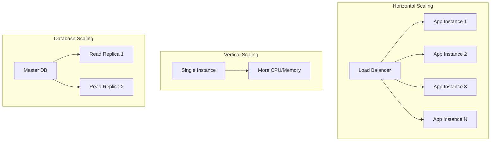

# Session 6: 스케일링과 로드 밸런싱

## 📍 교과과정에서의 위치
이 세션은 **Week 2 > Day 4 > Session 6**으로, Session 5의 환경별 배포를 바탕으로 Docker Compose를 활용한 수평 확장과 로드 밸런싱을 학습합니다.

## 학습 목표 (5분)
- **서비스 스케일링** 및 **부하 분산** 구현
- **로드 밸런서** 설정 및 **트래픽 분산** 전략
- **성능 테스트** 및 **자동 스케일링** 시뮬레이션

## 1. 이론: 스케일링과 로드 밸런싱 (20분)

### 스케일링 전략



### 로드 밸런싱 알고리즘

```
로드 밸런싱 방식:

Round Robin:
├── 순차적으로 요청 분산
├── 간단하고 공평한 분산
├── 서버 성능 차이 미고려
└── 기본 설정으로 많이 사용

Weighted Round Robin:
├── 가중치 기반 분산
├── 서버 성능에 따른 조절
├── 동적 가중치 조절 가능
└── 성능 차이가 큰 환경에 적합

Least Connections:
├── 연결 수가 적은 서버 우선
├── 세션 기반 애플리케이션에 적합
├── 실시간 연결 상태 모니터링
└── 복잡한 구현 필요

IP Hash:
├── 클라이언트 IP 기반 분산
├── 세션 어피니티 보장
├── 캐시 효율성 향상
└── 클라이언트 분포에 의존
```

## 2. 실습: 서비스 스케일링 구현 (15분)

### 스케일링 가능한 아키텍처

```bash
mkdir -p scaling-demo && cd scaling-demo

# 스케일링 Compose 파일
cat > docker-compose.yml << 'EOF'
version: '3.8'

services:
  # Nginx 로드 밸런서
  nginx:
    image: nginx:alpine
    ports:
      - "8080:80"
    volumes:
      - ./nginx.conf:/etc/nginx/nginx.conf:ro
    depends_on:
      - web
    deploy:
      replicas: 1

  # 웹 애플리케이션 (스케일링 대상)
  web:
    build: ./web
    environment:
      - NODE_ENV=production
      - INSTANCE_ID=${HOSTNAME}
    expose:
      - "3000"
    deploy:
      replicas: 3
      resources:
        limits:
          cpus: '0.5'
          memory: 256M
        reservations:
          cpus: '0.25'
          memory: 128M

  # API 서비스 (스케일링 대상)
  api:
    build: ./api
    environment:
      - DB_HOST=postgres
      - REDIS_HOST=redis
    expose:
      - "3001"
    deploy:
      replicas: 2
      resources:
        limits:
          cpus: '1.0'
          memory: 512M

  # 데이터베이스 (마스터-슬레이브)
  postgres-master:
    image: postgres:13
    environment:
      POSTGRES_DB: appdb
      POSTGRES_USER: user
      POSTGRES_PASSWORD: password
      POSTGRES_REPLICATION_USER: replicator
      POSTGRES_REPLICATION_PASSWORD: replicator_password
    volumes:
      - postgres_master_data:/var/lib/postgresql/data
      - ./postgres-master.conf:/etc/postgresql/postgresql.conf
    command: postgres -c config_file=/etc/postgresql/postgresql.conf

  postgres-slave:
    image: postgres:13
    environment:
      POSTGRES_MASTER_SERVICE: postgres-master
      POSTGRES_REPLICATION_USER: replicator
      POSTGRES_REPLICATION_PASSWORD: replicator_password
    volumes:
      - postgres_slave_data:/var/lib/postgresql/data
    deploy:
      replicas: 2
    depends_on:
      - postgres-master

  # Redis 클러스터
  redis-master:
    image: redis:alpine
    command: redis-server --appendonly yes

  redis-slave:
    image: redis:alpine
    command: redis-server --slaveof redis-master 6379 --appendonly yes
    deploy:
      replicas: 2
    depends_on:
      - redis-master

volumes:
  postgres_master_data:
  postgres_slave_data:
EOF

# Nginx 로드 밸런서 설정
cat > nginx.conf << 'EOF'
events {
    worker_connections 1024;
}

http {
    # 웹 애플리케이션 업스트림
    upstream web_backend {
        least_conn;
        server web:3000 weight=1 max_fails=3 fail_timeout=30s;
    }
    
    # API 서비스 업스트림
    upstream api_backend {
        ip_hash;
        server api:3001 weight=1 max_fails=3 fail_timeout=30s;
    }
    
    # 헬스체크 설정
    server {
        listen 80;
        
        # 메인 웹 애플리케이션
        location / {
            proxy_pass http://web_backend;
            proxy_set_header Host $host;
            proxy_set_header X-Real-IP $remote_addr;
            proxy_set_header X-Forwarded-For $proxy_add_x_forwarded_for;
            
            # 헬스체크
            proxy_next_upstream error timeout invalid_header http_500 http_502 http_503;
            proxy_connect_timeout 5s;
            proxy_send_timeout 10s;
            proxy_read_timeout 10s;
        }
        
        # API 엔드포인트
        location /api/ {
            proxy_pass http://api_backend/;
            proxy_set_header Host $host;
            proxy_set_header X-Real-IP $remote_addr;
            proxy_set_header X-Forwarded-For $proxy_add_x_forwarded_for;
        }
        
        # Nginx 상태 페이지
        location /nginx_status {
            stub_status on;
            access_log off;
            allow 127.0.0.1;
            allow 172.0.0.0/8;
            deny all;
        }
    }
}
EOF

# 웹 애플리케이션
mkdir -p web
cat > web/package.json << 'EOF'
{
  "name": "scalable-web",
  "dependencies": {
    "express": "^4.18.2",
    "os": "^0.1.2"
  }
}
EOF

cat > web/server.js << 'EOF'
const express = require('express');
const os = require('os');
const app = express();

const instanceId = process.env.INSTANCE_ID || os.hostname();
const startTime = new Date();

app.get('/', (req, res) => {
  res.json({
    message: 'Scalable Web Application',
    instance: instanceId,
    hostname: os.hostname(),
    uptime: process.uptime(),
    startTime: startTime.toISOString(),
    timestamp: new Date().toISOString()
  });
});

app.get('/health', (req, res) => {
  res.json({
    status: 'healthy',
    instance: instanceId,
    memory: process.memoryUsage(),
    cpu: process.cpuUsage()
  });
});

// CPU 집약적 작업 (부하 테스트용)
app.get('/cpu-intensive', (req, res) => {
  const start = Date.now();
  let result = 0;
  
  // 1초간 CPU 집약적 작업
  while (Date.now() - start < 1000) {
    result += Math.random();
  }
  
  res.json({
    instance: instanceId,
    result: result,
    duration: Date.now() - start
  });
});

app.listen(3000, '0.0.0.0', () => {
  console.log(`Web server ${instanceId} running on port 3000`);
});
EOF

cat > web/Dockerfile << 'EOF'
FROM node:alpine
WORKDIR /app
COPY package*.json ./
RUN npm install
COPY . .
EXPOSE 3000
CMD ["node", "server.js"]
EOF

# API 서비스 (유사한 구조)
mkdir -p api
cp -r web/* api/
sed -i 's/3000/3001/g' api/server.js
sed -i 's/Web server/API server/g' api/server.js
sed -i 's/scalable-web/scalable-api/g' api/package.json
```

### 동적 스케일링 구현

```bash
# 스케일링 스크립트
cat > scale.sh << 'EOF'
#!/bin/bash

SERVICE=${1:-web}
REPLICAS=${2:-3}

if [ -z "$SERVICE" ] || [ -z "$REPLICAS" ]; then
    echo "Usage: $0 <service> <replicas>"
    echo "Example: $0 web 5"
    exit 1
fi

echo "🔄 Scaling $SERVICE to $REPLICAS replicas..."

# Docker Compose 스케일링
docker-compose up -d --scale $SERVICE=$REPLICAS

# 스케일링 결과 확인
echo "📊 Current service status:"
docker-compose ps $SERVICE

# 로드 밸런서 설정 업데이트 (동적 업스트림)
if [ "$SERVICE" = "web" ] || [ "$SERVICE" = "api" ]; then
    echo "🔄 Updating load balancer configuration..."
    docker-compose exec nginx nginx -s reload
fi

echo "✅ Scaling completed"
EOF

chmod +x scale.sh

# 자동 스케일링 시뮬레이션
cat > auto-scale.sh << 'EOF'
#!/bin/bash

SERVICE=${1:-web}
MIN_REPLICAS=${2:-2}
MAX_REPLICAS=${3:-10}
CPU_THRESHOLD=${4:-80}

echo "🤖 Starting auto-scaling for $SERVICE"
echo "Min: $MIN_REPLICAS, Max: $MAX_REPLICAS, CPU Threshold: $CPU_THRESHOLD%"

while true; do
    # 현재 CPU 사용률 확인 (시뮬레이션)
    current_cpu=$(docker stats --no-stream --format "table {{.CPUPerc}}" | grep $SERVICE | head -1 | sed 's/%//')
    
    if [ -z "$current_cpu" ]; then
        current_cpu=0
    fi
    
    # 현재 레플리카 수 확인
    current_replicas=$(docker-compose ps -q $SERVICE | wc -l)
    
    echo "$(date): CPU: ${current_cpu}%, Replicas: $current_replicas"
    
    # 스케일 업 조건
    if (( $(echo "$current_cpu > $CPU_THRESHOLD" | bc -l) )) && [ $current_replicas -lt $MAX_REPLICAS ]; then
        new_replicas=$((current_replicas + 1))
        echo "🔺 Scaling UP $SERVICE to $new_replicas replicas (CPU: ${current_cpu}%)"
        ./scale.sh $SERVICE $new_replicas
    
    # 스케일 다운 조건
    elif (( $(echo "$current_cpu < 30" | bc -l) )) && [ $current_replicas -gt $MIN_REPLICAS ]; then
        new_replicas=$((current_replicas - 1))
        echo "🔻 Scaling DOWN $SERVICE to $new_replicas replicas (CPU: ${current_cpu}%)"
        ./scale.sh $SERVICE $new_replicas
    fi
    
    sleep 30
done
EOF

chmod +x auto-scale.sh
```

## 3. 실습: 성능 테스트 및 부하 분산 (15분)

### 부하 테스트 도구

```bash
# 부하 테스트 스크립트
cat > load-test.sh << 'EOF'
#!/bin/bash

TARGET_URL=${1:-http://localhost:8080}
CONCURRENT_USERS=${2:-10}
DURATION=${3:-60}

echo "🚀 Starting load test..."
echo "Target: $TARGET_URL"
echo "Concurrent Users: $CONCURRENT_USERS"
echo "Duration: ${DURATION}s"

# Apache Bench를 사용한 부하 테스트
if command -v ab >/dev/null 2>&1; then
    echo "Using Apache Bench (ab)..."
    ab -n $((CONCURRENT_USERS * DURATION)) -c $CONCURRENT_USERS $TARGET_URL/
else
    echo "Apache Bench not found, using curl-based load test..."
    
    # Curl 기반 부하 테스트
    for i in $(seq 1 $CONCURRENT_USERS); do
        (
            for j in $(seq 1 $DURATION); do
                curl -s $TARGET_URL/ > /dev/null
                sleep 1
            done
        ) &
    done
    
    wait
fi

echo "✅ Load test completed"
EOF

chmod +x load-test.sh

# 실시간 모니터링 스크립트
cat > monitor.sh << 'EOF'
#!/bin/bash

echo "📊 Real-time monitoring started (Press Ctrl+C to stop)"

while true; do
    clear
    echo "=== Docker Compose Services Status ==="
    docker-compose ps --format "table {{.Name}}\t{{.Status}}\t{{.Ports}}"
    
    echo ""
    echo "=== Resource Usage ==="
    docker stats --no-stream --format "table {{.Name}}\t{{.CPUPerc}}\t{{.MemUsage}}\t{{.NetIO}}"
    
    echo ""
    echo "=== Load Balancer Status ==="
    curl -s http://localhost:8080/nginx_status 2>/dev/null || echo "Nginx status not available"
    
    echo ""
    echo "=== Service Response Test ==="
    for i in {1..5}; do
        response=$(curl -s http://localhost:8080/ | jq -r '.instance' 2>/dev/null || echo "Error")
        echo "Request $i: Instance $response"
    done
    
    sleep 5
done
EOF

chmod +x monitor.sh

# 성능 벤치마크 스크립트
cat > benchmark.sh << 'EOF'
#!/bin/bash

echo "🏁 Performance Benchmark Suite"

# 1. 단일 인스턴스 성능
echo "1. Single Instance Performance"
./scale.sh web 1
sleep 10
./load-test.sh http://localhost:8080 5 30

# 2. 다중 인스턴스 성능
echo "2. Multiple Instance Performance"
./scale.sh web 3
sleep 10
./load-test.sh http://localhost:8080 15 30

# 3. 고부하 테스트
echo "3. High Load Test"
./scale.sh web 5
sleep 10
./load-test.sh http://localhost:8080 50 60

# 4. CPU 집약적 작업 테스트
echo "4. CPU Intensive Workload"
for i in {1..10}; do
    curl -s http://localhost:8080/cpu-intensive > /dev/null &
done
wait

echo "✅ Benchmark completed"
EOF

chmod +x benchmark.sh
```

### 로드 밸런싱 검증

```bash
# 로드 밸런싱 검증 스크립트
cat > verify-load-balancing.sh << 'EOF'
#!/bin/bash

echo "🔍 Verifying Load Balancing"

# 1. 인스턴스 분산 테스트
echo "1. Instance Distribution Test"
declare -A instance_count

for i in {1..100}; do
    instance=$(curl -s http://localhost:8080/ | jq -r '.instance' 2>/dev/null)
    if [ "$instance" != "null" ] && [ -n "$instance" ]; then
        ((instance_count[$instance]++))
    fi
done

echo "Request Distribution:"
for instance in "${!instance_count[@]}"; do
    echo "  $instance: ${instance_count[$instance]} requests"
done

# 2. 헬스체크 기반 라우팅 테스트
echo ""
echo "2. Health Check Routing Test"

# 하나의 인스턴스를 일시적으로 중지
web_containers=($(docker-compose ps -q web))
if [ ${#web_containers[@]} -gt 1 ]; then
    echo "Stopping one web instance..."
    docker stop ${web_containers[0]}
    
    sleep 5
    
    echo "Testing routing with reduced instances:"
    for i in {1..10}; do
        response=$(curl -s http://localhost:8080/ | jq -r '.instance' 2>/dev/null || echo "Error")
        echo "Request $i: $response"
    done
    
    # 인스턴스 복구
    echo "Restoring stopped instance..."
    docker start ${web_containers[0]}
fi

# 3. 세션 어피니티 테스트 (IP Hash)
echo ""
echo "3. Session Affinity Test (API endpoints)"
for i in {1..10}; do
    response=$(curl -s http://localhost:8080/api/health | jq -r '.instance' 2>/dev/null || echo "Error")
    echo "API Request $i: $response"
done

echo "✅ Load balancing verification completed"
EOF

chmod +x verify-load-balancing.sh

# 장애 복구 테스트
cat > failover-test.sh << 'EOF'
#!/bin/bash

echo "🚨 Failover Test"

# 현재 실행 중인 웹 컨테이너 확인
web_containers=($(docker-compose ps -q web))
echo "Active web containers: ${#web_containers[@]}"

if [ ${#web_containers[@]} -lt 2 ]; then
    echo "Need at least 2 web instances for failover test"
    ./scale.sh web 3
    sleep 10
    web_containers=($(docker-compose ps -q web))
fi

# 연속 요청 시작 (백그라운드)
echo "Starting continuous requests..."
(
    for i in {1..60}; do
        response=$(curl -s http://localhost:8080/ | jq -r '.instance' 2>/dev/null || echo "FAILED")
        echo "$(date '+%H:%M:%S') - Response from: $response"
        sleep 1
    done
) &
REQUEST_PID=$!

# 10초 후 인스턴스 중지
sleep 10
echo "Stopping web instance: ${web_containers[0]}"
docker stop ${web_containers[0]}

# 20초 후 인스턴스 복구
sleep 20
echo "Restarting web instance: ${web_containers[0]}"
docker start ${web_containers[0]}

# 요청 프로세스 종료 대기
wait $REQUEST_PID

echo "✅ Failover test completed"
EOF

chmod +x failover-test.sh
```

## 4. 실습: 고급 스케일링 전략 (10분)

### 메트릭 기반 스케일링

```bash
# 메트릭 수집 및 스케일링
cat > metric-based-scaling.sh << 'EOF'
#!/bin/bash

echo "📈 Metric-based Auto Scaling"

# 메트릭 수집 함수
collect_metrics() {
    local service=$1
    
    # CPU 사용률
    cpu_usage=$(docker stats --no-stream --format "{{.CPUPerc}}" | grep $service | head -1 | sed 's/%//' || echo "0")
    
    # 메모리 사용률
    mem_usage=$(docker stats --no-stream --format "{{.MemPerc}}" | grep $service | head -1 | sed 's/%//' || echo "0")
    
    # 응답 시간 측정
    response_time=$(curl -w "%{time_total}" -s -o /dev/null http://localhost:8080/health || echo "999")
    
    # 현재 레플리카 수
    current_replicas=$(docker-compose ps -q $service | wc -l)
    
    echo "$cpu_usage,$mem_usage,$response_time,$current_replicas"
}

# 스케일링 결정 함수
make_scaling_decision() {
    local metrics=$1
    IFS=',' read -r cpu mem response_time replicas <<< "$metrics"
    
    local scale_action="none"
    local new_replicas=$replicas
    
    # 스케일 업 조건
    if (( $(echo "$cpu > 70" | bc -l) )) || (( $(echo "$response_time > 2" | bc -l) )); then
        if [ $replicas -lt 10 ]; then
            scale_action="up"
            new_replicas=$((replicas + 1))
        fi
    
    # 스케일 다운 조건
    elif (( $(echo "$cpu < 20" | bc -l) )) && (( $(echo "$response_time < 0.5" | bc -l) )); then
        if [ $replicas -gt 2 ]; then
            scale_action="down"
            new_replicas=$((replicas - 1))
        fi
    fi
    
    echo "$scale_action,$new_replicas"
}

# 메인 루프
while true; do
    timestamp=$(date '+%Y-%m-%d %H:%M:%S')
    metrics=$(collect_metrics web)
    IFS=',' read -r cpu mem response_time replicas <<< "$metrics"
    
    echo "[$timestamp] CPU: ${cpu}%, Memory: ${mem}%, Response: ${response_time}s, Replicas: $replicas"
    
    # 스케일링 결정
    decision=$(make_scaling_decision "$metrics")
    IFS=',' read -r action new_replicas <<< "$decision"
    
    if [ "$action" != "none" ]; then
        echo "🔄 Scaling $action: $replicas -> $new_replicas"
        ./scale.sh web $new_replicas
        
        # 스케일링 후 안정화 대기
        sleep 30
    fi
    
    sleep 10
done
EOF

chmod +x metric-based-scaling.sh

# 예측 기반 스케일링 시뮬레이션
cat > predictive-scaling.sh << 'EOF'
#!/bin/bash

echo "🔮 Predictive Scaling Simulation"

# 시간대별 트래픽 패턴 시뮬레이션
get_expected_load() {
    local hour=$(date +%H)
    
    case $hour in
        06|07|08) echo "high" ;;      # 출근 시간
        12|13) echo "high" ;;         # 점심 시간
        18|19|20) echo "high" ;;      # 퇴근 시간
        21|22|23) echo "medium" ;;    # 저녁 시간
        00|01|02|03|04|05) echo "low" ;; # 새벽 시간
        *) echo "medium" ;;           # 기타 시간
    esac
}

# 예측 기반 스케일링
while true; do
    current_hour=$(date +%H)
    expected_load=$(get_expected_load)
    current_replicas=$(docker-compose ps -q web | wc -l)
    
    case $expected_load in
        "high")
            target_replicas=5
            ;;
        "medium")
            target_replicas=3
            ;;
        "low")
            target_replicas=2
            ;;
    esac
    
    echo "$(date): Hour $current_hour, Expected load: $expected_load, Target: $target_replicas, Current: $current_replicas"
    
    if [ $current_replicas -ne $target_replicas ]; then
        echo "🔄 Predictive scaling: $current_replicas -> $target_replicas"
        ./scale.sh web $target_replicas
    fi
    
    # 1시간마다 체크 (데모에서는 1분)
    sleep 60
done
EOF

chmod +x predictive-scaling.sh
```

## 5. Q&A 및 정리 (5분)

### 스케일링 성능 검증

```bash
# 전체 시스템 시작
docker-compose up -d

# 스케일링 테스트 실행
echo "=== 스케일링 및 로드 밸런싱 테스트 ==="

# 1. 기본 스케일링 테스트
./scale.sh web 3
sleep 10

# 2. 로드 밸런싱 검증
./verify-load-balancing.sh

# 3. 성능 벤치마크 (간단 버전)
echo "간단한 성능 테스트..."
for i in {1..20}; do
    curl -s http://localhost:8080/ | jq -r '.instance'
done | sort | uniq -c

# 정리 및 요약
cat > session6-summary.md << 'EOF'
# Session 6 요약: 스케일링과 로드 밸런싱

## 구현한 스케일링 아키텍처
```
Nginx Load Balancer
├── Web Service (Scalable: 1-10 replicas)
├── API Service (Scalable: 1-5 replicas)
├── Database (Master-Slave replication)
└── Redis (Master-Slave cluster)
```

## 로드 밸런싱 전략
1. **Round Robin**: 기본 순차 분산
2. **Least Connections**: 연결 수 기반 분산
3. **IP Hash**: 세션 어피니티 보장
4. **Weighted**: 서버 성능 기반 가중치

## 스케일링 방법
### 수동 스케일링
```bash
docker-compose up -d --scale web=5
./scale.sh web 5
```

### 자동 스케일링
- **메트릭 기반**: CPU, 메모리, 응답시간
- **예측 기반**: 시간대별 트래픽 패턴
- **임계값 기반**: 상한/하한 임계값 설정

## 성능 최적화 기법
1. **리소스 제한**: CPU/메모리 제한 설정
2. **헬스체크**: 장애 인스턴스 자동 제외
3. **연결 풀링**: 데이터베이스 연결 최적화
4. **캐싱**: Redis를 통한 응답 캐싱

## 장애 복구 전략
- **Failover**: 장애 인스턴스 자동 우회
- **Circuit Breaker**: 연쇄 장애 방지
- **Graceful Shutdown**: 안전한 인스턴스 종료
- **Rolling Update**: 무중단 업데이트

## 모니터링 메트릭
- **응답 시간**: 평균/최대 응답 시간
- **처리량**: 초당 요청 수 (RPS)
- **에러율**: 실패한 요청 비율
- **리소스 사용률**: CPU/메모리 사용량
EOF

echo "Session 6 완료! 요약: session6-summary.md"
```

## 💡 핵심 키워드
- **수평 확장**: 인스턴스 수 증가를 통한 스케일링
- **로드 밸런싱**: Round Robin, Least Connections, IP Hash
- **자동 스케일링**: 메트릭 기반, 예측 기반 스케일링
- **장애 복구**: Failover, Circuit Breaker, Health Check

## 📚 참고 자료
- [Docker Compose Scale](https://docs.docker.com/compose/reference/scale/)
- [Nginx Load Balancing](https://nginx.org/en/docs/http/load_balancing.html)
- [Container Orchestration](https://kubernetes.io/docs/concepts/overview/)

## 🔧 실습 체크리스트
- [ ] 서비스 스케일링 구현 및 테스트
- [ ] Nginx 로드 밸런서 설정
- [ ] 부하 테스트 및 성능 측정
- [ ] 자동 스케일링 시뮬레이션
- [ ] 장애 복구 및 Failover 테스트
