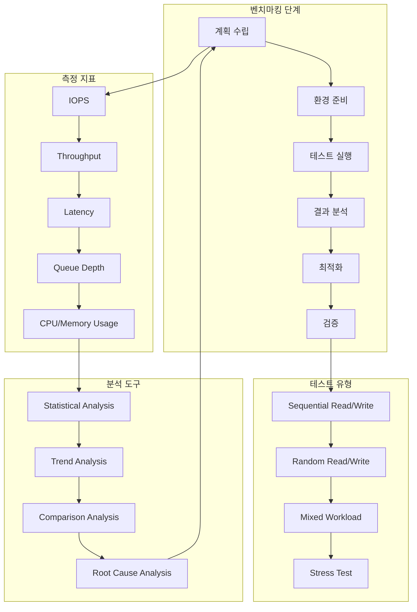
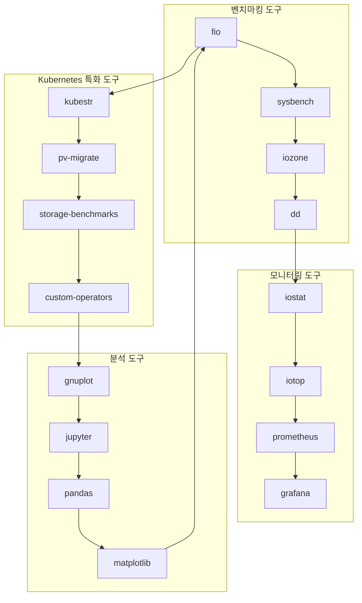
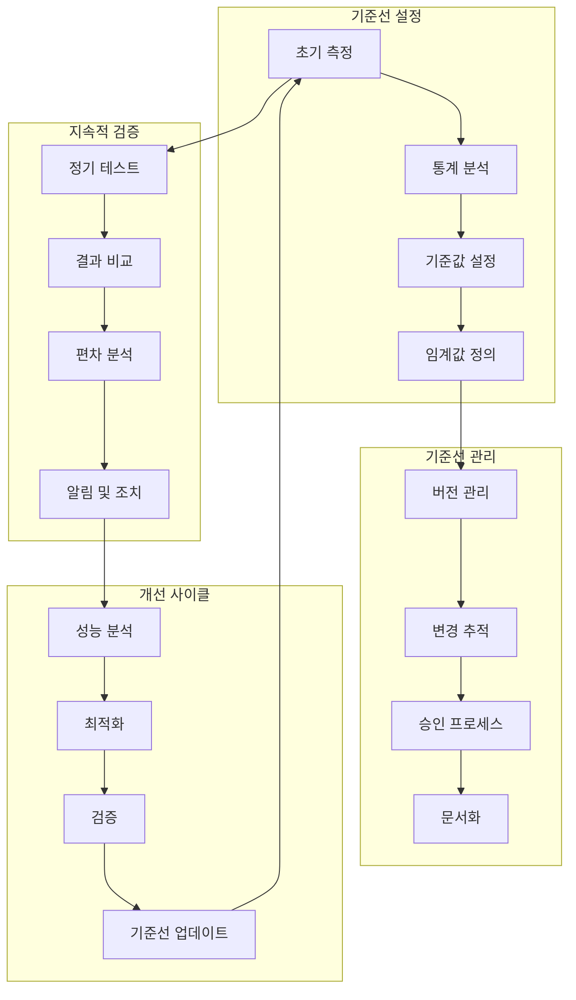
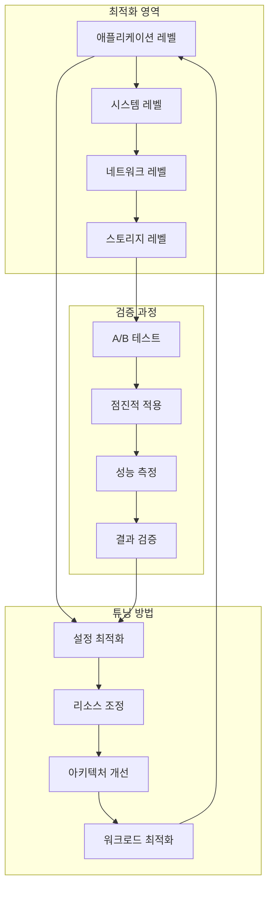

# Session 7: 스토리지 성능 벤치마킹과 테스트

## 📍 교과과정에서의 위치
이 세션은 **Week 2 > Day 4 > Session 7**으로, Session 1-6에서 학습한 스토리지 기초, 모니터링, 트러블슈팅을 바탕으로 스토리지 성능을 체계적으로 측정하고 검증하는 방법을 학습합니다.

## 학습 목표 (5분)
- **성능 벤치마킹** 방법론과 **측정 지표** 완전 이해
- **테스트 도구**와 **시나리오** 설계 및 실행 학습
- **성능 기준선** 설정과 **지속적 검증** 체계 구축
- **성능 최적화** 전략과 **튜닝** 방법 파악

## 1. 성능 벤치마킹 방법론과 측정 지표 (15분)

### 성능 벤치마킹 프레임워크


### 성능 벤치마킹 상세 분석
```
Kubernetes 스토리지 성능 벤치마킹:

벤치마킹 방법론:
├── 계획 수립 단계:
│   ├── 목표 설정:
│   │   ├── 성능 요구사항 정의
│   │   ├── 측정 지표 선정
│   │   ├── 테스트 범위 결정
│   │   ├── 성공 기준 설정
│   │   ├── 일정 및 리소스 계획
│   │   └── 위험 요소 식별
│   ├── 환경 분석:
│   │   ├── 현재 인프라 상태
│   │   ├── 워크로드 특성 분석
│   │   ├── 병목 지점 예상
│   │   ├── 테스트 환경 요구사항
│   │   ├── 기준선 데이터 수집
│   │   └── 비교 대상 선정
│   └── 테스트 설계:
│       ├── 테스트 시나리오 작성
│       ├── 테스트 데이터 준비
│       ├── 측정 방법 정의
│       ├── 도구 선정 및 설정
│       ├── 자동화 스크립트 준비
│       └── 결과 분석 방법 정의

핵심 성능 지표:
├── IOPS (Input/Output Operations Per Second):
│   ├── 정의 및 중요성:
│   │   ├── 초당 처리 가능한 I/O 작업 수
│   │   ├── 데이터베이스 성능의 핵심 지표
│   │   ├── 트랜잭션 처리 능력 측정
│   │   ├── 동시 사용자 지원 능력
│   │   ├── 응답성 평가 기준
│   │   └── 확장성 계획 기초 데이터
│   ├── 측정 방법:
│   │   ├── 순차 읽기 IOPS
│   │   ├── 순차 쓰기 IOPS
│   │   ├── 랜덤 읽기 IOPS
│   │   ├── 랜덤 쓰기 IOPS
│   │   ├── 혼합 워크로드 IOPS
│   │   └── 다양한 블록 크기별 IOPS
│   └── 영향 요인:
│       ├── 스토리지 백엔드 성능
│       ├── 네트워크 지연 시간
│       ├── 큐 깊이 설정
│       ├── 파일시스템 유형
│       ├── 캐시 설정
│       └── 동시 접근 수준
├── 처리량 (Throughput):
│   ├── 정의 및 측정:
│   │   ├── 단위 시간당 전송 데이터량 (MB/s, GB/s)
│   │   ├── 대용량 파일 처리 성능
│   │   ├── 백업 및 복구 성능
│   │   ├── 스트리밍 데이터 처리
│   │   ├── 배치 작업 성능
│   │   └── 네트워크 대역폭 활용률
│   ├── 측정 시나리오:
│   │   ├── 대용량 순차 읽기
│   │   ├── 대용량 순차 쓰기
│   │   ├── 다중 스트림 처리
│   │   ├── 압축 데이터 처리
│   │   ├── 암호화 데이터 처리
│   │   └── 네트워크 스토리지 처리량
│   └── 최적화 요소:
│       ├── 블록 크기 최적화
│       ├── 큐 깊이 조정
│       ├── 병렬 처리 수준
│       ├── 네트워크 대역폭
│       ├── 캐시 활용
│       └── 압축 및 중복 제거
├── 지연 시간 (Latency):
│   ├── 지연 시간 유형:
│   │   ├── 평균 지연 시간
│   │   ├── 최소/최대 지연 시간
│   │   ├── 95/99 백분위수 지연 시간
│   │   ├── 테일 레이턴시
│   │   ├── 지연 시간 분포
│   │   └── 지연 시간 변동성
│   ├── 측정 방법:
│   │   ├── 단일 I/O 지연 시간
│   │   ├── 동시 I/O 지연 시간
│   │   ├── 다양한 부하 수준별 측정
│   │   ├── 시간대별 지연 시간 변화
│   │   ├── 지역별 지연 시간 차이
│   │   └── 애플리케이션 수준 지연 시간
│   └── 지연 시간 구성 요소:
│       ├── 스토리지 백엔드 지연
│       ├── 네트워크 전송 지연
│       ├── 큐잉 지연
│       ├── 처리 지연
│       ├── 캐시 미스 지연
│       └── 동기화 지연
└── 리소스 사용률:
    ├── CPU 사용률:
    │   ├── I/O 처리 CPU 사용률
    │   ├── 암호화/복호화 CPU 사용률
    │   ├── 압축/압축 해제 CPU 사용률
    │   ├── 네트워크 처리 CPU 사용률
    │   ├── 시스템 호출 오버헤드
    │   └── 컨텍스트 스위치 비용
    ├── 메모리 사용률:
    │   ├── 버퍼 캐시 사용률
    │   ├── 페이지 캐시 사용률
    │   ├── 애플리케이션 메모리 사용률
    │   ├── 메모리 대역폭 사용률
    │   ├── 스왑 사용률
    │   └── 메모리 누수 탐지
    └── 네트워크 사용률:
        ├── 네트워크 대역폭 사용률
        ├── 패킷 처리율
        ├── 연결 수 및 상태
        ├── 네트워크 오류율
        ├── 재전송률
        └── 네트워크 지연 시간
```

## 2. 테스트 도구와 시나리오 설계 (12분)

### 테스트 도구 생태계



### 테스트 도구 상세 분석
```
스토리지 성능 테스트 도구:

범용 벤치마킹 도구:
├── fio (Flexible I/O Tester):
│   ├── 특징 및 장점:
│   │   ├── 가장 포괄적인 I/O 벤치마킹 도구
│   │   ├── 다양한 I/O 패턴 지원
│   │   ├── 정교한 설정 옵션
│   │   ├── 상세한 통계 정보 제공
│   │   ├── 스크립트 자동화 지원
│   │   └── 크로스 플랫폼 지원
│   ├── 주요 기능:
│   │   ├── 순차/랜덤 I/O 테스트
│   │   ├── 읽기/쓰기/혼합 워크로드
│   │   ├── 다양한 블록 크기 테스트
│   │   ├── 큐 깊이 조정
│   │   ├── 다중 스레드/프로세스 지원
│   │   └── 실시간 모니터링
│   └── 사용 시나리오:
│       ├── 기본 성능 측정
│       ├── 워크로드 시뮬레이션
│       ├── 성능 한계 테스트
│       ├── 비교 벤치마킹
│       ├── 회귀 테스트
│       └── 성능 튜닝 검증
├── sysbench:
│   ├── 특징:
│   │   ├── 시스템 전반적 성능 측정
│   │   ├── CPU, 메모리, I/O 통합 테스트
│   │   ├── 데이터베이스 벤치마킹 특화
│   │   ├── 간단한 사용법
│   │   ├── 스크립트 기반 확장
│   │   └── 다중 스레드 지원
│   ├── 테스트 유형:
│   │   ├── 파일 I/O 테스트
│   │   ├── CPU 성능 테스트
│   │   ├── 메모리 성능 테스트
│   │   ├── 스레드 성능 테스트
│   │   ├── 뮤텍스 성능 테스트
│   │   └── 데이터베이스 OLTP 테스트
│   └── 활용 방안:
│       ├── 시스템 전체 성능 평가
│       ├── 하드웨어 성능 비교
│       ├── 설정 변경 영향 측정
│       ├── 성능 회귀 탐지
│       ├── 용량 계획 데이터 수집
│       └── SLA 검증
├── iozone:
│   ├── 특징:
│   │   ├── 파일시스템 성능 특화
│   │   ├── 다양한 파일 크기 테스트
│   │   ├── 다양한 레코드 크기 테스트
│   │   ├── 자동화된 테스트 매트릭스
│   │   ├── 그래프 생성 기능
│   │   └── 크로스 플랫폼 지원
│   ├── 테스트 패턴:
│   │   ├── 순차 쓰기/읽기
│   │   ├── 랜덤 쓰기/읽기
│   │   ├── 역방향 읽기
│   │   ├── 스트라이드 읽기
│   │   ├── 파일 재쓰기
│   │   └── 파일 재읽기
│   └── 결과 분석:
│       ├── 성능 매트릭스 생성
│       ├── 3D 그래프 시각화
│       ├── 최적 블록 크기 식별
│       ├── 파일시스템 비교
│       ├── 성능 트렌드 분석
│       └── 병목 지점 식별
└── dd (Data Duplicator):
    ├── 기본 사용법:
    │   ├── 간단한 순차 I/O 테스트
    │   ├── 처리량 측정
    │   ├── 기본적인 성능 확인
    │   ├── 빠른 검증 테스트
    │   ├── 스크립트 통합 용이
    │   └── 모든 Unix 시스템 지원
    ├── 제한사항:
    │   ├── 단순한 테스트만 가능
    │   ├── 상세한 통계 부족
    │   ├── 랜덤 I/O 테스트 불가
    │   ├── 동시성 테스트 제한
    │   ├── 고급 설정 옵션 부족
    │   └── 정확도 한계
    └── 활용 시나리오:
        ├── 빠른 성능 확인
        ├── 기본 처리량 측정
        ├── 스크립트 기반 자동화
        ├── 간단한 비교 테스트
        ├── 문제 상황 재현
        └── 교육 및 데모 목적

Kubernetes 특화 도구:
├── kubestr:
│   ├── 기능 및 특징:
│   │   ├── Kubernetes 스토리지 전용 도구
│   │   ├── CSI 드라이버 테스트
│   │   ├── 스토리지 클래스 검증
│   │   ├── 백업/복구 테스트
│   │   ├── 스냅샷 기능 테스트
│   │   └── 클러스터 통합 테스트
│   ├── 테스트 유형:
│   │   ├── 기본 프로비저닝 테스트
│   │   ├── 성능 벤치마킹
│   │   ├── 볼륨 확장 테스트
│   │   ├── 스냅샷 생성/복원 테스트
│   │   ├── 클론 기능 테스트
│   │   └── 마이그레이션 테스트
│   └── 결과 분석:
│       ├── 자동화된 리포트 생성
│       ├── 성능 메트릭 수집
│       ├── 호환성 검증 결과
│       ├── 문제점 식별 및 권장사항
│       ├── 비교 분석 데이터
│       └── 트렌드 분석 지원
├── 커스텀 Kubernetes 오퍼레이터:
│   ├── 설계 원칙:
│   │   ├── 클러스터 네이티브 통합
│   │   ├── 자동화된 테스트 실행
│   │   ├── 지속적 모니터링
│   │   ├── 결과 저장 및 분석
│   │   ├── 알림 및 리포팅
│   │   └── 확장 가능한 아키텍처
│   ├── 구현 기능:
│   │   ├── 정기적 성능 테스트
│   │   ├── 회귀 테스트 자동화
│   │   ├── 성능 기준선 관리
│   │   ├── 이상 탐지 및 알림
│   │   ├── 테스트 결과 대시보드
│   │   └── API 기반 통합
│   └── 운영 이점:
│       ├── 운영 부담 감소
│       ├── 일관된 테스트 실행
│       ├── 자동화된 문제 탐지
│       ├── 지속적 성능 검증
│       ├── 데이터 기반 의사결정
│       └── 프로액티브 최적화
└── 통합 테스트 프레임워크:
    ├── 테스트 오케스트레이션:
    │   ├── 다단계 테스트 시나리오
    │   ├── 의존성 관리
    │   ├── 병렬 테스트 실행
    │   ├── 조건부 테스트 실행
    │   ├── 실패 시 롤백
    │   └── 리소스 정리 자동화
    ├── 결과 통합 분석:
    │   ├── 다중 도구 결과 통합
    │   ├── 통계적 분석
    │   ├── 트렌드 분석
    │   ├── 비교 분석
    │   ├── 이상 탐지
    │   └── 예측 분석
    └── 리포팅 및 시각화:
        ├── 자동화된 리포트 생성
        ├── 대시보드 통합
        ├── 알림 시스템 연동
        ├── 히스토리컬 데이터 관리
        ├── 성능 트렌드 시각화
        └── 경영진 리포트 생성
```

## 3. 성능 기준선 설정과 지속적 검증 체계 (10분)

### 성능 기준선 관리 프레임워크


### 성능 기준선 상세 분석
```
성능 기준선 설정 및 관리:

기준선 설정 방법론:
├── 초기 성능 측정:
│   ├── 측정 환경 표준화:
│   │   ├── 동일한 하드웨어 구성
│   │   ├── 동일한 소프트웨어 버전
│   │   ├── 동일한 네트워크 조건
│   │   ├── 동일한 부하 조건
│   │   ├── 동일한 시간대 측정
│   │   └── 외부 요인 최소화
│   ├── 다중 측정 및 통계 처리:
│   │   ├── 최소 10회 이상 반복 측정
│   │   ├── 이상치 제거 (Outlier Detection)
│   │   ├── 평균, 중앙값, 표준편차 계산
│   │   ├── 95/99 백분위수 계산
│   │   ├── 신뢰구간 설정
│   │   └── 변동계수 분석
│   └── 워크로드별 기준선:
│       ├── OLTP 워크로드 기준선
│       ├── OLAP 워크로드 기준선
│       ├── 배치 처리 기준선
│       ├── 스트리밍 처리 기준선
│       ├── 백업/복구 기준선
│       └── 혼합 워크로드 기준선
├── 기준값 및 임계값 설정:
│   ├── 성능 기준값 설정:
│   │   ├── 목표 성능 (Target Performance)
│   │   ├── 최소 허용 성능 (Minimum Acceptable)
│   │   ├── 최대 기대 성능 (Maximum Expected)
│   │   ├── 경고 임계값 (Warning Threshold)
│   │   ├── 위험 임계값 (Critical Threshold)
│   │   └── 비즈니스 요구사항 반영
│   ├── 임계값 계산 방법:
│   │   ├── 통계적 방법 (평균 ± 2σ)
│   │   ├── 백분위수 기반 (95th percentile)
│   │   ├── 비즈니스 요구사항 기반
│   │   ├── SLA 기반 설정
│   │   ├── 과거 데이터 기반
│   │   └── 업계 표준 참조
│   └── 동적 임계값:
│       ├── 시간대별 임계값 조정
│       ├── 계절성 패턴 반영
│       ├── 워크로드 변화 적응
│       ├── 머신러닝 기반 예측
│       ├── 자동 임계값 조정
│       └── 피드백 기반 개선
├── 기준선 버전 관리:
│   ├── 버전 관리 체계:
│   │   ├── 의미적 버전 관리 (Semantic Versioning)
│   │   ├── 변경 이력 추적
│   │   ├── 승인 프로세스
│   │   ├── 롤백 절차
│   │   ├── 변경 영향 분석
│   │   └── 문서화 요구사항
│   ├── 기준선 업데이트 트리거:
│   │   ├── 하드웨어 업그레이드
│   │   ├── 소프트웨어 업데이트
│   │   ├── 아키텍처 변경
│   │   ├── 워크로드 패턴 변화
│   │   ├── 비즈니스 요구사항 변화
│   │   └── 정기적 검토 주기
│   └── 변경 관리 프로세스:
│       ├── 변경 요청 및 승인
│       ├── 영향 분석 및 평가
│       ├── 테스트 및 검증
│       ├── 단계적 적용
│       ├── 모니터링 및 검증
│       └── 문서 업데이트
└── 지속적 검증 체계:
    ├── 정기 테스트 스케줄:
    │   ├── 일일 기본 성능 체크
    │   ├── 주간 상세 성능 테스트
    │   ├── 월간 종합 성능 평가
    │   ├── 분기별 기준선 검토
    │   ├── 연간 전체 재평가
    │   └── 이벤트 기반 임시 테스트
    ├── 자동화된 검증:
    │   ├── CI/CD 파이프라인 통합
    │   ├── 자동 테스트 실행
    │   ├── 결과 자동 분석
    │   ├── 이상 상황 자동 탐지
    │   ├── 알림 자동 발송
    │   └── 리포트 자동 생성
    └── 결과 분석 및 대응:
        ├── 통계적 유의성 검증
        ├── 트렌드 분석
        ├── 근본 원인 분석
        ├── 개선 방안 도출
        ├── 우선순위 설정
        └── 액션 플랜 수립
```

## 4. 성능 최적화 전략과 튜닝 방법 (8분)

### 성능 최적화 접근법



### 성능 최적화 상세 전략
```
스토리지 성능 최적화 전략:

시스템 레벨 최적화:
├── 파일시스템 최적화:
│   ├── 파일시스템 선택:
│   │   ├── ext4: 범용적 사용, 안정성 우수
│   │   ├── XFS: 대용량 파일 처리 우수
│   │   ├── Btrfs: 고급 기능, 스냅샷 지원
│   │   ├── ZFS: 데이터 무결성, 압축 지원
│   │   └── 워크로드별 최적 선택
│   ├── 마운트 옵션 최적화:
│   │   ├── noatime: 접근 시간 업데이트 비활성화
│   │   ├── barrier=0: 쓰기 배리어 비활성화 (주의 필요)
│   │   ├── data=writeback: 저널링 모드 조정
│   │   ├── commit=60: 커밋 간격 조정
│   │   └── 워크로드별 맞춤 설정
│   └── 블록 크기 최적화:
│       ├── 4KB: 일반적인 랜덤 I/O
│       ├── 64KB-1MB: 순차 I/O 최적화
│       ├── 워크로드 패턴 분석 기반 선택
│       ├── 테스트를 통한 최적값 도출
│       └── 동적 조정 고려
├── I/O 스케줄러 최적화:
│   ├── 스케줄러 유형:
│   │   ├── noop: SSD, 가상화 환경
│   │   ├── deadline: 실시간 시스템
│   │   ├── cfq: 일반적인 데스크톱 환경
│   │   ├── mq-deadline: 멀티큐 환경
│   │   └── kyber: 지연 시간 최적화
│   ├── 큐 깊이 조정:
│   │   ├── SSD: 32-128 권장
│   │   ├── HDD: 4-16 권장
│   │   ├── 네트워크 스토리지: 테스트 기반 조정
│   │   ├── 동시성 수준 고려
│   │   └── 지연 시간 vs 처리량 트레이드오프
│   └── 큐 관리 최적화:
│       ├── 큐 병합 정책
│       ├── 읽기/쓰기 우선순위
│       ├── 배치 처리 크기
│       ├── 타임아웃 설정
│       └── 공정성 정책
├── 메모리 및 캐시 최적화:
│   ├── 페이지 캐시 최적화:
│   │   ├── vm.dirty_ratio 조정
│   │   ├── vm.dirty_background_ratio 조정
│   │   ├── vm.dirty_expire_centisecs 조정
│   │   ├── vm.dirty_writeback_centisecs 조정
│   │   └── 워크로드별 맞춤 설정
│   ├── 스왑 정책 최적화:
│   │   ├── vm.swappiness 조정
│   │   ├── 스왑 파일 vs 스왑 파티션
│   │   ├── 스왑 우선순위 설정
│   │   ├── 메모리 압박 상황 대응
│   │   └── 컨테이너 환경 고려사항
│   └── 대용량 페이지 활용:
│       ├── Transparent Huge Pages 설정
│       ├── 애플리케이션별 적합성 평가
│       ├── 메모리 단편화 영향
│       ├── 성능 vs 메모리 사용량 트레이드오프
│       └── 동적 할당 vs 정적 할당
└── 네트워크 최적화:
    ├── 네트워크 스택 튜닝:
    │   ├── TCP 윈도우 크기 조정
    │   ├── TCP 혼잡 제어 알고리즘
    │   ├── 네트워크 버퍼 크기 조정
    │   ├── 인터럽트 코얼레싱
    │   └── RSS (Receive Side Scaling) 설정
    ├── 네트워크 토폴로지 최적화:
    │   ├── 전용 스토리지 네트워크
    │   ├── VLAN 분리
    │   ├── 멀티패스 구성
    │   ├── 로드 밸런싱
    │   └── QoS 정책 적용
    └── 프로토콜 최적화:
        ├── iSCSI 최적화
        ├── NFS 최적화
        ├── SMB/CIFS 최적화
        ├── 압축 및 중복 제거
        └── 암호화 오버헤드 최소화

애플리케이션 레벨 최적화:
├── 데이터베이스 최적화:
│   ├── 쿼리 최적화:
│   │   ├── 인덱스 설계 및 최적화
│   │   ├── 쿼리 실행 계획 분석
│   │   ├── 통계 정보 업데이트
│   │   ├── 파티셔닝 전략
│   │   └── 쿼리 캐시 활용
│   ├── 설정 최적화:
│   │   ├── 버퍼 풀 크기 조정
│   │   ├── 로그 파일 크기 최적화
│   │   ├── 체크포인트 간격 조정
│   │   ├── 동시성 제어 설정
│   │   └── 백그라운드 작업 스케줄링
│   └── 아키텍처 최적화:
│       ├── 읽기 전용 복제본 활용
│       ├── 샤딩 전략 구현
│       ├── 연결 풀링 최적화
│       ├── 캐시 계층 구현
│       └── 비동기 처리 도입
├── 애플리케이션 I/O 패턴 최적화:
│   ├── 배치 처리:
│   │   ├── 여러 작은 I/O를 큰 I/O로 결합
│   │   ├── 트랜잭션 배치 처리
│   │   ├── 벌크 로드 최적화
│   │   ├── 배치 크기 최적화
│   │   └── 배치 처리 스케줄링
│   ├── 비동기 I/O:
│   │   ├── 논블로킹 I/O 활용
│   │   ├── 이벤트 기반 처리
│   │   ├── 콜백 기반 처리
│   │   ├── Future/Promise 패턴
│   │   └── 리액티브 프로그래밍
│   └── 캐싱 전략:
│       ├── 애플리케이션 레벨 캐시
│       ├── 분산 캐시 시스템
│       ├── 캐시 무효화 전략
│       ├── 캐시 워밍 전략
│       └── 캐시 일관성 관리
└── 워크로드 분산:
    ├── 로드 밸런싱:
    │   ├── 라운드 로빈
    │   ├── 가중 라운드 로빈
    │   ├── 최소 연결 수
    │   ├── 응답 시간 기반
    │   └── 리소스 사용률 기반
    ├── 파티셔닝:
    │   ├── 수평 파티셔닝 (샤딩)
    │   ├── 수직 파티셔닝
    │   ├── 기능별 파티셔닝
    │   ├── 지리적 파티셔닝
    │   └── 시간 기반 파티셔닝
    └── 스케줄링 최적화:
        ├── 우선순위 기반 스케줄링
        ├── 데드라인 기반 스케줄링
        ├── 리소스 기반 스케줄링
        ├── 공정성 기반 스케줄링
        └── 적응형 스케줄링
```

## 실습 과제 (5분)

### 과제 1: 성능 벤치마킹 계획 수립
```yaml
# 다음 환경에 대한 종합적인 성능 벤치마킹 계획을 수립하세요:
# 환경: 전자상거래 플랫폼, MySQL 클러스터, Redis 캐시
# 요구사항: 99.9% 가용성, 1000 TPS, 100ms 이하 응답시간

# 계획 포함사항:
# 1. 측정 지표 및 목표값 정의
# 2. 테스트 시나리오 설계
# 3. 도구 선정 및 설정
# 4. 테스트 환경 구성
# 5. 결과 분석 방법
# 6. 기준선 설정 전략
```

### 과제 2: 성능 최적화 전략 수립
```yaml
# 다음 성능 문제에 대한 최적화 전략을 수립하세요:
# 문제: 데이터베이스 쿼리 응답시간이 목표치의 3배
# 현황: 높은 I/O 대기시간, 낮은 캐시 히트율
# 제약: 다운타임 최소화, 예산 제한

# 전략 포함사항:
# 1. 문제 원인 분석
# 2. 단계별 최적화 계획
# 3. 각 단계별 예상 효과
# 4. 위험 요소 및 대응 방안
# 5. 성과 측정 방법
# 6. 롤백 계획
```

## 토론 주제 (5분)

1. **성능 vs 비용의 균형점**
   - 성능 향상을 위한 투자의 한계는?
   - 비용 대비 효과 측정 방법

2. **벤치마킹 결과의 실무 적용성**
   - 테스트 환경과 실제 환경의 차이
   - 벤치마킹 결과를 실무에 적용할 때 고려사항

3. **지속적 성능 관리의 도전과제**
   - 성능 기준선 관리의 어려움
   - 자동화와 수동 개입의 균형

## 다음 세션 예고 (2분)

다음 세션에서는 **"스토리지 운영 베스트 프랙티스와 사례 연구"**를 다룹니다:
- 운영 베스트 프랙티스
- 실제 사례 연구
- 교훈과 개선 방안
- 미래 트렌드와 준비사항

---

## 📚 참고 자료

- [fio Documentation](https://fio.readthedocs.io/)
- [Kubernetes Storage Benchmarking](https://kubernetes.io/blog/2018/07/12/resizing-persistent-volumes-using-kubernetes/)
- [Linux Performance Tools](http://www.brendangregg.com/linuxperf.html)
- [Storage Performance Benchmarking Guide](https://www.snia.org/education/storage_networking_primer/stor_perf)
- [Database Performance Tuning](https://use-the-index-luke.com/)
- [System Performance: Enterprise and the Cloud](http://www.brendangregg.com/sysperfbook.html)

---
*본 세션은 체계적인 성능 벤치마킹과 최적화를 통해 스토리지 시스템의 성능을 극대화하는 방법을 학습하는 것을 목표로 합니다.*