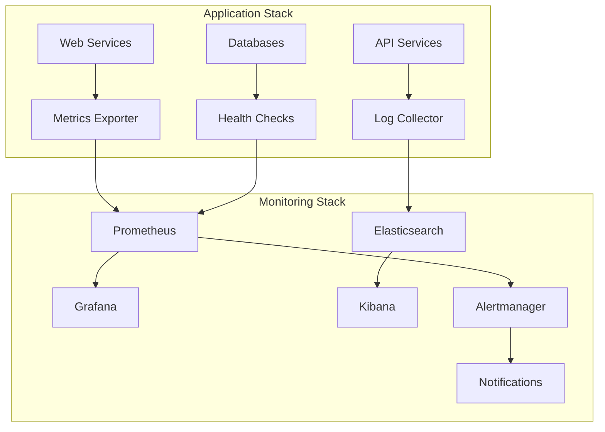

# Session 7: 모니터링과 로깅 통합

## 📍 교과과정에서의 위치
이 세션은 **Week 2 > Day 4 > Session 7**로, Session 6의 스케일링을 바탕으로 Docker Compose 환경에서의 통합 모니터링과 로깅 시스템을 구축합니다.

## 학습 목표 (5분)
- **Compose 환경** 통합 **모니터링 스택** 구축
- **중앙 집중식 로깅** 및 **메트릭 수집** 시스템
- **알림 시스템** 구성 및 **대시보드** 구축

## 1. 이론: Compose 환경 관찰성 (20분)

### 모니터링 아키텍처



### 로깅 전략

```yaml
# 로그 드라이버 설정
services:
  app:
    logging:
      driver: "fluentd"
      options:
        fluentd-address: "localhost:24224"
        tag: "app.{{.Name}}"

# 중앙 집중식 로깅
services:
  fluentd:
    image: fluent/fluentd
    volumes:
      - ./fluentd.conf:/fluentd/etc/fluent.conf
    ports:
      - "24224:24224"
```

## 2. 실습: 통합 모니터링 스택 구축 (15분)

### 모니터링 Compose 파일

```bash
mkdir -p monitoring-stack && cd monitoring-stack

cat > docker-compose.monitoring.yml << 'EOF'
version: '3.8'

services:
  # Prometheus - 메트릭 수집
  prometheus:
    image: prom/prometheus:latest
    ports:
      - "9090:9090"
    volumes:
      - ./prometheus/prometheus.yml:/etc/prometheus/prometheus.yml:ro
      - ./prometheus/rules:/etc/prometheus/rules:ro
      - prometheus_data:/prometheus
    command:
      - '--config.file=/etc/prometheus/prometheus.yml'
      - '--storage.tsdb.path=/prometheus'
      - '--web.console.libraries=/etc/prometheus/console_libraries'
      - '--web.console.templates=/etc/prometheus/consoles'
      - '--web.enable-lifecycle'
      - '--web.enable-admin-api'

  # Grafana - 시각화
  grafana:
    image: grafana/grafana:latest
    ports:
      - "3000:3000"
    environment:
      - GF_SECURITY_ADMIN_PASSWORD=admin
      - GF_USERS_ALLOW_SIGN_UP=false
    volumes:
      - grafana_data:/var/lib/grafana
      - ./grafana/provisioning:/etc/grafana/provisioning:ro
      - ./grafana/dashboards:/var/lib/grafana/dashboards:ro

  # Alertmanager - 알림
  alertmanager:
    image: prom/alertmanager:latest
    ports:
      - "9093:9093"
    volumes:
      - ./alertmanager/alertmanager.yml:/etc/alertmanager/alertmanager.yml:ro
      - alertmanager_data:/alertmanager

  # Node Exporter - 시스템 메트릭
  node-exporter:
    image: prom/node-exporter:latest
    ports:
      - "9100:9100"
    volumes:
      - /proc:/host/proc:ro
      - /sys:/host/sys:ro
      - /:/rootfs:ro
    command:
      - '--path.procfs=/host/proc'
      - '--path.sysfs=/host/sys'
      - '--collector.filesystem.ignored-mount-points=^/(sys|proc|dev|host|etc)($$|/)'

  # cAdvisor - 컨테이너 메트릭
  cadvisor:
    image: gcr.io/cadvisor/cadvisor:latest
    ports:
      - "8080:8080"
    volumes:
      - /:/rootfs:ro
      - /var/run:/var/run:ro
      - /sys:/sys:ro
      - /var/lib/docker/:/var/lib/docker:ro
      - /dev/disk/:/dev/disk:ro

volumes:
  prometheus_data:
  grafana_data:
  alertmanager_data:
EOF

# Prometheus 설정
mkdir -p prometheus/rules
cat > prometheus/prometheus.yml << 'EOF'
global:
  scrape_interval: 15s
  evaluation_interval: 15s

rule_files:
  - "/etc/prometheus/rules/*.yml"

alerting:
  alertmanagers:
    - static_configs:
        - targets:
          - alertmanager:9093

scrape_configs:
  - job_name: 'prometheus'
    static_configs:
      - targets: ['localhost:9090']

  - job_name: 'node-exporter'
    static_configs:
      - targets: ['node-exporter:9100']

  - job_name: 'cadvisor'
    static_configs:
      - targets: ['cadvisor:8080']

  - job_name: 'app-services'
    static_configs:
      - targets: ['web:3000', 'api:3001']
    metrics_path: '/metrics'
    scrape_interval: 10s
EOF

# 알림 규칙
cat > prometheus/rules/alerts.yml << 'EOF'
groups:
- name: docker-compose-alerts
  rules:
  - alert: HighCPUUsage
    expr: rate(container_cpu_usage_seconds_total[5m]) * 100 > 80
    for: 2m
    labels:
      severity: warning
    annotations:
      summary: "High CPU usage detected"
      description: "Container {{ $labels.name }} CPU usage is above 80%"

  - alert: HighMemoryUsage
    expr: (container_memory_usage_bytes / container_spec_memory_limit_bytes) * 100 > 80
    for: 2m
    labels:
      severity: warning
    annotations:
      summary: "High memory usage detected"
      description: "Container {{ $labels.name }} memory usage is above 80%"

  - alert: ServiceDown
    expr: up == 0
    for: 1m
    labels:
      severity: critical
    annotations:
      summary: "Service is down"
      description: "Service {{ $labels.job }} is down"
EOF
```

### 로깅 시스템 구성

```bash
# 로깅 Compose 파일
cat > docker-compose.logging.yml << 'EOF'
version: '3.8'

services:
  # Elasticsearch - 로그 저장
  elasticsearch:
    image: elasticsearch:7.17.0
    environment:
      - discovery.type=single-node
      - "ES_JAVA_OPTS=-Xms512m -Xmx512m"
    ports:
      - "9200:9200"
    volumes:
      - elasticsearch_data:/usr/share/elasticsearch/data

  # Kibana - 로그 시각화
  kibana:
    image: kibana:7.17.0
    ports:
      - "5601:5601"
    environment:
      - ELASTICSEARCH_HOSTS=http://elasticsearch:9200
    depends_on:
      - elasticsearch

  # Fluentd - 로그 수집
  fluentd:
    build: ./fluentd
    ports:
      - "24224:24224"
    volumes:
      - ./fluentd/conf:/fluentd/etc:ro
    depends_on:
      - elasticsearch

  # Logstash - 로그 처리 (대안)
  logstash:
    image: logstash:7.17.0
    ports:
      - "5000:5000"
    volumes:
      - ./logstash/pipeline:/usr/share/logstash/pipeline:ro
    environment:
      - "LS_JAVA_OPTS=-Xmx256m -Xms256m"
    depends_on:
      - elasticsearch

volumes:
  elasticsearch_data:
EOF

# Fluentd 설정
mkdir -p fluentd/conf
cat > fluentd/Dockerfile << 'EOF'
FROM fluent/fluentd:v1.14-1
USER root
RUN gem install fluent-plugin-elasticsearch
USER fluent
EOF

cat > fluentd/conf/fluent.conf << 'EOF'
<source>
  @type forward
  port 24224
  bind 0.0.0.0
</source>

<match docker.**>
  @type elasticsearch
  host elasticsearch
  port 9200
  index_name docker-logs
  type_name _doc
  
  <buffer>
    flush_interval 1s
  </buffer>
</match>

<match **>
  @type stdout
</match>
EOF
```

## 3. 실습: 애플리케이션 메트릭 통합 (15분)

### 메트릭 내장 애플리케이션

```bash
# 메트릭을 제공하는 웹 애플리케이션
mkdir -p app-with-metrics
cat > app-with-metrics/package.json << 'EOF'
{
  "name": "monitored-app",
  "dependencies": {
    "express": "^4.18.2",
    "prom-client": "^14.2.0",
    "winston": "^3.8.2"
  }
}
EOF

cat > app-with-metrics/server.js << 'EOF'
const express = require('express');
const promClient = require('prom-client');
const winston = require('winston');

const app = express();
const register = promClient.register;

// 로거 설정
const logger = winston.createLogger({
  level: 'info',
  format: winston.format.combine(
    winston.format.timestamp(),
    winston.format.json()
  ),
  transports: [
    new winston.transports.Console(),
    new winston.transports.File({ filename: '/var/log/app.log' })
  ]
});

// 메트릭 정의
const httpRequestDuration = new promClient.Histogram({
  name: 'http_request_duration_seconds',
  help: 'Duration of HTTP requests in seconds',
  labelNames: ['method', 'route', 'status_code']
});

const httpRequestTotal = new promClient.Counter({
  name: 'http_requests_total',
  help: 'Total number of HTTP requests',
  labelNames: ['method', 'route', 'status_code']
});

const activeConnections = new promClient.Gauge({
  name: 'active_connections',
  help: 'Number of active connections'
});

// 미들웨어
app.use((req, res, next) => {
  const start = Date.now();
  
  res.on('finish', () => {
    const duration = (Date.now() - start) / 1000;
    const labels = {
      method: req.method,
      route: req.route?.path || req.path,
      status_code: res.statusCode
    };
    
    httpRequestDuration.observe(labels, duration);
    httpRequestTotal.inc(labels);
    
    logger.info('HTTP Request', {
      method: req.method,
      url: req.url,
      status: res.statusCode,
      duration: duration,
      userAgent: req.get('User-Agent')
    });
  });
  
  next();
});

// 라우트
app.get('/', (req, res) => {
  res.json({
    message: 'Monitored Application',
    timestamp: new Date().toISOString(),
    instance: process.env.HOSTNAME || 'unknown'
  });
});

app.get('/health', (req, res) => {
  res.json({ status: 'healthy' });
});

app.get('/metrics', (req, res) => {
  res.set('Content-Type', register.contentType);
  res.end(register.metrics());
});

// 시뮬레이션 엔드포인트
app.get('/slow', (req, res) => {
  setTimeout(() => {
    res.json({ message: 'Slow response' });
  }, Math.random() * 2000);
});

app.get('/error', (req, res) => {
  if (Math.random() > 0.5) {
    logger.error('Simulated error occurred');
    res.status(500).json({ error: 'Internal Server Error' });
  } else {
    res.json({ message: 'Success' });
  }
});

app.listen(3000, '0.0.0.0', () => {
  logger.info('Monitored application started on port 3000');
});
EOF

cat > app-with-metrics/Dockerfile << 'EOF'
FROM node:alpine
WORKDIR /app
COPY package*.json ./
RUN npm install
COPY . .
EXPOSE 3000
CMD ["node", "server.js"]
EOF
```

### 통합 애플리케이션 스택

```bash
# 모니터링이 통합된 애플리케이션 스택
cat > docker-compose.yml << 'EOF'
version: '3.8'

services:
  # 애플리케이션 서비스들
  web:
    build: ./app-with-metrics
    ports:
      - "8080:3000"
    logging:
      driver: fluentd
      options:
        fluentd-address: "localhost:24224"
        tag: "app.web"
    environment:
      - SERVICE_NAME=web
    deploy:
      replicas: 2

  api:
    build: ./app-with-metrics
    ports:
      - "8081:3000"
    logging:
      driver: fluentd
      options:
        fluentd-address: "localhost:24224"
        tag: "app.api"
    environment:
      - SERVICE_NAME=api

  # 데이터베이스
  postgres:
    image: postgres:13
    environment:
      POSTGRES_DB: appdb
      POSTGRES_USER: user
      POSTGRES_PASSWORD: password
    logging:
      driver: fluentd
      options:
        fluentd-address: "localhost:24224"
        tag: "db.postgres"
    volumes:
      - postgres_data:/var/lib/postgresql/data

  # Redis
  redis:
    image: redis:alpine
    logging:
      driver: fluentd
      options:
        fluentd-address: "localhost:24224"
        tag: "cache.redis"

volumes:
  postgres_data:

networks:
  default:
    name: monitoring-network
EOF
```

## 4. 실습: 대시보드 및 알림 설정 (10분)

### Grafana 대시보드 구성

```bash
# Grafana 프로비저닝 설정
mkdir -p grafana/{provisioning/{datasources,dashboards},dashboards}

cat > grafana/provisioning/datasources/prometheus.yml << 'EOF'
apiVersion: 1

datasources:
  - name: Prometheus
    type: prometheus
    access: proxy
    url: http://prometheus:9090
    isDefault: true
EOF

cat > grafana/provisioning/dashboards/dashboard.yml << 'EOF'
apiVersion: 1

providers:
  - name: 'default'
    orgId: 1
    folder: ''
    type: file
    disableDeletion: false
    updateIntervalSeconds: 10
    options:
      path: /var/lib/grafana/dashboards
EOF

# 간단한 대시보드 JSON
cat > grafana/dashboards/docker-compose.json << 'EOF'
{
  "dashboard": {
    "id": null,
    "title": "Docker Compose Monitoring",
    "tags": ["docker", "compose"],
    "timezone": "browser",
    "panels": [
      {
        "id": 1,
        "title": "HTTP Requests per Second",
        "type": "graph",
        "targets": [
          {
            "expr": "rate(http_requests_total[5m])",
            "legendFormat": "{{instance}} - {{method}}"
          }
        ],
        "gridPos": {"h": 8, "w": 12, "x": 0, "y": 0}
      },
      {
        "id": 2,
        "title": "Response Time",
        "type": "graph",
        "targets": [
          {
            "expr": "histogram_quantile(0.95, rate(http_request_duration_seconds_bucket[5m]))",
            "legendFormat": "95th percentile"
          }
        ],
        "gridPos": {"h": 8, "w": 12, "x": 12, "y": 0}
      }
    ],
    "time": {"from": "now-1h", "to": "now"},
    "refresh": "5s"
  }
}
EOF

# Alertmanager 설정
mkdir -p alertmanager
cat > alertmanager/alertmanager.yml << 'EOF'
global:
  smtp_smarthost: 'localhost:587'
  smtp_from: 'alerts@example.com'

route:
  group_by: ['alertname']
  group_wait: 10s
  group_interval: 10s
  repeat_interval: 1h
  receiver: 'web.hook'

receivers:
- name: 'web.hook'
  webhook_configs:
  - url: 'http://webhook-receiver:8080/webhook'
    send_resolved: true

inhibit_rules:
  - source_match:
      severity: 'critical'
    target_match:
      severity: 'warning'
    equal: ['alertname', 'dev', 'instance']
EOF
```

### 통합 실행 스크립트

```bash
# 전체 모니터링 스택 실행 스크립트
cat > start-monitoring.sh << 'EOF'
#!/bin/bash

echo "🚀 Starting integrated monitoring stack..."

# 1. 로깅 스택 시작
echo "Starting logging stack..."
docker-compose -f docker-compose.logging.yml up -d

# 2. 모니터링 스택 시작
echo "Starting monitoring stack..."
docker-compose -f docker-compose.monitoring.yml up -d

# 3. 애플리케이션 스택 시작
echo "Starting application stack..."
docker-compose up -d

# 4. 서비스 준비 대기
echo "Waiting for services to be ready..."
sleep 30

# 5. 헬스체크
echo "Performing health checks..."
services=(
    "http://localhost:9090/-/healthy:Prometheus"
    "http://localhost:3000/api/health:Grafana"
    "http://localhost:9200/_cluster/health:Elasticsearch"
    "http://localhost:5601/api/status:Kibana"
    "http://localhost:8080/:Web App"
)

for service in "${services[@]}"; do
    IFS=':' read -r url name <<< "$service"
    if curl -f -s "$url" > /dev/null; then
        echo "✅ $name is healthy"
    else
        echo "❌ $name is not responding"
    fi
done

echo ""
echo "🎉 Monitoring stack is ready!"
echo "📊 Grafana: http://localhost:3000 (admin/admin)"
echo "📈 Prometheus: http://localhost:9090"
echo "📋 Kibana: http://localhost:5601"
echo "🔔 Alertmanager: http://localhost:9093"
echo "🌐 Application: http://localhost:8080"
EOF

chmod +x start-monitoring.sh
```

## 5. Q&A 및 정리 (5분)

### 모니터링 시스템 검증

```bash
# 모니터링 스택 실행
./start-monitoring.sh

# 테스트 트래픽 생성
echo "=== 테스트 트래픽 생성 ==="
for i in {1..100}; do
    curl -s http://localhost:8080/ > /dev/null
    curl -s http://localhost:8080/slow > /dev/null
    curl -s http://localhost:8080/error > /dev/null
done

# 정리 및 요약
cat > session7-summary.md << 'EOF'
# Session 7 요약: 모니터링과 로깅 통합

## 구축한 모니터링 스택
```
Application Layer:
├── Web/API Services (with metrics)
├── Database (PostgreSQL)
└── Cache (Redis)

Monitoring Layer:
├── Prometheus (메트릭 수집)
├── Grafana (시각화)
├── Alertmanager (알림)
├── Node Exporter (시스템 메트릭)
└── cAdvisor (컨테이너 메트릭)

Logging Layer:
├── Fluentd (로그 수집)
├── Elasticsearch (로그 저장)
└── Kibana (로그 시각화)
```

## 수집하는 메트릭
### 애플리케이션 메트릭
- HTTP 요청 수 및 응답 시간
- 에러율 및 상태 코드 분포
- 활성 연결 수

### 시스템 메트릭
- CPU, 메모리, 디스크 사용률
- 네트워크 I/O
- 파일 시스템 사용량

### 컨테이너 메트릭
- 컨테이너별 리소스 사용량
- 컨테이너 상태 및 재시작 횟수
- 이미지 크기 및 레이어 정보

## 로깅 전략
- **구조화된 로그**: JSON 형태로 표준화
- **중앙 집중식**: Fluentd를 통한 수집
- **실시간 분석**: Elasticsearch + Kibana
- **로그 레벨**: ERROR, WARN, INFO, DEBUG

## 알림 규칙
- **CPU 사용률** > 80% (2분 지속)
- **메모리 사용률** > 80% (2분 지속)
- **서비스 다운** (1분 지속)
- **응답 시간** > 2초 (5분 지속)

## 대시보드 구성
- **시스템 개요**: 전체 리소스 사용률
- **애플리케이션 성능**: 응답시간, 처리량
- **에러 모니터링**: 에러율, 실패한 요청
- **인프라 상태**: 컨테이너, 네트워크 상태
EOF

echo "Session 7 완료! 요약: session7-summary.md"
```

## 💡 핵심 키워드
- **통합 모니터링**: Prometheus + Grafana + Alertmanager
- **중앙 집중식 로깅**: ELK Stack + Fluentd
- **애플리케이션 메트릭**: HTTP 메트릭, 비즈니스 메트릭
- **관찰성**: Metrics, Logs, Traces 통합

## 📚 참고 자료
- [Prometheus 모니터링](https://prometheus.io/docs/)
- [Grafana 대시보드](https://grafana.com/docs/)
- [ELK Stack 가이드](https://www.elastic.co/guide/)

## 🔧 실습 체크리스트
- [ ] 통합 모니터링 스택 구축
- [ ] 애플리케이션 메트릭 수집
- [ ] 중앙 집중식 로깅 시스템
- [ ] Grafana 대시보드 구성
- [ ] 알림 시스템 설정 및 테스트
