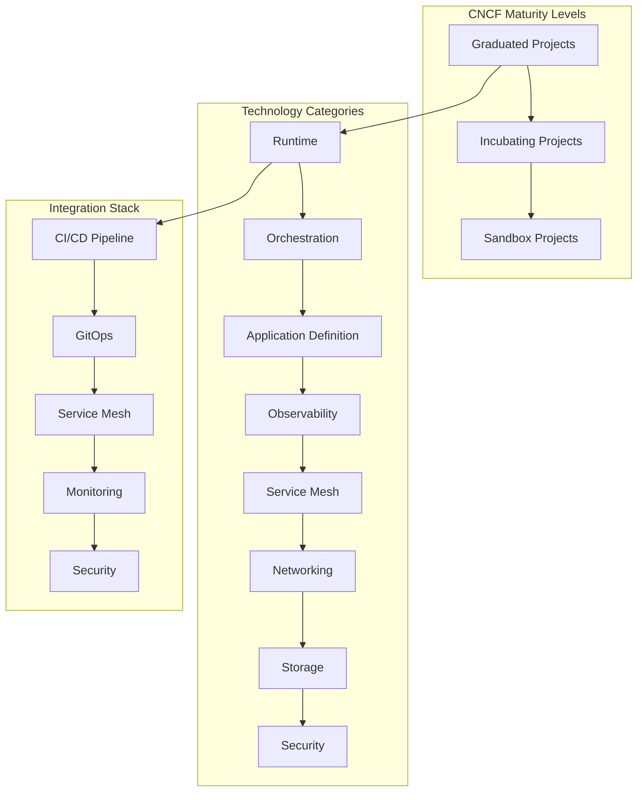

# Session 7: 클라우드 네이티브 도구 생태계

## 📍 교과과정에서의 위치
이 세션은 **Week 2 > Day 4 > Session 7**로, 멀티 클러스터 관리 이해를 바탕으로 CNCF 도구 생태계와 클라우드 네이티브 기술 스택의 통합 활용 전략을 심화 분석합니다.

## 학습 목표 (5분)
- **CNCF 도구 체인** 구성과 **생태계 통합** 전략
- **GitOps 및 ArgoCD**를 통한 **선언적 배포** 관리
- **서비스 메시** 운영과 **관찰가능성** 도구 통합

## 1. 이론: CNCF 도구 생태계 개요 (20분)

### CNCF 프로젝트 분류 및 성숙도



### CNCF 프로젝트 카테고리 분석

```
CNCF 기술 스택:

컨테이너 런타임:
├── Graduated Projects:
│   ├── containerd: 산업 표준 컨테이너 런타임
│   ├── runc: OCI 런타임 스펙 참조 구현
│   └── 높은 안정성 및 광범위한 채택
├── Incubating Projects:
│   ├── CRI-O: Kubernetes 전용 경량 런타임
│   ├── gVisor: 샌드박스 기반 보안 런타임
│   └── Kata Containers: VM 기반 보안 컨테이너
└── 선택 기준:
    ├── 성능 요구사항
    ├── 보안 수준
    ├── Kubernetes 통합도
    └── 생태계 지원

오케스트레이션 및 관리:
├── Kubernetes (Graduated):
│   ├── 컨테이너 오케스트레이션 표준
│   ├── 광범위한 생태계 지원
│   ├── 클라우드 네이티브 플랫폼 기반
│   └── 엔터프라이즈 채택률 최고
├── 관련 도구들:
│   ├── Helm: 패키지 관리자
│   ├── Kustomize: 설정 관리 도구
│   ├── Operator Framework: 운영 자동화
│   └── Cluster API: 클러스터 생명주기 관리
└── 통합 전략:
    ├── 표준화된 배포 방식
    ├── 설정 관리 일원화
    ├── 운영 자동화 구현
    └── 멀티 클러스터 관리

애플리케이션 정의 및 배포:
├── Helm (Graduated):
│   ├── Kubernetes 패키지 관리
│   ├── 템플릿 기반 설정 관리
│   ├── 버전 관리 및 롤백
│   ├── 의존성 관리
│   └── 차트 저장소 생태계
├── 대안 도구들:
│   ├── Kustomize: 오버레이 기반 설정
│   ├── Jsonnet: 프로그래밍 방식 설정
│   ├── Pulumi: 다중 언어 IaC
│   └── Terraform: 인프라 프로비저닝
└── 선택 고려사항:
    ├── 팀 기술 스택
    ├── 복잡성 수준
    ├── 유지보수성
    └── 생태계 통합도

관찰가능성:
├── Prometheus (Graduated):
│   ├── 메트릭 수집 및 저장
│   ├── PromQL 쿼리 언어
│   ├── 알림 및 규칙 엔진
│   ├── 서비스 디스커버리
│   └── 확장 가능한 아키텍처
├── Jaeger (Graduated):
│   ├── 분산 추적 시스템
│   ├── OpenTracing 표준 구현
│   ├── 성능 병목 분석
│   ├── 서비스 의존성 시각화
│   └── 마이크로서비스 디버깅
├── Fluentd (Graduated):
│   ├── 통합 로깅 계층
│   ├── 다양한 데이터 소스 지원
│   ├── 플러그인 생태계
│   ├── 실시간 데이터 처리
│   └── 클라우드 네이티브 로깅
└── 통합 스택:
    ├── 메트릭 + 로그 + 트레이스
    ├── 상관관계 분석
    ├── 통합 대시보드
    └── 지능형 알림

네트워킹 및 서비스 메시:
├── Envoy (Graduated):
│   ├── 고성능 프록시
│   ├── 서비스 메시 데이터 플레인
│   ├── 동적 설정 (xDS API)
│   ├── 고급 로드 밸런싱
│   └── 관찰가능성 내장
├── CoreDNS (Graduated):
│   ├── 클라우드 네이티브 DNS
│   ├── 플러그인 아키텍처
│   ├── Kubernetes 통합
│   ├── 서비스 디스커버리
│   └── 확장 가능한 설정
├── CNI (Container Network Interface):
│   ├── Calico: L3 네트워킹 및 정책
│   ├── Cilium: eBPF 기반 네트워킹
│   ├── Flannel: 간단한 오버레이
│   └── Weave Net: 메시 네트워킹
└── 서비스 메시 솔루션:
    ├── Istio: 완전한 서비스 메시
    ├── Linkerd: 경량 서비스 메시
    ├── Consul Connect: HashiCorp 생태계
    └── 선택 기준 및 비교

보안:
├── 컨테이너 보안:
│   ├── Falco: 런타임 보안 모니터링
│   ├── Open Policy Agent: 정책 엔진
│   ├── Notary: 콘텐츠 신뢰 및 서명
│   └── SPIFFE/SPIRE: 보안 ID 프레임워크
├── 네트워크 보안:
│   ├── 네트워크 정책 엔진
│   ├── 서비스 메시 보안
│   ├── 제로 트러스트 네트워킹
│   └── 암호화 및 인증서 관리
└── 통합 보안 전략:
    ├── 심층 방어 (Defense in Depth)
    ├── 자동화된 보안 정책
    ├── 지속적인 컴플라이언스
    └── 보안 관찰가능성
```

## 2. 이론: GitOps 및 ArgoCD 심화 (15분)

### GitOps 운영 모델

```
GitOps 원칙 및 구현:

GitOps 핵심 원칙:
├── 선언적 구성:
│   ├── 모든 시스템 상태를 Git에 저장
│   ├── YAML/JSON 형식의 매니페스트
│   ├── Infrastructure as Code
│   ├── 버전 관리 및 이력 추적
│   └── 코드 리뷰를 통한 변경 승인
├── 버전 관리:
│   ├── Git을 단일 진실 소스로 활용
│   ├── 브랜치 전략 및 워크플로우
│   ├── 태그를 통한 릴리스 관리
│   ├── 변경 사항 추적 및 감사
│   └── 협업 및 승인 프로세스
├── 자동 배포:
│   ├── Git 커밋 기반 자동 배포
│   ├── 지속적 동기화 (Pull 모델)
│   ├── 드리프트 감지 및 자동 수정
│   ├── 배포 상태 모니터링
│   └── 실패 시 자동 롤백
└── 관찰가능성:
    ├── 배포 상태 실시간 모니터링
    ├── 변경 사항 영향 분석
    ├── 성능 및 안정성 메트릭
    ├── 알림 및 대시보드
    └── 감사 로그 및 컴플라이언스

ArgoCD 아키텍처:
├── 핵심 컴포넌트:
│   ├── API Server: REST API 및 웹 UI
│   ├── Repository Server: Git 저장소 관리
│   ├── Application Controller: 동기화 제어
│   ├── Redis: 캐시 및 세션 저장
│   └── Dex: OIDC 인증 서버
├── 애플리케이션 모델:
│   ├── Application: 배포 단위 정의
│   ├── Project: 애플리케이션 그룹화
│   ├── Repository: Git 저장소 연결
│   ├── Cluster: 대상 Kubernetes 클러스터
│   └── Sync Policy: 동기화 정책
├── 동기화 메커니즘:
│   ├── 수동 동기화: 사용자 트리거
│   ├── 자동 동기화: 변경 감지 시 자동
│   ├── Self-Heal: 드리프트 자동 수정
│   ├── Prune: 불필요한 리소스 정리
│   └── Sync Waves: 순차적 배포
└── 고급 기능:
    ├── 멀티 클러스터 지원
    ├── ApplicationSet: 대규모 배포 관리
    ├── Rollouts: 고급 배포 전략
    ├── Notifications: 이벤트 기반 알림
    └── RBAC: 세밀한 권한 제어

GitOps 워크플로우:
├── 개발 워크플로우:
│   ├── 기능 브랜치에서 개발
│   ├── Pull Request를 통한 코드 리뷰
│   ├── CI 파이프라인에서 이미지 빌드
│   ├── 이미지 태그 업데이트 자동화
│   └── 매니페스트 저장소 업데이트
├── 배포 워크플로우:
│   ├── ArgoCD가 Git 변경 감지
│   ├── 매니페스트와 클러스터 상태 비교
│   ├── 차이점 식별 및 동기화 계획
│   ├── 승인된 변경사항 자동 적용
│   └── 배포 상태 모니터링 및 알림
├── 운영 워크플로우:
│   ├── 드리프트 감지 및 알림
│   ├── 자동 수정 또는 수동 개입
│   ├── 롤백 및 복구 프로세스
│   ├── 성능 및 안정성 모니터링
│   └── 지속적인 개선 및 최적화
└── 보안 워크플로우:
    ├── 이미지 취약점 스캔
    ├── 정책 준수 검사
    ├── 시크릿 관리 및 로테이션
    ├── 접근 제어 및 감사
    └── 컴플라이언스 리포팅
```

## 3. 이론: 서비스 메시 및 관찰가능성 (10분)

### 서비스 메시 통합 전략

```
서비스 메시 생태계:

Istio 서비스 메시:
├── 아키텍처 구성:
│   ├── Envoy Proxy: 데이터 플레인
│   ├── Istiod: 컨트롤 플레인 (통합)
│   ├── Pilot: 트래픽 관리
│   ├── Citadel: 보안 및 인증서 관리
│   └── Galley: 설정 검증 및 배포
├── 트래픽 관리:
│   ├── Virtual Service: 라우팅 규칙
│   ├── Destination Rule: 정책 및 설정
│   ├── Gateway: 외부 트래픽 관리
│   ├── Service Entry: 외부 서비스 등록
│   └── Sidecar: 프록시 설정 최적화
├── 보안 기능:
│   ├── mTLS 자동 암호화
│   ├── 인증 정책 (Authentication)
│   ├── 권한 부여 정책 (Authorization)
│   ├── 보안 네이밍 (SPIFFE)
│   └── 인증서 자동 관리
└── 관찰가능성:
    ├── 분산 추적 (Jaeger/Zipkin)
    ├── 메트릭 수집 (Prometheus)
    ├── 로깅 (Envoy Access Logs)
    ├── Kiali: 서비스 메시 시각화
    └── 대시보드 및 모니터링

Linkerd 서비스 메시:
├── 경량화 설계:
│   ├── Rust 기반 프록시 (linkerd2-proxy)
│   ├── 최소 리소스 사용량
│   ├── 빠른 시작 시간
│   ├── 간단한 설정 및 관리
│   └── 높은 성능 및 안정성
├── 핵심 기능:
│   ├── 자동 mTLS
│   ├── 트래픽 분할 및 카나리 배포
│   ├── 로드 밸런싱 및 재시도
│   ├── 타임아웃 및 서킷 브레이커
│   └── 트래픽 정책 관리
├── 관찰가능성:
│   ├── 실시간 메트릭 대시보드
│   ├── 서비스 토폴로지 시각화
│   ├── 성공률 및 지연시간 추적
│   ├── 분산 추적 지원
│   └── 알림 및 SLI/SLO 모니터링
└── 운영 특징:
    ├── 점진적 도입 (Progressive Delivery)
    ├── 멀티 클러스터 지원
    ├── 확장 가능한 아키텍처
    ├── 커뮤니티 중심 개발
    └── CNCF 졸업 프로젝트

관찰가능성 통합:
├── 메트릭 수집:
│   ├── Prometheus: 시계열 메트릭
│   ├── Grafana: 시각화 및 대시보드
│   ├── 커스텀 메트릭 정의
│   ├── SLI/SLO 기반 모니터링
│   └── 알림 및 에스컬레이션
├── 로그 관리:
│   ├── Fluentd/Fluent Bit: 로그 수집
│   ├── Elasticsearch: 로그 저장 및 검색
│   ├── Kibana: 로그 분석 및 시각화
│   ├── 구조화된 로깅
│   └── 로그 상관관계 분석
├── 분산 추적:
│   ├── Jaeger: 분산 추적 시스템
│   ├── OpenTelemetry: 표준화된 계측
│   ├── 요청 흐름 추적
│   ├── 성능 병목 분석
│   └── 서비스 의존성 매핑
└── 통합 분석:
    ├── 메트릭-로그-트레이스 상관관계
    ├── 근본 원인 분석 자동화
    ├── 이상 탐지 및 예측
    ├── 비즈니스 메트릭 연동
    └── 지능형 알림 시스템
```

## 4. 개념 예시: 도구 생태계 통합 구성 (12분)

### CNCF 도구 스택 통합 예시

```yaml
# ArgoCD Application (개념 예시)
apiVersion: argoproj.io/v1alpha1
kind: Application
metadata:
  name: observability-stack
  namespace: argocd
spec:
  project: platform
  source:
    repoURL: https://github.com/company/platform-manifests
    targetRevision: HEAD
    path: observability
    helm:
      valueFiles:
      - values-production.yaml
  destination:
    server: https://kubernetes.default.svc
    namespace: observability
  syncPolicy:
    automated:
      prune: true
      selfHeal: true
    syncOptions:
    - CreateNamespace=true
    retry:
      limit: 5
      backoff:
        duration: 5s
        factor: 2

---
# Prometheus 설정
apiVersion: v1
kind: ConfigMap
metadata:
  name: prometheus-config
data:
  prometheus.yml: |
    global:
      scrape_interval: 15s
      evaluation_interval: 15s
    
    rule_files:
    - "/etc/prometheus/rules/*.yml"
    
    scrape_configs:
    - job_name: 'kubernetes-apiservers'
      kubernetes_sd_configs:
      - role: endpoints
      scheme: https
      tls_config:
        ca_file: /var/run/secrets/kubernetes.io/serviceaccount/ca.crt
      bearer_token_file: /var/run/secrets/kubernetes.io/serviceaccount/token
      relabel_configs:
      - source_labels: [__meta_kubernetes_namespace, __meta_kubernetes_service_name, __meta_kubernetes_endpoint_port_name]
        action: keep
        regex: default;kubernetes;https
    
    - job_name: 'istio-mesh'
      kubernetes_sd_configs:
      - role: endpoints
        namespaces:
          names:
          - istio-system
      relabel_configs:
      - source_labels: [__meta_kubernetes_service_name, __meta_kubernetes_endpoint_port_name]
        action: keep
        regex: istio-proxy;http-monitoring
```

### Istio 서비스 메시 구성 예시

```yaml
# Istio Gateway (개념 예시)
apiVersion: networking.istio.io/v1beta1
kind: Gateway
metadata:
  name: webapp-gateway
spec:
  selector:
    istio: ingressgateway
  servers:
  - port:
      number: 443
      name: https
      protocol: HTTPS
    tls:
      mode: SIMPLE
      credentialName: webapp-tls
    hosts:
    - webapp.company.com

---
# Virtual Service
apiVersion: networking.istio.io/v1beta1
kind: VirtualService
metadata:
  name: webapp-vs
spec:
  hosts:
  - webapp.company.com
  gateways:
  - webapp-gateway
  http:
  - match:
    - headers:
        canary:
          exact: "true"
    route:
    - destination:
        host: webapp-service
        subset: canary
      weight: 100
  - route:
    - destination:
        host: webapp-service
        subset: stable
      weight: 90
    - destination:
        host: webapp-service
        subset: canary
      weight: 10

---
# Destination Rule
apiVersion: networking.istio.io/v1beta1
kind: DestinationRule
metadata:
  name: webapp-dr
spec:
  host: webapp-service
  trafficPolicy:
    tls:
      mode: ISTIO_MUTUAL
    connectionPool:
      tcp:
        maxConnections: 100
      http:
        http1MaxPendingRequests: 50
        maxRequestsPerConnection: 10
    circuitBreaker:
      consecutiveErrors: 3
      interval: 30s
      baseEjectionTime: 30s
  subsets:
  - name: stable
    labels:
      version: stable
  - name: canary
    labels:
      version: canary
```

### 통합 모니터링 대시보드 예시

```yaml
# Grafana 대시보드 ConfigMap (개념 예시)
apiVersion: v1
kind: ConfigMap
metadata:
  name: cncf-dashboard
data:
  cncf-overview.json: |
    {
      "dashboard": {
        "title": "CNCF Stack Overview",
        "panels": [
          {
            "title": "Kubernetes Cluster Health",
            "type": "stat",
            "targets": [
              {
                "expr": "up{job=\"kubernetes-apiservers\"}",
                "legendFormat": "API Server"
              },
              {
                "expr": "up{job=\"kubernetes-nodes\"}",
                "legendFormat": "Nodes"
              }
            ]
          },
          {
            "title": "Istio Service Mesh Metrics",
            "type": "graph",
            "targets": [
              {
                "expr": "rate(istio_requests_total[5m])",
                "legendFormat": "Request Rate"
              },
              {
                "expr": "histogram_quantile(0.99, rate(istio_request_duration_milliseconds_bucket[5m]))",
                "legendFormat": "99th Percentile Latency"
              }
            ]
          },
          {
            "title": "ArgoCD Application Status",
            "type": "table",
            "targets": [
              {
                "expr": "argocd_app_info",
                "legendFormat": "{{name}} - {{sync_status}}"
              }
            ]
          },
          {
            "title": "Prometheus Targets",
            "type": "stat",
            "targets": [
              {
                "expr": "prometheus_sd_discovered_targets",
                "legendFormat": "Discovered Targets"
              },
              {
                "expr": "up",
                "legendFormat": "Up Targets"
              }
            ]
          }
        ]
      }
    }

---
# 통합 알림 규칙
apiVersion: monitoring.coreos.com/v1
kind: PrometheusRule
metadata:
  name: cncf-stack-alerts
spec:
  groups:
  - name: cncf.rules
    rules:
    - alert: KubernetesAPIServerDown
      expr: up{job="kubernetes-apiservers"} == 0
      for: 5m
      labels:
        severity: critical
      annotations:
        summary: "Kubernetes API server is down"
    
    - alert: IstioHighErrorRate
      expr: rate(istio_requests_total{response_code!~"2.."}[5m]) / rate(istio_requests_total[5m]) > 0.1
      for: 5m
      labels:
        severity: warning
      annotations:
        summary: "High error rate in service mesh"
    
    - alert: ArgoCDSyncFailed
      expr: argocd_app_info{sync_status!="Synced"} == 1
      for: 10m
      labels:
        severity: warning
      annotations:
        summary: "ArgoCD application sync failed"
```

### 도구 통합 자동화 스크립트 예시

```bash
#!/bin/bash
# CNCF 스택 배포 자동화 (개념 예시)

set -e

echo "Deploying CNCF Stack..."

# 1. Istio 설치
echo "Installing Istio..."
istioctl install --set values.defaultRevision=default -y
kubectl label namespace default istio-injection=enabled

# 2. Prometheus Operator 설치
echo "Installing Prometheus Operator..."
kubectl apply -f https://raw.githubusercontent.com/prometheus-operator/prometheus-operator/main/bundle.yaml

# 3. ArgoCD 설치
echo "Installing ArgoCD..."
kubectl create namespace argocd
kubectl apply -n argocd -f https://raw.githubusercontent.com/argoproj/argo-cd/stable/manifests/install.yaml

# 4. Jaeger 설치
echo "Installing Jaeger..."
kubectl apply -f https://raw.githubusercontent.com/jaegertracing/jaeger-operator/main/deploy/crds/jaegertracing.io_jaegers_crd.yaml
kubectl apply -f https://raw.githubusercontent.com/jaegertracing/jaeger-operator/main/deploy/operator.yaml

# 5. 통합 설정 적용
echo "Applying integration configurations..."
kubectl apply -f ./manifests/observability/
kubectl apply -f ./manifests/service-mesh/
kubectl apply -f ./manifests/gitops/

# 6. 상태 확인
echo "Checking deployment status..."
kubectl get pods -n istio-system
kubectl get pods -n argocd
kubectl get pods -n observability

echo "CNCF Stack deployment completed!"
```

## 5. 토론 및 정리 (8분)

### 핵심 개념 정리
- **CNCF 도구 생태계**의 **성숙도별 분류**와 **통합 전략**
- **GitOps 및 ArgoCD**를 통한 **선언적 배포** 및 **운영 자동화**
- **서비스 메시**와 **관찰가능성** 도구의 **유기적 통합**
- **클라우드 네이티브 스택**의 **표준화**와 **상호 운용성**

### 토론 주제
"조직의 기술 성숙도와 요구사항에 맞는 최적의 CNCF 도구 조합을 선택하고 통합하는 전략은 무엇인가?"

## 💡 핵심 키워드
- **CNCF 생태계**: Graduated/Incubating/Sandbox 프로젝트
- **GitOps**: ArgoCD, 선언적 배포, 자동 동기화
- **서비스 메시**: Istio, Linkerd, 트래픽 관리, 보안
- **관찰가능성**: Prometheus, Jaeger, Grafana, 통합 모니터링

## 📚 참고 자료
- [CNCF 프로젝트 현황](https://www.cncf.io/projects/)
- [ArgoCD 문서](https://argo-cd.readthedocs.io/)
- [Istio 서비스 메시](https://istio.io/latest/docs/)
