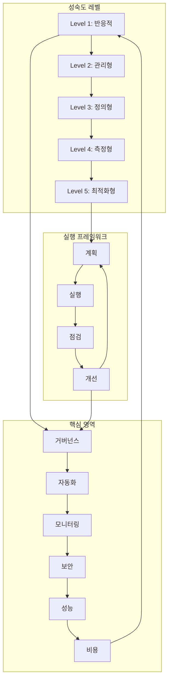
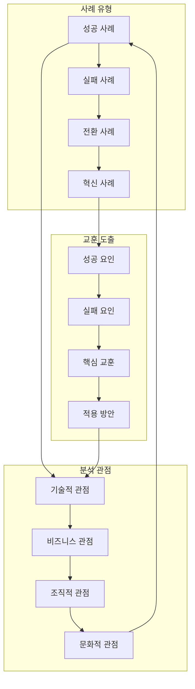
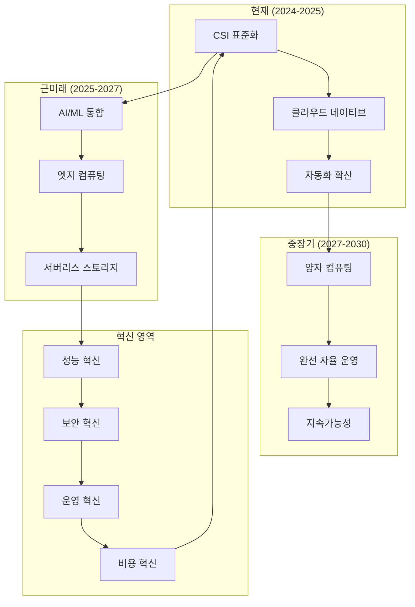
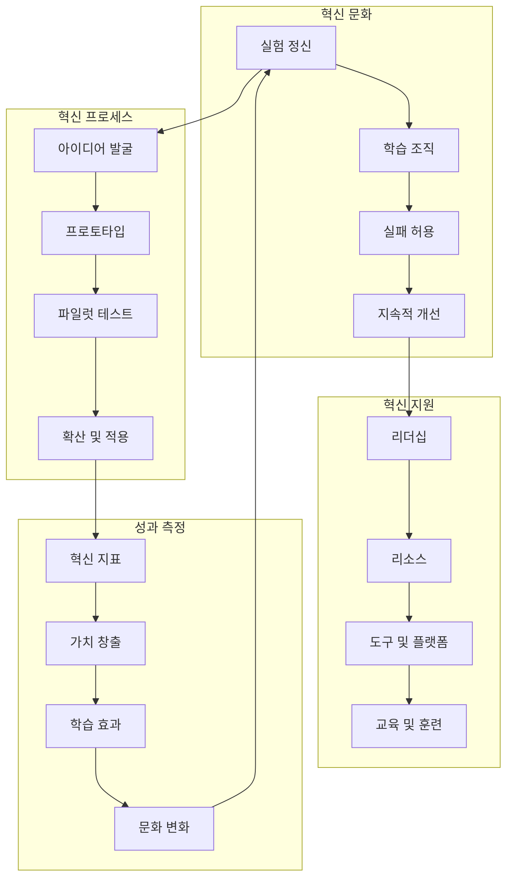

# Session 8: 스토리지 운영 베스트 프랙티스와 사례 연구

## 📍 교과과정에서의 위치
이 세션은 **Week 2 > Day 4 > Session 8**으로, Day 4의 마지막 세션으로서 Session 1-7에서 학습한 모든 스토리지 지식을 종합하여 실무 운영 베스트 프랙티스와 실제 사례를 통한 교훈을 학습합니다.

## 학습 목표 (5분)
- **운영 베스트 프랙티스** 체계와 **실무 적용** 방법 완전 이해
- **실제 사례 연구**를 통한 **문제 해결** 경험과 **교훈** 학습
- **미래 트렌드**와 **기술 발전** 방향 파악
- **지속적 개선** 문화와 **혁신** 전략 수립

## 1. 운영 베스트 프랙티스 체계 (15분)

### 운영 성숙도 모델



### 운영 베스트 프랙티스 상세 분석
```
Kubernetes 스토리지 운영 베스트 프랙티스:

거버넌스 및 정책:
   🔹 스토리지 거버넌스 프레임워크:
      • 정책 및 표준:
         • 스토리지 클래스 표준화
         • 명명 규칙 정의
         • 리소스 할당 정책
         • 보안 정책 수립
         • 백업 및 복구 정책
         • 데이터 보존 정책
      • 역할 및 책임:
         • 스토리지 관리자 역할
         • 개발팀 책임 범위
         • 운영팀 책임 범위
         • 보안팀 역할
         • 감사팀 역할
         • 에스컬레이션 체계
      • 승인 및 변경 관리:
      • 변경 요청 프로세스
      • 영향 분석 절차
      • 승인 권한 매트릭스
      • 테스트 및 검증 절차
      • 롤백 계획 수립
      • 변경 이력 관리
   🔹 리소스 관리 정책:
      • 할당량 관리:
         • 네임스페이스별 할당량
         • 팀별 할당량
         • 프로젝트별 할당량
         • 환경별 할당량 (dev/staging/prod)
         • 동적 할당량 조정
         • 할당량 모니터링 및 알림
      • 라이프사이클 관리:
         • 프로비저닝 자동화
         • 사용량 모니터링
         • 정리 및 회수 정책
         • 아카이브 정책
         • 삭제 정책
         • 감사 추적
      • 비용 관리:
      • 비용 할당 모델
      • 차지백 정책
      • 예산 관리
      • 비용 최적화 목표
      • ROI 측정
      • 비용 투명성 확보
   🔹 컴플라이언스 및 감사:
      • 규정 준수 관리:
         • 데이터 보호 규정 (GDPR, CCPA)
         • 산업별 규정 (HIPAA, SOX, PCI-DSS)
         • 국가별 규정 준수
         • 내부 정책 준수
         • 정기적 컴플라이언스 점검
         • 위반 사항 대응 절차
      • 감사 체계:
         • 내부 감사 프로세스
         • 외부 감사 대응
         • 감사 증적 관리
         • 감사 결과 대응
         • 개선 조치 추적
         • 감사 보고서 관리
      • 문서화 및 기록 관리:
      • 정책 문서 관리
      • 절차서 관리
      • 설정 문서화
      • 변경 이력 기록
      • 인시던트 기록
      • 교육 자료 관리
   🔹 위험 관리:
   🔹 위험 식별 및 평가:
      • 기술적 위험 평가
      • 운영적 위험 평가
      • 보안 위험 평가
      • 컴플라이언스 위험 평가
      • 비즈니스 위험 평가
      • 위험 매트릭스 관리
   🔹 위험 완화 전략:
      • 예방적 조치
      • 탐지 및 모니터링
      • 대응 계획
      • 복구 계획
      • 비즈니스 연속성 계획
      • 보험 및 전가 전략
   🔹 위험 모니터링:
   🔹 위험 지표 모니터링
   🔹 정기적 위험 재평가
   🔹 새로운 위험 식별
   🔹 위험 트렌드 분석
   🔹 위험 보고서 작성
   🔹 이해관계자 커뮤니케이션

자동화 및 운영 효율성:
   🔹 인프라 자동화:
      • Infrastructure as Code (IaC):
         • Terraform을 통한 인프라 관리
         • Helm 차트를 통한 애플리케이션 배포
         • GitOps 워크플로우 구현
         • 버전 관리 및 롤백
         • 환경별 설정 관리
         • 자동화된 테스트 및 검증
      • 프로비저닝 자동화:
         • 동적 볼륨 프로비저닝
         • 스토리지 클래스 자동 선택
         • 정책 기반 프로비저닝
         • 승인 워크플로우 자동화
         • 리소스 태깅 자동화
         • 비용 추적 자동화
      • 설정 관리 자동화:
      • 설정 드리프트 탐지
      • 자동 설정 복구
      • 설정 변경 추적
      • 설정 백업 및 복원
      • 설정 검증 자동화
      • 설정 문서 자동 생성
   🔹 운영 자동화:
      • 모니터링 자동화:
         • 메트릭 수집 자동화
         • 로그 수집 및 분석 자동화
         • 알림 규칙 자동 생성
         • 대시보드 자동 생성
         • 리포트 자동 생성
         • 이상 탐지 자동화
      • 백업 및 복구 자동화:
         • 스케줄 기반 백업
         • 정책 기반 백업
         • 백업 검증 자동화
         • 복구 테스트 자동화
         • 백업 보존 정책 자동 적용
         • 재해 복구 자동화
      • 유지보수 자동화:
      • 정기적 헬스 체크
      • 자동 정리 작업
      • 성능 최적화 자동화
      • 보안 패치 자동화
      • 용량 관리 자동화
      • 라이선스 관리 자동화
   🔹 셀프 서비스 플랫폼:
      • 개발자 포털:
         • 스토리지 요청 인터페이스
         • 리소스 사용량 대시보드
         • 비용 추적 및 알림
         • 문서 및 가이드 제공
         • 지원 요청 시스템
         • 피드백 수집 시스템
      • API 기반 서비스:
         • RESTful API 제공
         • GraphQL API 지원
         • SDK 및 CLI 도구
         • API 문서화
         • API 버전 관리
         • API 보안 및 인증
      • 워크플로우 자동화:
      • 승인 워크플로우
      • 프로비저닝 워크플로우
      • 변경 관리 워크플로우
      • 인시던트 대응 워크플로우
      • 백업 복구 워크플로우
      • 보고 워크플로우
   🔹 지속적 개선:
   🔹 성능 최적화:
      • 지속적 성능 모니터링
      • 자동 성능 튜닝
      • 성능 회귀 탐지
      • 용량 계획 자동화
      • 비용 최적화 자동화
      • 성능 기준선 자동 업데이트
   🔹 프로세스 개선:
      • 메트릭 기반 개선
      • 피드백 루프 구축
      • A/B 테스트 프레임워크
      • 실험 및 혁신 문화
      • 베스트 프랙티스 공유
      • 지식 관리 시스템
   🔹 기술 혁신:
   🔹 신기술 평가 및 도입
   🔹 프로토타입 개발
   🔹 파일럿 프로젝트 운영
   🔹 기술 로드맵 관리
   🔹 오픈소스 기여
   🔹 커뮤니티 참여
```

## 2. 실제 사례 연구와 교훈 (12분)

### 사례 연구 프레임워크


### 실제 사례 연구 상세 분석
```
Kubernetes 스토리지 운영 사례 연구:

성공 사례 분석:
   🔹 사례 1: 대규모 전자상거래 플랫폼 스토리지 현대화
      • 배경 및 도전과제:
         • 레거시 스토리지 시스템의 한계
         • 급격한 트래픽 증가 대응 필요
         • 다중 리전 확장 요구사항
         • 비용 최적화 압박
         • 가용성 99.99% 요구사항
         • 규정 준수 요구사항 증가
      • 해결 방안:
         • 단계적 Kubernetes 마이그레이션
         • 하이브리드 스토리지 아키텍처 구축
         • 자동화된 백업 및 복구 시스템
         • 실시간 모니터링 및 알림 시스템
         • 성능 기반 스토리지 계층화
         • DevSecOps 파이프라인 통합
      • 구현 과정:
         • 1단계: 파일럿 프로젝트 (3개월)
         • 2단계: 비핵심 서비스 마이그레이션 (6개월)
         • 3단계: 핵심 서비스 마이그레이션 (9개월)
         • 4단계: 최적화 및 안정화 (6개월)
         • 5단계: 고도화 및 자동화 (지속적)
         • 각 단계별 성과 측정 및 피드백
      • 성과 및 결과:
         • 인프라 비용 40% 절감
         • 배포 시간 80% 단축
         • 가용성 99.99% 달성
         • 성능 30% 향상
         • 운영 효율성 60% 개선
         • 개발자 생산성 50% 향상
      • 핵심 성공 요인:
      • 경영진의 강력한 지원
      • 단계적 접근 방식
      • 충분한 교육 및 훈련
      • 자동화 우선 접근
      • 지속적 모니터링 및 개선
      • 문화 변화 관리
   🔹 사례 2: 금융 서비스 기업의 클라우드 네이티브 전환
      • 배경 및 도전과제:
         • 엄격한 규정 준수 요구사항
         • 높은 보안 요구사항
         • 레거시 시스템과의 통합
         • 실시간 거래 처리 요구사항
         • 재해 복구 및 비즈니스 연속성
         • 변화에 대한 조직 저항
      • 해결 방안:
         • 보안 우선 아키텍처 설계
         • 제로 트러스트 보안 모델 적용
         • 암호화 기반 데이터 보호
         • 실시간 감사 및 모니터링
         • 다중 클라우드 전략
         • 점진적 마이그레이션 전략
      • 구현 결과:
         • 규정 준수 100% 달성
         • 보안 인시던트 90% 감소
         • 거래 처리 성능 25% 향상
         • 재해 복구 시간 70% 단축
         • 운영 비용 35% 절감
         • 신규 서비스 출시 시간 60% 단축
      • 교훈:
      • 보안과 컴플라이언스는 설계 단계부터 고려
      • 조직 문화 변화가 기술 변화만큼 중요
      • 충분한 테스트와 검증 필요
      • 전문가 지원과 교육 투자 필수
      • 점진적 접근이 위험 최소화에 효과적
      • 지속적 개선 문화 구축 중요
   🔹 사례 3: 스타트업의 빠른 성장 대응 스토리지 확장
   🔹 배경 및 도전과제:
      • 급격한 사용자 증가 (월 100% 성장)
      • 제한된 예산과 인력
      • 빠른 기능 개발 요구
      • 글로벌 서비스 확장
      • 투자자 요구사항 충족
      • 기술 부채 누적
   🔹 해결 방안:
      • 클라우드 네이티브 우선 전략
      • 관리형 서비스 최대 활용
      • 자동화 우선 접근
      • 모니터링 기반 확장
      • 비용 최적화 자동화
      • 개발자 경험 최적화
   🔹 성과:
      • 10배 트래픽 증가 안정적 처리
      • 개발 속도 유지
      • 인프라 비용 효율성 확보
      • 글로벌 서비스 성공적 런칭
      • 투자 유치 성공
      • 기술 팀 확장 성공
   🔹 핵심 교훈:
   🔹 초기부터 확장성 고려한 설계 중요
   🔹 관리형 서비스 활용으로 운영 부담 최소화
   🔹 자동화 투자가 장기적으로 비용 절감
   🔹 모니터링과 알림 시스템 조기 구축 필수
   🔹 개발자 경험이 생산성에 직결
   🔹 기술 부채 관리 전략 필요

실패 사례 분석:
   🔹 사례 1: 대기업의 성급한 클라우드 마이그레이션 실패
      • 실패 원인:
         • 불충분한 사전 계획
         • 레거시 시스템 의존성 과소평가
         • 조직 변화 관리 부족
         • 교육 및 훈련 부족
         • 성능 요구사항 미충족
         • 예산 초과 및 일정 지연
      • 발생한 문제:
         • 서비스 중단 빈발
         • 성능 저하
         • 데이터 손실 위험
         • 보안 취약점 노출
         • 비용 급증
         • 조직 내 신뢰도 하락
      • 복구 과정:
         • 프로젝트 일시 중단
         • 전면적 재검토
         • 전문가 컨설팅 도입
         • 단계적 재시작
         • 충분한 테스트 및 검증
         • 조직 문화 개선
      • 교훈:
      • 충분한 사전 계획과 준비 필수
      • 파일럿 프로젝트를 통한 검증 중요
      • 조직 변화 관리가 기술만큼 중요
      • 전문가 지원과 교육 투자 필요
      • 위험 관리와 롤백 계획 수립 필수
      • 경영진의 지속적 지원 확보 중요
   🔹 사례 2: 중소기업의 과도한 자동화 시도 실패
      • 실패 원인:
         • 조직 규모에 맞지 않는 복잡한 솔루션
         • 전문 인력 부족
         • 과도한 초기 투자
         • 비즈니스 요구사항과 불일치
         • 유지보수 부담 과중
         • ROI 미달성
      • 교훈:
         • 조직 규모와 성숙도에 맞는 솔루션 선택
         • 단계적 자동화 접근
         • 비용 대비 효과 신중 검토
         • 내부 역량 구축 우선
         • 간단한 솔루션부터 시작
         • 지속적 가치 창출 확인
   🔹 사례 3: 보안 사고로 인한 데이터 유출 사례
   🔹 사고 원인:
      • 부적절한 접근 권한 관리
      • 암호화 미적용
      • 모니터링 시스템 부재
      • 보안 정책 미준수
      • 직원 보안 교육 부족
      • 인시던트 대응 체계 미흡
   🔹 피해 및 영향:
      • 고객 개인정보 유출
      • 법적 제재 및 벌금
      • 브랜드 이미지 손상
      • 고객 신뢰도 하락
      • 매출 감소
      • 복구 비용 발생
   🔹 대응 및 복구:
      • 즉시 시스템 격리
      • 포렌식 조사 실시
      • 고객 및 당국 신고
      • 보안 시스템 전면 재구축
      • 직원 재교육 실시
      • 보상 및 법적 대응
   🔹 교훈:
   🔹 보안은 선택이 아닌 필수
   🔹 다층 보안 방어 체계 구축 필요
   🔹 정기적 보안 점검 및 교육 필수
   🔹 인시던트 대응 계획 사전 수립
   🔹 보안 투자는 비용이 아닌 투자
   🔹 지속적 보안 문화 구축 중요
```

## 3. 미래 트렌드와 기술 발전 방향 (10분)

### 기술 트렌드 로드맵



### 미래 트렌드 상세 분석
```
Kubernetes 스토리지 미래 트렌드:

기술 발전 방향:
   🔹 AI/ML 기반 지능형 스토리지:
      • 예측적 분석:
         • 용량 사용량 예측
         • 성능 병목 예측
         • 장애 발생 예측
         • 비용 증가 예측
         • 보안 위협 예측
         • 최적화 시점 예측
      • 자동 최적화:
         • 성능 자동 튜닝
         • 리소스 자동 할당
         • 비용 자동 최적화
         • 보안 정책 자동 적용
         • 백업 전략 자동 조정
         • 워크로드 자동 분산
      • 지능형 운영:
      • 자연어 기반 운영 인터페이스
      • 자동 문제 진단 및 해결
      • 지능형 용량 계획
      • 적응형 보안 정책
      • 자율 복구 시스템
      • 지속적 학습 및 개선
   🔹 엣지 컴퓨팅과 분산 스토리지:
      • 엣지 스토리지 아키텍처:
         • 분산 스토리지 클러스터
         • 엣지-클라우드 하이브리드
         • 지연 시간 최적화
         • 대역폭 효율성
         • 로컬 데이터 처리
         • 자율적 엣지 운영
      • 5G/6G 네트워크 통합:
         • 초저지연 스토리지
         • 대용량 데이터 전송
         • 모바일 엣지 컴퓨팅
         • 네트워크 슬라이싱
         • 동적 리소스 할당
         • 실시간 데이터 동기화
      • IoT 및 센서 데이터:
      • 대규모 센서 데이터 수집
      • 실시간 스트림 처리
      • 엣지 데이터 필터링
      • 계층화된 데이터 저장
      • 에너지 효율적 저장
      • 프라이버시 보호 저장
   🔹 서버리스 및 이벤트 기반 스토리지:
      • 서버리스 스토리지 서비스:
         • 함수 기반 스토리지 처리
         • 이벤트 기반 데이터 처리
         • 자동 스케일링
         • 사용량 기반 과금
         • 제로 관리 운영
         • 마이크로서비스 통합
      • 이벤트 스트리밍 플랫폼:
         • 실시간 데이터 파이프라인
         • 이벤트 소싱 패턴
         • CQRS 아키텍처
         • 스트림 처리 최적화
         • 백프레셔 관리
         • 장애 복구 자동화
      • 반응형 아키텍처:
      • 비동기 메시징
      • 백프레셔 처리
      • 회로 차단기 패턴
      • 벌크헤드 패턴
      • 타임아웃 및 재시도
      • 장애 격리
   🔹 양자 컴퓨팅 및 차세대 기술:
   🔹 양자 암호화:
      • 양자 키 분배 (QKD)
      • 양자 내성 암호화
      • 포스트 양자 암호화
      • 양자 디지털 서명
      • 양자 난수 생성
      • 양자 보안 통신
   🔹 차세대 스토리지 기술:
      • DNA 스토리지
      • 홀로그래픽 스토리지
      • 광학 스토리지
      • 분자 스토리지
      • 뉴로모픽 스토리지
      • 바이오 스토리지
   🔹 지속가능성 기술:
   🔹 에너지 효율적 스토리지
   🔹 탄소 중립 데이터센터
   🔹 재생 에너지 활용
   🔹 폐열 재활용
   🔹 친환경 소재 사용
   🔹 순환 경제 모델

비즈니스 트렌드:
   🔹 데이터 경제와 가치 창출:
      • 데이터 자산화:
         • 데이터 가치 평가
         • 데이터 거래 플랫폼
         • 데이터 품질 관리
         • 데이터 계보 추적
         • 데이터 거버넌스
         • 데이터 수익화
      • 데이터 민주화:
         • 셀프 서비스 분석
         • 시민 데이터 과학자
         • 노코드/로우코드 플랫폼
         • 데이터 리터러시 교육
         • 데이터 접근성 향상
         • 협업 분석 환경
      • 실시간 의사결정:
      • 실시간 대시보드
      • 스트리밍 분석
      • 이벤트 기반 의사결정
      • 자동화된 의사결정
      • 예측적 의사결정
      • 적응형 의사결정
   🔹 규제 및 컴플라이언스 진화:
      • 데이터 주권:
         • 국가별 데이터 보호법
         • 데이터 현지화 요구사항
         • 크로스보더 데이터 전송 규제
         • 디지털 주권 정책
         • 데이터 독립성 요구
         • 지정학적 데이터 정책
      • AI 윤리 및 규제:
         • AI 투명성 요구사항
         • 알고리즘 편향 방지
         • 설명 가능한 AI
         • AI 감사 및 인증
         • 인간 중심 AI 설계
         • AI 책임성 확보
      • 지속가능성 규제:
      • 탄소 배출 보고 의무
      • 에너지 효율성 기준
      • 순환 경제 요구사항
      • 환경 영향 평가
      • 그린 IT 인증
      • ESG 보고 요구사항
   🔹 새로운 비즈니스 모델:
   🔹 구독 경제:
      • 스토리지 as a Service
      • 사용량 기반 과금
      • 동적 가격 모델
      • 가치 기반 가격 책정
      • 번들링 서비스
      • 고객 성공 중심 모델
   🔹 플랫폼 경제:
      • 데이터 플랫폼 구축
      • API 경제 참여
      • 에코시스템 구축
      • 파트너십 확장
      • 네트워크 효과 활용
      • 플랫폼 거버넌스
   🔹 지속가능한 비즈니스:
   🔹 그린 IT 전략
   🔹 탄소 중립 목표
   🔹 순환 경제 모델
   🔹 사회적 가치 창출
   🔹 이해관계자 자본주의
   🔹 장기적 가치 창출
```

## 4. 지속적 개선 문화와 혁신 전략 (8분)

### 혁신 생태계



### 지속적 개선 상세 전략
```
지속적 개선 및 혁신 전략:

혁신 문화 구축:
   🔹 실험 중심 문화:
      • 실패를 학습 기회로 인식
      • 빠른 실험과 검증 문화
      • 가설 기반 접근법
      • 데이터 기반 의사결정
      • 프로토타입 우선 사고
      • 반복적 개선 마인드셋
   🔹 학습 조직 구축:
      • 지식 공유 플랫폼
      • 내부 컨퍼런스 및 세미나
      • 외부 교육 및 인증 지원
      • 멘토링 프로그램
      • 크로스 펑셔널 팀 운영
      • 베스트 프랙티스 공유
   🔹 혁신 리더십:
      • 비전 제시 및 방향 설정
      • 혁신 투자 의사결정
      • 실패 허용 문화 조성
      • 혁신 성과 인정 및 보상
      • 변화 관리 리더십
      • 외부 생태계 연결
   🔹 협업 및 소통:
   🔹 오픈 커뮤니케이션
   🔹 다양성 및 포용성
   🔹 크로스 펑셔널 협업
   🔹 고객 중심 사고
   🔹 파트너십 및 생태계
   🔹 글로벌 협업

혁신 프로세스:
   🔹 아이디어 관리:
      • 아이디어 수집 시스템
      • 평가 및 선별 프로세스
      • 우선순위 설정 방법론
      • 리소스 할당 기준
      • 진행 상황 추적
      • 피드백 및 개선
   🔹 프로토타입 개발:
      • 빠른 프로토타입 도구
      • MVP (Minimum Viable Product) 접근
      • 사용자 피드백 수집
      • 반복적 개선
      • 기술적 검증
      • 비즈니스 가치 검증
   🔹 파일럿 프로젝트:
      • 제한된 범위 테스트
      • 위험 관리 및 완화
      • 성과 측정 및 분석
      • 학습 및 개선사항 도출
      • 확장 가능성 평가
      • 의사결정 지원 데이터 생성
   🔹 확산 및 적용:
   🔹 성공 사례 문서화
   🔹 교육 및 훈련 프로그램
   🔹 점진적 확산 전략
   🔹 변화 관리 지원
   🔹 지속적 모니터링
   🔹 피드백 기반 개선

기술 혁신 전략:
   🔹 신기술 탐색:
      • 기술 트렌드 모니터링
      • 연구개발 투자
      • 오픈소스 참여
      • 학계 협력
      • 스타트업 파트너십
      • 기술 컨퍼런스 참여
   🔹 기술 평가 및 도입:
      • 기술 성숙도 평가
      • 비즈니스 적합성 검토
      • 위험 및 기회 분석
      • ROI 분석
      • 파일럿 프로젝트 실행
      • 단계적 도입 계획
   🔹 내부 혁신 역량:
      • 혁신 팀 구성
      • 혁신 예산 확보
      • 혁신 도구 및 플랫폼
      • 특허 및 지적재산권
      • 기술 아키텍처 혁신
      • 개발 프로세스 혁신
   🔹 외부 협력 및 생태계:
   🔹 기술 파트너십
   🔹 벤더 협력
   🔹 고객 공동 혁신
   🔹 업계 표준 참여
   🔹 오픈소스 기여
   🔹 혁신 네트워크 구축
```

## 실습 과제 (5분)

### 과제 1: 운영 성숙도 평가 및 개선 계획
```yaml
# 현재 조직의 스토리지 운영 성숙도를 평가하고 개선 계획을 수립하세요:
# 평가 영역: 거버넌스, 자동화, 모니터링, 보안, 성능, 비용

# 평가 및 계획 포함사항:
# 1. 현재 성숙도 레벨 평가 (1-5단계)
# 2. 각 영역별 강점과 약점 분석
# 3. 목표 성숙도 레벨 설정
# 4. 단계별 개선 로드맵
# 5. 필요 리소스 및 투자 계획
# 6. 성과 측정 지표 정의
```

### 과제 2: 혁신 프로젝트 기획
```yaml
# 스토리지 운영 혁신을 위한 프로젝트를 기획하세요:
# 주제: AI/ML을 활용한 지능형 스토리지 운영 시스템

# 프로젝트 기획서 포함사항:
# 1. 프로젝트 배경 및 목표
# 2. 기술적 접근 방법
# 3. 예상 효과 및 가치
# 4. 구현 계획 및 일정
# 5. 위험 요소 및 대응 방안
# 6. 성공 기준 및 측정 방법
```

## 토론 주제 (5분)

1. **기술 혁신과 운영 안정성의 균형**
   - 새로운 기술 도입 시 위험 관리 방법
   - 혁신과 안정성 사이의 적절한 균형점

2. **조직 문화 변화의 중요성**
   - 기술 변화보다 어려운 문화 변화
   - 성공적인 문화 변화를 위한 전략

3. **미래 스토리지 전문가의 역할**
   - AI/ML 시대의 스토리지 전문가 역할 변화
   - 필요한 새로운 스킬과 역량

## Day 4 종합 정리 (5분)

### Day 4 학습 내용 요약
- Session 1-2: 볼륨과 스토리지 클래스 기초
- Session 3: StatefulSet과 영구 스토리지
- Session 4: 스토리지 보안과 백업 전략
- Session 5: 모니터링과 성능 최적화
- Session 6: 트러블슈팅과 문제 해결
- Session 7: 성능 벤치마킹과 테스트
- Session 8: 운영 베스트 프랙티스와 사례 연구

### 핵심 메시지
1. 체계적 접근: 스토리지 운영은 기술, 프로세스, 문화의 통합적 접근 필요
2. 지속적 개선: 모니터링, 측정, 개선의 순환적 프로세스 구축
3. 미래 준비: 새로운 기술 트렌드에 대한 지속적 학습과 적응
4. 실무 중심: 이론과 실무의 균형잡힌 접근으로 실제 문제 해결 능력 배양

---

## 📚 참고 자료

- [Kubernetes Storage Best Practices](https://kubernetes.io/docs/concepts/storage/)
- [CNCF Storage Landscape](https://landscape.cncf.io/category=cloud-native-storage)
- [Site Reliability Engineering](https://sre.google/books/)
- [The DevOps Handbook](https://itrevolution.com/the-devops-handbook/)
- [Accelerate: Building High Performing Technology Organizations](https://itrevolution.com/accelerate-book/)
- [Team Topologies](https://teamtopologies.com/)

---
*본 세션은 Week 2 Day 4의 마무리로서, 실무에서 바로 적용할 수 있는 스토리지 운영 전문성을 완성하는 것을 목표로 합니다.*